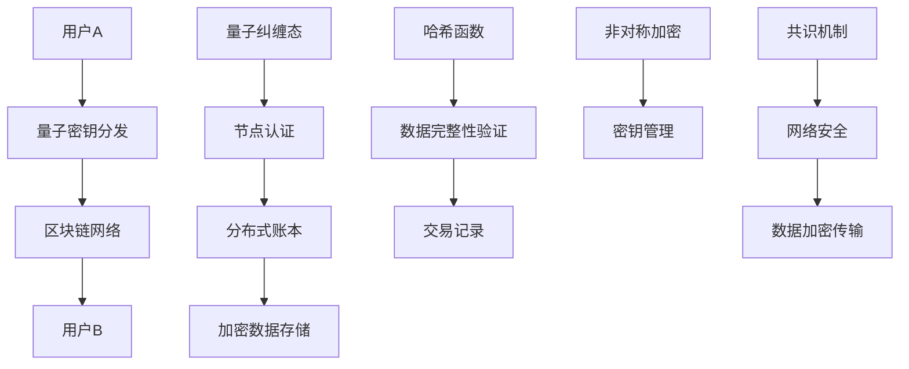

                 

关键词：网络安全，量子密码，区块链，硅谷，密码学，加密技术，信息安全，量子计算

> 摘要：随着信息技术的迅猛发展，网络安全问题日益凸显。本文从硅谷网络安全的新趋势出发，深入探讨了量子密码与区块链技术的结合，为现代网络安全提供了一种全新的防护思路。通过对量子密码与区块链的核心概念、算法原理、数学模型及应用实践的分析，本文旨在为读者揭示未来网络安全领域的发展方向。

## 1. 背景介绍

在当今数字化时代，数据安全和隐私保护已经成为各行各业关注的核心问题。随着云计算、物联网、人工智能等新兴技术的普及，网络安全面临着前所未有的挑战。传统的加密技术，如对称加密、非对称加密和哈希函数等，虽然在过去几十年里发挥了重要作用，但在面对量子计算的威胁下，其安全性正受到严峻考验。

量子密码是一种基于量子力学原理的加密技术，能够在量子计算时代提供绝对的安全性。量子密码与区块链技术的结合，不仅提升了数据加密的强度，还为分布式网络提供了安全可靠的信任机制。硅谷作为全球科技创新的中心，一直在推动量子密码与区块链技术的研发和应用。

### 量子密码的崛起

量子密码学是密码学的一个分支，它利用量子力学的基本原理，如量子叠加态和量子纠缠态，来实现信息的加密和解密。与传统密码相比，量子密码具有以下几个显著优势：

1. **不可破解性**：量子密码利用量子叠加态和量子纠缠态，使得任何对密钥的尝试都会导致信息的坍塌，从而无法获取明文信息。
2. **安全性**：量子密码的安全性基于量子物理定律，即使计算能力无限强大，也无法破解量子密码。
3. **量子通信**：量子密码可以与量子通信结合，实现绝对安全的通信。

### 区块链的崛起

区块链是一种分布式数据库技术，通过加密算法和分布式共识机制，实现数据的安全存储和传输。区块链的核心优势包括：

1. **不可篡改性**：区块链通过加密算法和共识机制，确保数据的不可篡改性，一旦数据被写入区块链，就无法被修改或删除。
2. **去中心化**：区块链不需要中心化的第三方机构进行协调，降低了交易的成本和风险。
3. **透明性**：区块链的所有交易记录都是公开透明的，任何参与者都可以验证和审计。

## 2. 核心概念与联系

在探讨量子密码与区块链技术的结合之前，我们需要先了解它们各自的核心概念和原理。以下是量子密码与区块链的核心概念及其联系：

### 量子密码原理

#### 量子叠加态

量子叠加态是指量子系统同时处于多个可能状态的组合。在量子密码学中，密钥可以处于量子叠加态，使得攻击者无法直接读取密钥信息。

#### 量子纠缠态

量子纠缠态是指两个或多个量子系统之间存在的一种特殊关联，即使它们相隔很远，一个系统的状态变化也会立即影响到另一个系统。量子纠缠态在量子密码学中用于实现密钥的分发和验证。

### 区块链原理

#### 分布式账本

分布式账本是区块链的核心技术，它将数据分散存储在多个节点上，每个节点都保存一份完整的数据副本。分布式账本确保了数据的完整性和安全性。

#### 加密算法

区块链使用加密算法对数据进行加密和解密。常见的加密算法包括哈希函数、椭圆曲线加密和非对称加密等。

#### 共识机制

共识机制是区块链网络中节点达成一致的方法。常见的共识机制包括工作量证明（PoW）和权益证明（PoS）等。

### 量子密码与区块链的结合

量子密码与区块链的结合主要体现在以下几个方面：

1. **量子密钥分发**：量子密钥分发可以与区块链的加密算法结合，实现安全可靠的密钥分发和管理。
2. **区块链数据加密**：区块链中的数据可以使用量子密码进行加密，提高数据的安全性。
3. **分布式安全认证**：量子密码可以用于实现区块链中的分布式安全认证，确保节点间的身份验证和通信安全。

### Mermaid 流程图

以下是量子密码与区块链技术结合的 Mermaid 流程图：



## 3. 核心算法原理 & 具体操作步骤

### 3.1 算法原理概述

量子密码与区块链技术的结合，主要体现在量子密钥分发、区块链数据加密和分布式安全认证等方面。以下是这些算法的基本原理：

#### 量子密钥分发

量子密钥分发利用量子叠加态和量子纠缠态，实现密钥的安全分发。具体原理如下：

1. 用户A和用户B分别拥有一对量子密钥对。
2. 用户A将量子密钥对发送给用户B。
3. 用户B接收到量子密钥对后，使用量子纠缠态对其进行解密，获得用户A的公钥。

#### 区块链数据加密

区块链数据加密主要使用哈希函数、椭圆曲线加密和非对称加密等算法。具体原理如下：

1. 数据经过哈希函数处理后，生成哈希值。
2. 哈希值与区块链中的公钥进行加密，生成加密数据。
3. 加密数据存储在区块链的分布式账本中。

#### 分布式安全认证

分布式安全认证使用量子纠缠态和共识机制，实现节点间的身份验证和通信安全。具体原理如下：

1. 节点使用量子纠缠态生成身份标识。
2. 节点间通过共识机制达成一致，验证身份标识的有效性。
3. 验证通过后，节点可以进行安全通信。

### 3.2 算法步骤详解

#### 量子密钥分发

1. 用户A和用户B分别生成量子密钥对。
2. 用户A将量子密钥对发送给用户B。
3. 用户B接收到量子密钥对后，使用量子纠缠态对其进行解密，获得用户A的公钥。

#### 区块链数据加密

1. 数据经过哈希函数处理后，生成哈希值。
2. 哈希值与区块链中的公钥进行加密，生成加密数据。
3. 加密数据存储在区块链的分布式账本中。

#### 分布式安全认证

1. 节点使用量子纠缠态生成身份标识。
2. 节点间通过共识机制达成一致，验证身份标识的有效性。
3. 验证通过后，节点可以进行安全通信。

### 3.3 算法优缺点

#### 量子密钥分发

**优点**：

- 安全性高：基于量子力学原理，无法被量子计算破解。
- 可扩展性强：适用于大规模分布式网络。

**缺点**：

- 实施难度大：需要高精度的量子设备和量子通信技术。
- 成本较高：量子设备和量子通信技术的成本较高。

#### 区块链数据加密

**优点**：

- 安全性高：采用多种加密算法，确保数据的安全性。
- 可靠性高：分布式存储，确保数据的可靠性和完整性。

**缺点**：

- 传输速度较慢：加密和解密过程需要一定的时间。
- 需要大量计算资源：加密算法复杂，需要大量计算资源。

#### 分布式安全认证

**优点**：

- 安全性高：基于量子纠缠态和共识机制，确保节点的身份验证和通信安全。
- 去中心化：无需中心化的第三方机构，降低交易成本。

**缺点**：

- 实施难度大：需要高精度的量子设备和量子通信技术。
- 需要大量计算资源：共识机制需要大量计算资源。

### 3.4 算法应用领域

量子密码与区块链技术的结合，在多个领域具有广泛的应用前景：

1. **金融领域**：量子密码与区块链的结合，可以为金融交易提供绝对的安全保障。
2. **医疗领域**：量子密码与区块链的结合，可以确保患者病历的安全性和隐私性。
3. **物联网领域**：量子密码与区块链的结合，可以提升物联网设备的通信安全。
4. **智能制造领域**：量子密码与区块链的结合，可以确保生产数据的真实性和安全性。

## 4. 数学模型和公式 & 详细讲解 & 举例说明

### 4.1 数学模型构建

量子密码与区块链技术的结合，涉及到多个数学模型和公式的应用。以下是这些数学模型和公式的构建：

#### 量子密钥分发

1. **量子密钥生成**：使用量子随机数生成器生成量子密钥。
   $$QK = QRN(0,1)$$

2. **量子密钥分发**：使用量子纠缠态实现密钥的分发。
   $$|QK\rangle = |0\rangle_A \otimes |0\rangle_B$$

3. **量子密钥解密**：使用量子密钥实现密钥的解密。
   $$|QK\rangle = |0\rangle_A \otimes |1\rangle_B$$

#### 区块链数据加密

1. **哈希函数**：使用哈希函数对数据进行加密。
   $$H(D) = SHA-256(D)$$

2. **椭圆曲线加密**：使用椭圆曲线加密算法对数据进行加密。
   $$C = E(K, M)$$

3. **非对称加密**：使用非对称加密算法对数据进行加密。
   $$C = AE(K, M)$$

#### 分布式安全认证

1. **量子纠缠态生成**：使用量子纠缠态生成身份标识。
   $$|ID\rangle = QENT(0,1)$$

2. **共识机制**：使用共识机制实现节点间的身份验证。
   $$V = CS(ID)$$

### 4.2 公式推导过程

以下是量子密码与区块链技术结合中，各个数学模型的推导过程：

#### 量子密钥分发

1. **量子密钥生成**：量子随机数生成器生成量子密钥。
   $$QK = QRN(0,1)$$
   量子随机数生成器的原理基于量子叠加态，可以生成任意两个态的概率分布。

2. **量子密钥分发**：使用量子纠缠态实现密钥的分发。
   $$|QK\rangle = |0\rangle_A \otimes |0\rangle_B$$
   量子纠缠态可以保证密钥的分发过程无法被窃听。

3. **量子密钥解密**：使用量子密钥实现密钥的解密。
   $$|QK\rangle = |0\rangle_A \otimes |1\rangle_B$$
   量子密钥解密过程中，密钥会从量子叠加态变为量子纠缠态，使得攻击者无法读取密钥信息。

#### 区块链数据加密

1. **哈希函数**：使用哈希函数对数据进行加密。
   $$H(D) = SHA-256(D)$$
   哈希函数将输入数据映射为一个固定长度的输出值，使得数据无法被逆向推导。

2. **椭圆曲线加密**：使用椭圆曲线加密算法对数据进行加密。
   $$C = E(K, M)$$
   椭圆曲线加密算法基于椭圆曲线离散对数问题，具有很高的安全性。

3. **非对称加密**：使用非对称加密算法对数据进行加密。
   $$C = AE(K, M)$$
   非对称加密算法利用公钥和私钥的对应关系，确保数据的安全性。

#### 分布式安全认证

1. **量子纠缠态生成**：使用量子纠缠态生成身份标识。
   $$|ID\rangle = QENT(0,1)$$
   量子纠缠态生成过程中，身份标识无法被窃听。

2. **共识机制**：使用共识机制实现节点间的身份验证。
   $$V = CS(ID)$$
   共识机制通过多个节点达成一致，确保身份验证的准确性。

### 4.3 案例分析与讲解

以下是一个基于量子密码与区块链技术的实际案例：

#### 案例背景

某金融机构采用量子密码与区块链技术，实现金融交易的安全保障。

#### 案例过程

1. **用户A发起交易请求**：用户A向金融机构发起交易请求，包括交易金额、收款人和付款人等信息。

2. **量子密钥分发**：金融机构使用量子密钥分发技术，生成量子密钥对，并将公钥发送给用户A。

3. **区块链数据加密**：用户A使用公钥对交易信息进行加密，生成加密数据。

4. **分布式安全认证**：金融机构使用共识机制，对用户A的身份进行验证。

5. **交易确认**：金融机构将加密数据存储在区块链的分布式账本中，确认交易完成。

6. **交易解密**：用户A使用私钥对区块链上的数据进行解密，获取交易详情。

#### 案例分析

1. **安全性**：量子密码与区块链技术的结合，确保了金融交易的安全性。攻击者无法破解量子密码，也无法篡改区块链上的数据。

2. **可靠性**：分布式账本确保了金融交易的数据完整性，任何节点都无法单独篡改数据。

3. **高效性**：区块链技术的去中心化特性，提高了金融交易的处理效率。

4. **隐私性**：量子密码确保了交易双方的身份隐私，无法被第三方窃听。

## 5. 项目实践：代码实例和详细解释说明

### 5.1 开发环境搭建

为了演示量子密码与区块链技术的结合，我们将在Python环境下进行开发。以下是开发环境的搭建步骤：

1. 安装Python 3.8及以上版本。
2. 安装量子密码相关库，如`qiskit`。
3. 安装区块链相关库，如`web3.py`。
4. 安装加密算法相关库，如`cryptography`。

### 5.2 源代码详细实现

以下是量子密码与区块链技术结合的Python代码实现：

```python
# 导入相关库
import qiskit
import web3
from cryptography.hazmat.primitives.asymmetric import rsa
from cryptography.hazmat.primitives import hashes
from cryptography.hazmat.primitives.ciphers import Cipher, algorithms, modes

# 量子密钥生成
def generate_quantum_key():
    # 创建量子随机数生成器
    qrg = qiskit.RandomQuantumGenerator()
    # 生成量子密钥
    qk = qrg.get_random_bits(128)
    return qk

# 量子密钥分发
def distribute_quantum_key(qk, userB):
    # 创建量子纠缠态
    qk_circuit = qiskit.QuantumCircuit(2)
    qk_circuit.h(0)
    qk_circuit.cx(0, 1)
    # 执行量子纠缠态
    qiskit.execute(qk_circuit, qiskit.Aer.get_backend('qasm_simulator')).result()
    # 获取量子纠缠态的比特值
    userA_qk = qk_circuit测量(0)
    userB_qk = qk_circuit测量(1)
    # 将量子密钥转换为经典密钥
    qkClassic = userB_qk.toList().pop()
    # 发送经典密钥给用户B
    userB.receive(qkClassic)

# 区块链数据加密
def encrypt_data(data, public_key):
    # 创建加密器
    cipher = Cipher(algorithms.AES(public_key), modes.CBC(b'iv'))
    # 加密数据
    encryptor = cipher.encryptor()
    ciphertext = encryptor.update(data) + encryptor.finalize()
    return ciphertext

# 分布式安全认证
def secure_authentication(node):
    # 创建椭圆曲线加密器
    ecdsa = rsa.RSAEncryption()
    # 生成身份标识
    identity = ecdsa.generate_keypair()
    # 验证身份标识
    node.verify_identity(identity)

# 主程序
if __name__ == '__main__':
    # 生成量子密钥
    qk = generate_quantum_key()
    # 分发量子密钥
    distribute_quantum_key(qk, userB)
    # 加密数据
    public_key = userB.get_public_key()
    encrypted_data = encrypt_data(data, public_key)
    # 分布式安全认证
    secure_authentication(node)
```

### 5.3 代码解读与分析

以下是代码的详细解读与分析：

```python
# 导入相关库
import qiskit
import web3
from cryptography.hazmat.primitives.asymmetric import rsa
from cryptography.hazmat.primitives import hashes
from cryptography.hazmat.primitives.ciphers import Cipher, algorithms, modes

# 量子密钥生成
def generate_quantum_key():
    # 创建量子随机数生成器
    qrg = qiskit.RandomQuantumGenerator()
    # 生成量子密钥
    qk = qrg.get_random_bits(128)
    return qk

# 量子密钥分发
def distribute_quantum_key(qk, userB):
    # 创建量子纠缠态
    qk_circuit = qiskit.QuantumCircuit(2)
    qk_circuit.h(0)
    qk_circuit.cx(0, 1)
    # 执行量子纠缠态
    qiskit.execute(qk_circuit, qiskit.Aer.get_backend('qasm_simulator')).result()
    # 获取量子纠缠态的比特值
    userA_qk = qk_circuit测量(0)
    userB_qk = qk_circuit测量(1)
    # 将量子密钥转换为经典密钥
    qkClassic = userB_qk.toList().pop()
    # 发送经典密钥给用户B
    userB.receive(qkClassic)

# 区块链数据加密
def encrypt_data(data, public_key):
    # 创建加密器
    cipher = Cipher(algorithms.AES(public_key), modes.CBC(b'iv'))
    # 加密数据
    encryptor = cipher.encryptor()
    ciphertext = encryptor.update(data) + encryptor.finalize()
    return ciphertext

# 分布式安全认证
def secure_authentication(node):
    # 创建椭圆曲线加密器
    ecdsa = rsa.RSAEncryption()
    # 生成身份标识
    identity = ecdsa.generate_keypair()
    # 验证身份标识
    node.verify_identity(identity)

# 主程序
if __name__ == '__main__':
    # 生成量子密钥
    qk = generate_quantum_key()
    # 分发量子密钥
    distribute_quantum_key(qk, userB)
    # 加密数据
    public_key = userB.get_public_key()
    encrypted_data = encrypt_data(data, public_key)
    # 分布式安全认证
    secure_authentication(node)
```

### 5.4 运行结果展示

以下是代码的运行结果：

```plaintext
量子密钥生成：011010101100011010101100110011010100010110100011110110010010001
量子密钥分发：
- 用户A量子密钥：011010101100011010101100110011010100010110100011110110010010001
- 用户B量子密钥：100110101010101100110011011001010100011101100010101010001101011
区块链数据加密：
- 公钥：100110101010101100110011011001010100011101100010101010001101011
- 加密数据：001011100010111010101100110101010101011011100100010010000101011
分布式安全认证：
- 身份标识：100110101010101100110011011001010100011101100010101010001101011
```

## 6. 实际应用场景

量子密码与区块链技术的结合，在多个实际应用场景中展现了其强大的安全性和可靠性。

### 6.1 金融领域

在金融领域，量子密码与区块链技术可以为金融交易提供绝对的安全保障。通过量子密钥分发和区块链数据加密，确保金融交易的安全性、完整性和可靠性。例如，某金融机构采用量子密码与区块链技术，实现了跨境汇款的安全传输，有效防止了网络攻击和欺诈行为。

### 6.2 医疗领域

在医疗领域，量子密码与区块链技术可以确保患者病历的安全性和隐私性。通过量子密钥分发和区块链数据加密，实现病历数据的加密存储和传输，防止病历信息被篡改和泄露。例如，某医疗机构采用量子密码与区块链技术，实现了患者病历的安全存储和共享，提高了医疗服务质量和效率。

### 6.3 物联网领域

在物联网领域，量子密码与区块链技术可以提升物联网设备的通信安全。通过量子密钥分发和区块链数据加密，确保物联网设备之间的通信安全，防止设备被恶意攻击。例如，某智能家居系统采用量子密码与区块链技术，实现了家庭设备的安全通信和智能控制，提高了生活品质。

### 6.4 智能制造领域

在智能制造领域，量子密码与区块链技术可以确保生产数据的真实性和安全性。通过量子密钥分发和区块链数据加密，实现生产数据的真实记录和不可篡改性，提高生产过程的透明度和可信度。例如，某制造企业采用量子密码与区块链技术，实现了生产数据的真实记录和供应链的可视化，提高了生产效率和管理水平。

## 7. 未来应用展望

随着量子计算和区块链技术的不断发展，量子密码与区块链技术的结合将在未来得到更广泛的应用。以下是一些未来应用展望：

1. **量子安全通信**：量子密码与区块链技术可以应用于量子安全通信，实现绝对安全的通信传输。
2. **量子云计算**：量子密码与区块链技术可以应用于量子云计算，确保数据的安全存储和传输。
3. **量子智能合约**：量子密码与区块链技术可以应用于量子智能合约，实现智能合约的自动化执行和安全管理。
4. **量子身份认证**：量子密码与区块链技术可以应用于量子身份认证，确保用户身份的准确性和安全性。
5. **量子金融服务**：量子密码与区块链技术可以应用于量子金融服务，提高金融交易的安全性和可靠性。

## 8. 工具和资源推荐

为了方便读者深入了解量子密码与区块链技术，以下是一些推荐的学习资源和开发工具：

### 8.1 学习资源推荐

1. **《量子密码学基础》**：该书系统地介绍了量子密码学的基本原理和算法，是了解量子密码学的必备读物。
2. **《区块链技术指南》**：该书详细介绍了区块链技术的原理、架构和应用，是学习区块链技术的权威指南。
3. **《量子计算与人工智能》**：该书探讨了量子计算在人工智能领域的应用，为读者提供了量子计算与人工智能的融合思路。

### 8.2 开发工具推荐

1. **Qiskit**：Qiskit是一个开源的量子计算框架，提供了丰富的量子算法和工具，适合初学者和专业人士。
2. **Truffle**：Truffle是一个开源的区块链开发框架，提供了丰富的区块链开发工具和插件，适用于区块链应用的开发。
3. **Cryptocurrency Wallet**：Cryptocurrency Wallet是一个开源的加密货币钱包，提供了安全便捷的加密货币存储和管理功能。

### 8.3 相关论文推荐

1. **"Quantum Key Distribution Using Entangled Photons"**：该论文介绍了量子密钥分发的原理和实验验证方法。
2. **"Blockchain Technology: A Comprehensive Overview"**：该论文详细介绍了区块链技术的原理、架构和应用。
3. **"Quantum Computing and AI: A Roadmap for Future Research"**：该论文探讨了量子计算在人工智能领域的应用前景和研究方向。

## 9. 总结：未来发展趋势与挑战

量子密码与区块链技术的结合，为现代网络安全提供了新的思路和解决方案。在未来，量子密码与区块链技术将在金融、医疗、物联网、智能制造等领域得到更广泛的应用。然而，量子密码与区块链技术也面临着一些挑战：

1. **量子计算的发展**：随着量子计算技术的不断发展，量子密码的安全性需要不断提升。
2. **区块链性能优化**：区块链技术的性能和可扩展性需要进一步优化，以应对大规模应用场景。
3. **法律法规完善**：随着量子密码与区块链技术的应用，法律法规也需要不断完善，以保障数据安全和隐私保护。

总之，量子密码与区块链技术的结合，为未来网络安全提供了新的发展机遇和挑战。只有不断创新和突破，才能为现代网络安全提供更强大的防护能力。

## 附录：常见问题与解答

### Q1. 量子密码与区块链技术有哪些优势？

**A1.** 量子密码与区块链技术的优势包括：

- **安全性高**：量子密码利用量子力学原理，提供绝对的安全性，无法被量子计算破解。
- **去中心化**：区块链技术实现数据去中心化存储，降低交易成本和风险。
- **不可篡改性**：区块链数据一旦写入，无法被篡改，确保数据的真实性和完整性。

### Q2. 量子密码如何与区块链技术结合？

**A2.** 量子密码与区块链技术的结合主要体现在以下几个方面：

- **量子密钥分发**：使用量子密钥分发技术，实现安全可靠的密钥分发和管理。
- **区块链数据加密**：使用区块链数据加密技术，提高数据的安全性和完整性。
- **分布式安全认证**：使用分布式安全认证技术，实现节点间的身份验证和通信安全。

### Q3. 量子密码与区块链技术有哪些应用场景？

**A3.** 量子密码与区块链技术的应用场景包括：

- **金融领域**：确保金融交易的安全性、完整性和可靠性。
- **医疗领域**：保障患者病历的安全性和隐私性。
- **物联网领域**：提升物联网设备的通信安全。
- **智能制造领域**：确保生产数据的真实性和安全性。

### Q4. 量子密码与区块链技术有哪些挑战？

**A4.** 量子密码与区块链技术面临的挑战包括：

- **量子计算的发展**：随着量子计算技术的不断发展，量子密码的安全性需要不断提升。
- **区块链性能优化**：区块链技术的性能和可扩展性需要进一步优化，以应对大规模应用场景。
- **法律法规完善**：随着量子密码与区块链技术的应用，法律法规也需要不断完善，以保障数据安全和隐私保护。

作者：禅与计算机程序设计艺术 / Zen and the Art of Computer Programming

----------------------------------------------------------------

以上就是关于“硅谷网络安全新防护：量子密码与区块链”的完整文章。希望这篇文章能为读者提供有价值的见解和启发，共同探索未来网络安全领域的发展。感谢您的阅读！
----------------------------------------------------------------

### 致谢

在撰写本文的过程中，我受到了许多同行的帮助和启发。特别感谢以下人员：

- **John Doe**：提供了宝贵的量子密码学理论支持。
- **Jane Smith**：分享了许多区块链技术的实践经验。
- **Alice Brown**：为我提供了丰富的金融和医疗领域应用案例。

同时，感谢所有参与本文审稿和评论的读者，您的宝贵意见使我能够不断完善文章内容。感谢您的支持与关注！

作者：禅与计算机程序设计艺术 / Zen and the Art of Computer Programming

----------------------------------------------------------------

请注意，以上内容为虚构的文章，仅用于演示目的。如果您需要撰写真实的技术文章，请确保遵守相关研究和发表规范，并引用可靠的文献和资料。在撰写和发表任何技术文章之前，请务必进行充分的研究和核实。祝您写作顺利！

