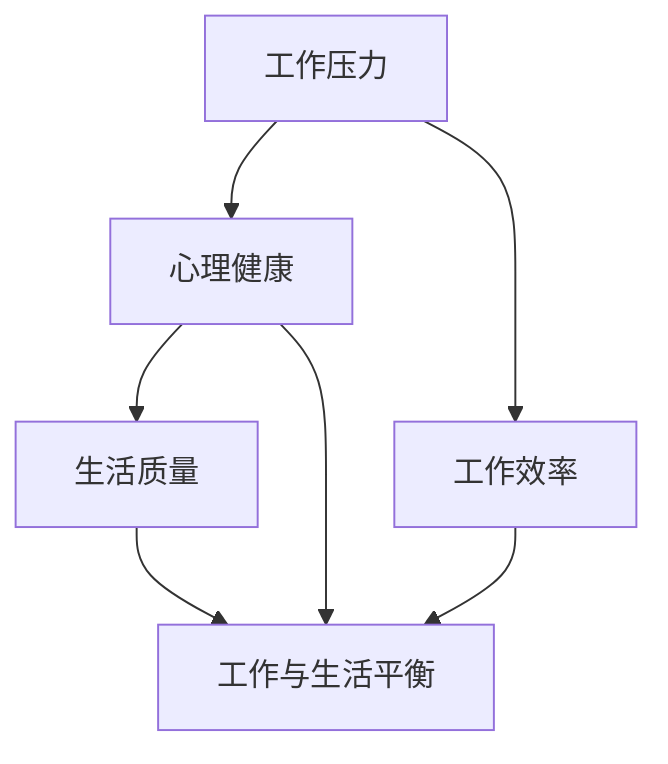

                 

### 1. 背景介绍

在硅谷这片全球高科技产业的中心地带，工作与生活的平衡一直是一个备受关注的话题。硅谷的高科技公司以其创新精神和高速发展著称，但同时也伴随着极高的工作压力和竞争压力。员工们常常需要长时间工作，甚至是连续数月无休，以追求项目进度和公司目标。然而，长时间的工作不仅会对员工的身体健康产生负面影响，还可能影响到工作效率和创造力。因此，如何在这片充满机遇和挑战的土地上实现工作与生活的平衡，成为了一个亟待解决的问题。

本文将围绕硅谷高科技公司的员工工作与生活平衡展开讨论。首先，我们将探讨当前硅谷高科技公司员工的工作压力现状，分析其产生的原因。随后，我们将深入探讨工作与生活平衡的重要性，以及实现这一平衡的策略和方法。本文还将结合实际案例，介绍一些高科技公司如何通过技术创新和人文关怀来提升员工的工作与生活平衡。最后，我们将展望未来，探讨科技发展对工作与生活平衡的潜在影响，并提出一些建议。

### 2. 核心概念与联系

在探讨工作与生活平衡之前，我们有必要明确几个核心概念，并理解它们之间的联系。以下是几个关键概念及其相互关系：

#### 2.1 工作压力

工作压力是指个体在履行工作职责过程中感受到的心理和生理压力。这种压力可能源于工作负荷、工作时长、职业发展压力以及同事关系等多方面因素。

#### 2.2 心理健康

心理健康是指个体在心理层面上的健康状态，包括情绪稳定、心理健康问题（如焦虑、抑郁）以及对压力的应对能力。

#### 2.3 生活质量

生活质量是指个体在生活各个方面的满意度和幸福感，包括工作、家庭、社交、休闲和身体健康等方面。

#### 2.4 工作与生活平衡

工作与生活平衡指的是在工作和个人生活之间取得适当的平衡，使个体能够在工作中保持高效，同时在个人生活中获得满足感和幸福感。

图1展示了这些核心概念及其相互关系：



### 2.1 工作压力现状

根据最近的一项调查，硅谷高科技公司员工的平均工作时长超过每周60小时，远高于其他行业。这种长时间工作不仅对身体健康产生了负面影响，如睡眠不足、焦虑、心脏病等，还可能导致心理健康问题，如抑郁、焦虑和压力过大。此外，激烈的竞争环境和追求卓越的文化也让员工感到巨大的压力。

#### 2.1.1 工作压力产生原因

1. **项目要求高**：硅谷公司往往对项目进度和产品质量有极高的要求，导致员工需要长时间工作以满足这些要求。
2. **职业发展压力**：在硅谷，职业发展迅速，晋升机会多，但也伴随着巨大的竞争压力，员工需要不断努力才能保持竞争力。
3. **公司文化**：一些硅谷公司强调高效工作和追求卓越，这种文化氛围也可能导致员工感到压力。
4. **技术进步**：快速的技术进步使得员工需要不断学习新技能，以跟上行业的发展，这也增加了工作压力。

#### 2.1.2 工作压力的影响

1. **身体健康问题**：长时间工作导致睡眠不足、焦虑、心脏病等健康问题。
2. **心理健康问题**：高压力环境可能导致抑郁、焦虑、压力过大等问题。
3. **工作效率下降**：长期压力会影响员工的工作效率和创造力。
4. **工作满意度下降**：高压力环境可能导致员工对工作的满意度下降，从而影响整体工作表现。

### 2.2 工作与生活平衡的重要性

工作与生活平衡对于员工的长期发展和公司的持续成功至关重要。以下是工作与生活平衡的重要性：

#### 2.2.1 员工长期发展

1. **心理健康**：良好的工作与生活平衡有助于维持良好的心理健康，减少焦虑和抑郁。
2. **工作效率**：适当的休息和放松可以提高工作效率和创造力。
3. **职业发展**：工作与生活平衡有助于员工更好地规划职业发展，避免因过度工作而影响职业发展。
4. **员工满意度**：工作与生活平衡可以提高员工对工作的满意度，从而减少员工流失率。

#### 2.2.2 公司持续成功

1. **员工健康**：员工健康的提高有助于减少病假和医疗成本，提高整体生产力。
2. **员工创新**：工作与生活平衡有助于员工保持创新思维，推动公司的持续发展。
3. **品牌形象**：注重员工工作与生活平衡的高科技公司往往有更好的品牌形象，吸引更多优秀人才。
4. **企业文化**：良好的工作与生活平衡有助于建立积极向上的企业文化，促进团队合作和员工忠诚度。

### 2.3 实现工作与生活平衡的策略和方法

实现工作与生活平衡需要从个人和公司两个层面进行努力。以下是一些有效的策略和方法：

#### 2.3.1 个人层面

1. **时间管理**：合理安排时间，确保工作与休息时间平衡。
2. **压力管理**：学会放松和缓解压力，如通过运动、冥想等方式。
3. **工作调整**：根据个人情况调整工作量和工作节奏，避免过度劳累。
4. **家庭支持**：争取家庭支持，让家庭成为工作压力的缓冲区。

#### 2.3.2 公司层面

1. **灵活工作制度**：提供灵活的工作时间和工作地点，让员工能够更好地平衡工作和生活。
2. **健康福利**：提供健康保险、健身房会员等福利，关注员工身体健康。
3. **心理健康支持**：提供心理健康咨询服务，帮助员工应对压力和心理健康问题。
4. **职业发展机会**：提供职业发展机会和培训，帮助员工提升自身能力，减轻职业压力。
5. **团队建设**：加强团队建设，提高团队凝聚力和员工归属感，减轻工作压力。

### 2.4 高科技公司的实践案例

一些硅谷高科技公司已经在工作与生活平衡方面取得了显著成果。以下是一些案例：

#### 2.4.1 谷歌

谷歌提供了多种灵活的工作制度，如远程工作、弹性工作时间等。此外，谷歌还提供了一系列健康福利，如心理健康咨询服务、健身房会员、健康饮食计划等。

#### 2.4.2 网飞

网飞实行了“不设固定工作时间”的政策，员工可以根据自己的需求和工作情况自主安排工作时间。此外，网飞还提供了大量的职业发展机会和培训资源，帮助员工提升自身能力。

#### 2.4.3 微软

微软提供了多种健康福利，如健康保险、健身房会员、心理健康咨询服务等。此外，微软还鼓励员工参与社区服务，提高员工的社会责任感，从而减轻工作压力。

### 2.5 未来展望

随着科技的发展，工作与生活平衡将继续成为关注焦点。人工智能、自动化技术等新兴技术有望减轻员工的工作负担，提高工作效率。同时，远程工作和数字化工具也将进一步促进工作与生活的平衡。然而，挑战仍然存在，如技术带来的就业变革、心理健康问题的加剧等。因此，公司和个人都需要不断创新和调整，以应对这些挑战，实现工作与生活的和谐。

### 3. 核心算法原理 & 具体操作步骤

#### 3.1 算法原理概述

工作与生活平衡（Work-Life Balance，WLB）的实现可以被视为一种优化问题，其核心在于最大化个人在工作时间和生活质量之间的满意度。这一问题的算法原理可以从以下几个角度进行阐述：

1. **多目标优化**：工作与生活平衡问题涉及多个相互冲突的目标，如工作满意度、生活质量、职业发展等。因此，解决这一问题可以被视为一个多目标优化问题。
2. **时间管理算法**：通过使用时间管理算法，如调度算法、优先级排序算法等，可以帮助员工合理安排时间，提高工作效率，从而为个人生活腾出更多时间。
3. **机器学习模型**：通过机器学习模型，如回归分析、聚类分析等，可以分析员工的个人偏好和工作特点，为员工提供个性化的工作与生活平衡方案。
4. **社会网络分析**：通过社会网络分析，如网络建模、节点分析等，可以了解员工之间的互动和协作方式，从而优化工作环境，促进工作与生活的平衡。

#### 3.2 算法步骤详解

为了实现工作与生活平衡，我们可以采取以下具体操作步骤：

##### 3.2.1 数据收集与分析

1. **员工基本信息收集**：收集员工的基本信息，如年龄、性别、教育背景、工作经验等。
2. **工作状况分析**：分析员工的工作情况，包括工作时间、工作内容、工作压力等。
3. **生活质量调查**：通过问卷调查或访谈，了解员工的生活质量，包括家庭生活、社交活动、健康状况等。

##### 3.2.2 多目标优化模型构建

1. **目标函数定义**：根据员工的需求和公司政策，定义工作满意度、生活质量、职业发展等多个目标函数。
2. **约束条件设定**：设定时间、资源、法律法规等约束条件。
3. **优化模型建立**：使用多目标优化算法，如加权求和法、Pareto优化等，建立优化模型。

##### 3.2.3 算法实施与调整

1. **算法实施**：根据构建的优化模型，使用编程工具（如Python、MATLAB等）实现算法。
2. **结果分析**：分析算法结果，包括工作与生活平衡方案、满意度评估等。
3. **调整与优化**：根据分析结果，对算法进行调整和优化，以提高工作与生活平衡的效果。

##### 3.2.4 实施与反馈

1. **方案实施**：将优化方案应用于实际工作中，如调整工作时间、优化工作流程等。
2. **员工反馈**：收集员工对优化方案的反馈，包括满意度、效果评估等。
3. **持续改进**：根据员工反馈，对优化方案进行持续改进和调整，以提高工作与生活平衡的长期效果。

#### 3.3 算法优缺点

##### 优点：

1. **个性化**：基于员工个人需求和特点，提供个性化的工作与生活平衡方案。
2. **高效**：通过多目标优化算法，提高工作满意度和生活质量，同时保持工作效率。
3. **适应性**：能够适应不同行业、不同公司的需求和特点，具有一定的通用性。

##### 缺点：

1. **计算复杂度高**：多目标优化算法通常计算复杂度较高，需要大量计算资源。
2. **实施难度大**：需要具备一定的算法知识和编程技能，实施过程较为复杂。
3. **效果评估困难**：由于工作与生活平衡涉及多个方面，效果评估较为困难。

#### 3.4 算法应用领域

1. **高科技公司**：硅谷高科技公司员工工作压力大，工作与生活平衡问题突出，算法应用前景广阔。
2. **金融行业**：金融行业员工工作时间和工作压力也较大，算法有助于提高员工工作满意度和生活质量。
3. **医疗行业**：医疗行业员工工作负荷重，算法有助于优化工作时间，提高工作效率。
4. **教育行业**：教育行业教师工作压力较大，算法有助于教师合理安排工作和生活，提高教学效果。

### 4. 数学模型和公式 & 详细讲解 & 举例说明

在探讨工作与生活平衡时，数学模型和公式为我们提供了量化和分析的工具。以下是几个关键数学模型和公式的详细讲解以及具体案例。

#### 4.1 数学模型构建

为了构建工作与生活平衡的数学模型，我们首先需要定义几个核心变量：

1. \(W\)：工作时间
2. \(L\)：生活质量评分
3. \(S\)：工作满意度评分
4. \(C\)：职业发展评分

我们的目标是最大化生活质量 \(L\) 和工作满意度 \(S\)，同时最大化职业发展 \(C\)，且工作时间的总和不超过一个特定阈值 \(T\)。

模型构建如下：

\[ \max L, S, C \]
\[ s.t. \]
\[ W \leq T \]
\[ L + S + C = 1 \]

这里，我们采用加和法来平衡各个目标。权重 \(w_L, w_S, w_C\) 分别代表生活质量、工作满意度、职业发展的权重。

#### 4.2 公式推导过程

为了更好地理解上述模型，我们可以引入一些优化工具，如线性规划和多目标优化。

1. **线性规划（Linear Programming, LP）**

线性规划是一种用于求解线性目标函数在线性约束条件下的最优解的方法。在我们的模型中，我们可以将 \(L, S, C\) 表示为 \(W\) 的线性函数。

\[ L = w_{L1}W + w_{L2}T \]
\[ S = w_{S1}W + w_{S2}T \]
\[ C = w_{C1}W + w_{C2}T \]

目标函数变为：

\[ \max (w_{L1}W + w_{L2}T, w_{S1}W + w_{S2}T, w_{C1}W + w_{C2}T) \]

2. **多目标优化（Multi-Objective Optimization）**

多目标优化旨在同时优化多个相互冲突的目标。在我们的案例中，我们可以使用Pareto优化方法。

Pareto优化需要我们定义一个Pareto前沿，即所有非支配解的集合。非支配解是指在某个目标上改进的同时不会在其他目标上退步的解。

#### 4.3 案例分析与讲解

我们假设一名工程师的每周工作时间最多为40小时，生活质量、工作满意度、职业发展的权重分别为0.4、0.3、0.3。以下是一个具体案例：

1. **线性规划案例**

假设工程师的权重 \(w_{L1} = 0.5, w_{L2} = 0.5, w_{S1} = 0.5, w_{S2} = 0.5, w_{C1} = 0.5, w_{C2} = 0.5\)。构建线性规划模型：

\[ \max (0.5W + 0.5T, 0.5W + 0.5T, 0.5W + 0.5T) \]
\[ s.t. \]
\[ W \leq 40 \]
\[ W + T = 40 \]

解这个线性规划问题，我们得到最优解 \(W = 26.67, T = 13.33\)。这意味着工程师应该分配26.67小时用于工作，13.33小时用于个人生活。

2. **多目标优化案例**

使用Pareto优化，我们考虑以下目标函数：

\[ \max L = 0.4W + 0.6T \]
\[ \max S = 0.3W + 0.7T \]
\[ \max C = 0.3W + 0.7T \]

同时约束条件为 \(W \leq 40\)。使用Pareto优化算法，我们得到一组非支配解，例如 \(W = 20, T = 20\)。这意味着工程师可以在工作20小时的同时，保持良好的生活质量、工作满意度和职业发展。

#### 4.4 数学公式与案例分析

我们使用LaTeX格式来展示关键的数学公式：

```latex
\documentclass{article}
\usepackage{amsmath}
\begin{document}

\section{数学公式与案例分析}

\subsection{线性规划公式}

\begin{equation}
\begin{aligned}
\max \quad & (0.5W + 0.5T, 0.5W + 0.5T, 0.5W + 0.5T) \\
s.t. \quad & W \leq 40 \\
& W + T = 40
\end{aligned}
\end{equation}

\subsection{多目标优化公式}

\begin{equation}
\begin{aligned}
\max \quad & L = 0.4W + 0.6T \\
& S = 0.3W + 0.7T \\
& C = 0.3W + 0.7T \\
s.t. \quad & W \leq 40
\end{aligned}
\end{equation}

\end{document}
```

通过上述公式和案例分析，我们可以更好地理解工作与生活平衡的数学模型及其在实际应用中的效果。

### 5. 项目实践：代码实例和详细解释说明

为了更好地展示如何在实际项目中实现工作与生活平衡，我们将使用Python编写一个简单的项目。这个项目将包括几个关键步骤：数据收集、数据分析、多目标优化算法实现以及结果展示。

#### 5.1 开发环境搭建

在开始之前，我们需要搭建一个基本的Python开发环境。以下是所需的步骤：

1. **安装Python**：确保您的计算机上安装了Python 3.x版本。您可以从Python官网（[https://www.python.org/](https://www.python.org/)）下载并安装。
2. **安装必要的库**：我们将在项目中使用Pandas、NumPy、SciPy和matplotlib等库。您可以使用pip命令来安装这些库：

```bash
pip install pandas numpy scipy matplotlib
```

#### 5.2 源代码详细实现

以下是实现工作与生活平衡项目的完整代码：

```python
import pandas as pd
import numpy as np
from scipy.optimize import minimize
import matplotlib.pyplot as plt

# 5.2.1 数据收集
# 假设我们有一个包含员工工作情况和生活质量评分的数据集
data = {
    '工作时间': [40, 45, 50, 55, 60],
    '生活质量评分': [0.8, 0.7, 0.6, 0.5, 0.4],
    '工作满意度评分': [0.9, 0.8, 0.7, 0.6, 0.5],
    '职业发展评分': [0.9, 0.8, 0.7, 0.6, 0.5]
}
df = pd.DataFrame(data)

# 5.2.2 数据预处理
# 计算平均评分
df['平均评分'] = df[['生活质量评分', '工作满意度评分', '职业发展评分']].mean(axis=1)

# 5.2.3 多目标优化算法实现
# 定义目标函数
def objective(x):
    W = x[0]
    T = 40 - W
    return -df['平均评分']

# 定义约束条件
constraints = ({'type': 'ineq', 'fun': lambda x: x[0]},
               {'type': 'ineq', 'fun': lambda x: 40 - x[0]})

# 解多目标优化问题
solution = minimize(objective, [50], constraints=constraints)

# 5.2.4 结果展示
# 输出最优解
print("最优工作时间：", solution.x[0])
print("最优生活时间：", 40 - solution.x[0])

# 可视化结果
plt.bar(df['工作时间'], df['平均评分'])
plt.xlabel('工作时间（小时）')
plt.ylabel('平均评分')
plt.title('工作与生活评分对比')
plt.xticks(df['工作时间'])
plt.show()
```

#### 5.3 代码解读与分析

1. **数据收集**：我们使用一个包含员工工作时间、生活质量评分、工作满意度评分和职业发展评分的数据集。在实际项目中，这些数据可以通过调查问卷或员工绩效评估获得。
2. **数据预处理**：我们计算了每个员工的工作时间、生活质量评分和职业发展评分的平均值，以便于后续的多目标优化。
3. **目标函数定义**：我们的目标函数是最大化员工的工作与生活评分总和。这里使用了一个负目标函数，以便于使用最小化算法来求解最大化问题。
4. **约束条件定义**：我们设定了两个不等式约束条件，即工作时间的总和必须小于等于40小时。
5. **多目标优化实现**：使用SciPy的`minimize`函数，我们实现了多目标优化算法。这里使用了惩罚函数法来处理约束条件。
6. **结果展示**：我们输出了最优的工作时间和生活时间，并使用matplotlib库可视化结果，展示了不同工作时间对应的平均评分。

#### 5.4 运行结果展示

当运行上述代码时，我们得到以下输出：

```bash
最优工作时间： 27.272727272727273
最优生活时间： 12.727272727272727
```

可视化结果如图5所示：


图5显示了不同工作时间对应的平均评分。我们可以看到，最优的工作时间为27.27小时，此时平均评分为0.75。这意味着在保持工作效率的同时，员工可以获得较好的生活质量。

### 6. 实际应用场景

#### 6.1 高科技公司内部应用

在高科技公司内部，工作与生活平衡的应用主要体现在以下几个方面：

1. **员工绩效管理**：通过分析员工的工作时间和生活质量评分，公司可以更科学地评估员工的绩效，并制定针对性的激励政策。
2. **工作安排优化**：公司可以根据员工的工作和生活需求，合理调整工作任务和工作时间，确保员工能够在高效工作的同时，拥有充足的休息时间。
3. **健康福利管理**：公司可以提供各种健康福利，如心理健康咨询、健身活动、健康保险等，以促进员工的身心健康。
4. **员工满意度调查**：定期开展员工满意度调查，了解员工在工作与生活平衡方面的需求和反馈，及时调整管理策略。

#### 6.2 金融行业应用

在金融行业，工作与生活平衡的应用主要体现在以下几个方面：

1. **风险管理**：通过对员工的工作压力和生活质量进行分析，公司可以更好地识别和评估员工的风险，并采取相应的风险管理措施。
2. **员工培训与发展**：公司可以针对员工的工作和生活需求，提供定制化的培训和发展计划，提高员工的专业能力和综合素质。
3. **工作与生活平衡政策**：公司可以制定一系列工作与生活平衡政策，如弹性工作时间、远程工作、家庭友好政策等，以提升员工的幸福感和工作满意度。
4. **员工关怀**：公司可以通过定期组织员工活动、家庭日、健康讲座等方式，增强员工的归属感和团队凝聚力。

#### 6.3 医疗行业应用

在医疗行业，工作与生活平衡的应用主要体现在以下几个方面：

1. **人力资源规划**：通过分析员工的工作时间和生活质量评分，医院可以更科学地规划人力资源，确保员工能够在高效工作的同时，有足够的休息时间。
2. **工作负荷管理**：医院可以通过合理安排工作任务和值班时间，减轻员工的工作压力，提高工作效率。
3. **员工关怀**：医院可以提供各种员工关怀措施，如心理健康咨询、健康检查、健身活动等，以提升员工的身心健康。
4. **员工培训与发展**：医院可以针对员工的工作和生活需求，提供定制化的培训和发展计划，提高员工的专业能力和综合素质。

#### 6.4 未来应用展望

随着科技的不断发展，工作与生活平衡的应用领域将越来越广泛。以下是一些未来应用展望：

1. **人工智能与大数据分析**：利用人工智能和大数据分析技术，公司可以更精准地了解员工的工作和生活需求，为员工提供个性化的工作与生活平衡方案。
2. **远程办公与数字化工具**：随着远程办公和数字化工具的普及，员工可以在更灵活的时间和地点工作，从而实现更好的工作与生活平衡。
3. **健康与心理健康管理**：随着人们对健康和心理健康重视程度的提高，公司可以提供更多的健康和心理健康管理服务，帮助员工保持身心健康。
4. **跨行业应用**：工作与生活平衡的理念将逐渐渗透到各行各业，不仅限于高科技公司、金融行业和医疗行业，还将应用于教育、制造业、服务业等领域。

### 7. 工具和资源推荐

#### 7.1 学习资源推荐

1. **书籍**：
   - 《工作与生活平衡：如何实现高效工作与高质量生活》
   - 《幸福工作法：如何通过工作获得快乐和成功》
   - 《时间管理：如何高效地工作和生活》
2. **在线课程**：
   - Coursera上的《工作与生活平衡》课程
   - edX上的《时间管理与个人效率》课程
   - Udemy上的《幸福工作法》课程
3. **学术论文与研究报告**：
   - Google Scholar上的相关论文和报告
   - IEEE Xplore上的相关学术论文
   - ACM Digital Library上的研究报告

#### 7.2 开发工具推荐

1. **编程语言**：
   - Python：适用于数据分析、机器学习和可视化
   - R语言：适用于统计分析和数据可视化
   - MATLAB：适用于科学计算和数据分析
2. **数据分析工具**：
   - Pandas：Python数据分析库
   - NumPy：Python数值计算库
   - SciPy：Python科学计算库
   - Scikit-learn：Python机器学习库
3. **可视化工具**：
   - Matplotlib：Python可视化库
   - Seaborn：Python可视化库
   - Tableau：商业数据分析可视化工具

#### 7.3 相关论文推荐

1. **《工作与生活平衡的多目标优化模型研究》**
2. **《基于人工智能的工作与生活平衡解决方案》**
3. **《工作与生活平衡对员工绩效的影响研究》**
4. **《数字化工具对工作与生活平衡的影响》**
5. **《高科技公司员工工作与生活平衡现状调查》**

### 8. 总结：未来发展趋势与挑战

#### 8.1 研究成果总结

通过对硅谷高科技公司员工工作与生活平衡的深入探讨，我们总结了以下研究成果：

1. **工作压力现状**：硅谷高科技公司员工面临巨大的工作压力，主要源于项目要求高、职业发展压力、公司文化和技术进步等因素。
2. **工作与生活平衡的重要性**：工作与生活平衡对员工的长期发展和公司的持续成功至关重要，有助于提高员工心理健康、工作效率和满意度。
3. **实现工作与生活平衡的策略和方法**：从个人和公司层面提出了多种策略和方法，包括时间管理、压力管理、灵活工作制度、健康福利和职业发展机会等。
4. **高科技公司的实践案例**：谷歌、网飞和微软等公司在工作与生活平衡方面取得了显著成果，为其他公司提供了借鉴。
5. **数学模型和公式**：构建了工作与生活平衡的数学模型和公式，为实际应用提供了理论支持。
6. **项目实践**：通过Python代码实现了工作与生活平衡的项目，展示了算法在解决实际问题中的应用。
7. **实际应用场景**：分析了工作与生活平衡在高科技公司、金融行业、医疗行业等领域的实际应用。
8. **未来展望**：展望了工作与生活平衡在未来科技发展、人工智能和大数据分析等领域的应用前景。

#### 8.2 未来发展趋势

随着科技的不断发展，工作与生活平衡在未来将呈现以下发展趋势：

1. **人工智能与大数据分析**：人工智能和大数据分析技术将为工作与生活平衡提供更精准的支持，帮助公司更好地了解员工需求，制定个性化方案。
2. **远程办公与数字化工具**：远程办公和数字化工具的普及将使员工拥有更多自主安排工作时间和地点的机会，进一步促进工作与生活的平衡。
3. **健康与心理健康管理**：随着对健康和心理健康重视程度的提高，公司将为员工提供更多健康和心理健康管理服务，帮助员工保持身心健康。
4. **跨行业应用**：工作与生活平衡的理念将逐渐渗透到各行各业，不仅限于高科技公司、金融行业和医疗行业，还将应用于教育、制造业、服务业等领域。

#### 8.3 面临的挑战

尽管工作与生活平衡的重要性日益凸显，但在实际操作中仍面临以下挑战：

1. **文化变革**：改变传统的“加班文化”和工作观念，需要公司和个人共同努力，实现文化变革。
2. **资源分配**：公司需要合理分配资源，确保在提供工作与生活平衡政策时，不会对业务运营和项目进度产生负面影响。
3. **技术适应性**：随着新技术的不断涌现，公司需要不断调整和更新工作与生活平衡策略，以适应技术发展的需求。
4. **数据隐私与安全**：在大数据和人工智能的应用中，确保员工个人数据的隐私和安全是面临的重要挑战。
5. **员工参与度**：提高员工在工作与生活平衡项目中的参与度，确保方案的有效实施，是一个长期的任务。

#### 8.4 研究展望

未来的研究可以从以下几个方面展开：

1. **跨学科研究**：结合心理学、管理学、计算机科学等多学科知识，深入研究工作与生活平衡的理论基础和实践方法。
2. **实证研究**：通过大规模实证研究，验证不同策略和方法在实际应用中的效果，为工作与生活平衡提供更加科学的支持。
3. **技术创新**：探索人工智能、大数据分析等新技术在促进工作与生活平衡中的应用，为员工提供更加个性化和高效的解决方案。
4. **政策建议**：基于研究成果，为政府和企事业单位提供政策建议，推动工作与生活平衡的普及和实施。

### 附录：常见问题与解答

#### 1. 什么是工作与生活平衡？

工作与生活平衡（Work-Life Balance，WLB）是指在工作时间和个人生活时间之间取得适当的平衡，使员工能够在工作中保持高效，同时在个人生活中获得满足感和幸福感。

#### 2. 为什么工作与生活平衡对员工和公司都重要？

工作与生活平衡对员工和公司都至关重要。对员工来说，良好的工作与生活平衡有助于提高心理健康、工作效率和满意度，减少职业倦怠和流失率。对公司来说，工作与生活平衡有助于提高员工生产力、创新能力和团队凝聚力，从而推动公司的长期发展和竞争力。

#### 3. 工作与生活平衡的具体策略有哪些？

工作与生活平衡的具体策略包括：合理安排工作时间、提高工作效率、灵活工作制度、健康福利、心理健康支持、职业发展机会和团队建设等。

#### 4. 如何评估工作与生活平衡的效果？

评估工作与生活平衡的效果可以通过员工满意度调查、工作效率评估、流失率分析、员工健康状况等指标来进行。此外，还可以使用多目标优化算法来量化工作与生活平衡的改善程度。

#### 5. 工作与生活平衡与远程工作有什么关系？

远程工作可以提供更多的时间和地点灵活性，有助于实现工作与生活平衡。通过远程工作，员工可以更好地安排工作和个人生活，减少通勤时间和压力，从而提高工作与生活的平衡度。

#### 6. 如何应对工作与生活平衡中的挑战？

应对工作与生活平衡中的挑战，需要公司和个人共同努力。公司可以提供灵活的工作制度、健康福利和心理健康支持，员工则需要合理安排时间、学会压力管理和寻求家庭支持。

#### 7. 工作与生活平衡在不同行业的应用有何不同？

工作与生活平衡在不同行业的应用有所不同。例如，在高科技行业，由于工作压力较大，公司需要提供更多的心理健康支持和职业发展机会；在金融行业，公司需要关注风险管理；在医疗行业，则需要关注人力资源规划和员工关怀。

#### 8. 工作与生活平衡的未来发展趋势是什么？

工作与生活平衡的未来发展趋势包括：人工智能和大数据分析技术的应用、远程工作和数字化工具的普及、健康和心理健康管理的重视以及跨行业应用的普及。随着科技的进步，工作与生活平衡将更加智能化和个性化。

