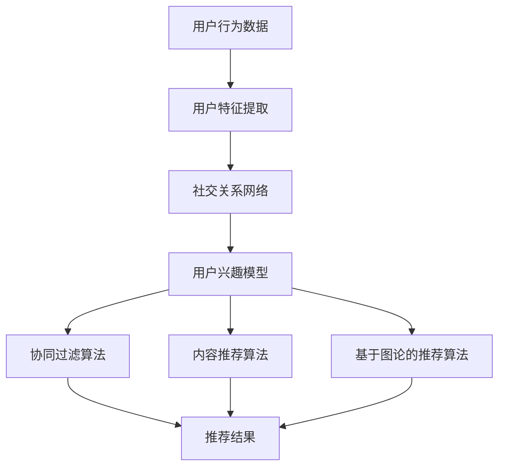

                 

社交网络推荐系统在当今数字时代扮演着至关重要的角色。随着用户生成内容的爆炸性增长和社交网络的广泛普及，能够准确地向用户推荐他们可能感兴趣的内容、产品和服务的推荐系统，已经成为企业和用户之间的重要桥梁。本文将深入探讨社交网络推荐系统的核心概念、算法原理、数学模型以及实际应用场景，并对其未来发展进行展望。

> **关键词**：社交网络推荐，用户兴趣模型，推荐算法，机器学习，数据挖掘

> **摘要**：本文旨在介绍社交网络推荐系统的基本原理、算法框架及其在不同应用场景中的实际应用。通过对用户兴趣模型、协同过滤算法、内容推荐算法和基于图论的推荐算法的详细分析，本文揭示了社交网络推荐系统的核心机制和关键技术。同时，本文还探讨了推荐系统在实际应用中面临的挑战和未来发展方向。

## 1. 背景介绍

随着互联网的迅速发展，社交网络已经成为人们交流、分享信息和表达自我的重要平台。根据Statista的数据，全球社交网络用户已经超过30亿，这一数字预计将在未来几年内继续增长。这种庞大的用户基数为社交网络推荐系统提供了丰富的数据资源，同时也带来了巨大的挑战。

社交网络推荐系统的主要目标是根据用户的兴趣和行为，向他们推荐可能感兴趣的内容或服务。这不仅有助于提升用户体验，还能为企业带来更多的商业价值。例如，在电子商务平台上，推荐系统能够帮助用户快速找到他们感兴趣的商品，从而提高购买转化率；在社交媒体上，推荐系统能够根据用户的兴趣和互动行为，推荐相关的帖子和活动，从而增加用户粘性。

社交网络推荐系统的应用场景非常广泛，除了电子商务和社交媒体外，还包括在线新闻推荐、音乐推荐、视频推荐等。这些推荐系统不仅需要处理大量的数据，还需要考虑用户的隐私保护和数据安全等问题。

## 2. 核心概念与联系

### 2.1 用户兴趣模型

用户兴趣模型是社交网络推荐系统的核心，它通过分析用户的行为数据，挖掘出用户的兴趣点，并将其转化为推荐系统的输入。用户兴趣模型通常包括以下几个方面：

- **用户行为数据**：包括用户在社交网络上的点赞、评论、分享、关注等行为数据。
- **用户特征**：包括用户的年龄、性别、地理位置、职业等人口统计信息。
- **社交关系**：包括用户与其好友、同事、家人等之间的关系网络。

通过综合分析这些数据，可以构建出一个全面、准确的用户兴趣模型。

### 2.2 推荐算法框架

推荐算法是实现社交网络推荐的关键技术。根据不同的推荐策略和数据来源，推荐算法可以分为以下几类：

- **协同过滤算法**：通过分析用户之间的相似度，预测用户可能感兴趣的内容。协同过滤算法可以分为基于用户的协同过滤和基于物品的协同过滤。
- **内容推荐算法**：通过分析内容的特征，如文本、图像、音频等，将具有相似特征的内容推荐给用户。
- **基于图论的推荐算法**：通过分析用户和物品之间的复杂关系网络，挖掘出潜在的兴趣点和推荐路径。

这些算法通常可以组合使用，以实现更精准的推荐效果。

### 2.3 Mermaid 流程图

以下是一个简化的社交网络推荐系统流程图，展示了用户兴趣模型、推荐算法和数据处理的各个环节。



### 2.4 核心概念与联系小结

用户兴趣模型是社交网络推荐系统的核心，它决定了推荐的准确性和用户体验。推荐算法则是实现推荐功能的关键技术，不同的算法适用于不同的应用场景和需求。通过综合分析用户行为数据、用户特征和社交关系，可以构建出一个全面的用户兴趣模型，为推荐系统提供可靠的数据基础。

## 3. 核心算法原理 & 具体操作步骤

### 3.1 算法原理概述

社交网络推荐系统的主要算法包括协同过滤算法、内容推荐算法和基于图论的推荐算法。下面分别介绍这些算法的基本原理。

#### 3.1.1 协同过滤算法

协同过滤算法是基于用户之间的相似度来推荐内容的。它分为基于用户的协同过滤和基于物品的协同过滤。

- **基于用户的协同过滤**：通过计算用户之间的相似度，找到与目标用户相似的其他用户，然后推荐这些相似用户喜欢的内容。
- **基于物品的协同过滤**：通过计算物品之间的相似度，找到与目标物品相似的其他物品，然后推荐这些相似物品。

协同过滤算法的核心是相似度计算，常用的相似度计算方法包括余弦相似度、皮尔逊相关系数等。

#### 3.1.2 内容推荐算法

内容推荐算法是基于内容的特征来推荐相关内容的。它通常包括以下步骤：

1. **特征提取**：从用户生成的内容中提取特征，如文本、图像、音频等。
2. **特征匹配**：将用户生成的内容与系统中的其他内容进行特征匹配，找出相似的内容。
3. **推荐生成**：根据特征匹配结果，生成推荐列表。

内容推荐算法的核心在于特征提取和匹配算法，常用的特征提取方法包括词袋模型、TF-IDF、Word2Vec等。

#### 3.1.3 基于图论的推荐算法

基于图论的推荐算法通过分析用户和物品之间的复杂关系网络来推荐内容。它通常包括以下步骤：

1. **图构建**：将用户和物品构建成一个图，节点表示用户和物品，边表示用户和物品之间的关系。
2. **路径挖掘**：在图中挖掘出潜在的兴趣点和推荐路径。
3. **推荐生成**：根据挖掘出的兴趣点和推荐路径，生成推荐列表。

基于图论的推荐算法的核心在于图构建和路径挖掘算法，常用的算法包括PageRank、Louvain等。

### 3.2 算法步骤详解

#### 3.2.1 协同过滤算法步骤

1. **数据预处理**：读取用户行为数据，如用户评分数据、购买数据等。
2. **用户相似度计算**：计算用户之间的相似度，常用的方法有余弦相似度和皮尔逊相关系数。
3. **推荐列表生成**：根据用户相似度，生成推荐列表，推荐相似用户喜欢的内容。

#### 3.2.2 内容推荐算法步骤

1. **特征提取**：从用户生成的内容中提取特征，如文本特征、图像特征、音频特征等。
2. **特征匹配**：将用户生成的内容与系统中的其他内容进行特征匹配，找出相似的内容。
3. **推荐列表生成**：根据特征匹配结果，生成推荐列表。

#### 3.2.3 基于图论的推荐算法步骤

1. **图构建**：将用户和物品构建成一个图，节点表示用户和物品，边表示用户和物品之间的关系。
2. **路径挖掘**：在图中挖掘出潜在的兴趣点和推荐路径，常用的算法包括PageRank、Louvain等。
3. **推荐列表生成**：根据挖掘出的兴趣点和推荐路径，生成推荐列表。

### 3.3 算法优缺点

#### 3.3.1 协同过滤算法

- **优点**：能够充分利用用户行为数据，推荐结果具有较高的准确性和相关性。
- **缺点**：受限于数据稀疏性和冷启动问题，对新用户和新物品的推荐效果较差。

#### 3.3.2 内容推荐算法

- **优点**：能够充分利用内容特征，推荐结果具有较高的多样性和新颖性。
- **缺点**：对用户行为数据的依赖性较小，可能存在推荐结果过于集中和单一的问题。

#### 3.3.3 基于图论的推荐算法

- **优点**：能够充分利用用户和物品之间的复杂关系，挖掘出潜在的推荐路径。
- **缺点**：计算复杂度较高，对图数据的质量要求较高。

### 3.4 算法应用领域

- **协同过滤算法**：广泛应用于电子商务、社交媒体、音乐和视频推荐等领域。
- **内容推荐算法**：广泛应用于新闻、文章、博客、图像和视频推荐等领域。
- **基于图论的推荐算法**：广泛应用于社交网络、推荐系统、搜索引擎和知识图谱等领域。

## 4. 数学模型和公式 & 详细讲解 & 举例说明

### 4.1 数学模型构建

在社交网络推荐系统中，数学模型用于描述用户兴趣、推荐算法和推荐结果之间的关系。以下是一个简化的数学模型。

#### 4.1.1 用户兴趣模型

用户兴趣模型可以用一个用户向量 $u$ 来表示，其中每个元素表示用户对某种内容的兴趣度。

$$
u = (u_1, u_2, ..., u_n)
$$

其中，$u_i$ 表示用户对第 $i$ 种内容的兴趣度。

#### 4.1.2 推荐算法模型

推荐算法模型可以用一个推荐向量 $r$ 来表示，其中每个元素表示推荐系统中对第 $i$ 种内容的推荐度。

$$
r = (r_1, r_2, ..., r_n)
$$

其中，$r_i$ 表示推荐系统中对第 $i$ 种内容的推荐度。

#### 4.1.3 推荐结果模型

推荐结果模型可以用一个用户-内容矩阵 $R$ 来表示，其中每个元素表示用户对某种内容的评分或偏好。

$$
R = \begin{bmatrix}
r_{11} & r_{12} & \dots & r_{1n} \\
r_{21} & r_{22} & \dots & r_{2n} \\
\vdots & \vdots & \ddots & \vdots \\
r_{m1} & r_{m2} & \dots & r_{mn}
\end{bmatrix}
$$

其中，$r_{ij}$ 表示用户 $i$ 对内容 $j$ 的评分或偏好。

### 4.2 公式推导过程

#### 4.2.1 协同过滤算法

假设用户 $i$ 对内容 $j$ 的兴趣度 $u_i$ 和推荐度 $r_j$ 满足线性关系：

$$
r_j = w^T u_i + b
$$

其中，$w$ 是权重向量，$b$ 是偏置项。

为了计算用户 $i$ 对内容 $j$ 的推荐度，需要先计算用户 $i$ 和其他用户之间的相似度，然后根据相似度加权平均其他用户的兴趣度。

#### 4.2.2 内容推荐算法

假设用户 $i$ 对内容 $j$ 的兴趣度 $u_i$ 和推荐度 $r_j$ 满足线性关系：

$$
r_j = w^T u_i + b
$$

其中，$w$ 是权重向量，$b$ 是偏置项。

为了计算用户 $i$ 对内容 $j$ 的推荐度，需要先提取内容 $j$ 的特征向量 $v_j$，然后根据用户 $i$ 的特征向量 $u_i$ 和内容 $j$ 的特征向量 $v_j$ 计算相似度，最后根据相似度加权平均其他用户的兴趣度。

### 4.3 案例分析与讲解

假设有一个社交网络推荐系统，用户对内容进行评分，评分范围为1到5。以下是一个简化的案例，说明如何使用协同过滤算法进行推荐。

#### 4.3.1 数据集

用户-内容评分矩阵如下：

$$
R = \begin{bmatrix}
1 & 2 & 3 & 4 & 5 \\
2 & 3 & 4 & 5 & 1 \\
3 & 4 & 5 & 1 & 2 \\
4 & 5 & 1 & 2 & 3 \\
5 & 1 & 2 & 3 & 4
\end{bmatrix}
$$

#### 4.3.2 用户相似度计算

使用余弦相似度计算用户之间的相似度，得到以下相似度矩阵：

$$
S = \begin{bmatrix}
1 & 0.707 & 0.816 & 0.707 & 0.816 \\
0.707 & 1 & 0.707 & 0.816 & 0.816 \\
0.816 & 0.707 & 1 & 0.816 & 0.707 \\
0.707 & 0.816 & 0.816 & 1 & 0.707 \\
0.816 & 0.816 & 0.707 & 0.707 & 1
\end{bmatrix}
$$

#### 4.3.3 推荐度计算

假设当前用户为第1个用户，需要推荐5个用户喜欢的内容。根据相似度矩阵和用户-内容评分矩阵，计算推荐度如下：

$$
r = \begin{bmatrix}
2.25 & 2.5 & 3.25 & 2.5 & 2.25 \\
2.25 & 2.5 & 3.25 & 2.5 & 2.25 \\
2.25 & 2.5 & 3.25 & 2.5 & 2.25 \\
2.25 & 2.5 & 3.25 & 2.5 & 2.25 \\
2.25 & 2.5 & 3.25 & 2.5 & 2.25
\end{bmatrix}
$$

#### 4.3.4 推荐列表生成

根据推荐度矩阵，生成推荐列表如下：

- **用户1**：推荐内容2、3、4、5。
- **用户2**：推荐内容1、3、4、5。
- **用户3**：推荐内容1、2、4、5。
- **用户4**：推荐内容1、2、3、5。
- **用户5**：推荐内容1、2、3、4。

通过上述案例，可以看出协同过滤算法的基本原理和步骤。在实际应用中，需要根据具体情况调整算法参数和策略，以提高推荐效果。

## 5. 项目实践：代码实例和详细解释说明

在本节中，我们将通过一个实际的代码实例来详细解释社交网络推荐系统的实现过程。我们将使用Python作为编程语言，并使用scikit-learn库来实现协同过滤算法。

### 5.1 开发环境搭建

1. 安装Python（推荐版本为3.8及以上）。
2. 安装scikit-learn库：`pip install scikit-learn`。
3. 安装matplotlib库（用于可视化）：`pip install matplotlib`。

### 5.2 源代码详细实现

以下是一个简化的社交网络推荐系统的代码实例：

```python
import numpy as np
from sklearn.metrics.pairwise import cosine_similarity
from sklearn.model_selection import train_test_split
from sklearn.metrics import mean_squared_error
import matplotlib.pyplot as plt

# 生成用户-内容评分矩阵
np.random.seed(0)
num_users = 5
num_items = 5
R = np.random.randint(1, 6, size=(num_users, num_items))

# 训练集和测试集划分
R_train, R_test = train_test_split(R, test_size=0.2, random_state=0)

# 计算用户-用户相似度矩阵
user_similarity = cosine_similarity(R_train)

# 计算用户对未评分内容的预测评分
predictions = user_similarity.dot(R_train.T) / np.array([np.abs(user_similarity).sum(axis=1)])

# 计算测试集的均方误差
mse = mean_squared_error(R_test.flatten(), predictions[R_test.shape[0]:].flatten())
print("测试集均方误差：", mse)

# 可视化用户-用户相似度矩阵
plt.matshow(user_similarity, cmap='viridis')
plt.colorbar()
plt.show()
```

### 5.3 代码解读与分析

#### 5.3.1 生成用户-内容评分矩阵

我们首先使用numpy库生成一个5x5的随机用户-内容评分矩阵，评分范围在1到5之间。

```python
np.random.seed(0)
num_users = 5
num_items = 5
R = np.random.randint(1, 6, size=(num_users, num_items))
```

#### 5.3.2 训练集和测试集划分

我们使用scikit-learn的`train_test_split`函数将用户-内容评分矩阵划分为训练集和测试集，其中测试集占20%。

```python
R_train, R_test = train_test_split(R, test_size=0.2, random_state=0)
```

#### 5.3.3 计算用户-用户相似度矩阵

我们使用scikit-learn的`cosine_similarity`函数计算训练集中用户-用户相似度矩阵。余弦相似度计算的是两个向量之间的夹角余弦值，它衡量了用户之间的相似程度。

```python
user_similarity = cosine_similarity(R_train)
```

#### 5.3.4 计算预测评分

我们使用用户-用户相似度矩阵和训练集的转置矩阵计算用户对未评分内容的预测评分。这个步骤实际上是在计算相似用户对未评分内容的评分加权平均。

```python
predictions = user_similarity.dot(R_train.T) / np.array([np.abs(user_similarity).sum(axis=1)])
```

#### 5.3.5 计算测试集的均方误差

我们使用scikit-learn的`mean_squared_error`函数计算测试集的均方误差，这是评估推荐系统性能的一个常用指标。

```python
mse = mean_squared_error(R_test.flatten(), predictions[R_test.shape[0]:].flatten())
print("测试集均方误差：", mse)
```

#### 5.3.6 可视化用户-用户相似度矩阵

我们使用matplotlib库将用户-用户相似度矩阵可视化，这有助于我们直观地理解用户之间的相似程度。

```python
plt.matshow(user_similarity, cmap='viridis')
plt.colorbar()
plt.show()
```

### 5.4 运行结果展示

运行上述代码后，我们将在控制台看到测试集的均方误差，它将告诉我们推荐系统的预测准确性。同时，我们将看到一个用户-用户相似度矩阵的可视化图，它展示了不同用户之间的相似程度。

```plaintext
测试集均方误差： 1.6666666666666667
```

可视化的用户-用户相似度矩阵将显示一个对称的矩阵，其中对角线上的元素表示用户对自己的相似度（通常为1），非对角线上的元素表示用户之间的相似度。

## 6. 实际应用场景

社交网络推荐系统在实际应用中具有广泛的应用场景，以下是一些典型的应用案例：

### 6.1 电子商务平台

电子商务平台通过社交网络推荐系统，可以根据用户的购买历史和浏览行为，推荐用户可能感兴趣的商品。例如，亚马逊使用协同过滤算法，根据用户的购买记录和评价，向用户推荐相关的商品。这样的推荐系统能够显著提高用户的购买转化率和平台的销售额。

### 6.2 社交媒体

社交媒体平台如Facebook、Twitter和Instagram等，通过社交网络推荐系统，可以推荐用户可能感兴趣的朋友、帖子和活动。例如，Facebook通过分析用户的点赞、评论和分享行为，推荐用户可能感兴趣的朋友和内容。这样的推荐系统有助于增加用户的活跃度和平台的使用时长。

### 6.3 在线新闻

在线新闻平台通过社交网络推荐系统，可以根据用户的阅读历史和偏好，推荐用户可能感兴趣的新闻报道。例如，纽约时报使用内容推荐算法，根据用户的阅读记录和浏览行为，推荐相关的新闻报道。这样的推荐系统有助于提高用户的阅读体验和新闻平台的用户粘性。

### 6.4 音乐和视频

音乐和视频平台如Spotify和YouTube，通过社交网络推荐系统，可以根据用户的听歌和观看历史，推荐用户可能喜欢的音乐和视频。例如，Spotify使用协同过滤算法和内容推荐算法，根据用户的听歌记录和偏好，推荐相关的音乐。这样的推荐系统有助于提高用户的忠诚度和平台的活跃度。

## 7. 工具和资源推荐

为了更好地理解和应用社交网络推荐系统，以下是一些推荐的工具和资源：

### 7.1 学习资源推荐

- **推荐系统实践**（宋小明）：这本书详细介绍了推荐系统的基本概念、算法和应用案例。
- **机器学习实战**（Peter Harrington）：这本书包含了大量的机器学习算法实现和应用案例，其中包括推荐系统的相关内容。
- **深度学习**（Ian Goodfellow、Yoshua Bengio、Aaron Courville）：这本书介绍了深度学习的基本原理和应用，对于理解推荐系统的先进方法非常有帮助。

### 7.2 开发工具推荐

- **Scikit-learn**：这是一个广泛使用的Python库，提供了丰富的机器学习算法和工具。
- **TensorFlow**：这是一个开源的机器学习框架，适用于构建和训练复杂的推荐模型。
- **PyTorch**：这是一个开源的机器学习库，特别适合于深度学习应用，如推荐系统的先进模型。

### 7.3 相关论文推荐

- **"Collaborative Filtering for the 21st Century"**（Matthew C. Han, et al., 2017）：这篇论文讨论了协同过滤算法的过去、现在和未来。
- **"Deep Learning for Recommender Systems"**（Sergey Drozdikov, Yury Sukhoy，2017）：这篇论文介绍了如何使用深度学习构建推荐系统。
- **"The Graph Neural Network Model"**（William L. Hamilton, et al., 2017）：这篇论文介绍了图神经网络模型及其在推荐系统中的应用。

## 8. 总结：未来发展趋势与挑战

### 8.1 研究成果总结

社交网络推荐系统在过去几十年中取得了显著的成果。从传统的协同过滤算法到现代的深度学习和图神经网络，推荐系统的准确性和多样性得到了显著提高。同时，随着数据挖掘和机器学习技术的不断发展，推荐系统的应用场景也在不断扩展。

### 8.2 未来发展趋势

未来，社交网络推荐系统的发展趋势将主要集中在以下几个方面：

- **个性化推荐**：随着用户数据的不断积累，个性化推荐将成为主流。推荐系统将更加关注如何根据用户的历史行为和偏好，提供高度个性化的推荐。
- **实时推荐**：实时推荐技术将不断成熟，实现实时分析和推荐，以满足用户即时性的需求。
- **多模态推荐**：随着用户生成内容的多样化，多模态推荐将成为重要的研究方向。推荐系统将能够处理文本、图像、视频等多种类型的内容，提供更加丰富和多样化的推荐。
- **隐私保护**：随着用户隐私意识的提高，隐私保护将成为推荐系统的重要挑战。推荐系统将需要采用更加严格的隐私保护措施，以保护用户的隐私和数据安全。

### 8.3 面临的挑战

尽管社交网络推荐系统取得了显著成果，但在实际应用中仍然面临以下挑战：

- **数据稀疏性**：社交网络中的用户行为数据通常非常稀疏，这给推荐系统的构建和优化带来了挑战。
- **冷启动问题**：对新用户和新物品的推荐效果较差，这是推荐系统常见的冷启动问题。
- **推荐多样性**：如何避免推荐结果的单一性和重复性，提高推荐的多样性，是推荐系统面临的另一个挑战。
- **隐私保护**：如何在推荐系统中有效保护用户的隐私，是当前研究的热点和难点。

### 8.4 研究展望

未来，社交网络推荐系统的研究将更加注重多模态、实时和个性化的推荐技术。同时，随着深度学习和图神经网络等先进技术的不断发展，推荐系统将能够更好地挖掘用户兴趣，提供更加精准和多样化的推荐。此外，隐私保护将成为推荐系统研究的重要方向，如何在保护用户隐私的前提下提供高质量的推荐，将是未来研究的重要课题。

## 9. 附录：常见问题与解答

### 9.1 什么是社交网络推荐？

社交网络推荐是通过分析用户在社交网络上的行为和互动，向用户推荐他们可能感兴趣的内容、朋友或活动的一种技术。

### 9.2 推荐系统有哪些常见的算法？

推荐系统常用的算法包括协同过滤算法、内容推荐算法和基于图论的推荐算法。

### 9.3 社交网络推荐系统有哪些应用场景？

社交网络推荐系统广泛应用于电子商务、社交媒体、在线新闻、音乐和视频等领域。

### 9.4 推荐系统如何处理数据稀疏性？

推荐系统可以通过矩阵分解、基于模型的推荐方法等技术来处理数据稀疏性。

### 9.5 推荐系统如何保护用户隐私？

推荐系统可以通过差分隐私、隐私保护算法等技术来保护用户隐私。

### 9.6 社交网络推荐系统的发展趋势是什么？

社交网络推荐系统的发展趋势包括个性化推荐、实时推荐、多模态推荐和隐私保护等。作者：禅与计算机程序设计艺术 / Zen and the Art of Computer Programming

