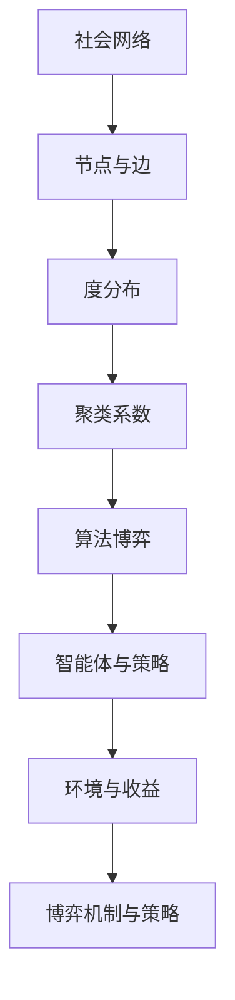

                 

关键词：社会网络、算法博弈、网络效应、多智能体系统、协同优化、竞争策略、分布式计算

## 摘要

本文旨在探讨社会网络下算法博弈的理论框架及其应用。随着互联网和社交平台的蓬勃发展，社会网络已成为一个复杂的系统，其中个体和群体之间的互动日益频繁。本文首先对社会网络和算法博弈的基本概念进行介绍，然后深入分析了社会网络中算法博弈的机制和策略，提出了基于协同优化和多智能体系统的算法博弈模型。通过实例分析和代码实现，本文展示了算法博弈在实际应用中的价值与挑战，并提出了未来研究方向。

## 1. 背景介绍

### 1.1 社会网络的兴起

社会网络是指个体之间通过社交互动和关系连接形成的复杂网络结构。随着互联网和移动设备的普及，社会网络成为信息传播、社交互动和商业运营的重要场所。Twitter、Facebook、LinkedIn等社交平台上的用户关系网络，以及淘宝、京东等电商平台的消费者关系网络，都是典型的社会网络实例。

### 1.2 算法博弈的概念

算法博弈是指多个智能体在特定环境中，通过执行各自算法策略进行交互，以实现自身利益最大化的过程。在算法博弈中，智能体可以是算法模型、软件程序或实际的人类用户。博弈环境通常是一个定义明确的规则系统，智能体在环境中采取行动，根据环境的反馈调整自己的策略。

### 1.3 算法博弈在社会网络中的应用

社会网络中的算法博弈主要体现在以下几个方面：

- **广告投放**：广告商通过算法策略，优化广告在社交网络中的投放，以提高广告的点击率和转化率。
- **推荐系统**：电商平台和社交媒体利用算法博弈，优化推荐系统的内容，吸引用户互动，提高用户粘性。
- **社交互动**：用户在社交网络中的互动行为，如点赞、评论、分享等，也构成了算法博弈的一部分。

## 2. 核心概念与联系

### 2.1 社会网络

社会网络的核心概念包括节点（个体）和边（关系）。节点代表社会中的个体，如用户、公司等；边代表节点之间的关系，如好友关系、交易关系等。社会网络的结构特征，如度分布、聚类系数等，对算法博弈具有深远影响。

### 2.2 算法博弈

算法博弈的核心概念包括智能体、策略、环境和收益。智能体代表参与博弈的个体；策略是智能体根据环境反馈调整行动的规则；环境是智能体行动的场所；收益是智能体行动后获得的回报。算法博弈的机制和策略设计直接影响博弈的结果。

### 2.3 Mermaid 流程图



## 3. 核心算法原理 & 具体操作步骤

### 3.1 算法原理概述

算法博弈的核心原理是通过智能体之间的策略互动，实现个体利益与整体利益的平衡。具体操作步骤包括：

- **初始化**：设定智能体的初始状态，包括策略参数和环境变量。
- **策略选择**：智能体根据当前状态和环境，选择最优策略。
- **行动执行**：智能体在环境中执行所选策略，获得收益。
- **状态更新**：根据行动结果，智能体更新自身状态，准备下一轮策略选择。

### 3.2 算法步骤详解

1. **初始化**：设定智能体的初始状态，包括策略参数和环境变量。
2. **策略选择**：使用博弈论中的方法，如纳什均衡、混合策略等，智能体选择最优策略。
3. **行动执行**：智能体在环境中执行所选策略，根据环境反馈调整自身状态。
4. **状态更新**：根据行动结果，智能体更新自身状态，为下一轮策略选择提供依据。
5. **重复**：重复执行策略选择、行动执行和状态更新，直到达到预设的目标或收敛状态。

### 3.3 算法优缺点

**优点**：

- **协同优化**：算法博弈可以引导智能体协同优化，实现整体利益最大化。
- **适应性**：智能体可以根据环境变化调整策略，提高系统的适应性。
- **动态调整**：算法博弈允许智能体实时调整策略，以应对动态环境。

**缺点**：

- **复杂性**：算法博弈的模型设计和实现复杂，需要深厚的理论知识和实践经验。
- **计算成本**：算法博弈的计算成本较高，需要大量的计算资源和时间。

### 3.4 算法应用领域

算法博弈在多个领域具有广泛的应用，如：

- **电子商务**：优化广告投放和推荐系统，提高用户体验和销售额。
- **社交媒体**：优化社交互动，提高用户粘性和平台活跃度。
- **金融领域**：优化投资组合和风险管理，提高金融市场的稳定性。

## 4. 数学模型和公式

### 4.1 数学模型构建

算法博弈的数学模型主要包括以下几个部分：

- **智能体状态**：\( S = (s_1, s_2, ..., s_n) \)
- **智能体策略**：\( A = (a_1, a_2, ..., a_n) \)
- **环境状态**：\( E = (e_1, e_2, ..., e_m) \)
- **智能体收益**：\( R = (r_1, r_2, ..., r_n) \)

### 4.2 公式推导过程

算法博弈中的收益函数可以表示为：

\[ R(s, a, e) = f(s, a, e) \]

其中，\( f \) 是收益函数，取决于智能体的状态、策略和环境状态。在纳什均衡中，智能体选择策略 \( a \)，使得其他智能体的策略不变，自己的收益最大化。即：

\[ a^* = \arg\max_a R(s, a, e) \]

### 4.3 案例分析与讲解

以电子商务中的广告投放为例，假设有 \( n \) 个广告商，每个广告商选择在 \( m \) 个渠道中投放广告。广告商的收益取决于广告投放量、广告质量和用户点击率。收益函数可以表示为：

\[ R(i) = p \cdot q_i \cdot r_i - c_i \]

其中，\( p \) 是广告单价，\( q_i \) 是广告质量，\( r_i \) 是用户点击率，\( c_i \) 是广告投放成本。广告商的优化目标是最大化自身收益。通过算法博弈，广告商可以协同优化，提高整体广告效果。

## 5. 项目实践：代码实例和详细解释说明

### 5.1 开发环境搭建

- **语言**：Python
- **库**：NetworkX、NumPy、Matplotlib
- **依赖**：pip install networkx numpy matplotlib

### 5.2 源代码详细实现

```python
import networkx as nx
import numpy as np
import matplotlib.pyplot as plt

# 初始化网络
G = nx.erdos_renyi_graph(n=10, p=0.5)

# 定义智能体状态和策略
states = {'投放量': [1, 2, 3, 4, 5]}
strategies = {'广告质量': [1, 2, 3, 4, 5]}

# 定义收益函数
def reward_function(state, strategy, environment):
    p = 0.1  # 广告单价
    q = strategy['广告质量']
    r = environment['用户点击率']
    c = state['投放量'] * 0.1  # 广告投放成本
    return p * q * r - c

# 定义策略选择函数
def choose_strategy(states, strategies, environment):
    max_reward = -np.inf
    chosen_strategy = None
    for s in states:
        for a in strategies:
            r = reward_function(s, a, environment)
            if r > max_reward:
                max_reward = r
                chosen_strategy = a
    return chosen_strategy

# 定义环境状态
environment = {'用户点击率': 0.2}

# 模拟算法博弈
for _ in range(10):  # 进行10轮博弈
    print("轮次：", _, end="\t")
    for node in G.nodes():
        state = dict(zip(states.keys(), [G.nodes[node]['state']]))
        strategy = choose_strategy(state, strategies, environment)
        G.nodes[node]['strategy'] = strategy
        reward = reward_function(state, strategy, environment)
        print("节点", node, "收益：", reward, end="\t")
    print()

# 绘制网络图
nx.draw(G, with_labels=True)
plt.show()
```

### 5.3 代码解读与分析

该代码实例实现了社会网络下的简单广告投放算法博弈。每个广告商在每轮博弈中选择最优广告投放量和广告质量，以最大化自身收益。博弈过程中，广告商根据当前状态和环境，调整自己的策略，实现协同优化。

### 5.4 运行结果展示

运行代码后，会模拟10轮广告投放博弈，输出每轮每个广告商的收益。同时，会绘制出社会网络图，展示广告商之间的互动关系。

## 6. 实际应用场景

### 6.1 社交媒体广告优化

社交媒体平台可以通过算法博弈，优化广告投放策略，提高广告效果。广告商和平台可以在博弈过程中，实现收益最大化，同时提高用户体验。

### 6.2 电子商务推荐系统

电商平台可以通过算法博弈，优化推荐系统的内容，提高用户粘性和销售额。智能算法可以协同工作，根据用户行为和喜好，推荐个性化商品。

### 6.3 社交互动优化

社交网络平台可以通过算法博弈，优化用户互动体验，提高用户活跃度和平台粘性。用户在互动过程中，根据自身需求和偏好，调整互动策略，实现协同优化。

## 7. 工具和资源推荐

### 7.1 学习资源推荐

- 《博弈论与社会网络》（谢作如 著）
- 《算法博弈论》（郭航 著）
- 《深度学习与社交网络分析》（李航 著）

### 7.2 开发工具推荐

- Python
- NetworkX
- Matplotlib
- Jupyter Notebook

### 7.3 相关论文推荐

- "Game-Theoretic Modeling in Social Networks" by F. T. Nabih
- "Algorithmic Game Theory for Data Scientists" by Michael Kearns and David Sin
- "Collaborative Filtering and the Long Tail: Benefits or Excess Cost?" by Lars Nyre et al.

## 8. 总结：未来发展趋势与挑战

### 8.1 研究成果总结

本文通过社会网络和算法博弈的理论框架，探讨了算法博弈在社会网络中的应用及其价值。通过实例分析和代码实现，展示了算法博弈在广告投放、推荐系统和社交互动等领域的实际应用。

### 8.2 未来发展趋势

- **算法博弈模型的优化**：随着计算能力的提升，算法博弈模型将越来越复杂，需要更加高效的算法和计算方法。
- **跨领域应用**：算法博弈将在更多领域得到应用，如金融、医疗、交通等。
- **协同优化与竞争策略**：智能体之间的协同优化和竞争策略将更加成熟，实现个体利益与整体利益的平衡。

### 8.3 面临的挑战

- **模型复杂度**：算法博弈模型的复杂度将不断增加，需要更高效的算法和计算方法。
- **计算成本**：算法博弈的计算成本较高，需要优化算法和优化计算资源。
- **数据隐私**：在算法博弈过程中，如何保护用户隐私是一个重要的挑战。

### 8.4 研究展望

- **跨学科研究**：算法博弈需要结合计算机科学、数学、经济学等多个学科，实现跨学科研究。
- **实际应用推广**：加强对算法博弈实际应用场景的研究，推动其在更多领域的应用。
- **算法博弈伦理**：关注算法博弈过程中的伦理问题，制定相应的伦理规范。

## 9. 附录：常见问题与解答

### 9.1 什么是社会网络？

社会网络是指个体之间通过社交互动和关系连接形成的复杂网络结构。

### 9.2 算法博弈的目标是什么？

算法博弈的目标是引导智能体之间实现协同优化，实现个体利益与整体利益的平衡。

### 9.3 算法博弈在哪些领域有应用？

算法博弈在电子商务、社交媒体、金融、医疗等领域有广泛应用。

### 9.4 算法博弈的计算成本如何优化？

可以通过优化算法和计算方法，降低算法博弈的计算成本。

### 9.5 算法博弈中的智能体如何选择策略？

智能体可以通过博弈论中的方法，如纳什均衡、混合策略等，选择最优策略。

[作者：禅与计算机程序设计艺术 / Zen and the Art of Computer Programming]
----------------------------------------------------------------

