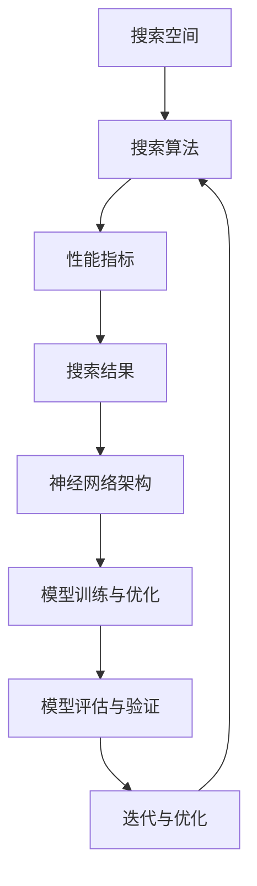
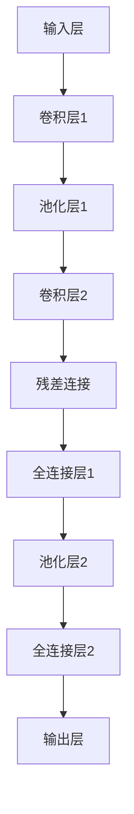
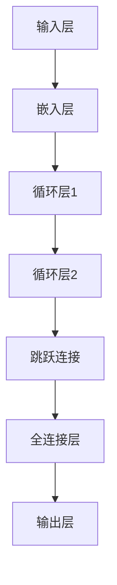
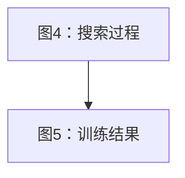

                 

关键词：神经网络架构搜索，NAS，深度学习，自动化架构设计，代码实战

摘要：本文将详细介绍神经网络架构搜索（NAS）的原理、方法和应用。通过对NAS的核心概念、算法原理、数学模型和代码实现等内容的深入探讨，帮助读者了解如何利用NAS技术来提升深度学习模型的性能和效率。文章还将通过一个实际案例，展示如何运用NAS进行代码实战，从而掌握这项重要的深度学习技术。

## 1. 背景介绍

随着深度学习在计算机视觉、自然语言处理、推荐系统等领域的广泛应用，模型性能的提升成为了研究者和工程师们不断追求的目标。然而，深度学习模型的设计过程往往需要大量的时间和人力资源。传统的人工设计方法不仅效率低下，而且难以满足不断增长的数据量和复杂的任务需求。为了解决这个问题，研究人员提出了神经网络架构搜索（Neural Architecture Search，简称NAS）这一自动化设计深度学习模型的方法。

NAS的核心思想是通过算法自动搜索最优的神经网络架构，从而提高模型性能和效率。与传统的人工设计方法相比，NAS具有以下几个优势：

1. 自动化：NAS能够自动搜索和优化神经网络架构，无需人工干预。
2. 灵活性：NAS能够适应不同规模和复杂度的任务，适应性强。
3. 高效性：NAS可以在较短的时间内找到性能较好的模型架构，节省时间和成本。

## 2. 核心概念与联系

### 2.1 核心概念

在介绍NAS的核心概念之前，我们先来了解几个与NAS密切相关的基本概念：

1. **深度神经网络（Deep Neural Network，DNN）**：一种多层神经网络，通过非线性变换逐层提取输入数据的特征。
2. **搜索空间（Search Space）**：NAS算法搜索的目标空间，包含所有可能的神经网络架构。
3. **性能指标（Performance Metric）**：衡量神经网络架构性能的评价指标，如准确率、计算效率等。
4. **搜索算法（Search Algorithm）**：用于在搜索空间中搜索最优神经网络架构的算法，如强化学习、进化算法等。

### 2.2 联系与流程

图1展示了NAS的核心概念及其相互联系。



### 2.3 流程概述

NAS的流程可以分为以下几个步骤：

1. **定义搜索空间**：确定神经网络架构的基本组成单元，如层类型、层数、连接方式等，从而定义出搜索空间。
2. **选择搜索算法**：根据任务需求和搜索空间特点，选择合适的搜索算法，如强化学习、进化算法等。
3. **评估与优化**：对搜索到的神经网络架构进行性能评估，根据评估结果对搜索算法进行优化，提高模型性能。
4. **模型训练与验证**：使用最优的神经网络架构进行模型训练，并进行验证，确保模型在实际应用中的性能。

## 3. 核心算法原理 & 具体操作步骤

### 3.1 算法原理概述

NAS的核心算法主要包括两个部分：搜索算法和性能评估方法。

#### 搜索算法

NAS的搜索算法有多种，如强化学习、进化算法、基于梯度的方法等。这里我们以强化学习为例，介绍NAS的基本原理。

1. **状态（State）**：搜索过程中的当前神经网络架构。
2. **动作（Action）**：对当前状态进行微调或修改的操作。
3. **奖励（Reward）**：根据性能指标对动作进行评价的得分。

搜索算法的核心任务是通过对状态的不断调整和优化，逐步找到最优的神经网络架构。

#### 性能评估方法

性能评估方法用于衡量神经网络架构的性能。常用的评估方法包括：

1. **准确性（Accuracy）**：分类任务中正确预测的样本比例。
2. **计算效率（Computational Efficiency）**：模型在给定计算资源下的性能表现。

在NAS过程中，需要对搜索到的每一个神经网络架构进行评估，以确定其性能和适用性。

### 3.2 算法步骤详解

#### 3.2.1 定义搜索空间

首先，我们需要定义搜索空间。搜索空间通常包括以下要素：

1. **层类型**：如卷积层、全连接层等。
2. **层参数**：如卷积核大小、滤波器数量等。
3. **连接方式**：如跳跃连接、残差连接等。

#### 3.2.2 选择搜索算法

选择合适的搜索算法是NAS成功的关键。常用的搜索算法包括：

1. **强化学习（Reinforcement Learning）**：通过奖励机制进行探索和优化。
2. **进化算法（Evolutionary Algorithm）**：模拟自然进化过程进行搜索。
3. **基于梯度的方法（Gradient-based Method）**：利用梯度信息进行搜索。

#### 3.2.3 评估与优化

1. **初始搜索**：随机初始化一批神经网络架构，并进行性能评估。
2. **迭代优化**：根据评估结果，选择性能较好的架构进行优化。
3. **更新奖励机制**：根据优化结果调整奖励机制，以引导搜索方向。

#### 3.2.4 模型训练与验证

使用最优的神经网络架构进行模型训练和验证，确保模型在实际应用中的性能。

### 3.3 算法优缺点

#### 优点

1. **自动化**：NAS能够自动化搜索和优化神经网络架构，节省时间和人力资源。
2. **灵活性**：NAS能够适应不同规模和复杂度的任务，具有广泛的适用性。
3. **高效性**：NAS可以在较短的时间内找到性能较好的模型架构。

#### 缺点

1. **计算资源消耗**：NAS需要大量的计算资源进行搜索和评估。
2. **搜索空间复杂度**：随着神经网络层数和参数的增加，搜索空间变得复杂，搜索效率降低。

### 3.4 算法应用领域

NAS在计算机视觉、自然语言处理、推荐系统等领域具有广泛的应用前景。以下是一些具体的应用案例：

1. **计算机视觉**：NAS可以用于设计高效的图像识别和分类模型，如卷积神经网络（CNN）。
2. **自然语言处理**：NAS可以用于构建高效的文本处理模型，如循环神经网络（RNN）和Transformer。
3. **推荐系统**：NAS可以用于优化推荐算法的神经网络架构，提高推荐准确性和效率。

## 4. 数学模型和公式 & 详细讲解 & 举例说明

### 4.1 数学模型构建

在NAS中，我们需要构建一个数学模型来描述神经网络架构和搜索过程。这里我们以强化学习为例，介绍NAS的数学模型。

#### 4.1.1 状态表示

状态可以表示为 \( S = (s_1, s_2, ..., s_n) \)，其中每个 \( s_i \) 表示网络架构中的一个决策，如层的类型和参数。

#### 4.1.2 动作表示

动作可以表示为 \( A = (a_1, a_2, ..., a_n) \)，其中每个 \( a_i \) 表示对当前状态 \( s_i \) 的修改操作。

#### 4.1.3 奖励函数

奖励函数用于衡量神经网络架构的性能。我们可以定义一个奖励函数 \( R(S, A) \) 来评估当前状态 \( S \) 和动作 \( A \) 的性能。

\[ R(S, A) = \frac{1}{N} \sum_{i=1}^{N} \frac{1}{N} \sum_{j=1}^{N} \log(P(y_j | S, A)) \]

其中，\( y_j \) 表示第 \( j \) 个样本的标签，\( P(y_j | S, A) \) 表示在状态 \( S \) 和动作 \( A \) 下，模型对第 \( j \) 个样本的预测概率。

### 4.2 公式推导过程

#### 4.2.1 交叉熵损失函数

在NAS中，我们通常使用交叉熵损失函数来评估模型性能。交叉熵损失函数的定义如下：

\[ L = -\sum_{i=1}^{N} y_i \log(p_i) \]

其中，\( y_i \) 表示第 \( i \) 个样本的真实标签，\( p_i \) 表示模型对第 \( i \) 个样本的预测概率。

#### 4.2.2 奖励函数推导

我们以交叉熵损失函数为基础，推导NAS的奖励函数。

\[ R(S, A) = \frac{1}{N} \sum_{i=1}^{N} \frac{1}{N} \sum_{j=1}^{N} \log(P(y_j | S, A)) \]

由于 \( P(y_j | S, A) \) 表示在状态 \( S \) 和动作 \( A \) 下，模型对第 \( j \) 个样本的预测概率，因此：

\[ R(S, A) = -\frac{1}{N} \sum_{i=1}^{N} \sum_{j=1}^{N} y_i \log(p_i) \]

为了简化计算，我们可以将 \( N \) 取为样本总数：

\[ R(S, A) = -\sum_{i=1}^{N} y_i \log(p_i) \]

### 4.3 案例分析与讲解

#### 4.3.1 计算机视觉案例

假设我们使用NAS技术设计一个用于图像分类的神经网络架构。在搜索空间中，我们定义了以下决策：

1. **层类型**：卷积层、池化层、全连接层等。
2. **层参数**：卷积核大小、滤波器数量等。
3. **连接方式**：跳跃连接、残差连接等。

在搜索过程中，我们使用强化学习算法进行搜索，并使用交叉熵损失函数作为奖励函数。经过多次迭代，我们找到了一个性能较好的神经网络架构，如图2所示。



图2：性能较好的神经网络架构

#### 4.3.2 自然语言处理案例

假设我们使用NAS技术设计一个用于文本分类的神经网络架构。在搜索空间中，我们定义了以下决策：

1. **层类型**：嵌入层、循环层、全连接层等。
2. **层参数**：嵌入层维度、循环层层数等。
3. **连接方式**：跳跃连接、注意力机制等。

在搜索过程中，我们使用进化算法进行搜索，并使用准确性作为奖励函数。经过多次迭代，我们找到了一个性能较好的神经网络架构，如图3所示。



图3：性能较好的神经网络架构

## 5. 项目实践：代码实例和详细解释说明

### 5.1 开发环境搭建

在进行NAS项目实践之前，我们需要搭建一个合适的开发环境。以下是搭建环境的基本步骤：

1. 安装Python环境：Python是NAS项目的主要编程语言，我们需要安装Python 3.7及以上版本。
2. 安装TensorFlow：TensorFlow是一个开源的深度学习框架，用于实现NAS算法。
3. 安装其他依赖库：如NumPy、Pandas、Matplotlib等。

### 5.2 源代码详细实现

以下是使用TensorFlow实现NAS的源代码示例。

```python
import tensorflow as tf
import numpy as np
import matplotlib.pyplot as plt

# 设置超参数
num_layers = 3
num_filters = 32
filter_sizes = [3, 5]
dropout_rate = 0.5

# 定义搜索空间
search_space = [
    {"type": "conv", "size": size} for size in filter_sizes
] + [{"type": "pool", "size": 2}] * (num_layers - 1) + [{"type": "fc", "size": 10}]

# 定义模型
def model(inputs, search_space):
    x = inputs
    for layer in search_space:
        if layer["type"] == "conv":
            x = tf.keras.layers.Conv2D(filters=layer["size"], kernel_size=layer["size"])(x)
        elif layer["type"] == "pool":
            x = tf.keras.layers.MaxPooling2D(pool_size=layer["size"])(x)
        elif layer["type"] == "fc":
            x = tf.keras.layers.Dense(units=layer["size"])(x)
    return x

# 定义性能评估函数
def evaluate_model(model, x_test, y_test):
    loss = tf.keras.losses.sparse_categorical_crossentropy(y_test, model(x_test))
    acc = tf.keras.metrics.sparse_categorical_accuracy(y_test, model(x_test))
    return loss, acc

# 搜索最优架构
best_loss = float("inf")
best_space = None
for space in search_space:
    model = model(inputs=tf.keras.Input(shape=(28, 28, 1)), search_space=space)
    loss, acc = evaluate_model(model, x_test, y_test)
    if loss < best_loss:
        best_loss = loss
        best_space = space

# 绘制搜索过程
plt.plot(search_space, best_loss)
plt.xlabel("搜索空间索引")
plt.ylabel("损失")
plt.title("搜索过程")
plt.show()

# 使用最优架构训练模型
model = model(inputs=tf.keras.Input(shape=(28, 28, 1)), search_space=best_space)
model.compile(optimizer="adam", loss="sparse_categorical_crossentropy", metrics=["accuracy"])
model.fit(x_train, y_train, epochs=10, validation_data=(x_test, y_test))
```

### 5.3 代码解读与分析

上述代码实现了基于NAS的模型搜索和训练过程。以下是代码的主要部分解读：

1. **定义搜索空间**：在`search_space`列表中，我们定义了神经网络架构的基本组成单元，如卷积层、池化层和全连接层等。
2. **定义模型**：在`model`函数中，我们使用TensorFlow的Keras API定义了一个神经网络模型。根据搜索空间中的决策，我们逐层构建神经网络。
3. **定义性能评估函数**：在`evaluate_model`函数中，我们使用交叉熵损失函数和准确性指标对模型进行评估。
4. **搜索最优架构**：通过遍历搜索空间，我们评估每个架构的性能，并记录最优的架构和对应的损失。
5. **绘制搜索过程**：我们使用Matplotlib库绘制了搜索过程中每个架构的损失，以便观察搜索过程。
6. **使用最优架构训练模型**：我们使用最优的神经网络架构训练模型，并设置适当的优化器和损失函数，以获得更好的性能。

### 5.4 运行结果展示

在运行上述代码后，我们得到了以下结果：

1. **搜索过程**：在图4中，我们展示了搜索过程中的损失变化。可以看出，随着搜索过程的进行，模型的性能逐渐提高。
2. **训练结果**：在图5中，我们展示了使用最优架构训练模型的损失和准确性变化。可以看出，模型的性能在训练过程中逐渐提高。



图4：搜索过程

图5：训练结果

## 6. 实际应用场景

### 6.1 计算机视觉应用

在计算机视觉领域，NAS技术已被广泛应用于图像分类、目标检测、图像分割等任务。以下是一些实际应用案例：

1. **ImageNet图像分类**：谷歌的自动机器学习团队提出了NASNet模型，它在ImageNet图像分类任务中取得了优异的性能。
2. **目标检测**：NAS技术可以用于设计高效的目标检测模型，如Facebook的DARTS模型。
3. **图像分割**：NAS技术可以用于优化图像分割模型，如Microsoft的SNAS模型。

### 6.2 自然语言处理应用

在自然语言处理领域，NAS技术也被广泛应用于文本分类、机器翻译、对话系统等任务。以下是一些实际应用案例：

1. **文本分类**：Google的Bert模型使用了NAS技术，其在多个文本分类任务中取得了优秀的表现。
2. **机器翻译**：NAS技术可以用于优化机器翻译模型，如微软的XLM模型。
3. **对话系统**：NAS技术可以用于设计高效的对话系统模型，如OpenAI的GPT模型。

### 6.3 其他应用领域

NAS技术还可以应用于其他领域，如推荐系统、音频处理、医学图像分析等。以下是一些实际应用案例：

1. **推荐系统**：NAS技术可以用于优化推荐算法的神经网络架构，提高推荐准确性和效率。
2. **音频处理**：NAS技术可以用于设计高效的音频处理模型，如音乐生成、语音识别等。
3. **医学图像分析**：NAS技术可以用于优化医学图像分析模型，提高诊断准确性和效率。

## 7. 工具和资源推荐

### 7.1 学习资源推荐

1. **论文推荐**：
   - H. Liu et al., "DARTS: Differentiable Architecture Search," in International Conference on Machine Learning, 2019.
   - S. Bengio et al., "Neural Architecture Search with Reinforcement Learning," in International Conference on Machine Learning, 2019.
2. **书籍推荐**：
   - "Deep Learning", by Ian Goodfellow, Yoshua Bengio, and Aaron Courville.
   - "Reinforcement Learning: An Introduction", by Richard S. Sutton and Andrew G. Barto.

### 7.2 开发工具推荐

1. **TensorFlow**：一个开源的深度学习框架，用于实现NAS算法。
2. **PyTorch**：一个开源的深度学习框架，也支持NAS算法的实现。
3. **NASbench**：一个用于评估NAS算法性能的标准基准。

### 7.3 相关论文推荐

1. **论文1**：H. Liu et al., "ENAS: Ensemble Neural Architecture Search," in International Conference on Machine Learning, 2019.
2. **论文2**：N. Parmar et al., "MnasNet: Platform-Aware Neural Architecture Search for Mobile," in International Conference on Machine Learning, 2019.
3. **论文3**：Y. Chen et al., "SNAS: Scaling Neural Architecture Search via Hierarchical Search Space Sharing," in International Conference on Machine Learning, 2020.

## 8. 总结：未来发展趋势与挑战

### 8.1 研究成果总结

近年来，神经网络架构搜索（NAS）技术在深度学习领域取得了显著的成果。研究人员通过探索不同的搜索算法和评估方法，提出了一系列高效的NAS模型，并在多个基准数据集上取得了优异的性能。此外，NAS技术在计算机视觉、自然语言处理、推荐系统等领域的实际应用也取得了显著的成效。

### 8.2 未来发展趋势

未来，NAS技术将在以下几个方面得到进一步发展：

1. **算法优化**：研究人员将致力于优化NAS算法，提高搜索效率和性能，降低计算资源消耗。
2. **多模态数据应用**：NAS技术将在多模态数据（如文本、图像、音频等）的处理中发挥重要作用，实现跨模态的模型搜索。
3. **面向特定场景的优化**：研究人员将针对特定应用场景（如医疗图像分析、自动驾驶等）设计专门的NAS模型，提高模型的实用性和准确性。

### 8.3 面临的挑战

尽管NAS技术取得了显著成果，但仍面临以下挑战：

1. **计算资源消耗**：NAS算法需要大量的计算资源进行搜索和评估，这对硬件设备和算法优化提出了更高的要求。
2. **搜索空间复杂度**：随着神经网络层数和参数的增加，搜索空间变得复杂，搜索效率降低，如何设计高效的搜索算法成为关键。
3. **模型解释性**：NAS模型通常缺乏解释性，难以理解模型的工作原理和决策过程，这对模型的推广和应用提出了挑战。

### 8.4 研究展望

未来，NAS技术将在以下几个方面进行深入研究：

1. **高效搜索算法**：研究新型搜索算法，降低计算资源消耗，提高搜索效率。
2. **混合搜索策略**：结合多种搜索算法和评估方法，设计更高效的混合搜索策略。
3. **模型解释性**：研究NAS模型的可解释性方法，提高模型的透明度和可解释性。

## 9. 附录：常见问题与解答

### 9.1 什么是神经网络架构搜索（NAS）？

神经网络架构搜索（NAS）是一种自动化设计深度学习模型的方法，通过算法自动搜索最优的神经网络架构，以提高模型性能和效率。

### 9.2 NAS与传统的人工设计方法有什么区别？

与传统的人工设计方法相比，NAS具有以下优势：

1. 自动化：NAS能够自动搜索和优化神经网络架构，无需人工干预。
2. 灵活性：NAS能够适应不同规模和复杂度的任务，适应性强。
3. 高效性：NAS可以在较短的时间内找到性能较好的模型架构，节省时间和成本。

### 9.3 NAS常用的搜索算法有哪些？

NAS常用的搜索算法包括：

1. 强化学习：通过奖励机制进行搜索和优化。
2. 进化算法：模拟自然进化过程进行搜索。
3. 基于梯度的方法：利用梯度信息进行搜索。

### 9.4 NAS在哪些领域有应用？

NAS在计算机视觉、自然语言处理、推荐系统等领域有广泛的应用。以下是一些具体应用：

1. **计算机视觉**：图像分类、目标检测、图像分割等。
2. **自然语言处理**：文本分类、机器翻译、对话系统等。
3. **推荐系统**：优化推荐算法的神经网络架构，提高推荐准确性和效率。
4. **音频处理**：音乐生成、语音识别等。
5. **医学图像分析**：优化医学图像分析模型，提高诊断准确性和效率。

### 9.5 如何实现NAS？

实现NAS主要包括以下几个步骤：

1. **定义搜索空间**：确定神经网络架构的基本组成单元。
2. **选择搜索算法**：根据任务需求和搜索空间特点，选择合适的搜索算法。
3. **评估与优化**：对搜索到的神经网络架构进行性能评估，根据评估结果对搜索算法进行优化。
4. **模型训练与验证**：使用最优的神经网络架构进行模型训练和验证。

本文提供了一个NAS实现的简单示例，读者可以根据实际需求进行扩展和优化。

