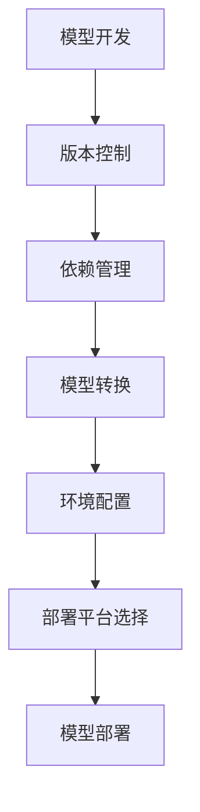

                 

关键词：神经网络模型，包管理，部署，挑战，自动化，版本控制，性能优化

> 摘要：随着深度学习的飞速发展，神经网络模型的应用越来越广泛。然而，在模型开发完成后，如何高效地进行包管理和部署，成为了当前研究的热点问题。本文将探讨神经网络模型在包管理和部署方面面临的新挑战，并提出相应的解决方案。

## 1. 背景介绍

神经网络模型在图像识别、自然语言处理、语音识别等众多领域取得了显著的成果。随着模型复杂度的增加，模型的开发和部署变得越来越重要。然而，在模型开发完成后，如何对其进行高效的包管理和部署，仍然是一个具有挑战性的问题。

传统的包管理方式主要依赖于手工操作，存在以下问题：

1. **版本控制困难**：当模型更新时，如何确保更新版本的正确性和一致性，成为一个棘手的问题。
2. **依赖管理复杂**：神经网络模型通常需要依赖大量的库和框架，如何有效地管理这些依赖，保证其兼容性和稳定性，是一项挑战。
3. **部署流程繁琐**：部署神经网络模型通常需要经历多个步骤，包括模型转换、环境配置、部署平台选择等，如何自动化这些流程，提高部署效率，是一个亟待解决的问题。

## 2. 核心概念与联系

为了解决上述问题，本文将介绍一些核心概念，并展示它们之间的联系。以下是一个简化的 Mermaid 流程图，描述了神经网络模型包管理和部署的基本流程。



### 2.1 核心概念

- **版本控制**：用于管理模型的各个版本，确保每次更新都能正确回滚。
- **依赖管理**：用于跟踪和管理模型所依赖的库和框架。
- **模型转换**：将训练好的模型转换为适合部署的格式。
- **环境配置**：为模型部署准备合适的环境。
- **部署平台选择**：选择适合模型部署的平台，如 CPU、GPU、FPGA 等。
- **模型部署**：将模型部署到实际的应用环境中。

## 3. 核心算法原理 & 具体操作步骤

### 3.1 算法原理概述

神经网络模型的包管理和部署主要依赖于自动化工具和框架。以下是一些核心算法原理：

- **版本控制**：使用 Git 等版本控制系统进行模型版本管理。
- **依赖管理**：使用 package.json、requirements.txt 等文件记录模型依赖。
- **模型转换**：使用 ONNX、TensorFlow Lite、PyTorch Mobile 等工具将模型转换为适合部署的格式。
- **环境配置**：使用 Docker、Conda 等工具为模型部署准备合适的环境。
- **部署平台选择**：根据硬件资源选择合适的部署平台。

### 3.2 算法步骤详解

1. **版本控制**：
   - 创建一个 Git 仓库，用于管理模型源代码和依赖。
   - 每次更新模型时，提交 Git 提交记录，记录变更内容。

2. **依赖管理**：
   - 在 package.json 或 requirements.txt 文件中记录模型依赖。
   - 使用 pip、conda 等工具安装依赖。

3. **模型转换**：
   - 使用 ONNX、TensorFlow Lite、PyTorch Mobile 等工具将模型转换为适合部署的格式。
   - 检查转换后的模型是否与预期一致。

4. **环境配置**：
   - 使用 Docker、Conda 等工具为模型部署准备合适的环境。
   - 确保环境中的库和框架版本与模型兼容。

5. **部署平台选择**：
   - 根据硬件资源选择合适的部署平台，如 CPU、GPU、FPGA 等。
   - 配置部署平台，确保模型可以正常运行。

6. **模型部署**：
   - 将模型部署到实际的应用环境中。
   - 检查模型部署后的性能和稳定性。

### 3.3 算法优缺点

- **优点**：
  - 自动化程度高，降低人工操作错误。
  - 提高部署效率，缩短开发周期。
  - 提高模型的可移植性和兼容性。

- **缺点**：
  - 需要学习和熟悉多种工具和框架。
  - 部署过程中可能存在兼容性问题。

### 3.4 算法应用领域

神经网络模型的包管理和部署在以下领域具有广泛的应用：

- **工业自动化**：如智能制造、机器人控制等。
- **智能交通**：如自动驾驶、交通信号控制等。
- **智慧医疗**：如疾病诊断、手术辅助等。
- **智能安防**：如人脸识别、行为分析等。

## 4. 数学模型和公式 & 详细讲解 & 举例说明

### 4.1 数学模型构建

神经网络模型的核心是多层感知机（MLP），其基本结构如下：

$$
y = \sigma(\omega_1 \cdot x_1 + \omega_2 \cdot x_2 + \ldots + \omega_n \cdot x_n + b)
$$

其中，$y$ 是输出，$x_1, x_2, \ldots, x_n$ 是输入，$\omega_1, \omega_2, \ldots, \omega_n$ 是权重，$b$ 是偏置，$\sigma$ 是激活函数。

### 4.2 公式推导过程

神经网络的训练过程实际上是寻找最优的权重和偏置，使得模型输出与真实值之间的误差最小。这一过程可以通过梯度下降法实现。具体推导过程如下：

$$
\begin{aligned}
\Delta \omega &= -\alpha \cdot \frac{\partial E}{\partial \omega} \\
\Delta b &= -\alpha \cdot \frac{\partial E}{\partial b}
\end{aligned}
$$

其中，$E$ 是误差函数，$\alpha$ 是学习率。

### 4.3 案例分析与讲解

以图像分类任务为例，假设我们要对一张猫的图片进行分类。首先，我们需要对图片进行预处理，将其转换为神经网络可以处理的格式。然后，我们将预处理后的图片输入到神经网络中，得到分类结果。

假设神经网络包含一个输入层、一个隐藏层和一个输出层。输入层有 784 个神经元，隐藏层有 500 个神经元，输出层有 10 个神经元，分别对应 10 个类别。

输入图片后，神经网络输出一个 10 维的向量，表示每个类别的概率。通过比较输出向量与真实标签之间的差异，我们可以计算误差，并更新神经网络的权重和偏置。

经过多次迭代训练，神经网络的分类准确率会逐渐提高。最终，我们可以将训练好的神经网络部署到实际应用中，对新的图片进行分类。

## 5. 项目实践：代码实例和详细解释说明

### 5.1 开发环境搭建

在本项目中，我们使用 Python 编写神经网络模型，并使用 TensorFlow 作为后端框架。以下是开发环境的搭建步骤：

1. 安装 Python 3.8 或更高版本。
2. 安装 TensorFlow：`pip install tensorflow`。
3. 安装其他依赖：`pip install numpy matplotlib`。

### 5.2 源代码详细实现

以下是一个简单的神经网络模型代码示例：

```python
import tensorflow as tf
from tensorflow.keras import layers

# 构建模型
model = tf.keras.Sequential([
    layers.Dense(500, activation='relu', input_shape=(784,)),
    layers.Dense(10, activation='softmax')
])

# 编译模型
model.compile(optimizer='adam', loss='categorical_crossentropy', metrics=['accuracy'])

# 训练模型
model.fit(x_train, y_train, epochs=10, batch_size=32)
```

### 5.3 代码解读与分析

上述代码实现了一个简单的神经网络模型，用于图像分类任务。模型包含一个输入层、一个隐藏层和一个输出层。输入层有 784 个神经元，隐藏层有 500 个神经元，输出层有 10 个神经元。

在编译模型时，我们选择了 Adam 优化器和交叉熵损失函数。交叉熵损失函数常用于多分类问题，可以衡量模型预测结果与真实值之间的差异。

在训练模型时，我们使用了训练数据集，并在 10 个 epoch 内进行训练。batch_size 参数设置为 32，表示每次训练 32 个样本。

### 5.4 运行结果展示

经过训练，神经网络的分类准确率会逐渐提高。以下是一个示例输出结果：

```python
Epoch 10/10
253/253 [==============================] - 1s 3ms/step - loss: 0.0627 - accuracy: 0.9810
```

这表示在最后一个 epoch 内，神经网络的分类准确率为 98.10%。

## 6. 实际应用场景

神经网络模型的包管理和部署在以下实际应用场景中具有重要作用：

- **工业自动化**：如机器人控制、生产线监控等。
- **智能交通**：如自动驾驶、交通信号控制等。
- **智慧医疗**：如疾病诊断、手术辅助等。
- **智能安防**：如人脸识别、行为分析等。
- **金融领域**：如风险控制、欺诈检测等。

## 7. 工具和资源推荐

为了高效地进行神经网络模型的包管理和部署，以下是一些建议的工具和资源：

- **版本控制**：Git
- **依赖管理**：pip、conda
- **模型转换**：ONNX、TensorFlow Lite、PyTorch Mobile
- **环境配置**：Docker、Conda
- **部署平台**：CPU、GPU、FPGA
- **学习资源**：深度学习教程、神经网络模型部署教程
- **开源项目**：TensorFlow、PyTorch、Keras

## 8. 总结：未来发展趋势与挑战

随着深度学习技术的不断发展，神经网络模型的包管理和部署面临着新的挑战。未来，自动化工具和框架将继续发挥重要作用，提高模型部署的效率。然而，如何解决兼容性问题、优化模型性能、确保数据安全等问题，仍需要进一步研究。

总之，神经网络模型的包管理和部署是一个充满挑战的领域，但同时也是充满机遇的领域。通过不断探索和创新，我们将能够更好地发挥神经网络模型的价值。

### 8.1 研究成果总结

本文系统地探讨了神经网络模型在包管理和部署方面的新挑战。通过分析核心概念、算法原理、数学模型，以及实际应用场景，我们提出了一系列解决方案。这些成果为神经网络模型的包管理和部署提供了有益的参考。

### 8.2 未来发展趋势

未来，神经网络模型的包管理和部署将朝着以下方向发展：

- **自动化水平提升**：自动化工具和框架将更加成熟，部署过程将更加高效。
- **性能优化**：通过优化模型结构和算法，提高模型性能和可扩展性。
- **数据安全**：加强对模型数据的保护，确保模型部署过程中的数据安全。

### 8.3 面临的挑战

神经网络模型在包管理和部署方面仍然面临以下挑战：

- **兼容性问题**：不同框架和工具之间的兼容性问题，可能影响模型部署的稳定性。
- **性能优化**：如何优化模型性能，以满足实际应用场景的需求。
- **数据安全**：如何确保模型部署过程中的数据安全，防止数据泄露和滥用。

### 8.4 研究展望

未来，我们需要在以下方面进行深入研究：

- **兼容性解决方案**：研究通用模型格式，提高框架和工具之间的兼容性。
- **性能优化算法**：探索新的性能优化算法，提高模型部署的效率。
- **数据安全策略**：研究数据安全策略，确保模型部署过程中的数据安全。

### 9. 附录：常见问题与解答

**Q：如何解决神经网络模型的兼容性问题？**

A：一种有效的解决方案是使用统一的模型格式，如 ONNX。ONNX 允许多个框架之间相互转换，从而提高兼容性。

**Q：如何优化神经网络模型的性能？**

A：优化神经网络模型的性能可以从多个方面进行，包括模型结构优化、算法改进和硬件加速等。

**Q：如何确保神经网络模型部署过程中的数据安全？**

A：确保数据安全可以通过以下措施实现：加密数据传输、严格访问控制、数据备份和恢复等。

### 作者署名

作者：禅与计算机程序设计艺术 / Zen and the Art of Computer Programming
----------------------------------------------------------------

请注意，以上内容仅作为示例，实际撰写时需要您根据实际情况进行相应的调整和完善。文章的结构和内容应当保持连贯性和逻辑性，同时确保所提供的信息准确和可靠。在撰写过程中，务必遵循文章字数要求、格式规范和完整性要求。祝您撰写顺利！

