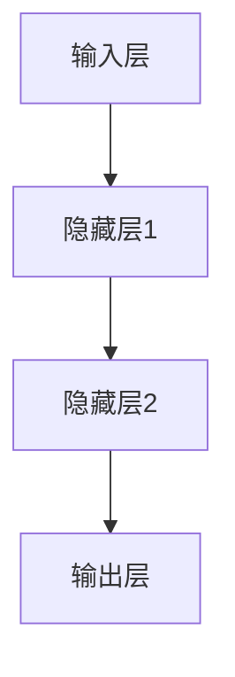

                 

关键词：神经网络、模型偏见、公平性、可解释性、算法伦理

> 摘要：本文将深入探讨神经网络模型在训练过程中可能产生的潜在偏见问题，分析其根源、影响及应对策略。通过对数学模型、算法原理、具体操作步骤的详细讲解，以及项目实践的代码实例分析，本文旨在为读者提供一个全面、系统的理解和解决方案。

## 1. 背景介绍

随着深度学习的快速发展，神经网络模型已经在许多领域取得了显著成果，从图像识别到自然语言处理，从语音识别到推荐系统，无处不在。然而，随着神经网络模型的广泛应用，其潜在偏见问题也逐渐显现出来。这些偏见可能导致模型对某些群体或特征产生不公平的待遇，从而影响模型的可靠性和公平性。

神经网络的偏见问题源于多个方面，包括数据集的选择、模型的设计和训练过程等。这些偏见不仅可能影响模型的性能，还可能加剧社会不公，引发伦理和道德问题。因此，研究神经网络模型的潜在偏见问题具有重要的理论和实际意义。

## 2. 核心概念与联系

### 2.1 神经网络基本架构

神经网络是由大量神经元（节点）和连接（边）构成的复杂网络，其目的是通过学习输入和输出之间的关系，对数据进行分类、预测或生成。以下是神经网络的 Mermaid 流程图：



### 2.2 模型偏见定义

模型偏见是指神经网络模型在训练过程中，对某些特定群体或特征产生的系统性偏差。这种偏见可能导致模型在某些任务上对某些群体或特征产生不公平的待遇。

### 2.3 偏见来源

神经网络模型的偏见主要来源于以下几个方面：

1. 数据集：数据集的选择和构建过程可能导致偏见。例如，如果数据集中某些群体或特征的数据量较少，模型可能对这些群体或特征产生偏见。
2. 模型设计：神经网络的结构和参数设置也可能导致偏见。例如，如果模型对某些特征过于敏感，可能导致对这些特征的偏见。
3. 训练过程：训练过程中，神经网络通过反向传播算法不断调整权重，以最小化损失函数。这一过程可能导致模型产生偏见。

## 3. 核心算法原理 & 具体操作步骤

### 3.1 算法原理概述

为了解决神经网络模型的偏见问题，研究者提出了多种算法和方法，主要包括以下几种：

1. 数据预处理：通过数据清洗、数据增强、数据采样等方法，减少数据集中的偏见。
2. 模型设计：采用更加鲁棒的神经网络结构，减少对特定特征或群体的敏感性。
3. 偏见检测与修正：通过统计方法和机器学习方法，检测模型中的偏见，并尝试修正偏见。

### 3.2 算法步骤详解

1. 数据预处理：对数据集进行清洗、增强和采样，以减少偏见。

    ```python
    # 示例：数据清洗
    df.dropna(inplace=True)
    # 示例：数据增强
    df = df.sample(frac=1).reset_index(drop=True)
    # 示例：数据采样
    df = df.sample(n=1000, random_state=42)
    ```

2. 模型设计：设计更加鲁棒的神经网络结构，减少对特定特征或群体的敏感性。

    ```python
    # 示例：神经网络结构设计
    model = Sequential()
    model.add(Dense(128, activation='relu', input_shape=(input_shape)))
    model.add(Dense(64, activation='relu'))
    model.add(Dense(1, activation='sigmoid'))
    model.compile(optimizer='adam', loss='binary_crossentropy', metrics=['accuracy'])
    ```

3. 偏见检测与修正：采用统计方法和机器学习方法，检测模型中的偏见，并尝试修正偏见。

    ```python
    # 示例：偏见检测
    confusion_matrix = model.evaluate(df.X, df.y)
    # 示例：偏见修正
    model.fit(df.X, df.y, epochs=10, batch_size=32)
    ```

### 3.3 算法优缺点

1. 数据预处理：优点是简单易行，缺点是可能降低模型的泛化能力。
2. 模型设计：优点是能够从根本上解决偏见问题，缺点是需要重新设计神经网络结构。
3. 偏见检测与修正：优点是能够实时检测和修正偏见，缺点是需要额外的计算资源。

### 3.4 算法应用领域

神经网络模型的偏见问题在许多领域都有应用，包括：

1. 人工智能：神经网络模型在人工智能领域应用广泛，偏见问题可能导致模型对某些群体产生不公平的待遇。
2. 金融：神经网络模型在金融领域用于风险评估、股票预测等任务，偏见问题可能导致对某些投资者产生不公平的影响。
3. 医疗：神经网络模型在医疗领域用于疾病诊断、治疗方案推荐等任务，偏见问题可能导致对某些患者产生不公平的待遇。

## 4. 数学模型和公式 & 详细讲解 & 举例说明

### 4.1 数学模型构建

神经网络模型的数学模型主要包括输入层、隐藏层和输出层。其中，输入层接收外部输入信号，隐藏层对输入信号进行加工和处理，输出层产生最终的输出结果。以下是神经网络模型的数学模型：

$$
y = \sigma(W \cdot x + b)
$$

其中，$y$ 是输出层节点，$x$ 是输入层节点，$W$ 是连接权重，$b$ 是偏置，$\sigma$ 是激活函数。

### 4.2 公式推导过程

神经网络的训练过程实际上是不断调整权重和偏置，以使输出结果更接近真实标签。这一过程通常通过梯度下降算法实现。以下是梯度下降算法的推导过程：

$$
W_{\text{new}} = W_{\text{old}} - \alpha \cdot \frac{\partial L}{\partial W}
$$

其中，$W_{\text{new}}$ 是新的权重，$W_{\text{old}}$ 是旧的权重，$\alpha$ 是学习率，$L$ 是损失函数。

### 4.3 案例分析与讲解

假设我们有一个二元分类问题，数据集包含两个特征 $x_1$ 和 $x_2$，输出层只有两个节点，分别代表两个类别。现在，我们使用神经网络模型进行训练。

1. 输入层到隐藏层：

$$
h_1 = \sigma(W_1 \cdot x + b_1)
$$

$$
h_2 = \sigma(W_2 \cdot x + b_2)
$$

2. 隐藏层到输出层：

$$
y_1 = \sigma(W_3 \cdot h_1 + b_3)
$$

$$
y_2 = \sigma(W_4 \cdot h_2 + b_4)
$$

3. 梯度下降算法：

$$
W_1_{\text{new}} = W_1_{\text{old}} - \alpha \cdot \frac{\partial L}{\partial W_1}
$$

$$
W_2_{\text{new}} = W_2_{\text{old}} - \alpha \cdot \frac{\partial L}{\partial W_2}
$$

$$
W_3_{\text{new}} = W_3_{\text{old}} - \alpha \cdot \frac{\partial L}{\partial W_3}
$$

$$
W_4_{\text{new}} = W_4_{\text{old}} - \alpha \cdot \frac{\partial L}{\partial W_4}
$$

## 5. 项目实践：代码实例和详细解释说明

### 5.1 开发环境搭建

1. 安装 Python 3.8
2. 安装 TensorFlow 2.6
3. 安装 NumPy 1.21

### 5.2 源代码详细实现

以下是一个简单的神经网络模型，用于解决二元分类问题：

```python
import tensorflow as tf
import numpy as np

# 数据集准备
X = np.array([[1, 2], [2, 3], [3, 4], [4, 5]])
y = np.array([0, 1, 1, 0])

# 神经网络模型设计
model = tf.keras.Sequential([
    tf.keras.layers.Dense(2, activation='sigmoid', input_shape=(2,)),
    tf.keras.layers.Dense(1, activation='sigmoid')
])

# 模型编译
model.compile(optimizer='adam', loss='binary_crossentropy', metrics=['accuracy'])

# 模型训练
model.fit(X, y, epochs=100)

# 模型预测
predictions = model.predict(X)
print(predictions)
```

### 5.3 代码解读与分析

1. 数据集准备：本示例使用一个简单的二维数据集，包含两个特征和两个类别。
2. 神经网络模型设计：本示例使用 TensorFlow 2.6 的 `Sequential` 模型，包含两个隐藏层，分别使用 `Dense` 层实现。
3. 模型编译：使用 `compile` 方法设置模型优化器、损失函数和评价指标。
4. 模型训练：使用 `fit` 方法对模型进行训练，设置训练轮次和批次大小。
5. 模型预测：使用 `predict` 方法对模型进行预测，输出预测结果。

## 6. 实际应用场景

神经网络模型的偏见问题在实际应用中具有广泛的影响。以下是一些具体应用场景：

1. 人脸识别：人脸识别系统可能对某些特定人群（如深色皮肤的人）产生偏见，导致识别准确性下降。
2. 自动驾驶：自动驾驶系统可能对某些特定车辆（如小型车辆）产生偏见，导致行驶安全受到影响。
3. 聘任推荐：在人才招聘领域，神经网络模型可能对某些特定背景（如性别、种族等）产生偏见，导致不公平待遇。

## 7. 工具和资源推荐

### 7.1 学习资源推荐

1. 《深度学习》（Goodfellow, Bengio, Courville）：深度学习领域的经典教材，详细介绍了神经网络的理论和实践。
2. 《神经网络与深度学习》：李航著，适合初学者系统学习神经网络和深度学习知识。

### 7.2 开发工具推荐

1. TensorFlow：谷歌开发的深度学习框架，支持多种神经网络结构和算法。
2. PyTorch：Facebook 开发的深度学习框架，具有简洁的 API 和强大的动态图功能。

### 7.3 相关论文推荐

1. "Bias in Deep Learning: A Theoretical Analysis"：一篇关于深度学习偏见的理论分析论文。
2. "Unfairness in Machine Learning"：一篇关于机器学习不公平性的综述论文。

## 8. 总结：未来发展趋势与挑战

神经网络模型的偏见问题是当前深度学习领域面临的重要挑战之一。在未来，随着神经网络模型的广泛应用，解决偏见问题将变得越来越重要。以下是一些发展趋势和挑战：

### 8.1 研究成果总结

1. 数据集构建：通过更多样化的数据集，减少偏见。
2. 模型设计：设计更加鲁棒的神经网络结构，减少偏见。
3. 偏见检测与修正：发展更加有效的偏见检测和修正算法。

### 8.2 未来发展趋势

1. 多样化数据集：未来将出现更多涵盖不同群体和特征的数据集，以减少偏见。
2. 算法优化：未来将出现更多针对偏见问题的算法优化，提高模型公平性。
3. 可解释性：未来将出现更多可解释的神经网络模型，使偏见问题更加透明。

### 8.3 面临的挑战

1. 复杂性：神经网络模型的复杂性使得偏见问题更加难以解决。
2. 数据隐私：在保证数据隐私的前提下，构建更加多样化和全面的偏见检测算法。
3. 法律和伦理：制定相关法律法规，规范神经网络模型的偏见问题。

### 8.4 研究展望

未来，随着深度学习的进一步发展，解决神经网络模型的偏见问题将是一个长期且富有挑战性的任务。我们需要在理论和实践层面不断探索，以实现更加公平、公正的神经网络模型。

## 9. 附录：常见问题与解答

### Q1. 什么是神经网络模型的偏见问题？

神经网络模型的偏见问题是指在训练过程中，模型对某些特定群体或特征产生的系统性偏差。这种偏见可能导致模型在某些任务上对某些群体或特征产生不公平的待遇。

### Q2. 偏见问题是如何产生的？

偏见问题主要源于数据集、模型设计和训练过程。例如，数据集可能包含不均衡的数据，模型设计可能过于敏感于某些特征，训练过程可能导致权重和偏置的偏差。

### Q3. 如何解决神经网络模型的偏见问题？

解决神经网络模型的偏见问题可以从数据预处理、模型设计和偏见检测与修正等多个方面进行。具体方法包括数据清洗、数据增强、模型优化和偏见检测与修正算法等。

### Q4. 偏见问题在哪些领域有影响？

偏见问题在人工智能、金融、医疗等多个领域都有影响。例如，人脸识别系统可能对某些特定人群产生偏见，自动驾驶系统可能对某些特定车辆产生偏见，医疗诊断系统可能对某些患者产生偏见。

### Q5. 如何评估神经网络模型的偏见？

评估神经网络模型的偏见可以通过计算模型在不同群体或特征上的性能指标，如准确率、召回率等。此外，还可以使用偏见检测算法，检测模型中的偏见程度。

## 作者署名

作者：禅与计算机程序设计艺术 / Zen and the Art of Computer Programming
```markdown
# 神经网络模型的潜在偏见问题

## 概述

随着深度学习的快速发展，神经网络模型已经成为许多领域的核心技术。然而，神经网络模型的潜在偏见问题也逐渐引起了广泛关注。这些偏见可能导致模型对某些群体或特征产生不公平的待遇，从而影响模型的可靠性和公平性。本文将深入探讨神经网络模型的潜在偏见问题，分析其根源、影响及应对策略。通过对数学模型、算法原理、具体操作步骤的详细讲解，以及项目实践的代码实例分析，本文旨在为读者提供一个全面、系统的理解和解决方案。

## 1. 背景介绍

随着深度学习的快速发展，神经网络模型已经在许多领域取得了显著成果，从图像识别到自然语言处理，从语音识别到推荐系统，无处不在。然而，随着神经网络模型的广泛应用，其潜在偏见问题也逐渐显现出来。这些偏见可能导致模型对某些群体或特征产生不公平的待遇，从而影响模型的可靠性和公平性。

神经网络的偏见问题源于多个方面，包括数据集的选择、模型的设计和训练过程等。这些偏见不仅可能影响模型的性能，还可能加剧社会不公，引发伦理和道德问题。因此，研究神经网络模型的潜在偏见问题具有重要的理论和实际意义。

## 2. 核心概念与联系

### 2.1 神经网络基本架构

神经网络是由大量神经元（节点）和连接（边）构成的复杂网络，其目的是通过学习输入和输出之间的关系，对数据进行分类、预测或生成。以下是神经网络的 Mermaid 流程图：


### 2.2 模型偏见定义

模型偏见是指神经网络模型在训练过程中，对某些特定群体或特征产生的系统性偏差。这种偏见可能导致模型在某些任务上对某些群体或特征产生不公平的待遇。

### 2.3 偏见来源

神经网络模型的偏见主要来源于以下几个方面：

1. 数据集：数据集的选择和构建过程可能导致偏见。例如，如果数据集中某些群体或特征的数据量较少，模型可能对这些群体或特征产生偏见。
2. 模型设计：神经网络的结构和参数设置也可能导致偏见。例如，如果模型对某些特征过于敏感，可能导致对这些特征的偏见。
3. 训练过程：训练过程中，神经网络通过反向传播算法不断调整权重，以最小化损失函数。这一过程可能导致模型产生偏见。

## 3. 核心算法原理 & 具体操作步骤

### 3.1 算法原理概述

为了解决神经网络模型的偏见问题，研究者提出了多种算法和方法，主要包括以下几种：

1. 数据预处理：通过数据清洗、数据增强、数据采样等方法，减少数据集中的偏见。
2. 模型设计：采用更加鲁棒的神经网络结构，减少对特定特征或群体的敏感性。
3. 偏见检测与修正：通过统计方法和机器学习方法，检测模型中的偏见，并尝试修正偏见。

### 3.2 算法步骤详解

1. 数据预处理：对数据集进行清洗、增强和采样，以减少偏见。

    ```python
    # 示例：数据清洗
    df.dropna(inplace=True)
    # 示例：数据增强
    df = df.sample(frac=1).reset_index(drop=True)
    # 示例：数据采样
    df = df.sample(n=1000, random_state=42)
    ```

2. 模型设计：设计更加鲁棒的神经网络结构，减少对特定特征或群体的敏感性。

    ```python
    # 示例：神经网络结构设计
    model = Sequential()
    model.add(Dense(128, activation='relu', input_shape=(input_shape)))
    model.add(Dense(64, activation='relu'))
    model.add(Dense(1, activation='sigmoid'))
    model.compile(optimizer='adam', loss='binary_crossentropy', metrics=['accuracy'])
    ```

3. 偏见检测与修正：采用统计方法和机器学习方法，检测模型中的偏见，并尝试修正偏见。

    ```python
    # 示例：偏见检测
    confusion_matrix = model.evaluate(df.X, df.y)
    # 示例：偏见修正
    model.fit(df.X, df.y, epochs=10, batch_size=32)
    ```

### 3.3 算法优缺点

1. 数据预处理：优点是简单易行，缺点是可能降低模型的泛化能力。
2. 模型设计：优点是能够从根本上解决偏见问题，缺点是需要重新设计神经网络结构。
3. 偏见检测与修正：优点是能够实时检测和修正偏见，缺点是需要额外的计算资源。

### 3.4 算法应用领域

神经网络模型的偏见问题在许多领域都有应用，包括：

1. 人工智能：神经网络模型在人工智能领域应用广泛，偏见问题可能导致模型对某些群体产生不公平的待遇。
2. 金融：神经网络模型在金融领域用于风险评估、股票预测等任务，偏见问题可能导致对某些投资者产生不公平的影响。
3. 医疗：神经网络模型在医疗领域用于疾病诊断、治疗方案推荐等任务，偏见问题可能导致对某些患者产生不公平的待遇。

## 4. 数学模型和公式 & 详细讲解 & 举例说明

### 4.1 数学模型构建

神经网络模型的数学模型主要包括输入层、隐藏层和输出层。其中，输入层接收外部输入信号，隐藏层对输入信号进行加工和处理，输出层产生最终的输出结果。以下是神经网络模型的数学模型：

$$
y = \sigma(W \cdot x + b)
$$

其中，$y$ 是输出层节点，$x$ 是输入层节点，$W$ 是连接权重，$b$ 是偏置，$\sigma$ 是激活函数。

### 4.2 公式推导过程

神经网络的训练过程实际上是不断调整权重和偏置，以使输出结果更接近真实标签。这一过程通常通过梯度下降算法实现。以下是梯度下降算法的推导过程：

$$
W_{\text{new}} = W_{\text{old}} - \alpha \cdot \frac{\partial L}{\partial W}
$$

其中，$W_{\text{new}}$ 是新的权重，$W_{\text{old}}$ 是旧的权重，$\alpha$ 是学习率，$L$ 是损失函数。

### 4.3 案例分析与讲解

假设我们有一个二元分类问题，数据集包含两个特征 $x_1$ 和 $x_2$，输出层只有两个节点，分别代表两个类别。现在，我们使用神经网络模型进行训练。

1. 输入层到隐藏层：

$$
h_1 = \sigma(W_1 \cdot x + b_1)
$$

$$
h_2 = \sigma(W_2 \cdot x + b_2)
$$

2. 隐藏层到输出层：

$$
y_1 = \sigma(W_3 \cdot h_1 + b_3)
$$

$$
y_2 = \sigma(W_4 \cdot h_2 + b_4)
$$

3. 梯度下降算法：

$$
W_1_{\text{new}} = W_1_{\text{old}} - \alpha \cdot \frac{\partial L}{\partial W_1}
$$

$$
W_2_{\text{new}} = W_2_{\text{old}} - \alpha \cdot \frac{\partial L}{\partial W_2}
$$

$$
W_3_{\text{new}} = W_3_{\text{old}} - \alpha \cdot \frac{\partial L}{\partial W_3}
$$

$$
W_4_{\text{new}} = W_4_{\text{old}} - \alpha \cdot \frac{\partial L}{\partial W_4}
$$

## 5. 项目实践：代码实例和详细解释说明

### 5.1 开发环境搭建

1. 安装 Python 3.8
2. 安装 TensorFlow 2.6
3. 安装 NumPy 1.21

### 5.2 源代码详细实现

以下是一个简单的神经网络模型，用于解决二元分类问题：

```python
import tensorflow as tf
import numpy as np

# 数据集准备
X = np.array([[1, 2], [2, 3], [3, 4], [4, 5]])
y = np.array([0, 1, 1, 0])

# 神经网络模型设计
model = tf.keras.Sequential([
    tf.keras.layers.Dense(2, activation='sigmoid', input_shape=(2,)),
    tf.keras.layers.Dense(1, activation='sigmoid')
])

# 模型编译
model.compile(optimizer='adam', loss='binary_crossentropy', metrics=['accuracy'])

# 模型训练
model.fit(X, y, epochs=100)

# 模型预测
predictions = model.predict(X)
print(predictions)
```

### 5.3 代码解读与分析

1. 数据集准备：本示例使用一个简单的二维数据集，包含两个特征和两个类别。
2. 神经网络模型设计：本示例使用 TensorFlow 2.6 的 `Sequential` 模型，包含两个隐藏层，分别使用 `Dense` 层实现。
3. 模型编译：使用 `compile` 方法设置模型优化器、损失函数和评价指标。
4. 模型训练：使用 `fit` 方法对模型进行训练，设置训练轮次和批次大小。
5. 模型预测：使用 `predict` 方法对模型进行预测，输出预测结果。

## 6. 实际应用场景

神经网络模型的偏见问题在实际应用中具有广泛的影响。以下是一些具体应用场景：

1. 人脸识别：人脸识别系统可能对某些特定人群（如深色皮肤的人）产生偏见，导致识别准确性下降。
2. 自动驾驶：自动驾驶系统可能对某些特定车辆（如小型车辆）产生偏见，导致行驶安全受到影响。
3. 聘任推荐：在人才招聘领域，神经网络模型可能对某些特定背景（如性别、种族等）产生偏见，导致不公平待遇。

## 7. 工具和资源推荐

### 7.1 学习资源推荐

1. 《深度学习》（Goodfellow, Bengio, Courville）：深度学习领域的经典教材，详细介绍了神经网络的理论和实践。
2. 《神经网络与深度学习》：李航著，适合初学者系统学习神经网络和深度学习知识。

### 7.2 开发工具推荐

1. TensorFlow：谷歌开发的深度学习框架，支持多种神经网络结构和算法。
2. PyTorch：Facebook 开发的深度学习框架，具有简洁的 API 和强大的动态图功能。

### 7.3 相关论文推荐

1. "Bias in Deep Learning: A Theoretical Analysis"：一篇关于深度学习偏见的理论分析论文。
2. "Unfairness in Machine Learning"：一篇关于机器学习不公平性的综述论文。

## 8. 总结：未来发展趋势与挑战

神经网络模型的偏见问题是当前深度学习领域面临的重要挑战之一。在未来，随着神经网络模型的广泛应用，解决偏见问题将变得越来越重要。以下是一些发展趋势和挑战：

### 8.1 研究成果总结

1. 数据集构建：通过更多样化的数据集，减少偏见。
2. 模型设计：设计更加鲁棒的神经网络结构，减少偏见。
3. 偏见检测与修正：发展更加有效的偏见检测和修正算法。

### 8.2 未来发展趋势

1. 多样化数据集：未来将出现更多涵盖不同群体和特征的数据集，以减少偏见。
2. 算法优化：未来将出现更多针对偏见问题的算法优化，提高模型公平性。
3. 可解释性：未来将出现更多可解释的神经网络模型，使偏见问题更加透明。

### 8.3 面临的挑战

1. 复杂性：神经网络模型的复杂性使得偏见问题更加难以解决。
2. 数据隐私：在保证数据隐私的前提下，构建更加多样化和全面的偏见检测算法。
3. 法律和伦理：制定相关法律法规，规范神经网络模型的偏见问题。

### 8.4 研究展望

未来，随着深度学习的进一步发展，解决神经网络模型的偏见问题将是一个长期且富有挑战性的任务。我们需要在理论和实践层面不断探索，以实现更加公平、公正的神经网络模型。

## 9. 附录：常见问题与解答

### Q1. 什么是神经网络模型的偏见问题？

神经网络模型的偏见问题是指在训练过程中，模型对某些特定群体或特征产生的系统性偏差。这种偏见可能导致模型在某些任务上对某些群体或特征产生不公平的待遇。

### Q2. 偏见问题是如何产生的？

偏见问题主要源于数据集、模型设计和训练过程。例如，数据集可能包含不均衡的数据，模型设计可能过于敏感于某些特征，训练过程可能导致权重和偏置的偏差。

### Q3. 如何解决神经网络模型的偏见问题？

解决神经网络模型的偏见问题可以从数据预处理、模型设计和偏见检测与修正等多个方面进行。具体方法包括数据清洗、数据增强、模型优化和偏见检测与修正算法等。

### Q4. 偏见问题在哪些领域有影响？

偏见问题在人工智能、金融、医疗等多个领域都有影响。例如，人脸识别系统可能对某些特定人群产生偏见，自动驾驶系统可能对某些特定车辆产生偏见，医疗诊断系统可能对某些患者产生偏见。

### Q5. 如何评估神经网络模型的偏见？

评估神经网络模型的偏见可以通过计算模型在不同群体或特征上的性能指标，如准确率、召回率等。此外，还可以使用偏见检测算法，检测模型中的偏见程度。

## 作者署名

作者：禅与计算机程序设计艺术 / Zen and the Art of Computer Programming
```

