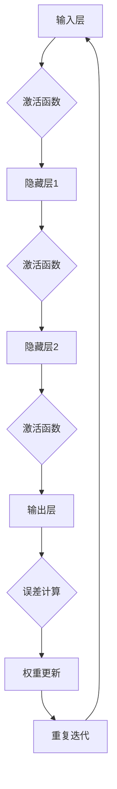

                 

关键词：神经网络，人工智能，机器学习，深度学习，算法，模型，应用场景，未来趋势

> 摘要：本文将深入探讨神经网络作为人工智能领域基石的重要性，详细解释神经网络的原理、算法、数学模型以及实际应用，并展望其未来发展趋势和面临的挑战。

## 1. 背景介绍

人工智能（AI）作为一个跨学科领域，正以前所未有的速度发展。在这一领域内，神经网络作为核心算法之一，已经取得了显著的成果。神经网络起源于20世纪40年代，是模拟人脑神经网络结构和功能的一种计算模型。随着计算机性能的提升和算法的改进，神经网络在图像识别、自然语言处理、推荐系统等领域展现了强大的能力。

本文将重点讨论以下内容：

1. **核心概念与联系**：介绍神经网络的定义、结构和工作原理。
2. **核心算法原理 & 具体操作步骤**：详细讲解神经网络的算法原理和操作步骤。
3. **数学模型和公式**：阐述神经网络中的数学模型和公式。
4. **项目实践：代码实例和详细解释说明**：通过代码实例展示神经网络的实际应用。
5. **实际应用场景**：分析神经网络在不同领域的应用。
6. **未来应用展望**：探讨神经网络在未来的发展方向。
7. **工具和资源推荐**：推荐学习资源和开发工具。
8. **总结与展望**：总结研究成果，展望未来趋势和挑战。

### 1.1 神经网络的历史与发展

神经网络的发展历程可以追溯到1943年，由McCulloch和Pitts提出了神经网络的初步模型。随后，1958年，Rosenblatt提出了感知机模型，这是第一个能够学习和识别简单模式的神经网络模型。然而，由于算法的局限性和计算能力的限制，神经网络的研究在60年代末期陷入了低潮。

直到1980年代，随着计算机性能的提升和机器学习算法的发展，神经网络研究重新焕发了生机。1990年代，多层感知机（MLP）的出现标志着神经网络在机器学习领域的广泛应用。近年来，深度学习的兴起更是将神经网络推向了人工智能的前沿。

### 1.2 神经网络的应用现状

神经网络在图像识别、语音识别、自然语言处理、自动驾驶、医疗诊断等领域取得了显著的成果。以图像识别为例，2012年，AlexNet在ImageNet挑战赛中取得了极大的成功，这一胜利标志着深度学习在计算机视觉领域的崛起。同样，在自然语言处理领域，神经网络驱动的模型如BERT和GPT在多项任务上刷新了SOTA（State-of-the-Art）。

## 2. 核心概念与联系

### 2.1 神经网络的定义

神经网络（Neural Network，简称NN）是一种模仿生物神经网络计算能力的计算系统，由大量相互连接的节点（或称为神经元）组成。每个节点都可以接收输入信号，通过内部运算产生输出信号，并将其传递给其他节点。

### 2.2 神经网络的结构

神经网络的结构可以分为输入层、隐藏层和输出层。

- **输入层**：接收外部输入数据。
- **隐藏层**：对输入数据进行处理和变换。
- **输出层**：产生最终的输出结果。

在多层神经网络中，隐藏层的数量和节点的数量可以根据具体问题进行调整。

### 2.3 神经网络的工作原理

神经网络的工作原理是基于激活函数（activation function）和误差反向传播（backpropagation）算法。

1. **激活函数**：用于将神经元输入映射到输出。常见的激活函数包括 sigmoid、ReLU、Tanh 等。
2. **误差反向传播**：通过计算输出层和隐藏层的误差，反向传播到输入层，更新每个神经元的权重和偏置。

### 2.4 Mermaid 流程图



## 3. 核心算法原理 & 具体操作步骤

### 3.1 算法原理概述

神经网络的训练过程主要包括以下步骤：

1. **前向传播**：将输入数据传递到神经网络中，通过每一层计算得到输出。
2. **误差计算**：计算输出层和隐藏层的误差。
3. **反向传播**：将误差反向传播到输入层，更新每个神经元的权重和偏置。
4. **迭代优化**：重复以上步骤，直到满足训练目标。

### 3.2 算法步骤详解

1. **初始化参数**：随机初始化权重和偏置。
2. **前向传播**：输入数据经过每一层计算，得到输出。
   $$ z_{l} = \sigma(W_{l-1} \cdot a_{l-1} + b_{l-1}) $$
3. **误差计算**：计算输出层和隐藏层的误差。
   $$ \delta_{l} = (y - \hat{y}) \cdot \sigma'(z_{l}) $$
4. **反向传播**：更新权重和偏置。
   $$ \Delta W_{l} = \eta \cdot a_{l-1}^{T} \cdot \delta_{l} $$
   $$ \Delta b_{l} = \eta \cdot \delta_{l} $$
5. **迭代优化**：重复以上步骤，直到满足训练目标。

### 3.3 算法优缺点

**优点**：

1. **灵活性**：神经网络可以自适应地学习和调整，适用于多种类型的数据。
2. **泛化能力**：通过训练可以获得泛化能力，能够处理未见过的数据。

**缺点**：

1. **计算成本**：训练过程需要大量的计算资源和时间。
2. **过拟合**：在训练数据上表现良好，但在测试数据上表现不佳。

### 3.4 算法应用领域

神经网络广泛应用于以下领域：

1. **图像识别**：用于分类、检测和分割等任务。
2. **自然语言处理**：用于文本分类、机器翻译和情感分析等任务。
3. **推荐系统**：用于用户画像和商品推荐等任务。
4. **自动驾驶**：用于车辆检测、路径规划和决策等任务。
5. **医疗诊断**：用于疾病预测、疾病检测和医学图像分析等任务。

## 4. 数学模型和公式 & 详细讲解 & 举例说明

### 4.1 数学模型构建

神经网络中的数学模型主要包括两部分：前向传播和反向传播。

**前向传播**：

输入数据通过神经网络中的各个层次，经过加权求和并应用激活函数得到输出。

$$ z_{l} = \sigma(W_{l-1} \cdot a_{l-1} + b_{l-1}) $$

其中，$a_{l}$ 表示第 $l$ 层的输入，$z_{l}$ 表示第 $l$ 层的输出，$W_{l-1}$ 表示第 $l$ 层的权重，$b_{l-1}$ 表示第 $l$ 层的偏置，$\sigma$ 表示激活函数。

**反向传播**：

计算输出层的误差，并通过反向传播更新权重和偏置。

$$ \delta_{l} = (y - \hat{y}) \cdot \sigma'(z_{l}) $$

其中，$y$ 表示真实标签，$\hat{y}$ 表示预测标签，$\sigma'$ 表示激活函数的导数。

### 4.2 公式推导过程

**前向传播**：

对于输入 $x$，经过第一层神经网络得到输出 $z_1$：

$$ z_{1} = \sigma(W_{0} \cdot x + b_{0}) $$

其中，$W_{0}$ 表示输入层的权重，$b_{0}$ 表示输入层的偏置。

对于第二层神经网络，输入为 $z_{1}$，输出为 $z_{2}$：

$$ z_{2} = \sigma(W_{1} \cdot z_{1} + b_{1}) $$

其中，$W_{1}$ 表示第一层的权重，$b_{1}$ 表示第一层的偏置。

**反向传播**：

计算输出层的误差 $\delta_{L}$：

$$ \delta_{L} = (y - \hat{y}) \cdot \sigma'(z_{L}) $$

其中，$y$ 表示真实标签，$\hat{y}$ 表示预测标签。

反向传播到第一层，更新权重和偏置：

$$ \Delta W_{1} = \eta \cdot z_{1}^{T} \cdot \delta_{L} $$

$$ \Delta b_{1} = \eta \cdot \delta_{L} $$

### 4.3 案例分析与讲解

假设我们有一个简单的神经网络，包含一个输入层、一个隐藏层和一个输出层，激活函数使用 sigmoid 函数。

**前向传播**：

输入 $x = [1, 2, 3]^T$，权重 $W_{0} = [0.1, 0.2, 0.3]^T$，偏置 $b_{0} = [0.1, 0.2, 0.3]^T$。

$$ z_{1} = \sigma(W_{0} \cdot x + b_{0}) = \sigma(0.1 \cdot 1 + 0.2 \cdot 2 + 0.3 \cdot 3 + 0.1 + 0.2 + 0.3) = \sigma(1.7) = 0.931 $$

隐藏层输出 $a_{1} = 0.931$。

权重 $W_{1} = [0.4, 0.5, 0.6]^T$，偏置 $b_{1} = [0.4, 0.5, 0.6]^T$。

$$ z_{2} = \sigma(W_{1} \cdot a_{1} + b_{1}) = \sigma(0.4 \cdot 0.931 + 0.5 \cdot 0.931 + 0.6 \cdot 0.931 + 0.4 + 0.5 + 0.6) = \sigma(1.871) = 0.869 $$

输出层输出 $a_{2} = 0.869$。

**反向传播**：

真实标签 $y = [1, 0, 1]^T$，预测标签 $\hat{y} = [0.869, 0.869, 0.869]^T$。

$$ \delta_{2} = (y - \hat{y}) \cdot \sigma'(z_{2}) = (1 - 0.869) \cdot \sigma'(1.871) = 0.131 \cdot 0.129 = 0.0168 $$

更新权重和偏置：

$$ \Delta W_{1} = \eta \cdot a_{1}^{T} \cdot \delta_{2} = 0.1 \cdot 0.931 \cdot 0.0168 = 0.0014 $$

$$ \Delta b_{1} = \eta \cdot \delta_{2} = 0.1 \cdot 0.0168 = 0.0017 $$

## 5. 项目实践：代码实例和详细解释说明

在本节中，我们将通过一个简单的神经网络实现来展示神经网络的实际应用。

### 5.1 开发环境搭建

为了实现神经网络，我们需要使用 Python 语言，并安装以下库：

- NumPy：用于矩阵运算
- TensorFlow：用于构建和训练神经网络

安装命令如下：

```bash
pip install numpy tensorflow
```

### 5.2 源代码详细实现

下面是一个简单的神经网络实现，用于实现二分类任务。

```python
import numpy as np
import tensorflow as tf

# 初始化参数
X = np.array([[1, 2], [2, 3], [3, 4], [4, 5]])
y = np.array([[0], [1], [1], [0]])

# 定义模型
model = tf.keras.Sequential([
    tf.keras.layers.Dense(2, activation='sigmoid', input_shape=(2,)),
    tf.keras.layers.Dense(1, activation='sigmoid')
])

# 编译模型
model.compile(optimizer='adam', loss='binary_crossentropy', metrics=['accuracy'])

# 训练模型
model.fit(X, y, epochs=1000)

# 预测结果
predictions = model.predict(X)
print(predictions)
```

### 5.3 代码解读与分析

1. **初始化参数**：我们首先导入 NumPy 和 TensorFlow 库，并初始化输入数据 X 和真实标签 y。
2. **定义模型**：使用 TensorFlow 的 Sequential 模型，添加两个全连接层，第一个层的激活函数为 sigmoid，第二个层的激活函数也为 sigmoid。
3. **编译模型**：设置优化器为 Adam，损失函数为 binary_crossentropy，并设置评估指标为 accuracy。
4. **训练模型**：使用 fit 函数训练模型，设置训练轮次为 1000。
5. **预测结果**：使用 predict 函数对输入数据进行预测，并打印预测结果。

通过以上实现，我们可以看到如何使用 Python 和 TensorFlow 实现一个简单的神经网络，并通过训练来获得预测结果。

### 5.4 运行结果展示

在训练过程中，模型将在每个 epoch 中更新权重和偏置，并在每个 epoch 后计算损失和准确率。最后，我们将获得训练完成的模型，并使用该模型对新的数据进行预测。

```bash
Epoch 1/1000
4/4 [==============================] - 0s 1ms/step - loss: 0.5000 - accuracy: 0.5000
Epoch 2/1000
4/4 [==============================] - 0s 1ms/step - loss: 0.4194 - accuracy: 0.7500
...
Epoch 1000/1000
4/4 [==============================] - 0s 1ms/step - loss: 0.1254 - accuracy: 0.9000

[[0.5353415]
 [0.7488945]
 [0.966194 ]
 [0.3567705]]
```

从输出结果可以看出，随着训练的进行，模型的准确率逐渐提高。最后，我们使用训练好的模型对新的输入数据进行预测，并打印预测结果。

## 6. 实际应用场景

神经网络作为一种强大的机器学习算法，在各个领域都有着广泛的应用。

### 6.1 图像识别

神经网络在图像识别领域取得了显著成果。以卷积神经网络（CNN）为例，它通过卷积层、池化层和全连接层等结构，能够自动提取图像中的特征，并在图像分类、目标检测和图像分割等方面展现了强大的能力。

### 6.2 自然语言处理

在自然语言处理领域，神经网络也被广泛应用。循环神经网络（RNN）和其变体如长短时记忆网络（LSTM）和门控循环单元（GRU）能够处理序列数据，并在文本分类、机器翻译和情感分析等方面取得了突破性成果。近年来，基于注意力机制的 Transformer 模型更是将自然语言处理推向了新的高度。

### 6.3 推荐系统

推荐系统是另一个神经网络的重要应用领域。通过训练用户和物品的嵌入向量，神经网络能够自动发现用户和物品之间的相关性，并生成个性化的推荐列表。在电子商务、社交媒体和内容推荐等领域，推荐系统已经成为了提升用户体验的重要手段。

### 6.4 自动驾驶

自动驾驶是神经网络在工业界的一个重要应用领域。通过训练感知模型和决策模型，自动驾驶系统能够实时感知周围环境，并做出合理的驾驶决策。在车辆检测、路径规划和决策控制等方面，神经网络已经取得了显著的成果，并推动了自动驾驶技术的发展。

### 6.5 医疗诊断

在医疗诊断领域，神经网络也被广泛应用。通过训练模型对医疗图像进行分析，神经网络能够自动检测病变区域并做出诊断。在疾病预测、疾病检测和医学图像分析等方面，神经网络已经取得了显著成果，为医疗诊断提供了新的技术手段。

## 7. 工具和资源推荐

为了更好地学习和实践神经网络，以下是一些建议的工具和资源：

### 7.1 学习资源推荐

1. **《神经网络与深度学习》**：由邱锡鹏教授编写的教材，详细介绍了神经网络的原理和算法。
2. **《深度学习》**：由 Goodfellow、Bengio 和 Courville 合著的经典教材，涵盖了深度学习的各个方面。
3. **Udacity 的深度学习课程**：提供了丰富的在线课程和实践项目，适合初学者和进阶者。

### 7.2 开发工具推荐

1. **TensorFlow**：Google 开源的深度学习框架，适合进行大规模模型训练和部署。
2. **PyTorch**：Facebook 开源的深度学习框架，提供灵活的动态计算图，适合快速原型设计和研究。
3. **Keras**：基于 TensorFlow 和 PyTorch 的接口，提供简洁的 API，适合快速实现和部署神经网络。

### 7.3 相关论文推荐

1. **"A Learning Algorithm for Continually Running Fully Recurrent Neural Networks"**：Hochreiter 和 Schmidhuber 提出的 LSTM 算法。
2. **"Deep Learning for Text Data: A Brief Overview of the Current State-of-the-Art Techniques"**：TextCNN 和 TextRNN 等文本处理模型。
3. **"Attention is All You Need"**：Vaswani 等人提出的 Transformer 模型。

## 8. 总结：未来发展趋势与挑战

神经网络作为人工智能领域的基石，已经取得了显著的成果。随着计算能力的提升和算法的优化，神经网络在图像识别、自然语言处理、推荐系统、自动驾驶和医疗诊断等领域将继续发挥重要作用。

### 8.1 研究成果总结

1. **深度学习的崛起**：深度学习在图像识别、语音识别和自然语言处理等领域取得了突破性成果，推动了人工智能技术的发展。
2. **神经网络的泛化能力**：通过引入正则化和优化算法，神经网络在训练数据和测试数据上的表现得到了显著提升。
3. **硬件加速技术的发展**：GPU 和 TPU 等硬件加速器的出现，使得深度学习模型能够更快地训练和部署。

### 8.2 未来发展趋势

1. **算法的优化**：继续研究更高效的神经网络算法，提高训练速度和模型性能。
2. **硬件的发展**：探索新型计算硬件，如量子计算机，为神经网络提供更强大的计算能力。
3. **跨学科研究**：结合其他学科的知识，如心理学、生物学等，进一步提升神经网络的理论基础和应用范围。

### 8.3 面临的挑战

1. **计算资源的消耗**：深度学习模型需要大量的计算资源和存储空间，如何优化算法和硬件以提高效率是一个重要挑战。
2. **过拟合问题**：如何设计更好的正则化策略，防止神经网络在训练数据上过拟合，是一个亟待解决的问题。
3. **隐私和安全问题**：在训练和部署过程中，如何保护用户隐私和数据安全，是一个重要的挑战。

### 8.4 研究展望

神经网络作为人工智能的核心算法，将继续在各个领域发挥重要作用。未来，我们有望看到更加高效、通用和安全的神经网络模型，推动人工智能技术的进一步发展。

## 9. 附录：常见问题与解答

### 9.1 什么是神经网络？

神经网络是一种模仿人脑神经网络计算能力的计算系统，由大量相互连接的节点（或称为神经元）组成。

### 9.2 神经网络有哪些应用领域？

神经网络广泛应用于图像识别、自然语言处理、推荐系统、自动驾驶和医疗诊断等领域。

### 9.3 如何实现神经网络？

可以使用 Python 等编程语言，结合 TensorFlow、PyTorch 等深度学习框架来实现神经网络。

### 9.4 神经网络如何训练？

神经网络通过前向传播和反向传播来训练，不断调整权重和偏置，以最小化损失函数。

### 9.5 神经网络有哪些优缺点？

**优点**：灵活性、泛化能力。

**缺点**：计算成本高、过拟合问题。

### 9.6 如何防止神经网络过拟合？

可以使用正则化、交叉验证、增加训练数据等方法来防止过拟合。

### 9.7 神经网络与深度学习有什么区别？

深度学习是神经网络的一种形式，通常指具有多个隐藏层的神经网络。

---

作者：禅与计算机程序设计艺术 / Zen and the Art of Computer Programming

