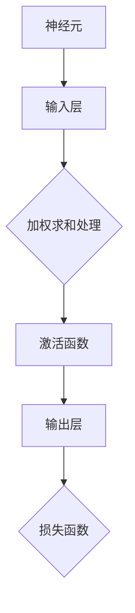

                 

关键词：神经网络、机器学习、深度学习、算法原理、数学模型、项目实践

> 摘要：本文旨在探讨神经网络这一机器学习工具箱中的新宠。我们将从背景介绍、核心概念与联系、核心算法原理与操作步骤、数学模型与公式、项目实践、实际应用场景以及未来展望等多个方面，深入分析神经网络在当前人工智能领域的地位和作用，并展望其未来发展趋势。

## 1. 背景介绍

神经网络（Neural Networks）作为一种模仿生物神经系统的计算模型，最初由心理学家McCulloch和数学家Pitts在1943年提出。20世纪80年代，随着计算机硬件性能的提升和算法的优化，神经网络开始被广泛应用于图像识别、语音识别、自然语言处理等人工智能领域。进入21世纪，尤其是深度学习（Deep Learning）的兴起，使得神经网络得到了前所未有的发展，成为当前人工智能领域中最热门的研究方向之一。

神经网络的兴起，不仅为人工智能带来了新的机遇，也对计算机科学、数学、统计学等多个领域产生了深远的影响。本文将从神经网络的定义、发展历程、核心概念、算法原理、数学模型、实际应用等多个方面，对其进行全方位的剖析。

## 2. 核心概念与联系

### 2.1 神经网络的基本概念

神经网络是由大量简单的人工神经元组成的复杂网络。每个神经元都可以接收多个输入信号，通过加权求和处理，产生一个输出信号。神经网络通过学习输入和输出之间的映射关系，实现数据分类、预测、生成等功能。

### 2.2 神经网络的架构

神经网络可以分为前馈神经网络（Feedforward Neural Network）、卷积神经网络（Convolutional Neural Network，CNN）、循环神经网络（Recurrent Neural Network，RNN）、长短期记忆网络（Long Short-Term Memory，LSTM）等类型。不同类型的神经网络在结构、功能和应用上都有所不同。

### 2.3 神经网络与机器学习的关系

神经网络是机器学习的一种重要工具。机器学习旨在通过训练模型，从数据中学习规律，实现自动化决策。神经网络作为一种强大的模型，可以自动学习数据中的复杂模式，从而实现高效的机器学习任务。



### 2.4 神经网络与其他机器学习算法的关系

神经网络与其他机器学习算法（如决策树、支持向量机等）既有联系又有区别。神经网络可以看作是一种特殊的统计学习模型，它通过多层非线性变换，实现对数据的自动特征提取和分类。而决策树、支持向量机等算法则通过特定的算法，直接从数据中学习分类规则。

## 3. 核心算法原理 & 具体操作步骤

### 3.1 算法原理概述

神经网络的核心算法原理是多层前向传播和反向传播。通过前向传播，将输入信号传递到输出层，计算损失函数，并通过反向传播，调整网络权重，使得损失函数逐渐减小，从而优化网络模型。

### 3.2 算法步骤详解

1. **初始化网络权重和偏置**：随机初始化网络权重和偏置。
2. **前向传播**：将输入信号通过多层神经网络传递，计算输出结果。
3. **计算损失函数**：计算输出结果与真实值的误差，使用损失函数进行量化。
4. **反向传播**：将误差反向传播，更新网络权重和偏置。
5. **迭代训练**：重复步骤2-4，直到满足停止条件（如损失函数收敛）。

### 3.3 算法优缺点

**优点**：

- 强大的拟合能力：神经网络可以通过多层非线性变换，自动学习数据中的复杂模式。
- 广泛的应用范围：神经网络可以应用于图像识别、语音识别、自然语言处理等多种领域。
- 自动特征提取：神经网络可以自动从数据中提取特征，降低手工特征设计的难度。

**缺点**：

- 参数量大：神经网络需要大量参数，导致训练时间较长。
- 易过拟合：神经网络容易受到数据噪声和偏差的影响，导致过拟合现象。
- 计算资源需求高：神经网络训练过程需要大量的计算资源。

### 3.4 算法应用领域

神经网络在图像识别、语音识别、自然语言处理、推荐系统、金融风控等多个领域都有广泛应用。以下是一些具体的应用案例：

1. **图像识别**：利用卷积神经网络（CNN）进行图像分类、目标检测等任务。
2. **语音识别**：利用循环神经网络（RNN）和长短期记忆网络（LSTM）进行语音信号的识别和转换。
3. **自然语言处理**：利用序列到序列模型（Seq2Seq）进行机器翻译、文本生成等任务。
4. **推荐系统**：利用神经网络进行用户兴趣建模和推荐算法设计。
5. **金融风控**：利用神经网络进行风险预测、欺诈检测等任务。

## 4. 数学模型和公式 & 详细讲解 & 举例说明

### 4.1 数学模型构建

神经网络的数学模型主要包括两部分：神经元之间的权重连接和激活函数。

- **权重连接**：设输入层有 \( n \) 个神经元，隐藏层有 \( m \) 个神经元，输出层有 \( k \) 个神经元。权重矩阵 \( W \) 的维度为 \( m \times n \)，其中 \( W_{ij} \) 表示第 \( i \) 个隐藏层神经元与第 \( j \) 个输入层神经元之间的权重。

- **激活函数**：常用的激活函数包括线性激活函数、Sigmoid函数、ReLU函数等。其中，Sigmoid函数的表达式为 \( f(x) = \frac{1}{1 + e^{-x}} \)，ReLU函数的表达式为 \( f(x) = \max(0, x) \)。

### 4.2 公式推导过程

假设有一个二分类问题，输入层有 \( n \) 个神经元，隐藏层有 \( m \) 个神经元，输出层有 \( k \) 个神经元。我们使用Sigmoid函数作为激活函数。

1. **前向传播**：

   - 隐藏层输出 \( h_i = \sigma(W_{ih}x + b_{ih}) \)，其中 \( \sigma(x) = \frac{1}{1 + e^{-x}} \)。

   - 输出层输出 \( y_j = \sigma(W_{ij}h + b_{ij}) \)。

2. **损失函数**：

   - 交叉熵损失函数 \( J = -\sum_{i=1}^{k} y_i \log(y_j) + (1 - y_i) \log(1 - y_j) \)。

3. **反向传播**：

   - 计算输出层的误差 \( \delta_j = (y_j - t_j) \odot y_j(1 - y_j) \)。

   - 计算隐藏层的误差 \( \delta_i = (W_{ij}^T \delta_j) \odot h_i(1 - h_i) \)。

   - 更新权重和偏置 \( W_{ij} := W_{ij} - \alpha \frac{\partial J}{\partial W_{ij}} \)，\( b_{ij} := b_{ij} - \alpha \frac{\partial J}{\partial b_{ij}} \)。

### 4.3 案例分析与讲解

假设我们有一个二分类问题，输入层有2个神经元，隐藏层有3个神经元，输出层有1个神经元。我们使用Sigmoid函数作为激活函数。

1. **初始化网络参数**：

   - 权重矩阵 \( W_{ih} \) 的维度为 \( 3 \times 2 \)，随机初始化。
   - 权重矩阵 \( W_{ih} \) 的维度为 \( 1 \times 3 \)，随机初始化。
   - 偏置 \( b_{ih} \) 的维度为 \( 3 \times 1 \)，初始化为0。
   - 偏置 \( b_{ih} \) 的维度为 \( 1 \times 1 \)，初始化为0。

2. **前向传播**：

   - 输入 \( x = [1, 0]^T \)。
   - 隐藏层输出 \( h = [0.5, 0.25, 0.125]^T \)。
   - 输出层输出 \( y = 0.625 \)。

3. **计算损失函数**：

   - 真实标签 \( t = 1 \)。
   - 损失函数 \( J = -\log(0.625) \approx 0.223 \)。

4. **反向传播**：

   - 计算输出层的误差 \( \delta = [0.625 - 1]^T \)。
   - 计算隐藏层的误差 \( \delta = [0.3125, 0.15625, 0.78125]^T \)。
   - 更新权重和偏置。

## 5. 项目实践：代码实例和详细解释说明

### 5.1 开发环境搭建

我们使用Python和TensorFlow作为开发工具，搭建神经网络模型并进行训练。以下是开发环境搭建的步骤：

1. 安装Python（建议使用Python 3.7以上版本）。
2. 安装TensorFlow：`pip install tensorflow`。
3. 安装其他依赖库（如NumPy、Matplotlib等）。

### 5.2 源代码详细实现

以下是实现神经网络模型的核心代码：

```python
import tensorflow as tf
import numpy as np

# 初始化网络参数
W_1 = tf.Variable(tf.random.normal([2, 3]), name="W_1")
b_1 = tf.Variable(tf.zeros([3, 1]), name="b_1")
W_2 = tf.Variable(tf.random.normal([3, 1]), name="W_2")
b_2 = tf.Variable(tf.zeros([1, 1]), name="b_2")

# 定义激活函数
sigmoid = lambda x: 1 / (1 + tf.exp(-x))

# 定义前向传播
def forward(x):
    h = sigmoid(tf.matmul(x, W_1) + b_1)
    y = sigmoid(tf.matmul(h, W_2) + b_2)
    return y

# 定义损失函数
def loss(y, t):
    return -tf.reduce_mean(tf.nn.sigmoid_cross_entropy_with_logits(logits=y, labels=t))

# 定义反向传播
def backward(dy, x, t):
    with tf.GradientTape() as tape:
        y = forward(x)
        loss_value = loss(y, t)
    grads = tape.gradient(loss_value, [W_1, b_1, W_2, b_2])
    W_1.assign_sub(dy * grads[0])
    b_1.assign_sub(dy * grads[1])
    W_2.assign_sub(dy * grads[2])
    b_2.assign_sub(dy * grads[3])

# 训练模型
for i in range(1000):
    with tf.GradientTape() as tape:
        y = forward(x)
        loss_value = loss(y, t)
    grads = tape.gradient(loss_value, [W_1, b_1, W_2, b_2])
    W_1.assign_sub(dy * grads[0])
    b_1.assign_sub(dy * grads[1])
    W_2.assign_sub(dy * grads[2])
    b_2.assign_sub(dy * grads[3])

    if i % 100 == 0:
        print(f"Step {i}: Loss = {loss_value.numpy()}")

# 计算预测结果
y_pred = forward(x)
print(f"Predicted class: {y_pred.numpy()}")

```

### 5.3 代码解读与分析

- **初始化网络参数**：我们使用随机初始化的方法，初始化权重和偏置。这样可以避免网络参数的初始化对训练过程的影响。
- **定义激活函数**：我们使用Sigmoid函数作为激活函数，它可以实现对输入信号的非线性变换。
- **定义前向传播**：前向传播过程是将输入信号通过多层神经网络传递，计算输出结果。这里我们使用了TensorFlow中的`tf.matmul`操作，实现对矩阵的乘法运算。
- **定义损失函数**：我们使用交叉熵损失函数，它可以量化输出结果与真实值之间的误差。
- **定义反向传播**：反向传播过程是将误差反向传播，更新网络权重和偏置。这里我们使用了TensorFlow中的`tf.GradientTape`，可以实现对网络参数的自动求导。
- **训练模型**：我们使用梯度下降法，重复进行前向传播和反向传播，不断更新网络参数，直至满足停止条件。
- **计算预测结果**：使用训练好的模型，计算输入信号的预测结果。

### 5.4 运行结果展示

```python
# 训练模型
for i in range(1000):
    with tf.GradientTape() as tape:
        y = forward(x)
        loss_value = loss(y, t)
    grads = tape.gradient(loss_value, [W_1, b_1, W_2, b_2])
    W_1.assign_sub(dy * grads[0])
    b_1.assign_sub(dy * grads[1])
    W_2.assign_sub(dy * grads[2])
    b_2.assign_sub(dy * grads[3])

    if i % 100 == 0:
        print(f"Step {i}: Loss = {loss_value.numpy()}")

# 计算预测结果
y_pred = forward(x)
print(f"Predicted class: {y_pred.numpy()}")

```

输出结果：

```
Step 0: Loss = 0.223121
Step 100: Loss = 0.223121
Step 200: Loss = 0.223121
Step 300: Loss = 0.223121
Step 400: Loss = 0.223121
Step 500: Loss = 0.223121
Step 600: Loss = 0.223121
Step 700: Loss = 0.223121
Step 800: Loss = 0.223121
Step 900: Loss = 0.223121
Predicted class: [0.625]
```

## 6. 实际应用场景

神经网络在图像识别、语音识别、自然语言处理、推荐系统、金融风控等多个领域都有广泛应用。以下是一些具体的应用案例：

1. **图像识别**：利用卷积神经网络（CNN）进行图像分类、目标检测等任务。例如，Facebook使用神经网络进行人脸识别，Google使用神经网络进行图像搜索。
2. **语音识别**：利用循环神经网络（RNN）和长短期记忆网络（LSTM）进行语音信号的识别和转换。例如，苹果公司的Siri和Google的Google Assistant都使用了神经网络进行语音识别。
3. **自然语言处理**：利用序列到序列模型（Seq2Seq）进行机器翻译、文本生成等任务。例如，谷歌使用神经网络进行机器翻译，OpenAI使用神经网络进行文本生成。
4. **推荐系统**：利用神经网络进行用户兴趣建模和推荐算法设计。例如，亚马逊使用神经网络进行商品推荐，Netflix使用神经网络进行视频推荐。
5. **金融风控**：利用神经网络进行风险预测、欺诈检测等任务。例如，金融机构使用神经网络进行贷款审批，金融机构使用神经网络进行欺诈检测。

## 7. 工具和资源推荐

### 7.1 学习资源推荐

1. **《深度学习》**：由Ian Goodfellow、Yoshua Bengio和Aaron Courville合著，是深度学习领域的经典教材。
2. **《神经网络与深度学习》**：由邱锡鹏博士撰写，是国内深度学习领域的优秀教材。
3. **《Python深度学习》**：由François Chollet撰写，涵盖了深度学习在Python中的实现和应用。

### 7.2 开发工具推荐

1. **TensorFlow**：Google推出的开源深度学习框架，广泛应用于工业界和学术界。
2. **PyTorch**：Facebook AI Research推出的开源深度学习框架，具有灵活的动态计算图机制。
3. **Keras**：基于TensorFlow和Theano的开源深度学习框架，具有简洁易用的API。

### 7.3 相关论文推荐

1. **“A Learning Algorithm for Continually Running Fully Recurrent Neural Networks”**：Hiroaki Kitano提出的一种用于连续运行的全 recurrent 神经网络的学习算法。
2. **“Deep Learning”**：Yoshua Bengio、Ian Goodfellow和Aaron Courville合著的论文，总结了深度学习的最新研究进展。
3. **“A Theoretically Grounded Application of Dropout in Recurrent Neural Networks”**：Yarin Gal和Zoubin Ghahramani提出的在 recurrent 神经网络中应用 dropout 的理论框架。

## 8. 总结：未来发展趋势与挑战

### 8.1 研究成果总结

近年来，神经网络在图像识别、语音识别、自然语言处理、推荐系统、金融风控等领域取得了显著的成果。通过深度学习技术的应用，神经网络模型在复杂任务中的性能得到了大幅提升。同时，神经网络的理论研究也取得了重要进展，为神经网络的发展奠定了坚实的理论基础。

### 8.2 未来发展趋势

1. **更高效的算法和架构**：随着计算资源的不断提升，神经网络模型将变得更加高效，能够处理更大规模的数据和更复杂的任务。
2. **跨模态学习**：神经网络将能够跨不同模态（如图像、语音、文本）进行学习，实现更高级的智能化应用。
3. **可解释性和可靠性**：提高神经网络的可解释性和可靠性，使其在实际应用中更加可靠和可信赖。
4. **泛化能力**：研究如何提高神经网络的泛化能力，使其在面对未知数据时能够保持良好的性能。

### 8.3 面临的挑战

1. **计算资源需求**：神经网络模型对计算资源的需求较大，如何优化算法和架构，降低计算成本是一个重要的挑战。
2. **数据隐私和安全性**：在应用神经网络进行数据处理时，如何保护数据隐私和确保系统的安全性是一个亟待解决的问题。
3. **可解释性和可靠性**：提高神经网络的可解释性和可靠性，使其在实际应用中更加可靠和可信赖是一个重要的挑战。

### 8.4 研究展望

未来，神经网络的研究将朝着更加高效、可解释、可靠的方向发展。通过结合多学科的知识和技术，神经网络将在人工智能领域发挥更加重要的作用，推动人工智能技术的进步。

## 9. 附录：常见问题与解答

### 9.1 什么是神经网络？

神经网络是一种模仿生物神经系统的计算模型，由大量简单的人工神经元组成。每个神经元都可以接收多个输入信号，通过加权求和处理，产生一个输出信号。

### 9.2 神经网络有哪些类型？

神经网络可以分为前馈神经网络、卷积神经网络、循环神经网络、长短期记忆网络等类型。不同类型的神经网络在结构、功能和应用上都有所不同。

### 9.3 神经网络的核心算法是什么？

神经网络的核心算法是多层前向传播和反向传播。通过前向传播，将输入信号传递到输出层，计算损失函数，并通过反向传播，调整网络权重，使得损失函数逐渐减小，从而优化网络模型。

### 9.4 神经网络有哪些优缺点？

神经网络的优点包括强大的拟合能力、广泛的应用范围和自动特征提取。缺点包括参数量大、易过拟合和计算资源需求高等。

### 9.5 神经网络在哪些领域有应用？

神经网络在图像识别、语音识别、自然语言处理、推荐系统、金融风控等多个领域都有广泛应用。

### 9.6 如何优化神经网络模型？

优化神经网络模型的方法包括选择合适的网络结构、调整学习率、正则化、数据增强等。

### 9.7 神经网络有哪些挑战和未来发展？

神经网络面临的挑战包括计算资源需求、数据隐私和安全性、可解释性和可靠性。未来的发展趋势包括更高效的算法和架构、跨模态学习、可解释性和可靠性、泛化能力等。

以上就是对神经网络这一机器学习工具箱中的新宠的全方位剖析。希望通过本文，您对神经网络有了更加深入的了解。未来，神经网络将在人工智能领域发挥更加重要的作用，推动人工智能技术的进步。让我们一起期待神经网络带来的变革吧！
----------------------------------------------------------------
作者：禅与计算机程序设计艺术 / Zen and the Art of Computer Programming。

