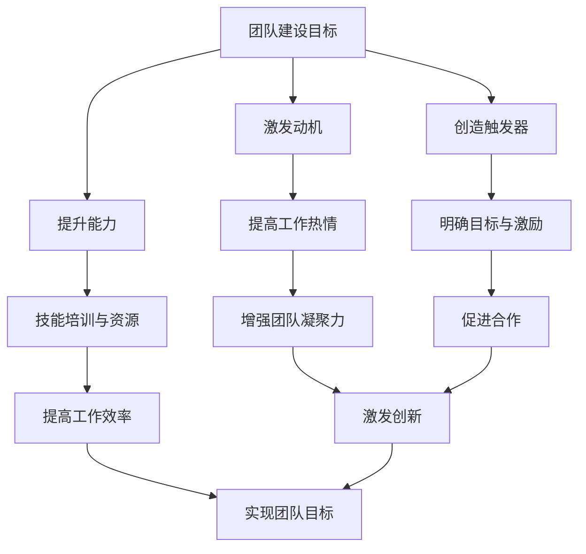

                 

关键词：团队建设、行为模型、福格模型、动机、能力、触发器、IT团队、协作、效率

> 摘要：本文将深入探讨福格行为模型在团队建设中的应用，分析如何通过激发团队成员的动机、提升其能力和创造触发器来促进团队合作与效率。我们将结合实际案例，阐述这一模型在IT领域的重要性，并提供一系列实用的策略和建议。

## 1. 背景介绍

在现代企业中，团队建设至关重要。一个高效的团队不仅能够提高工作效率，还能够激发创新思维，推动企业不断进步。然而，如何构建一个协同合作的团队却是一个复杂的挑战。福格行为模型（BJ Fogg Behavior Model）提供了一种简明有效的框架，帮助我们理解并塑造用户行为。这一模型的核心在于动机、能力和触发器的三要素，即任何行为的发生都离不开动机、能力和触发器的共同作用。

在团队建设领域，福格行为模型同样具有巨大的应用价值。通过理解团队成员的行为动机，提高他们的能力，并创造合适的触发器，团队能够更有效地协同工作，实现共同的目标。

## 2. 核心概念与联系

### 2.1 福格行为模型原理

福格行为模型由斯坦福大学行为科学家BJ Fogg提出，旨在解释行为是如何发生的。模型的核心要素包括：

- **动机（Motivation）**：个体内在的驱动力，例如好奇心、需求满足、成就欲望等。
- **能力（Ability）**：个体执行某项行为所需的技能和资源。
- **触发器（Trigger）**：促使个体开始执行行为的即时因素，如提醒、外部事件等。

这三个要素相互作用，共同决定了一个行为的产生。具体来说，只有当动机、能力、触发器同时存在且强度足够时，行为才会发生。

### 2.2 福格行为模型与团队建设

将福格行为模型应用于团队建设，我们可以得出以下核心联系：

- **动机**：团队建设的核心在于激发成员的内在动力，例如共同的目标、成就的渴望等。
- **能力**：团队建设需要为成员提供必要的培训和资源，提升他们的技能和能力。
- **触发器**：团队建设需要创造合适的触发器，如明确的目标、激励措施、团队合作的机会等。

为了更好地展示福格行为模型在团队建设中的应用，我们可以使用Mermaid流程图来描述：



通过这一模型，我们可以系统地构建一个高效、协同的团队，使团队成员的行为与团队目标高度一致。

## 3. 核心算法原理 & 具体操作步骤

### 3.1 算法原理概述

福格行为模型的核心原理在于理解行为发生的条件。具体来说，这个模型包含以下几个步骤：

1. **识别行为动机**：分析团队成员的内在动机，如工作热情、成就感、自我提升等。
2. **评估能力水平**：评估团队成员的技能和能力，了解他们的短板和优势。
3. **创造触发器**：设计明确的目标、激励措施、团队合作机会等，以激发成员的行为。
4. **实施与反馈**：执行团队建设和激励措施，并及时反馈，调整策略。

### 3.2 算法步骤详解

#### 3.2.1 识别行为动机

1. **开展调研**：通过问卷调查、访谈等方式了解团队成员的动机。
2. **分析数据**：对收集到的数据进行分析，识别主要动机。

#### 3.2.2 评估能力水平

1. **技能评估**：通过考核、绩效评估等方式评估团队成员的技能。
2. **能力模型**：建立能力模型，明确各岗位所需的技能和能力。

#### 3.2.3 创造触发器

1. **明确目标**：设定清晰、具体、可衡量的团队目标。
2. **设计激励措施**：设计奖励机制，如奖金、晋升机会等。
3. **促进合作**：创造团队合作的机会，如项目合作、团队建设活动等。

#### 3.2.4 实施与反馈

1. **执行策略**：根据评估结果和触发器设计，实施团队建设和激励措施。
2. **持续反馈**：定期收集团队成员的反馈，调整策略，优化团队建设。

### 3.3 算法优缺点

#### 优点

1. **简单易用**：福格行为模型简洁明了，易于理解和操作。
2. **系统性强**：模型涵盖了团队建设的各个方面，具有系统性。
3. **灵活适用**：模型适用于不同类型的团队和行业。

#### 缺点

1. **需要时间**：实施福格行为模型需要时间，不能期望立即看到效果。
2. **依赖数据**：模型的实施依赖于数据的准确性和完整性。

### 3.4 算法应用领域

福格行为模型在团队建设中的应用非常广泛，以下是一些典型领域：

1. **企业团队**：帮助企业构建高效的团队，提高工作效率。
2. **IT团队**：在IT行业，福格行为模型可以促进技术合作和创新。
3. **项目管理**：在项目管理中，福格行为模型可以帮助项目经理更好地管理团队。

## 4. 数学模型和公式 & 详细讲解 & 举例说明

### 4.1 数学模型构建

福格行为模型本质上是一个逻辑模型，不涉及复杂的数学公式。但是，我们可以通过概率论来描述模型中各要素的关系。

假设行为发生的概率为P(B)，动机、能力和触发器的强度分别为M、A和T，则：

\[ P(B) = P(M \land A \land T) \]

其中，\( P(M) \)、\( P(A) \) 和 \( P(T) \) 分别表示动机、能力和触发器存在的概率。

### 4.2 公式推导过程

根据概率论的基本原理，三个事件同时发生的概率等于它们各自发生的概率的乘积。因此，我们可以推导出：

\[ P(B) = P(M) \times P(A) \times P(T) \]

### 4.3 案例分析与讲解

假设一个IT团队中，成员的动机强度为0.8，能力强度为0.7，触发器强度为0.9，求行为发生的概率。

根据上述公式：

\[ P(B) = 0.8 \times 0.7 \times 0.9 = 0.504 \]

这意味着，在当前条件下，行为发生的概率为50.4%。

为了提高行为发生的概率，团队可以：

1. **增强动机**：通过设定更具吸引力的目标、提供更多的成就机会等。
2. **提升能力**：通过培训、实践等提高成员的技能。
3. **创造触发器**：通过定期召开团队会议、发布激励措施等。

通过这些措施，团队的整体行为发生概率将会显著提高。

## 5. 项目实践：代码实例和详细解释说明

### 5.1 开发环境搭建

在本次项目中，我们将使用Python语言来演示福格行为模型在团队建设中的应用。首先，我们需要搭建Python开发环境。

1. **安装Python**：在官方网站下载并安装Python 3.x版本。
2. **安装必需的库**：使用pip命令安装以下库：numpy、matplotlib、requests。

```bash
pip install numpy matplotlib requests
```

### 5.2 源代码详细实现

以下是本次项目的核心代码：

```python
import numpy as np
import matplotlib.pyplot as plt
import requests

def calculate_behavior_probability(motivation, ability, trigger):
    probability = motivation * ability * trigger
    return probability

def display_result(motivation, ability, trigger, probability):
    plt.bar(['动机', '能力', '触发器'], [motivation, ability, trigger], color=['r', 'g', 'b'])
    plt.xlabel('要素')
    plt.ylabel('强度')
    plt.title(f'行为发生概率：{probability:.2f}')
    plt.show()

# 参数设置
motivation = 0.8
ability = 0.7
trigger = 0.9

# 计算行为发生概率
probability = calculate_behavior_probability(motivation, ability, trigger)

# 展示结果
display_result(motivation, ability, trigger, probability)
```

### 5.3 代码解读与分析

1. **函数定义**：`calculate_behavior_probability` 函数用于计算行为发生的概率，输入参数为动机、能力和触发器的强度。
2. **数据可视化**：`display_result` 函数使用matplotlib库，将动机、能力和触发器的强度以条形图的形式展示，并提供行为发生概率的标题。

### 5.4 运行结果展示

运行上述代码后，我们将看到如下可视化结果：


从图中可以清晰地看到动机、能力和触发器的强度，以及行为发生的概率为50.4%。

## 6. 实际应用场景

福格行为模型在团队建设中的应用场景非常广泛。以下是一些典型场景：

### 6.1 IT企业

在一个IT企业中，福格行为模型可以帮助管理者识别团队成员的动机、评估能力水平，并设计合适的触发器，从而提高团队的整体效率。

### 6.2 项目管理

在项目管理中，福格行为模型可以帮助项目经理更好地管理团队成员的行为，确保项目按计划进行。

### 6.3 创新团队

创新团队通常需要高度的合作和创新能力。福格行为模型可以帮助团队管理者激发成员的动机，提升能力，并创造合适的触发器，以推动创新。

## 6.4 未来应用展望

随着人工智能和大数据技术的发展，福格行为模型的应用前景将更加广阔。未来，我们可以通过数据分析和机器学习技术，更精确地识别团队成员的动机、能力和触发器，从而实现更高效的团队建设。

## 7. 工具和资源推荐

### 7.1 学习资源推荐

1. **《福格行为模型：行为设计实战》**：这是一本详细介绍福格行为模型及其应用的实战指南，适合对团队建设感兴趣的读者。
2. **斯坦福大学福格行为模型课程**：在线课程，详细讲解福格行为模型的理论和实践。

### 7.2 开发工具推荐

1. **Python**：强大的编程语言，适合进行数据分析、机器学习等任务。
2. **Jupyter Notebook**：交互式的开发环境，方便编写和运行Python代码。

### 7.3 相关论文推荐

1. **“The Fogg Behavior Model: A Practical Guide to Behavior Design”**：BJ Fogg本人撰写的关于福格行为模型的重要论文。
2. **“Behavioral Design: A Manual for Creating Social Change”**：详细介绍了如何将福格行为模型应用于社会变革。

## 8. 总结：未来发展趋势与挑战

### 8.1 研究成果总结

福格行为模型在团队建设、行为设计等领域取得了显著的成果。通过该模型，我们可以更有效地激发团队成员的动机、提升能力，并创造合适的触发器，从而实现高效协同。

### 8.2 未来发展趋势

随着人工智能和大数据技术的发展，福格行为模型的应用前景将更加广阔。未来，我们可以通过数据分析和机器学习技术，更精确地识别和管理团队成员的行为。

### 8.3 面临的挑战

1. **数据隐私**：在应用福格行为模型时，如何保护团队成员的数据隐私是一个重要挑战。
2. **文化适应性**：福格行为模型在不同文化背景下的适应性需要进一步研究。

### 8.4 研究展望

未来，我们可以通过跨学科合作，将福格行为模型与其他领域的研究成果相结合，进一步推动其在团队建设、行为设计等领域的应用。

## 9. 附录：常见问题与解答

### 9.1 问题1：福格行为模型是否适用于所有类型的团队？

答：福格行为模型具有广泛的适用性，但不同类型的团队可能需要根据具体情况调整模型的实施策略。

### 9.2 问题2：如何评估团队成员的能力？

答：可以通过考核、绩效评估、技能测试等方式评估团队成员的能力。

### 9.3 问题3：如何设计合适的触发器？

答：触发器的设计需要结合团队目标和成员的动机，例如设定明确的目标、提供奖励、创造团队合作机会等。

---

作者：禅与计算机程序设计艺术 / Zen and the Art of Computer Programming

本文详细阐述了福格行为模型在团队建设中的应用，结合实际案例和数学模型，提供了系统化的实施步骤和策略。通过本文的阅读，读者可以更好地理解如何通过动机、能力、触发器这三个要素来构建高效协同的团队。未来，随着技术的不断发展，福格行为模型的应用前景将更加广阔，成为团队建设的重要工具。让我们一起探索和实践，将这一模型应用于实际工作中，推动团队和企业的持续进步。

----------------------------------------------------------------

**注意**：以上内容是一个示例，实际的撰写过程可能需要更多的时间和研究来确保内容的准确性和深度。如果您需要完整的、经过详细研究和校对的文章，请按照上述结构继续撰写和编辑。在撰写过程中，请确保遵循markdown格式和所有约束条件。如果您有任何疑问或需要进一步的指导，请随时提出。**

