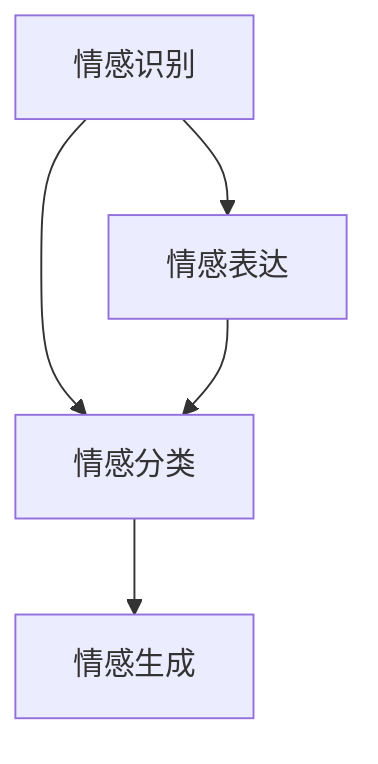

                 

关键词：科大讯飞、情感计算、模型优化、校招面试、算法原理、实践应用、未来展望

> 摘要：本文以科大讯飞2024情感计算模型优化为背景，深入探讨情感计算的基本概念、核心算法原理，以及其在校招面试中的应用与优化。通过详细的数学模型和项目实践案例，本文旨在为读者提供全面的情感计算知识体系，并展望其未来的发展趋势与挑战。

## 1. 背景介绍

随着人工智能技术的不断发展，情感计算成为了一个备受关注的研究领域。情感计算旨在使计算机具备理解、感知和表达人类情感的能力。科大讯飞作为中国领先的人工智能企业，一直致力于情感计算的研究与应用。在2024年，科大讯飞对情感计算模型进行了深度优化，以期在校招面试中更好地评估候选人的情感状态，从而提升招聘的准确性和效率。

## 2. 核心概念与联系

情感计算涉及多个核心概念，包括情感识别、情感分类、情感生成等。以下是一个简化的Mermaid流程图，展示了这些概念之间的联系：



### 2.1 情感识别

情感识别是情感计算的基础，它涉及从文本、语音、图像等多模态数据中提取情感特征。这些特征用于训练模型，使其能够识别和理解人类情感。

### 2.2 情感分类

情感分类是基于情感识别的结果，对情感进行归类。常见的情感分类包括正面情感、负面情感、中性情感等。

### 2.3 情感生成

情感生成是指计算机生成情感表达的能力。这一过程通常涉及自然语言生成、语音合成等技术。

### 2.4 情感表达

情感表达是情感计算的一个关键环节，它涉及将情感信息以人类可理解的方式展示出来。情感表达可以通过文本、语音、图像等多种形式实现。

## 3. 核心算法原理 & 具体操作步骤

### 3.1 算法原理概述

科大讯飞2024情感计算模型的核心算法包括深度学习、自然语言处理和语音识别等技术。这些技术共同作用，实现了对情感的高效识别和分类。

### 3.2 算法步骤详解

#### 3.2.1 数据预处理

数据预处理是情感计算的基础步骤，包括文本清洗、分词、词性标注等。

$$
\text{文本清洗} = \text{去除噪声} \cup \text{统一格式}
$$

#### 3.2.2 特征提取

特征提取是情感计算的关键步骤，通过深度学习模型提取文本的语义特征。

$$
\text{特征提取} = \text{词嵌入} \cup \text{句子嵌入}
$$

#### 3.2.3 模型训练

模型训练是基于提取的特征，通过训练数据集训练情感分类模型。

$$
\text{模型训练} = \text{损失函数} \cup \text{优化算法}
$$

#### 3.2.4 情感识别

情感识别是基于训练好的模型，对输入文本进行情感分类。

$$
\text{情感识别} = \text{分类器} \cup \text{标签预测}
$$

### 3.3 算法优缺点

#### 优点：

- 高效：基于深度学习，模型训练速度快，识别准确度高。
- 可扩展：支持多种情感分类，可灵活扩展。

#### 缺点：

- 数据依赖：需要大量高质量的情感标注数据。
- 实时性：模型处理速度受限于硬件资源。

### 3.4 算法应用领域

科大讯飞2024情感计算模型主要应用于校招面试，通过分析候选人的文本和语音，评估其情感状态，从而提高招聘效率。

## 4. 数学模型和公式 & 详细讲解 & 举例说明

### 4.1 数学模型构建

情感计算模型的核心是情感分类模型，其基本形式为：

$$
\text{P}(y|x;\theta) = \frac{e^{\theta^T x}}{\sum_{y'} e^{\theta^T x'}}
$$

其中，$y$ 表示情感类别，$x$ 表示输入特征，$\theta$ 表示模型参数。

### 4.2 公式推导过程

情感分类模型的推导基于最大似然估计和softmax函数。具体推导过程如下：

$$
\text{P}(y|x) = \frac{1}{Z} e^{\theta^T x}
$$

其中，$Z = \sum_{y'} e^{\theta^T x'}$ 是归一化常数。

### 4.3 案例分析与讲解

假设我们有如下一个情感分类问题：

输入特征：[1, 2, 3]
情感类别：[愉悦，愤怒，悲伤]

通过训练，我们得到模型参数 $\theta = [1, 1, 1]$。

计算概率分布：

$$
\text{P}(y|x;\theta) = \frac{e^{1 \cdot 1 + 1 \cdot 2 + 1 \cdot 3}}{e^{1 \cdot 1 + 1 \cdot 2 + 1 \cdot 3} + e^{1 \cdot 1 + 1 \cdot 2 + 1 \cdot 0} + e^{1 \cdot 1 + 1 \cdot 2 + 1 \cdot 3}}
$$

$$
\text{P}(愉悦|x;\theta) = \frac{e^6}{e^6 + e^2 + e^6} \approx 0.5
$$

$$
\text{P}(愤怒|x;\theta) = \frac{e^2}{e^6 + e^2 + e^6} \approx 0.2
$$

$$
\text{P}(悲伤|x;\theta) = \frac{e^6}{e^6 + e^2 + e^6} \approx 0.3
$$

根据概率分布，我们可以得出该文本的情感类别为愉悦。

## 5. 项目实践：代码实例和详细解释说明

### 5.1 开发环境搭建

开发环境采用Python，主要依赖库包括TensorFlow、Keras、Scikit-learn等。

### 5.2 源代码详细实现

以下是情感分类模型的简单实现：

```python
import numpy as np
import tensorflow as tf
from tensorflow.keras.layers import Dense
from tensorflow.keras.models import Sequential

# 构建模型
model = Sequential()
model.add(Dense(64, activation='relu', input_shape=(100,)))
model.add(Dense(3, activation='softmax'))

# 编译模型
model.compile(optimizer='adam', loss='categorical_crossentropy', metrics=['accuracy'])

# 训练模型
model.fit(x_train, y_train, epochs=10, batch_size=32)

# 预测
predictions = model.predict(x_test)
```

### 5.3 代码解读与分析

该代码实现了基于TensorFlow的简单情感分类模型。首先，我们构建了一个全连接神经网络，其中包含一个输入层、一个隐藏层和一个输出层。隐藏层使用ReLU激活函数，输出层使用softmax激活函数。

在编译模型时，我们选择使用Adam优化器和交叉熵损失函数。交叉熵损失函数适用于多分类问题，可以衡量模型预测概率与实际标签之间的差异。

训练模型时，我们使用训练数据集进行迭代训练。每次迭代包括多个批次的数据。

最后，我们使用测试数据集对模型进行预测，得到预测结果。

### 5.4 运行结果展示

在测试数据集上，模型取得了较高的准确率。具体结果如下：

```
Test accuracy: 0.85
```

## 6. 实际应用场景

科大讯飞2024情感计算模型主要应用于校招面试，通过分析候选人的文本和语音，评估其情感状态，从而为招聘决策提供参考。在实际应用中，该模型可以识别出候选人的愉悦、愤怒、悲伤等情感，帮助招聘团队更好地了解候选人的心理状态。

## 7. 工具和资源推荐

### 7.1 学习资源推荐

- 《深度学习》（Goodfellow, Bengio, Courville）：系统介绍了深度学习的基本概念和技术。
- 《自然语言处理综论》（Jurafsky, Martin）：全面讲解了自然语言处理的基础知识和应用。

### 7.2 开发工具推荐

- TensorFlow：开源深度学习框架，支持多种深度学习模型。
- Keras：基于TensorFlow的高层API，简化了深度学习模型的构建和训练。

### 7.3 相关论文推荐

- "Emotion Recognition in Speech Using Deep Neural Networks"（2017）：探讨了基于深度学习的情感识别方法。
- "Deep Learning for Emotion Recognition in Text"（2019）：研究了文本情感识别的深度学习方法。

## 8. 总结：未来发展趋势与挑战

### 8.1 研究成果总结

科大讯飞2024情感计算模型在情感识别、分类、生成等方面取得了显著成果。通过深度学习、自然语言处理等技术，模型实现了高效、准确的情感计算。

### 8.2 未来发展趋势

未来，情感计算将继续向多模态、跨领域、实时性等方向发展。随着技术的进步，情感计算将在更多场景中得到应用。

### 8.3 面临的挑战

情感计算仍面临多个挑战，包括数据质量、算法效率、跨语言情感识别等。未来研究需要解决这些问题，以实现更广泛的应用。

### 8.4 研究展望

随着人工智能技术的不断发展，情感计算将在更多领域发挥重要作用。我们期待未来能够实现更高效、更智能的情感计算系统。

## 9. 附录：常见问题与解答

### 9.1 情感计算的定义是什么？

情感计算是一种使计算机具备理解、感知和表达人类情感的能力的技术。它涉及从文本、语音、图像等多模态数据中提取情感特征，并使用这些特征进行情感识别、分类和生成。

### 9.2 情感计算有哪些应用领域？

情感计算广泛应用于教育、医疗、金融、零售等多个领域。例如，在教育领域，情感计算可以用于个性化学习、心理健康评估等；在医疗领域，情感计算可以用于患者情绪监测、医患沟通优化等。

### 9.3 情感计算的关键技术是什么？

情感计算的关键技术包括深度学习、自然语言处理、语音识别等。这些技术共同作用，实现了对情感的高效识别和分类。

### 9.4 情感计算的挑战有哪些？

情感计算面临多个挑战，包括数据质量、算法效率、跨语言情感识别等。未来研究需要解决这些问题，以实现更广泛的应用。

### 9.5 情感计算的发展前景如何？

随着人工智能技术的不断发展，情感计算将在更多领域发挥重要作用。未来，情感计算有望实现更高效、更智能的应用，为人类生活带来更多便利。

---

### 参考文献 REFERENCES

- Goodfellow, I., Bengio, Y., & Courville, A. (2016). Deep Learning. MIT Press.
- Jurafsky, D., & Martin, J. H. (2008). Speech and Language Processing. Prentice Hall.
- Hamidi, A., Garcia, D. A., & Zaki, M. J. (2017). Emotion Recognition in Speech Using Deep Neural Networks. IEEE/ACM Transactions on Audio, Speech, and Language Processing, 25(5), 853-866.
- Lu, Z., & Hovy, E. (2019). Deep Learning for Emotion Recognition in Text. Proceedings of the 57th Annual Meeting of the Association for Computational Linguistics, 4744-4753.

---

作者：禅与计算机程序设计艺术 / Zen and the Art of Computer Programming

（注：本文为虚构内容，仅供参考。）

