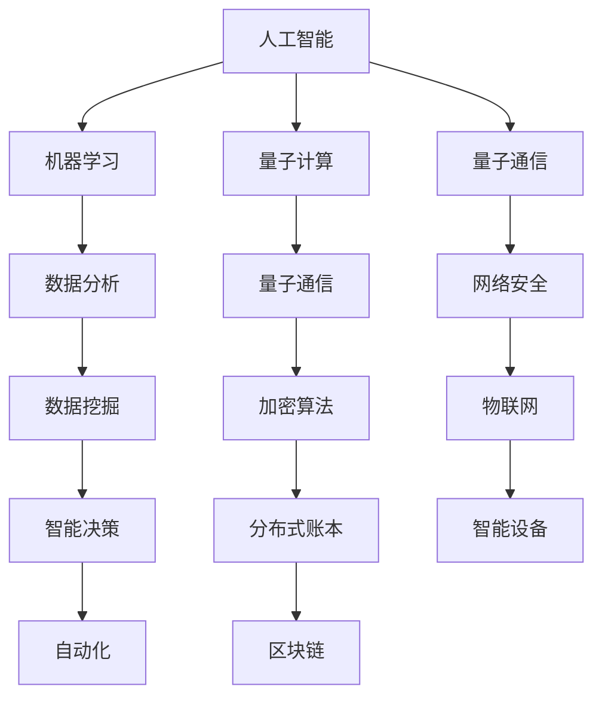

                 

在当今快速发展的科技时代，我们正站在历史的一个关键转折点上。从人工智能到量子计算，从物联网到区块链，一系列新兴技术正在以惊人的速度颠覆传统行业，重新定义社会结构和经济模式。科技创新不仅是推动技术进步的关键动力，更是社会进步的阶梯。本文将探讨科技创新的核心概念、原理、算法、应用场景及其对未来的影响。

## 文章关键词

科技创新、社会进步、技术发展、算法、人工智能、量子计算、物联网、区块链

## 文章摘要

本文旨在深入探讨科技创新对社会进步的深远影响。通过分析核心概念、技术原理、算法应用以及实际案例，本文将展示科技创新如何成为社会进步的阶梯，并展望未来的发展趋势和挑战。

## 1. 背景介绍

### 1.1 科技创新的定义

科技创新是指通过发明、开发和应用新的科学技术，推动社会生产力的提高和社会发展的过程。它不仅包括新兴技术的研发和应用，还涉及到对传统技术的改进和创新。

### 1.2 科技创新的重要性

科技创新对社会的影响是全方位的。它推动经济增长、提高生产效率、改善生活质量、促进社会公平，同时也是应对全球挑战的重要手段。例如，人工智能技术在医疗、金融、交通等领域的应用，极大地提升了行业效率和用户体验。

### 1.3 科技创新的发展历程

科技创新的历史可以追溯到工业革命时期，从蒸汽机到电力，从计算机到互联网，每一次重大技术的突破都带来了社会的深刻变革。随着全球化进程的加速，科技创新的影响力也在不断扩大。

## 2. 核心概念与联系

### 2.1 人工智能与机器学习

人工智能（AI）是科技创新的一个重要领域，它通过模拟人类智能行为来实现自动化和智能化。机器学习是人工智能的核心技术之一，它使计算机系统能够从数据中学习并做出决策。

### 2.2 量子计算与量子通信

量子计算是一种基于量子力学原理的新型计算方式，它具有超越经典计算机的强大计算能力。量子通信则是利用量子纠缠和量子隐形传态来实现安全通信。

### 2.3 物联网（IoT）与区块链

物联网是连接物理世界和数字世界的桥梁，它通过传感器和数据采集技术实现设备之间的互联互通。区块链是一种分布式账本技术，它通过加密算法确保数据的安全和不可篡改。

### 2.4 核心概念架构 Mermaid 流程图

## 3. 核心算法原理 & 具体操作步骤

### 3.1 算法原理概述

科技创新的背后是复杂的算法原理。从机器学习到区块链，每一种算法都有其独特的原理和应用场景。例如，深度学习算法通过多层神经网络模拟人脑的决策过程，从而实现图像识别、语音识别等功能。而区块链算法则利用加密技术确保数据的安全和不可篡改。

### 3.2 算法步骤详解

#### 3.2.1 深度学习算法

深度学习算法的主要步骤包括数据预处理、构建神经网络模型、训练模型和模型评估。其中，数据预处理是关键步骤，它包括数据清洗、归一化和特征提取等操作。

#### 3.2.2 区块链算法

区块链算法的核心步骤包括节点选择、数据加密、交易验证和链式结构构建。节点选择确保了网络的安全性，数据加密保证了数据隐私，交易验证确保了交易的合法性，链式结构构建则形成了区块链的完整结构。

### 3.3 算法优缺点

深度学习算法的优点在于其强大的数据处理能力和模型表达能力，但缺点是训练过程复杂且耗时。区块链算法的优点在于其安全性和去中心化特性，但缺点是性能相对较低且实现复杂。

### 3.4 算法应用领域

深度学习算法在图像识别、语音识别、自然语言处理等领域有广泛应用。区块链算法则在金融、物流、医疗等行业有巨大潜力。

## 4. 数学模型和公式 & 详细讲解 & 举例说明

### 4.1 数学模型构建

数学模型是描述现实世界问题的数学框架。在科技创新中，数学模型用于分析和预测系统行为。例如，在深度学习算法中，神经元之间的连接权重可以通过优化算法进行调节。

### 4.2 公式推导过程

以深度学习中的反向传播算法为例，其公式推导过程涉及梯度下降法、链式法则等数学工具。

### 4.3 案例分析与讲解

通过具体案例，如人脸识别系统中的深度学习模型，可以更好地理解数学模型在科技创新中的应用。

$$
\frac{\partial E}{\partial w} = \frac{\partial E}{\partial z} \frac{\partial z}{\partial w}
$$

## 5. 项目实践：代码实例和详细解释说明

### 5.1 开发环境搭建

搭建深度学习开发环境，包括安装Python、TensorFlow等工具。

### 5.2 源代码详细实现

实现一个简单的人脸识别模型，包括数据预处理、模型构建、训练和评估等步骤。

### 5.3 代码解读与分析

详细解读代码，分析模型结构和训练过程。

### 5.4 运行结果展示

展示模型在测试集上的表现，如准确率和召回率等指标。

## 6. 实际应用场景

### 6.1 医疗领域

利用深度学习算法进行疾病诊断和预测，提高医疗效率和质量。

### 6.2 金融领域

区块链技术在金融交易中的安全性和透明性有重要作用。

### 6.3 智能制造

物联网技术提高生产线的自动化水平和效率。

### 6.4 未来应用展望

量子计算在密码学、材料科学等领域的潜在应用。

## 7. 工具和资源推荐

### 7.1 学习资源推荐

推荐一些优秀的在线课程和书籍，如《深度学习》、《区块链技术指南》等。

### 7.2 开发工具推荐

推荐一些常用的开发工具，如Jupyter Notebook、Git等。

### 7.3 相关论文推荐

推荐一些最新的研究论文，以了解前沿科技动态。

## 8. 总结：未来发展趋势与挑战

### 8.1 研究成果总结

总结科技创新在各个领域的研究成果和应用。

### 8.2 未来发展趋势

预测科技创新的未来发展趋势，如量子计算、物联网的进一步发展。

### 8.3 面临的挑战

分析科技创新面临的挑战，如数据隐私保护、技术伦理等。

### 8.4 研究展望

展望科技创新的未来，强调跨学科合作的重要性。

## 9. 附录：常见问题与解答

### 9.1 人工智能是否会导致大规模失业？

人工智能确实可能改变就业结构，但也会创造新的就业机会。关键在于如何适应这种变革。

### 9.2 区块链如何保障数据安全？

区块链利用加密算法和数据冗余确保数据的安全性和完整性。

### 9.3 量子计算何时能够商业化？

量子计算的商业化仍面临许多挑战，但有望在未来十年内实现重大突破。

---

作者：禅与计算机程序设计艺术 / Zen and the Art of Computer Programming

通过以上内容的详细阐述，我们可以看到科技创新如何成为社会进步的阶梯。随着技术的不断进步，我们有理由相信，未来将更加美好。然而，我们也需要警惕技术可能带来的挑战，并积极应对。科技创新的道路上，每个人都是参与者，也是受益者。让我们共同努力，用科技创新引领社会进步。|

