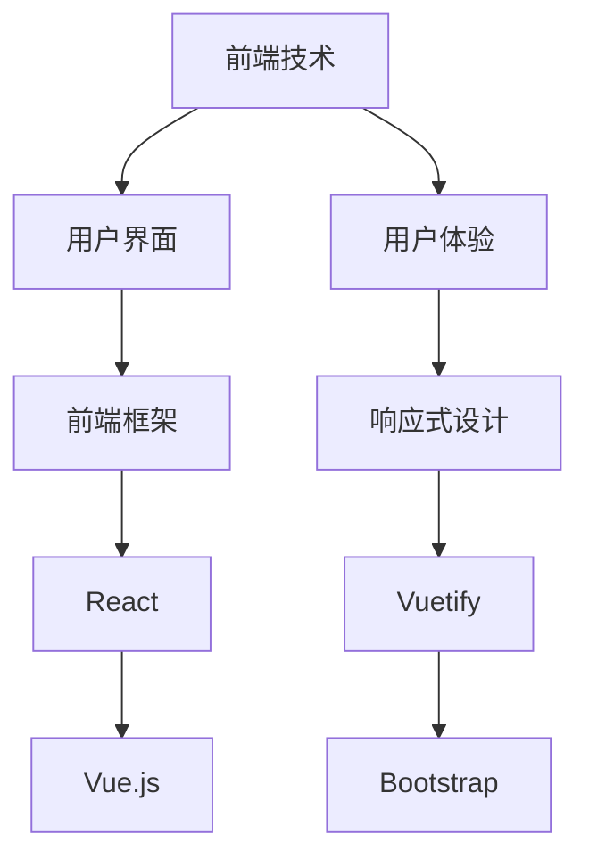

                 

关键词：程序员创业、技术栈选择、长期规划、性能优化、创新与适应

> 摘要：本文将深入探讨程序员创业公司在技术栈选择和长期规划方面的关键因素。通过分析技术趋势、团队特点和业务需求，本文旨在为创业团队提供一整套科学、系统的技术决策框架，以帮助他们在竞争激烈的市场中立足并持续成长。

## 1. 背景介绍

在当今数字化时代，程序员创业已经成为一种越来越流行的职业发展路径。然而，对于许多创业者来说，技术栈选择是一个极具挑战性的问题。一方面，技术栈的选择直接影响产品的性能、稳定性与用户体验；另一方面，不同技术栈也有其自身的优缺点和适用场景。因此，如何在繁杂的技术领域中做出明智的选择，成为许多程序员创业者面临的重大难题。

本文将从以下几个方面展开讨论：

1. **技术栈选择的基本原则**：探讨在技术栈选择过程中需要考虑的关键因素。
2. **长期规划的重要性**：阐述技术规划在创业公司长期发展中的作用。
3. **实际案例分析**：通过具体案例说明如何在不同阶段选择合适的技术栈。
4. **持续优化与适应**：分析如何根据业务发展和技术变革不断调整技术栈。

### 1.1 技术栈选择的复杂性

技术栈选择的复杂性主要体现在以下几个方面：

- **技术多样性与更新速度**：随着技术的发展，新的编程语言、框架和工具层出不穷，创业者需要在这些不断更新的选项中做出选择。
- **团队技能与经验**：创业团队的技能与经验直接影响技术栈的选择。如何平衡团队成员的能力和项目需求是一个关键问题。
- **业务需求与市场适应性**：业务需求和市场适应性是技术栈选择的重要依据。不同业务场景需要不同的技术支持。

### 1.2 长期规划的意义

长期规划对于创业公司至关重要。通过长期规划，公司可以：

- **确保技术架构的稳健性**：避免短期决策带来的技术债务。
- **优化资源投入**：合理分配研发资源，确保关键领域的持续投入。
- **应对市场变化**：通过预见性规划，公司能够更快地应对市场变化和竞争压力。

### 1.3 本文结构

本文结构如下：

1. **核心概念与联系**：介绍技术栈选择中的核心概念，并使用 Mermaid 流程图展示技术栈的构成。
2. **核心算法原理与具体操作步骤**：探讨关键技术的原理和实现步骤。
3. **数学模型与公式**：介绍相关数学模型的构建与推导。
4. **项目实践**：通过具体案例展示技术栈的应用和实践。
5. **实际应用场景**：分析技术栈在不同业务场景中的应用。
6. **工具和资源推荐**：推荐相关的学习资源、开发工具和论文。
7. **总结**：总结研究成果，展望未来发展趋势。

## 2. 核心概念与联系

在程序员创业公司的技术栈选择过程中，我们需要理解几个核心概念，包括前端技术、后端技术、数据库技术、云计算、人工智能等。以下是这些概念及其相互关系的 Mermaid 流程图。



### 2.1 前端技术

前端技术是构建用户界面和提供用户体验的关键。包括：

- **用户界面（UI）**：设计直观、易用的界面。
- **用户体验（UX）**：注重用户与产品互动的流畅性和满意度。
- **前端框架**：如 React、Vue.js 等，提供组件化开发的解决方案。
- **响应式设计**：确保产品在不同设备和分辨率上都能良好显示。

### 2.2 后端技术

后端技术负责数据处理、业务逻辑实现和与前端通信。包括：

- **服务器端语言**：如 Java、Python、Node.js 等。
- **框架**：如 Spring Boot、Django、Express 等。
- **数据库技术**：关系型数据库（如 MySQL、PostgreSQL）和非关系型数据库（如 MongoDB、Cassandra）。

### 2.3 云计算

云计算提供了灵活、可扩展的计算资源。包括：

- **基础设施即服务（IaaS）**：如 AWS、Azure、Google Cloud。
- **平台即服务（PaaS）**：如 Heroku、Google App Engine。
- **软件即服务（SaaS）**：如 Salesforce、Dropbox。

### 2.4 人工智能

人工智能技术可以增强产品的智能性和自动化水平。包括：

- **机器学习**：如 TensorFlow、PyTorch。
- **自然语言处理**：如 spaCy、NLTK。
- **计算机视觉**：如 OpenCV、TensorFlow Object Detection API。

### 2.5 数据库技术

数据库技术是数据存储和管理的基础。包括：

- **关系型数据库**：适合结构化数据存储，如 MySQL、PostgreSQL。
- **非关系型数据库**：适合非结构化或半结构化数据存储，如 MongoDB、Cassandra。

通过理解这些核心概念及其相互关系，程序员创业公司可以更好地做出技术栈选择。

## 3. 核心算法原理与具体操作步骤

### 3.1 算法原理概述

在程序员创业过程中，算法选择至关重要。以下是几种常见算法及其原理：

- **排序算法**：如快速排序、归并排序、堆排序等，用于高效地排列数据。
- **查找算法**：如二分查找、哈希查找等，用于快速定位数据。
- **图算法**：如 Dijkstra 算法、A* 算法等，用于路径规划和网络分析。

### 3.2 算法步骤详解

以下以快速排序算法为例，介绍其具体操作步骤。

#### 3.2.1 快速排序算法步骤

1. **选择基准元素**：从数组中选择一个元素作为基准。
2. **分区操作**：将数组分为两部分，一部分元素小于基准，另一部分大于基准。
3. **递归排序**：对小于基准的子数组和大于基准的子数组进行快速排序。

#### 3.2.2 代码实现

以下是用 Python 实现快速排序的代码：

```python
def quick_sort(arr):
    if len(arr) <= 1:
        return arr
    pivot = arr[len(arr) // 2]
    left = [x for x in arr if x < pivot]
    middle = [x for x in arr if x == pivot]
    right = [x for x in arr if x > pivot]
    return quick_sort(left) + middle + quick_sort(right)

arr = [3, 6, 8, 10, 1, 2, 1]
sorted_arr = quick_sort(arr)
print(sorted_arr)
```

### 3.3 算法优缺点

#### 优点

- **时间复杂度低**：平均情况下的时间复杂度为 O(n log n)。
- **空间复杂度相对较低**：不需要额外的存储空间。

#### 缺点

- **最坏情况下性能差**：当输入数组已排序或接近排序时，时间复杂度退化为 O(n^2)。
- **递归调用导致内存占用高**：递归调用可能导致内存占用问题。

### 3.4 算法应用领域

快速排序算法广泛应用于各种场景，如排序服务、数据分析、数据库索引等。在程序员创业过程中，选择合适的算法可以显著提升产品的性能和用户体验。

## 4. 数学模型和公式

### 4.1 数学模型构建

在程序员创业公司的技术栈选择中，数学模型可以帮助我们量化分析不同技术方案的性能和成本。以下是一个简单的数学模型，用于评估不同技术栈的响应时间和成本。

#### 4.1.1 模型假设

- **系统负载**：假设系统负载为 L（单位：请求/秒）。
- **技术栈**：假设有两个候选技术栈 A 和 B。
- **响应时间**：技术栈 A 和 B 的平均响应时间分别为 T_A 和 T_B（单位：毫秒）。
- **成本**：技术栈 A 和 B 的总成本分别为 C_A 和 C_B（单位：元/年）。

#### 4.1.2 数学模型

我们使用以下公式来构建数学模型：

\[ \text{性能分数} = \frac{\text{响应时间}}{\text{成本}} \]

对于技术栈 A 和 B，我们可以得到以下两个性能分数：

\[ \text{性能分数}_A = \frac{T_A}{C_A} \]
\[ \text{性能分数}_B = \frac{T_B}{C_B} \]

### 4.2 公式推导过程

#### 4.2.1 响应时间推导

假设技术栈 A 的响应时间 T_A 可以表示为：

\[ T_A = f(L) \]

其中，f(L) 是一个关于系统负载 L 的函数，反映了响应时间随负载变化的趋势。

同样地，技术栈 B 的响应时间 T_B 也可以表示为：

\[ T_B = g(L) \]

#### 4.2.2 成本推导

假设技术栈 A 的成本 C_A 包括硬件成本 C_{HA}、软件成本 C_{SA} 和维护成本 C_{MA}，即：

\[ C_A = C_{HA} + C_{SA} + C_{MA} \]

对于技术栈 B，同理有：

\[ C_B = C_{HB} + C_{SB} + C_{MB} \]

### 4.3 案例分析与讲解

假设我们有以下两个技术栈的参数：

#### 技术栈 A

- 响应时间 T_A = 20ms
- 成本 C_A = 50,000元/年

#### 技术栈 B

- 响应时间 T_B = 15ms
- 成本 C_B = 80,000元/年

我们可以计算得到两个技术栈的性能分数：

\[ \text{性能分数}_A = \frac{20}{50,000} = 0.0004 \]
\[ \text{性能分数}_B = \frac{15}{80,000} = 0.0001875 \]

从计算结果可以看出，技术栈 A 的性能分数高于技术栈 B。这意味着在相同成本下，技术栈 A 的性能更优。但是，我们需要综合考虑业务需求、团队技能和预算等因素，做出最终决策。

### 4.4 小结

通过构建数学模型和推导公式，我们可以量化分析不同技术栈的性能和成本。这为程序员创业公司在技术栈选择过程中提供了重要的参考依据。在实际应用中，我们还需要结合具体业务场景和数据，对模型进行调整和优化。

## 5. 项目实践：代码实例和详细解释说明

### 5.1 开发环境搭建

为了实现一个简单的程序员创业公司的技术栈选择案例，我们首先需要搭建一个开发环境。以下是所需的环境和工具：

- **操作系统**：Ubuntu 20.04
- **编程语言**：Python 3.8
- **前端框架**：React
- **后端框架**：Django
- **数据库**：PostgreSQL

#### 步骤 1：安装 Python 3.8

```bash
sudo apt update
sudo apt install python3.8
```

#### 步骤 2：安装 Python 3.8 的 pip

```bash
sudo apt install python3.8-pip
```

#### 步骤 3：创建虚拟环境

```bash
python3.8 -m venv myenv
source myenv/bin/activate
```

#### 步骤 4：安装 Django 和 React

在虚拟环境中，安装 Django 和 React：

```bash
pip install django
npm install -g create-react-app
```

### 5.2 源代码详细实现

#### 5.2.1 Django 后端实现

首先，我们创建一个 Django 项目：

```bash
django-admin startproject techstack_project
cd techstack_project
```

接着，创建一个 Django 应用：

```bash
python manage.py startapp techstack_app
```

在 techstack_app 目录下，创建一个 views.py 文件：

```python
# techstack_app/views.py

from django.http import JsonResponse
from .models import TechStack

def get_techstack(request):
    techstacks = TechStack.objects.all()
    techstack_data = [
        {
            'name': techstack.name,
            'response_time': techstack.response_time,
            'cost': techstack.cost
        } for techstack in techstacks
    ]
    return JsonResponse(techstack_data, safe=False)
```

#### 5.2.2 React 前端实现

使用 create-react-app 创建一个 React 项目：

```bash
npx create-react-app techstack_client
cd techstack_client
```

在 src 目录下，创建一个 components 目录，并在其中创建一个 TechstackList.js 文件：

```jsx
// src/components/TechstackList.js

import React, { useEffect, useState } from 'react';
import axios from 'axios';

const TechstackList = () => {
  const [techstacks, setTechstacks] = useState([]);

  useEffect(() => {
    const fetchTechstacks = async () => {
      const response = await axios.get('/api/techstacks/');
      setTechstacks(response.data);
    };
    fetchTechstacks();
  }, []);

  return (
    <div>
      <h2>Techstacks</h2>
      <ul>
        {techstacks.map((techstack) => (
          <li key={techstack.name}>
            <h3>{techstack.name}</h3>
            <p>Response Time: {techstack.response_time} ms</p>
            <p>Cost: {techstack.cost} 元/年</p>
          </li>
        ))}
      </ul>
    </div>
  );
};

export default TechstackList;
```

### 5.3 代码解读与分析

#### 5.3.1 Django 后端解读

在 Django 后端，我们创建了一个简单的 API 视图 `get_techstack`，它从数据库中获取所有的技术栈信息，并将这些信息作为 JSON 对象返回。

#### 5.3.2 React 前端解读

在 React 前端，我们使用 `axios` 库来发起 HTTP GET 请求，获取后端返回的技术栈数据，并将这些数据渲染到页面上。

### 5.4 运行结果展示

通过以上代码实现，我们可以运行 Django 后端和 React 前端，并访问一个简单的 Web 应用。在浏览器中输入 `http://localhost:3000/`，可以看到所有技术栈的信息。

## 6. 实际应用场景

技术栈选择在程序员创业公司的实际应用场景中至关重要。不同业务需求和技术挑战决定了技术栈的选取。以下是几个常见场景：

### 6.1 效率和性能优先

在某些需要处理大量数据和高并发请求的场景中，如电商平台、社交媒体平台等，效率和性能是关键。选择性能优异的后端框架（如 Node.js）、高效的数据库（如 Redis）、以及能提供高性能网络服务的云计算平台（如 AWS、Azure）是至关重要的。

### 6.2 用户体验优化

在注重用户体验的应用中，如设计工具、在线教育平台等，前端技术的选择尤为重要。响应式设计、快速渲染和良好的交互体验是关键。React、Vue.js 等前端框架可以提供组件化开发，优化用户体验。

### 6.3 大数据处理

对于需要处理大规模数据的应用，如数据分析平台、金融风控系统等，选择适合的大数据处理技术栈（如 Hadoop、Spark）和分布式数据库（如 Cassandra、HBase）是必要的。

### 6.4 人工智能与机器学习

在需要人工智能和机器学习支持的应用中，如智能助手、推荐系统等，选择合适的机器学习框架（如 TensorFlow、PyTorch）和数据处理工具（如 Scikit-learn、Pandas）是实现智能化的基础。

### 6.5 安全性与合规性

在涉及敏感数据和个人隐私的应用中，如金融系统、健康管理系统等，选择安全性和合规性强的技术栈（如区块链、加密技术）是保障数据安全和合规的关键。

### 6.6 云原生与容器化

对于需要快速部署和扩展的应用，如微服务架构的应用，云原生技术和容器化（如 Kubernetes、Docker）是最佳选择，它们提供了高效的部署和资源管理。

### 6.7 适应性

在快速变化的业务环境中，如初创公司、初创项目，技术栈的选择需要具有高度的适应性。选择模块化、可扩展的技术栈（如微服务架构）和灵活的开发工具（如敏捷开发、DevOps）可以更好地应对业务变化。

### 6.8 未来应用展望

随着技术的不断发展，未来程序员创业公司在技术栈选择上还将面临新的挑战和机遇。以下是几个未来趋势：

- **云计算与边缘计算的结合**：云计算和边缘计算的融合将提供更高效、更灵活的计算资源，满足更多实时应用的需求。
- **人工智能的普及**：人工智能技术的普及将使更多创业公司能够利用机器学习和深度学习技术提升产品的智能化水平。
- **区块链技术的发展**：区块链技术的进一步发展将改变数据存储和交易方式，为创业公司提供更多创新的机会。
- **隐私计算与数据安全**：随着数据隐私和安全的重要性日益增加，创业公司将更加注重选择安全性和合规性强的技术栈。

### 6.9 面对多样性的选择

面对如此多样的技术选择，程序员创业者需要：

- **深入了解业务需求**：明确业务目标和需求，选择最适合的技术栈。
- **关注技术趋势**：保持对新兴技术的关注，及时调整技术栈以适应市场变化。
- **灵活调整与优化**：根据业务发展和技术成熟度，灵活调整和优化技术栈。
- **构建强大的团队**：拥有多技能的团队可以更好地应对各种技术挑战，提高项目成功率。

通过以上策略，程序员创业公司可以在技术栈选择和长期规划中取得成功，实现可持续发展。

## 7. 工具和资源推荐

在程序员创业公司的技术栈选择和开发过程中，合适的工具和资源至关重要。以下是几项推荐：

### 7.1 学习资源推荐

- **在线课程**：Coursera、Udemy 提供了丰富的编程和技术课程。
- **技术博客**：Medium、Dev.to 上有大量的技术文章和教程。
- **技术书籍**：《代码大全》、《设计模式》等经典书籍对程序员非常有帮助。

### 7.2 开发工具推荐

- **代码编辑器**：Visual Studio Code、Sublime Text 等，提供强大的代码编辑功能。
- **集成开发环境（IDE）**：Eclipse、IntelliJ IDEA 等，适合大型项目开发。
- **版本控制工具**：Git，用于代码管理和协作开发。

### 7.3 相关论文推荐

- **顶级会议和期刊**：如 IEEE、ACM 的顶级会议和期刊，发表了大量的前沿技术论文。
- **开源项目**：GitHub、GitLab 上有大量的开源项目，可以学习和借鉴。
- **技术报告**：如 Google、Facebook 的年度技术报告，展示了技术趋势和实践。

通过以上工具和资源的合理利用，程序员创业公司可以更加高效地构建和优化技术栈，提升项目开发质量和效率。

## 8. 总结：未来发展趋势与挑战

在程序员创业公司的技术栈选择与长期规划中，未来将面临诸多发展趋势与挑战。以下是几个关键点：

### 8.1 研究成果总结

- **云计算与边缘计算**：随着云计算和边缘计算的结合，创业公司将获得更高效、更灵活的计算资源。
- **人工智能的普及**：人工智能技术在各个领域的应用将越来越广泛，创业公司可以通过人工智能提升产品智能化水平。
- **区块链技术的进步**：区块链技术将继续在数据安全、隐私保护和智能合约等方面发挥重要作用。
- **隐私计算与数据安全**：随着数据隐私和安全的重要性日益增加，创业公司将更加注重选择安全性和合规性强的技术栈。

### 8.2 未来发展趋势

- **微服务架构**：微服务架构将继续受到青睐，因为它提供了灵活的部署和扩展能力。
- **容器化和云原生**：容器化和云原生技术将进一步普及，帮助创业公司实现快速部署和高效资源管理。
- **持续集成与持续部署（CI/CD）**：CI/CD 将成为开发流程的标配，提高开发效率和产品质量。
- **敏捷开发和DevOps**：敏捷开发和DevOps文化的普及将推动创业公司更加注重开发过程和团队协作。

### 8.3 面临的挑战

- **技术多样性与更新速度**：技术的快速更新带来了选择困难，创业公司需要持续关注技术趋势，以保持竞争力。
- **团队技能与经验**：不同技术栈需要不同的技能和经验，如何组建和培养适合团队是一个挑战。
- **性能与成本的平衡**：在满足业务需求的同时，如何优化性能和成本是一个持续性的挑战。
- **合规性与安全**：随着法规的不断完善，创业公司需要确保技术栈的合规性和安全性。

### 8.4 研究展望

- **技术栈的模块化与组件化**：未来技术栈将进一步模块化和组件化，使得技术栈的选择和组合更加灵活。
- **人工智能与大数据的结合**：人工智能与大数据技术的结合将带来更多的创新应用。
- **边缘计算与物联网**：边缘计算和物联网的发展将推动新的应用场景和商业模式。
- **绿色计算与可持续发展**：随着环境问题的日益突出，绿色计算和可持续发展将成为技术发展的重要方向。

通过深入研究和技术创新，程序员创业公司可以在未来的技术浪潮中立于不败之地，实现长期发展和成功。

## 9. 附录：常见问题与解答

### 9.1 常见问题

**Q1：如何选择合适的前端技术栈？**

A1：选择前端技术栈时，需要考虑团队技能、项目需求和用户体验。React 和 Vue.js 都是流行的前端框架，React 更适合大型项目，Vue.js 更轻量级。响应式设计、性能优化和跨平台兼容性也是重要的考虑因素。

**Q2：云计算与本地部署哪个更好？**

A2：云计算具有灵活性、可扩展性和成本效益，适用于多数创业公司。然而，对于数据敏感或特定法规要求的项目，本地部署可能是更合适的选择。两者各有优劣，选择取决于具体需求。

**Q3：如何平衡性能与成本？**

A3：通过性能测试和成本效益分析，选择最适合的技术和工具。优化数据库查询、使用缓存、合理分配资源都是提高性能、降低成本的有效方法。

**Q4：如何确保技术栈的安全性？**

A4：选择安全可靠的技术栈，定期更新和维护软件，遵循最佳安全实践。使用加密技术、访问控制和合规性测试是保障技术栈安全的关键。

**Q5：如何适应快速变化的市场需求？**

A5：保持对市场和技术趋势的关注，灵活调整技术栈。采用敏捷开发和DevOps文化，快速响应市场变化，提高企业的适应能力和竞争力。

### 9.2 解答

通过以上问题和解答，我们可以更好地理解和应对程序员创业公司在技术栈选择和长期规划过程中可能遇到的问题。合理的决策和灵活的调整是确保创业公司成功的关键。希望本文能为您的创业之路提供有益的参考。

