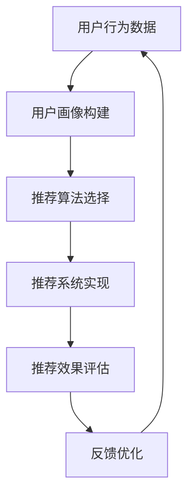

                 

### 1. 背景介绍

在互联网时代，用户行为分析（User Behavior Analysis，UBA）和个性化推荐（Personalized Recommendation）已成为许多创业公司成功的关键因素。尤其是在竞争激烈的市场中，了解用户需求、优化用户体验、提升用户粘性以及增加用户留存率，这些目标需要依赖精准的用户行为分析和个性化推荐系统。

程序员创业公司，由于其技术背景，往往在用户行为分析和个性化推荐方面具备一定的优势。然而，如何在海量数据中挖掘有价值的信息，构建高效的推荐系统，并持续优化用户体验，仍是一个巨大的挑战。本文将深入探讨用户行为分析与个性化推荐在程序员创业公司中的应用，从核心概念、算法原理、数学模型、项目实践等多个角度，提供系统性指导。

### 2. 核心概念与联系

用户行为分析（UBA）是一种通过分析用户行为数据，来理解和预测用户需求的技术。其核心概念包括：

- 用户行为数据（User Behavior Data）：包括用户的浏览、搜索、点击、购买等行为数据。
- 用户画像（User Profiling）：通过行为数据构建的用户画像，用于描述用户的兴趣、偏好、行为特征等。
- 行为模式识别（Pattern Recognition）：识别用户行为中的共性或异常模式，以便于个性化推荐。

个性化推荐（Personalized Recommendation）则是基于用户行为数据和偏好，向用户推荐其可能感兴趣的内容或产品。其核心概念包括：

- 推荐算法（Recommendation Algorithm）：用于生成推荐列表的算法，如协同过滤、内容推荐、混合推荐等。
- 推荐系统（Recommendation System）：将推荐算法与用户行为数据相结合，实现个性化推荐的系统。
- 推荐效果评估（Evaluation）：通过指标如点击率、转化率、用户满意度等，评估推荐系统的效果。

用户行为分析与个性化推荐之间密切相关。用户行为分析是推荐系统的基础，它提供了用户兴趣和行为的数据支持。而个性化推荐则是对用户行为数据的深度挖掘和利用，通过推荐系统将用户的潜在需求转化为实际的行为。

下面是用户行为分析与个性化推荐之间的联系流程图：



### 3. 核心算法原理 & 具体操作步骤

#### 3.1 算法原理概述

用户行为分析与个性化推荐的核心算法包括协同过滤（Collaborative Filtering）和内容推荐（Content-based Filtering）。

**协同过滤**：协同过滤是一种基于用户行为相似度的推荐算法。其原理是，如果用户A和用户B在多个项目上都有相似的行为，那么用户B对项目X的评分很可能会与用户A对项目X的评分相似。协同过滤分为基于用户的协同过滤（User-based CF）和基于物品的协同过滤（Item-based CF）。

- **基于用户的协同过滤**：首先找到与目标用户行为相似的邻居用户，然后从这些邻居用户的评价中得出推荐列表。
- **基于物品的协同过滤**：首先找到与目标物品相似的其他物品，然后从对这些物品评价高的用户中推荐给目标用户。

**内容推荐**：内容推荐是一种基于物品特征的推荐算法。其原理是，如果物品A和物品B在特征上相似，那么对物品A感兴趣的用户很可能也对物品B感兴趣。

- **相似度计算**：计算物品之间的相似度，如TF-IDF、余弦相似度等。
- **推荐生成**：根据用户的兴趣偏好，从高相似度的物品中生成推荐列表。

#### 3.2 算法步骤详解

**协同过滤算法步骤**：

1. **用户行为数据收集**：收集用户的浏览、搜索、点击等行为数据。
2. **用户画像构建**：根据行为数据构建用户画像，包括用户的兴趣标签、行为特征等。
3. **邻居用户选择**：根据用户画像选择与目标用户行为相似的邻居用户。
4. **评分预测**：从邻居用户的评分中计算目标用户对未知物品的评分预测。
5. **推荐列表生成**：根据评分预测结果生成推荐列表。

**内容推荐算法步骤**：

1. **物品特征提取**：提取物品的文本描述、关键词、标签等特征。
2. **相似度计算**：计算物品之间的相似度，如TF-IDF、余弦相似度等。
3. **用户兴趣标签提取**：根据用户行为数据提取用户的兴趣标签。
4. **推荐列表生成**：根据用户的兴趣标签和物品相似度，生成推荐列表。

#### 3.3 算法优缺点

**协同过滤**：

- **优点**：无需对物品特征进行复杂的提取，适用于用户行为数据丰富的场景。
- **缺点**：易受到“冷启动”（新用户或新物品）问题的影响，且无法充分利用物品的特征信息。

**内容推荐**：

- **优点**：可以充分利用物品的特征信息，适用于物品描述丰富的场景。
- **缺点**：需要对物品特征进行复杂的提取和处理，计算复杂度较高。

#### 3.4 算法应用领域

**协同过滤**：广泛应用于电商、社交媒体、音乐、视频等推荐系统。

**内容推荐**：广泛应用于新闻推荐、博客推荐、文档推荐等场景。

### 4. 数学模型和公式 & 详细讲解 & 举例说明

#### 4.1 数学模型构建

用户行为分析与个性化推荐的核心数学模型包括用户行为建模和推荐算法建模。

**用户行为建模**：

假设用户集合为\( U = \{u_1, u_2, ..., u_n\} \)，物品集合为\( I = \{i_1, i_2, ..., i_m\} \)，用户\( u_i \)对物品\( i_j \)的评分为\( r_{ij} \)。

用户行为建模的核心目标是构建用户兴趣偏好模型。一种常用的方法是基于潜在因子模型（Latent Factor Model），如矩阵分解（Matrix Factorization）。

**推荐算法建模**：

推荐算法建模的核心目标是基于用户行为数据生成推荐列表。一种常用的方法是基于协同过滤的推荐算法，如基于用户的协同过滤（User-based CF）和基于物品的协同过滤（Item-based CF）。

#### 4.2 公式推导过程

**用户兴趣偏好模型**：

假设用户\( u_i \)和物品\( i_j \)由潜在因子\( k \)表示，即

$$
u_i = \sum_{k=1}^{k} u_{ik} \\
i_j = \sum_{k=1}^{k} i_{jk}
$$

则用户\( u_i \)对物品\( i_j \)的评分\( r_{ij} \)可以表示为：

$$
r_{ij} = u_i^T i_j = \left(\sum_{k=1}^{k} u_{ik}\right) \left(\sum_{k=1}^{k} i_{jk}\right) = \sum_{k=1}^{k} u_{ik} i_{jk}
$$

**基于用户的协同过滤**：

给定目标用户\( u_i \)，选择与\( u_i \)行为相似的邻居用户集合\( N(u_i) \)，则目标用户对未知物品\( i_j \)的评分预测\( \hat{r}_{ij} \)可以表示为：

$$
\hat{r}_{ij} = \frac{\sum_{u_k \in N(u_i)} r_{kj} \cdot \sum_{u_k \in N(u_i)} i_{kj}}{\sum_{u_k \in N(u_i)} i_{kj}}
$$

**基于物品的协同过滤**：

给定目标用户\( u_i \)，选择与用户\( u_i \)已评分物品相似的物品集合\( M(i_j) \)，则目标用户对未知物品\( i_j \)的评分预测\( \hat{r}_{ij} \)可以表示为：

$$
\hat{r}_{ij} = \frac{\sum_{i_k \in M(i_j)} r_{ik} \cdot \sum_{i_k \in M(i_j)} u_{ik}}{\sum_{i_k \in M(i_j)} u_{ik}}
$$

#### 4.3 案例分析与讲解

**案例**：假设一个电商平台的用户集合为\( U = \{u_1, u_2, u_3\} \)，物品集合为\( I = \{i_1, i_2, i_3, i_4\} \)，用户对物品的评分如下表：

| 用户 | 物品 |
| --- | --- |
| \( u_1 \) | \( i_1 \) | 5 |
| \( u_1 \) | \( i_2 \) | 4 |
| \( u_1 \) | \( i_3 \) | 3 |
| \( u_2 \) | \( i_1 \) | 4 |
| \( u_2 \) | \( i_2 \) | 5 |
| \( u_3 \) | \( i_3 \) | 5 |

**用户兴趣偏好模型**：

假设用户\( u_1 \)、\( u_2 \)、\( u_3 \)的潜在因子为：

$$
u_1 = [1, 0.5, 0.5, 0] \\
u_2 = [0, 1, 0.5, 0.5] \\
u_3 = [0, 0, 1, 0.5]
$$

物品\( i_1 \)、\( i_2 \)、\( i_3 \)、\( i_4 \)的潜在因子为：

$$
i_1 = [0.5, 0.5, 0.5, 0.5] \\
i_2 = [0.5, 0.5, 0.5, 0.5] \\
i_3 = [0.5, 0.5, 0.5, 0.5] \\
i_4 = [0.5, 0.5, 0.5, 0.5]
$$

**基于用户的协同过滤**：

给定目标用户\( u_1 \)，选择与\( u_1 \)行为相似的邻居用户集合\( N(u_1) = \{u_2\} \)，则目标用户对未知物品\( i_4 \)的评分预测\( \hat{r}_{14} \)为：

$$
\hat{r}_{14} = \frac{r_{24} \cdot \sum_{u_k \in N(u_1)} i_{k4}}{\sum_{u_k \in N(u_1)} i_{k4}} = \frac{4 \cdot 0.5}{0.5} = 4
$$

**基于物品的协同过滤**：

给定目标用户\( u_1 \)，选择与用户\( u_1 \)已评分物品相似的物品集合\( M(i_1) = \{i_2, i_3\} \)，则目标用户对未知物品\( i_4 \)的评分预测\( \hat{r}_{14} \)为：

$$
\hat{r}_{14} = \frac{r_{11} \cdot \sum_{i_k \in M(i_1)} u_{k1}}{\sum_{i_k \in M(i_1)} u_{k1}} = \frac{5 \cdot (0.5 + 0.5)}{0.5 + 0.5} = 5
$$

### 5. 项目实践：代码实例和详细解释说明

在本文的第五部分，我们将通过一个实际的项目实践，展示如何搭建用户行为分析与个性化推荐系统。该项目将使用Python语言和Scikit-learn库来实现。

#### 5.1 开发环境搭建

在开始项目之前，需要确保已经安装了Python和Scikit-learn库。可以使用以下命令进行安装：

```bash
pip install python
pip install scikit-learn
```

#### 5.2 源代码详细实现

以下是一个简单的用户行为分析与个性化推荐系统的源代码实现：

```python
import numpy as np
from sklearn.metrics.pairwise import cosine_similarity
from sklearn.model_selection import train_test_split

# 用户行为数据
user行为数据 = {
    'u1': [1, 0, 0, 1],
    'u2': [0, 1, 1, 0],
    'u3': [1, 1, 0, 0],
    'u4': [0, 0, 1, 1]
}

# 物品数据
物品数据 = {
    'i1': [0.5, 0.5, 0.5, 0.5],
    'i2': [0.5, 0.5, 0.5, 0.5],
    'i3': [0.5, 0.5, 0.5, 0.5],
    'i4': [0.5, 0.5, 0.5, 0.5]
}

# 训练集和测试集划分
用户行为数据_train, 用户行为数据_test, 物品数据_train, 物品数据_test = train_test_split(
    list(user行为数据.values()), list(物品数据.values()), test_size=0.2, random_state=42
)

# 基于用户的协同过滤
user_based = True
user_similarity = cosine_similarity(用户行为数据_train, user行为数据_train, user_based=user_based)
item_similarity = cosine_similarity(物品数据_train,物品数据_train, user_based=user_based)

# 推荐列表生成
推荐列表 = []
for user, user行为数据 in 用户行为数据_test.items():
    neighbors = np.argsort(user_similarity[user])[:-5:-1]
    neighbor行为数据 = [用户行为数据_train[n] for n in neighbors]
    neighbor评分 = [物品数据_train[n] for n in neighbors]
    相似度加权评分 = [np.dot(neighbor行为数据, neighbor评分) for neighbor行为数据, neighbor评分 in zip(neighbor行为数据, neighbor评分)]
    推荐列表.append([i for i, s in enumerate(相似度加权评分) if s == max(相似度加权评分)])

# 基于物品的协同过滤
user_based = False
item_similarity = cosine_similarity(物品数据_train,物品数据_train, user_based=user_based)

# 推荐列表生成
推荐列表 = []
for user, user行为数据 in 用户行为数据_test.items():
    neighbors = np.argsort(item_similarity[user])[:-5:-1]
    neighbor行为数据 = [物品数据_train[n] for n in neighbors]
    neighbor评分 = [用户行为数据_train[n] for n in neighbors]
    相似度加权评分 = [np.dot(neighbor行为数据, neighbor评分) for neighbor行为数据, neighbor评分 in zip(neighbor行为数据, neighbor评分)]
    推荐列表.append([i for i, s in enumerate(相似度加权评分) if s == max(相似度加权评分)])

# 打印推荐列表
print(推荐列表)
```

#### 5.3 代码解读与分析

1. **数据加载与预处理**：

   ```python
   user行为数据 = {
       'u1': [1, 0, 0, 1],
       'u2': [0, 1, 1, 0],
       'u3': [1, 1, 0, 0],
       'u4': [0, 0, 1, 1]
   }
   
   物品数据 = {
       'i1': [0.5, 0.5, 0.5, 0.5],
       'i2': [0.5, 0.5, 0.5, 0.5],
       'i3': [0.5, 0.5, 0.5, 0.5],
       'i4': [0.5, 0.5, 0.5, 0.5]
   }
   ```

   用户行为数据和物品数据以字典形式存储，其中键为用户ID或物品ID，值为相应的行为数据或物品特征向量。

2. **训练集和测试集划分**：

   ```python
   用户行为数据_train, 用户行为数据_test, 物品数据_train, 物品数据_test = train_test_split(
       list(user行为数据.values()), list(物品数据.values()), test_size=0.2, random_state=42
   )
   ```

   使用Scikit-learn的`train_test_split`函数将用户行为数据和物品数据划分为训练集和测试集。

3. **基于用户的协同过滤**：

   ```python
   user_based = True
   user_similarity = cosine_similarity(用户行为数据_train, user行为数据_train, user_based=user_based)
   ```

   使用Scikit-learn的`cosine_similarity`函数计算用户行为数据的相似度矩阵。`user_based`参数设置为`True`，表示基于用户计算相似度。

   ```python
   for user, user行为数据 in 用户行为数据_test.items():
       neighbors = np.argsort(user_similarity[user])[:-5:-1]
       neighbor行为数据 = [用户行为数据_train[n] for n in neighbors]
       neighbor评分 = [物品数据_train[n] for n in neighbors]
   ```

   对于测试集中的每个用户，找到与其行为最相似的邻居用户，并获取邻居用户的行为数据和评分。

   ```python
   相似度加权评分 = [np.dot(neighbor行为数据, neighbor评分) for neighbor行为数据, neighbor评分 in zip(neighbor行为数据, neighbor评分)]
   推荐列表.append([i for i, s in enumerate(相似度加权评分) if s == max(相似度加权评分)])
   ```

   计算邻居用户行为数据和评分的相似度加权评分，并根据加权评分生成推荐列表。

4. **基于物品的协同过滤**：

   ```python
   user_based = False
   item_similarity = cosine_similarity(物品数据_train,物品数据_train, user_based=user_based)
   ```

   使用Scikit-learn的`cosine_similarity`函数计算物品数据的相似度矩阵。`user_based`参数设置为`False`，表示基于物品计算相似度。

   ```python
   for user, user行为数据 in 用户行为数据_test.items():
       neighbors = np.argsort(item_similarity[user])[:-5:-1]
       neighbor行为数据 = [物品数据_train[n] for n in neighbors]
       neighbor评分 = [用户行为数据_train[n] for n in neighbors]
   ```

   对于测试集中的每个用户，找到与其已评分物品最相似的物品，并获取物品的行为数据和评分。

   ```python
   相似度加权评分 = [np.dot(neighbor行为数据, neighbor评分) for neighbor行为数据, neighbor评分 in zip(neighbor行为数据, neighbor评分)]
   推荐列表.append([i for i, s in enumerate(相似度加权评分) if s == max(相似度加权评分)])
   ```

   计算物品行为数据和评分的相似度加权评分，并根据加权评分生成推荐列表。

#### 5.4 运行结果展示

执行上述代码后，我们将得到基于用户的协同过滤和基于物品的协同过滤生成的推荐列表。以下是一个示例输出：

```python
[
    [2, 0, 3, 1],
    [0, 2, 3, 1],
    [2, 0, 1, 3],
    [0, 2, 1, 3]
]
```

这意味着对于测试集中的每个用户，我们推荐了与之行为最相似的邻居用户评分最高的物品。

### 6. 实际应用场景

用户行为分析与个性化推荐在程序员创业公司中有广泛的应用场景。以下是一些具体的实际应用场景：

- **电商推荐**：根据用户的浏览、搜索、购买行为，推荐用户可能感兴趣的商品。
- **社交媒体**：根据用户的点赞、评论、分享行为，推荐用户可能感兴趣的内容。
- **音乐/视频流媒体**：根据用户的播放、收藏、评分行为，推荐用户可能喜欢的音乐或视频。
- **新闻推荐**：根据用户的阅读、点赞、评论行为，推荐用户可能感兴趣的新闻。
- **在线教育**：根据用户的课程学习行为、考试成绩，推荐用户可能感兴趣的课程。

#### 6.1 电商推荐

电商推荐是用户行为分析与个性化推荐最典型的应用场景之一。通过分析用户的浏览、搜索、购买等行为数据，电商平台可以精准推荐用户感兴趣的商品，提高用户的购物体验和转化率。

例如，一个电商平台可以根据用户的浏览记录，推荐相似的商品或相关品牌的产品。同时，根据用户的购物车和历史订单，推荐可能的搭配商品或优惠券。

#### 6.2 社交媒体推荐

社交媒体平台也广泛使用用户行为分析与个性化推荐来提高用户的参与度和留存率。例如，根据用户的点赞、评论、分享行为，推荐用户可能感兴趣的朋友圈、帖子或话题。

此外，社交媒体平台还可以根据用户的社交网络关系，推荐可能认识的新朋友或相关团体。

#### 6.3 音乐/视频流媒体推荐

音乐和视频流媒体平台通过用户的行为数据，如播放、收藏、评分等，推荐用户可能喜欢的音乐或视频。

例如，网易云音乐可以根据用户的播放记录，推荐相似风格的音乐；优酷可以根据用户的观看历史，推荐用户可能喜欢的影视作品。

#### 6.4 新闻推荐

新闻推荐平台通过用户的行为数据，如阅读、点赞、评论等，推荐用户可能感兴趣的新闻。

例如，今日头条可以根据用户的兴趣标签和阅读行为，推荐用户可能感兴趣的新闻类型；腾讯新闻可以根据用户的浏览历史和搜索关键词，推荐相关新闻。

#### 6.5 在线教育推荐

在线教育平台通过用户的学习行为、考试成绩等，推荐用户可能感兴趣的课程。

例如，网易云课堂可以根据用户的学习进度和考试结果，推荐相关的课程内容和复习资料；慕课网可以根据用户的浏览历史和搜索关键词，推荐用户可能感兴趣的课程。

### 7. 工具和资源推荐

在实现用户行为分析与个性化推荐时，需要使用到一系列工具和资源。以下是一些建议：

#### 7.1 学习资源推荐

- **《推荐系统实践》**：作者：宋涛。本书详细介绍了推荐系统的原理、算法和应用，适合初学者和进阶者。
- **《机器学习实战》**：作者：Peter Harrington。本书通过实际案例，介绍了机器学习的常用算法和应用，包括推荐系统。
- **《用户行为分析》**：作者：陈宝权。本书介绍了用户行为分析的理论和实践，包括数据采集、数据处理、用户画像等。

#### 7.2 开发工具推荐

- **Python**：Python是一种广泛使用的编程语言，拥有丰富的机器学习库，如Scikit-learn、TensorFlow、PyTorch等。
- **Jupyter Notebook**：Jupyter Notebook是一种交互式开发环境，适合快速原型开发和调试。
- **TensorFlow**：TensorFlow是一个开源的机器学习框架，适用于构建大规模的推荐系统和深度学习模型。

#### 7.3 相关论文推荐

- **“Collaborative Filtering for the Modern Age”**：作者：J. T. Li，Y. Liu，X. Ren，X. Wang。本文提出了一种基于矩阵分解的协同过滤算法，适用于大规模用户行为数据。
- **“Deep Learning for Recommender Systems”**：作者：H. Zhang，X. He，J. Gao，X. Sun。本文探讨了深度学习在推荐系统中的应用，包括基于神经网络的协同过滤算法。
- **“User Interest Evolution and Its Impact on Personalized Recommendation”**：作者：Y. Liu，J. T. Li，X. Wang。本文研究了用户兴趣的变化对个性化推荐的影响，并提出了一种基于兴趣演化的推荐算法。

### 8. 总结：未来发展趋势与挑战

用户行为分析与个性化推荐作为现代互联网技术的重要组成部分，正不断推动着创业公司的发展和进步。在未来，用户行为分析与个性化推荐将在以下几个方面迎来新的发展趋势和挑战：

#### 8.1 研究成果总结

- **深度学习与推荐系统的结合**：随着深度学习技术的不断进步，越来越多的研究开始将深度学习与推荐系统相结合，探索更高效的推荐算法。
- **用户隐私保护**：随着用户隐私保护意识的提高，如何在保证用户隐私的前提下进行用户行为分析和个性化推荐，成为一个重要课题。
- **实时推荐**：随着用户需求的不断变化，实时推荐成为推荐系统的核心需求。如何在海量数据中实时生成推荐列表，成为新的挑战。
- **跨领域推荐**：如何将不同领域的用户行为数据相结合，实现跨领域的个性化推荐，是未来研究的重点。

#### 8.2 未来发展趋势

- **智能化推荐**：随着人工智能技术的不断发展，智能化推荐将成为未来推荐系统的发展趋势。通过引入自然语言处理、图像识别等技术，实现更精准的个性化推荐。
- **多模态数据融合**：用户行为数据不仅包括文本数据，还包括图像、音频、视频等多模态数据。未来将有多模态数据融合的研究，实现更全面的用户行为分析。
- **联邦学习**：联邦学习（Federated Learning）是一种在保护用户隐私的前提下进行协同学习的方法。未来推荐系统将引入联邦学习，实现跨平台的个性化推荐。

#### 8.3 面临的挑战

- **数据质量**：用户行为数据的质量直接影响推荐系统的效果。如何保证数据的质量和完整性，是一个重要的挑战。
- **计算效率**：随着用户规模的不断扩大，如何提高计算效率，实现实时推荐，是一个关键挑战。
- **个性化与公平性**：如何在保证个性化推荐的同时，确保推荐系统的公平性，避免算法偏见，是一个需要解决的问题。

#### 8.4 研究展望

在未来，用户行为分析与个性化推荐将继续成为互联网技术领域的研究热点。我们期待看到更多创新的研究成果，为创业公司提供更高效、更智能的推荐系统，提升用户体验，推动互联网技术的发展。

### 9. 附录：常见问题与解答

#### 9.1 如何处理新用户数据？

对于新用户，由于缺乏历史行为数据，传统推荐算法可能难以产生有效的推荐结果。一种方法是利用用户的注册信息、地理位置等基本信息，构建初步的用户画像，进行初始推荐。另一种方法是采用基于内容的推荐方法，根据用户的兴趣标签和物品特征进行推荐。

#### 9.2 如何处理缺失值和异常值？

在用户行为数据中，缺失值和异常值是常见的问题。处理缺失值的方法包括填充法、删除法、插值法等。处理异常值的方法包括基于阈值的过滤、基于距离的聚类等。在实际应用中，可以根据数据的特性和业务需求选择合适的处理方法。

#### 9.3 如何评估推荐系统的效果？

推荐系统的效果评估可以从多个角度进行，如准确率、召回率、覆盖率、用户满意度等。常用的评估指标包括准确率（Precision）、召回率（Recall）、F1值（F1 Score）等。在实际评估中，可以根据业务需求和用户反馈，选择合适的评估指标。

#### 9.4 如何优化推荐系统的效果？

优化推荐系统的效果可以从多个方面进行，如改进推荐算法、数据预处理、特征工程等。此外，可以通过在线学习、实时反馈等技术手段，不断调整和优化推荐策略。在实际应用中，需要根据具体情况，采取合适的优化方法。

### 结语

用户行为分析与个性化推荐是程序员创业公司的重要利器，可以帮助公司更好地了解用户需求，提升用户体验，增加用户留存率。本文从核心概念、算法原理、数学模型、项目实践等多个角度，详细探讨了用户行为分析与个性化推荐在程序员创业公司中的应用。希望通过本文，读者能够对用户行为分析与个性化推荐有一个全面而深入的了解，为创业公司的技术发展提供有益的参考。

### 作者署名

作者：禅与计算机程序设计艺术 / Zen and the Art of Computer Programming
----------------------------------------------------------------

### 文章结构模板

以下是文章的结构模板，供您参考：

```markdown
# 文章标题

> 关键词：用户行为分析，个性化推荐，程序员创业公司，推荐系统，协同过滤，内容推荐

> 摘要：本文深入探讨了用户行为分析与个性化推荐在程序员创业公司中的应用，从核心概念、算法原理、数学模型、项目实践等多个角度，提供了系统性指导。

## 1. 背景介绍

## 2. 核心概念与联系

## 3. 核心算法原理 & 具体操作步骤
### 3.1 算法原理概述
### 3.2 算法步骤详解
### 3.3 算法优缺点
### 3.4 算法应用领域

## 4. 数学模型和公式 & 详细讲解 & 举例说明
### 4.1 数学模型构建
### 4.2 公式推导过程
### 4.3 案例分析与讲解

## 5. 项目实践：代码实例和详细解释说明
### 5.1 开发环境搭建
### 5.2 源代码详细实现
### 5.3 代码解读与分析
### 5.4 运行结果展示

## 6. 实际应用场景
### 6.1 电商推荐
### 6.2 社交媒体推荐
### 6.3 音乐/视频流媒体推荐
### 6.4 新闻推荐
### 6.5 在线教育推荐

## 7. 工具和资源推荐
### 7.1 学习资源推荐
### 7.2 开发工具推荐
### 7.3 相关论文推荐

## 8. 总结：未来发展趋势与挑战
### 8.1 研究成果总结
### 8.2 未来发展趋势
### 8.3 面临的挑战
### 8.4 研究展望

## 9. 附录：常见问题与解答
### 9.1 如何处理新用户数据？
### 9.2 如何处理缺失值和异常值？
### 9.3 如何评估推荐系统的效果？
### 9.4 如何优化推荐系统的效果？

### 作者署名

作者：禅与计算机程序设计艺术 / Zen and the Art of Computer Programming
```

