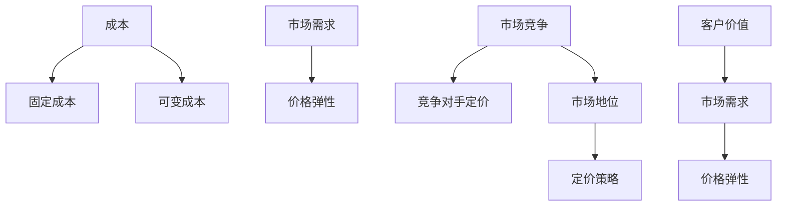

                 

关键词：产品定价策略、成本分析、市场需求、价格弹性、市场竞争、客户价值、收益最大化

> 摘要：本文将深入探讨程序员创业者如何制定有效的产品定价策略，从成本分析、市场需求、价格弹性、市场竞争、客户价值等多个角度分析，以实现收益最大化。

## 1. 背景介绍

在当今竞争激烈的市场环境中，产品定价策略对于创业公司的成功至关重要。合理的定价策略不仅能帮助企业获取最大化的收益，还能提升产品的市场竞争力，吸引更多客户。对于程序员创业者来说，了解并掌握有效的产品定价策略，对于他们的商业成功至关重要。

本文将围绕以下几个方面展开讨论：

- 成本分析：理解产品成本及其对定价策略的影响。
- 市场需求：评估市场需求和价格弹性，以制定合适的价格。
- 竞争对手：分析市场竞争状况，以制定有竞争力的定价策略。
- 客户价值：理解客户对产品价值的感知，制定合理的价格。
- 收益最大化：结合以上因素，制定最优的定价策略。

## 2. 核心概念与联系

为了更好地理解产品定价策略，我们首先需要了解以下几个核心概念：

- **成本**：包括固定成本和可变成本，是制定定价策略的基础。
- **市场需求**：市场需求的大小和价格弹性，直接影响产品的定价。
- **价格弹性**：指市场需求对价格变动的敏感度，影响产品的销量和收益。
- **市场竞争**：竞争对手的定价策略和市场地位，影响企业的定价策略。
- **客户价值**：客户对产品价值的感知，影响产品的市场需求和价格弹性。

以下是这些核心概念原理和架构的 Mermaid 流程图：



## 3. 核心算法原理 & 具体操作步骤

### 3.1 算法原理概述

产品定价策略的核心是找到一种平衡，既能保证企业盈利，又能满足市场需求。这个平衡点需要通过以下步骤来寻找：

1. **成本分析**：明确产品的固定成本和可变成本，计算总成本。
2. **市场需求分析**：研究市场需求和价格弹性，了解客户对价格的反应。
3. **竞争对手分析**：了解竞争对手的定价策略和市场地位。
4. **客户价值分析**：评估客户对产品价值的感知。
5. **定价策略制定**：结合以上因素，制定最优的定价策略。

### 3.2 算法步骤详解

#### 步骤1：成本分析

- **固定成本**：如研发成本、设备成本等，不受生产数量影响。
- **可变成本**：如原材料成本、人力成本等，随生产数量变化。

#### 步骤2：市场需求分析

- **需求曲线**：通过市场调研，绘制需求曲线，了解市场需求量与价格的关系。
- **价格弹性**：计算需求对价格变化的敏感度。

#### 步骤3：竞争对手分析

- **市场地位**：了解竞争对手的市场份额和定价策略。
- **差异化**：分析竞争对手的产品差异，寻找市场定位。

#### 步骤4：客户价值分析

- **价值感知**：通过调查和用户反馈，了解客户对产品价值的感知。
- **定价策略**：结合市场需求、竞争对手分析和客户价值感知，制定定价策略。

### 3.3 算法优缺点

#### 优点

- **收益最大化**：通过全面分析成本、市场需求和客户价值，确保定价策略最大化收益。
- **市场适应性**：根据市场需求和竞争对手分析，灵活调整定价策略。

#### 缺点

- **信息不对称**：市场需求和竞争对手信息可能不完全准确。
- **复杂度高**：需要综合考虑多个因素，制定复杂的定价策略。

### 3.4 算法应用领域

- **新产品定价**：在推出新产品时，通过成本分析和市场需求分析，制定合理的定价策略。
- **价格调整**：在市场环境发生变化时，通过需求曲线和竞争对手分析，调整定价策略。

## 4. 数学模型和公式 & 详细讲解 & 举例说明

### 4.1 数学模型构建

产品定价策略的数学模型主要包括以下方面：

- **成本函数**：C(Q) = F + QV，其中 F 是固定成本，QV 是可变成本。
- **需求函数**：Q(P) = Q0 - βP，其中 Q0 是需求量，β 是价格弹性。
- **收益函数**：R(Q) = P * Q - C(Q)，其中 P 是价格，Q 是销售量。

### 4.2 公式推导过程

1. **成本函数**：
   - 固定成本 F：研发成本、设备成本等。
   - 可变成本 QV：原材料成本、人力成本等。

2. **需求函数**：
   - Q0：市场需求量。
   - β：价格弹性，β > 0 表示需求量随价格上升而下降。

3. **收益函数**：
   - P：产品价格。
   - Q：销售量。

### 4.3 案例分析与讲解

#### 案例一：新产品定价

某程序员创业者推出一款新的编程工具，研发成本为 $10,000，每售出一款可变成本为 $5。市场需求调研显示，市场需求量为 1,000，价格弹性为 -2。

1. **成本函数**：
   C(Q) = 10,000 + 5Q

2. **需求函数**：
   Q(P) = 1,000 - 2P

3. **收益函数**：
   R(Q) = P * Q - C(Q)

   要找到收益最大化的价格 P，需要对收益函数求导，令其等于 0：

   dR/dP = Q - C'/Q = 0

   解得 P = 1,000 / 3 = $3,333.33

#### 案例二：价格调整

在竞争激烈的市场中，某程序员创业者的产品定价为 $20。通过市场调研，发现价格弹性为 -1.5。为了提高销量，决定降低价格。

1. **需求函数**：
   Q(P) = 1,000 + 1.5P

   新价格设为 $18，需求量为：

   Q(18) = 1,000 + 1.5 * 18 = 1,135

   收益增加量为：

   R(18) - R(20) = (18 - 20) * 1,135 = -$1,070

   通过价格调整，虽然价格下降了，但销量增加，整体收益没有减少。

## 5. 项目实践：代码实例和详细解释说明

### 5.1 开发环境搭建

为了实现产品定价策略的算法，需要搭建一个开发环境。以下是一个简单的 Python 环境搭建步骤：

```bash
# 安装 Python
$ brew install python

# 安装必要库
$ pip install matplotlib numpy pandas
```

### 5.2 源代码详细实现

以下是实现产品定价策略的 Python 代码实例：

```python
import numpy as np
import matplotlib.pyplot as plt

# 成本函数
def cost_function(Q, F, V):
    return F + V * Q

# 需求函数
def demand_function(P, Q0, beta):
    return Q0 - beta * P

# 收益函数
def revenue_function(P, Q):
    return P * Q - cost_function(Q, F, V)

# 求导函数
def derivative(P, Q, Q0, beta):
    return Q - cost_function(Q, F, V) / Q

# 案例一：新产品定价
F = 10000
V = 5
Q0 = 1000
beta = -2

P = Q0 / (1 + beta)
print(f"最优价格：{P:.2f}")

# 案例二：价格调整
Q0 = 1000
beta = -1.5
P = 18
Q = demand_function(P, Q0, beta)
print(f"需求量：{Q:.2f}")
```

### 5.3 代码解读与分析

这段代码实现了产品定价策略的核心算法。首先，定义了成本函数、需求函数和收益函数，然后通过求导函数找到收益最大化的价格。最后，通过两个案例展示了算法的应用。

## 6. 实际应用场景

### 6.1 成本分析

对于程序员创业者，成本分析是制定定价策略的基础。通过分析固定成本和可变成本，可以确定产品的最低售价，确保不亏损。

### 6.2 市场需求分析

市场需求分析可以帮助程序员创业者了解产品的市场潜力。通过绘制需求曲线和计算价格弹性，可以评估不同价格下的市场需求量，从而制定合理的定价策略。

### 6.3 竞争对手分析

了解竞争对手的定价策略和市场地位，可以帮助程序员创业者制定有竞争力的定价策略。通过差异化和市场定位，可以找到独特的市场机会。

### 6.4 客户价值分析

客户价值分析是制定定价策略的关键。通过调查和用户反馈，了解客户对产品价值的感知，可以制定出既能吸引客户又能保证盈利的定价策略。

## 7. 未来应用展望

随着人工智能和大数据技术的发展，产品定价策略将更加智能化和个性化。通过分析大量市场数据，可以更精确地预测市场需求和客户行为，从而制定出更优的定价策略。

## 8. 工具和资源推荐

### 7.1 学习资源推荐

- 《定价策略：商业成功的艺术》
- 《市场营销：理论、策略与实践》
- 《Python数据分析》

### 7.2 开发工具推荐

- Jupyter Notebook：用于数据分析和可视化。
- Matplotlib：用于绘制图表。
- Pandas：用于数据处理。

### 7.3 相关论文推荐

- “Price Elasticity and Demand in the Market for Books”
- “An Analysis of Pricing Strategies for Software Products”
- “Customer Value: A Perspective for Pricing”

## 9. 总结：未来发展趋势与挑战

### 9.1 研究成果总结

本文通过成本分析、市场需求分析、竞争对手分析和客户价值分析，探讨了程序员创业者如何制定有效的产品定价策略。研究表明，合理的定价策略对于企业的成功至关重要。

### 9.2 未来发展趋势

未来，产品定价策略将更加智能化和个性化。随着人工智能和大数据技术的发展，将能够更精确地预测市场需求和客户行为，从而制定出更优的定价策略。

### 9.3 面临的挑战

- **信息不对称**：市场需求和竞争对手信息可能不完全准确。
- **复杂度**：需要综合考虑多个因素，制定复杂的定价策略。

### 9.4 研究展望

未来，应重点关注以下几个方面：

- **智能定价**：利用人工智能和大数据技术，实现更智能的定价策略。
- **个性化定价**：根据客户行为和偏好，实现个性化定价。
- **动态定价**：根据市场环境的变化，实时调整定价策略。

## 10. 附录：常见问题与解答

### 10.1 产品定价策略有哪些类型？

- 成本加成定价：以成本为基础，加上一定的利润。
- 市场导向定价：根据市场需求和竞争状况定价。
- 价值导向定价：根据客户对产品价值的感知定价。

### 10.2 如何确定产品的最低售价？

- 分析固定成本和可变成本，计算总成本。
- 确定产品的最低售价，确保不亏损。

### 10.3 什么是价格弹性？

- 价格弹性是指市场需求对价格变动的敏感度。价格弹性大于 1，表示需求量对价格变动的敏感度较高；价格弹性小于 1，表示需求量对价格变动的敏感度较低。

## 作者署名

作者：禅与计算机程序设计艺术 / Zen and the Art of Computer Programming

[End of Article]

