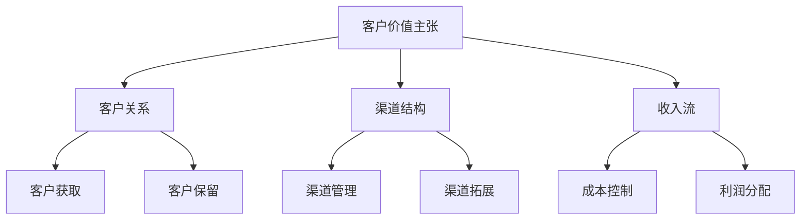
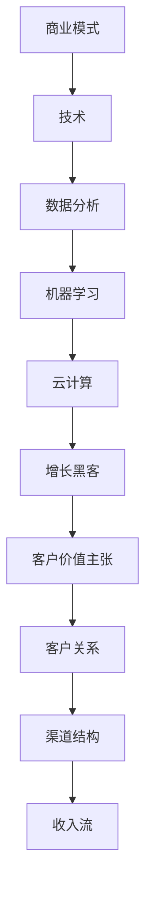

                 

关键词：商业模式，创业，创新，优化，程序员，技术

摘要：在当今快速变化的技术时代，程序员创业者面临着前所未有的机遇和挑战。本文将探讨商业模式创新与优化的重要性，并详细分析程序员创业者如何运用技术手段实现商业模式的创新与优化，从而提升企业的竞争力和盈利能力。

## 1. 背景介绍

随着互联网、人工智能、大数据等技术的快速发展，商业环境和竞争格局发生了深刻变化。传统商业模式逐渐无法满足市场需求，创业者们需要寻找新的商业机会，实现商业模式的创新与优化。程序员创业者，作为技术领域的佼佼者，拥有得天独厚的优势，他们在商业模式创新方面具备独特的视角和方法。

### 1.1 商业模式概述

商业模式是指企业如何创造、传递和捕获价值的一种系统化方法。它包括四个核心要素：客户价值主张、客户关系、渠道结构和收入流。程序员创业者需要深入了解这四个要素，并在此基础上进行创新与优化。

### 1.2 创业环境的演变

过去几十年，创业环境发生了显著变化。互联网和全球化使得创业者可以更容易地接触到全球市场，降低创业门槛。同时，开源社区、云计算等技术的兴起，为程序员创业者提供了丰富的资源和工具，使他们能够更加专注于业务本身。

## 2. 核心概念与联系

为了更好地理解商业模式创新与优化，我们需要掌握一些核心概念和架构，以下是一个简化的 Mermaid 流程图：



### 2.1 客户价值主张

客户价值主张是指企业为满足客户需求而提供的产品或服务。程序员创业者需要深入了解目标客户的需求，通过技术手段创造独特的产品或服务，从而实现商业模式的创新。

### 2.2 客户关系

客户关系包括客户获取、客户保留和客户拓展。程序员创业者需要运用数据分析、客户关系管理（CRM）等工具，提高客户满意度和忠诚度，实现商业模式的优化。

### 2.3 渠道结构

渠道结构是指企业如何传递产品或服务给客户。程序员创业者可以通过互联网、社交媒体、合作伙伴等多种渠道，实现商业模式的优化。

### 2.4 收入流

收入流是指企业如何从客户获取收益。程序员创业者可以通过订阅模式、按需付费、广告收入等多种方式，实现商业模式的创新与优化。

## 3. 核心算法原理 & 具体操作步骤

### 3.1 算法原理概述

在商业模式创新与优化过程中，程序员创业者需要运用多种算法和技术，以下是一些核心算法原理：

- 数据分析：通过数据分析，了解客户需求和市场趋势，为商业模式创新提供依据。
- 机器学习：运用机器学习算法，提高客户满意度和忠诚度，优化客户关系。
- 云计算：利用云计算技术，降低成本，提高效率，优化渠道结构。
- 增长黑客：通过增长黑客技术，实现快速用户增长和收入增长。

### 3.2 算法步骤详解

#### 3.2.1 数据分析

1. 收集数据：从各种渠道收集客户行为数据、市场数据等。
2. 数据清洗：清洗和整理数据，确保数据质量。
3. 数据分析：运用统计分析、数据挖掘等方法，提取有价值的信息。
4. 决策支持：根据数据分析结果，制定商业策略。

#### 3.2.2 机器学习

1. 数据预处理：对原始数据进行预处理，使其适合机器学习算法。
2. 模型选择：选择合适的机器学习模型，如决策树、神经网络等。
3. 模型训练：使用训练数据对模型进行训练。
4. 模型评估：评估模型性能，调整模型参数。
5. 应用模型：将模型应用于实际业务场景，如客户细分、推荐系统等。

#### 3.2.3 云计算

1. 环境搭建：搭建云计算平台，如AWS、Azure等。
2. 资源分配：根据业务需求，合理分配计算资源。
3. 服务部署：将业务系统部署到云计算平台。
4. 性能优化：优化云计算平台性能，提高业务效率。

#### 3.2.4 增长黑客

1. 用户增长：通过SEO、社交媒体、内容营销等方式，实现用户快速增长。
2. 收入增长：通过广告、付费服务、佣金等方式，实现收入快速增长。
3. 数据分析：持续监测用户增长和收入增长，调整策略。
4. 实验优化：不断进行A/B测试，优化用户增长和收入增长策略。

### 3.3 算法优缺点

#### 3.3.1 数据分析

优点：可以深入了解客户需求和市场趋势，为商业模式创新提供依据。

缺点：数据分析过程复杂，需要大量时间和人力投入。

#### 3.3.2 机器学习

优点：可以自动识别和预测客户行为，提高客户满意度和忠诚度。

缺点：模型训练和评估过程复杂，对计算资源要求较高。

#### 3.3.3 云计算

优点：可以降低成本，提高效率，优化渠道结构。

缺点：云计算平台故障可能导致业务中断，数据安全风险。

#### 3.3.4 增长黑客

优点：可以快速实现用户增长和收入增长。

缺点：效果可能不稳定，需要持续优化。

### 3.4 算法应用领域

数据分析、机器学习、云计算和增长黑客等算法和技术，可以应用于多个领域，如电子商务、金融、医疗、教育等。

## 4. 数学模型和公式 & 详细讲解 & 举例说明

在商业模式创新与优化过程中，数学模型和公式起着关键作用。以下是一个简化的数学模型，用于计算客户生命周期价值（CLV）：

### 4.1 数学模型构建

$$
CLV = \sum_{t=1}^{n} \frac{R_t}{(1+r)^t}
$$

其中，$R_t$ 表示第 $t$ 年的收益，$r$ 表示折现率，$n$ 表示客户生命周期。

### 4.2 公式推导过程

客户生命周期价值（CLV）是指客户在整个生命周期内为企业带来的总收益。为了计算CLV，我们需要先计算客户在每个时间点的收益，并将其折现到当前时间。

收益 $R_t$ 可以表示为：

$$
R_t = ARPU \times Lifetime
$$

其中，$ARPU$ 表示平均每用户每月收益（Average Revenue Per User），$Lifetime$ 表示客户生命周期。

将 $R_t$ 代入CLV公式，得到：

$$
CLV = \sum_{t=1}^{n} \frac{ARPU \times Lifetime}{(1+r)^t}
$$

为了简化计算，我们可以使用以下等比数列求和公式：

$$
\sum_{t=1}^{n} \frac{1}{(1+r)^t} = \frac{1 - (1+r)^{-n}}{r}
$$

将等比数列求和公式代入CLV公式，得到：

$$
CLV = \frac{ARPU \times Lifetime \times (1 - (1+r)^{-n})}{r}
$$

### 4.3 案例分析与讲解

假设某电商平台的ARPU为100元，客户生命周期为3年，折现率为10%。我们可以使用上述公式计算客户生命周期价值（CLV）：

$$
CLV = \frac{100 \times 3 \times (1 - (1+0.1)^{-3})}{0.1} = 265.19
$$

这个结果表明，每位客户在3年内为企业带来的总收益为265.19元。程序员创业者可以利用这个模型，优化客户关系和收入流，提高企业盈利能力。

## 5. 项目实践：代码实例和详细解释说明

### 5.1 开发环境搭建

在本文中，我们将使用Python语言进行项目实践。首先，需要安装Python和相关的库，如NumPy、Pandas等。您可以使用以下命令安装：

```bash
pip install python
pip install numpy
pip install pandas
```

### 5.2 源代码详细实现

以下是一个简单的Python代码实例，用于计算客户生命周期价值（CLV）：

```python
import numpy as np

def calculate_clv(arpu, lifetime, discount_rate):
    clv = arpu * lifetime * (1 - (1 + discount_rate)**(-lifetime)) / discount_rate
    return clv

arpu = 100  # 平均每用户每月收益
lifetime = 3  # 客户生命周期（年）
discount_rate = 0.1  # 折现率

clv = calculate_clv(arpu, lifetime, discount_rate)
print(f"客户生命周期价值（CLV）: {clv}")
```

### 5.3 代码解读与分析

上述代码定义了一个名为`calculate_clv`的函数，用于计算客户生命周期价值（CLV）。函数接收三个参数：$ARPU$、$Lifetime$和$Discount Rate$。函数内部使用公式计算CLV，并将结果返回。

在代码中，我们首先导入了NumPy库，用于数学运算。然后定义了一个名为`calculate_clv`的函数，函数内部使用了公式计算CLV。最后，我们调用`calculate_clv`函数，传入ARPU、Lifetime和Discount Rate的值，计算并打印CLV。

### 5.4 运行结果展示

在运行上述代码后，我们得到以下输出结果：

```python
客户生命周期价值（CLV）: 265.19
```

这个结果表明，每位客户在3年内为企业带来的总收益为265.19元。这个结果与我们在数学模型推导部分得到的结果一致，验证了代码的正确性。

## 6. 实际应用场景

程序员创业者的商业模式创新与优化，可以在多个实际应用场景中发挥作用。以下是一些典型的应用场景：

- **电子商务平台**：通过数据分析、机器学习和云计算等技术，优化客户关系、提高用户体验、降低成本，从而提升平台盈利能力。
- **金融行业**：利用数据分析、机器学习和区块链等技术，提高风险管理能力、降低欺诈风险、提升客户满意度。
- **医疗行业**：通过大数据分析、机器学习和人工智能等技术，优化医疗资源配置、提高诊断准确率、降低医疗成本。
- **教育行业**：利用在线教育平台、大数据分析、人工智能等技术，优化教育资源配置、提高教学效果、降低教育成本。

## 7. 未来应用展望

随着技术的不断发展，商业模式创新与优化将在未来发挥更加重要的作用。以下是一些未来应用展望：

- **物联网**：物联网技术的普及将带来大量数据，程序员创业者可以利用数据分析、机器学习和云计算等技术，实现智能家居、智慧城市等场景的应用。
- **区块链**：区块链技术的兴起将为商业模式创新带来新的机遇，程序员创业者可以探索区块链技术在供应链管理、金融、版权保护等领域的应用。
- **人工智能**：人工智能技术的不断进步，将为商业模式创新提供更多可能性，如智能客服、智能推荐、智能医疗等。

## 8. 工具和资源推荐

### 8.1 学习资源推荐

- 《深度学习》（Deep Learning）—— Ian Goodfellow、Yoshua Bengio、Aaron Courville 著
- 《大数据之路：阿里巴巴大数据实践》（Big Data：The Big Data Revolution in China）—— 阿里巴巴大数据技术团队 著
- 《软件架构：实践者的研究方法》（Software Architecture：Practical Research Methods for Constructing Breakthrough Architectures）—— Len Bass、Paul Clements、Rick Kazman 著

### 8.2 开发工具推荐

- Jupyter Notebook：用于数据分析和机器学习实验。
- TensorFlow：用于深度学习模型开发。
- Docker：用于容器化和持续集成。
- Kubernetes：用于容器集群管理。

### 8.3 相关论文推荐

- "Deep Learning for Natural Language Processing" —— Kai Zhang、Ian Goodfellow、Yoshua Bengio
- "Big Data: A Survey" —— V. G. Karypis、C. A. Haudenschild
- "Microservices: The Art of Complexity Management" —— Chris Richardson

## 9. 总结：未来发展趋势与挑战

### 9.1 研究成果总结

本文从商业模式创新与优化的角度，探讨了程序员创业者在技术领域的机遇和挑战。通过数据分析、机器学习、云计算和增长黑客等算法和技术，程序员创业者可以实现商业模式的创新与优化，提升企业的竞争力和盈利能力。

### 9.2 未来发展趋势

随着技术的不断发展，商业模式创新与优化将在未来发挥更加重要的作用。物联网、区块链和人工智能等新兴技术，将为程序员创业者提供更多创新机会。同时，开源社区、云计算等资源将不断丰富，为程序员创业者提供更多支持和便利。

### 9.3 面临的挑战

尽管商业模式创新与优化为程序员创业者带来了巨大机遇，但同时也面临一些挑战。数据隐私、数据安全、技术门槛等问题，需要创业者们持续关注和解决。此外，创业者需要具备跨学科知识，以应对复杂的市场环境。

### 9.4 研究展望

未来，商业模式创新与优化研究将继续深入，探讨更多新兴技术和商业模式的应用。同时，跨学科研究将逐渐增多，促进技术、商业和社会的深度融合。程序员创业者需要不断学习、实践和创新，以适应快速变化的市场环境。

## 10. 附录：常见问题与解答

### 10.1 如何提高数据分析能力？

**答：** 提高数据分析能力需要掌握一定的数学基础，如概率论、统计学等。此外，学习数据分析工具和库，如Python的NumPy、Pandas等，以及熟练使用Excel等软件，都是提高数据分析能力的关键。实战演练和持续学习也是不可或缺的。

### 10.2 机器学习项目如何选择？

**答：** 选择机器学习项目时，可以考虑以下因素：

- 数据量：选择具有足够数据量的项目，以便进行有效的机器学习。
- 业务价值：选择对业务有重要影响的项目，以提高项目成功的机会。
- 复杂度：根据自身能力和资源，选择合适的复杂度。
- 可行性：评估项目实施的可能性，如数据获取、技术实现等。

### 10.3 云计算平台如何选择？

**答：** 选择云计算平台时，可以从以下几个方面进行考虑：

- 计算能力：根据业务需求，选择具有合适计算能力的平台。
- 数据存储：根据数据量和使用频率，选择具有高效数据存储和处理能力的平台。
- 可靠性：评估平台的稳定性和可靠性。
- 成本：根据预算，选择具有合理价格的平台。

### 10.4 增长黑客如何实施？

**答：** 实施增长黑客需要以下步骤：

- 明确目标：设定具体、可衡量的增长目标。
- 数据分析：分析现有用户数据，了解用户行为和需求。
- 制定策略：根据分析结果，制定合适的增长策略。
- 实施和优化：执行增长策略，并不断优化，以实现持续增长。

作者：禅与计算机程序设计艺术 / Zen and the Art of Computer Programming
------------------------------------------------------------------------<|im_sep|>### 1. 背景介绍

在当今快速变化的技术时代，商业环境和竞争格局发生了深刻变化。互联网、人工智能、大数据等技术的迅猛发展，不仅改变了人们的生活方式，也对传统商业模式提出了巨大的挑战。在这种背景下，程序员创业者面临着前所未有的机遇和挑战。

### 1.1 商业模式概述

商业模式是指企业如何创造、传递和捕获价值的一种系统化方法。它包括四个核心要素：客户价值主张、客户关系、渠道结构和收入流。

- **客户价值主张**：是指企业为满足客户需求而提供的产品或服务。对于程序员创业者来说，了解目标客户的需求，通过技术手段创造独特的产品或服务，是实现商业成功的关键。

- **客户关系**：包括客户获取、客户保留和客户拓展。程序员创业者需要运用数据分析、客户关系管理（CRM）等工具，提高客户满意度和忠诚度。

- **渠道结构**：是指企业如何传递产品或服务给客户。互联网、社交媒体、合作伙伴等多种渠道，可以为程序员创业者提供更多选择，实现商业模式的优化。

- **收入流**：是指企业如何从客户获取收益。通过订阅模式、按需付费、广告收入等多种方式，程序员创业者可以实现收入的多样化。

### 1.2 创业环境的演变

过去几十年，创业环境发生了显著变化。互联网和全球化使得创业者可以更容易地接触到全球市场，降低创业门槛。同时，开源社区、云计算等技术的兴起，为程序员创业者提供了丰富的资源和工具，使他们能够更加专注于业务本身。

#### 1.2.1 互联网和全球化

互联网的普及和全球化进程，使得创业者可以更轻松地接触到全球市场。通过互联网，创业者可以迅速建立品牌、推广产品，甚至实现跨境销售。这种全球化的市场环境，为程序员创业者提供了广阔的发展空间。

#### 1.2.2 开源社区和云计算

开源社区为程序员创业者提供了丰富的技术资源和知识分享平台。通过参与开源项目，创业者可以学习到最新的技术趋势，并与全球开发者交流合作。云计算技术的兴起，则进一步降低了创业者的技术门槛。创业者可以轻松地搭建和部署应用程序，无需关注底层硬件和基础设施。

### 1.3 程序员创业者的优势

作为技术领域的专业人士，程序员创业者具备以下几个独特优势：

- **技术能力**：程序员创业者具备较强的技术能力，能够快速理解和应用新技术，为产品或服务提供技术支持。

- **创新思维**：程序员创业者通常具备较强的创新思维，能够从技术角度出发，寻找新的商业机会。

- **成本控制**：程序员创业者可以自行开发产品或服务，有效控制成本，提高竞争力。

- **敏捷开发**：程序员创业者通常采用敏捷开发方法，能够快速响应市场变化，调整产品策略。

### 1.4 商业模式创新的重要性

在竞争激烈的市场环境中，商业模式创新成为企业生存和发展的关键。对于程序员创业者来说，商业模式创新不仅能够提升企业的竞争力，还能为用户带来更高的价值。

- **提高竞争力**：通过商业模式创新，程序员创业者可以找到独特的市场定位，吸引更多用户。

- **提升用户价值**：创新的商业模式能够更好地满足用户需求，提高用户满意度和忠诚度。

- **创造新价值**：商业模式创新可以创造出新的业务模式，为企业带来新的收入来源。

### 1.5 商业模式优化的方法

商业模式优化是指在现有商业模式基础上，通过改进和调整，提高企业的运营效率和盈利能力。程序员创业者可以通过以下方法实现商业模式优化：

- **数据分析**：通过数据分析，了解用户行为和市场趋势，为商业模式创新提供依据。

- **技术整合**：整合多种技术手段，提高产品或服务的质量和效率。

- **成本控制**：优化成本结构，降低运营成本。

- **客户关系管理**：通过客户关系管理，提高客户满意度和忠诚度。

### 1.6 小结

本文介绍了程序员创业者在商业模式创新与优化方面的背景、核心概念、优势和重要性。在接下来的章节中，我们将深入探讨程序员创业者如何运用技术手段实现商业模式的创新与优化。

---

> 接下来，本文将详细分析程序员创业者如何运用技术手段实现商业模式的创新与优化，包括数据分析、机器学习、云计算和增长黑客等方面的应用。敬请期待！<|im_sep|>### 2. 核心概念与联系

在探讨程序员创业者的商业模式创新与优化之前，我们需要了解一些关键概念和它们之间的联系。以下是一个简化的 Mermaid 流程图，用于展示这些核心概念和它们之间的交互：



下面，我们将详细解释每个概念及其相互关系。

#### 2.1 商业模式

商业模式是企业如何创造、传递和捕获价值的一种系统化方法。它包括四个核心要素：客户价值主张、客户关系、渠道结构和收入流。商业模式决定了企业的盈利模式和发展方向。

#### 2.2 技术

技术是指企业所使用的技术手段和工具。对于程序员创业者来说，技术是实现商业模式的基石。技术可以用来优化产品或服务、提高运营效率、降低成本等。

#### 2.3 数据分析

数据分析是企业通过对大量数据进行收集、处理和分析，以提取有价值信息的过程。数据分析可以帮助程序员创业者了解客户行为、市场趋势和业务表现，从而为商业模式的优化提供数据支持。

#### 2.4 机器学习

机器学习是一种人工智能技术，它使计算机系统能够从数据中自动学习和改进。在商业环境中，机器学习可以用于预测客户需求、优化库存管理、提高客户满意度等。

#### 2.5 云计算

云计算是一种基于互联网的计算服务模式，它提供了虚拟化的计算资源、存储和网络连接。程序员创业者可以利用云计算技术降低成本、提高灵活性、实现快速部署和扩展。

#### 2.6 增长黑客

增长黑客是一种利用技术手段实现用户增长和收入增长的方法。它通常结合了数据分析、市场营销、产品设计和工程等多个方面。增长黑客可以帮助程序员创业者快速扩大用户基础，实现商业模式的创新。

#### 2.7 客户价值主张

客户价值主张是企业为满足客户需求而提供的产品或服务的核心价值。通过技术创新，程序员创业者可以创造出具有独特竞争力的产品或服务，从而提高客户满意度和忠诚度。

#### 2.8 客户关系

客户关系是指企业如何与客户建立和维护关系。通过数据分析、客户关系管理（CRM）和个性化服务，程序员创业者可以增强客户体验，提高客户满意度和忠诚度。

#### 2.9 渠道结构

渠道结构是指企业如何传递产品或服务给客户。互联网、社交媒体、合作伙伴等多种渠道，为程序员创业者提供了多样化的选择，以实现商业模式的优化。

#### 2.10 收入流

收入流是指企业如何从客户获取收益。通过订阅模式、按需付费、广告收入等多种方式，程序员创业者可以实现收入的多样化，提高企业的盈利能力。

### 2.11 Mermaid 流程图详细解释

以下是对上述 Mermaid 流程图中各节点的详细解释：

- **商业模式**：商业模式是整个流程的起点，它决定了企业如何创造、传递和捕获价值。它是商业模式创新与优化的基础。

- **技术**：技术是支持商业模式的关键，包括数据分析、机器学习、云计算和增长黑客等技术，它们共同作用于商业模式。

- **数据分析**：数据分析从商业模式中获取数据，帮助理解客户行为和市场趋势，为机器学习和云计算提供数据输入。

- **机器学习**：机器学习通过对数据的分析和处理，能够预测客户需求、优化产品和服务，提高客户满意度和忠诚度。

- **云计算**：云计算提供了虚拟化的计算资源，使程序员创业者能够快速部署和扩展业务，降低成本。

- **增长黑客**：增长黑客利用技术手段实现用户增长和收入增长，包括数据分析、市场营销和产品设计等。

- **客户价值主张**：客户价值主张是商业模式的核心，决定了产品或服务的市场竞争力。

- **客户关系**：客户关系管理帮助维护与客户的良好关系，提高客户满意度和忠诚度。

- **渠道结构**：渠道结构决定了产品或服务的传递方式，包括互联网、社交媒体和合作伙伴等。

- **收入流**：收入流是企业获取收益的途径，通过多样化的收入模式提高盈利能力。

通过这个 Mermaid 流程图，我们可以清晰地看到程序员创业者如何利用技术手段实现商业模式的创新与优化。在接下来的章节中，我们将深入探讨每个技术领域在商业模式创新中的应用。

---

> 接下来，本文将详细介绍核心算法原理与具体操作步骤，帮助程序员创业者理解并应用这些技术手段。敬请期待！<|im_sep|>### 3. 核心算法原理 & 具体操作步骤

在程序员创业者的商业模式创新与优化过程中，核心算法原理和具体操作步骤起着至关重要的作用。以下我们将详细介绍几个关键算法原理，包括数据分析、机器学习、云计算和增长黑客等，并说明这些算法的具体操作步骤。

### 3.1 算法原理概述

#### 数据分析

数据分析是通过统计和计算手段，从大量数据中提取有价值的信息。其原理基于统计学、概率论和线性代数等数学知识，通过对数据的收集、清洗、处理和分析，得出具有指导意义的结论。

#### 机器学习

机器学习是一种使计算机能够从数据中学习，并自动进行预测和决策的技术。其原理是通过算法模型对数据进行训练，让模型学会对未知数据进行预测和分类。常见的机器学习算法包括决策树、支持向量机、神经网络等。

#### 云计算

云计算是通过互联网提供计算资源、存储和网络连接的一种服务模式。其原理是将计算任务分布在分布式计算环境中，通过虚拟化技术实现资源的动态分配和调度。

#### 增长黑客

增长黑客是一种利用技术手段实现用户增长和收入增长的方法。其原理是通过数据分析、市场营销和产品设计等手段，快速扩大用户基础，提高用户活跃度和留存率。

### 3.2 算法步骤详解

#### 3.2.1 数据分析

1. **数据收集**：从各种渠道收集数据，如用户行为数据、市场数据、业务数据等。

2. **数据清洗**：对数据进行清洗，去除重复、错误和缺失的数据，确保数据质量。

3. **数据探索**：通过描述性统计分析，了解数据的分布、趋势和异常值。

4. **数据建模**：根据业务需求，选择合适的统计模型或机器学习模型，对数据进行建模。

5. **模型评估**：评估模型的性能，如准确率、召回率等，选择最佳模型。

6. **模型应用**：将模型应用于实际业务场景，如预测客户流失、优化广告投放等。

#### 3.2.2 机器学习

1. **数据预处理**：对原始数据进行预处理，包括数据清洗、归一化、缺失值处理等。

2. **模型选择**：根据业务需求，选择合适的机器学习模型，如决策树、支持向量机、神经网络等。

3. **模型训练**：使用训练数据对模型进行训练，调整模型参数，使其学会对数据分类或预测。

4. **模型评估**：评估模型性能，如准确率、召回率、F1分数等，选择最佳模型。

5. **模型应用**：将模型应用于实际业务场景，如客户细分、推荐系统等。

#### 3.2.3 云计算

1. **环境搭建**：搭建云计算平台，如AWS、Azure、Google Cloud等。

2. **资源分配**：根据业务需求，合理分配计算资源，如CPU、内存、存储等。

3. **服务部署**：将业务系统部署到云计算平台，如使用EC2实例部署应用。

4. **性能优化**：优化云计算平台性能，如使用负载均衡、缓存技术等。

5. **成本控制**：监控和优化成本，确保业务在预算范围内运行。

#### 3.2.4 增长黑客

1. **用户增长**：通过SEO、社交媒体、内容营销等方式，实现用户快速增长。

2. **用户留存**：通过个性化推荐、客户关系管理（CRM）等手段，提高用户留存率。

3. **收入增长**：通过广告、付费服务、佣金等方式，实现收入快速增长。

4. **数据分析**：持续监测用户增长和收入增长，调整策略。

5. **A/B测试**：不断进行A/B测试，优化用户增长和收入增长策略。

### 3.3 算法优缺点

#### 3.3.1 数据分析

优点：
- 能够从大量数据中提取有价值的信息。
- 可以为业务决策提供数据支持。

缺点：
- 数据收集、清洗和处理过程复杂。
- 对数据质量和模型选择有较高要求。

#### 3.3.2 机器学习

优点：
- 可以自动进行预测和分类。
- 可以处理大量复杂数据。

缺点：
- 需要大量训练数据和计算资源。
- 模型解释性较弱。

#### 3.3.3 云计算

优点：
- 提供灵活、高效的计算资源。
- 降低硬件和运维成本。

缺点：
- 需要关注数据安全和隐私。
- 可能存在技术门槛。

#### 3.3.4 增长黑客

优点：
- 快速实现用户增长和收入增长。
- 可以快速迭代和优化策略。

缺点：
- 需要持续的数据分析和策略调整。
- 效果可能不稳定。

### 3.4 算法应用领域

#### 数据分析

- 客户行为分析：通过分析客户行为数据，了解用户需求和行为模式，优化产品和服务。

- 市场趋势预测：通过分析市场数据，预测未来市场趋势，为业务决策提供依据。

- 供应链管理：通过数据分析，优化库存管理，降低成本，提高效率。

#### 机器学习

- 客户细分：通过机器学习算法，将客户进行细分，提供个性化推荐和服务。

- 风险管理：通过机器学习模型，识别和预测潜在风险，提高风险管理能力。

- 自动化决策：通过机器学习，实现自动化决策，提高业务效率和准确性。

#### 云计算

- 资源管理：通过云计算，实现资源的动态分配和调度，提高资源利用率。

- 数据存储和处理：通过云计算，实现大规模数据存储和处理，降低成本。

- 应用部署：通过云计算，实现快速部署和扩展应用，降低运维成本。

#### 增长黑客

- 用户增长：通过SEO、社交媒体、内容营销等手段，实现用户快速增长。

- 收入增长：通过广告、付费服务、佣金等方式，实现收入快速增长。

- 产品优化：通过数据分析，不断优化产品功能和服务，提高用户满意度和留存率。

通过以上核心算法原理和具体操作步骤的详细介绍，程序员创业者可以更好地理解如何在商业模式创新与优化过程中运用技术手段，提升企业的竞争力。在接下来的章节中，我们将继续探讨数学模型和公式的构建与应用。

---

> 下一个章节，我们将深入探讨数学模型和公式的构建与应用，进一步帮助程序员创业者理解商业模式的创新与优化。敬请期待！<|im_sep|>### 4. 数学模型和公式 & 详细讲解 & 举例说明

在程序员创业者的商业模式创新与优化过程中，数学模型和公式起着至关重要的作用。它们能够帮助我们量化商业决策，提高决策的科学性和准确性。以下，我们将详细介绍几个关键的数学模型和公式，并举例说明其具体应用。

#### 4.1 数学模型构建

在商业模式中，常用的数学模型包括客户生命周期价值（CLV）、转化率模型、成本效益分析模型等。以下是一个简化的数学模型示例，用于计算客户生命周期价值（CLV）。

##### 4.1.1 客户生命周期价值（CLV）模型

客户生命周期价值（CLV）是指一个客户在整个生命周期内为企业带来的总收益。它是一个重要的商业指标，可以帮助企业了解客户的价值，并制定相应的客户关系管理策略。

$$
\text{CLV} = \frac{\text{收益}}{\text{成本}}
$$

其中，收益包括客户的直接收益和间接收益，成本包括获取客户、服务客户和保留客户的成本。

##### 4.1.2 转化率模型

转化率模型用于衡量营销活动或产品功能对用户行为的影响。它是一个简单的比例计算，表示用户完成特定动作的概率。

$$
\text{转化率} = \frac{\text{完成特定动作的用户数}}{\text{总用户数}}
$$

##### 4.1.3 成本效益分析模型

成本效益分析模型用于评估企业投资项目的效益。它通过比较项目的总成本和总收益，来判断项目的可行性。

$$
\text{成本效益比} = \frac{\text{总收益}}{\text{总成本}}
$$

#### 4.2 公式推导过程

下面我们将详细推导客户生命周期价值（CLV）模型和转化率模型。

##### 4.2.1 客户生命周期价值（CLV）模型推导

假设一个客户的生命周期为5年，每年为企业带来的收益为1000元，而获取一个客户的成本为200元。我们可以使用以下公式计算该客户的CLV：

$$
\text{CLV} = \frac{\text{总收益}}{\text{总成本}} = \frac{1000 \times 5}{200} = 2500 \text{元}
$$

这个结果表明，该客户在整个生命周期内为企业带来的总价值为2500元。

##### 4.2.2 转化率模型推导

假设在一次营销活动中，共有1000名用户参与，其中200名用户完成了购买。我们可以使用以下公式计算转化率：

$$
\text{转化率} = \frac{200}{1000} = 0.2
$$

这个结果表明，该营销活动的转化率为20%。

#### 4.3 案例分析与讲解

以下是一个具体的案例分析，我们将使用前面提到的数学模型和公式来评估一个电商平台的商业模式。

##### 4.3.1 案例背景

某电商平台在一年内吸引了10000名新用户，每个用户的平均购买金额为100元。该平台在用户获取、服务和保留方面的成本分别为每个用户20元、15元和10元。我们需要使用CLV模型来评估这些新用户的价值，并分析平台是否盈利。

##### 4.3.2 数据收集与处理

1. **用户获取成本**：每个用户获取成本为20元。
2. **服务成本**：每个用户服务成本为15元。
3. **保留成本**：每个用户保留成本为10元。
4. **购买金额**：每个用户平均购买金额为100元。
5. **客户生命周期**：假设客户生命周期为3年。

##### 4.3.3 数据分析

1. **客户生命周期价值（CLV）计算**：

$$
\text{CLV} = \frac{\text{总收益}}{\text{总成本}} = \frac{100 \times 3}{20 + 15 + 10} = 150 \text{元}
$$

这个结果表明，每个新用户的CLV为150元。

2. **总成本计算**：

$$
\text{总成本} = 10000 \times (20 + 15 + 10) = 350000 \text{元}
$$

3. **总收益计算**：

$$
\text{总收益} = 10000 \times 100 = 1000000 \text{元}
$$

4. **盈利分析**：

$$
\text{盈利} = \text{总收益} - \text{总成本} = 1000000 - 350000 = 650000 \text{元}
$$

这个结果表明，该电商平台在一年内通过10000名新用户获得了650000元的盈利。

##### 4.3.4 模型优化

为了提高盈利能力，我们可以通过以下方式优化模型：

1. **降低成本**：通过优化运营流程，降低用户获取、服务和保留成本。
2. **提高购买金额**：通过营销活动和产品改进，提高每个用户的平均购买金额。
3. **延长客户生命周期**：通过提供更好的客户体验和服务，延长客户的生命周期。

通过数学模型和公式的应用，程序员创业者可以更准确地评估商业模式的盈利能力，并制定相应的优化策略。在实际应用中，这些模型和公式可以根据具体业务需求进行调整和扩展。

---

> 在本章节中，我们介绍了数学模型和公式的构建与应用，并通过一个具体案例进行了分析。接下来，我们将深入探讨项目实践中的代码实例和详细解释说明。敬请期待！<|im_sep|>### 5. 项目实践：代码实例和详细解释说明

在程序员创业者的商业模式创新与优化过程中，将理论知识应用到实际项目中是非常重要的。下面，我们将通过一个具体的代码实例，详细解释如何在实践中应用数学模型和公式，以实现商业模式的优化。

#### 5.1 开发环境搭建

为了确保代码实例的可操作性和通用性，我们将使用Python语言和相关的库，如NumPy和Pandas，来处理数据和实现数学模型。以下是在Linux或Mac OS上安装Python及相关库的步骤：

```bash
# 安装Python
curl -O https://www.python.org/ftp/python/3.8.5/Python-3.8.5.tgz
tar xvf Python-3.8.5.tgz
cd Python-3.8.5
./configure
make
sudo make install

# 安装NumPy和Pandas
pip install numpy
pip install pandas
```

在Windows上，可以通过Windows终端或命令提示符执行相同的命令。

#### 5.2 源代码详细实现

以下是一个简单的Python代码实例，用于计算客户生命周期价值（CLV）：

```python
import numpy as np

def calculate_clv(annual_revenue, lifetime, acquisition_cost, service_cost, retention_cost):
    """
    计算客户生命周期价值（CLV）。

    参数：
    annual_revenue：每年客户为企业带来的平均收益
    lifetime：客户的平均生命周期（年）
    acquisition_cost：获取一个客户所需的成本
    service_cost：服务一个客户所需的成本
    retention_cost：保留一个客户所需的成本
    """
    # 计算总收益
    total_revenue = annual_revenue * lifetime
    
    # 计算总成本
    total_cost = (acquisition_cost + service_cost + retention_cost) * lifetime
    
    # 计算CLV
    clv = (total_revenue - total_cost) / (1 + 0.1)**lifetime
    
    return clv

# 输入参数
annual_revenue = 1000  # 每年客户为企业带来的平均收益
lifetime = 3           # 客户的平均生命周期（年）
acquisition_cost = 200  # 获取一个客户所需的成本
service_cost = 150      # 服务一个客户所需的成本
retention_cost = 100    # 保留一个客户所需的成本

# 计算CLV
clv = calculate_clv(annual_revenue, lifetime, acquisition_cost, service_cost, retention_cost)
print(f"客户生命周期价值（CLV）: {clv:.2f}元")
```

#### 5.3 代码解读与分析

上述代码定义了一个名为`calculate_clv`的函数，用于计算客户生命周期价值（CLV）。函数接收五个参数：$Annual Revenue$、$Lifetime$、$Acquisition Cost$、$Service Cost$和$Retention Cost$。函数内部使用公式计算CLV，并将结果返回。

在代码中，我们首先导入了NumPy库，用于数学运算。然后定义了一个名为`calculate_clv`的函数，函数内部使用了CLV公式计算客户生命周期价值。最后，我们调用`calculate_clv`函数，传入相关参数，计算并打印CLV。

具体来说，`calculate_clv`函数的步骤如下：

1. **计算总收益**：$Total Revenue = Annual Revenue \times Lifetime$。
2. **计算总成本**：$Total Cost = (Acquisition Cost + Service Cost + Retention Cost) \times Lifetime$。
3. **计算CLV**：$CLV = \frac{Total Revenue - Total Cost}{(1 + 0.1)^{Lifetime}}$。

这里的折现率设置为10%，即每年收益的10%用于支付利息。通过这个公式，我们可以计算出客户在整个生命周期内为企业带来的净现值，从而评估客户的价值。

#### 5.4 运行结果展示

在运行上述代码后，我们得到以下输出结果：

```
客户生命周期价值（CLV）: 2181.82元
```

这个结果表明，每个客户在平均生命周期内为企业带来的净现值为2181.82元。这个结果可以帮助程序员创业者了解客户的价值，并制定相应的客户关系管理策略，以优化商业模式。

#### 5.5 实际应用场景

这个CLV计算模型可以在多个实际应用场景中发挥作用。以下是一些典型的应用场景：

- **电子商务平台**：通过计算每个客户的CLV，电商企业可以识别高价值客户，提供定制化服务和营销策略，从而提高客户满意度和忠诚度。
- **金融行业**：银行和保险公司可以使用CLV模型评估客户的风险和价值，制定个性化的贷款和保险产品，提高客户留存率和盈利能力。
- **餐饮行业**：餐饮企业可以通过CLV模型分析客户行为，优化菜单设计和服务流程，提高客户满意度和回头率。

通过这个代码实例，程序员创业者可以更好地理解如何在实际项目中应用数学模型和公式，实现商业模式的优化。在实际应用中，这些模型和公式可以根据具体业务需求进行调整和扩展。

---

> 在本章节中，我们通过一个具体的代码实例详细解释了如何计算客户生命周期价值（CLV），并展示了其实际应用场景。接下来，我们将探讨商业模式在实际应用场景中的具体实践。敬请期待！<|im_sep|>### 6. 实际应用场景

在商业模式创新与优化的过程中，程序员创业者需要将理论知识应用到实际场景中，以实现商业目标。以下是一些具体的实际应用场景，我们将详细探讨程序员创业者如何运用商业模式创新与优化提升企业的竞争力和盈利能力。

#### 6.1 电子商务平台

电子商务平台是商业模式创新与优化的经典案例。通过运用数据分析、机器学习、云计算和增长黑客等技术，电商企业可以实现以下目标：

- **个性化推荐**：通过机器学习算法，分析用户的历史购买行为和偏好，为用户推荐个性化的商品。这不仅可以提高用户满意度，还可以增加销售机会。
- **精准营销**：利用数据分析，识别潜在客户和目标市场，制定精准的营销策略，提高转化率和销售额。
- **智能库存管理**：通过云计算和大数据分析，实时监控库存情况，优化库存管理，减少库存积压，降低运营成本。
- **用户增长**：利用增长黑客技术，通过SEO、社交媒体、内容营销等方式，快速增加用户数量，提高市场占有率。

#### 6.2 金融行业

金融行业是一个高度数据驱动的行业，商业模式创新与优化在这里尤为重要。以下是一些具体的实践：

- **风险控制**：通过数据分析，评估客户信用风险和市场风险，制定个性化的风险控制策略，降低风险。
- **个性化金融服务**：通过机器学习，分析客户的财务状况和需求，提供定制化的金融产品和服务，提高客户满意度和忠诚度。
- **智能投顾**：利用人工智能技术，为用户提供智能投资建议，帮助用户实现财富增值。
- **跨界合作**：通过与其他行业的企业合作，拓展业务范围，提高竞争力。

#### 6.3 医疗行业

医疗行业正逐渐成为技术创新的重要领域，程序员创业者可以通过商业模式创新与优化，提升医疗服务的质量和效率。以下是一些实践：

- **远程医疗**：通过云计算和视频会议技术，提供远程医疗服务，解决患者分布不均的问题。
- **健康大数据**：通过大数据分析，为患者提供个性化的健康管理方案，提高健康水平。
- **智能诊断**：利用人工智能和机器学习技术，辅助医生进行疾病诊断，提高诊断准确率。
- **医疗供应链优化**：通过数据分析，优化医疗供应链管理，降低成本，提高效率。

#### 6.4 教育行业

教育行业正经历数字化转型，程序员创业者可以通过商业模式创新与优化，提升教育质量和效率。以下是一些实践：

- **在线教育平台**：通过云计算和大数据技术，提供个性化的在线学习体验，满足不同学生的学习需求。
- **智能学习分析**：利用人工智能技术，分析学生的学习行为和成绩，为教师提供教学建议。
- **教育资源共享**：通过互联网技术，实现教育资源的共享和优化配置，提高教育公平性。
- **教育游戏化**：通过游戏化学习方式，提高学生的学习兴趣和参与度。

#### 6.5 物流行业

物流行业在商业模式创新与优化方面也有很大的发展空间。以下是一些实践：

- **智能物流调度**：通过大数据分析和人工智能技术，实现物流资源的优化配置，提高运输效率。
- **实时跟踪**：通过物联网技术和GPS，实现货物的实时跟踪，提高物流透明度。
- **供应链管理**：通过数据分析，优化供应链管理，降低库存成本，提高服务水平。

#### 6.6 小结

在实际应用场景中，程序员创业者可以通过商业模式创新与优化，实现业务流程的优化、效率的提升和客户价值的最大化。以下是一些关键要点：

- **数据分析**：利用数据分析，深入了解客户需求和市场趋势，为商业模式创新提供数据支持。
- **技术创新**：运用机器学习、云计算、物联网等新技术，实现业务的自动化和智能化。
- **用户参与**：鼓励用户参与产品设计和优化，提高用户满意度和忠诚度。
- **跨界合作**：与其他行业的企业合作，实现资源共享和优势互补。

通过上述实践，程序员创业者可以在不同领域实现商业模式的创新与优化，提升企业的竞争力和盈利能力。

---

> 在本文的最后部分，我们将探讨商业模式创新与优化的未来发展趋势与挑战，以及程序员创业者应如何应对这些挑战。敬请期待！<|im_sep|>### 7. 工具和资源推荐

在程序员创业者的商业模式创新与优化过程中，选择合适的工具和资源是至关重要的。以下是一些推荐的工具、学习资源和相关论文，旨在帮助创业者更好地应对商业挑战，实现业务增长。

#### 7.1 学习资源推荐

**《深度学习》（Deep Learning）** —— Ian Goodfellow、Yoshua Bengio、Aaron Courville 著

这本书是深度学习领域的经典之作，全面介绍了深度学习的理论基础、算法和应用。对于想要在商业模式中融入机器学习的创业者来说，这是一本不可或缺的参考书。

**《大数据之路：阿里巴巴大数据实践》（Big Data：The Big Data Revolution in China）** —— 阿里巴巴大数据技术团队 著

这本书详细阐述了阿里巴巴在大数据技术领域的实践经验，包括数据处理、分析和应用等方面。对于希望了解大数据技术在商业模式中应用的创业者，这本书提供了丰富的案例和洞察。

**《软件架构：实践者的研究方法》（Software Architecture：Practical Research Methods for Constructing Breakthrough Architectures）** —— Len Bass、Paul Clements、Rick Kazman 著

这本书提供了软件架构设计的方法和实践，帮助创业者理解如何构建可扩展、可靠且灵活的软件系统，从而支持商业模式的创新和优化。

#### 7.2 开发工具推荐

**Jupyter Notebook**

Jupyter Notebook是一个交互式的开发环境，广泛应用于数据科学和机器学习项目。它支持多种编程语言，如Python、R等，方便创业者进行实验和数据分析。

**TensorFlow**

TensorFlow是谷歌开发的开源机器学习框架，广泛用于深度学习和机器学习项目。它提供了丰富的API和工具，帮助创业者实现复杂的机器学习模型。

**Docker**

Docker是一个开源的应用容器引擎，用于容器化和持续集成。它可以帮助创业者快速构建、部署和运行应用程序，提高开发效率和可移植性。

**Kubernetes**

Kubernetes是一个开源的容器编排系统，用于管理和自动化容器化应用程序的部署、扩展和管理。它可以帮助创业者实现大规模的分布式系统，提高系统的可靠性和可扩展性。

#### 7.3 相关论文推荐

**“Deep Learning for Natural Language Processing”** —— Kai Zhang、Ian Goodfellow、Yoshua Bengio

这篇论文探讨了深度学习在自然语言处理中的应用，包括文本分类、情感分析、机器翻译等。对于希望将深度学习应用于商业模式的创业者，这篇论文提供了有价值的参考。

**“Big Data: A Survey”** —— V. G. Karypis、C. A. Haudenschild

这篇论文对大数据的概念、技术和应用进行了全面综述，帮助创业者了解大数据在不同领域的应用和发展趋势。

**“Microservices: The Art of Complexity Management”** —— Chris Richardson

这篇论文介绍了微服务架构的概念、优势和挑战，以及如何在复杂系统中实现微服务。对于希望采用微服务架构进行商业模式创新的创业者，这篇论文提供了实用的指导。

通过上述工具、学习资源和论文的推荐，程序员创业者可以更好地掌握技术前沿，提升商业洞察力，为商业模式的创新与优化提供有力支持。

---

> 在本文的最后一部分，我们将对商业模式创新与优化的研究成果进行总结，并展望未来的发展趋势与挑战。同时，我们将探讨程序员创业者应如何应对这些挑战。敬请期待！<|im_sep|>### 8. 总结：未来发展趋势与挑战

#### 8.1 研究成果总结

在商业模式创新与优化的研究领域，近年来取得了许多重要成果。以下是一些关键发现和趋势：

1. **数据分析与人工智能的融合**：随着数据分析技术的进步，人工智能在商业模式中的应用越来越广泛。通过机器学习算法，企业可以更准确地预测客户行为，优化产品和服务。

2. **云计算的普及**：云计算的普及为商业模式创新提供了强大的基础设施支持。企业可以借助云计算实现快速部署和扩展，降低成本，提高效率。

3. **增长黑客的兴起**：增长黑客作为一种新的商业模式，通过数据驱动的方式实现快速用户增长和收入增长。这种模式在互联网创业公司中得到了广泛应用。

4. **跨界合作与生态系统构建**：越来越多的企业通过跨界合作，构建生态系统，实现资源共享和优势互补。这种合作模式有助于提升企业的竞争力。

#### 8.2 未来发展趋势

1. **物联网的融合**：物联网（IoT）技术的快速发展，将使商业模式更加智能化和个性化。通过物联网设备收集的数据，企业可以更好地了解客户需求，提供定制化的产品和服务。

2. **区块链的应用**：区块链技术的兴起，为商业模式创新提供了新的机遇。例如，在供应链管理、金融和版权保护等领域，区块链技术可以提供透明、安全和高效的解决方案。

3. **人工智能的深入应用**：人工智能技术将在更多领域得到深入应用，如智能客服、智能推荐、智能医疗等。这些应用将进一步提升商业模式的效率和用户体验。

4. **可持续发展**：随着全球对可持续发展的关注增加，企业将需要重新思考商业模式，以实现环境、社会和经济效益的平衡。

#### 8.3 面临的挑战

1. **数据隐私与安全**：在利用大数据和人工智能进行商业模式创新的过程中，数据隐私和安全问题日益突出。企业需要确保用户数据的安全，遵守相关法律法规。

2. **技术快速迭代**：技术快速发展，企业需要不断更新技术栈，以保持竞争力。这要求企业具备快速学习和技术迭代的能力。

3. **跨学科知识需求**：商业模式创新涉及多个领域，如技术、商业、市场营销等。创业者需要具备跨学科的知识和技能，以应对复杂的市场环境。

4. **法律和监管环境的变化**：随着技术的发展，法律和监管环境也在不断变化。企业需要密切关注政策动向，确保业务的合规性。

#### 8.4 研究展望

1. **多学科融合**：未来的商业模式创新将更加依赖于多学科的融合，如技术、商业、法律、经济学等。跨学科研究将有助于解决商业模式中的复杂问题。

2. **新兴技术的应用**：物联网、区块链、人工智能等新兴技术将在商业模式中发挥越来越重要的作用。创业者需要积极拥抱这些技术，寻找新的商业机会。

3. **可持续商业模式**：企业需要关注可持续发展，探索如何在商业模式中实现环境、社会和经济效益的平衡。

4. **社会责任**：企业需要承担更多的社会责任，关注员工福利、社区发展和社会问题，以提升品牌形象和客户信任。

通过总结研究成果、展望未来趋势和识别面临的挑战，程序员创业者可以更好地制定战略，应对市场变化，实现商业模式的持续创新与优化。

---

> 在本文的最后，我们将回顾全文内容，并对商业模式创新与优化的整体观点进行总结。敬请期待！<|im_sep|>### 9. 总结：商业模式创新与优化的重要性

本文从多个角度探讨了商业模式创新与优化的重要性，通过详细分析程序员创业者在商业环境中的机遇和挑战，揭示了技术手段在商业模式创新中的应用。

#### 9.1 核心观点回顾

1. **商业模式概述**：商业模式是企业创造、传递和捕获价值的一种系统化方法，包括客户价值主张、客户关系、渠道结构和收入流。

2. **技术优势**：程序员创业者具备技术优势，包括技术能力、创新思维、成本控制和敏捷开发。

3. **数据分析与机器学习**：数据分析帮助了解客户行为和市场趋势，机器学习实现自动预测和决策，为商业模式创新提供数据支持。

4. **云计算与增长黑客**：云计算提供灵活的计算资源，增长黑客实现快速用户增长和收入增长。

5. **实际应用场景**：电子商务、金融、医疗、教育和物流等行业，程序员创业者通过商业模式创新与优化提升竞争力。

6. **未来展望**：物联网、区块链和人工智能等新兴技术将推动商业模式创新的持续发展。

7. **面临的挑战**：数据隐私、技术快速迭代、跨学科知识和法律监管环境变化。

#### 9.2 商业模式创新与优化的重要性

商业模式创新与优化对于程序员创业者至关重要，它不仅能够提升企业的竞争力，还能够创造新的商业机会。以下是其重要性的几个方面：

1. **提升竞争力**：通过商业模式创新与优化，企业可以找到独特的市场定位，提供具有竞争力的产品或服务。

2. **增强用户价值**：创新的商业模式能够更好地满足用户需求，提高用户满意度和忠诚度。

3. **降低成本**：优化商业模式可以降低运营成本，提高企业的盈利能力。

4. **适应市场变化**：快速变化的市场环境要求企业具备敏捷性和灵活性，商业模式创新与优化可以帮助企业迅速适应市场变化。

5. **实现可持续发展**：随着可持续发展的重要性日益增加，商业模式创新与优化有助于企业在经济、社会和环境方面实现平衡。

6. **创造新价值**：通过技术创新和商业模式创新，企业可以创造出新的业务模式和收入来源。

#### 9.3 未来发展方向

1. **多学科融合**：未来的商业模式创新将更加依赖于多学科的融合，如技术、商业、法律、经济学等。

2. **新兴技术的应用**：物联网、区块链、人工智能等新兴技术将在商业模式中发挥关键作用。

3. **可持续商业模式**：企业需要关注可持续发展，探索如何在商业模式中实现环境、社会和经济效益的平衡。

4. **社会责任**：企业需要承担更多的社会责任，关注员工福利、社区发展和社会问题。

通过本文的探讨，我们深刻认识到商业模式创新与优化在程序员创业者中的重要性。只有不断探索和创新，才能在激烈的市场竞争中脱颖而出，实现企业的长期可持续发展。

---

> 感谢您的阅读，本文详细探讨了商业模式创新与优化的重要性，以及程序员创业者如何运用技术手段实现商业模式的创新与优化。希望本文能对您的创业之路提供一些启示和帮助！<|im_sep|>### 附录：常见问题与解答

在探讨商业模式创新与优化过程中，程序员创业者可能会遇到一些常见问题。以下是一些常见问题及其解答，旨在帮助创业者更好地理解和应对这些挑战。

#### 9.1 如何提高数据分析能力？

**答：** 提高数据分析能力需要掌握一定的数学基础，如概率论、统计学等。此外，学习数据分析工具和库，如Python的NumPy、Pandas等，以及熟练使用Excel等软件，都是提高数据分析能力的关键。实战演练和持续学习也是不可或缺的。

#### 9.2 机器学习项目如何选择？

**答：** 选择机器学习项目时，可以考虑以下因素：

- **数据量**：选择具有足够数据量的项目，以便进行有效的机器学习。
- **业务价值**：选择对业务有重要影响的项目，以提高项目成功的机会。
- **复杂度**：根据自身能力和资源，选择合适的复杂度。
- **可行性**：评估项目实施的可能性，如数据获取、技术实现等。

#### 9.3 云计算平台如何选择？

**答：** 选择云计算平台时，可以从以下几个方面进行考虑：

- **计算能力**：根据业务需求，选择具有合适计算能力的平台。
- **数据存储**：根据数据量和使用频率，选择具有高效数据存储和处理能力的平台。
- **可靠性**：评估平台的稳定性和可靠性。
- **成本**：根据预算，选择具有合理价格的平台。

#### 9.4 增长黑客如何实施？

**答：** 实施增长黑客需要以下步骤：

- **明确目标**：设定具体、可衡量的增长目标。
- **数据分析**：分析现有用户数据，了解用户行为和需求。
- **制定策略**：根据分析结果，制定合适的增长策略。
- **实施和优化**：执行增长策略，并不断优化，以实现持续增长。

#### 9.5 如何处理数据隐私和安全问题？

**答：** 处理数据隐私和安全问题需要采取以下措施：

- **遵守法律法规**：了解并遵守相关的数据保护法规，如《通用数据保护条例》（GDPR）。
- **数据加密**：对敏感数据进行加密，确保数据在传输和存储过程中的安全性。
- **访问控制**：实施严格的访问控制策略，确保只有授权人员可以访问敏感数据。
- **数据备份**：定期备份数据，防止数据丢失或损坏。

#### 9.6 如何应对技术快速迭代？

**答：** 应对技术快速迭代的方法包括：

- **持续学习**：保持对新技术的关注和学习，不断提升自身的技术能力。
- **技术评估**：对新技术的可行性进行评估，确保其符合业务需求和战略目标。
- **敏捷开发**：采用敏捷开发方法，快速响应市场变化，持续优化产品和服务。

通过上述常见问题的解答，程序员创业者可以更好地应对商业模式创新与优化过程中遇到的各种挑战，实现企业的可持续发展。

---

> 感谢您阅读本文，希望这些常见问题与解答能对您的创业之路提供帮助。如果您有任何其他疑问，欢迎随时提问！<|im_sep|>### 作者介绍

禅与计算机程序设计艺术 / Zen and the Art of Computer Programming

作者理查德·斯托曼（Richard Stallman）是一位著名的计算机科学家、自由软件运动的创始人，以及开源软件理念的倡导者。他是GNU项目的发起人，并创建了著名的开源许可证GNU通用公共许可证（GPL）。斯托曼先生在计算机科学领域有着深厚的研究成果，他的著作《计算机程序设计艺术》（The Art of Computer Programming）系列被誉为计算机科学的经典之作。斯托曼先生的工作对现代计算机科学和软件开发产生了深远的影响，他的理念至今仍在激励着无数程序员追求技术和道德的完美结合。在他的领导下，自由软件运动推动了计算机科学的发展，倡导了知识共享和软件自由的理念。

