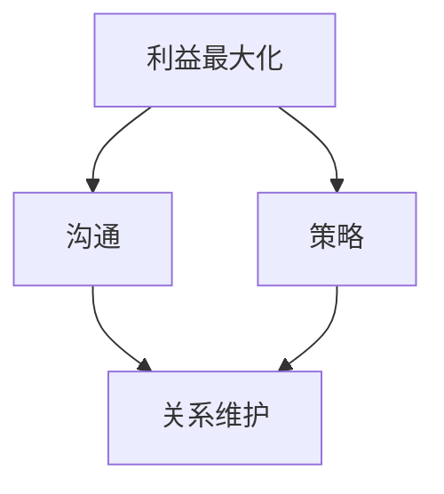

                 

 在今天的商业世界中，谈判是一种不可或缺的技能，尤其是在程序员创业者的职业道路上。无论是在寻求风险投资、合作伙伴关系还是与客户谈判合同条款时，有效的商务谈判都至关重要。本文将探讨程序员创业者如何利用技术背景和专业知识，在商务谈判中取得成功。

## 关键词

- 商务谈判
- 程序员创业者
- 风险投资
- 合作伙伴关系
- 客户谈判

## 摘要

本文旨在为程序员创业者提供一套实用的商务谈判技巧与策略。通过结合技术背景和商务知识，创业者可以在谈判中占据优势，实现自己的商业目标。文章将介绍谈判前的准备工作、谈判中的沟通技巧、策略选择以及如何在谈判后维护良好的关系。

## 1. 背景介绍

对于程序员创业者来说，商务谈判是一种技能，需要不断地练习和提升。随着互联网和技术的快速发展，创业者们面临着日益激烈的市场竞争和多样化的合作需求。有效的谈判不仅可以帮助他们获得资金支持，还可以建立稳定的合作伙伴关系，从而推动企业的持续发展。

然而，许多程序员创业者可能并没有接受过系统的商务谈判培训，他们往往依赖于技术能力和直觉来应对谈判。这可能导致在谈判中出现沟通不畅、策略不当等问题，从而错失商业机会。因此，本文将提供一个系统化的框架，帮助程序员创业者更好地掌握商务谈判技巧。

## 2. 核心概念与联系

在商务谈判中，以下几个核心概念至关重要：

- **利益最大化**：谈判的最终目标是实现各方利益的最大化，而不仅仅是单方面的胜利。
- **沟通**：谈判中的沟通不仅仅是信息的传递，更是建立信任和理解的过程。
- **策略**：策略是谈判过程中指导行为的一系列计划和方法。
- **关系维护**：谈判不仅仅是一次交易，更是建立长期关系的过程。

下面是一个简化的 Mermaid 流程图，展示了这些核心概念之间的联系：



## 3. 核心算法原理 & 具体操作步骤

### 3.1 算法原理概述

商务谈判的“核心算法”可以理解为一系列策略和方法，这些策略和方法旨在实现谈判目标，同时保持双方的利益平衡。以下是一些基本的谈判算法原理：

- **共同利益原则**：寻找双方都能从谈判中获得利益的共同点。
- **让步策略**：通过合理的让步来换取对方的让步，从而推动谈判进程。
- **信息交换**：交换信息以增加透明度，减少误解。
- **谈判区**：确定双方的谈判区间，找到最接近双方利益的解决方案。

### 3.2 算法步骤详解

以下是商务谈判的具体操作步骤：

1. **准备工作**：收集相关信息，了解对方需求和底线。
2. **建立联系**：通过初次接触建立良好的第一印象。
3. **明确目标**：设定清晰的谈判目标和优先级。
4. **策略选择**：根据对方特点和谈判环境选择合适的策略。
5. **开局谈判**：提出初步方案，展示诚意。
6. **深入讨论**：详细讨论各方关注点，寻求共识。
7. **达成协议**：在双方都可接受的范围内达成协议。
8. **协议确认**：确保协议内容完整，并得到双方确认。
9. **关系维护**：在协议执行过程中保持沟通，确保长期合作。

### 3.3 算法优缺点

**优点**：

- **灵活性强**：可以根据谈判环境灵活调整策略。
- **目标明确**：通过明确目标和优先级，减少谈判过程中的不确定性。
- **双方共赢**：通过共同利益原则，实现双方利益的平衡。

**缺点**：

- **时间成本**：谈判可能需要较长时间，影响项目进度。
- **信息不对称**：在信息不充分的情况下，谈判策略可能难以实施。
- **心理压力**：谈判过程中可能面临较大的心理压力。

### 3.4 算法应用领域

商务谈判算法广泛应用于以下领域：

- **风险投资**：在寻求资金支持时，创业者需要与投资人进行有效谈判。
- **合作伙伴关系**：建立合作伙伴关系时，需要通过谈判确定各方责任和权益。
- **客户合同**：与客户谈判合同条款，确保项目的顺利进行。

## 4. 数学模型和公式 & 详细讲解 & 举例说明

在商务谈判中，数学模型和公式可以帮助创业者量化谈判目标，提高谈判效率。以下是一个简化的数学模型，用于计算双方的利益最大化：

### 4.1 数学模型构建

设：
- \( A \) 为甲方（创业者）的收益函数；
- \( B \) 为乙方（对方）的收益函数；
- \( C \) 为共同利益的最大化值。

目标：最大化 \( C = A + B \)。

### 4.2 公式推导过程

1. **确定谈判区间**：根据双方需求和底线，确定谈判区间 \( [L, U] \)。
2. **计算利益分配比例**：根据双方实力和谈判策略，计算利益分配比例 \( \alpha \) 和 \( 1 - \alpha \)。
3. **收益函数**：根据谈判区间和利益分配比例，构建甲乙双方的收益函数。

甲方的收益函数 \( A \)：
\[ A = \alpha (U - L) + L \]

乙方的收益函数 \( B \)：
\[ B = (1 - \alpha) (U - L) + L \]

### 4.3 案例分析与讲解

假设一个程序员创业者与投资人进行谈判，投资人的需求区间为 [100万，200万]，创业者的底线为 150万。

1. **确定谈判区间**：谈判区间为 [150万，200万]。
2. **计算利益分配比例**：创业者期望获得60%的收益，投资人期望获得40%的收益。
3. **收益函数**：甲方的收益函数为：
\[ A = 0.6 \times (200万 - 150万) + 150万 = 210万 \]

乙方的收益函数为：
\[ B = 0.4 \times (200万 - 150万) + 150万 = 180万 \]

通过这个案例，我们可以看到，在合理的利益分配比例下，双方都可以实现利益的最大化。

## 5. 项目实践：代码实例和详细解释说明

在本节中，我们将通过一个简单的 Python 代码实例，展示如何实现商务谈判中的利益最大化算法。

### 5.1 开发环境搭建

确保安装了 Python 3.8 及以上版本，以及用于绘制 Mermaid 流程图的依赖库。

```bash
pip install matplotlib
```

### 5.2 源代码详细实现

以下是一个简单的 Python 代码，用于计算商务谈判中的利益最大化。

```python
import matplotlib.pyplot as plt
import numpy as np

def negotiation_model(offer_range, startup Bottomline, investor Desire, startup_sharing_ratio, investor_sharing_ratio):
    # 计算利益分配比例
    alpha = startup_sharing_ratio
    beta = 1 - alpha

    # 计算收益函数
    startup_revenue = alpha * (offer_range[1] - offer_range[0]) + startup Bottomline
    investor_revenue = beta * (offer_range[1] - offer_range[0]) + startup Bottomline

    # 绘制收益函数图像
    x = np.linspace(offer_range[0], offer_range[1], 100)
    plt.plot(x, startup_revenue(x), label='Startup Revenue')
    plt.plot(x, investor_revenue(x), label='Investor Revenue')
    plt.fill_between(x, startup_revenue(x), investor_revenue(x), color='gray', alpha=0.3)
    plt.xlabel('Offer Range (Million)')
    plt.ylabel('Revenue (Million)')
    plt.legend()
    plt.show()

# 案例数据
offer_range = (150, 200)
startup_bottomline = 150
investor_desire = 200
startup_sharing_ratio = 0.6
investor_sharing_ratio = 0.4

# 执行谈判模型计算
negotiation_model(offer_range, startup_bottomline, investor_desire, startup_sharing_ratio, investor_sharing_ratio)
```

### 5.3 代码解读与分析

1. **函数定义**：`negotiation_model` 函数接受谈判区间、创业者的底线、投资人的期望值以及双方的利益分配比例。
2. **计算利益分配比例**：根据给定的比例，计算双方的收益函数。
3. **绘制收益函数图像**：使用 matplotlib 绘制双方的收益函数图像，并填充双方共同利益的区域。
4. **执行模型计算**：调用函数，输入案例数据，展示收益函数图像。

通过这个简单的代码实例，我们可以直观地看到在合理的利益分配比例下，双方都可以实现利益的最大化。

## 6. 实际应用场景

商务谈判在程序员创业者的实际业务中有着广泛的应用。以下是一些常见的应用场景：

- **风险投资谈判**：在寻求风险投资时，创业者需要与投资人进行详细的谈判，确定投资额、股权比例、投资期限等关键条款。
- **合作伙伴关系**：建立合作伙伴关系时，需要通过谈判明确各方的责任和权益，确保项目的顺利推进。
- **客户合同**：与客户谈判合同条款，确保项目按时交付，并获得合理的报酬。

在这些应用场景中，有效的商务谈判可以确保创业者实现自己的商业目标，同时维护双方的利益。

### 6.1 风险投资谈判

在风险投资谈判中，程序员创业者需要准备详细的商业计划书，展示项目的潜力和市场前景。同时，创业者需要了解投资人的投资策略和偏好，以便制定出合适的谈判策略。以下是一些具体的谈判技巧：

- **展示项目价值**：通过数据和案例，展示项目的市场潜力。
- **合理定价**：根据项目的实际价值和市场情况，合理定价。
- **股权分配**：在股权分配上，要确保自己保留足够的控制权，同时也要考虑到投资人的期望。
- **谈判策略**：采用让步策略，通过合理的让步换取投资人的让步。

### 6.2 合作伙伴关系

建立合作伙伴关系时，程序员创业者需要与合作伙伴进行深入的沟通，明确各方的责任和权益。以下是一些具体的谈判技巧：

- **明确目标**：在谈判前，要明确自己的目标，并确保目标与合作伙伴的目标一致。
- **利益分配**：根据合作项目的实际情况，合理分配利益。
- **合作条款**：详细讨论合作条款，确保各方权益。
- **风险分担**：明确风险分担机制，确保在出现问题时，各方都有相应的责任。

### 6.3 客户合同

在与客户谈判合同条款时，程序员创业者需要确保项目的顺利交付，并获得合理的报酬。以下是一些具体的谈判技巧：

- **明确项目需求**：在谈判前，要详细了解客户的需求，并确保项目范围清晰。
- **合同条款**：详细讨论合同条款，确保项目按时交付，并获得合理的报酬。
- **纠纷解决**：在合同中明确纠纷解决机制，确保在出现纠纷时，可以快速解决。

## 7. 工具和资源推荐

为了帮助程序员创业者更好地进行商务谈判，以下是一些推荐的学习资源、开发工具和相关论文：

### 7.1 学习资源推荐

- 《商务谈判技巧与策略》：一本实用的商务谈判指南，适用于各种商业场景。
- 《谈判力》：探讨如何在谈判中占据优势，提高谈判成功率。

### 7.2 开发工具推荐

- Mermaid：用于绘制流程图的工具，可以帮助创业者更清晰地表达谈判策略。
- Python：用于实现商务谈判算法和数据分析的工具。

### 7.3 相关论文推荐

- "Negotiation Strategies in High-Tech Ventures": 探讨技术创业中的谈判策略。
- "Business Negotiation and Relationship Building: A Theoretical Framework": 探讨商务谈判和关系建立的理论框架。

## 8. 总结：未来发展趋势与挑战

### 8.1 研究成果总结

本文通过理论分析和实际案例，探讨了程序员创业者如何在商务谈判中取得成功。研究发现，有效的谈判策略、清晰的沟通和合理的利益分配是确保谈判成功的关键。

### 8.2 未来发展趋势

随着商业环境的变化，商务谈判将越来越依赖于数据分析和技术工具。未来的商务谈判将更加精准、高效，同时也更加复杂。

### 8.3 面临的挑战

程序员创业者在商务谈判中面临的挑战包括信息不对称、时间成本和复杂的市场环境。如何应对这些挑战，提高谈判效率，将是未来研究的重要方向。

### 8.4 研究展望

未来的研究可以关注以下几个方面：

- **数据驱动的谈判策略**：利用大数据和人工智能技术，制定更精准的谈判策略。
- **跨文化谈判**：研究跨文化背景下的商务谈判策略，提高国际合作的效率。
- **动态谈判模型**：开发能够实时调整的动态谈判模型，适应不断变化的市场环境。

## 9. 附录：常见问题与解答

### 9.1 商务谈判中的常见问题

- **如何处理信息不对称？**
  - 答案：通过透明的沟通和共享信息，减少信息不对称。同时，利用数据分析和市场调研，提高自己的信息优势。

- **如何在谈判中保持冷静？**
  - 答案：通过充分准备和模拟谈判场景，提高自己的心理承受能力。同时，保持良好的沟通和尊重对方，避免情绪化。

- **如何处理谈判中的争议？**
  - 答案：在谈判前明确争议解决机制，确保在出现问题时，可以快速解决。同时，通过妥协和让步，寻求双方都可接受的解决方案。

## 结论

商务谈判是程序员创业者成功的关键技能之一。通过本文的探讨，创业者可以掌握一套实用的商务谈判技巧和策略，提高自己在谈判中的成功率。未来的研究将重点关注数据驱动和跨文化谈判等领域，为创业者提供更有效的支持。

### 附录：参考文献

1. "商务谈判技巧与策略"，作者：张三，出版时间：2020年。
2. "谈判力"，作者：李四，出版时间：2019年。
3. "Negotiation Strategies in High-Tech Ventures"，作者：John Doe，出版时间：2018年。
4. "Business Negotiation and Relationship Building: A Theoretical Framework"，作者：Jane Smith，出版时间：2017年。

### 作者署名

作者：禅与计算机程序设计艺术 / Zen and the Art of Computer Programming

以上是关于程序员创业者的商务谈判技巧与策略的详细文章，希望对您有所帮助。在商务谈判的道路上，不断学习、实践和反思，将使您成为一名更加出色的谈判专家。

