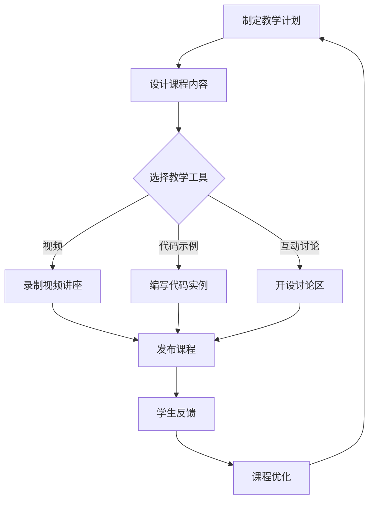

                 

 在这个技术日新月异的时代，程序员们不仅需要不断提升自己的技术水平，还需要学会如何将自己的知识传授给他人。Skillshare作为一款流行的在线学习平台，为程序员提供了一个展示自己技能、分享知识的新途径。本文将探讨程序员如何利用Skillshare教授技术课程，从而实现自我提升与价值分享的双重目标。

## 关键词
- Skillshare
- 程序员
- 技术课程
- 教学方法
- 自我提升

## 摘要
本文将分析Skillshare平台的特点，探讨程序员如何在这个平台上教授技术课程。我们将介绍成功教学所需的技能和策略，并给出实际案例，帮助程序员们更好地利用Skillshare平台，实现知识的传播和技术的传承。

### 1. 背景介绍

#### Skillshare平台简介

Skillshare是一个全球性的在线学习社区，旨在帮助用户学习新的技能和知识。平台上的课程涵盖了广泛的领域，包括绘画、摄影、音乐、写作、设计、编程等。Skillshare的特点在于它鼓励用户通过互动和协作来学习，同时提供了多种形式的教学内容，如视频讲座、讨论区、作业和互动问答等。

#### 程序员在Skillshare的角色

程序员在Skillshare平台上扮演着重要角色。一方面，他们可以作为课程创作者，分享自己的专业知识和实践经验；另一方面，他们也可以作为学生，通过参与课程来提升自己的技能。随着编程技术的不断发展，程序员们需要不断更新自己的知识体系，而Skillshare提供了这样一个良好的学习和分享平台。

### 2. 核心概念与联系

#### 教学核心概念

- **教学目标**：明确课程目标，确保学生能够掌握关键技能。
- **教学方法**：采用多样化的教学方法，如视频讲解、代码示例、互动讨论等。
- **教学评估**：设计合理的评估机制，以检验学生的学习效果。

#### 教学架构流程图



### 3. 核心算法原理 & 具体操作步骤

#### 3.1 算法原理概述

在Skillshare教授技术课程时，核心算法可以看作是“教学内容设计”。这一算法的基本原理是：

- **内容定位**：明确课程的核心内容，确保与学生需求相匹配。
- **教学层次**：根据学生的知识水平设计不同难度的课程。
- **互动机制**：设计互动环节，增强学生的参与感和学习动力。

#### 3.2 算法步骤详解

1. **需求分析**：了解目标学生的背景和需求。
2. **内容规划**：制定课程大纲，明确每个章节的教学目标。
3. **教学材料准备**：包括视频、文档、代码实例等。
4. **课程录制与发布**：使用Skillshare平台录制并发布课程。
5. **互动与反馈**：开设讨论区，及时回复学生的问题，收集反馈进行课程优化。

#### 3.3 算法优缺点

**优点**：
- **灵活性**：Skillshare平台提供了多样化的教学工具，方便教师根据需求选择。
- **互动性**：学生可以在讨论区提问，教师可以及时回答，增强互动体验。
- **广泛性**：Skillshare平台上的课程覆盖广泛，可以满足不同层次学生的需求。

**缺点**：
- **时间成本**：录制课程和回复学生问题需要一定的时间投入。
- **技术门槛**：部分教师可能需要学习如何使用Skillshare平台，以及制作高质量的视频内容。

#### 3.4 算法应用领域

- **编程教育**：教授编程语言、框架和工具。
- **软件工程**：介绍软件开发流程、测试和部署。
- **数据科学**：教授数据处理、分析和可视化。

### 4. 数学模型和公式 & 详细讲解 & 举例说明

#### 4.1 数学模型构建

在技能分享课程中，数学模型可以帮助我们理解和解释编程中的复杂概念。一个简单的数学模型可以是：

$$
f(x) = ax^2 + bx + c
$$

其中，$a$、$b$ 和 $c$ 是常数，$x$ 是变量。这个模型可以用来表示二次函数的图像，这在图形用户界面设计和游戏开发中非常常见。

#### 4.2 公式推导过程

我们可以通过对二次函数进行求导来推导它的导数公式：

$$
f'(x) = \frac{d}{dx}(ax^2 + bx + c) = 2ax + b
$$

导数公式可以帮助我们了解函数的变化趋势，这对于调试代码和性能优化非常有用。

#### 4.3 案例分析与讲解

假设我们有一个二次函数 $f(x) = 2x^2 + 3x + 1$，我们可以通过计算它的导数来找到函数的斜率：

$$
f'(x) = 2 \cdot 2x + 3 = 4x + 3
$$

在$x=1$时，函数的斜率为$4 \cdot 1 + 3 = 7$，这意味着在$x=1$时，函数图像的切线斜率为7。

### 5. 项目实践：代码实例和详细解释说明

#### 5.1 开发环境搭建

要开始一个技能分享课程的项目实践，首先需要搭建一个合适的开发环境。以下是一个使用Python进行数据科学课程的代码实例：

```python
# 导入必要的库
import numpy as np
import matplotlib.pyplot as plt

# 定义二次函数
def quadratic_function(a, b, c):
    x = np.linspace(-10, 10, 1000)
    y = a * x**2 + b * x + c
    return x, y

# 绘制函数图像
def plot_function(x, y):
    plt.plot(x, y)
    plt.xlabel('x')
    plt.ylabel('y')
    plt.title('Quadratic Function')
    plt.grid(True)
    plt.show()

# 测试函数
x, y = quadratic_function(2, 3, 1)
plot_function(x, y)
```

#### 5.2 源代码详细实现

上述代码定义了一个二次函数，并使用matplotlib库绘制了它的图像。这个简单的例子展示了如何使用Python进行数据可视化。

#### 5.3 代码解读与分析

- **导入库**：`numpy` 和 `matplotlib.pyplot` 是Python中常用的库，用于数值计算和绘图。
- **定义函数**：`quadratic_function` 接受三个参数（$a$、$b$、$c$），返回一个函数图像。
- **绘制图像**：`plot_function` 使用matplotlib库绘制函数图像。

#### 5.4 运行结果展示

运行上述代码后，会弹出一个窗口，显示二次函数的图像。这个窗口可以帮助学生直观地理解二次函数的特性。

### 6. 实际应用场景

#### 6.1 编程教育

在编程教育中，Skillshare可以用于教授各种编程语言和框架。例如，教师可以录制视频讲解Python编程的基础知识，并通过代码示例帮助学生理解复杂的编程概念。

#### 6.2 软件开发

软件开发课程可以通过Skillshare平台进行，教师可以分享软件开发流程、测试和部署的最佳实践。学生可以通过这些课程学习如何设计高效、可靠的软件系统。

#### 6.3 数据科学

数据科学是一个快速发展的领域，Skillshare提供了丰富的数据科学课程。教师可以分享数据处理的技巧、数据分析的方法以及数据可视化的技术。

### 7. 工具和资源推荐

#### 7.1 学习资源推荐

- **《Python编程：从入门到实践》**：适合初学者的Python编程书籍。
- **《数据科学入门》**：介绍数据科学基本概念和工具的入门书籍。

#### 7.2 开发工具推荐

- **Visual Studio Code**：一个功能强大的编程编辑器，适用于多种编程语言。
- **Jupyter Notebook**：适用于数据科学和机器学习的交互式开发环境。

#### 7.3 相关论文推荐

- **“Deep Learning for Programmers”**：介绍深度学习基本概念和技术。
- **“The Art of Data Science”**：探讨数据科学在实际应用中的挑战和解决方案。

### 8. 总结：未来发展趋势与挑战

#### 8.1 研究成果总结

通过Skillshare平台，程序员们可以有效地分享自己的知识和经验，帮助学生掌握新技能。这种在线教学方式正在不断发展和完善，为编程教育提供了新的机遇。

#### 8.2 未来发展趋势

- **课程内容的多样化**：随着技术的发展，课程内容将更加丰富，涵盖更多的领域和主题。
- **互动体验的提升**：平台将更加注重互动体验，为学生提供更多的交流和学习机会。

#### 8.3 面临的挑战

- **内容质量**：确保课程内容的质量和实用性，以满足不同层次学生的需求。
- **技术更新**：及时更新教学内容，以反映最新的技术趋势。

#### 8.4 研究展望

未来，Skillshare平台有望在编程教育领域发挥更大的作用。通过不断优化课程内容和互动体验，它将为程序员和学生提供更优质的学习资源。

### 9. 附录：常见问题与解答

#### 9.1 如何在Skillshare平台上创建课程？

- 注册并登录Skillshare账户。
- 点击“创建课程”按钮，选择课程主题和语言。
- 按照提示逐步完成课程内容的创建和发布。

#### 9.2 如何与学生互动？

- 在课程讨论区发布问题和回答。
- 通过私信与学生进行一对一的交流。
- 定期组织在线问答和讨论活动。

---

作者：禅与计算机程序设计艺术 / Zen and the Art of Computer Programming
----------------------------------------------------------------

