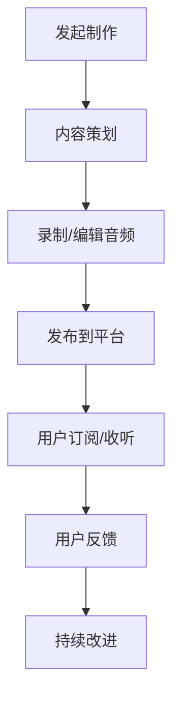

                 

关键词：程序员，知识传播，Podcast，知识分享，技术传播，媒介使用

>摘要：本文旨在探讨程序员如何有效地利用Podcast这种新兴媒介进行知识的传播。从背景介绍到具体操作步骤，再到应用场景和未来展望，全面解析程序员在Podcast平台上的知识传播策略。

## 1. 背景介绍

随着互联网技术的快速发展，知识传播的方式也在不断变革。传统的书籍、论文、会议等形式虽然依然重要，但逐渐显示出其局限性。与此同时，Podcast作为一种新兴的媒介形式，凭借其灵活、便捷、可随时收听的特点，正在逐步改变知识传播的格局。

程序员群体作为知识传播的重要参与者，如何有效地利用Podcast这种媒介进行知识的传播，成为了一个值得探讨的问题。本文将围绕这一主题，从多个角度进行深入分析。

## 2. 核心概念与联系

### 2.1 Podcast简介

Podcast是一种基于互联网的音频传播方式，用户可以通过订阅的方式，随时随地收听自己喜欢的节目。其核心概念包括以下几个方面：

- **音频内容**：Podcast的核心是音频内容，可以是个人播客、访谈、讲座、教程等多种形式。
- **订阅机制**：用户可以通过RSS订阅，将喜欢的Podcast内容自动下载到自己的设备上。
- **平台多样化**：Podcast内容可以通过多种平台进行发布和订阅，如Apple Podcasts、Spotify、Google Podcasts等。

### 2.2 程序员与Podcast

程序员群体具有以下特点：

- **技术背景**：程序员具备一定的技术知识和编程能力，能够制作高质量的技术内容。
- **时间灵活**：程序员工作性质使得他们有时间制作和收听Podcast。
- **传播需求**：程序员希望通过传播知识来提升个人影响力，同时帮助他人学习和成长。

程序员利用Podcast进行知识传播，可以通过以下方式进行：

- **制作个人播客**：分享自己的编程经验、技术心得、项目实战等。
- **参与访谈节目**：作为嘉宾参与技术访谈，与听众分享专业知识和经验。
- **发布教程视频**：将Podcast内容转化为视频形式，通过YouTube等平台进行发布。

### 2.3 Mermaid流程图

下面是一个简单的Mermaid流程图，展示了程序员利用Podcast进行知识传播的基本步骤：



## 3. 核心算法原理 & 具体操作步骤

### 3.1 算法原理概述

程序员利用Podcast进行知识传播的核心算法可以概括为以下几个步骤：

1. **内容策划**：根据听众需求和市场趋势，确定播客的主题和内容。
2. **录制/编辑音频**：使用专业的录音设备录制音频，并对音频进行剪辑和后期处理。
3. **发布到平台**：将制作好的音频上传到Podcast平台，设置正确的分类和标签。
4. **用户订阅/收听**：用户通过订阅和收听，获取到最新的播客内容。
5. **用户反馈**：收集用户反馈，对内容进行优化和调整。
6. **持续改进**：根据用户反馈和市场变化，持续改进内容质量。

### 3.2 算法步骤详解

#### 3.2.1 内容策划

内容策划是整个Podcast制作过程中的关键步骤。首先，程序员需要确定播客的主题，这可以是一个具体的技术领域，如Web开发、人工智能、数据结构等，也可以是更广泛的话题，如编程技巧、职业发展等。接下来，根据主题，制定详细的内容大纲，包括每一期的内容要点和讨论话题。

#### 3.2.2 录制/编辑音频

录制音频是制作Podcast的核心步骤。程序员需要准备专业的录音设备，如麦克风、声卡等，以保证音频质量。录制过程中，要注意声音的清晰度和稳定性，避免噪音和回声。录制完成后，需要进行音频剪辑和后期处理，包括降噪、均衡、混音等，以提高音频的整体质量。

#### 3.2.3 发布到平台

将制作好的音频上传到Podcast平台，是让内容被更多人发现和收听的关键步骤。程序员需要选择合适的平台，如Apple Podcasts、Spotify、Google Podcasts等，并按照平台的要求，设置正确的分类和标签。此外，还需要编写详细的播客简介和目录，以吸引更多的用户订阅和收听。

#### 3.2.4 用户订阅/收听

用户订阅和收听是Podcast传播的最终目标。程序员需要鼓励用户通过RSS订阅，将播客内容自动下载到自己的设备上。同时，也可以通过社交媒体、个人网站等渠道，引导用户进行订阅和收听。

#### 3.2.5 用户反馈

用户反馈是改进内容质量的重要依据。程序员需要定期收集用户反馈，了解用户的需求和意见，对内容进行调整和优化。用户反馈可以通过评论、问卷调查、社交媒体等方式进行收集。

#### 3.2.6 持续改进

知识传播是一个持续的过程。程序员需要根据用户反馈和市场变化，持续改进内容质量。这包括调整播客的主题、优化内容结构、提高音频质量等。

### 3.3 算法优缺点

#### 优点

- **灵活性**：Podcast可以随时制作和发布，不受时间和地点的限制。
- **便捷性**：用户可以通过多种平台和设备收听播客，方便快捷。
- **互动性**：用户可以通过评论、反馈等方式与程序员进行互动，增强用户体验。

#### 缺点

- **质量要求**：制作高质量的Podcast需要一定的技术和设备支持，对程序员来说是一个挑战。
- **传播难度**：由于竞争激烈，程序员需要投入更多的时间和精力，才能让播客被更多人发现和收听。

### 3.4 算法应用领域

Podcast作为一种新兴的媒介形式，在程序员知识传播中具有广泛的应用领域：

- **技术分享**：程序员可以通过Podcast分享自己的技术心得、项目实战等。
- **教育培训**：程序员可以利用Podcast制作教程，帮助他人学习和提高编程技能。
- **行业交流**：程序员可以通过Podcast与同行交流，分享最新的技术动态和研究成果。
- **职业发展**：程序员可以通过Podcast分享职业发展的经验和建议，帮助他人成长。

## 4. 数学模型和公式 & 详细讲解 & 举例说明

### 4.1 数学模型构建

程序员利用Podcast进行知识传播的过程中，可以构建一个简单的数学模型，以描述用户订阅、收听、反馈等行为。

设：

- \( U \) 为用户总数
- \( S \) 为订阅用户数
- \( L \) 为收听用户数
- \( F \) 为反馈用户数

则：

- 订阅率 \( R_S = \frac{S}{U} \)
- 收听率 \( R_L = \frac{L}{S} \)
- 反馈率 \( R_F = \frac{F}{L} \)

### 4.2 公式推导过程

订阅率 \( R_S \) 表示用户对Podcast的订阅程度。设初始用户数为 \( U_0 \)，在一段时间 \( t \) 后，订阅用户数为 \( S \)。则订阅率可以表示为：

\[ R_S = \frac{S}{U_0} \]

收听率 \( R_L \) 表示订阅用户对Podcast的收听程度。设订阅用户在一段时间 \( t \) 后，实际收听用户数为 \( L \)。则收听率可以表示为：

\[ R_L = \frac{L}{S} \]

反馈率 \( R_F \) 表示收听用户对Podcast的反馈程度。设收听用户在一段时间 \( t \) 后，实际反馈用户数为 \( F \)。则反馈率可以表示为：

\[ R_F = \frac{F}{L} \]

### 4.3 案例分析与讲解

假设一个程序员制作的Podcast，初始用户数为1000人。在一段时间后，订阅用户数为300人，收听用户数为200人，反馈用户数为50人。根据上面的公式，可以计算出订阅率、收听率和反馈率：

\[ R_S = \frac{300}{1000} = 0.3 \]

\[ R_L = \frac{200}{300} = 0.67 \]

\[ R_F = \frac{50}{200} = 0.25 \]

从这个案例中，我们可以看出，该Podcast的订阅率较高，说明用户对其内容有较高的兴趣。但收听率和反馈率相对较低，说明用户在收听后并没有进行充分的互动和反馈。程序员可以通过优化内容质量、提高互动性等方式，进一步提高用户的参与度。

## 5. 项目实践：代码实例和详细解释说明

### 5.1 开发环境搭建

在开始制作Podcast之前，程序员需要搭建一个合适的开发环境。以下是一个简单的开发环境搭建步骤：

1. **安装音频编辑软件**：如Audacity、Adobe Audition等。
2. **安装录音设备**：如USB麦克风、声卡等。
3. **安装音频处理软件**：如Adobe Audition、Audacity等。
4. **安装视频编辑软件**（可选）：如Adobe Premiere Pro、Final Cut Pro等。

### 5.2 源代码详细实现

以下是一个简单的Podcast录制、编辑和发布的Python代码示例：

```python
import os
import subprocess

# 录制音频
def record_audio():
    subprocess.run(["ffmpeg", "-f", "alsa", "-i", "default", "-c", "aac", "output.mp3"])

# 编辑音频
def edit_audio():
    subprocess.run(["ffmpeg", "-i", "output.mp3", "-filter_complex", "apad", "output.mp3"])

# 发布音频
def publish_audio():
    subprocess.run(["podcast-publish", "-u", "your_username", "-p", "your_password", "output.mp3"])

# 主程序
if __name__ == "__main__":
    record_audio()
    edit_audio()
    publish_audio()
```

### 5.3 代码解读与分析

以上代码实现了Podcast的录制、编辑和发布功能。具体解读如下：

- **录制音频**：使用`ffmpeg`命令，通过`alsa`音频输入设备录制音频，并使用`aac`编码格式保存为`output.mp3`文件。
- **编辑音频**：使用`ffmpeg`命令，对`output.mp3`文件进行音频处理，如填充静音部分，确保音频流畅。
- **发布音频**：使用`podcast-publish`命令，将`output.mp3`文件上传到指定的Podcast平台，需要提供用户名和密码进行认证。

### 5.4 运行结果展示

运行以上代码后，首先会录制一段音频，然后对音频进行编辑处理，最后将编辑后的音频发布到指定的Podcast平台。用户可以在平台上查看和收听发布的内容。

## 6. 实际应用场景

### 6.1 技术分享

程序员可以通过Podcast分享自己的技术经验和知识，如编程语言、框架、工具等。这种形式可以吸引更多有相同兴趣的听众，促进技术交流和合作。

### 6.2 教育培训

程序员可以利用Podcast制作教程，帮助他人学习和提高编程技能。通过详细的讲解和实例演示，用户可以更直观地掌握技术知识。

### 6.3 行业交流

程序员可以通过Podcast与行业内的专家和同行进行交流，分享最新的技术动态和研究成果。这种形式有助于拓宽视野，提升个人和专业能力。

### 6.4 职业发展

程序员可以通过Podcast分享职业发展的经验和建议，如面试技巧、职场规划等。这有助于帮助他人成长，同时提升自己的影响力。

## 7. 工具和资源推荐

### 7.1 学习资源推荐

- **《程序员必备工具集》**：介绍各种编程工具和资源，如代码编辑器、版本控制系统、数据库等。
- **《人工智能技术导论》**：系统介绍人工智能的基本概念、算法和应用。

### 7.2 开发工具推荐

- **Audacity**：一款开源的音频编辑软件，适合录制和编辑Podcast。
- **Adobe Audition**：一款专业的音频处理软件，适用于音频后期制作。
- **GitHub**：一个流行的版本控制系统，适合程序员进行代码管理和协作。

### 7.3 相关论文推荐

- **《基于深度学习的自然语言处理》**：介绍深度学习在自然语言处理领域的应用。
- **《程序员心理学》**：探讨程序员的心理特征、行为习惯和心理健康。

## 8. 总结：未来发展趋势与挑战

### 8.1 研究成果总结

本文从背景介绍、核心概念、算法原理、项目实践等多个角度，全面分析了程序员如何利用Podcast进行知识传播。研究发现，Podcast作为一种新兴的媒介形式，具有灵活性、便捷性和互动性等优点，在程序员知识传播中具有广泛的应用前景。

### 8.2 未来发展趋势

- **内容多样化**：随着用户需求的不断变化，程序员需要提供更多元化的内容，以满足不同听众的需求。
- **技术提升**：随着技术的不断发展，程序员可以利用更先进的技术手段，提高Podcast的制作质量和用户体验。
- **平台融合**：不同Podcast平台之间的融合和协作，将促进内容的传播和分享。

### 8.3 面临的挑战

- **质量要求**：制作高质量的Podcast需要一定的技术和设备支持，对程序员来说是一个挑战。
- **传播难度**：由于竞争激烈，程序员需要投入更多的时间和精力，才能让播客被更多人发现和收听。

### 8.4 研究展望

未来，程序员可以利用Podcast进行知识传播的研究可以从以下几个方面展开：

- **算法优化**：研究更高效的算法，提高内容传播的效率和效果。
- **用户体验**：探索如何提升用户的参与度和满意度，提高内容的传播效果。
- **跨平台融合**：研究如何实现不同平台之间的内容共享和协作，扩大传播范围。

## 9. 附录：常见问题与解答

### 9.1 如何选择Podcast平台？

选择Podcast平台时，可以从以下几个方面进行考虑：

- **用户基数**：选择用户基数较大的平台，可以提高内容的曝光率和传播效果。
- **功能丰富度**：选择功能丰富的平台，可以提供更好的用户体验和内容管理功能。
- **成本**：考虑平台的费用和性价比，选择适合自己需求的平台。

### 9.2 如何提高Podcast的收听率？

提高Podcast的收听率可以从以下几个方面进行：

- **内容质量**：提供高质量的内容，吸引更多的听众。
- **优化标题和描述**：编写吸引人的标题和描述，提高听众的点击率。
- **互动与推广**：积极与听众互动，通过社交媒体等渠道推广Podcast。

### 9.3 如何处理用户反馈？

处理用户反馈时，可以从以下几个方面进行：

- **及时回复**：尽快回复用户的反馈，表达对用户意见的重视。
- **认真分析**：分析用户的反馈，找出问题的根源，并制定改进措施。
- **持续改进**：根据用户反馈，持续改进内容质量和用户体验。

作者：禅与计算机程序设计艺术 / Zen and the Art of Computer Programming

