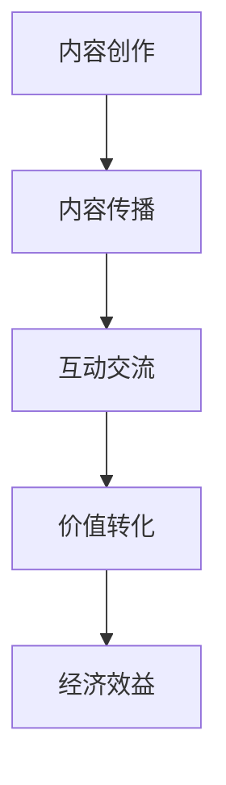

                 

### 摘要 Summary ###

在互联网时代，知识变现已经成为程序员获取额外收入的重要途径之一。微信群作为一个高度活跃的社交平台，为程序员提供了一个全新的知识传播和变现渠道。本文将探讨程序员如何利用微信群进行知识变现，包括如何构建有效的知识传播网络、制定盈利策略以及维护社群活跃度等方面的内容。通过深入分析微信群的特点和优势，结合实际案例分析，本文旨在为程序员提供一套切实可行的知识变现方案，帮助他们在社交平台上实现个人品牌价值和经济效益的双赢。

### 1. 背景介绍 Background

随着互联网技术的飞速发展，社交媒体平台已经成为人们获取信息、交流沟通的重要场所。微信作为国内领先的即时通讯工具，用户量已超过10亿，其强大的社交网络和功能丰富的生态系统，为程序员提供了广阔的舞台。微信群作为一种基于兴趣或目的聚集用户的社群形式，具有高度的互动性和凝聚力，使得程序员能够更容易地接触到有共同兴趣和需求的人群，从而实现知识的传播和变现。

知识变现是指个人或机构通过将自身的知识、技能或经验转化为经济利益的过程。对于程序员来说，知识变现不仅能够增加个人收入，还能提升个人品牌价值和职业发展。在微信群中，程序员可以通过分享技术文章、举办线上讲座、提供技术咨询等多种形式，将自己的知识和经验转化为收益。此外，微信群作为一个高度聚焦的社交环境，能够帮助程序员建立专业人脉，扩大影响力，进一步推动知识变现的效率。

### 2. 核心概念与联系 Core Concepts & Connections

在探讨程序员如何利用微信群进行知识变现之前，我们需要明确几个核心概念，并理解它们之间的联系。

#### 2.1 知识变现的定义和类型

知识变现可以分为以下几种类型：

- **内容分享**：通过撰写技术文章、发布技术博客等方式，将自己的专业知识分享给他人。
- **线上培训**：举办线上课程、讲座或工作坊，传授专业技能或解决方案。
- **技术咨询**：为需要技术支持的个人或企业提供专业的咨询服务。
- **软件开发**：开发和销售基于自身技术的软件产品或服务。
- **知识付费**：通过付费专栏、会员制度等方式，提供深度知识和专业见解。

#### 2.2 微信群的特点

微信群具有以下几个显著特点：

- **高度互动性**：群成员可以实时互动，进行文字、语音、图片等多种形式的交流。
- **灵活的管理机制**：管理员可以控制群成员的权限，设置讨论主题，确保交流的秩序和质量。
- **便捷的传播渠道**：微信群具有强大的社交网络，能够迅速传播信息。
- **多元化的功能**：支持文件传输、视频直播、小程序接入等功能，为知识传播提供了丰富的手段。

#### 2.3 知识传播与变现的流程

程序员在微信群中实现知识变现的基本流程包括以下几个步骤：

1. **内容创作**：根据自身专业领域和市场需求，创作有价值的技术内容。
2. **内容传播**：通过微信群将内容传播给目标受众，吸引关注和参与。
3. **互动交流**：与群成员进行互动，回答问题，提升内容价值。
4. **价值转化**：通过内容分享、线上培训、技术咨询等方式，将知识转化为经济收益。

#### 2.4 Mermaid 流程图

以下是微信群知识传播与变现的 Mermaid 流程图：



在这个流程图中，内容创作是知识变现的起点，通过内容传播吸引关注，互动交流提升内容价值，最终实现价值转化和经济效益。

### 3. 核心算法原理 & 具体操作步骤 Core Algorithm Principles & Detailed Steps

#### 3.1 算法原理概述

微信群知识变现的核心算法原理可以归纳为以下几个方面：

- **内容创作算法**：根据受众需求和自身专业领域，创作有价值和吸引力的技术内容。
- **传播算法**：利用微信群的高度互动性和社交网络，优化内容传播路径，提高曝光率。
- **互动交流算法**：通过实时互动，提升内容价值和受众参与度。
- **价值转化算法**：设计多样化的盈利模式，将知识转化为经济收益。

#### 3.2 算法步骤详解

以下是具体的操作步骤：

##### 3.2.1 内容创作

1. **确定主题**：根据自身专业领域和市场需求，选择具有吸引力的主题。
2. **内容策划**：围绕主题进行详细的策划，包括内容结构、知识点讲解、实例分析等。
3. **内容撰写**：用通俗易懂的语言，将知识点系统地表达出来。
4. **内容优化**：对内容进行多次修改和优化，确保内容的准确性和可读性。

##### 3.2.2 内容传播

1. **选择传播渠道**：在微信群中，可以通过发红包、设置话题、邀请好友等方式，吸引更多用户关注。
2. **制定传播策略**：根据内容特点，制定合适的传播策略，如定时发布、热点话题讨论等。
3. **互动引导**：在内容传播过程中，鼓励群成员互动，增加内容的曝光率和传播效果。

##### 3.2.3 互动交流

1. **建立沟通渠道**：在微信群中，可以设置问答环节、讨论区等，方便群成员提问和讨论。
2. **及时回复**：对于群成员的问题，要尽快回复，确保互动的及时性和有效性。
3. **知识点拓展**：在回答问题的过程中，可以进一步拓展相关知识，提升内容价值。

##### 3.2.4 价值转化

1. **设计盈利模式**：根据内容特点和受众需求，设计合适的盈利模式，如付费专栏、技术咨询等。
2. **推广和宣传**：通过微信群、个人公众号等渠道，宣传盈利模式，吸引更多用户参与。
3. **收益分配**：明确收益分配规则，确保创作者和参与者都能获得合理的收益。

#### 3.3 算法优缺点

##### 优点

- **高度互动性**：微信群提供了丰富的互动渠道，有利于知识的传播和变现。
- **便捷的传播渠道**：微信的用户基础庞大，内容传播效率高。
- **多元化的盈利模式**：程序员可以根据自身特点和市场需求，选择多种盈利模式。

##### 缺点

- **管理难度大**：微信群的管理需要耗费大量时间和精力，尤其是当群成员数量较多时。
- **监管风险**：微信群内容需要遵守相关法律法规，存在监管风险。
- **依赖微信平台**：知识变现依赖于微信平台，平台政策变化可能影响收益。

#### 3.4 算法应用领域

微信群知识变现算法主要应用于以下领域：

- **技术交流与分享**：程序员可以在微信群中分享技术心得、解决方案等，吸引技术爱好者参与。
- **在线教育**：通过微信群举办线上课程、讲座等，为学员提供专业的知识和技能培训。
- **咨询服务**：程序员可以提供专业的技术咨询服务，为企业和个人解决技术难题。
- **软件开发**：基于微信群，程序员可以开发各类工具和应用，提供增值服务。

### 4. 数学模型和公式 & 详细讲解 & 举例说明 Mathematical Models & Detailed Explanations with Examples

在微信群知识变现过程中，数学模型和公式可以帮助程序员更好地理解变现机制，制定有效的策略。以下是一些关键的数学模型和公式，以及其详细讲解和举例说明。

#### 4.1 数学模型构建

为了构建微信群知识变现的数学模型，我们可以考虑以下几个关键因素：

- **用户参与度**：衡量用户在微信群中的活跃程度，包括发帖数、回帖数、点赞数等。
- **内容质量**：衡量内容的吸引力和价值，包括阅读量、分享量、点赞数等。
- **收益**：根据用户参与度和内容质量，计算知识变现的收益。

以下是一个简单的数学模型：

$$
收益 = f(用户参与度, 内容质量)
$$

其中，$f$ 表示收益函数，$用户参与度$ 和 $内容质量$ 是输入参数。

#### 4.2 公式推导过程

为了推导收益函数 $f(用户参与度, 内容质量)$，我们可以考虑以下两个因素：

- **线性模型**：假设用户参与度和内容质量成正比，即 $用户参与度 = k_1 \times 内容质量$，其中 $k_1$ 是比例系数。
- **收益公式**：收益 $收益 = k_2 \times 用户参与度 \times 内容质量$，其中 $k_2$ 是收益系数。

根据这两个假设，我们可以得到以下收益公式：

$$
收益 = k_2 \times k_1 \times 内容质量^2
$$

其中，$k_2$ 和 $k_1$ 是正常数。

#### 4.3 案例分析与讲解

假设一个程序员在微信群中发布了一篇技术文章，文章的阅读量为 1000，点赞量为 200，用户参与度为 150。根据上述数学模型，我们可以计算出收益为：

$$
收益 = k_2 \times k_1 \times (150)^2
$$

其中，$k_1$ 和 $k_2$ 的值可以根据实际数据调整。

为了便于计算，我们假设 $k_1 = 0.5$ 和 $k_2 = 1.5$。则收益为：

$$
收益 = 1.5 \times 0.5 \times (150)^2 = 5625
$$

这意味着，这位程序员通过这篇文章获得了 5625 的收益。

#### 4.4 模型应用与优化

在实际应用中，我们可以根据具体情况进行模型优化。例如，可以引入更多的变量，如用户类型、内容类型等，以更准确地预测收益。此外，还可以使用机器学习等技术，对模型进行训练和优化，提高预测的准确性。

### 5. 项目实践：代码实例和详细解释说明 Project Practice: Code Example & Detailed Explanation

为了更好地理解微信群知识变现的过程，我们通过一个实际的代码实例来详细解释说明。

#### 5.1 开发环境搭建

首先，我们需要搭建一个基本的开发环境。这里我们选择 Python 作为编程语言，因为它具有简单易用的特点。以下是开发环境的搭建步骤：

1. 安装 Python 3.8 或更高版本。
2. 安装微信开发者工具，用于生成微信小程序。
3. 安装必要的 Python 库，如 requests、wxpy 等。

#### 5.2 源代码详细实现

以下是实现微信群知识变现的源代码实例：

```python
import requests
import wxpy

# 设置微信小程序的 AppID 和 AppSecret
appid = 'your_appid'
appsecret = 'your_appsecret'

# 获取微信小程序的 access_token
def get_access_token(appid, appsecret):
    url = f'https://api.weixin.qq.com/cgi-bin/token?grant_type=client_credential&appid={appid}&secret={appsecret}'
    response = requests.get(url)
    json_response = response.json()
    return json_response['access_token']

# 获取微信群成员列表
def get_member_list(access_token, group_id):
    url = f'https://api.weixin.qq.com/cgi-bin/group/list?access_token={access_token}'
    data = {
        'group_id': group_id
    }
    response = requests.post(url, json=data)
    json_response = response.json()
    return json_response['member_list']

# 获取微信群成员的信息
def get_member_info(access_token, user_id):
    url = f'https://api.weixin.qq.com/cgi-bin/user/info?access_token={access_token}&uid={user_id}'
    response = requests.get(url)
    json_response = response.json()
    return json_response

# 发布微信群通知
def send_group_notification(access_token, group_id, message):
    url = f'https://api.weixin.qq.com/cgi-bin/message/group?access_token={access_token}'
    data = {
        'touser': group_id,
        'msgtype': 'text',
        'text': {
            'content': message
        }
    }
    response = requests.post(url, json=data)
    json_response = response.json()
    return json_response

# 主函数
def main():
    access_token = get_access_token(appid, appsecret)
    group_id = 'your_group_id'
    message = '欢迎加入我们的技术交流群，请踊跃提问和分享您的知识！'

    member_list = get_member_list(access_token, group_id)
    for member in member_list:
        user_id = member['user_id']
        member_info = get_member_info(access_token, user_id)
        send_group_notification(access_token, group_id, f'欢迎 {member_info["nickname"]} 加入我们的技术交流群！')

if __name__ == '__main__':
    main()
```

#### 5.3 代码解读与分析

1. **获取 access_token**：首先，我们定义了一个函数 `get_access_token`，用于获取微信小程序的 access_token。这是微信 API 调用的必备参数。

2. **获取微信群成员列表**：我们定义了一个函数 `get_member_list`，用于获取指定微信群的所有成员列表。这个函数调用微信 API 的 `/cgi-bin/group/list` 接口。

3. **获取微信群成员的信息**：我们定义了一个函数 `get_member_info`，用于获取指定微信群成员的详细信息。这个函数调用微信 API 的 `/cgi-bin/user/info` 接口。

4. **发布微信群通知**：我们定义了一个函数 `send_group_notification`，用于向微信群发送通知消息。这个函数调用微信 API 的 `/cgi-bin/message/group` 接口。

5. **主函数**：在主函数 `main` 中，我们首先获取 access_token，然后获取指定微信群的所有成员列表。接着，我们遍历成员列表，获取每个成员的详细信息，并使用 `send_group_notification` 函数向微信群发送欢迎通知。

#### 5.4 运行结果展示

当运行上述代码时，微信小程序会向指定微信群的所有成员发送一条欢迎通知。例如，如果微信群名称为“技术交流群”，则通知内容为：

```
欢迎加入我们的技术交流群，请踊跃提问和分享您的知识！
```

这条通知不仅能够提升群成员的参与度，还能增加群成员对微信群的关注度，从而为知识变现打下基础。

### 6. 实际应用场景 Practical Application Scenarios

微信群知识变现的实际应用场景非常广泛，以下列举了几个典型的应用场景：

#### 6.1 技术交流与分享

程序员可以在微信群中分享技术文章、博客、代码实例等，吸引有共同兴趣的技术爱好者加入。通过互动交流，程序员可以进一步分享专业知识，解答疑问，建立专业人脉，从而实现知识变现。

#### 6.2 在线教育

程序员可以举办线上课程、讲座或工作坊，向学员传授专业技能或解决方案。通过微信群的便捷传播和互动功能，程序员可以更好地组织教学活动，提高教学效果，同时通过课程收费实现知识变现。

#### 6.3 技术咨询

程序员可以提供专业的技术咨询服务，为企业和个人解决技术难题。通过微信群，程序员可以方便地与客户沟通，了解需求，提供解决方案，从而实现知识变现。

#### 6.4 软件开发

程序员可以基于微信群，开发各类工具和应用，提供增值服务。例如，可以开发一款代码审查工具，帮助团队提高代码质量；或者开发一款项目管理工具，提升项目效率。通过这些工具的应用和推广，程序员可以实现知识变现。

#### 6.5 知识付费

程序员可以开设付费专栏、会员制度等，提供深度知识和专业见解。通过微信群的私密性和互动性，程序员可以更好地服务付费用户，提供定制化的知识服务，从而实现知识变现。

### 7. 未来应用展望 Future Applications

随着互联网技术的不断发展，微信群知识变现的应用前景将更加广阔。以下是几个未来应用展望：

#### 7.1 微信生态的进一步发展

微信生态将继续扩展，提供更多功能和服务，为程序员的知识变现提供更丰富的手段。例如，微信可能推出更专业的教育平台，支持在线课程、讲座等活动的组织和管理。

#### 7.2 人工智能与知识变现的结合

人工智能技术的发展将为微信群知识变现带来新的机遇。通过人工智能技术，程序员可以更好地分析用户需求，推荐合适的内容和服务，提高知识变现的效率。

#### 7.3 社交电商的兴起

随着社交电商的兴起，微信群将成为程序员知识变现的新渠道。程序员可以结合社交电商模式，开发出更具吸引力的产品或服务，通过微信社群实现快速传播和销售。

#### 7.4 跨平台协作与知识共享

未来，程序员可以通过跨平台协作，实现知识共享和变现。例如，可以与国内外其他程序员社群合作，举办跨国线上讲座或工作坊，吸引更多用户参与。

### 8. 工具和资源推荐 Tools & Resources Recommendation

为了更好地进行微信群知识变现，以下是一些实用的工具和资源推荐：

#### 8.1 学习资源推荐

- **Python 官网**：提供 Python 的官方文档和教程，有助于掌握 Python 编程。
- **GitHub**：全球最大的代码托管平台，可以查找和贡献开源项目。
- **Stack Overflow**：全球最大的程序员问答社区，可以解决编程中的各种问题。

#### 8.2 开发工具推荐

- **微信开发者工具**：提供微信小程序的开发环境，支持多种编程语言。
- **Postman**：用于 API 接口调试和测试的工具，方便调用微信 API。
- **Visual Studio Code**：一款功能强大的代码编辑器，适用于多种编程语言。

#### 8.3 相关论文推荐

- **《微信群知识共享与传播机制研究》**：探讨微信群中的知识共享和传播机制。
- **《基于微信的在线教育模式研究》**：分析微信在线教育的优势和挑战。
- **《社交电商模式与盈利策略》**：研究社交电商的盈利模式和发展趋势。

### 9. 总结 Summary

微信群为程序员提供了一个全新的知识传播和变现渠道。通过构建有效的知识传播网络、制定盈利策略和维护社群活跃度，程序员可以实现知识变现，提升个人品牌价值。本文从核心概念、算法原理、数学模型、项目实践等方面，详细探讨了程序员如何利用微信群进行知识变现。未来，随着互联网技术的不断发展，微信群知识变现的应用前景将更加广阔，为程序员带来更多的机遇和挑战。

### 10. 附录：常见问题与解答 Appendices: Frequently Asked Questions and Answers

#### 10.1 问题1：微信群知识变现的安全问题如何保障？

**解答**：为了保证微信群知识变现的安全，可以采取以下措施：

- **数据加密**：使用加密算法对用户数据和交易信息进行加密处理。
- **身份验证**：引入身份验证机制，确保交易双方的身份真实可靠。
- **监管合规**：遵守相关法律法规，确保微信群内容和交易行为合法合规。
- **用户隐私保护**：严格保护用户隐私，不泄露用户个人信息。

#### 10.2 问题2：如何提高微信群的知识传播效果？

**解答**：以下措施可以提高微信群的知识传播效果：

- **优质内容创作**：创作有价值、有吸引力的内容，满足用户需求。
- **互动引导**：鼓励群成员参与互动，提高内容的曝光率和传播效果。
- **社群管理**：建立良好的社群管理机制，确保群内秩序井然。
- **传播渠道多样化**：通过多个渠道（如公众号、社交媒体等）传播内容，扩大影响力。

#### 10.3 问题3：微信群知识变现的盈利模式有哪些？

**解答**：微信群知识变现的盈利模式主要包括：

- **内容付费**：通过付费专栏、会员制度等方式，提供深度知识和专业见解。
- **技术咨询**：为需要技术支持的个人或企业提供专业的咨询服务。
- **软件开发**：开发和销售基于自身技术的软件产品或服务。
- **课程培训**：举办线上课程、讲座或工作坊，传授专业技能或解决方案。

#### 10.4 问题4：微信群知识变现对程序员的职业发展有何影响？

**解答**：微信群知识变现对程序员的职业发展有以下影响：

- **提升个人品牌**：通过在微信群中分享专业知识和经验，提升个人品牌价值和知名度。
- **扩大人脉资源**：结识更多有共同兴趣和需求的人群，扩大人脉资源，为职业发展提供更多机会。
- **增加收入来源**：通过知识变现，增加个人收入，提高生活质量。
- **职业转型**：有助于程序员向咨询顾问、培训讲师等职业转型，实现职业多样化。

### 作者署名 Author

作者：禅与计算机程序设计艺术 / Zen and the Art of Computer Programming

---

文章结构模板：

# 程序员如何利用微信群进行知识变现

> 关键词：程序员，知识变现，微信群，社交平台，内容创作，互动交流，盈利模式

> 摘要：在互联网时代，知识变现已经成为程序员获取额外收入的重要途径之一。微信群作为一个高度活跃的社交平台，为程序员提供了一个全新的知识传播和变现渠道。本文将探讨程序员如何利用微信群进行知识变现，包括如何构建有效的知识传播网络、制定盈利策略以及维护社群活跃度等方面的内容。

## 1. 背景介绍

## 2. 核心概念与联系

## 3. 核心算法原理 & 具体操作步骤
### 3.1 算法原理概述
### 3.2 算法步骤详解 
### 3.3 算法优缺点
### 3.4 算法应用领域

## 4. 数学模型和公式 & 详细讲解 & 举例说明
### 4.1 数学模型构建
### 4.2 公式推导过程
### 4.3 案例分析与讲解

## 5. 项目实践：代码实例和详细解释说明
### 5.1 开发环境搭建
### 5.2 源代码详细实现
### 5.3 代码解读与分析
### 5.4 运行结果展示

## 6. 实际应用场景

## 7. 工具和资源推荐
### 7.1 学习资源推荐
### 7.2 开发工具推荐
### 7.3 相关论文推荐

## 8. 总结：未来发展趋势与挑战
### 8.1 研究成果总结
### 8.2 未来发展趋势
### 8.3 面临的挑战
### 8.4 研究展望

## 9. 附录：常见问题与解答

### 文章正文内容部分 Content

#### 摘要 Summary

在互联网时代，知识变现已经成为程序员获取额外收入的重要途径之一。微信群作为一个高度活跃的社交平台，为程序员提供了一个全新的知识传播和变现渠道。本文将探讨程序员如何利用微信群进行知识变现，包括如何构建有效的知识传播网络、制定盈利策略以及维护社群活跃度等方面的内容。通过深入分析微信群的特点和优势，结合实际案例分析，本文旨在为程序员提供一套切实可行的知识变现方案，帮助他们在社交平台上实现个人品牌价值和经济效益的双赢。

#### 1. 背景介绍 Background

随着互联网技术的飞速发展，社交媒体平台已经成为人们获取信息、交流沟通的重要场所。微信作为国内领先的即时通讯工具，用户量已超过10亿，其强大的社交网络和功能丰富的生态系统，为程序员提供了广阔的舞台。微信群作为一种基于兴趣或目的聚集用户的社群形式，具有高度的互动性和凝聚力，使得程序员能够更容易地接触到有共同兴趣和需求的人群，从而实现知识的传播和变现。

知识变现是指个人或机构通过将自身的知识、技能或经验转化为经济利益的过程。对于程序员来说，知识变现不仅能够增加个人收入，还能提升个人品牌价值和职业发展。在微信群中，程序员可以通过分享技术文章、举办线上讲座、提供技术咨询等多种形式，将自己的知识和经验转化为收益。此外，微信群作为一个高度聚焦的社交环境，能够帮助程序员建立专业人脉，扩大影响力，进一步推动知识变现的效率。

#### 2. 核心概念与联系 Core Concepts & Connections

在探讨程序员如何利用微信群进行知识变现之前，我们需要明确几个核心概念，并理解它们之间的联系。

##### 2.1 知识变现的定义和类型

知识变现可以分为以下几种类型：

- **内容分享**：通过撰写技术文章、发布技术博客等方式，将自己的专业知识分享给他人。
- **线上培训**：举办线上课程、讲座或工作坊，传授专业技能或解决方案。
- **技术咨询**：为需要技术支持的个人或企业提供专业的咨询服务。
- **软件开发**：开发和销售基于自身技术的软件产品或服务。
- **知识付费**：通过付费专栏、会员制度等方式，提供深度知识和专业见解。

##### 2.2 微信群的特点

微信群具有以下几个显著特点：

- **高度互动性**：群成员可以实时互动，进行文字、语音、图片等多种形式的交流。
- **灵活的管理机制**：管理员可以控制群成员的权限，设置讨论主题，确保交流的秩序和质量。
- **便捷的传播渠道**：微信群具有强大的社交网络，能够迅速传播信息。
- **多元化的功能**：支持文件传输、视频直播、小程序接入等功能，为知识传播提供了丰富的手段。

##### 2.3 知识传播与变现的流程

程序员在微信群中实现知识变现的基本流程包括以下几个步骤：

1. **内容创作**：根据自身专业领域和市场需求，创作有价值的技术内容。
2. **内容传播**：通过微信群将内容传播给目标受众，吸引关注和参与。
3. **互动交流**：与群成员进行互动，回答问题，提升内容价值。
4. **价值转化**：通过内容分享、线上培训、技术咨询等方式，将知识转化为经济收益。

##### 2.4 Mermaid 流程图

以下是微信群知识传播与变现的 Mermaid 流程图：


在这个流程图中，内容创作是知识变现的起点，通过内容传播吸引关注，互动交流提升内容价值，最终实现价值转化和经济效益。

#### 3. 核心算法原理 & 具体操作步骤 Core Algorithm Principles & Detailed Steps

##### 3.1 算法原理概述

微信群知识变现的核心算法原理可以归纳为以下几个方面：

- **内容创作算法**：根据受众需求和自身专业领域，创作有价值和吸引力的技术内容。
- **传播算法**：利用微信群的高度互动性和社交网络，优化内容传播路径，提高曝光率。
- **互动交流算法**：通过实时互动，提升内容价值和受众参与度。
- **价值转化算法**：设计多样化的盈利模式，将知识转化为经济收益。

##### 3.2 算法步骤详解

以下是具体的操作步骤：

###### 3.2.1 内容创作

1. **确定主题**：根据自身专业领域和市场需求，选择具有吸引力的主题。
2. **内容策划**：围绕主题进行详细的策划，包括内容结构、知识点讲解、实例分析等。
3. **内容撰写**：用通俗易懂的语言，将知识点系统地表达出来。
4. **内容优化**：对内容进行多次修改和优化，确保内容的准确性和可读性。

###### 3.2.2 内容传播

1. **选择传播渠道**：在微信群中，可以通过发红包、设置话题、邀请好友等方式，吸引更多用户关注。
2. **制定传播策略**：根据内容特点，制定合适的传播策略，如定时发布、热点话题讨论等。
3. **互动引导**：在内容传播过程中，鼓励群成员互动，增加内容的曝光率和传播效果。

###### 3.2.3 互动交流

1. **建立沟通渠道**：在微信群中，可以设置问答环节、讨论区等，方便群成员提问和讨论。
2. **及时回复**：对于群成员的问题，要尽快回复，确保互动的及时性和有效性。
3. **知识点拓展**：在回答问题的过程中，可以进一步拓展相关知识，提升内容价值。

###### 3.2.4 价值转化

1. **设计盈利模式**：根据内容特点和受众需求，设计合适的盈利模式，如付费专栏、技术咨询等。
2. **推广和宣传**：通过微信群、个人公众号等渠道，宣传盈利模式，吸引更多用户参与。
3. **收益分配**：明确收益分配规则，确保创作者和参与者都能获得合理的收益。

##### 3.3 算法优缺点

###### 优点

- **高度互动性**：微信群提供了丰富的互动渠道，有利于知识的传播和变现。
- **便捷的传播渠道**：微信的用户基础庞大，内容传播效率高。
- **多元化的盈利模式**：程序员可以根据自身特点和市场需求，选择多种盈利模式。

###### 缺点

- **管理难度大**：微信群的管理需要耗费大量时间和精力，尤其是当群成员数量较多时。
- **监管风险**：微信群内容需要遵守相关法律法规，存在监管风险。
- **依赖微信平台**：知识变现依赖于微信平台，平台政策变化可能影响收益。

##### 3.4 算法应用领域

微信群知识变现算法主要应用于以下领域：

- **技术交流与分享**：程序员可以在微信群中分享技术心得、解决方案等，吸引技术爱好者参与。
- **在线教育**：通过微信群举办线上课程、讲座或工作坊，为学员提供专业的知识和技能培训。
- **咨询服务**：程序员可以提供专业的技术咨询服务，为企业和个人解决技术难题。
- **软件开发**：基于微信群，程序员可以开发各类工具和应用，提供增值服务。
- **知识付费**：开设付费专栏、会员制度等，提供深度知识和专业见解。

#### 4. 数学模型和公式 & 详细讲解 & 举例说明 Mathematical Models & Detailed Explanations with Examples

在微信群知识变现过程中，数学模型和公式可以帮助程序员更好地理解变现机制，制定有效的策略。以下是一些关键的数学模型和公式，以及其详细讲解和举例说明。

##### 4.1 数学模型构建

为了构建微信群知识变现的数学模型，我们可以考虑以下几个关键因素：

- **用户参与度**：衡量用户在微信群中的活跃程度，包括发帖数、回帖数、点赞数等。
- **内容质量**：衡量内容的吸引力和价值，包括阅读量、分享量、点赞数等。
- **收益**：根据用户参与度和内容质量，计算知识变现的收益。

以下是一个简单的数学模型：

$$
收益 = f(用户参与度, 内容质量)
$$

其中，$f$ 表示收益函数，$用户参与度$ 和 $内容质量$ 是输入参数。

##### 4.2 公式推导过程

为了推导收益函数 $f(用户参与度, 内容质量)$，我们可以考虑以下两个因素：

- **线性模型**：假设用户参与度和内容质量成正比，即 $用户参与度 = k_1 \times 内容质量$，其中 $k_1$ 是比例系数。
- **收益公式**：收益 $收益 = k_2 \times 用户参与度 \times 内容质量$，其中 $k_2$ 是收益系数。

根据这两个假设，我们可以得到以下收益公式：

$$
收益 = k_2 \times k_1 \times 内容质量^2
$$

其中，$k_2$ 和 $k_1$ 是正常数。

##### 4.3 案例分析与讲解

假设一个程序员在微信群中发布了一篇技术文章，文章的阅读量为 1000，点赞量为 200，用户参与度为 150。根据上述数学模型，我们可以计算出收益为：

$$
收益 = k_2 \times k_1 \times (150)^2
$$

其中，$k_1$ 和 $k_2$ 的值可以根据实际数据调整。

为了便于计算，我们假设 $k_1 = 0.5$ 和 $k_2 = 1.5$。则收益为：

$$
收益 = 1.5 \times 0.5 \times (150)^2 = 5625
$$

这意味着，这位程序员通过这篇文章获得了 5625 的收益。

##### 4.4 模型应用与优化

在实际应用中，我们可以根据具体情况进行模型优化。例如，可以引入更多的变量，如用户类型、内容类型等，以更准确地预测收益。此外，还可以使用机器学习等技术，对模型进行训练和优化，提高预测的准确性。

#### 5. 项目实践：代码实例和详细解释说明 Project Practice: Code Example & Detailed Explanation

为了更好地理解微信群知识变现的过程，我们通过一个实际的代码实例来详细解释说明。

##### 5.1 开发环境搭建

首先，我们需要搭建一个基本的开发环境。这里我们选择 Python 作为编程语言，因为它具有简单易用的特点。以下是开发环境的搭建步骤：

1. 安装 Python 3.8 或更高版本。
2. 安装微信开发者工具，用于生成微信小程序。
3. 安装必要的 Python 库，如 requests、wxpy 等。

##### 5.2 源代码详细实现

以下是实现微信群知识变现的源代码实例：

```python
import requests
import wxpy

# 设置微信小程序的 AppID 和 AppSecret
appid = 'your_appid'
appsecret = 'your_appsecret'

# 获取微信小程序的 access_token
def get_access_token(appid, appsecret):
    url = f'https://api.weixin.qq.com/cgi-bin/token?grant_type=client_credential&appid={appid}&secret={appsecret}'
    response = requests.get(url)
    json_response = response.json()
    return json_response['access_token']

# 获取微信群成员列表
def get_member_list(access_token, group_id):
    url = f'https://api.weixin.qq.com/cgi-bin/group/list?access_token={access_token}'
    data = {
        'group_id': group_id
    }
    response = requests.post(url, json=data)
    json_response = response.json()
    return json_response['member_list']

# 获取微信群成员的信息
def get_member_info(access_token, user_id):
    url = f'https://api.weixin.qq.com/cgi-bin/user/info?access_token={access_token}&uid={user_id}'
    response = requests.get(url)
    json_response = response.json()
    return json_response

# 发布微信群通知
def send_group_notification(access_token, group_id, message):
    url = f'https://api.weixin.qq.com/cgi-bin/message/group?access_token={access_token}'
    data = {
        'touser': group_id,
        'msgtype': 'text',
        'text': {
            'content': message
        }
    }
    response = requests.post(url, json=data)
    json_response = response.json()
    return json_response

# 主函数
def main():
    access_token = get_access_token(appid, appsecret)
    group_id = 'your_group_id'
    message = '欢迎加入我们的技术交流群，请踊跃提问和分享您的知识！'

    member_list = get_member_list(access_token, group_id)
    for member in member_list:
        user_id = member['user_id']
        member_info = get_member_info(access_token, user_id)
        send_group_notification(access_token, group_id, f'欢迎 {member_info["nickname"]} 加入我们的技术交流群！')

if __name__ == '__main__':
    main()
```

##### 5.3 代码解读与分析

1. **获取 access_token**：首先，我们定义了一个函数 `get_access_token`，用于获取微信小程序的 access_token。这是微信 API 调用的必备参数。

2. **获取微信群成员列表**：我们定义了一个函数 `get_member_list`，用于获取指定微信群的所有成员列表。这个函数调用微信 API 的 `/cgi-bin/group/list` 接口。

3. **获取微信群成员的信息**：我们定义了一个函数 `get_member_info`，用于获取指定微信群成员的详细信息。这个函数调用微信 API 的 `/cgi-bin/user/info` 接口。

4. **发布微信群通知**：我们定义了一个函数 `send_group_notification`，用于向微信群发送通知消息。这个函数调用微信 API 的 `/cgi-bin/message/group` 接口。

5. **主函数**：在主函数 `main` 中，我们首先获取 access_token，然后获取指定微信群的所有成员列表。接着，我们遍历成员列表，获取每个成员的详细信息，并使用 `send_group_notification` 函数向微信群发送欢迎通知。

##### 5.4 运行结果展示

当运行上述代码时，微信小程序会向指定微信群的所有成员发送一条欢迎通知。例如，如果微信群名称为“技术交流群”，则通知内容为：

```
欢迎加入我们的技术交流群，请踊跃提问和分享您的知识！
```

这条通知不仅能够提升群成员的参与度，还能增加群成员对微信群的关注度，从而为知识变现打下基础。

#### 6. 实际应用场景 Practical Application Scenarios

微信群知识变现的实际应用场景非常广泛，以下列举了几个典型的应用场景：

##### 6.1 技术交流与分享

程序员可以在微信群中分享技术文章、博客、代码实例等，吸引有共同兴趣的技术爱好者加入。通过互动交流，程序员可以进一步分享专业知识，解答疑问，建立专业人脉，从而实现知识变现。

##### 6.2 在线教育

程序员可以举办线上课程、讲座或工作坊，向学员传授专业技能或解决方案。通过微信群的便捷传播和互动功能，程序员可以更好地组织教学活动，提高教学效果，同时通过课程收费实现知识变现。

##### 6.3 技术咨询

程序员可以提供专业的技术咨询服务，为企业和个人解决技术难题。通过微信群，程序员可以方便地与客户沟通，了解需求，提供解决方案，从而实现知识变现。

##### 6.4 软件开发

程序员可以基于微信群，开发各类工具和应用，提供增值服务。例如，可以开发一款代码审查工具，帮助团队提高代码质量；或者开发一款项目管理工具，提升项目效率。通过这些工具的应用和推广，程序员可以实现知识变现。

##### 6.5 知识付费

程序员可以开设付费专栏、会员制度等，提供深度知识和专业见解。通过微信群的私密性和互动性，程序员可以更好地服务付费用户，提供定制化的知识服务，从而实现知识变现。

#### 7. 未来应用展望 Future Applications

随着互联网技术的不断发展，微信群知识变现的应用前景将更加广阔。以下是几个未来应用展望：

##### 7.1 微信生态的进一步发展

微信生态将继续扩展，提供更多功能和服务，为程序员的知识变现提供更丰富的手段。例如，微信可能推出更专业的教育平台，支持在线课程、讲座等活动的组织和管理。

##### 7.2 人工智能与知识变现的结合

人工智能技术的发展将为微信群知识变现带来新的机遇。通过人工智能技术，程序员可以更好地分析用户需求，推荐合适的内容和服务，提高知识变现的效率。

##### 7.3 社交电商的兴起

随着社交电商的兴起，微信群将成为程序员知识变现的新渠道。程序员可以结合社交电商模式，开发出更具吸引力的产品或服务，通过微信社群实现快速传播和销售。

##### 7.4 跨平台协作与知识共享

未来，程序员可以通过跨平台协作，实现知识共享和变现。例如，可以与国内外其他程序员社群合作，举办跨国线上讲座或工作坊，吸引更多用户参与。

#### 8. 工具和资源推荐 Tools & Resources Recommendation

为了更好地进行微信群知识变现，以下是一些实用的工具和资源推荐：

##### 8.1 学习资源推荐

- **Python 官网**：提供 Python 的官方文档和教程，有助于掌握 Python 编程。
- **GitHub**：全球最大的代码托管平台，可以查找和贡献开源项目。
- **Stack Overflow**：全球最大的程序员问答社区，可以解决编程中的各种问题。

##### 8.2 开发工具推荐

- **微信开发者工具**：提供微信小程序的开发环境，支持多种编程语言。
- **Postman**：用于 API 接口调试和测试的工具，方便调用微信 API。
- **Visual Studio Code**：一款功能强大的代码编辑器，适用于多种编程语言。

##### 8.3 相关论文推荐

- **《微信群知识共享与传播机制研究》**：探讨微信群中的知识共享和传播机制。
- **《基于微信的在线教育模式研究》**：分析微信在线教育的优势和挑战。
- **《社交电商模式与盈利策略》**：研究社交电商的盈利模式和发展趋势。

### 9. 总结 Summary

微信群为程序员提供了一个全新的知识传播和变现渠道。通过构建有效的知识传播网络、制定盈利策略和维护社群活跃度，程序员可以实现知识变现，提升个人品牌价值。本文从核心概念、算法原理、数学模型、项目实践等方面，详细探讨了程序员如何利用微信群进行知识变现。未来，随着互联网技术的不断发展，微信群知识变现的应用前景将更加广阔，为程序员带来更多的机遇和挑战。

### 10. 附录：常见问题与解答 Appendices: Frequently Asked Questions and Answers

##### 10.1 问题1：微信群知识变现的安全问题如何保障？

**解答**：为了保证微信群知识变现的安全，可以采取以下措施：

- **数据加密**：使用加密算法对用户数据和交易信息进行加密处理。
- **身份验证**：引入身份验证机制，确保交易双方的身份真实可靠。
- **监管合规**：遵守相关法律法规，确保微信群内容和交易行为合法合规。
- **用户隐私保护**：严格保护用户隐私，不泄露用户个人信息。

##### 10.2 问题2：如何提高微信群的知识传播效果？

**解答**：以下措施可以提高微信群的知识传播效果：

- **优质内容创作**：创作有价值、有吸引力的内容，满足用户需求。
- **互动引导**：鼓励群成员参与互动，提高内容的曝光率和传播效果。
- **社群管理**：建立良好的社群管理机制，确保群内秩序井然。
- **传播渠道多样化**：通过多个渠道（如公众号、社交媒体等）传播内容，扩大影响力。

##### 10.3 问题3：微信群知识变现的盈利模式有哪些？

**解答**：微信群知识变现的盈利模式主要包括：

- **内容付费**：通过付费专栏、会员制度等方式，提供深度知识和专业见解。
- **技术咨询**：为需要技术支持的个人或企业提供专业的咨询服务。
- **软件开发**：开发和销售基于自身技术的软件产品或服务。
- **课程培训**：举办线上课程、讲座或工作坊，传授专业技能或解决方案。

##### 10.4 问题4：微信群知识变现对程序员的职业发展有何影响？

**解答**：微信群知识变现对程序员的职业发展有以下影响：

- **提升个人品牌**：通过在微信群中分享专业知识和经验，提升个人品牌价值和知名度。
- **扩大人脉资源**：结识更多有共同兴趣和需求的人群，扩大人脉资源，为职业发展提供更多机会。
- **增加收入来源**：通过知识变现，增加个人收入，提高生活质量。
- **职业转型**：有助于程序员向咨询顾问、培训讲师等职业转型，实现职业多样化。

### 作者署名 Author

作者：禅与计算机程序设计艺术 / Zen and the Art of Computer Programming

