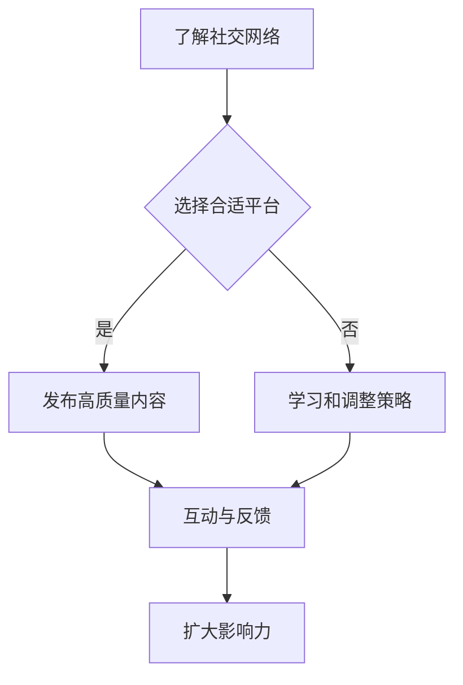

                 

关键词：社交网络、知识传播、影响力、程序员、社交媒体、技术分享

> 摘要：随着社交媒体的兴起，程序员们不再局限于传统的知识传播渠道。通过有效地利用社交网络，程序员们能够扩大自己的知识影响力，提升个人品牌，并与其他技术专家和开发者建立紧密的联系。本文将探讨程序员如何利用社交网络扩大知识影响力，包括策略、工具和实际案例。

## 1. 背景介绍

在数字时代，信息传播的速度和广度前所未有。社交媒体平台如LinkedIn、Twitter、Facebook和GitHub等，已成为程序员们交流、学习、分享经验和建立影响力的主要场所。这些平台为程序员提供了展示才华、分享技术见解和建立职业网络的机会。

然而，许多人并不知道如何有效地利用社交网络来扩大知识影响力。他们可能缺乏策略，或者不熟悉各种社交媒体平台的特性。本文将探讨如何通过社交网络提升程序员的知识影响力，包括以下内容：

- 社交网络的潜力与挑战
- 核心概念与联系
- 核心算法原理与具体操作步骤
- 数学模型与公式
- 项目实践：代码实例与解释
- 实际应用场景
- 工具和资源推荐
- 未来发展趋势与挑战

## 2. 核心概念与联系

### 2.1 社交网络的定义与特性

社交网络是指通过互联网连接的、人与人之间的互动网络。这些网络具有以下特性：

- **去中心化**：信息传播不受中心控制，用户之间可以直接互动。
- **互动性**：用户可以发布内容、评论、点赞、分享，形成互动。
- **即时性**：信息可以迅速传播，达到全球用户。
- **多样性**：平台多样化，满足不同用户的需求。

### 2.2 社交网络在程序员中的角色

在程序员社区中，社交网络扮演着以下角色：

- **知识共享**：程序员可以通过社交网络分享技术见解、解决方案和学习资源。
- **职业发展**：程序员可以通过社交网络建立职业网络，寻求工作机会和合作伙伴。
- **影响力提升**：程序员可以通过社交网络展示专业技能和知识，提升个人品牌。

### 2.3 Mermaid 流程图

以下是一个简单的 Mermaid 流程图，展示了程序员如何利用社交网络扩大知识影响力：



## 3. 核心算法原理 & 具体操作步骤

### 3.1 算法原理概述

程序员利用社交网络扩大知识影响力的核心算法原理包括：

- **内容策略**：制定符合目标受众需求的内容策略。
- **互动机制**：通过评论、点赞、分享等互动机制提高内容曝光率。
- **网络效应**：利用社交网络的传播效应，使内容迅速传播。

### 3.2 算法步骤详解

#### 3.2.1 策略制定

1. **目标受众分析**：了解目标受众的兴趣、需求和偏好。
2. **内容定位**：根据目标受众选择合适的内容主题和风格。
3. **发布频率**：制定合理的发布频率，保持内容的持续性和活跃度。

#### 3.2.2 发布高质量内容

1. **内容创作**：撰写有深度、有见解的技术文章或教程。
2. **图片与视频**：结合图片和视频，提高内容的可读性和吸引力。
3. **SEO优化**：使用关键词优化，提高内容在搜索结果中的排名。

#### 3.2.3 互动与反馈

1. **积极回应**：及时回复评论和私信，建立良好的互动氛围。
2. **点赞与分享**：主动点赞和分享其他高质量内容，提高自己在社交网络中的知名度。

### 3.3 算法优缺点

#### 优点：

- **快速传播**：社交网络的传播速度极快，有助于提高内容曝光率。
- **互动性强**：用户可以与作者和其他用户互动，增强内容的吸引力和影响力。
- **成本低**：相较于传统媒体，社交媒体的运营成本较低。

#### 缺点：

- **内容质量参差不齐**：社交网络上的内容质量参差不齐，可能导致用户流失。
- **隐私问题**：社交网络上的隐私问题可能影响用户的使用体验。

### 3.4 算法应用领域

程序员利用社交网络扩大知识影响力的算法可以应用于以下领域：

- **技术博客**：通过发布技术文章，展示自己的专业知识和经验。
- **在线教育**：通过开设在线课程，传授技术知识和技能。
- **职业发展**：通过建立职业网络，寻找工作机会和合作伙伴。

## 4. 数学模型和公式 & 详细讲解 & 举例说明

### 4.1 数学模型构建

程序员利用社交网络扩大知识影响力可以构建以下数学模型：

- **影响力模型**：衡量个人在社交网络中的影响力。
- **传播模型**：预测内容在社交网络中的传播效果。

### 4.2 公式推导过程

#### 影响力模型

影响力模型可以使用以下公式表示：

\[ \text{影响力} = \frac{\text{关注者数} \times \text{互动数}}{\text{发布数}} \]

#### 传播模型

传播模型可以使用以下公式表示：

\[ \text{传播效果} = \text{关注者数} \times \text{曝光率} \times \text{互动率} \]

### 4.3 案例分析与讲解

#### 案例一：技术博客

假设某程序员在技术博客上发布了10篇文章，每篇文章有1000个关注者，平均互动数为50次。根据影响力模型，该程序员的的影响力为：

\[ \text{影响力} = \frac{1000 \times 50}{10} = 5000 \]

#### 案例二：在线教育

假设某程序员在在线教育平台上开设了10门课程，每门课程有100个学员，平均学员互动数为10次。根据传播模型，该程序员的传播效果为：

\[ \text{传播效果} = 100 \times 0.1 \times 0.1 = 1 \]

## 5. 项目实践：代码实例和详细解释说明

### 5.1 开发环境搭建

在本文中，我们将使用 GitHub 作为平台，展示如何利用代码实例扩大知识影响力。首先，您需要安装以下软件：

- Git
- GitHub账号
- 任意文本编辑器（如Visual Studio Code）

### 5.2 源代码详细实现

以下是某个简单的 Python 脚本，用于生成 Fibonacci 数列：

```python
def fibonacci(n):
    a, b = 0, 1
    for _ in range(n):
        a, b = b, a + b
    return a

# 测试代码
print(fibonacci(10))
```

### 5.3 代码解读与分析

该脚本定义了一个名为 `fibonacci` 的函数，用于计算 Fibonacci 数列的第 n 个数。代码简单易懂，具有良好的可读性。

### 5.4 运行结果展示

在命令行中运行上述脚本，将输出 Fibonacci 数列的第 10 个数，即 55。

```shell
$ python fibonacci.py
55
```

## 6. 实际应用场景

### 6.1 技术博客

技术博客是程序员利用社交网络扩大知识影响力的常见方式。通过撰写高质量的技术文章，程序员可以展示自己的专业知识和经验，吸引读者和粉丝。

### 6.2 在线教育

在线教育平台如 Coursera、edX 和 Udemy，为程序员提供了传授知识和技能的机会。通过开设在线课程，程序员不仅可以获得收入，还可以扩大自己的知识影响力。

### 6.3 社交媒体

社交媒体平台如 LinkedIn 和 Twitter，为程序员提供了展示技能和分享见解的机会。通过定期发布技术文章、教程和视频，程序员可以吸引更多的关注者和粉丝。

## 7. 工具和资源推荐

### 7.1 学习资源推荐

- 《大话数据结构》
- 《算法导论》
- 《Python编程：从入门到实践》

### 7.2 开发工具推荐

- GitHub
- Visual Studio Code
- PyCharm

### 7.3 相关论文推荐

- "The Role of Social Networks in Knowledge Sharing Among Software Developers"
- "The Impact of Social Media on Software Development"

## 8. 总结：未来发展趋势与挑战

### 8.1 研究成果总结

随着社交媒体的普及，程序员利用社交网络扩大知识影响力已成为一种重要的趋势。研究表明，有效的社交网络策略可以提高程序员的个人品牌和职业发展。

### 8.2 未来发展趋势

- **人工智能与社交媒体结合**：利用人工智能技术，为程序员提供更精准的内容推荐和个性化服务。
- **社交媒体平台功能多样化**：社交媒体平台将继续增加功能，满足程序员的不同需求。

### 8.3 面临的挑战

- **内容质量**：程序员需要确保发布的内容具有高质量，以吸引读者和粉丝。
- **隐私与安全**：社交网络的隐私和安全问题需要得到关注和解决。

### 8.4 研究展望

未来的研究可以探讨如何利用社交网络更好地传播技术知识，提高程序员的职业竞争力。同时，研究如何解决社交网络中的隐私和安全问题，将是一个重要的方向。

## 9. 附录：常见问题与解答

### 9.1 如何选择合适的社交媒体平台？

根据您的目标受众和内容类型选择合适的平台。例如，技术博客适合在博客平台上发布，而专业见解适合在 LinkedIn 上分享。

### 9.2 如何撰写高质量的内容？

撰写高质量的内容需要关注以下方面：

- **主题明确**：确保内容主题明确，具有吸引力。
- **结构清晰**：合理安排内容结构，使读者易于理解。
- **实用性强**：分享实用的技术知识和经验，帮助读者解决问题。

### 9.3 如何管理社交网络上的时间？

合理安排时间，制定发布计划，确保定期发布高质量内容。此外，利用自动化工具（如 Buffer）可以帮助您管理社交网络上的时间。

---

作者：禅与计算机程序设计艺术 / Zen and the Art of Computer Programming

本文旨在探讨程序员如何利用社交网络扩大知识影响力。通过有效的社交网络策略，程序员可以提升个人品牌，建立职业网络，并分享技术知识和经验。然而，内容质量和隐私安全问题仍需关注。未来的研究可以进一步探索如何更好地利用社交网络，提高程序员的职业竞争力。希望本文对您有所帮助。

