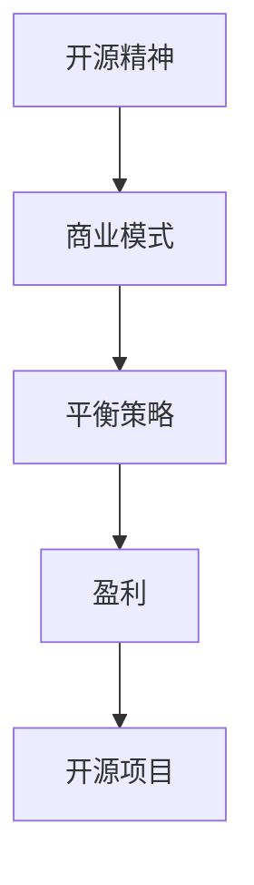

                 

在当今的技术浪潮中，开源项目已成为软件开发的支柱。无数程序员通过贡献代码，构建了一个又一个强大的开源生态系统。然而，开源并非免费的午餐，对于那些希望从中盈利的程序员来说，如何平衡开源的共享精神与商业利益，成为了关键问题。本文将探讨程序员如何将开源项目商业化，实现开源与盈利的平衡。

## 关键词

- 开源项目
- 商业化
- 盈利模式
- 平衡策略
- 程序员

## 摘要

本文将分析开源项目商业化的可行性和策略，探讨如何在不损害开源精神的前提下，通过合理的商业模式实现盈利。我们将从背景介绍、核心概念与联系、核心算法原理、数学模型、项目实践、实际应用场景、工具和资源推荐等方面，系统性地解答这一问题。

## 1. 背景介绍

开源软件（Open Source Software，简称OSS）的兴起，标志着软件开发的民主化和开放化。程序员们通过贡献代码，共同完善软件，使得软件的质量和功能不断提升。开源不仅促进了技术的创新，还大大降低了软件开发的门槛，使得更多的人能够参与其中。

然而，随着开源项目的成功，程序员们也面临着如何将其商业化的挑战。传统的商业模式往往难以适应开源项目的特点，如何在保持项目开源的同时，实现盈利，成为了一个亟待解决的问题。本文将探讨这一问题，提供一系列实用的策略和建议。

## 2. 核心概念与联系

在探讨开源项目商业化的过程中，我们需要理解几个核心概念：

### 2.1 开源精神

开源精神强调共享和合作，即程序员们自愿贡献代码，共同维护和改进项目。这种精神是开源项目的基石，也是开源与盈利平衡的关键。

### 2.2 商业模式

商业模式是指企业通过何种方式盈利的方案。对于开源项目来说，商业模式需要兼顾开源精神，同时实现盈利。

### 2.3 平衡策略

平衡策略是指如何在开源与盈利之间找到一个合适的点，使得两者都能得到满足。这需要程序员们深入思考，灵活运用各种策略。

为了更好地理解这些概念之间的关系，我们可以使用Mermaid绘制一个简单的流程图：



在这个流程图中，开源精神是起点，通过商业模式和平衡策略，最终实现盈利，从而推动开源项目的发展。

## 3. 核心算法原理 & 具体操作步骤

### 3.1 算法原理概述

开源项目的商业化，本质上是一个资源整合和优化的问题。程序员们需要通过一系列策略，将开源项目转化为商业价值。

### 3.2 算法步骤详解

#### 步骤1：确定商业目标

首先，程序员需要明确项目的商业目标。这包括项目的市场定位、目标用户群体、盈利模式等。

#### 步骤2：构建商业模式

根据商业目标，程序员需要设计一个合适的商业模式。常见的商业模式包括服务收费、增值服务、赞助等。

#### 步骤3：平衡开源与盈利

在构建商业模式的过程中，程序员需要平衡开源与盈利。这可以通过优化代码质量、提供专业支持、保持社区活力等方式实现。

#### 步骤4：持续改进与优化

商业化并非一劳永逸的过程。程序员需要不断收集用户反馈，优化产品和服务，提高盈利能力。

### 3.3 算法优缺点

#### 优点：

- 提高项目的可持续性，保障项目的长期发展。
- 通过盈利，为社区贡献者提供回报，激励更多程序员参与。
- 提升项目的市场竞争力，吸引更多用户。

#### 缺点：

- 可能会引发社区成员的质疑，影响项目的开源精神。
- 需要程序员具备商业头脑，否则难以实现盈利。

### 3.4 算法应用领域

开源项目商业化的算法可以应用于各种开源项目，包括但不限于：

- 软件开发框架
- 数据库管理系统
- 开源操作系统
- 开源编程语言

## 4. 数学模型和公式 & 详细讲解 & 举例说明

### 4.1 数学模型构建

为了更好地理解开源项目商业化的数学模型，我们可以构建以下模型：

- \(P = R \times (1 - C)\)
  - \(P\)：盈利
  - \(R\)：收入
  - \(C\)：成本

在这个模型中，盈利等于收入减去成本。收入来源于各种商业模式，如服务收费、增值服务等。成本包括开发成本、维护成本等。

### 4.2 公式推导过程

- 收入 \(R\) 的计算公式：
  - \(R = Q \times P_{unit}\)
    - \(Q\)：销售量
    - \(P_{unit}\)：单价

- 成本 \(C\) 的计算公式：
  - \(C = C_{dev} + C_{maint}\)
    - \(C_{dev}\)：开发成本
    - \(C_{maint}\)：维护成本

- 盈利 \(P\) 的计算公式：
  - \(P = R - C\)

### 4.3 案例分析与讲解

假设一个开源项目通过服务收费实现盈利。项目开发者预计每月能够吸引1000名用户，每人每月收费10美元。开发成本和维护成本总计为每月5000美元。

- 收入 \(R\)：
  - \(R = 1000 \times 10 = 10000\)美元/月

- 成本 \(C\)：
  - \(C = C_{dev} + C_{maint} = 5000\)美元/月

- 盈利 \(P\)：
  - \(P = R - C = 10000 - 5000 = 5000\)美元/月

通过这个案例，我们可以看到，开源项目商业化的关键在于合理控制成本，提高收入。这需要程序员具备商业头脑，不断优化产品和服务。

## 5. 项目实践：代码实例和详细解释说明

### 5.1 开发环境搭建

为了更好地理解开源项目商业化的实践，我们将使用一个简单的例子。这个例子是一个基于Python的开源项目，通过提供API服务实现盈利。

首先，我们需要搭建一个Python开发环境。以下是步骤：

1. 安装Python
2. 安装必要的Python库，如Flask、SQLAlchemy等

### 5.2 源代码详细实现

以下是项目的源代码示例：

```python
from flask import Flask, request, jsonify
from sqlalchemy import create_engine
from models import User

app = Flask(__name__)

# 配置数据库连接
engine = create_engine('sqlite:///users.db')

# 创建表
with engine.connect() as connection:
    connection.execute('''
        CREATE TABLE IF NOT EXISTS users (
            id INTEGER PRIMARY KEY,
            name TEXT,
            email TEXT UNIQUE
        )
    ''')

# 添加用户
@app.route('/users', methods=['POST'])
def add_user():
    data = request.json
    user = User(name=data['name'], email=data['email'])
    user.save()
    return jsonify(user.to_dict()), 201

# 查询用户
@app.route('/users/<int:user_id>', methods=['GET'])
def get_user(user_id):
    user = User.get_by_id(user_id)
    if user:
        return jsonify(user.to_dict()), 200
    else:
        return jsonify({'error': 'User not found'}), 404

if __name__ == '__main__':
    app.run(debug=True)
```

### 5.3 代码解读与分析

这段代码使用了Flask框架，通过简单的RESTful API，实现了用户的添加和查询功能。以下是关键部分解读：

- 数据库连接：使用SQLAlchemy创建数据库连接，并创建用户表。
- 添加用户：接收POST请求，将用户数据存储到数据库。
- 查询用户：接收GET请求，根据用户ID查询用户信息。

### 5.4 运行结果展示

1. 启动服务器：

```shell
$ python app.py
```

2. 使用curl命令测试API：

```shell
$ curl -X POST -H "Content-Type: application/json" -d '{"name": "Alice", "email": "alice@example.com"}' http://localhost:5000/users
```

返回结果：

```json
{
  "id": 1,
  "name": "Alice",
  "email": "alice@example.com"
}
```

3. 查询用户：

```shell
$ curl -X GET http://localhost:5000/users/1
```

返回结果：

```json
{
  "id": 1,
  "name": "Alice",
  "email": "alice@example.com"
}
```

## 6. 实际应用场景

开源项目商业化的应用场景非常广泛，以下是一些典型的例子：

### 6.1 软件开发框架

例如，Django和Flask等开源Web开发框架，通过提供专业支持和定制服务实现盈利。

### 6.2 数据库管理系统

MySQL和PostgreSQL等开源数据库系统，通过提供商业版，增加高级功能，实现盈利。

### 6.3 开源操作系统

Linux操作系统，通过提供商业支持和定制服务，吸引企业用户。

### 6.4 开源编程语言

Python和Java等开源编程语言，通过提供书籍、课程等教学资源实现盈利。

## 7. 工具和资源推荐

### 7.1 学习资源推荐

- 《开源之道》（Open Source Leadership）
- 《创业维艰》（Hard Things About Hard Things）
- 《精益创业》（The Lean Startup）

### 7.2 开发工具推荐

- GitHub：开源代码托管平台
- GitLab：自建代码仓库
- JIRA：项目管理工具

### 7.3 相关论文推荐

- "Open Source Software: The Model of the Future" by Linus Torvalds
- "The Cathedral and the Bazaar" by Eric S. Raymond

## 8. 总结：未来发展趋势与挑战

### 8.1 研究成果总结

开源项目商业化的研究成果表明，通过合理的商业模式，程序员可以在保持开源精神的前提下，实现盈利。同时，开源项目也为程序员提供了广阔的发展空间。

### 8.2 未来发展趋势

随着技术的不断进步，开源项目商业化的趋势将愈发明显。程序员需要具备商业头脑，灵活运用各种策略，实现开源与盈利的平衡。

### 8.3 面临的挑战

- 如何平衡开源精神与商业利益
- 如何确保开源项目的长期可持续性
- 如何处理商业与社区的冲突

### 8.4 研究展望

未来，开源项目商业化将迎来更多的创新和机遇。程序员需要不断探索新的商业模式，推动开源项目的发展。

## 9. 附录：常见问题与解答

### 9.1 开源项目商业化是否合法？

开源项目商业化在法律上是合法的。关键在于遵守开源协议，确保商业行为不违反开源协议的规定。

### 9.2 如何处理商业与社区的冲突？

程序员需要建立良好的沟通机制，积极倾听社区反馈，确保商业行为符合社区期望。同时，保持项目的开源精神，确保社区的积极参与。

### 9.3 如何确保开源项目的长期可持续性？

确保开源项目的长期可持续性，需要从以下几个方面入手：

- 提供高质量的技术支持
- 持续优化代码质量
- 保持社区的活跃度
- 合理规划项目发展方向

通过上述措施，开源项目可以实现长期可持续性，为程序员和社区带来持续的收益。

## 作者署名

本文作者：禅与计算机程序设计艺术 / Zen and the Art of Computer Programming

----------------------------------------------------------------

以上就是本文的完整内容，希望能为程序员在开源项目商业化道路上提供一些启示和帮助。在开源与盈利的平衡中，找到适合自己的路径，是每位程序员都需要面对的课题。希望这篇文章能够引发您的思考，为您带来新的收获。

