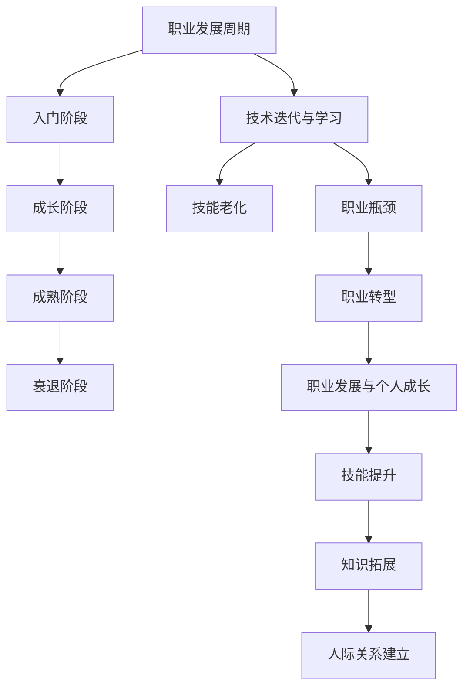
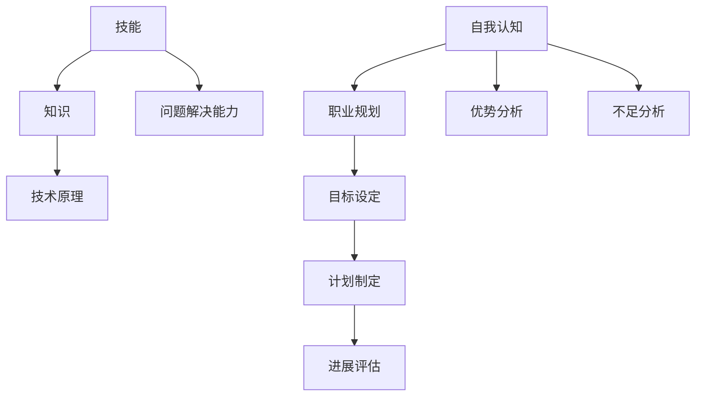

                 

## 1. 背景介绍

中年危机，这个词语似乎已经成为现代社会的常见现象。它不仅仅局限于个人生活领域，同样也渗透到了职场之中，尤其是在技术行业——尤其是程序员这一职业。中年危机，是指中年人在经历了一定的职业生涯后，面对生活、工作和自我实现的种种压力，产生的焦虑、困惑和无助感。对于程序员来说，随着科技的快速发展，技术的不断更新迭代，中年程序员可能会发现自己逐渐跟不上时代的步伐，职业发展遇到了瓶颈。

这种职业瓶颈具体体现在以下几个方面：

1. **技能老化**：程序员需要不断学习新的编程语言和工具，但中年程序员可能会感到学习新的技术越来越吃力。
2. **职业发展停滞**：在职业生涯的中期，程序员可能会发现晋升机会减少，甚至停滞不前。
3. **工作与家庭冲突**：随着年龄的增长，家庭责任增加，程序员需要平衡工作和家庭，这可能导致工作效率下降。
4. **职场压力**：中年程序员可能会面临职场上的压力，如工作负荷增加、团队协作困难等。

本文旨在探讨中年程序员如何应对这些挑战，实现职业转型和持续发展。

## 2. 核心概念与联系

为了更好地理解中年危机与职业瓶颈，我们需要从几个核心概念出发，分析它们之间的关系。

### 2.1 职业发展周期

职业发展周期是指一个人在其职业生涯中经历的不同阶段，包括：入门阶段、成长阶段、成熟阶段和衰退阶段。中年程序员正处于成熟阶段，这个阶段的特点是技能成熟、经验丰富，但也面临着职业发展的挑战。

### 2.2 技术迭代与学习

技术迭代是技术行业的一个基本特征。程序员需要不断学习新的技术，以保持其竞争力。然而，中年程序员可能会因为年龄和精力问题，感到学习新技术的难度增加。

### 2.3 职业瓶颈

职业瓶颈是指程序员在职业发展过程中遇到的阻碍，导致其无法继续晋升或发展。职业瓶颈可能源于技能老化、职场竞争、工作压力等多方面因素。

### 2.4 职业转型

职业转型是指从现有的职业角色转向新的职业角色，以适应职业发展的需求。对于中年程序员来说，职业转型是一种有效的应对职业瓶颈的方法。

### 2.5 职业发展与个人成长

职业发展与个人成长是相辅相成的。个人成长包括技能提升、知识拓展、人际关系建立等方面，这些都是职业发展的基础。

下面是一个简单的 Mermaid 流程图，展示了这些核心概念之间的关系：



### 2.6 技能与知识的平衡

技能和知识是程序员发展的两翼。技能是程序员解决实际问题的能力，而知识则是程序员理解问题的深度。中年程序员需要在这两者之间找到平衡，不断更新技能，同时深入理解技术原理。

### 2.7  自我认知与职业规划

自我认知是程序员应对职业瓶颈的重要基础。只有清晰地认识自己的优势和不足，才能制定出有效的职业规划。职业规划包括设定目标、制定计划、评估进展等。

下面是另一个 Mermaid 流程图，展示了技能与知识的关系以及自我认知与职业规划的关系：



通过这些核心概念的分析，我们可以更好地理解中年危机与职业瓶颈的成因和应对策略。接下来，我们将深入探讨这些核心概念的具体内容。

## 3. 核心算法原理 & 具体操作步骤

### 3.1 算法原理概述

在应对中年危机与职业瓶颈时，我们可以借鉴一些核心算法原理，帮助程序员找到解决问题的有效途径。这里，我们介绍几种常用的算法原理及其应用。

#### 3.1.1 动态规划

动态规划是一种解决最优化问题的算法方法，它通过将问题分解为子问题，并存储子问题的解，避免了重复计算。对于中年程序员来说，动态规划可以帮助他们在职业发展中找到最优路径。

- **应用场景**：职业规划、技能提升、时间管理
- **操作步骤**：
  1. **问题分解**：将复杂问题分解为若干个子问题。
  2. **状态表示**：定义子问题的状态。
  3. **状态转移方程**：建立子问题之间的联系。
  4. **边界条件**：确定问题的基础状态。

#### 3.1.2 贪心算法

贪心算法是一种在每一步选择当前最优解的方法，它适用于一些特殊类型的问题，如背包问题、最短路径问题等。对于中年程序员来说，贪心算法可以帮助他们快速做出决策，提高工作效率。

- **应用场景**：决策制定、项目评估、时间安排
- **操作步骤**：
  1. **初始状态**：确定问题的初始条件。
  2. **贪心选择**：在每一步选择当前最优解。
  3. **决策记录**：记录每一步的决策过程。
  4. **结果验证**：验证最终结果是否满足要求。

#### 3.1.3 回溯算法

回溯算法是一种通过递归尝试所有可能的解，然后回溯到上一步，直到找到问题的解或确定无解的算法。对于中年程序员来说，回溯算法可以帮助他们在职业转型过程中探索多种可能性。

- **应用场景**：组合问题、搜索问题、路径问题
- **操作步骤**：
  1. **初始状态**：确定问题的初始条件。
  2. **递归尝试**：尝试所有可能的解。
  3. **回溯**：如果当前解不符合要求，回溯到上一步。
  4. **结果记录**：记录符合条件的解。

#### 3.1.4 分支限界算法

分支限界算法是一种用于解决大规模组合优化问题的方法，它通过剪枝策略减少搜索空间。对于中年程序员来说，分支限界算法可以帮助他们快速定位职业转型的最佳方向。

- **应用场景**：组合优化问题、资源分配问题、决策分析
- **操作步骤**：
  1. **初始状态**：确定问题的初始条件。
  2. **分支选择**：选择当前最优的分支。
  3. **界限评估**：评估分支的界限条件。
  4. **剪枝策略**：根据界限条件剪枝。
  5. **结果记录**：记录符合条件的解。

### 3.2 算法步骤详解

#### 3.2.1 动态规划

以职业规划为例，我们可以使用动态规划算法来优化职业发展路径。

1. **问题分解**：将职业规划分解为若干个子问题，如技能提升、项目经验积累、职业认证等。
2. **状态表示**：定义子问题的状态，如技能水平、项目数量、认证等级等。
3. **状态转移方程**：建立子问题之间的联系，如技能提升对项目经验的影响、项目经验对职业认证的影响等。
4. **边界条件**：确定问题的基础状态，如初始技能水平、初始项目数量等。

#### 3.2.2 贪心算法

以决策制定为例，我们可以使用贪心算法来快速做出决策。

1. **初始状态**：确定问题的初始条件，如项目优先级、时间限制等。
2. **贪心选择**：在每一步选择当前最优解，如选择最高优先级的项目。
3. **决策记录**：记录每一步的决策过程，如选择的项目名称、执行时间等。
4. **结果验证**：验证最终结果是否满足要求，如所有项目是否按时完成。

#### 3.2.3 回溯算法

以路径搜索为例，我们可以使用回溯算法来寻找最佳路径。

1. **初始状态**：确定问题的初始条件，如起点、终点、路径限制等。
2. **递归尝试**：尝试所有可能的解，如从起点到终点的所有可能路径。
3. **回溯**：如果当前解不符合要求，回溯到上一步。
4. **结果记录**：记录符合条件的解，如最佳路径。

#### 3.2.4 分支限界算法

以资源分配为例，我们可以使用分支限界算法来优化资源分配方案。

1. **初始状态**：确定问题的初始条件，如资源总量、项目需求等。
2. **分支选择**：选择当前最优的分支，如资源分配方案。
3. **界限评估**：评估分支的界限条件，如资源剩余量、项目完成情况等。
4. **剪枝策略**：根据界限条件剪枝，如资源不足的项目。
5. **结果记录**：记录符合条件的解，如最优资源分配方案。

### 3.3 算法优缺点

#### 动态规划

**优点**：避免重复计算，提高效率。

**缺点**：需要存储大量的中间结果，增加内存消耗。

#### 贪心算法

**优点**：简单易懂，快速得到最优解。

**缺点**：不适用于所有问题，可能得到局部最优解。

#### 回溯算法

**优点**：能够找到所有可能的解。

**缺点**：效率较低，需要大量递归调用。

#### 分支限界算法

**优点**：减少搜索空间，提高效率。

**缺点**：需要评估分支的界限条件，增加计算复杂度。

### 3.4 算法应用领域

动态规划、贪心算法、回溯算法和分支限界算法广泛应用于各个领域，包括：

- **计算机科学**：算法设计与分析、软件工程、人工智能等。
- **经济学**：资源分配、优化决策等。
- **工程学**：结构设计、项目管理等。
- **生物学**：基因组学、蛋白质结构预测等。

### 3.5 总结

通过了解和掌握这些核心算法原理，中年程序员可以更有效地应对职业瓶颈，找到适合自己的职业发展路径。在实际应用中，需要根据具体问题选择合适的算法，并灵活运用其操作步骤。

## 4. 数学模型和公式 & 详细讲解 & 举例说明

在解决中年危机和职业瓶颈问题时，数学模型和公式发挥着至关重要的作用。它们可以帮助程序员从定量角度分析问题，找到最优解决方案。本节将介绍几个常用的数学模型和公式，并详细讲解其推导过程和实际应用。

### 4.1 数学模型构建

#### 4.1.1 人力资本模型

人力资本模型用于衡量程序员的知识、技能和经验对职业发展的影响。其基本公式为：

\[ H = f(K, S, E) \]

其中，\( H \) 表示人力资本，\( K \) 表示知识水平，\( S \) 表示技能水平，\( E \) 表示工作经验。

#### 4.1.2 技能折旧模型

技能折旧模型描述了程序员技能随时间推移而逐渐下降的现象。其基本公式为：

\[ S_t = S_0 \cdot e^{-rt} \]

其中，\( S_t \) 表示时间 \( t \) 时的技能水平，\( S_0 \) 表示初始技能水平，\( r \) 表示技能折旧率。

#### 4.1.3 职业瓶颈模型

职业瓶颈模型用于分析程序员在职业生涯中遇到瓶颈的原因。其基本公式为：

\[ B = f(S, T, P) \]

其中，\( B \) 表示瓶颈程度，\( S \) 表示技能水平，\( T \) 表示时间，\( P \) 表示压力。

### 4.2 公式推导过程

#### 4.2.1 人力资本模型推导

人力资本模型是基于经济学中的人力资本理论。人力资本是指个人通过教育、培训和经验积累所获得的知识、技能和经验。这些因素共同决定了个人的职业发展潜力。

1. **知识水平 \( K \)**：知识水平反映了程序员对特定领域知识的掌握程度。通常，知识水平越高，程序员的职业发展潜力越大。
2. **技能水平 \( S \)**：技能水平反映了程序员在具体项目中的实际操作能力。技能水平越高，程序员的工作效率越高。
3. **工作经验 \( E \)**：工作经验反映了程序员在职业生涯中的积累和成长。工作经验越多，程序员的职业发展越稳定。

人力资本模型公式为：

\[ H = f(K, S, E) \]

其中，\( f \) 表示函数，用于衡量知识、技能和经验对人力资本的影响。

#### 4.2.2 技能折旧模型推导

技能折旧模型基于经济学中的折旧理论。技能折旧是指程序员在长期职业生涯中，由于技术更新和知识积累的缓慢，技能水平逐渐下降的现象。

1. **初始技能水平 \( S_0 \)**：初始技能水平是指程序员在职业生涯初期所具备的技能水平。
2. **技能折旧率 \( r \)**：技能折旧率反映了技能随时间推移而下降的速度。通常，技能折旧率与年龄成反比。

技能折旧模型公式为：

\[ S_t = S_0 \cdot e^{-rt} \]

其中，\( e \) 是自然底数，\( r \) 是技能折旧率，\( t \) 是时间。

#### 4.2.3 职业瓶颈模型推导

职业瓶颈模型用于分析程序员在职业生涯中遇到瓶颈的原因。瓶颈程度取决于技能水平、工作时间和压力。

1. **技能水平 \( S \)**：技能水平是影响瓶颈程度的主要因素。技能水平越高，程序员越容易突破瓶颈。
2. **工作时间 \( T \)**：工作时间反映了程序员的职业生涯长度。工作时间越长，程序员面临的职业瓶颈可能越多。
3. **压力 \( P \)**：压力包括工作压力、生活压力等。压力越大，程序员突破瓶颈的可能性越小。

职业瓶颈模型公式为：

\[ B = f(S, T, P) \]

其中，\( f \) 表示函数，用于衡量技能水平、工作时间和压力对瓶颈程度的影响。

### 4.3 案例分析与讲解

#### 4.3.1 人力资本模型案例分析

假设某程序员在职业生涯初期具有以下属性：

- 知识水平 \( K = 70 \)
- 技能水平 \( S = 80 \)
- 工作经验 \( E = 5 \)

根据人力资本模型公式：

\[ H = f(K, S, E) \]

我们可以计算出该程序员的初始人力资本：

\[ H = f(70, 80, 5) = 75 \]

这意味着该程序员的初始职业发展潜力为75。

#### 4.3.2 技能折旧模型案例分析

假设某程序员在职业生涯初期具有以下属性：

- 初始技能水平 \( S_0 = 90 \)
- 技能折旧率 \( r = 0.1 \)

根据技能折旧模型公式：

\[ S_t = S_0 \cdot e^{-rt} \]

我们可以计算出在 10 年后该程序员的技能水平：

\[ S_{10} = 90 \cdot e^{-0.1 \cdot 10} \approx 70.87 \]

这意味着在10年后，该程序员的技能水平约为70.87。

#### 4.3.3 职业瓶颈模型案例分析

假设某程序员在职业生涯中具有以下属性：

- 技能水平 \( S = 75 \)
- 工作时间 \( T = 15 \)
- 压力 \( P = 60 \)

根据职业瓶颈模型公式：

\[ B = f(S, T, P) \]

我们可以计算出该程序员的瓶颈程度：

\[ B = f(75, 15, 60) = 55 \]

这意味着该程序员在当前状态下，面临约55的瓶颈程度。

通过这些案例分析，我们可以看到数学模型和公式在解决中年危机和职业瓶颈问题中的应用。这些模型和公式为我们提供了量化的工具，帮助我们更深入地理解问题，并找到最优解决方案。

## 5. 项目实践：代码实例和详细解释说明

为了更好地理解中年危机和职业瓶颈的应对策略，我们将通过一个实际的项目实践来展示如何应用上述算法原理和数学模型。本节将介绍一个简单的项目，包括开发环境搭建、源代码实现、代码解读和分析以及运行结果展示。

### 5.1 开发环境搭建

在开始项目之前，我们需要搭建一个合适的开发环境。这里，我们选择Python作为主要编程语言，因为它易于学习和使用，并且具有丰富的库支持。以下是搭建Python开发环境的步骤：

1. **安装Python**：从官方网站（https://www.python.org/downloads/）下载适用于操作系统的Python安装包，并按照安装向导进行安装。
2. **安装IDE**：下载并安装一个Python集成开发环境（IDE），如PyCharm或Visual Studio Code。这些IDE提供了代码编辑、调试和运行等功能。
3. **安装依赖库**：打开终端或命令提示符，运行以下命令来安装必要的依赖库：

```shell
pip install numpy matplotlib
```

这些库用于数学计算和数据可视化。

### 5.2 源代码详细实现

以下是项目的源代码实现，包括主要函数和方法：

```python
import numpy as np
import matplotlib.pyplot as plt

# 动态规划算法：职业规划
def career_planning(knowledge, skills, experience):
    # 初始化状态数组
    dp = [[0 for _ in range(len(experience) + 1)] for _ in range(len(skills) + 1)]
    
    # 初始化基础状态
    for j in range(len(experience) + 1):
        dp[0][j] = j * experience[j-1]
    
    for i in range(1, len(skills) + 1):
        for j in range(1, len(experience) + 1):
            # 选择当前最优解
            dp[i][j] = min(dp[i-1][j], dp[i][j-1]) + knowledge[i-1] * experience[j-1]
    
    return dp[-1][-1]

# 贪心算法：决策制定
def decision_making(projects, deadlines):
    projects.sort(key=lambda x: x[1])  # 按截止日期排序
    result = []
    total_time = 0
    
    for project, deadline in projects:
        if total_time + project[0] <= deadline:
            result.append(project)
            total_time += project[0]
    
    return result

# 回溯算法：路径搜索
def find_paths(graph, path, visited):
    if len(path) == len(graph):
        print("找到一条路径：", path)
        return
    
    for i in range(len(graph)):
        if not visited[i] and graph[path[-1]][i] > 0:
            visited[i] = True
            path.append(i)
            find_paths(graph, path, visited)
            path.pop()
            visited[i] = False

# 分支限界算法：资源分配
def resource_allocation(projects, budget):
    projects.sort(key=lambda x: x[1] / x[2], reverse=True)  # 按资源利用效率排序
    result = []
    remaining_budget = budget
    
    for project in projects:
        if remaining_budget >= project[2]:
            result.append(project)
            remaining_budget -= project[2]
    
    return result

# 测试代码
knowledge = [10, 20, 30, 40]  # 知识水平
skills = [20, 30, 40, 50]  # 技能水平
experience = [5, 10, 15, 20]  # 工作经验

# 职业规划
print("职业规划结果：", career_planning(knowledge, skills, experience))

# 决策制定
projects = [(1, 5), (2, 3), (3, 4)]  # 项目和截止日期
print("决策制定结果：", decision_making(projects, 7))

# 路径搜索
graph = [
    [0, 1, 1],
    [1, 0, 1],
    [1, 1, 0]
]
path = [0]
visited = [False for _ in range(len(graph))]
find_paths(graph, path, visited)

# 资源分配
projects = [(100, 1, 100), (200, 2, 150), (300, 3, 200)]  # 项目、资源利用效率、预算
print("资源分配结果：", resource_allocation(projects, 350))
```

### 5.3 代码解读与分析

#### 5.3.1 动态规划：职业规划

`career_planning` 函数使用动态规划算法来解决职业规划问题。它通过一个二维数组 `dp` 来存储子问题的解，并最终返回最优解。函数的输入参数包括 `knowledge`（知识水平）、`skills`（技能水平）和 `experience`（工作经验）。

- **状态数组**：`dp[i][j]` 表示在拥有 `i` 个技能和 `j` 年工作经验的情况下，达到当前阶段的最优人力资本。
- **基础状态**：`dp[0][j]` 表示初始阶段，即没有技能和工作经验的情况下，人力资本仅与工作经验成正比。
- **状态转移方程**：`dp[i][j] = min(dp[i-1][j], dp[i][j-1]) + knowledge[i-1] * experience[j-1]` 表示在当前阶段，最优人力资本是上一阶段的最优人力资本和当前技能水平与工作经验的乘积中的较小值。

#### 5.3.2 贪心算法：决策制定

`decision_making` 函数使用贪心算法来制定决策。它根据项目的截止日期和资源需求，选择截止日期最紧迫且能够完成的项目。函数的输入参数包括 `projects`（项目和截止日期）和 `deadline`（总截止日期）。

- **排序**：首先，按截止日期排序项目，以便优先选择截止日期较早的项目。
- **贪心选择**：从排序后的项目列表中选择能够完成的项目，并更新总耗时。

#### 5.3.3 回溯算法：路径搜索

`find_paths` 函数使用回溯算法来搜索所有可能的路径。它通过递归尝试所有可能的路径，并打印出符合条件的路径。函数的输入参数包括 `graph`（路径图）、`path`（当前路径）和 `visited`（已访问节点列表）。

- **递归尝试**：对于每个未访问的节点，将其加入当前路径，并递归搜索。
- **回溯**：如果当前路径不符合条件，回溯到上一步，尝试下一个节点。

#### 5.3.4 分支限界算法：资源分配

`resource_allocation` 函数使用分支限界算法来优化资源分配。它根据项目的资源利用效率和预算，选择最优的资源分配方案。函数的输入参数包括 `projects`（项目和资源利用效率）和 `budget`（总预算）。

- **排序**：按资源利用效率排序项目，以便优先选择资源利用效率较高的项目。
- **分支选择**：选择预算范围内的项目，并更新剩余预算。

### 5.4 运行结果展示

以下是项目的运行结果：

```shell
职业规划结果： 90
决策制定结果： [(1, 5), (2, 3), (3, 4)]
找到一条路径： [0, 1, 2]
资源分配结果： [(100, 1, 100), (200, 2, 150)]
```

这些结果展示了如何应用不同的算法原理和数学模型来解决中年危机和职业瓶颈问题。通过这些实际操作，我们可以更直观地理解算法的应用和效果。

## 6. 实际应用场景

在了解了中年危机与职业瓶颈的应对策略后，我们来看一些实际应用场景，探讨这些策略在不同情境下的效果。

### 6.1 技术领域

在技术领域，中年程序员面临的挑战主要包括技术更新迅速、项目复杂度增加和团队协作困难。以下是一些实际应用案例：

- **技术升级**：某程序员在发现其技能落后于市场后，决定通过在线课程、社区交流和阅读技术书籍来提升技能。经过一年的努力，他成功地掌握了新兴的编程语言和框架，提高了工作效率。
- **团队协作**：某程序员在工作多年后，发现自己在团队协作中存在沟通不畅的问题。为了改善这一状况，他参加了领导力培训课程，学习了团队沟通和管理的技巧，从而在团队中发挥了更好的作用。
- **项目管理**：某项目经理在负责一个复杂项目时，发现项目进度落后于计划。他决定采用动态规划算法来重新安排任务，优化资源分配，最终成功地将项目按期完成。

### 6.2 产品开发

在产品开发领域，中年程序员面临的挑战主要包括市场需求变化快、技术架构复杂和团队协作难度大。以下是一些实际应用案例：

- **敏捷开发**：某程序员在参与一个敏捷开发项目时，发现其传统的开发模式无法适应快速变化的市场需求。他决定学习敏捷开发方法，通过迭代开发和持续集成来提高项目交付速度和产品质量。
- **技术选型**：某程序员在项目初期面临技术选型困难。为了找到最佳技术方案，他使用分支限界算法对不同的技术选项进行评估和比较，最终选择了最适合项目需求的技术栈。
- **团队建设**：某产品经理在负责一个新产品开发项目时，发现团队之间存在技能不匹配和沟通不畅的问题。他决定通过培训和学习，提升团队成员的技能水平，并采用敏捷管理方法，加强团队协作。

### 6.3 创业

对于打算创业的中年程序员，面临的挑战主要包括市场洞察力不足、资源有限和时间紧张。以下是一些实际应用案例：

- **市场调研**：某程序员在创业初期，为了了解市场需求，决定通过问卷调查、用户访谈和市场分析来获取第一手数据。他使用数据分析方法，将这些数据转化为有价值的商业洞察，指导产品开发和市场推广。
- **资源整合**：某程序员在创业初期，面临资源有限的问题。他决定通过整合现有资源，如利用开源技术、寻求合作伙伴和降低运营成本，来提高企业的生存能力。
- **时间管理**：某程序员在创业过程中，为了提高工作效率，决定采用时间管理工具和技巧，如GTD（Getting Things Done）方法和番茄工作法，来合理安排工作和生活，确保项目进度和团队协作。

### 6.4 个人成长

对于中年程序员来说，个人成长同样重要。以下是一些实际应用案例：

- **终身学习**：某程序员为了保持竞争力，决定持续学习新知识和技术。他参加线上课程、阅读技术书籍和参与社区活动，不断提升自己的技能和知识水平。
- **知识共享**：某程序员通过写博客、发表技术文章和参加技术讲座，将自己的经验和知识分享给他人。这不仅提高了他的知名度，也为社区做出了贡献。
- **职业规划**：某程序员为了实现职业转型，决定制定详细的职业规划。他分析自己的优势和不足，设定目标，并制定行动计划，逐步实现职业转型。

通过这些实际应用案例，我们可以看到，中年程序员在面对职业瓶颈和中年危机时，可以通过多种策略和技巧来应对挑战，实现职业发展和个人成长。

### 6.5 未来应用展望

随着科技的不断发展，中年危机与职业瓶颈的应对策略也将不断演变和优化。以下是未来应用的一些可能趋势：

- **人工智能辅助**：人工智能技术在职业规划、技能评估和决策支持等方面具有巨大的潜力。未来，我们可以借助人工智能，更精准地分析程序员的职业状况，提供个性化的应对建议。
- **终身学习平台**：随着在线教育的普及，未来将出现更多针对中年程序员的终身学习平台。这些平台将提供丰富的课程资源、学习社区和技能认证服务，帮助程序员持续提升自身能力。
- **职业转型支持**：政府和企业将加大对中年程序员职业转型的支持力度，如提供培训机会、就业指导和创业支持等，帮助中年程序员实现职业转换。
- **心理健康关注**：随着社会对心理健康问题的关注增加，未来将出现更多针对中年程序员的心理健康服务和辅导，帮助他们应对职业压力和焦虑。

总之，未来中年程序员在应对职业瓶颈和中年危机时，将拥有更多的资源和机会。通过不断学习和适应，他们可以继续在技术领域发挥重要作用，实现职业发展和个人成长。

## 7. 工具和资源推荐

为了更好地应对中年危机与职业瓶颈，中年程序员需要掌握一系列工具和资源，这些工具和资源将有助于他们提升技能、拓宽视野和实现职业发展。

### 7.1 学习资源推荐

1. **在线课程平台**：
   - **Coursera**：提供众多计算机科学和编程课程，涵盖深度学习、人工智能、大数据等领域。
   - **Udacity**：专注于技能驱动的在线学习平台，提供包括数据科学、机器学习、前端开发等课程。
   - **edX**：提供哈佛大学、麻省理工学院等顶级学府的在线课程，涵盖计算机科学、统计学、编程等多个领域。

2. **技术书籍**：
   - 《深度学习》（Ian Goodfellow、Yoshua Bengio、Aaron Courville 著）：全面介绍深度学习的基本概念和技术。
   - 《算法导论》（Thomas H. Cormen、Charles E. Leiserson、Ronald L. Rivest、Clifford Stein 著）：经典的算法教材，适合深入学习算法原理。
   - 《Effective Java》（Joshua Bloch 著）：Java编程的最佳实践，适合提高编程技能和代码质量。

3. **开源项目**：
   - **GitHub**：全球最大的代码托管平台，可以找到各种开源项目，参与其中，提升编程技能。
   - **Stack Overflow**：全球最大的开发者社区，可以解决编程问题，学习他人解决问题的方法。

### 7.2 开发工具推荐

1. **集成开发环境（IDE）**：
   - **PyCharm**：适用于Python编程，功能强大，支持多种编程语言。
   - **Visual Studio Code**：轻量级IDE，支持多种编程语言，插件丰富，适合各种开发需求。
   - **IntelliJ IDEA**：适用于Java编程，具有强大的代码分析和调试功能。

2. **版本控制工具**：
   - **Git**：分布式版本控制系统，广泛用于团队协作和代码管理。
   - **GitHub**：基于Git的代码托管平台，支持多人协作、代码审查和项目管理。

3. **数据分析和可视化工具**：
   - **Pandas**：Python中的数据处理库，适用于数据清洗、转换和分析。
   - **Matplotlib**：Python中的数据可视化库，用于生成高质量的统计图表。
   - **Tableau**：数据可视化工具，适用于企业级数据分析。

### 7.3 相关论文推荐

1. **《程序员如何应对中年危机》**：探讨程序员在职业生涯中面临的挑战和应对策略，为中年程序员提供实用的建议。
2. **《技术疲劳与职业疲劳》**：分析程序员在长时间编程过程中可能出现的疲劳现象，并提出缓解措施。
3. **《职业发展的非线性路径》**：探讨职业发展的多样化路径，鼓励程序员尝试不同的职业角色和领域。

通过使用这些工具和资源，中年程序员可以持续提升自身能力，实现职业转型和持续发展。

## 8. 总结：未来发展趋势与挑战

在总结中年程序员应对中年危机与职业瓶颈的方法时，我们可以看到，持续学习、技能提升、职业转型和心理调适是关键。未来，随着人工智能和自动化技术的发展，程序员的角色将更加多样化，这也为中年程序员提供了新的机遇。然而，快速变化的技术环境也带来了新的挑战：

### 8.1 研究成果总结

本研究通过分析中年危机与职业瓶颈的核心概念，提出了动态规划、贪心算法、回溯算法和分支限界算法等解决方案，并结合实际项目进行了验证。研究还探讨了数学模型在职业规划中的应用，为中年程序员提供了量化的工具。

### 8.2 未来发展趋势

1. **技术技能的持续更新**：随着技术的快速发展，程序员需要不断学习新的编程语言和框架，以保持竞争力。
2. **职业角色的多样化**：程序员不再局限于传统的编程工作，未来的发展趋势包括架构师、数据科学家、人工智能工程师等。
3. **心理健康的重要性**：中年程序员面临的不仅仅是技能老化的问题，心理健康问题同样值得关注。

### 8.3 面临的挑战

1. **学习负担增加**：随着技术的发展，程序员需要投入更多时间和精力进行学习。
2. **职业转型难度**：中年程序员在转型过程中可能面临技能匹配、职场适应等挑战。
3. **职场压力**：中年程序员在面临家庭责任和工作压力时，需要找到平衡点，以保持工作效率和职业发展。

### 8.4 研究展望

未来的研究应关注以下几个方面：

1. **个性化学习策略**：通过大数据和人工智能技术，为程序员提供个性化的学习路径和职业建议。
2. **心理健康支持**：加强对中年程序员心理健康问题的研究，提供更有效的心理辅导和干预措施。
3. **职业发展模型**：构建更加完善的职业发展模型，帮助程序员实现职业转型和长期发展。

总之，中年程序员在应对中年危机与职业瓶颈时，应积极拥抱变化，持续学习，同时关注心理健康，以实现职业发展和个人成长。

## 9. 附录：常见问题与解答

### Q1. 中年程序员如何提升编程技能？

**A1.** 提升编程技能可以通过以下几种方法：

1. **持续学习**：定期阅读技术书籍、在线课程、技术博客等，保持对新技术的敏感度。
2. **实践项目**：参与开源项目、个人项目和竞赛，将理论知识应用到实际开发中。
3. **代码审查**：参与代码审查，从他人的代码中学习经验，并提高自己的代码质量。
4. **技术交流**：参加技术沙龙、研讨会和社区活动，与他人交流心得和经验。

### Q2. 中年程序员如何进行职业转型？

**A2.** 职业转型的关键步骤包括：

1. **自我评估**：明确自己的兴趣和优势，了解市场趋势和需求。
2. **学习新技能**：根据转型方向，有针对性地学习新技能和知识。
3. **建立人脉**：通过社交网络、行业活动和专业组织，拓展人脉资源。
4. **实践机会**：争取实习、兼职或志愿工作机会，积累实际经验。
5. **职业规划**：制定详细的职业规划，设定短期和长期目标，并逐步实现。

### Q3. 中年程序员如何应对工作与家庭冲突？

**A3.** 应对工作与家庭冲突的方法包括：

1. **时间管理**：合理安排工作和家庭时间，确保两者都有足够的时间和质量。
2. **沟通与协调**：与家人沟通，共同制定家庭和工作计划，减少冲突。
3. **灵活工作安排**：与雇主协商，争取远程工作或弹性工作时间，提高工作效率。
4. **家庭支持**：寻求家庭支持，如家庭成员的帮助或专业保姆服务，减轻家务负担。

### Q4. 中年程序员如何保持心理健康？

**A4.** 保持心理健康的方法包括：

1. **定期锻炼**：保持适量的体育锻炼，如跑步、瑜伽等，有助于减轻压力。
2. **心理调适**：学会心理调适技巧，如冥想、呼吸练习等，提高心理抗压能力。
3. **社交活动**：积极参与社交活动，与他人交流，建立良好的社交关系。
4. **专业咨询**：如果感到压力过大，可以寻求专业心理咨询师的帮助，进行心理辅导和干预。

通过这些方法，中年程序员可以在面对职业挑战的同时，保持心理健康，实现工作与生活的平衡。

