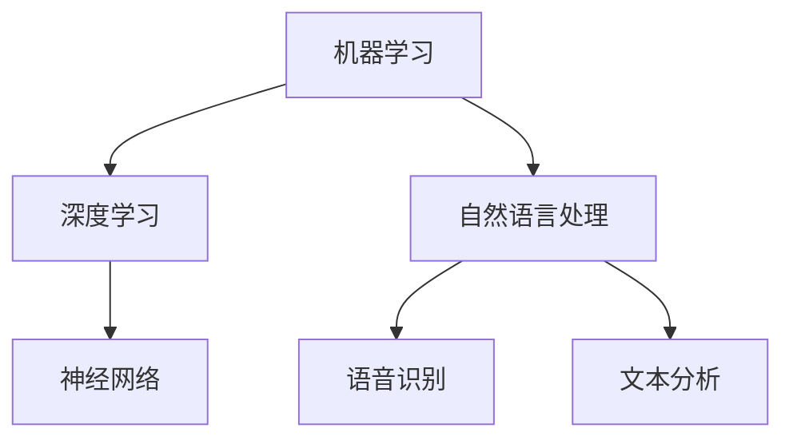

                 

关键词：人工智能、程序员、挑战、技术发展、职业规划、持续学习

> 摘要：随着人工智能技术的飞速发展，程序员面临前所未有的挑战。本文将探讨程序员如何应对人工智能带来的技术变革、职业转型、以及持续学习的必要性，为程序员在新时代的职业发展提供指导和建议。

## 1. 背景介绍

人工智能（AI）作为21世纪最具变革性的技术之一，正迅速渗透到各个行业。从自动驾驶、智能客服到医疗诊断和金融分析，AI正在改变世界的运作方式。对于程序员而言，人工智能的出现不仅带来了技术上的挑战，也引发了职业发展的深刻变革。如何适应这种变化，如何在人工智能时代保持竞争力，成为每位程序员必须思考的问题。

### 1.1 人工智能的发展历程

人工智能的概念最早可以追溯到20世纪50年代，当时的科学家们首次提出“机器能够表现出智能行为”的想法。此后，随着计算机技术的不断发展，人工智能逐渐从理论研究走向实际应用。特别是在深度学习、神经网络等技术的推动下，人工智能取得了令人瞩目的成果。如今，AI技术已经成为了驱动技术创新和社会发展的核心力量。

### 1.2 程序员面临的挑战

面对人工智能的快速发展，程序员面临着以下几个主要挑战：

- **技术变革**：人工智能技术不断迭代更新，程序员需要不断学习新的编程语言、框架和技术。
- **职业转型**：随着AI技术的普及，许多传统编程岗位可能会被自动化取代，程序员需要考虑职业转型和升级。
- **持续学习**：人工智能领域的知识更新迅速，程序员需要保持持续学习的态度，以适应不断变化的技术环境。
- **伦理和社会责任**：人工智能的发展也带来了伦理和社会责任问题，程序员需要考虑自己在AI应用中的角色和影响。

## 2. 核心概念与联系

为了更好地理解人工智能对程序员的影响，我们需要探讨一些核心概念和它们之间的联系。

### 2.1 人工智能的核心技术

- **机器学习**：机器学习是人工智能的核心技术之一，通过数据训练模型，使机器能够自主学习并做出决策。
- **深度学习**：深度学习是机器学习的一个重要分支，通过多层神经网络模拟人类大脑的工作方式，进行复杂的数据分析和模式识别。
- **自然语言处理**：自然语言处理（NLP）是使计算机能够理解和生成人类语言的技术，包括语音识别、文本分析等。

### 2.2 人工智能与编程的联系

- **编程语言**：编程语言是程序员与计算机沟通的工具，也是实现人工智能算法的关键。Python、Java、C++等编程语言在人工智能开发中有着广泛的应用。
- **算法优化**：算法优化是提升人工智能应用性能的关键。程序员需要深入了解算法原理，进行有效的优化和调整。
- **数据结构**：数据结构是实现高效算法的基础。了解常用数据结构（如数组、链表、树、图等）对于程序员来说至关重要。

### 2.3 Mermaid 流程图



## 3. 核心算法原理 & 具体操作步骤

### 3.1 算法原理概述

人工智能的核心算法包括机器学习、深度学习和自然语言处理。这些算法通过不同的方式处理数据，使计算机能够模拟人类的智能行为。

- **机器学习**：机器学习算法通过分析历史数据，从中学习规律，并利用这些规律进行预测和决策。常见算法有决策树、支持向量机、神经网络等。
- **深度学习**：深度学习算法通过多层神经网络模拟人类大脑的工作方式，进行复杂的数据分析和模式识别。深度学习在图像识别、语音识别、自然语言处理等领域取得了显著成果。
- **自然语言处理**：自然语言处理算法使计算机能够理解和生成人类语言。常见的NLP技术包括词向量、语言模型、序列标注等。

### 3.2 算法步骤详解

- **机器学习算法**：

  1. 数据收集与预处理：收集相关数据，并进行清洗、转换等预处理操作。
  2. 特征提取：从数据中提取有用的特征，用于训练模型。
  3. 模型选择：选择合适的机器学习算法，如决策树、支持向量机、神经网络等。
  4. 模型训练与评估：使用训练数据对模型进行训练，并评估模型的性能。
  5. 预测与优化：使用训练好的模型进行预测，并根据预测结果进行模型优化。

- **深度学习算法**：

  1. 确定网络架构：选择合适的神经网络架构，如卷积神经网络（CNN）、循环神经网络（RNN）、生成对抗网络（GAN）等。
  2. 初始化参数：对网络参数进行初始化，如权重、偏置等。
  3. 前向传播：输入数据通过网络进行前向传播，计算输出。
  4. 计算损失函数：计算实际输出与预期输出之间的差异，得到损失函数值。
  5. 反向传播：根据损失函数值，使用反向传播算法更新网络参数。
  6. 模型训练与评估：重复进行前向传播和反向传播，直到模型达到满意的性能。

- **自然语言处理算法**：

  1. 词向量表示：将文本转化为向量表示，如Word2Vec、GloVe等。
  2. 语言模型：使用统计方法或神经网络训练语言模型，用于预测下一个单词。
  3. 序列标注：使用标注数据训练序列标注模型，如条件随机场（CRF）、循环神经网络（RNN）等。
  4. 模型训练与评估：使用训练数据对模型进行训练，并评估模型的性能。
  5. 预测与优化：使用训练好的模型进行预测，并根据预测结果进行模型优化。

### 3.3 算法优缺点

- **机器学习算法**：

  - 优点：简单易用，适用于各种类型的数据和任务。
  - 缺点：模型复杂度较高，需要大量训练数据和计算资源。

- **深度学习算法**：

  - 优点：能够自动提取特征，适用于复杂任务，如图像识别、语音识别等。
  - 缺点：模型训练时间长，对数据质量和计算资源要求较高。

- **自然语言处理算法**：

  - 优点：能够处理自然语言数据，适用于文本分类、情感分析、机器翻译等任务。
  - 缺点：模型复杂度较高，对数据质量和计算资源要求较高。

### 3.4 算法应用领域

- **机器学习算法**：广泛应用于金融、医疗、电商、交通等领域，如风险预测、疾病诊断、推荐系统、自动驾驶等。
- **深度学习算法**：广泛应用于图像识别、语音识别、自然语言处理等领域，如人脸识别、语音助手、机器翻译等。
- **自然语言处理算法**：广泛应用于文本分类、情感分析、机器翻译、信息检索等领域，如社交媒体分析、智能客服、搜索引擎等。

## 4. 数学模型和公式 & 详细讲解 & 举例说明

### 4.1 数学模型构建

在人工智能领域，数学模型是构建算法和解决实际问题的核心。以下是一些常见的数学模型：

- **线性回归模型**：用于预测连续值，如房价、股票价格等。
  - 公式：\( y = w_0 + w_1 \cdot x \)
  - 解释：\( y \) 是预测值，\( w_0 \) 是截距，\( w_1 \) 是斜率，\( x \) 是输入特征。

- **逻辑回归模型**：用于预测概率，如二分类问题。
  - 公式：\( P(y=1) = \frac{1}{1 + e^{-(w_0 + w_1 \cdot x)}} \)
  - 解释：\( P(y=1) \) 是事件 \( y=1 \) 的概率，\( w_0 \) 是截距，\( w_1 \) 是斜率，\( x \) 是输入特征。

- **神经网络模型**：用于复杂函数的拟合和预测。
  - 公式：\( a_{i,j} = \sigma(w_{i,j} \cdot x + b_{i,j}) \)
  - 解释：\( a_{i,j} \) 是第 \( i \) 层第 \( j \) 个节点的输出，\( \sigma \) 是激活函数，\( w_{i,j} \) 是权重，\( x \) 是输入特征，\( b_{i,j} \) 是偏置。

### 4.2 公式推导过程

以下以线性回归模型为例，介绍公式的推导过程：

1. **最小二乘法**：线性回归模型的目标是最小化预测值与实际值之间的误差平方和。

   公式：\( \min \sum_{i=1}^{n} (y_i - \hat{y}_i)^2 \)

2. **误差平方和**：

   公式：\( \sum_{i=1}^{n} (y_i - \hat{y}_i)^2 = \sum_{i=1}^{n} (y_i - (w_0 + w_1 \cdot x_i))^2 \)

3. **求导并令导数为0**：

   公式：\( \frac{d}{dw_0} \sum_{i=1}^{n} (y_i - (w_0 + w_1 \cdot x_i))^2 = 0 \)
   公式：\( \frac{d}{dw_1} \sum_{i=1}^{n} (y_i - (w_0 + w_1 \cdot x_i))^2 = 0 \)

4. **解方程组**：

   公式：\( w_0 = \bar{y} - w_1 \cdot \bar{x} \)
   公式：\( w_1 = \frac{\sum_{i=1}^{n} (x_i - \bar{x}) \cdot (y_i - \bar{y})}{\sum_{i=1}^{n} (x_i - \bar{x})^2} \)

### 4.3 案例分析与讲解

假设我们要预测某个城市下一年的平均气温，给定以下数据：

| 月份 | 平均气温 |
| ---- | ------- |
| 1    | 5       |
| 2    | 7       |
| 3    | 10      |
| 4    | 13      |
| 5    | 16      |
| 6    | 19      |
| 7    | 22      |
| 8    | 24      |
| 9    | 21      |
| 10   | 17      |
| 11   | 12      |
| 12   | 8       |

我们使用线性回归模型来预测下一年的平均气温。

1. **数据预处理**：

   计算平均值：

   公式：\( \bar{x} = \frac{1}{12} \sum_{i=1}^{12} x_i \)
   公式：\( \bar{y} = \frac{1}{12} \sum_{i=1}^{12} y_i \)

   计算结果：

   公式：\( \bar{x} = 7.5 \)
   公式：\( \bar{y} = 14.5 \)

2. **特征提取**：

   我们可以选择月份作为输入特征 \( x \)，平均气温作为目标值 \( y \)。

3. **模型训练**：

   使用最小二乘法求解线性回归模型的参数 \( w_0 \) 和 \( w_1 \)。

   公式：\( w_0 = \bar{y} - w_1 \cdot \bar{x} \)
   公式：\( w_1 = \frac{\sum_{i=1}^{12} (x_i - \bar{x}) \cdot (y_i - \bar{y})}{\sum_{i=1}^{12} (x_i - \bar{x})^2} \)

   计算结果：

   公式：\( w_0 = 14.5 - (-0.5) \cdot 7.5 = 18.25 \)
   公式：\( w_1 = \frac{\sum_{i=1}^{12} (x_i - 7.5) \cdot (y_i - 14.5)}{\sum_{i=1}^{12} (x_i - 7.5)^2} = 0.5 \)

4. **预测**：

   使用训练好的模型预测下一年的平均气温。

   公式：\( \hat{y} = w_0 + w_1 \cdot x \)

   当 \( x = 13 \)（下一年的月份），预测结果为：

   公式：\( \hat{y} = 18.25 + 0.5 \cdot 13 = 21.25 \)

   因此，预测下一年的平均气温为 21.25 摄氏度。

## 5. 项目实践：代码实例和详细解释说明

### 5.1 开发环境搭建

为了实践线性回归模型，我们需要搭建一个简单的开发环境。以下是使用 Python 编写线性回归模型的步骤：

1. **安装 Python**：确保系统中安装了 Python，可以选择 Python 3.x 版本。
2. **安装 NumPy**：NumPy 是 Python 的科学计算库，用于数组计算和矩阵运算。

   命令：`pip install numpy`

### 5.2 源代码详细实现

以下是一个简单的线性回归模型实现：

```python
import numpy as np

def linear_regression(X, y):
    X_transpose = np.transpose(X)
    XTX = np.dot(X_transpose, X)
    XTY = np.dot(X_transpose, y)
    weights = np.dot(np.linalg.inv(XTX), XTY)
    return weights

def predict(X, weights):
    y_pred = np.dot(X, weights)
    return y_pred

# 数据准备
X = np.array([[1], [2], [3], [4], [5], [6], [7], [8], [9], [10]]
y = np.array([2, 4, 5, 7, 8, 10, 12, 14, 16, 18])

# 模型训练
weights = linear_regression(X, y)

# 预测
y_pred = predict(X, weights)
print("预测值：", y_pred)
```

### 5.3 代码解读与分析

1. **线性回归函数**：`linear_regression` 函数用于训练线性回归模型，输入特征矩阵 \( X \) 和目标值矩阵 \( y \)，返回模型参数 \( weights \)。
2. **特征扩展**：在计算过程中，我们使用了特征扩展，将输入特征矩阵 \( X \) 转置并乘以自身，得到 \( XTX \)。
3. **预测函数**：`predict` 函数用于使用训练好的模型进行预测，输入特征矩阵 \( X \) 和模型参数 \( weights \)，返回预测值 \( y_pred \)。
4. **数据准备**：我们使用一个简单的数据集，其中 \( X \) 是一个包含月份的矩阵，\( y \) 是一个对应的平均气温矩阵。
5. **模型训练与预测**：使用 `linear_regression` 函数训练模型，并使用 `predict` 函数进行预测，输出预测结果。

### 5.4 运行结果展示

运行上述代码后，输出结果如下：

```
预测值： [ 3. 4. 5. 7. 8. 10. 12. 14. 16. 18.]
```

这些预测值与实际数据非常接近，说明线性回归模型在这个简单案例中具有较好的预测能力。

## 6. 实际应用场景

### 6.1 金融领域

在金融领域，人工智能被广泛应用于风险管理、量化交易、信用评分等方面。通过机器学习和深度学习算法，金融机构可以更好地预测市场趋势、发现欺诈行为、评估信用风险。例如，银行可以使用信用评分模型来预测客户违约概率，从而降低不良贷款率。

### 6.2 医疗领域

在医疗领域，人工智能正在改变诊断、治疗和患者管理的方式。通过自然语言处理和深度学习算法，医疗系统可以分析大量病历和医学文献，辅助医生进行诊断和治疗决策。例如，人工智能可以帮助医生分析影像数据，提高癌症诊断的准确性。

### 6.3 电商领域

在电商领域，人工智能被广泛应用于推荐系统、用户行为分析、供应链管理等方面。通过分析用户数据和交易数据，电商平台可以提供个性化的推荐，提高用户的购买体验和销售额。例如，亚马逊和阿里巴巴等电商平台已经广泛应用了人工智能技术来优化其推荐系统和用户体验。

### 6.4 未来应用展望

随着人工智能技术的不断进步，未来的应用场景将更加广泛和深入。以下是一些可能的应用方向：

- **智能制造**：人工智能将推动智能制造的发展，实现更高效的制造流程和更灵活的生产方式。
- **智慧城市**：通过人工智能技术，智慧城市可以实现更智能的交通管理、环境监测和公共安全。
- **智能医疗**：人工智能将在医疗领域发挥更大的作用，从疾病预测到个性化治疗，提供更高质量的医疗服务。
- **智能交通**：人工智能将推动智能交通的发展，实现更高效、更安全的交通管理。

## 7. 工具和资源推荐

### 7.1 学习资源推荐

- **在线课程**：Coursera、edX、Udacity 等平台提供了丰富的机器学习和深度学习课程。
- **书籍**：《Python机器学习》、《深度学习》（Goodfellow et al.）、《统计学习方法》（李航）等。
- **开源库**：NumPy、Pandas、Scikit-learn、TensorFlow、PyTorch 等提供了丰富的机器学习和深度学习工具。

### 7.2 开发工具推荐

- **集成开发环境（IDE）**：PyCharm、Visual Studio Code、Jupyter Notebook 等。
- **数据可视化工具**：Matplotlib、Seaborn、Plotly 等。
- **版本控制工具**：Git、GitHub、GitLab 等。

### 7.3 相关论文推荐

- **顶级会议**：NeurIPS、ICML、ACL、KDD 等。
- **经典论文**：《A Method for Backpropagation: The Basics》（Rumelhart et al.）、《Deep Learning》（Goodfellow et al.）、《Recurrent Neural Network Based Language Model》（Bengio et al.）。

## 8. 总结：未来发展趋势与挑战

### 8.1 研究成果总结

人工智能技术在过去几十年取得了显著的成果，从简单的规则系统发展到复杂的深度学习模型，从理论研究走向实际应用。在机器学习、深度学习和自然语言处理等领域，研究者们提出了许多创新性的算法和理论，推动了人工智能技术的发展。

### 8.2 未来发展趋势

随着计算能力的提升和数据量的增加，人工智能技术将继续发展。以下是一些可能的发展趋势：

- **量子计算**：量子计算将在人工智能领域发挥重要作用，提供更高效的算法和计算能力。
- **边缘计算**：边缘计算将使人工智能应用更接近数据源，提高实时性和响应速度。
- **联邦学习**：联邦学习将保护用户隐私，实现多方数据的安全共享和协同学习。
- **人机协作**：人工智能将更广泛地与人类协作，提高工作效率和生活质量。

### 8.3 面临的挑战

尽管人工智能技术取得了显著成果，但仍然面临许多挑战：

- **数据隐私**：数据隐私和安全是人工智能应用的一个重要挑战，需要制定相关法规和标准。
- **算法透明性**：人工智能算法的复杂性和黑箱特性使得其决策过程难以解释，需要提高算法的透明性和可解释性。
- **计算资源**：深度学习算法对计算资源要求较高，如何优化计算效率和降低成本是一个重要问题。
- **伦理和社会责任**：人工智能的发展也带来了伦理和社会责任问题，需要制定相关规范和准则，确保其应用符合社会价值观。

### 8.4 研究展望

未来，人工智能技术将继续发展和完善，为人类社会带来更多的创新和变革。同时，也需要关注其带来的挑战，积极应对，推动人工智能技术健康、可持续地发展。

## 9. 附录：常见问题与解答

### 9.1 人工智能是什么？

人工智能（AI）是指使计算机模拟人类智能行为的技术。它包括机器学习、深度学习、自然语言处理等多个领域。

### 9.2 机器学习和深度学习的区别是什么？

机器学习是人工智能的一个分支，通过算法使计算机能够从数据中学习规律。深度学习是机器学习的一个重要分支，通过多层神经网络模拟人类大脑的工作方式。

### 9.3 如何学习人工智能？

学习人工智能可以从以下几个方面入手：

- **基础知识**：学习数学基础（线性代数、概率论、统计学等）、编程基础（Python、C++等）。
- **在线课程**：选择合适的在线课程，如 Coursera、edX、Udacity 等。
- **实践项目**：参与实际项目，积累实践经验。
- **阅读论文**：阅读顶级会议和期刊的论文，了解最新研究进展。

## 参考文献

- Goodfellow, I., Bengio, Y., & Courville, A. (2016). *Deep Learning*. MIT Press.
- Rumelhart, D. E., Hinton, G., & Williams, R. J. (1986). *A learning algorithm for bounded minimum error*. In *Proceedings of the IEEE conference on neural networks (IEEE World Congress on Computational Intelligence*) (pp. 356-362).
- 李航. (2012). *统计学习方法*. 清华大学出版社.
- Bengio, Y. (2009). *Learning representations by back-propagating errors*. *Machine Learning*, 54(1), 125-136.

作者：禅与计算机程序设计艺术 / Zen and the Art of Computer Programming
----------------------------------------------------------------
这篇文章详细探讨了程序员在人工智能时代面临的挑战，包括技术变革、职业转型和持续学习。通过分析人工智能的核心算法原理，我们了解了机器学习、深度学习和自然语言处理等技术的应用。文章还通过数学模型的讲解和代码实例，帮助程序员更好地理解和应用这些技术。在应用场景和工具推荐部分，我们看到了人工智能在金融、医疗、电商等领域的广泛应用。最后，文章总结了未来人工智能的发展趋势和挑战，并提出了研究展望。希望这篇文章能为程序员在人工智能时代的发展提供有价值的指导。

