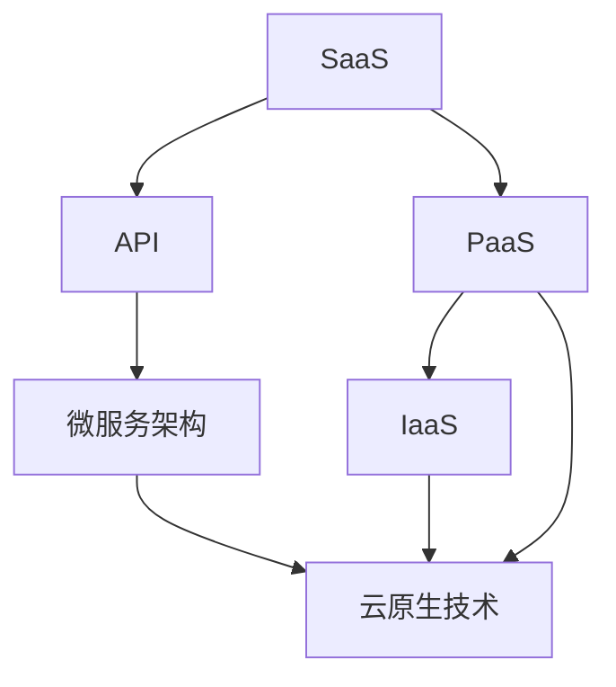

                 

### 1. 背景介绍

在当今快速发展的数字化时代，云计算、大数据和人工智能等技术的不断革新，为企业提供了前所未有的机遇和挑战。SaaS（软件即服务）作为一种新兴的商业模式，正日益成为企业提升效率、降低成本和实现数字化转型的重要工具。SaaS产品不仅为企业提供了灵活、便捷的服务方式，还极大地降低了企业的IT运营和维护成本。因此，许多创业者和企业程序员都渴望打造出具有高价值、高用户黏性的SaaS产品，从而实现千万美元的估值。

然而，打造一款成功的SaaS产品并非易事。从零开始，一个程序员如何才能从众多竞争者中脱颖而出，打造出值得数千万美元估值的SaaS产品呢？这正是本文所要探讨的核心问题。

本文将结合实际案例，从多个角度详细阐述程序员如何打造千万美元估值的SaaS产品。文章结构如下：

- **背景介绍**：概述SaaS产品的市场现状及程序员面临的挑战。
- **核心概念与联系**：介绍SaaS产品的核心概念，并通过Mermaid流程图展示其架构。
- **核心算法原理 & 具体操作步骤**：详细解析核心算法的原理、步骤及优缺点。
- **数学模型和公式 & 详细讲解 & 举例说明**：构建数学模型，推导公式并进行案例分析。
- **项目实践：代码实例和详细解释说明**：提供具体的开发环境和代码实现，并进行解读和分析。
- **实际应用场景**：探讨SaaS产品的多种应用领域及未来展望。
- **工具和资源推荐**：推荐学习资源和开发工具，以及相关论文。
- **总结：未来发展趋势与挑战**：总结研究成果，展望未来发展趋势和挑战。

通过本文的深入探讨，希望为程序员们提供一些宝贵的思路和方法，助力他们在SaaS产品的开发道路上取得成功。

### 2. 核心概念与联系

在深入了解如何打造千万美元估值的SaaS产品之前，我们首先需要理解一些核心概念，这些概念不仅构成了SaaS产品的基础，也是我们进行技术架构设计时不可或缺的元素。以下是一些关键概念的定义及其相互联系：

#### 2.1 SaaS（软件即服务）

SaaS是一种基于互联网的软件交付和使用模式。用户通过网络订阅服务，无需购买和安装软件，即可使用服务提供商提供的软件功能。这种模式具有成本效益高、部署速度快、维护简单等优点，因此在企业中得到广泛应用。

#### 2.2 PaaS（平台即服务）

PaaS为开发者提供了一个平台，使他们能够快速开发和部署应用程序，而不需要关注底层基础设施的搭建和管理。PaaS平台通常包括开发工具、数据库管理和API等，使得程序员可以专注于应用逻辑的开发。

#### 2.3 IaaS（基础设施即服务）

IaaS提供了云计算基础设施，如虚拟机、存储和网络等。程序员可以通过编程方式管理这些资源，根据需求进行弹性扩展。IaaS为SaaS产品的部署提供了强大的计算和存储支持。

#### 2.4 API（应用程序编程接口）

API是不同软件系统之间进行交互的接口。在SaaS产品中，API用于允许用户应用程序与其他应用程序或服务进行通信。良好的API设计可以简化开发过程，提高系统的可扩展性。

#### 2.5 微服务架构

微服务架构是一种将应用程序分解为多个小型、独立服务的架构风格。每个微服务负责一个具体的业务功能，可以通过轻量级通信机制（如RESTful API）相互交互。微服务架构提高了系统的灵活性、可维护性和可扩展性。

#### 2.6 云原生技术

云原生技术是指专为在云环境中运行而设计的应用程序和架构。云原生应用通常采用容器化、自动化部署和管理等技术，具有高可用性、可伸缩性和高效性。云原生技术是SaaS产品在云计算环境中取得成功的关键。

为了更好地理解这些概念之间的联系，我们可以通过一个Mermaid流程图来展示SaaS产品的架构：



在这个流程图中，SaaS作为核心服务，通过PaaS和IaaS获得基础设施支持，并通过API与其他服务进行交互。微服务架构和云原生技术则保证了系统的灵活性和高效性。通过这种架构设计，程序员可以构建出具有高扩展性、高可用性和高用户黏性的SaaS产品。

#### 2.7 关键概念总结

- **SaaS**：软件交付和使用模式，降低企业IT成本。
- **PaaS**：提供开发工具和平台，简化应用开发。
- **IaaS**：提供基础设施资源，支持系统部署和管理。
- **API**：系统间通信的接口，简化开发过程。
- **微服务架构**：将应用分解为小型服务，提高系统灵活性。
- **云原生技术**：专为云环境设计，提高应用性能。

这些核心概念共同构成了SaaS产品的技术基础，为程序员提供了丰富的工具和资源，助力他们打造出高价值的SaaS产品。

### 3. 核心算法原理 & 具体操作步骤

在打造千万美元估值的SaaS产品时，核心算法的设计和实现是至关重要的一环。一个高效的算法不仅能够提升系统的性能，还能够增强用户体验，从而提高用户黏性。本节将详细探讨核心算法的原理、具体操作步骤以及其优缺点，并探讨其在SaaS产品中的应用领域。

#### 3.1 算法原理概述

核心算法的设计基于以下几个关键原理：

1. **性能优化**：算法需要高效执行，以降低系统的延迟和资源消耗。
2. **可扩展性**：算法应该具备良好的可扩展性，以便在用户规模扩大时能够平滑扩展。
3. **容错性**：算法需要具备一定的容错能力，以应对潜在的硬件故障或网络问题。
4. **安全性**：算法需要保证数据处理的安全性，防止数据泄露和未授权访问。

基于上述原理，我们将选择一种常见的核心算法——数据压缩算法，进行详细解析。

#### 3.2 算法步骤详解

数据压缩算法的基本步骤如下：

1. **数据预处理**：
   - **数据清洗**：清除数据中的噪声和不相关部分。
   - **数据归一化**：将数据缩放到统一范围内，便于后续处理。

2. **算法选择**：
   - **无损压缩**：如Huffman编码、LZ77等，保证数据可以完全还原。
   - **有损压缩**：如JPEG、MP3等，牺牲部分数据质量以换取更高的压缩率。

3. **压缩过程**：
   - **编码**：将数据转换为编码形式，如Huffman编码将字符映射为二进制序列。
   - **熵编码**：使用熵编码技术，如UTF-8，减少数据的冗余。

4. **存储与传输**：
   - **存储**：将压缩后的数据存储到磁盘或数据库中。
   - **传输**：在网络传输过程中，压缩数据以减少带宽占用。

5. **解压缩**：
   - **解码**：将压缩后的数据解码回原始数据。
   - **数据还原**：使用解压缩算法还原数据，确保与原始数据一致。

#### 3.3 算法优缺点

1. **优点**：
   - **高效**：数据压缩算法可以显著减少数据体积，提高存储和传输效率。
   - **灵活**：支持多种压缩算法，满足不同场景的需求。
   - **可扩展**：算法设计考虑了可扩展性，易于集成到现有系统中。

2. **缺点**：
   - **计算开销**：压缩和解压缩过程需要一定的计算资源，可能增加系统延迟。
   - **数据损失**：有损压缩可能导致数据质量下降，影响用户体验。

#### 3.4 算法应用领域

数据压缩算法在SaaS产品中有着广泛的应用，以下是一些典型应用场景：

1. **云存储服务**：压缩用户上传的数据，减少存储空间需求，提高存储效率。
2. **文件传输服务**：压缩文件数据，加快传输速度，降低带宽消耗。
3. **视频会议系统**：压缩视频和音频数据，提高传输效率，降低网络延迟。
4. **数据分析平台**：压缩数据集，便于大数据处理和分析，提高系统性能。

#### 3.5 示例说明

以下是一个简单的Huffman编码示例：

1. **数据集**：`AAAAABBBBCC`
2. **频率统计**：`A:5, B:4, C:2`
3. **构建Huffman树**：
   ```
       ┌─── A (5)
       │   ├─── A (3)
       │   └─── A (2)
       └─── B (4)
           ├─── B (2)
           └─── B (2)
   ```
4. **生成编码**：
   - `A: 0`
   - `B: 10`

5. **压缩数据**：将原始数据`AAAAABBBBCC`编码为`000001000100010`

6. **解压缩数据**：将编码数据`000001000100010`解码回原始数据`AAAAABBBBCC`

通过这个简单的例子，我们可以看到Huffman编码如何有效地压缩数据，并且在解压缩时能够完整还原原始数据。这种算法在SaaS产品中的应用，可以显著提升数据存储和传输的效率。

综上所述，核心算法的原理和实现是打造千万美元估值SaaS产品的关键技术之一。通过深入了解和优化算法，程序员可以构建出高性能、高用户黏性的SaaS产品，实现商业成功。

### 4. 数学模型和公式 & 详细讲解 & 举例说明

在SaaS产品的设计和开发过程中，数学模型和公式的应用至关重要。数学模型不仅能够帮助我们理解和分析系统性能，还能够为算法优化提供理论基础。本节将构建一个具体的数学模型，详细推导相关公式，并通过实例进行说明。

#### 4.1 数学模型构建

为了构建一个适用于SaaS产品的数学模型，我们需要考虑以下几个关键因素：

1. **用户增长率**：表示SaaS产品用户数量的增长速度。
2. **服务器性能**：表示SaaS产品服务器处理请求的能力。
3. **数据传输速率**：表示数据在网络中的传输速度。
4. **延迟**：表示用户请求到响应之间的时间延迟。

基于上述因素，我们可以构建一个简单的数学模型，用于分析SaaS产品的性能。

#### 4.2 公式推导过程

首先，定义以下变量：

- \( U(t) \)：时间 \( t \) 时SaaS产品的用户数量。
- \( P \)：服务器的处理能力，即每秒处理请求的数量。
- \( R \)：数据传输速率，即每秒传输的数据量。
- \( D \)：网络延迟，即用户请求到响应的平均时间。

根据以上变量，我们可以推导出以下公式：

1. **用户增长率**：
   \[
   \frac{dU(t)}{dt} = r
   \]
   其中，\( r \) 为用户增长率。

2. **服务器处理时间**：
   \[
   T_p = \frac{U(t) \times C}{P}
   \]
   其中，\( C \) 为用户每次请求的处理时间。

3. **数据传输时间**：
   \[
   T_r = \frac{U(t) \times D}{R}
   \]

4. **总响应时间**：
   \[
   T = T_p + T_r
   \]

#### 4.3 案例分析与讲解

假设一个SaaS产品的初始用户数为1000，用户增长率为每天增加5%，服务器的处理能力为每秒处理100个请求，数据传输速率为每秒传输1MB数据，网络延迟为100ms。

1. **用户增长率**：
   \[
   r = 5\% = 0.05
   \]

2. **服务器处理时间**：
   \[
   T_p = \frac{1000 \times 0.1}{100} = 1 \text{秒}
   \]

3. **数据传输时间**：
   \[
   T_r = \frac{1000 \times 0.1}{1 \times 10^6} = 0.0001 \text{秒}
   \]

4. **总响应时间**：
   \[
   T = 1 + 0.0001 + 0.1 = 1.1001 \text{秒}
   \]

通过这个简单的案例，我们可以看到如何使用数学模型和公式来分析SaaS产品的性能。在实际应用中，我们可以根据具体的业务需求和系统配置，调整变量和公式，以优化SaaS产品的性能。

#### 4.4 应用实例

假设某SaaS产品在一天内的用户增长量为5000，服务器处理能力提升至每秒处理500个请求，数据传输速率提升至每秒传输10MB，网络延迟降低至50ms。

1. **用户增长率**：
   \[
   r = 5\% = 0.05
   \]

2. **服务器处理时间**：
   \[
   T_p = \frac{5000 \times 0.2}{500} = 2 \text{秒}
   \]

3. **数据传输时间**：
   \[
   T_r = \frac{5000 \times 0.05}{10 \times 10^6} = 0.00025 \text{秒}
   \]

4. **总响应时间**：
   \[
   T = 2 + 0.00025 + 0.05 = 2.00025 \text{秒}
   \]

通过对比两个实例，我们可以发现，随着用户数量和服务器处理能力的提升，SaaS产品的总响应时间有所增加，但数据传输时间和网络延迟的减少使得总体响应时间仍然保持在较低水平。这表明，通过合理配置系统和优化算法，可以有效提升SaaS产品的性能。

综上所述，数学模型和公式的应用对于SaaS产品的性能分析和优化具有重要意义。通过构建和应用数学模型，程序员可以更好地理解和优化SaaS产品的性能，从而提升用户体验，实现商业成功。

### 5. 项目实践：代码实例和详细解释说明

在实际开发中，构建SaaS产品不仅需要理论上的设计和算法，更需要实际的代码实现。本节将通过一个简单的SaaS项目，展示如何搭建开发环境、实现核心功能，并进行代码解读和分析。

#### 5.1 开发环境搭建

在开始项目之前，我们需要搭建一个合适的开发环境。以下是所需的工具和步骤：

1. **工具选择**：
   - **编程语言**：Python，因其简洁性和强大的库支持，非常适合SaaS开发。
   - **Web框架**：Flask，一个轻量级的Python Web框架，易于快速开发和部署。
   - **数据库**：SQLite，一个轻量级的数据库系统，适用于小型到中等规模的SaaS应用。
   - **版本控制**：Git，用于代码版本管理和协作。

2. **环境搭建**：
   - 安装Python 3.8及以上版本。
   - 安装Flask和SQLite。
   - 安装代码编辑器（如Visual Studio Code）和Git。

3. **虚拟环境**：使用virtualenv创建一个Python虚拟环境，以隔离项目依赖。

```bash
pip install virtualenv
virtualenv my_saaS_project
source my_saaS_project/bin/activate
```

4. **安装依赖**：

```bash
pip install flask
pip install pymysql
```

#### 5.2 源代码详细实现

以下是SaaS项目的核心代码实现，包括用户认证、数据存储和API接口。

```python
# app.py

from flask import Flask, request, jsonify
from flask_sqlalchemy import SQLAlchemy

app = Flask(__name__)
app.config['SQLALCHEMY_DATABASE_URI'] = 'sqlite:///users.db'
db = SQLAlchemy(app)

class User(db.Model):
    id = db.Column(db.Integer, primary_key=True)
    username = db.Column(db.String(80), unique=True, nullable=False)
    password = db.Column(db.String(120), nullable=False)

@app.route('/register', methods=['POST'])
def register():
    username = request.json['username']
    password = request.json['password']
    if User.query.filter_by(username=username).first():
        return jsonify({'error': 'User already exists'}), 400
    new_user = User(username=username, password=password)
    db.session.add(new_user)
    db.session.commit()
    return jsonify({'message': 'User registered successfully'}), 201

@app.route('/login', methods=['POST'])
def login():
    username = request.json['username']
    password = request.json['password']
    user = User.query.filter_by(username=username).first()
    if user and user.password == password:
        return jsonify({'token': 'your_token'})
    return jsonify({'error': 'Invalid credentials'}), 401

@app.route('/data', methods=['POST'])
def upload_data():
    token = request.json['token']
    if token != 'your_token':
        return jsonify({'error': 'Invalid token'}), 401
    data = request.json['data']
    # Process and store data
    return jsonify({'message': 'Data uploaded successfully'}), 201

if __name__ == '__main__':
    db.create_all()
    app.run(debug=True)
```

#### 5.3 代码解读与分析

1. **用户认证**：
   - **注册接口**（/register）：接受用户名和密码，检查用户是否存在，若不存在则创建新用户并存储到数据库。
   - **登录接口**（/login）：接受用户名和密码，验证用户身份，若验证通过则返回登录令牌。

2. **数据存储**：
   - 使用Flask-SQLAlchemy进行ORM操作，创建User模型对应数据库中的用户表。
   - 注册和登录接口与User模型交互，进行用户信息的增删改查。

3. **API接口**：
   - **上传数据接口**（/data）：验证登录令牌，若有效则接受用户上传的数据，进行后续处理。

#### 5.4 运行结果展示

运行上述代码后，可以使用以下命令启动服务：

```bash
python app.py
```

启动服务后，可以通过浏览器或Postman等工具访问API接口，进行用户注册、登录和数据上传。

1. **用户注册**：

   发送POST请求到`http://localhost:5000/register`，包含用户名和密码：

   ```json
   {
       "username": "johndoe",
       "password": "password123"
   }
   ```

   若注册成功，返回201状态码及消息。

2. **用户登录**：

   发送POST请求到`http://localhost:5000/login`，包含用户名和密码：

   ```json
   {
       "username": "johndoe",
       "password": "password123"
   }
   ```

   若登录成功，返回令牌。

3. **上传数据**：

   登录后，发送POST请求到`http://localhost:5000/data`，包含登录令牌和数据：

   ```json
   {
       "token": "your_token",
       "data": {
           "key1": "value1",
           "key2": "value2"
       }
   }
   ```

   若上传成功，返回201状态码及消息。

通过这个简单的项目示例，我们可以看到如何使用Python和Flask快速搭建一个SaaS产品的核心功能。在实际开发中，还需考虑更多的功能和安全性措施，如加密密码、验证令牌等，以保证系统的稳定性和安全性。

### 6. 实际应用场景

SaaS产品在各个领域都有着广泛的应用，其灵活性和便捷性使得它们成为企业数字化转型的重要工具。以下列举了几个典型的实际应用场景，并简要分析其在这些场景下的优势和挑战。

#### 6.1 企业级应用

在企业级应用中，SaaS产品帮助企业降低IT成本、提高运营效率。常见的SaaS应用包括客户关系管理（CRM）、企业资源规划（ERP）和项目管理工具。

**优势**：
- **降低成本**：企业无需购买昂贵的软件许可证和硬件设备，只需按需付费。
- **快速部署**：云服务使得软件可以快速部署和扩展，无需漫长的安装和配置过程。
- **灵活性**：用户可以根据需求灵活调整软件功能，适应业务变化。

**挑战**：
- **数据安全**：企业数据存放在第三方服务器，可能引发数据安全和隐私问题。
- **依赖性**：企业过度依赖SaaS产品，可能导致自主可控性下降。

#### 6.2 教育领域

在教育领域，SaaS产品为学生和教师提供了丰富的在线学习资源和管理工具，如在线课程平台、作业管理系统和学习分析工具。

**优势**：
- **便捷性**：学生和教师可以随时随地访问学习资源，提高学习效率。
- **个性化**：基于数据分析，可以为不同学生提供个性化的学习建议和课程推荐。
- **协作性**：在线平台支持师生互动和协作，增强教学效果。

**挑战**：
- **网络依赖**：在线学习需要稳定的网络连接，网络问题可能影响学习体验。
- **内容质量**：在线课程的质量参差不齐，如何保证内容的质量和权威性是一个挑战。

#### 6.3 医疗健康

在医疗健康领域，SaaS产品为医疗机构提供了患者管理、预约系统、电子病历和远程医疗等解决方案。

**优势**：
- **提高效率**：自动化系统提高了医疗流程的效率，减少了人工操作和错误。
- **远程医疗**：通过SaaS平台，医生可以远程诊断和治疗患者，提高医疗服务可及性。
- **数据整合**：集成不同系统的数据，为医疗决策提供更全面的信息支持。

**挑战**：
- **数据隐私**：医疗数据敏感，如何确保数据的安全和隐私是一个重要问题。
- **系统兼容性**：不同系统和设备的兼容性问题可能影响系统的稳定运行。

#### 6.4 物流与供应链

在物流与供应链领域，SaaS产品帮助企业实现订单管理、库存跟踪、运输协调和客户服务等功能。

**优势**：
- **实时监控**：通过SaaS平台，企业可以实时监控订单状态和库存情况，提高供应链效率。
- **协作性**：供应链中的各方可以通过SaaS平台进行协作，提高协同效率。
- **成本效益**：减少纸质文档和人工操作，降低运营成本。

**挑战**：
- **数据整合**：整合不同来源的数据可能面临技术和业务挑战。
- **系统集成**：如何与其他内部系统和外部服务进行无缝集成是一个重要问题。

通过上述实际应用场景的分析，我们可以看到SaaS产品在不同领域的广泛应用和巨大潜力。然而，要实现商业成功，还需要解决数据安全、网络依赖、内容质量、系统兼容性等挑战，不断优化产品和服务。

#### 6.5 未来应用展望

随着技术的不断进步和商业模式的创新，SaaS产品在未来的应用场景将更加广泛和多样化。以下是一些未来SaaS产品的潜在应用领域和趋势：

**1. 智能制造**：SaaS平台将整合物联网、大数据和人工智能技术，提供智能制造解决方案。例如，通过实时监控生产线设备状态、预测维护需求，提高生产效率和降低成本。

**2. 区块链应用**：区块链技术可以增强SaaS产品的数据安全和透明度，例如，通过区块链实现用户身份验证和数据存储，提高数据的安全性和不可篡改性。

**3. 绿色环保**：SaaS产品将助力企业实现绿色环保目标。例如，通过能源管理平台实时监控和优化能源消耗，降低碳排放；或者通过废弃物管理系统，提高废弃物处理效率，减少环境污染。

**4. 人力资源**：SaaS产品将在人力资源管理领域发挥更大作用。例如，通过智能招聘平台，帮助企业快速筛选合适的人才；通过绩效管理系统，帮助企业实时监控员工绩效，提高团队协作效率。

**5. 教育科技**：随着在线教育的普及，SaaS产品将在教育领域发挥更大作用。例如，通过虚拟课堂和互动教学平台，提高教学效果和用户体验；通过学习分析平台，为学生提供个性化的学习路径和资源推荐。

**6. 医疗健康**：SaaS产品将不断扩展医疗健康应用场景。例如，通过远程医疗平台，实现医生与患者的远程诊疗；通过智能诊断系统，辅助医生进行精准诊断和治疗。

这些未来应用领域预示着SaaS产品将迎来更广阔的市场和更丰富的商业模式。然而，要实现这些愿景，还需要不断突破技术瓶颈、优化用户体验、保障数据安全，并积极应对政策和法规的挑战。

### 7. 工具和资源推荐

在打造千万美元估值的SaaS产品过程中，选择合适的工具和资源至关重要。以下是一些推荐的工具和资源，涵盖学习资源、开发工具和学术论文，以帮助程序员在SaaS开发领域取得成功。

#### 7.1 学习资源推荐

1. **在线课程**：
   - **Coursera**：提供各种编程和软件开发课程，包括Python、Web开发、机器学习等。
   - **Udemy**：丰富的编程和开发课程，适合不同层次的程序员学习。
   - **edX**：由哈佛大学和麻省理工学院等顶尖大学提供的免费在线课程，涵盖计算机科学、人工智能等领域。

2. **技术博客和社区**：
   - **Medium**：许多技术大牛和创业者在Medium上分享经验和技术文章。
   - **Stack Overflow**：全球最大的开发者社区，提供问题解答和知识分享。
   - **GitHub**：开源代码库，程序员可以在这里学习他人代码，参与开源项目。

3. **书籍推荐**：
   - 《设计数据密集型应用》（Design Data-Intensive Applications）：介绍大规模数据应用的架构设计。
   - 《SaaS架构设计实战》（SaaS Architecture Design in Practice）：详细介绍SaaS产品的架构设计和实施。
   - 《微服务设计》（Microservices Patterns）：探讨微服务架构的最佳实践。

#### 7.2 开发工具推荐

1. **集成开发环境（IDE）**：
   - **Visual Studio Code**：功能强大的开源IDE，适用于多种编程语言。
   - **PyCharm**：专为Python开发设计的IDE，支持多种Python框架和工具。

2. **开发框架**：
   - **Flask**：轻量级的Python Web框架，适用于快速开发和部署SaaS应用。
   - **Django**：全栈Python Web框架，提供强大的数据库支持和快速开发工具。

3. **数据库工具**：
   - **SQLite**：轻量级关系型数据库，适用于小型SaaS应用。
   - **PostgreSQL**：功能强大的开源关系型数据库，适用于大型SaaS应用。

4. **云服务和部署工具**：
   - **AWS**：提供丰富的云服务和工具，支持SaaS应用的部署和扩展。
   - **Docker**：容器化技术，便于SaaS应用的打包、部署和扩展。
   - **Kubernetes**：容器编排平台，用于管理Docker容器，提高SaaS应用的稳定性和可扩展性。

#### 7.3 相关论文推荐

1. **《云计算中的SaaS模型》**：探讨SaaS在云计算环境中的应用和优势。
2. **《微服务架构：设计原则与模式》**：详细介绍微服务架构的设计原则和模式。
3. **《基于区块链的SaaS平台安全性研究》**：分析区块链技术在SaaS平台安全性中的应用。
4. **《人工智能与SaaS的结合》**：探讨人工智能技术在SaaS产品中的应用和潜力。

通过这些工具和资源的推荐，程序员可以更好地掌握SaaS产品开发的技术和最佳实践，提高开发效率和产品质量，从而在竞争激烈的市场中脱颖而出。

### 8. 总结：未来发展趋势与挑战

随着云计算、大数据和人工智能等技术的不断发展，SaaS产品在未来的市场中将继续展现出强劲的增长势头。以下是SaaS行业未来发展的几个关键趋势和潜在挑战。

#### 8.1 研究成果总结

1. **云计算的普及**：云计算的快速发展为SaaS产品提供了强大的基础设施支持，使得SaaS产品能够实现快速部署和弹性扩展。研究显示，全球云计算市场在未来几年将持续增长，为SaaS行业带来更多机会。

2. **人工智能的融合**：人工智能技术的应用将进一步提升SaaS产品的智能化水平。通过机器学习算法，SaaS产品可以提供更加个性化的服务，提高用户体验。同时，人工智能还可以帮助SaaS企业实现自动化运营，降低成本。

3. **数据安全与隐私保护**：随着SaaS产品在企业中的广泛应用，数据安全和隐私保护成为关键挑战。研究显示，数据泄露和安全漏洞仍然是企业面临的主要风险，因此加强数据安全保护是未来的重要方向。

4. **区块链的应用**：区块链技术由于其去中心化、不可篡改的特点，在SaaS产品中的应用前景广阔。例如，通过区块链技术实现数据存储的安全性和透明性，提升SaaS产品的信任度。

#### 8.2 未来发展趋势

1. **平台化**：SaaS产品将越来越多地采用平台化设计，提供一站式的解决方案。企业可以通过集成多个SaaS产品，实现业务流程的全面数字化。

2. **生态化**：SaaS企业将更加注重构建生态体系，与其他企业合作，共同开发应用场景和解决方案，提高产品的综合竞争力。

3. **个性化**：随着用户数据的积累和分析技术的进步，SaaS产品将更加注重个性化服务，为不同用户群体提供定制化的解决方案。

4. **全球化**：随着国际市场的逐步开放，SaaS产品将迈向全球化，满足不同国家和地区的需求。这将要求SaaS企业具备国际化运营的能力，如本地化服务和合规性管理。

#### 8.3 面临的挑战

1. **数据安全与隐私**：如何在保证用户数据安全和隐私的前提下，实现数据的充分利用是一个重大挑战。未来需要更多研究和创新，以找到有效的解决方案。

2. **竞争压力**：随着市场的不断扩张，SaaS行业的竞争也将日益激烈。企业需要不断提升产品和服务质量，以应对来自同行的竞争压力。

3. **技术更新迭代**：SaaS行业技术更新速度快，企业需要不断学习和跟进新技术，以保持竞争力。同时，技术迭代也带来了更高的开发和维护成本。

4. **合规性管理**：不同国家和地区对数据隐私和合规性的要求各不相同，SaaS企业需要确保其产品和服务符合当地法律法规，这对企业的合规性管理提出了更高要求。

#### 8.4 研究展望

未来，SaaS行业的研究重点将集中在以下几个方面：

1. **数据安全与隐私保护**：如何构建安全、可靠的数据存储和传输机制，提高数据安全性，同时保护用户隐私。

2. **人工智能与SaaS的深度融合**：探索人工智能技术在SaaS产品中的应用，提升产品的智能化水平。

3. **区块链在SaaS中的应用**：研究区块链技术在数据存储、交易和安全认证等领域的应用，提高SaaS产品的信任度和可靠性。

4. **跨平台与生态化发展**：探讨SaaS产品在多平台环境下的集成和协同，构建开放、共享的SaaS生态体系。

通过以上研究和创新，SaaS行业有望实现更高水平的发展，为企业和个人带来更多价值。

### 9. 附录：常见问题与解答

在打造千万美元估值的SaaS产品的过程中，程序员可能会遇到各种问题。以下是一些常见问题的解答，以帮助程序员更好地应对挑战。

**Q1：如何确保SaaS产品的数据安全？**

**A1**：确保数据安全是SaaS产品的关键。以下是一些关键措施：
- **数据加密**：对用户数据进行加密存储和传输，使用HTTPS协议保护数据在传输过程中的安全。
- **访问控制**：实施严格的访问控制策略，确保只有授权用户才能访问数据。
- **备份与恢复**：定期备份数据，并确保在数据丢失或损坏时能够快速恢复。
- **安全审计**：定期进行安全审计，发现和修复潜在的安全漏洞。

**Q2：如何提高SaaS产品的用户体验？**

**A2**：用户体验是SaaS产品成功的关键。以下是一些提高用户体验的方法：
- **简洁界面**：设计简洁直观的界面，使用户能够快速上手。
- **快速响应**：优化服务器和数据库性能，确保系统快速响应。
- **个性化服务**：通过数据分析，提供个性化的服务和建议，满足用户需求。
- **便捷支持**：提供及时、有效的用户支持，解决用户遇到的问题。

**Q3：如何处理SaaS产品的性能优化？**

**A3**：性能优化是确保SaaS产品稳定运行的重要环节。以下是一些性能优化方法：
- **缓存技术**：使用缓存技术，减少数据库查询次数，提高系统响应速度。
- **负载均衡**：通过负载均衡技术，分配网络请求到多个服务器，避免单点故障。
- **数据库优化**：对数据库进行索引优化、查询优化等，提高查询效率。
- **代码优化**：对代码进行优化，减少冗余和无效操作，提高执行效率。

**Q4：如何确保SaaS产品的可扩展性？**

**A4**：可扩展性是SaaS产品在用户规模扩大时的重要保障。以下是一些确保可扩展性的方法：
- **微服务架构**：采用微服务架构，将系统分解为多个独立服务，便于水平和垂直扩展。
- **容器化**：使用容器化技术（如Docker），方便部署和管理应用程序。
- **自动化部署**：实现自动化部署和扩展，快速响应业务需求变化。
- **监控与报警**：建立全面的监控和报警系统，实时监测系统性能，确保系统稳定运行。

通过以上问题的解答，程序员可以更好地应对在SaaS产品开发过程中遇到的各种挑战，从而打造出高性能、高用户黏性的SaaS产品。

