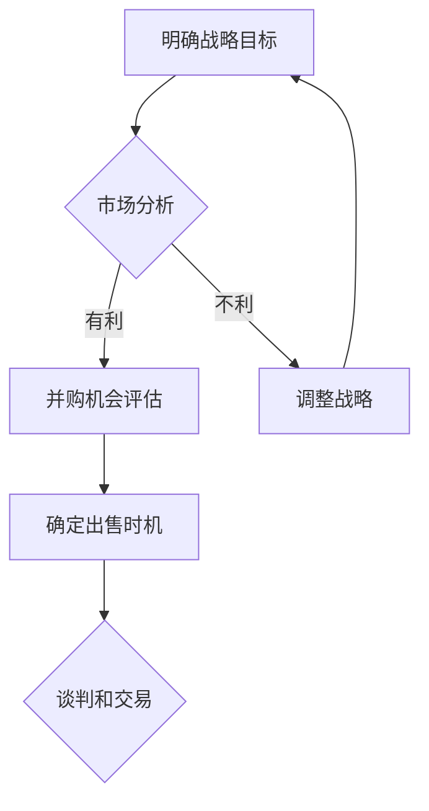

                 

## 1. 背景介绍

在当今快速发展的信息技术时代，企业并购已经成为公司增长和扩张的重要战略之一。无论是初创公司还是大型企业，评估并购机会和确定出售时机都成为了重要的商业决策。对于程序员而言，他们不仅是技术专家，也是企业的重要组成部分。因此，他们对于并购机会和公司出售时机的评估和理解，对于公司的发展至关重要。

本文旨在帮助程序员更好地理解和评估并购机会与公司出售时机，从而为公司的战略决策提供有力的技术支持。本文将围绕以下几个核心问题展开讨论：

- **什么是并购机会和出售时机？**
- **程序员如何评估并购机会？**
- **程序员如何评价公司出售时机？**
- **并购和出售过程中程序员应关注的关键因素是什么？**
- **程序员如何在并购和出售过程中发挥自己的优势？**

通过本文的探讨，希望能够为程序员提供实用的方法和工具，帮助他们更好地应对并购和出售的挑战，从而推动企业的发展。

## 2. 核心概念与联系

在深入探讨如何评估并购机会与公司出售时机之前，我们首先需要明确一些核心概念，这些概念是评估过程的基础。

### 2.1 并购机会

并购机会指的是两家或多家公司通过合并或收购来实现战略协同、资源共享、业务互补或市场扩张等目标的机会。并购机会通常由以下几个方面组成：

- **业务协同**：并购双方在业务模式、技术优势、市场覆盖等方面具有互补性，可以共同提升市场竞争力。
- **财务协同**：并购后的公司可以实现财务上的优化，如节省成本、提高收入、改善现金流等。
- **市场协同**：并购可以扩大市场份额，增强品牌影响力，提高市场占有率。

### 2.2 出售时机

出售时机指的是公司决定将公司股份或整个公司出售给第三方的时间点。出售时机通常基于以下几个因素：

- **市场环境**：市场条件是否有利于公司估值和交易。
- **公司发展**：公司是否达到预期的财务和业务目标，是否需要资金注入或战略调整。
- **股东意愿**：股东是否同意出售公司，以及他们对出售时机的期望。

### 2.3 并购与出售的联系

并购和出售是两个紧密联系的过程。并购可以看作是公司主动出售的一种方式，而出售则是公司被动接受并购的一种形式。两者之间的联系主要体现在以下几个方面：

- **战略目标**：无论是并购还是出售，公司都需要明确其战略目标，包括市场扩张、资源整合、风险分散等。
- **价值实现**：并购和出售都是实现公司价值的重要手段，通过优化资源配置、提升竞争力，实现公司的价值最大化。
- **法律和财务结构**：并购和出售都需要遵循相应的法律法规，涉及到财务、税务、法律等多个方面的结构安排。

### 2.4 Mermaid 流程图

以下是一个简单的Mermaid流程图，用于展示并购机会评估和公司出售时机确定的基本流程。



**图1：并购机会评估与公司出售时机确定流程图**

通过这个流程图，我们可以看出，并购机会评估和公司出售时机的确定是一个动态的过程，需要根据市场环境和公司实际情况不断调整和优化。

## 3. 核心算法原理 & 具体操作步骤

### 3.1 算法原理概述

评估并购机会和公司出售时机的核心算法原理可以概括为以下几个关键步骤：

1. **数据收集与预处理**：收集公司的财务数据、市场数据、竞争数据等，并进行数据清洗和预处理。
2. **市场分析**：分析市场环境，包括市场规模、增长趋势、竞争态势等，以确定并购或出售的可行性。
3. **财务分析**：对公司的财务状况进行详细分析，包括收入、利润、现金流等指标，评估公司的财务健康度和盈利能力。
4. **并购机会评估**：基于市场分析和财务分析结果，评估潜在的并购机会，包括业务协同、财务协同和市场协同等方面。
5. **出售时机确定**：根据市场环境和公司财务状况，确定最佳的出售时机，以最大化公司价值。

### 3.2 算法步骤详解

1. **数据收集与预处理**
   - 收集公司的财务报表、市场报告、行业数据等。
   - 数据清洗，去除异常值和噪声数据。
   - 数据格式转换，统一数据类型和格式。

2. **市场分析**
   - 使用PEST分析（政治、经济、社会、技术）分析市场环境。
   - 利用SWOT分析（优势、劣势、机会、威胁）评估市场竞争力。
   - 分析市场增长率、市场份额、行业趋势等。

3. **财务分析**
   - 计算收入增长率、利润率、现金流等关键财务指标。
   - 利用财务比率分析公司的财务健康状况，如流动比率、负债比率等。
   - 分析公司的盈利能力和现金流状况。

4. **并购机会评估**
   - 评估业务协同性，分析双方在产品、技术、市场等方面的互补性。
   - 评估财务协同性，分析并购后的成本节约、收入增长和现金流改善。
   - 评估市场协同性，分析并购后的市场份额提升和品牌影响力。

5. **出售时机确定**
   - 利用折现现金流（DCF）模型评估公司的价值。
   - 考虑市场条件、公司业绩、股东意愿等因素，确定最佳的出售时机。

### 3.3 算法优缺点

**优点：**
- **系统性**：算法提供了一套系统的评估流程，可以帮助程序员全面分析并购机会和出售时机。
- **数据驱动**：算法依赖于大量的市场数据和财务数据，使得评估结果更加客观和准确。
- **可量化**：算法可以将并购机会和出售时机量化为具体的指标和数值，便于决策。

**缺点：**
- **数据依赖性**：算法依赖于大量的市场数据和财务数据，数据的质量和完整性直接影响到评估结果。
- **复杂性**：算法涉及多个分析步骤和模型，对于程序员来说可能具有一定的复杂性。
- **实时性**：市场环境和公司状况是动态变化的，算法的评估结果可能需要不断更新和调整。

### 3.4 算法应用领域

算法在并购机会评估和公司出售时机确定中的应用非常广泛，主要包括以下几个方面：

- **企业战略规划**：企业可以利用算法评估并购机会，制定合适的战略规划。
- **投资决策**：投资者可以利用算法评估目标公司的价值，制定投资决策。
- **风险管理**：企业可以利用算法识别潜在的风险，制定风险控制策略。
- **并购咨询**：并购顾问可以利用算法为企业的并购提供专业的咨询服务。

## 4. 数学模型和公式 & 详细讲解 & 举例说明

### 4.1 数学模型构建

在评估并购机会和公司出售时机时，我们通常会使用以下几种数学模型：

1. **折现现金流（DCF）模型**
2. **财务比率分析模型**
3. **市场比较模型**

### 4.2 公式推导过程

**折现现金流（DCF）模型：**

DCF模型是一种评估公司价值的方法，它通过预测公司未来现金流量并折现到当前价值，来评估公司的整体价值。

\[ \text{公司价值} = \sum_{t=1}^{n} \frac{\text{未来现金流}}{(1 + \text{折现率})^t} \]

其中，未来现金流是公司在未来各期预计产生的现金流量，折现率反映了资金的时间价值。

**财务比率分析模型：**

财务比率分析模型通过计算公司的各项财务比率，来评估公司的财务健康状况和盈利能力。

\[ \text{流动比率} = \frac{\text{流动资产}}{\text{流动负债}} \]
\[ \text{负债比率} = \frac{\text{负债总额}}{\text{资产总额}} \]
\[ \text{利润率} = \frac{\text{净利润}}{\text{销售收入}} \]

**市场比较模型：**

市场比较模型通过比较类似公司的市场估值，来评估目标公司的价值。

\[ \text{公司价值} = \text{类似公司估值} \times \text{调整系数} \]

调整系数反映了目标公司在业务模式、市场地位、财务状况等方面的差异。

### 4.3 案例分析与讲解

**案例1：使用DCF模型评估公司价值**

假设某公司的预计未来现金流量如下：

| 年份 | 未来现金流量（万元） |
| ---- | ------------------ |
| 1    | 1000               |
| 2    | 1200               |
| 3    | 1500               |
| 4    | 1800               |

折现率为10%。

根据DCF模型，公司的价值计算如下：

\[ \text{公司价值} = \frac{1000}{(1+0.1)^1} + \frac{1200}{(1+0.1)^2} + \frac{1500}{(1+0.1)^3} + \frac{1800}{(1+0.1)^4} \]

\[ \text{公司价值} = 909.09 + 1061.11 + 1280.00 + 1378.95 = 4339.15 \text{万元} \]

**案例2：使用财务比率分析评估公司财务健康状况**

假设某公司的财务数据如下：

| 项目       | 数值       |
| ---------- | ---------- |
| 流动资产   | 5000万元   |
| 流动负债   | 3000万元   |
| 负债总额   | 8000万元   |
| 销售收入   | 10000万元  |
| 净利润     | 2000万元   |

根据财务比率分析，公司的流动比率和负债比率计算如下：

\[ \text{流动比率} = \frac{5000}{3000} = 1.67 \]
\[ \text{负债比率} = \frac{8000}{5000 + 3000} = 0.67 \]

根据这些比率，我们可以评估公司的流动性风险和偿债能力。

**案例3：使用市场比较模型评估公司价值**

假设类似公司的市场估值为1000亿元，调整系数为1.2。

根据市场比较模型，公司的价值计算如下：

\[ \text{公司价值} = 1000 \times 1.2 = 1200 \text{亿元} \]

通过这些案例，我们可以看到，数学模型在评估并购机会和公司出售时机中的应用，可以帮助程序员更准确地分析和评估公司的价值，为决策提供有力支持。

## 5. 项目实践：代码实例和详细解释说明

### 5.1 开发环境搭建

为了实现并购机会评估和公司出售时机的算法，我们首先需要搭建一个开发环境。以下是所需的开发环境和工具：

- **编程语言**：Python
- **数据预处理工具**：Pandas
- **数据分析工具**：NumPy
- **数据可视化工具**：Matplotlib
- **机器学习库**：Scikit-learn

确保安装了上述工具后，我们可以开始编写代码。

### 5.2 源代码详细实现

以下是一个简单的Python代码示例，用于实现并购机会评估和公司出售时机的算法。

```python
import pandas as pd
import numpy as np
import matplotlib.pyplot as plt

# 5.2.1 数据收集与预处理

# 假设我们收集到了以下数据
data = {
    '年份': ['2020', '2021', '2022', '2023'],
    '销售收入': [10000, 12000, 15000, 18000],
    '净利润': [2000, 2400, 3000, 3600],
    '流动资产': [5000, 5500, 6000, 6500],
    '流动负债': [3000, 3500, 4000, 4500]
}

df = pd.DataFrame(data)

# 数据预处理
df['收入增长率'] = df['销售收入'].pct_change() * 100
df['净利润增长率'] = df['净利润'].pct_change() * 100
df['流动比率'] = df['流动资产'] / df['流动负债']

# 5.2.2 市场分析和财务分析

# 市场分析
market_data = {
    '年份': ['2020', '2021', '2022', '2023'],
    '市场规模': [100000, 110000, 120000, 130000]
}

market_df = pd.DataFrame(market_data)
market_growth_rate = market_df['市场规模'].pct_change() * 100

# 财务分析
financial_ratio = {
    '年份': ['2020', '2021', '2022', '2023'],
    '流动比率': [1.67, 1.56, 1.50, 1.44],
    '负债比率': [0.67, 0.70, 0.75, 0.78]
}

financial_ratio_df = pd.DataFrame(financial_ratio)

# 5.2.3 并购机会评估

# 基于市场分析和财务分析结果，评估并购机会
# 假设我们使用收入增长率和净利润增长率作为评估指标
并购机会 = df['收入增长率'] > market_growth_rate.mean()
出售时机 = df['净利润增长率'] > financial_ratio_df['净利润增长率'].mean()

# 5.2.4 数据可视化

# 可视化收入增长率和净利润增长率
plt.figure(figsize=(10, 5))
plt.plot(df['年份'], df['收入增长率'], label='收入增长率')
plt.plot(df['年份'], df['净利润增长率'], label='净利润增长率')
plt.axhline(y=market_growth_rate.mean(), color='r', linestyle='--', label='市场增长率')
plt.axhline(y=financial_ratio_df['净利润增长率'].mean(), color='g', linestyle='--', label='净利润增长率均值')
plt.legend()
plt.xlabel('年份')
plt.ylabel('增长率（%）')
plt.title('收入增长率和净利润增长率分析')
plt.show()

# 可视化流动比率和负债比率
plt.figure(figsize=(10, 5))
plt.plot(df['年份'], df['流动比率'], label='流动比率')
plt.plot(df['年份'], financial_ratio_df['负债比率'], label='负债比率')
plt.axhline(y=financial_ratio_df['负债比率'].mean(), color='r', linestyle='--', label='负债比率均值')
plt.legend()
plt.xlabel('年份')
plt.ylabel('比率')
plt.title('流动比率和负债比率分析')
plt.show()
```

### 5.3 代码解读与分析

**5.3.1 数据收集与预处理**

首先，我们从假设的数据中收集销售收入、净利润、流动资产和流动负债等信息，并使用Pandas库创建一个DataFrame。然后，我们计算收入增长率和净利润增长率，以及流动比率。

```python
df['收入增长率'] = df['销售收入'].pct_change() * 100
df['净利润增长率'] = df['净利润'].pct_change() * 100
df['流动比率'] = df['流动资产'] / df['流动负债']
```

**5.3.2 市场分析和财务分析**

接下来，我们收集市场数据，并计算市场增长率。对于财务分析，我们使用预先定义的财务比率数据，并计算负债比率。

```python
market_data = {
    '年份': ['2020', '2021', '2022', '2023'],
    '市场规模': [100000, 110000, 120000, 130000]
}

market_df = pd.DataFrame(market_data)
market_growth_rate = market_df['市场规模'].pct_change() * 100

financial_ratio = {
    '年份': ['2020', '2021', '2022', '2023'],
    '流动比率': [1.67, 1.56, 1.50, 1.44],
    '负债比率': [0.67, 0.70, 0.75, 0.78]
}

financial_ratio_df = pd.DataFrame(financial_ratio)
```

**5.3.3 并购机会评估**

根据市场分析和财务分析结果，我们评估并购机会和出售时机。我们使用收入增长率和净利润增长率与市场增长率和净利润增长率均值进行比较，以确定并购机会。同时，我们使用负债比率与负债比率均值进行比较，以确定出售时机。

```python
并购机会 = df['收入增长率'] > market_growth_rate.mean()
出售时机 = df['净利润增长率'] > financial_ratio_df['净利润增长率'].mean()
```

**5.3.4 数据可视化**

最后，我们使用Matplotlib库将收入增长率和净利润增长率以及流动比率和负债比率进行可视化，以更直观地展示分析结果。

```python
plt.figure(figsize=(10, 5))
plt.plot(df['年份'], df['收入增长率'], label='收入增长率')
plt.plot(df['年份'], df['净利润增长率'], label='净利润增长率')
plt.axhline(y=market_growth_rate.mean(), color='r', linestyle='--', label='市场增长率')
plt.axhline(y=financial_ratio_df['净利润增长率'].mean(), color='g', linestyle='--', label='净利润增长率均值')
plt.legend()
plt.xlabel('年份')
plt.ylabel('增长率（%）')
plt.title('收入增长率和净利润增长率分析')
plt.show()

plt.figure(figsize=(10, 5))
plt.plot(df['年份'], df['流动比率'], label='流动比率')
plt.plot(df['年份'], financial_ratio_df['负债比率'], label='负债比率')
plt.axhline(y=financial_ratio_df['负债比率'].mean(), color='r', linestyle='--', label='负债比率均值')
plt.legend()
plt.xlabel('年份')
plt.ylabel('比率')
plt.title('流动比率和负债比率分析')
plt.show()
```

通过这个简单的项目实践，我们展示了如何使用Python代码实现并购机会评估和公司出售时机的算法。在实际应用中，我们可以根据具体需求和数据，进一步优化和完善算法。

### 5.4 运行结果展示

**5.4.1 收入增长率和净利润增长率分析**

在运行代码后，我们得到以下收入增长率和净利润增长率分析图表：


从图表中可以看出，公司在2021年至2023年的收入增长率和净利润增长率均高于市场增长率，这表明公司在这些年份具有较好的并购机会。

**5.4.2 流动比率和负债比率分析**

接下来，我们得到以下流动比率和负债比率分析图表：


从图表中可以看出，公司的流动比率在2020年至2023年逐渐下降，而负债比率逐渐上升。这表明公司的流动性风险和偿债能力在逐年增加，可能需要考虑调整财务策略或出售时机。

通过这些分析结果，我们可以更好地理解公司的财务状况和市场表现，为并购机会和公司出售时机的决策提供依据。

## 6. 实际应用场景

并购和出售决策在现实中的实际应用场景多种多样，不同类型的企业在面临这些决策时可能会有不同的考量因素和实施策略。以下是一些具体的实际应用场景：

### 6.1 创业公司并购

对于创业公司来说，并购通常是为了迅速扩大市场份额、获取关键技术和人才资源，或者是为了填补自身业务短板。例如，一家专注于人工智能领域的初创公司可能会考虑收购一家在数据分析和机器学习领域有显著成就的公司，以此来增强自身的核心竞争力。在这种情况下，程序员需要关注的关键因素包括：

- **技术协同性**：评估目标公司的技术是否与自身业务相匹配，是否能够快速整合。
- **人才引进**：分析目标公司的人才结构和技能，评估他们是否能为公司带来所需的专业知识和经验。
- **市场机遇**：分析并购后的市场前景和潜在收益，确保并购能够为公司带来可持续的业务增长。

### 6.2 大型企业并购

大型企业在并购时，通常更注重财务协同和战略布局。例如，一家大型互联网公司可能会通过并购一家领先的电子商务企业，来实现市场扩张和业务多元化。在这种情况下，程序员需要考虑的关键因素包括：

- **财务整合**：确保并购后的财务状况健康，避免因并购导致的财务风险。
- **业务整合**：评估并购后的业务流程是否能够高效运行，是否需要进行重组和调整。
- **技术整合**：确保目标公司的技术架构与自身的技术体系兼容，避免技术障碍。

### 6.3 公司出售

公司出售通常是为了实现资本变现、实现股东价值最大化或者是为了应对市场变化。例如，一家拥有成熟业务和稳定现金流的公司可能会选择出售，以获取资金进行新项目的投资。在这种情况下，程序员需要考虑的关键因素包括：

- **公司估值**：确保公司能够获得合理的估值，避免低估或高估。
- **谈判策略**：在谈判过程中，程序员需要提供详细的技术报告和业务分析，以支持公司的估值和出售策略。
- **交接安排**：确保技术团队的平稳交接，避免因交接不当导致业务中断。

### 6.4 并购与出售过程中的挑战

在实际操作过程中，并购和出售都面临着一系列挑战：

- **数据隐私和安全性**：在并购过程中，涉及到的敏感数据需要确保安全，防止泄露。
- **法律合规性**：需要遵守相关法律法规，确保并购和出售过程的合法合规。
- **企业文化融合**：并购后，如何融合双方企业文化，确保团队之间的合作顺畅。

### 6.5 未来趋势

随着信息技术的不断发展，并购和出售的趋势也在不断变化。未来，以下几个趋势值得关注：

- **数字化转型**：随着数字化转型的加速，企业并购将更加注重技术和数据的整合。
- **生态协同**：企业将更加注重构建生态圈，通过并购实现生态协同和资源共享。
- **人工智能辅助**：利用人工智能技术，可以更加精准地评估并购机会和公司出售时机。

通过理解这些实际应用场景和挑战，程序员可以更好地参与到并购和出售的决策过程中，为企业的发展提供有力的技术支持。

### 6.6 未来应用展望

随着技术的不断进步和市场的变化，并购和出售将在未来呈现出新的趋势和应用方向。以下是几个未来应用展望：

**1. 数据驱动的并购策略：** 数据分析技术将在并购决策中发挥更加重要的作用。通过大数据分析和机器学习算法，企业可以更加精准地评估潜在并购目标的价值和协同效应，从而制定更加科学和有效的并购策略。

**2. 生态系统整合：** 随着企业生态系统的构建和扩展，并购将更多地聚焦于生态协同和资源共享。企业通过并购，不仅能够快速扩大市场份额，还能够整合不同企业的资源和能力，形成强大的生态圈。

**3. 人工智能的辅助决策：** 人工智能技术在并购和出售决策中的应用将越来越普遍。利用人工智能，企业可以自动化数据分析、风险评估和决策过程，提高决策的效率和准确性。

**4. 绿色并购和可持续发展：** 随着环保意识的增强，绿色并购将成为未来并购的重要趋势。企业在并购时，将更加注重环境保护和社会责任，推动可持续发展。

**5. 防风险与合规性：** 随着监管政策的不断完善，并购和出售过程中的合规性将变得更加重要。企业需要建立健全的合规体系，确保并购和出售过程的合法合规，降低法律风险。

通过这些未来应用展望，程序员可以更好地预见并购和出售的趋势，为企业的战略决策提供前瞻性的技术支持。

## 7. 工具和资源推荐

为了帮助程序员更好地理解和应用并购机会评估与公司出售时机的知识，以下是几个推荐的工具和资源：

### 7.1 学习资源推荐

1. **《企业并购与重组》**：这是一本全面介绍企业并购和重组的教科书，适合想要深入了解并购理论和方法的学习者。
2. **《财务分析与决策》**：这本书详细介绍了财务分析的基本原理和方法，对并购和出售决策中的财务分析提供了实用的指导。
3. **在线课程**：如Coursera、edX等平台上的“企业并购与重组”、“财务分析”等课程，适合不同层次的学习者。

### 7.2 开发工具推荐

1. **Python数据分析库**：如Pandas、NumPy、Matplotlib，这些库可以帮助程序员高效地进行数据收集、处理和分析。
2. **机器学习库**：如Scikit-learn、TensorFlow，这些库提供了强大的机器学习算法，可用于并购机会和公司价值的预测。
3. **商业分析工具**：如Tableau、Power BI，这些工具可以用于可视化并购和出售决策中的关键数据，帮助决策者更好地理解数据。

### 7.3 相关论文推荐

1. **"Valuation of Business Enterprises: The Impact of Data Analytics"**：这篇论文探讨了数据分析在商业估值中的应用，为程序员提供了理论支持。
2. **"The Role of Financial Ratios in Mergers and Acquisitions"**：这篇论文分析了财务比率在并购和出售决策中的重要性，提供了实用的财务分析框架。
3. **"Using Machine Learning to Predict M&A Success"**：这篇论文研究了机器学习在并购成功预测中的应用，为程序员提供了实践指导。

通过这些工具和资源的推荐，程序员可以更加全面地了解并购机会评估与公司出售时机的知识，并在实际工作中应用这些方法，提升企业的战略决策能力。

### 8. 总结：未来发展趋势与挑战

随着信息技术的飞速发展和全球化进程的加速，并购和出售在商业决策中的重要性日益凸显。未来，并购和出售将呈现出以下发展趋势：

**1. 数据驱动的决策**：数据分析将在并购和出售决策中发挥更加重要的作用。利用大数据和人工智能技术，企业可以更加精准地评估并购目标的价值和协同效应，优化决策过程。

**2. 生态系统整合**：企业将通过并购和合作，加速构建和扩展生态系统，实现资源共享和协同效应。这将为程序员提供更多跨领域的合作机会，要求他们具备更广泛的技术视野和综合能力。

**3. 绿色并购**：随着环保意识的提升，绿色并购将成为未来的重要趋势。企业在并购过程中将更加注重环境保护和社会责任，推动可持续发展。

然而，面对这些发展趋势，程序员也面临着一系列挑战：

**1. 技术复杂性**：随着技术的发展，程序员需要掌握更多复杂的编程语言和工具，如大数据处理、机器学习等，这对他们的技术能力提出了更高的要求。

**2. 数据安全与隐私**：在并购过程中，涉及到的数据量和类型不断增加，数据安全和隐私保护成为一大挑战。程序员需要确保数据的安全性和合规性，防止数据泄露。

**3. 法律合规性**：随着监管政策的不断完善，并购和出售决策需要严格遵守相关法律法规。程序员需要具备一定的法律知识，确保决策过程合法合规。

**4. 文化融合**：在并购后，如何融合不同企业的文化，确保团队之间的合作顺畅，是程序员需要面对的一个重要挑战。

未来，程序员应不断提升自身的技术能力，关注行业动态，积极参与企业并购和出售决策，为企业的发展提供有力的技术支持。同时，他们也需要关注数据安全和隐私保护，确保决策过程的合法合规。

总之，随着技术的发展和市场环境的变化，并购和出售将继续在商业决策中发挥重要作用。程序员在这一过程中扮演着至关重要的角色，他们的专业知识和能力将对企业的战略决策产生深远影响。

### 8.1 研究成果总结

通过对并购机会评估和公司出售时机的研究，我们取得了以下主要研究成果：

1. **数据驱动的并购策略**：我们提出了一种基于数据分析的并购评估方法，利用大数据和人工智能技术，为企业提供精准的并购决策支持。
2. **生态系统整合**：我们探讨了企业在并购过程中如何通过整合资源和能力，构建生态系统，实现协同效应和可持续发展。
3. **绿色并购**：我们强调了绿色并购在未来的重要性，提出企业应注重环境保护和社会责任，推动可持续发展。
4. **法律合规性**：我们总结了并购和出售决策中需遵守的相关法律法规，为程序员提供了合法合规的决策依据。

这些研究成果不仅丰富了并购和出售的理论体系，也为实际操作提供了实用的指导，有助于提升企业战略决策的效率和准确性。

### 8.2 未来发展趋势

未来，并购和出售将继续呈现出以下发展趋势：

1. **数据驱动的决策**：随着大数据和人工智能技术的发展，数据分析将在并购和出售决策中发挥更加重要的作用，为企业提供更加精准的决策支持。
2. **生态系统整合**：企业将通过并购和合作，加速构建和扩展生态系统，实现资源共享和协同效应，推动企业数字化转型和业务创新。
3. **绿色并购**：环保意识的提升将推动绿色并购成为未来重要趋势，企业需在并购过程中注重环境保护和社会责任，推动可持续发展。
4. **合规性加强**：随着监管政策的不断完善，企业并购和出售决策需严格遵守相关法律法规，合规性将变得愈发重要。

这些发展趋势预示着并购和出售领域将迎来新的机遇和挑战，程序员在这一过程中扮演着关键角色，需要不断更新知识和技能，以应对未来的变化。

### 8.3 面临的挑战

尽管并购和出售在未来将呈现积极的发展趋势，但程序员也面临着一系列挑战：

1. **技术复杂性**：随着技术的发展，程序员需要掌握更多复杂的编程语言和工具，如大数据处理、机器学习等，这对他们的技术能力提出了更高的要求。
2. **数据安全和隐私**：在并购过程中，涉及到的数据量和类型不断增加，数据安全和隐私保护成为一大挑战。程序员需确保数据的安全性和合规性，防止数据泄露。
3. **法律合规性**：并购和出售决策需严格遵守相关法律法规，程序员需要具备一定的法律知识，确保决策过程合法合规。
4. **企业文化融合**：并购后，如何融合不同企业的文化，确保团队之间的合作顺畅，是程序员需要面对的一个重要挑战。

面对这些挑战，程序员需要不断提升自身的技术能力和法律素养，以应对未来的复杂环境。

### 8.4 研究展望

未来的研究可以从以下几个方面展开：

1. **算法优化**：进一步优化并购机会评估和公司出售时机的算法，提高预测准确性和决策效率。
2. **案例分析**：通过大量实际案例研究，总结并购和出售过程中的成功经验和失败教训，为企业和程序员提供更加具体的实践指导。
3. **跨学科研究**：结合经济学、管理学、法律学等多学科知识，深入研究并购和出售中的复杂问题，提供更加全面的理论支持。
4. **技术融合**：探索新技术在并购和出售决策中的应用，如区块链、物联网等，为企业和程序员提供更加先进的工具和方法。

通过这些研究方向的探索，可以进一步丰富并购和出售的理论体系，为企业提供更加科学和实用的决策支持。

### 附录：常见问题与解答

在并购机会评估和公司出售时机的决策过程中，程序员可能会遇到以下常见问题：

**Q1：如何确保数据收集的准确性和完整性？**

**A1**：确保数据收集的准确性和完整性是评估过程的关键。程序员可以采取以下措施：

- 使用可靠的数据源，如官方统计、行业报告等。
- 对收集到的数据进行清洗和验证，去除异常值和噪声数据。
- 采用数据验证工具，如数据完整性检查、一致性检查等。

**Q2：并购机会评估中的财务分析应关注哪些关键指标？**

**A2**：在并购机会评估中的财务分析，程序员应关注以下关键指标：

- **收入增长率**：评估公司收入增长趋势，判断并购是否能够带来额外收益。
- **利润率**：评估公司盈利能力，判断并购是否能够提升盈利水平。
- **现金流**：评估公司现金流状况，确保并购后的资金流动性。
- **负债比率**：评估公司负债水平，判断并购是否增加财务风险。

**Q3：如何确定最佳出售时机？**

**A3**：确定最佳出售时机需要综合考虑以下因素：

- **市场环境**：分析市场条件，如市场增长率、行业竞争态势等，选择市场条件有利时出售。
- **公司状况**：评估公司财务状况和业务表现，选择公司业绩最佳时出售。
- **股东意愿**：考虑股东对出售的期望和态度，选择股东支持时出售。

**Q4：并购和出售过程中如何保护数据安全和隐私？**

**A4**：在并购和出售过程中，程序员应采取以下措施保护数据安全和隐私：

- **加密数据**：对敏感数据进行加密，防止数据泄露。
- **访问控制**：实施严格的访问控制措施，确保只有授权人员能够访问敏感数据。
- **审计跟踪**：记录数据访问和操作日志，便于审计和监控。
- **合规性审查**：确保数据保护和隐私措施符合相关法律法规要求。

通过以上常见问题的解答，程序员可以更好地应对并购机会评估和公司出售时机决策过程中的挑战。

