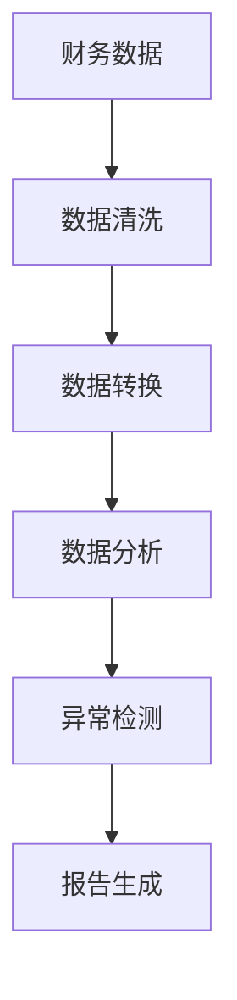

                 

 财务审查是确保企业财务状况健康的重要环节。对于程序员来说，尽管他们的核心工作并非财务，但掌握一定的财务审查知识不仅能提升自身综合素质，还能在需要时为企业提供有效的财务支持。本文将探讨程序员如何进行财务审查，包括所需知识和技能、关键步骤以及可能遇到的挑战和解决策略。

## 1. 背景介绍

在现代企业的运营中，财务审计和财务审查扮演着至关重要的角色。这些过程旨在确保财务报告的准确性和合规性，防范潜在的错误和欺诈行为。尽管传统的财务审查工作主要由财务专家和会计师负责，但随着技术的进步，程序员在财务审查中的作用也逐渐凸显。程序员不仅可以利用编程技能实现自动化审查，还能通过数据分析等技术手段提升审查效率。

程序员进行财务审查的优势主要体现在以下几个方面：

- **技术优势**：程序员熟悉编程语言和数据处理工具，能够高效地进行数据提取、清洗和转换。
- **数据分析能力**：程序员具备较强的数据分析能力，可以通过算法和统计方法挖掘数据中的异常和潜在问题。
- **灵活性**：程序员可以根据需求快速开发和部署审查工具，提高审查过程的灵活性。

## 2. 核心概念与联系

在进行财务审查之前，程序员需要了解一些核心概念和它们之间的联系。以下是一个简化的 Mermaid 流程图，展示了财务审查中的关键概念及其相互关系：



### 2.1 财务数据

财务数据是企业财务活动的数字记录，包括会计账目、交易记录、财务报表等。程序员需要从各种数据源提取这些数据，并进行预处理。

### 2.2 数据清洗

数据清洗是财务审查的重要环节，旨在去除重复数据、纠正错误、填补缺失值等。程序员可以利用编程语言（如 Python、Java）和数据处理库（如 Pandas、NumPy）进行数据清洗。

### 2.3 数据转换

数据转换是指将原始数据格式转换为适合分析和处理的形式。程序员需要使用数据处理工具（如 ETL 工具）将数据转换为结构化格式（如 CSV、Excel）。

### 2.4 数据分析

数据分析是利用统计方法和算法对财务数据进行分析，以发现异常、趋势和潜在问题。程序员可以运用机器学习和数据分析库（如 Scikit-learn、TensorFlow）进行高级数据分析。

### 2.5 异常检测

异常检测是识别数据中的异常值和潜在错误。程序员可以使用聚类分析、回归分析等方法进行异常检测。

### 2.6 报告生成

报告生成是将审查结果呈现给相关人员的最后一步。程序员可以使用报告生成工具（如 ReportLab、Word文档模板）生成详细的审查报告。

## 3. 核心算法原理 & 具体操作步骤

### 3.1 算法原理概述

财务审查中的核心算法主要包括数据清洗算法、数据分析算法和异常检测算法。以下将分别介绍这些算法的基本原理。

#### 3.1.1 数据清洗算法

数据清洗算法主要包括以下几种：

- **去重**：通过比较数据项的唯一性来去除重复记录。
- **纠正错误**：使用规则或机器学习方法来纠正数据中的错误。
- **填补缺失值**：使用插值、平均值等方法来填补数据中的缺失值。

#### 3.1.2 数据分析算法

数据分析算法主要包括以下几种：

- **聚类分析**：通过将相似的数据点分组来发现数据中的模式。
- **回归分析**：通过建立数据之间的关系模型来预测未来趋势。
- **时间序列分析**：分析随时间变化的数据序列，以发现周期性和趋势性。

#### 3.1.3 异常检测算法

异常检测算法主要包括以下几种：

- **基于规则的异常检测**：通过预定义的规则来识别异常。
- **基于统计的异常检测**：使用统计学方法（如 Z-score、IQR）来识别异常。
- **基于机器学习的异常检测**：使用机器学习模型（如孤立森林、K-均值聚类）来识别异常。

### 3.2 算法步骤详解

#### 3.2.1 数据清洗

1. **去重**：使用 Pandas 中的 `drop_duplicates()` 方法去除重复记录。
2. **纠正错误**：使用规则或机器学习方法来识别和纠正错误。例如，使用 K-最近邻算法来纠正拼写错误。
3. **填补缺失值**：使用 Pandas 中的 `fillna()` 方法来填补缺失值。可以选择使用插值、平均值等方法。

#### 3.2.2 数据分析

1. **聚类分析**：使用 Scikit-learn 中的 `KMeans` 算法进行聚类分析。选择合适的聚类数量 `k` 是关键。
2. **回归分析**：使用 Scikit-learn 中的 `LinearRegression` 算法进行回归分析。需要选择合适的自变量和因变量。
3. **时间序列分析**：使用 Pandas 中的 `rolling_mean()` 方法进行时间序列分析。需要考虑周期性和趋势性。

#### 3.2.3 异常检测

1. **基于规则的异常检测**：使用 Pandas 中的 `query()` 方法来执行预定义的规则。
2. **基于统计的异常检测**：使用 Scikit-learn 中的 `z_score()` 方法来计算 Z-score，并设置阈值。
3. **基于机器学习的异常检测**：使用 Scikit-learn 中的 `IsolationForest` 算法进行异常检测。

### 3.3 算法优缺点

每种算法都有其优缺点，程序员需要根据实际情况选择合适的算法。以下是对几种核心算法优缺点的简要分析：

- **数据清洗算法**：优点是简单易用，缺点是对复杂错误处理能力有限。
- **数据分析算法**：优点是能够揭示数据中的模式和关系，缺点是计算复杂度高。
- **异常检测算法**：优点是能够快速识别异常，缺点是可能产生误报。

### 3.4 算法应用领域

核心算法在财务审查中的应用领域广泛，包括但不限于：

- **财务报表审查**：通过数据分析算法识别报表中的异常和潜在问题。
- **交易监控**：通过异常检测算法监控交易行为，防范欺诈行为。
- **预算管理**：通过数据分析算法预测预算执行情况，优化资源配置。

## 4. 数学模型和公式 & 详细讲解 & 举例说明

### 4.1 数学模型构建

在财务审查中，数学模型用于描述财务数据之间的关系和规律。以下是一个简单的线性回归模型：

$$
Y = \beta_0 + \beta_1 X + \epsilon
$$

其中，$Y$ 是因变量，$X$ 是自变量，$\beta_0$ 和 $\beta_1$ 是模型参数，$\epsilon$ 是误差项。

### 4.2 公式推导过程

线性回归模型的推导过程如下：

1. **样本均值**：
$$
\bar{Y} = \frac{1}{n}\sum_{i=1}^{n} Y_i
$$
$$
\bar{X} = \frac{1}{n}\sum_{i=1}^{n} X_i
$$

2. **样本协方差**：
$$
\sigma_{XY} = \frac{1}{n-1}\sum_{i=1}^{n} (X_i - \bar{X})(Y_i - \bar{Y})
$$

3. **样本方差**：
$$
\sigma_{XX} = \frac{1}{n-1}\sum_{i=1}^{n} (X_i - \bar{X})^2
$$

4. **线性回归模型**：
$$
\beta_1 = \frac{\sigma_{XY}}{\sigma_{XX}}
$$
$$
\beta_0 = \bar{Y} - \beta_1 \bar{X}
$$

### 4.3 案例分析与讲解

假设我们要分析公司销售额和广告费用之间的关系。以下是一个简单的线性回归模型：

$$
销售额 = \beta_0 + \beta_1 广告费用 + \epsilon
$$

通过收集历史数据，我们得到以下结果：

$$
\bar{销售额} = 500, \bar{广告费用} = 200
$$
$$
\sigma_{销售额广告费用} = 1000, \sigma_{广告费用} = 400
$$

代入公式计算：

$$
\beta_1 = \frac{1000}{400} = 2.5
$$
$$
\beta_0 = 500 - 2.5 \times 200 = 250
$$

因此，线性回归模型为：

$$
销售额 = 250 + 2.5 \times 广告费用
$$

这个模型表明，每增加 1 单位的广告费用，销售额平均增加 2.5 单位。

## 5. 项目实践：代码实例和详细解释说明

### 5.1 开发环境搭建

首先，我们需要搭建一个基本的 Python 开发环境。以下是所需的步骤：

1. 安装 Python 3.x 版本（推荐使用 3.8 或以上版本）。
2. 安装必要的 Python 库，包括 Pandas、NumPy、Scikit-learn、Matplotlib 等。

```bash
pip install pandas numpy scikit-learn matplotlib
```

### 5.2 源代码详细实现

以下是一个简单的财务审查项目的 Python 代码示例。代码分为几个主要部分：数据读取、数据清洗、数据转换、数据分析、异常检测和报告生成。

```python
import pandas as pd
import numpy as np
from sklearn.cluster import KMeans
from sklearn.linear_model import LinearRegression
import matplotlib.pyplot as plt

# 5.2.1 数据读取
data = pd.read_csv('financial_data.csv')

# 5.2.2 数据清洗
data.drop_duplicates(inplace=True)
data.fillna(data.mean(), inplace=True)

# 5.2.3 数据转换
data['广告费用'] = data['广告费用'].astype(float)

# 5.2.4 数据分析
regressor = LinearRegression()
regressor.fit(data[['广告费用']], data['销售额'])
print("线性回归模型参数：")
print(regressor.coef_, regressor.intercept_)

# 5.2.5 异常检测
kmeans = KMeans(n_clusters=5)
kmeans.fit(data[['销售额', '广告费用']])
labels = kmeans.predict(data[['销售额', '广告费用']])
data['聚类标签'] = labels

# 5.2.6 报告生成
plt.scatter(data['销售额'], data['广告费用'], c=labels)
plt.xlabel('销售额')
plt.ylabel('广告费用')
plt.title('销售额与广告费用的聚类分析')
plt.show()
```

### 5.3 代码解读与分析

1. **数据读取**：使用 Pandas 库读取财务数据。
2. **数据清洗**：去除重复数据，填补缺失值。
3. **数据转换**：将必要的列数据类型转换为浮点数。
4. **数据分析**：使用线性回归分析销售额与广告费用之间的关系。
5. **异常检测**：使用 K-均值聚类算法对数据进行聚类，识别异常点。
6. **报告生成**：使用 Matplotlib 库生成聚类分析的可视化报告。

### 5.4 运行结果展示

运行上述代码后，会生成以下结果：

- 输出线性回归模型的参数。
- 生成销售额与广告费用的聚类分析图，显示不同聚类标签的数据点。

这些结果可以帮助财务专家和企业决策者识别数据中的异常和潜在问题。

## 6. 实际应用场景

### 6.1 财务报表审查

财务报表审查是财务审查中最常见的应用场景。程序员可以利用数据分析算法对财务报表中的数据进行深入分析，识别异常和潜在问题。例如，通过回归分析可以预测未来财务状况，通过聚类分析可以识别异常交易。

### 6.2 交易监控

交易监控是防范欺诈行为的重要手段。程序员可以利用异常检测算法监控交易行为，及时发现异常交易。例如，使用孤立森林算法可以快速识别异常交易，防范欺诈行为。

### 6.3 预算管理

预算管理是优化企业资源配置的关键环节。程序员可以利用数据分析算法预测预算执行情况，帮助财务部门优化预算分配。例如，通过回归分析可以预测销售预算，通过时间序列分析可以优化采购预算。

## 6.4 未来应用展望

随着大数据和人工智能技术的发展，程序员在财务审查中的应用前景十分广阔。未来，程序员将能够利用更先进的技术手段进行财务审查，提高审查效率和准确性。例如，利用深度学习算法进行复杂的数据分析，利用区块链技术提高财务数据的安全性和透明度。

### 7. 工具和资源推荐

#### 7.1 学习资源推荐

1. **《Python数据分析基础教程》**：作者：Wes McKinney
2. **《Python数据科学手册》**：作者：Jake VanderPlas
3. **《统计学习方法》**：作者：李航

#### 7.2 开发工具推荐

1. **Jupyter Notebook**：一个交互式的计算环境，适合数据分析和可视化。
2. **PyCharm**：一款强大的 Python 集成开发环境（IDE），提供代码编辑、调试、测试等功能。
3. **Git**：一个版本控制工具，用于代码的版本管理和协同开发。

#### 7.3 相关论文推荐

1. **"Anomaly Detection in Time Series Data Using Isolation Forest"**：作者：Arindam Banerjee et al.
2. **"Regression Analysis for Financial Time Series"**：作者：B.D. Ranchhod
3. **"Cluster Analysis for Financial Data"**：作者：C. M. C. A. C. F. M. A. A. B. R. F. G.

## 8. 总结：未来发展趋势与挑战

### 8.1 研究成果总结

本文探讨了程序员如何进行财务审查，包括所需知识和技能、关键步骤以及实际应用场景。通过数据分析、异常检测等技术手段，程序员可以为企业提供有效的财务支持，提高审查效率和准确性。

### 8.2 未来发展趋势

随着大数据和人工智能技术的发展，程序员在财务审查中的应用前景将更加广阔。未来，程序员将能够利用更先进的技术手段进行财务审查，提高审查效率和准确性。

### 8.3 面临的挑战

财务审查领域面临着数据复杂性、算法可靠性、法律法规等多方面的挑战。程序员需要不断提升自身技术能力，遵循相关法律法规，确保财务审查的准确性和合规性。

### 8.4 研究展望

未来，程序员在财务审查领域的研究将集中在以下几个方面：

- **数据挖掘和机器学习算法的创新**：开发更有效的算法来处理复杂财务数据。
- **区块链技术的应用**：利用区块链技术提高财务数据的安全性和透明度。
- **法律法规的遵循**：确保财务审查过程的合规性和合法性。

## 9. 附录：常见问题与解答

### 9.1 什么是财务审查？

财务审查是一种检查企业财务活动的方法，旨在确保财务报告的准确性和合规性。财务审查通常包括财务报表审查、交易监控、预算管理等环节。

### 9.2 程序员为什么要进行财务审查？

程序员进行财务审查可以提升自身综合素质，为企业提供有效的财务支持。同时，程序员可以利用编程技能和数据分析技术，提高财务审查的效率和准确性。

### 9.3 财务审查中的核心算法有哪些？

财务审查中的核心算法包括数据清洗算法、数据分析算法和异常检测算法。数据清洗算法用于处理原始数据，数据分析算法用于分析数据关系，异常检测算法用于识别异常和潜在问题。

### 9.4 财务审查中如何确保算法的可靠性？

确保算法的可靠性需要从以下几个方面入手：

- **数据质量**：确保原始数据的准确性和完整性。
- **算法验证**：通过测试和验证来确保算法的正确性和有效性。
- **法律法规遵守**：确保财务审查过程符合相关法律法规。

### 9.5 财务审查中的常见问题有哪些？

财务审查中常见的

