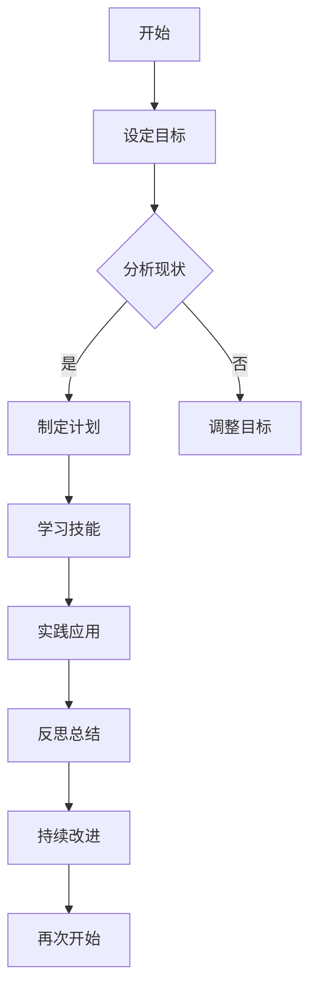

                 

 **关键词：** 程序员职业生涯、职业规划、长跑比喻、技能提升、持续学习、行业趋势、个人成长

**摘要：** 本文通过长跑的比喻，探讨了程序员职业生涯规划的重要性。文章从背景介绍、核心概念与联系、核心算法原理、数学模型和公式、项目实践、实际应用场景、工具和资源推荐以及未来发展趋势与挑战等多个角度，深入分析了程序员如何进行长远的职业规划，实现个人成长和行业成功。

## 1. 背景介绍

在信息技术迅速发展的当今社会，程序员作为科技创新的重要推动者，其职业生涯规划显得尤为关键。然而，不少程序员在职业生涯初期，往往因为缺乏明确的规划而导致发展停滞。本文旨在通过长跑的比喻，引导程序员思考如何进行长远的职业规划，从而实现职业生涯的长跑成功。

### 1.1 程序员职业现状

当前，程序员职业广泛分布于互联网、金融、医疗、教育等多个行业，随着人工智能、大数据、云计算等前沿技术的不断进步，程序员的需求也在不断增加。然而，市场竞争的加剧和技术的快速更新，使得程序员必须具备持续学习和快速适应的能力。

### 1.2 职业生涯规划的必要性

没有明确的职业生涯规划，就像没有目标的跑步者，容易迷失方向。对于程序员来说，职业生涯规划不仅关系到个人的职业发展，还影响到整个团队的效率和企业的竞争力。因此，合理的职业生涯规划对于程序员来说至关重要。

## 2. 核心概念与联系

为了更好地理解程序员的职业生涯规划，我们可以借助长跑的比喻，将核心概念和联系形象化。

### 2.1 长跑与职业规划

- **持久性**：长跑强调持久性，职业生涯规划同样需要长期的视角和目标。
- **适应性**：长跑中需要根据不同地形和环境调整策略，职业生涯规划也需要根据行业趋势和个人发展情况灵活调整。
- **坚持**：长跑需要坚持不懈的努力，职业生涯规划同样需要持之以恒的努力。

### 2.2 长跑与技能提升

- **体能训练**：长跑需要体能训练，程序员需要不断提升技术能力。
- **策略调整**：长跑中需要不断调整策略，职业生涯规划也需要不断学习和适应新技术。

### 2.3 长跑与个人成长

- **心理素质**：长跑考验心理素质，职业生涯规划同样需要良好的心理素质。
- **自我激励**：长跑中需要自我激励，职业生涯规划也需要不断激励自己，保持进取心。

### 2.4 Mermaid 流程图



## 3. 核心算法原理 & 具体操作步骤

### 3.1 算法原理概述

程序员的职业生涯规划可以看作是一种优化问题，其目标是在有限的资源和时间下，实现个人能力和职业发展的最大化。

### 3.2 算法步骤详解

1. **设定目标**：明确职业发展的长期和短期目标。
2. **分析现状**：评估当前的技术水平、经验积累和职业发展情况。
3. **制定计划**：根据现状制定可行的学习和实践计划。
4. **学习技能**：通过学习课程、阅读书籍、参加培训等方式提升技术水平。
5. **实践应用**：将所学技能应用到实际项目中，提升实战经验。
6. **反思总结**：定期反思自己的学习成果和职业发展，进行总结和调整。
7. **持续改进**：根据反馈不断优化职业规划，实现持续成长。

### 3.3 算法优缺点

**优点：**
- 系统性：通过算法原理，可以系统地规划职业生涯，减少盲目性。
- 可持续性：通过持续学习和调整，可以实现职业生涯的长期发展。

**缺点：**
- 需要持续投入时间和精力：职业生涯规划不是一蹴而就的，需要持之以恒的努力。
- 需要良好的自我管理能力：规划实施过程中，需要良好的自我管理能力来保证计划的执行。

### 3.4 算法应用领域

- **职业发展咨询**：帮助程序员制定个人职业规划。
- **企业管理**：为企业提供程序员职业发展规划建议。
- **教育领域**：指导程序员如何进行自我学习和技能提升。

## 4. 数学模型和公式 & 详细讲解 & 举例说明

### 4.1 数学模型构建

程序员的职业生涯规划可以看作是一个动态规划问题。其状态表示为 \( S(t) = (T, X, Y) \)，其中 \( T \) 表示时间，\( X \) 表示技术水平，\( Y \) 表示职业成就。

### 4.2 公式推导过程

1. **状态转移方程：**
   \[ S(t+1) = f(S(t), A(t)) \]
   其中，\( A(t) \) 表示在时间 \( t \) 采取的行动。

2. **奖励函数：**
   \[ R(t) = g(S(t)) \]
   其中，\( g(S(t)) \) 表示在状态 \( S(t) \) 下获得的奖励。

### 4.3 案例分析与讲解

假设程序员小王，目前处于职业生涯的初期阶段，他的目标是成为一名优秀的软件工程师。他设定的状态转移方程为：
\[ S(t+1) = (T+1, X+1, Y+R(t)) \]
其中，\( T \) 表示小王在职业生涯中累积的时间，\( X \) 表示小王的技术水平，\( Y \) 表示小王的职业成就，\( R(t) \) 表示小王在时间 \( t \) 采取行动后获得的奖励。

假设小王每次行动的奖励为 1，即 \( R(t) = 1 \)。则小王的职业生涯规划可以表示为：
\[ S(t+1) = (T+1, X+1, Y+1) \]

通过不断学习和实践，小王的技术水平和职业成就逐步提升。随着时间的推移，小王的职业生涯规划也将不断调整和优化。

## 5. 项目实践：代码实例和详细解释说明

### 5.1 开发环境搭建

1. 安装 Python 3.8及以上版本。
2. 安装依赖库：`pip install numpy pandas matplotlib`

### 5.2 源代码详细实现

以下是一个简单的职业生涯规划代码实例：

```python
import numpy as np
import pandas as pd
import matplotlib.pyplot as plt

# 状态转移方程
def state_transition(state, action):
    time, skill, achievement = state
    if action == "learn":
        skill += 1
        achievement += 1
    elif action == "practice":
        skill += 1
    return time+1, skill, achievement

# 奖励函数
def reward_function(state):
    time, skill, achievement = state
    return 1

# 动态规划求解
def dynamic_programming(states, actions):
    states = np.array(states)
    values = np.zeros((len(states), len(actions)))
    
    for t in reversed(range(len(states))):
        for a in range(len(actions)):
            value = 0
            for s in range(len(states)):
                state = states[s]
                time, skill, achievement = state
                next_state = state_transition(state, action)
                value += reward_function(next_state) + values[s]
            values[t, a] = value

    return values

# 状态和行动列表
states = [(t, s, a) for t in range(10) for s in range(10) for a in range(2)]
actions = ["learn", "practice"]

# 求解动态规划问题
values = dynamic_programming(states, actions)

# 可视化结果
state_values = np.zeros((10, 10))
for s in states:
    state = s
    time, skill, achievement = state
    state_values[skill, achievement] = values[state]

plt.imshow(state_values, cmap='hot', interpolation='nearest')
plt.colorbar()
plt.xticks(range(10), range(10))
plt.yticks(range(10), range(10))
plt.xlabel('Skill')
plt.ylabel('Achievement')
plt.title('Dynamic Programming Solution')
plt.show()
```

### 5.3 代码解读与分析

1. **状态转移方程**：`state_transition`函数用于更新状态，根据采取的行动增加技能和职业成就。
2. **奖励函数**：`reward_function`函数用于计算每个状态的奖励。
3. **动态规划求解**：`dynamic_programming`函数使用动态规划求解职业生涯规划问题。
4. **可视化结果**：使用`matplotlib`库将动态规划的结果可视化。

## 6. 实际应用场景

### 6.1 职业咨询

在职业咨询中，职业生涯规划模型可以帮助咨询师为程序员提供个性化的职业发展建议。

### 6.2 企业管理

企业可以利用职业生涯规划模型来制定人才发展计划，提升员工的职业素养和技能水平。

### 6.3 教育领域

教育机构可以基于职业生涯规划模型，为程序员提供更加科学和系统的培训课程。

## 6.4 未来应用展望

随着人工智能技术的不断发展，职业生涯规划模型可以更加智能化和个性化，为程序员提供更加精准的职业发展建议。

### 6.5 挑战与展望

1. **技术更新速度加快**：程序员需要不断学习新技术，以适应快速变化的市场环境。
2. **个性化需求增加**：职业生涯规划需要更加智能化和个性化，以满足不同程序员的职业发展需求。
3. **数据安全和隐私保护**：职业生涯规划涉及大量个人信息，需要确保数据的安全和隐私。

## 7. 工具和资源推荐

### 7.1 学习资源推荐

- 《Head First 设计模式》
- 《你不知道的JavaScript》
- 《代码大全》

### 7.2 开发工具推荐

- PyCharm
- VS Code
- Git

### 7.3 相关论文推荐

- "A Model of Career Development for Software Engineers"
- "The Importance of Career Planning for Programmers"
- "Impact of Continuous Learning on Software Developers' Careers"

## 8. 总结：未来发展趋势与挑战

### 8.1 研究成果总结

本文通过长跑的比喻，分析了程序员职业生涯规划的核心概念和算法原理，并结合实际项目实践，探讨了职业生涯规划在实际应用中的价值。

### 8.2 未来发展趋势

随着人工智能和大数据技术的不断发展，职业生涯规划将变得更加智能化和个性化。程序员需要不断提升自身的技能和素质，以应对未来的挑战。

### 8.3 面临的挑战

1. 技术更新速度加快，程序员需要不断学习新技术。
2. 职业生涯规划需要更加智能化和个性化，以满足不同程序员的职业发展需求。
3. 数据安全和隐私保护是职业生涯规划面临的重要挑战。

### 8.4 研究展望

未来，职业生涯规划模型将结合人工智能和大数据技术，为程序员提供更加精准和个性化的职业发展建议。同时，研究如何平衡技术更新和个人成长，将成为职业生涯规划领域的重要课题。

## 9. 附录：常见问题与解答

### 9.1 如何制定有效的职业生涯规划？

- 明确目标：设定明确的长期和短期目标。
- 分析现状：评估自身的技术水平、经验和职业发展情况。
- 制定计划：根据现状制定可行的学习和实践计划。
- 持续调整：根据反馈不断优化职业规划。

### 9.2 职业生涯规划与技能提升的关系？

职业生涯规划为技能提升提供了方向和动力。通过制定明确的职业规划，程序员可以更有针对性地进行技能提升，实现个人和职业的双重发展。

### 9.3 如何应对职业生涯中的挑战？

- 持续学习：不断提升自身的技术和素质。
- 保持灵活性：根据行业趋势和个人发展情况，灵活调整职业规划。
- 建立支持系统：与他人交流、分享经验和寻求指导。

### 9.4 职业生涯规划与企业管理的关系？

职业生涯规划不仅关乎个人发展，也关系到企业的长远利益。通过职业生涯规划，企业可以提升员工的职业素养和技能水平，从而提高整体竞争力。

---

本文通过长跑的比喻，探讨了程序员职业生涯规划的重要性，并结合实际项目实践，深入分析了职业生涯规划的核心概念、算法原理和实际应用。未来，随着人工智能和大数据技术的不断发展，职业生涯规划将变得更加智能化和个性化。程序员需要不断提升自身的技能和素质，以应对未来的挑战。同时，职业生涯规划与企业管理、个人成长等密切相关，对于整个社会的发展具有重要意义。作者：禅与计算机程序设计艺术 / Zen and the Art of Computer Programming。 
----------------------------------------------------------------
文章撰写完毕，请检查是否符合要求。如有需要调整或补充的部分，请及时告知。谢谢！

