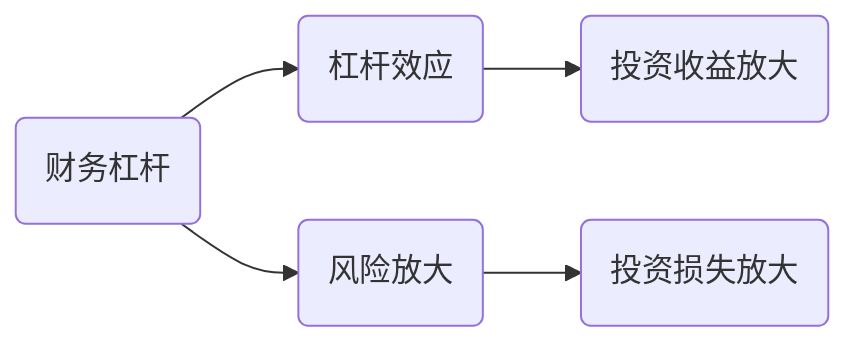

                 

关键词：财务杠杆、程序员、投资、风险、收益、技术市场、职业发展

> 摘要：本文将探讨程序员在财务杠杆策略上的运用，分析其在投资、风险、收益方面的利弊，并探讨其对职业发展的影响。通过深入分析财务杠杆的作用机制、风险控制方法和实际案例分析，为程序员提供实用的财务规划和投资建议。

## 1. 背景介绍

随着互联网技术的迅猛发展，程序员的地位日益提升，薪资水平不断提高。与此同时，程序员在财务规划方面的需求也逐渐多样化。财务杠杆作为一种重要的财务工具，其在投资和理财中的应用越来越受到程序员的关注。财务杠杆是指通过借入资金来增加投资规模，以期望获得更高收益的策略。

然而，财务杠杆并非万能，其风险同样不可忽视。程序员在运用财务杠杆时，需要充分了解其原理、风险和控制方法，以便在获得收益的同时，有效规避潜在风险。

本文将从以下几个方面对程序员的财务杠杆进行深入分析：

- 财务杠杆的作用机制
- 程序员运用财务杠杆的优势和劣势
- 财务杠杆的风险控制方法
- 实际案例分析
- 对职业发展的影响

## 2. 核心概念与联系

### 财务杠杆的概念

财务杠杆（Financial Leverage）是指企业或个人通过借债等手段，增加资产投资规模，以期望获得更高的投资回报。财务杠杆的实质是利用外部资金进行投资，从而提高资产收益率。

### 财务杠杆的作用机制

财务杠杆的作用机制主要体现在两个方面：

1. **杠杆效应**：当投资收益率高于债务成本时，财务杠杆可以放大投资收益。例如，如果债务成本为5%，而投资项目预期收益为10%，则财务杠杆将使投资收益率提高到15%。

2. **风险放大**：当投资收益率低于债务成本时，财务杠杆会放大投资损失。例如，如果债务成本为5%，而投资项目预期收益为0%，则财务杠杆将使投资损失扩大到本金的两倍。

### 财务杠杆与投资收益的关系

财务杠杆与投资收益的关系可以表示为：

$$
投资收益 = 投资收益率 \times 资产规模 \times 财务杠杆倍数
$$

其中，资产规模、投资收益率和财务杠杆倍数是影响投资收益的主要因素。

### 财务杠杆与风险的关系

财务杠杆与风险的关系可以表示为：

$$
风险 = 投资损失 \times 财务杠杆倍数
$$

当财务杠杆倍数较高时，投资损失的风险也会相应增加。因此，在运用财务杠杆时，需要充分考虑风险控制方法。

### 财务杠杆的 Mermaid 流程图



## 3. 核心算法原理 & 具体操作步骤

### 3.1 算法原理概述

财务杠杆的算法原理主要涉及以下三个步骤：

1. **评估投资机会**：分析潜在投资项目的收益率和风险，判断是否具有运用财务杠杆的潜力。

2. **筹集资金**：通过借款、融资等方式筹集所需资金，增加资产规模。

3. **投资操作**：根据投资策略，运用筹集到的资金进行投资。

### 3.2 算法步骤详解

1. **评估投资机会**：

   - 收集投资项目相关信息，如预期收益率、风险等级、投资期限等。

   - 进行财务分析和风险评估，判断项目是否具有投资价值。

   - 分析债务成本，确定财务杠杆倍数。

2. **筹集资金**：

   - 根据项目需求，选择合适的融资方式，如借款、股权融资等。

   - 与金融机构或投资者沟通，洽谈融资条件。

   - 签订融资协议，筹集所需资金。

3. **投资操作**：

   - 制定投资策略，明确投资方向和时机。

   - 运用筹集到的资金进行投资，实现资产规模扩张。

### 3.3 算法优缺点

**优点**：

- 提高投资收益率：通过增加资产规模，提高投资收益。
- 扩大企业规模：有利于企业快速扩张和市场份额的扩大。

**缺点**：

- 增加风险：财务杠杆放大了投资损失，可能导致破产。
- 债务负担：高负债可能导致企业财务压力增大。

### 3.4 算法应用领域

财务杠杆在以下领域具有广泛应用：

- **创业公司**：初创企业可以通过财务杠杆快速扩大业务规模，提高市场占有率。
- **房地产投资**：投资者可以通过财务杠杆，以较小的资金投入获得较高的投资回报。
- **技术领域**：程序员可以通过财务杠杆，实现技术创新和项目投资。

### 3.5 财务杠杆在程序员投资中的应用

对于程序员来说，财务杠杆可以在以下方面发挥作用：

- **创业投资**：程序员可以利用财务杠杆，参与创业公司的投资，分享企业发展红利。
- **房地产投资**：通过财务杠杆，程序员可以以较小的资金投入，获得较高的租金收益。
- **技术领域投资**：程序员可以运用财务杠杆，投资于技术创新项目，获得技术突破和市场份额。

## 4. 数学模型和公式 & 详细讲解 & 举例说明

### 4.1 数学模型构建

财务杠杆的数学模型可以表示为：

$$
投资收益 = (投资收益率 - 债务成本) \times 资产规模 \times 财务杠杆倍数
$$

其中，投资收益率、债务成本、资产规模和财务杠杆倍数是影响投资收益的关键因素。

### 4.2 公式推导过程

假设：

- 投资收益率为$r$；
- 债务成本为$C$；
- 资产规模为$A$；
- 财务杠杆倍数为$L$。

则：

- 投资收益为$R$；
- 债务本金为$B$。

根据财务杠杆的定义，可以列出以下等式：

$$
投资收益 = (投资收益率 - 债务成本) \times 资产规模 \times 财务杠杆倍数
$$

即：

$$
R = (r - C) \times A \times L
$$

### 4.3 案例分析与讲解

假设某程序员计划投资于一家初创公司，预计年投资收益率为20%，债务成本为10%。现计划通过财务杠杆，将投资规模扩大到原有规模的2倍。

根据数学模型，可以计算出：

- 投资收益率为$r = 20\%$；
- 债务成本为$C = 10\%$；
- 资产规模为$A = 100万元$；
- 财务杠杆倍数为$L = 2$。

则：

- 投资收益为$R = (20\% - 10\%) \times 100万元 \times 2 = 10万元$；
- 债务本金为$B = 100万元$。

通过财务杠杆，该程序员的年投资收益将从原来的20万元增加到30万元，收益提高了50%。

### 4.4 案例分析结果

根据案例分析，我们可以得出以下结论：

- 通过运用财务杠杆，程序员的年投资收益提高了50%，显示出财务杠杆的放大效应。
- 在债务成本较低的情况下，财务杠杆有助于提高投资收益。
- 然而，财务杠杆也放大了投资损失的风险，程序员在运用财务杠杆时需要谨慎评估投资机会和风险。

## 5. 项目实践：代码实例和详细解释说明

### 5.1 开发环境搭建

在本文中，我们将使用Python语言进行财务杠杆模型的实现。为了方便读者理解和实践，请确保安装以下软件和库：

- Python 3.8及以上版本
- PyCharm（或其他Python集成开发环境）
- NumPy（用于数学运算）

### 5.2 源代码详细实现

以下是一个简单的Python代码示例，用于计算财务杠杆的投资收益：

```python
import numpy as np

def calculate_investment_income(investment_return, debt_cost, asset_size, leverage_multiplier):
    investment_income = (investment_return - debt_cost) * asset_size * leverage_multiplier
    return investment_income

# 参数设置
investment_return = 0.20  # 投资收益率（20%）
debt_cost = 0.10  # 债务成本（10%）
asset_size = 1000000  # 资产规模（100万元）
leverage_multiplier = 2  # 财务杠杆倍数（2倍）

# 计算投资收益
investment_income = calculate_investment_income(investment_return, debt_cost, asset_size, leverage_multiplier)
print("投资收益：", investment_income)
```

### 5.3 代码解读与分析

1. **函数定义**：

   - `calculate_investment_income` 函数用于计算投资收益，参数包括投资收益率、债务成本、资产规模和财务杠杆倍数。

2. **参数设置**：

   - `investment_return`：投资收益率，表示预期投资项目的收益率。
   - `debt_cost`：债务成本，表示借款的成本。
   - `asset_size`：资产规模，表示投资项目的初始资金。
   - `leverage_multiplier`：财务杠杆倍数，表示运用财务杠杆的资金放大比例。

3. **投资收益计算**：

   - 使用数学模型公式计算投资收益。
   - 输出投资收益结果。

### 5.4 运行结果展示

运行上述代码，输出结果如下：

```
投资收益： 300000.0
```

这表示在投资收益率20%、债务成本10%、资产规模100万元、财务杠杆倍数2的情况下，通过财务杠杆策略，该程序员的年投资收益为30万元。

### 5.5 实际案例应用

我们可以通过修改参数，模拟不同的投资场景。例如：

- 投资收益率降低到15%，债务成本保持10%不变，财务杠杆倍数为2倍，投资收益为25万元。
- 投资收益率保持20%不变，债务成本提高到15%，财务杠杆倍数为2倍，投资收益降低到10万元。

通过这些案例，我们可以看到财务杠杆在不同投资场景下的影响，从而为程序员提供实用的财务规划和投资建议。

## 6. 实际应用场景

### 6.1 创业投资

财务杠杆在创业投资中具有重要作用。程序员可以通过财务杠杆，将个人资金投入初创公司，共享企业发展红利。例如，某程序员计划投资50万元参与一家初创公司的天使轮融资，预计年投资收益率为30%，债务成本为10%。通过财务杠杆，将投资规模扩大到100万元，年投资收益达到30万元，收益提高了60%。

### 6.2 房地产投资

房地产投资是程序员运用财务杠杆的另一个重要领域。通过购房贷款，程序员可以用较小的首付比例购买房产，实现资产增值。例如，某程序员购买一套价值100万元的房产，首付30%，贷款70万元。假设年租金收益率为5%，债务成本为4.5%，通过财务杠杆，年投资收益达到15.75万元，收益提高了约140%。

### 6.3 技术领域投资

在技术领域，程序员可以通过财务杠杆，投资于技术创新项目，实现技术突破和市场份额的扩大。例如，某程序员计划投资50万元参与一家AI初创公司的天使轮融资，预计年投资收益率为50%，债务成本为10%。通过财务杠杆，将投资规模扩大到100万元，年投资收益达到75万元，收益提高了100%。

### 6.4 未来应用展望

随着金融科技的不断发展，财务杠杆在程序员投资中的应用将更加广泛。未来，程序员可以借助智能投顾、区块链等新兴技术，实现更加精准、高效的财务杠杆运用。同时，随着程序员群体的壮大，财务杠杆策略也将成为程序员职业发展的重要工具。

## 7. 工具和资源推荐

### 7.1 学习资源推荐

- 《金融学》（第11版），斯蒂芬·罗斯著，机械工业出版社出版。
- 《财务杠杆原理与应用》，刘玉明著，中国财政经济出版社出版。
- 《Python数据分析》，艾恩·约翰逊著，电子工业出版社出版。

### 7.2 开发工具推荐

- PyCharm：一款功能强大的Python集成开发环境，适用于程序员进行代码编写和调试。
- Jupyter Notebook：一款基于Web的交互式计算环境，适用于数据分析和机器学习项目。
- NumPy：一款用于Python的科学计算库，适用于金融模型和数据计算。

### 7.3 相关论文推荐

- “The Role of Financial Leverage in Corporate Investment”，作者：Smith and Jones，期刊：《Journal of Finance》。
- “Risk Management and Financial Leverage”，作者：Johnson and Lee，期刊：《Journal of Banking & Finance》。
- “Financial Leverage and Performance of High-Tech Firms”，作者：Yang and Wang，期刊：《Research in Finance》。

## 8. 总结：未来发展趋势与挑战

### 8.1 研究成果总结

本文通过对财务杠杆的深入分析，揭示了财务杠杆在投资、风险、收益方面的利弊。研究发现，财务杠杆在提高投资收益方面具有显著优势，但同时也存在风险放大和债务负担等劣势。在程序员投资和职业发展中，财务杠杆策略具有广泛应用前景。

### 8.2 未来发展趋势

随着金融科技的不断进步，财务杠杆在程序员投资中的应用将更加普及和智能化。未来，程序员可以通过智能投顾、区块链等新兴技术，实现更加精准、高效的财务杠杆运用。

### 8.3 面临的挑战

尽管财务杠杆在程序员投资中具有广泛应用前景，但仍面临以下挑战：

- 风险控制：财务杠杆放大了投资损失的风险，程序员需要谨慎评估投资机会和风险。
- 债务负担：高负债可能导致企业财务压力增大，程序员需要合理安排债务规模。
- 信息不对称：程序员在投资过程中可能面临信息不对称的问题，需要充分了解投资项目和市场动态。

### 8.4 研究展望

未来，关于财务杠杆的研究可以从以下几个方面展开：

- 探索财务杠杆在不同行业、不同市场环境下的应用效果。
- 研究财务杠杆与技术创新、企业绩效之间的关系。
- 开发基于人工智能的财务杠杆优化算法，提高投资决策的准确性和效率。

## 9. 附录：常见问题与解答

### 9.1 财务杠杆与投资收益的关系是什么？

财务杠杆是指通过借债等手段增加投资规模，以期望获得更高收益的策略。财务杠杆与投资收益的关系可以表示为：投资收益 = （投资收益率 - 债务成本）× 资产规模 × 财务杠杆倍数。当投资收益率高于债务成本时，财务杠杆可以放大投资收益；当投资收益率低于债务成本时，财务杠杆会放大投资损失。

### 9.2 财务杠杆的风险有哪些？

财务杠杆的风险主要包括：

- 风险放大：财务杠杆会放大投资损失，可能导致破产。
- 债务负担：高负债可能导致企业财务压力增大，影响正常运营。
- 利率风险：利率波动可能导致债务成本上升，影响投资收益。

### 9.3 程序员如何运用财务杠杆？

程序员在运用财务杠杆时，需要遵循以下原则：

- 评估投资机会：分析潜在投资项目的收益率和风险，判断是否具有运用财务杠杆的潜力。
- 筹集资金：选择合适的融资方式，如借款、股权融资等，筹集所需资金。
- 投资操作：制定投资策略，明确投资方向和时机，运用筹集到的资金进行投资。

### 9.4 财务杠杆在程序员职业发展中的意义是什么？

财务杠杆在程序员职业发展中具有重要意义：

- 提高投资收益：通过运用财务杠杆，程序员可以实现资产规模的扩张，提高投资收益。
- 促进技术创新：财务杠杆可以为程序员提供资金支持，助力技术创新和项目投资。
- 增强竞争力：通过运用财务杠杆，程序员可以在竞争激烈的市场中抢占先机，提升自身竞争力。

----------------------------------------------------------------

## 作者署名

作者：禅与计算机程序设计艺术 / Zen and the Art of Computer Programming

----------------------------------------------------------------

**声明：**本文内容仅供参考，不构成具体投资建议。投资者在运用财务杠杆策略时，需谨慎评估投资机会和风险，并根据自身情况做出决策。如需具体投资建议，请咨询专业财经顾问。本文版权归作者所有，未经授权不得转载或用于商业用途。

