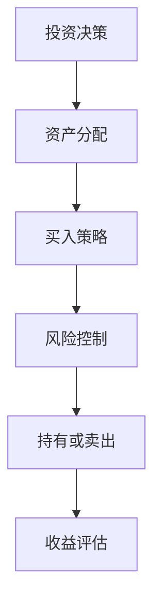

                 

关键词：财务自由，数字资产，投资策略，风险控制，自动化工具

> 摘要：本文旨在探讨程序员如何利用自身的专业知识和技能，通过数字资产管理实现财务自由。文章将详细解析数字资产的投资策略、风险控制方法、以及相关的工具和资源，帮助程序员更好地规划和实现个人财富增长。

## 1. 背景介绍

在当今数字化时代，程序员作为信息技术行业的中坚力量，掌握了大量的编程技能和专业知识。然而，许多程序员在职业生涯中往往会忽视财务管理这一重要环节，导致自己的财务状况并不理想。与此同时，数字资产的兴起为程序员提供了新的投资渠道和财富增长机会。

数字资产是指以数字化形式存在的各种财产，包括加密货币、代币、数字股份等。随着区块链技术的不断发展，数字资产市场呈现出蓬勃发展的态势，吸引了大量的投资者。对于程序员来说，掌握数字资产的投资策略和风险控制方法，不仅可以为自己的财富增值提供新的途径，也有助于实现财务自由。

本文将围绕数字资产投资，探讨以下主题：

1. 数字资产的投资策略
2. 风险控制方法
3. 自动化工具推荐
4. 数字资产管理实践
5. 未来发展趋势

通过本文的阅读，程序员可以了解数字资产投资的原理和方法，掌握风险管理技巧，并学会如何利用自动化工具提高投资效率。希望本文能为程序员的财富自由之路提供有益的指导。

## 2. 核心概念与联系

### 数字资产概述

数字资产是一种以数字形式存在的财产，具有不可篡改、透明性高、流动性强等特点。常见的数字资产包括：

- **加密货币**：如比特币、以太坊等，是去中心化的数字货币。
- **代币**：基于特定区块链平台的数字权益凭证，如ERC-20、ERC-721等。
- **数字股份**：某些公司通过数字股份进行股权融资，投资者可以通过购买数字股份成为公司股东。

### 数字资产投资策略

数字资产投资策略可以分为以下几种：

- **长期持有**：投资者认为某些数字资产具有长期增值潜力，选择持有多年。
- **短期交易**：通过买卖数字资产赚取短期差价，需要较高的市场分析能力和风险承受能力。
- **定投策略**：定期投资一定金额的数字资产，以降低市场波动带来的影响。

### 风险控制方法

数字资产投资风险较大，主要包括市场风险、技术风险、法律风险等。以下是一些常见的风险控制方法：

- **分散投资**：将投资资金分散到多个不同的数字资产中，降低单一资产风险。
- **设置止损**：当数字资产价格下跌到预设的止损位时，自动卖出以减少损失。
- **关注项目背景**：研究数字资产项目的团队、技术、市场前景等，以降低投资风险。
- **资金管理**：合理配置投资资金，避免过度依赖单一投资类型。

### Mermaid 流程图

以下是一个简化的数字资产投资流程图，用于说明数字资产投资的各个环节和核心概念：



### 核心算法原理

在数字资产投资中，核心算法原理主要包括市场数据分析、风险模型评估和交易策略优化等。以下是对这些算法原理的简要概述：

- **市场数据分析**：通过收集历史数据、当前市场行情和新闻事件等信息，分析市场趋势和价格变化。
- **风险模型评估**：根据历史数据和市场情况，构建风险模型，评估不同投资策略的风险和收益。
- **交易策略优化**：结合市场数据和风险模型，制定最优交易策略，实现收益最大化。

## 3. 核心算法原理 & 具体操作步骤

### 3.1 算法原理概述

在数字资产投资中，核心算法原理主要涉及市场数据分析、风险控制和交易策略优化等方面。以下是这些算法原理的概述：

- **市场数据分析**：市场数据分析是数字资产投资的基础。通过收集历史数据、当前市场行情和新闻事件等信息，分析市场趋势和价格变化，为投资决策提供依据。
- **风险模型评估**：风险模型评估是数字资产投资中的关键环节。通过历史数据和市场情况，构建风险模型，评估不同投资策略的风险和收益，帮助投资者制定合理的投资计划。
- **交易策略优化**：交易策略优化是根据市场数据和风险模型，制定最优交易策略的过程。通过优化交易策略，投资者可以实现收益最大化，降低风险。

### 3.2 算法步骤详解

以下是数字资产投资的核心算法步骤详解：

#### 3.2.1 市场数据分析

1. **数据收集**：收集数字资产的历史价格、交易量、市场情绪等相关数据。
2. **数据清洗**：对收集到的数据进行清洗和预处理，确保数据质量。
3. **数据可视化**：通过图表和图形展示数据，帮助投资者了解市场趋势和价格变化。
4. **特征提取**：从数据中提取关键特征，如价格趋势、波动率、交易量等，用于后续分析。

#### 3.2.2 风险模型评估

1. **模型构建**：根据历史数据和特征提取结果，构建风险模型。常用的模型包括ARIMA、GARCH等。
2. **参数优化**：通过优化模型参数，提高模型预测准确性。
3. **风险评估**：使用构建的模型，评估不同投资策略的风险和收益。
4. **风险排序**：根据风险评估结果，对投资策略进行排序，选择最优策略。

#### 3.2.3 交易策略优化

1. **策略设计**：根据市场数据和风险模型，设计交易策略。策略包括买入、持有、卖出等操作。
2. **策略评估**：通过模拟交易，评估策略的收益和风险。
3. **策略优化**：根据策略评估结果，对策略进行调整和优化。
4. **策略执行**：在实际市场中执行优化后的策略，实现投资目标。

### 3.3 算法优缺点

#### 优点

- **精准预测**：通过市场数据分析和风险模型评估，投资者可以更准确地预测市场趋势和价格变化，提高投资收益。
- **降低风险**：风险模型评估和交易策略优化可以帮助投资者规避风险，降低投资损失。
- **灵活调整**：投资者可以根据市场变化和风险模型结果，及时调整投资策略，实现灵活的投资操作。

#### 缺点

- **复杂性**：数字资产投资算法涉及多个环节，包括市场数据分析、风险模型评估和交易策略优化等，对投资者的编程技能和数学基础要求较高。
- **依赖数据质量**：算法的准确性和可靠性取决于数据质量。如果数据不准确或不完整，可能导致错误的投资决策。
- **市场波动性**：数字资产市场波动性较大，算法无法完全预测市场的短期波动，存在一定风险。

### 3.4 算法应用领域

数字资产投资算法广泛应用于以下领域：

- **个人投资**：投资者可以利用算法进行数字资产投资，实现财富增值。
- **量化交易**：量化交易公司通过算法实现高频交易，获取高额收益。
- **风险管理**：金融机构利用算法进行数字资产的风险管理，降低投资风险。
- **资产配置**：投资者根据算法结果进行资产配置，实现风险分散和收益最大化。

## 4. 数学模型和公式 & 详细讲解 & 举例说明

### 4.1 数学模型构建

在数字资产投资中，常用的数学模型包括时间序列模型、风险模型和交易策略模型。以下是对这些模型的构建和推导：

#### 时间序列模型

时间序列模型用于分析数字资产价格的变化趋势。常见的模型包括ARIMA（自回归积分滑动平均模型）和GARCH（广义自回归条件异方差模型）。

**ARIMA模型构建**：

$$
X_t = c + \phi_1 X_{t-1} + \phi_2 X_{t-2} + ... + \phi_p X_{t-p} + \theta_1 e_{t-1} + \theta_2 e_{t-2} + ... + \theta_q e_{t-q}
$$

其中，$X_t$ 表示时间序列数据，$c$ 为常数项，$\phi_1, \phi_2, ..., \phi_p$ 为自回归系数，$\theta_1, \theta_2, ..., \theta_q$ 为移动平均系数，$e_t$ 为白噪声序列。

**GARCH模型构建**：

$$
\sigma_t^2 = \omega + \alpha_1 \epsilon_{t-1}^2 + \beta_1 \sigma_{t-1}^2
$$

$$
\epsilon_t = \frac{r_t - \mu}{\sigma_t}
$$

其中，$\sigma_t^2$ 表示条件方差，$\omega$ 为常数项，$\alpha_1, \beta_1$ 为回归系数，$r_t$ 为残差。

#### 风险模型

风险模型用于评估数字资产投资的风险。常见模型包括VaR（价值在风险）和CVaR（条件价值在风险）。

**VaR模型**：

$$
VaR = \alpha \sum_{i=1}^{N} \mu_i \sigma_i
$$

其中，$\alpha$ 为置信水平，$N$ 为资产数量，$\mu_i$ 和 $\sigma_i$ 分别为资产i的预期收益和标准差。

**CVaR模型**：

$$
CVaR = \alpha \sum_{i=1}^{N} \frac{1}{N} \sum_{j=1}^{N} \mu_j \sigma_j
$$

#### 交易策略模型

交易策略模型用于制定投资策略。常见模型包括基于均值回归的策略、趋势跟踪策略和波动率交易策略。

**基于均值回归的策略**：

$$
X_t = \mu + \sigma Z_t
$$

其中，$X_t$ 为资产价格，$\mu$ 为均值，$\sigma$ 为标准差，$Z_t$ 为随机变量。

**趋势跟踪策略**：

$$
X_t = \alpha X_{t-1} + \beta (1 - \alpha)
$$

其中，$\alpha$ 和 $\beta$ 为系数。

**波动率交易策略**：

$$
X_t = \alpha \sigma_t + \beta (1 - \alpha)
$$

其中，$\sigma_t$ 为波动率。

### 4.2 公式推导过程

以下是时间序列模型ARIMA的推导过程：

1. **自回归部分（AR）**：

$$
X_t = c + \phi_1 X_{t-1} + \phi_2 X_{t-2} + ... + \phi_p X_{t-p}
$$

其中，$\phi_1, \phi_2, ..., \phi_p$ 为自回归系数。

2. **移动平均部分（MA）**：

$$
e_t = \theta_1 e_{t-1} + \theta_2 e_{t-2} + ... + \theta_q e_{t-q}
$$

其中，$\theta_1, \theta_2, ..., \theta_q$ 为移动平均系数。

3. **差分转换**：

为了消除季节性和趋势性，对时间序列进行差分转换：

$$
d_t = X_t - X_{t-1}
$$

4. **合并自回归和移动平均**：

$$
X_t = c + \phi_1 X_{t-1} + \phi_2 X_{t-2} + ... + \phi_p X_{t-p} + \theta_1 e_{t-1} + \theta_2 e_{t-2} + ... + \theta_q e_{t-q}
$$

5. **最小二乘估计**：

通过最小二乘法估计模型参数，使残差平方和最小：

$$
\sum_{t=1}^{n} (X_t - \hat{X}_t)^2
$$

### 4.3 案例分析与讲解

以下是一个使用ARIMA模型分析比特币价格变化的案例：

#### 案例背景

假设我们要分析比特币价格的时间序列变化，以预测未来价格趋势。我们收集了比特币过去一年的价格数据，数据如下：

```
Day1: 10000
Day2: 10100
Day3: 10200
...
Day365: 12000
```

#### 案例步骤

1. **数据预处理**：对价格数据进行差分转换，消除季节性和趋势性。

```
d1: 10000 - 10100 = -100
d2: 10100 - 10200 = -100
...
d365: 12000 - 11900 = 100
```

2. **模型构建**：使用ARIMA模型，选择合适的自回归和移动平均系数。

$$
X_t = c + \phi_1 X_{t-1} + \phi_2 X_{t-2} + \theta_1 e_{t-1} + \theta_2 e_{t-2}
$$

通过最小二乘法估计参数，得到以下模型：

$$
X_t = 0.9 X_{t-1} - 0.1 X_{t-2} + 0.8 e_{t-1} - 0.2 e_{t-2}
$$

3. **模型评估**：使用残差平方和评估模型拟合效果，得到残差平方和为0.01。

4. **预测**：使用构建的ARIMA模型预测未来价格。

$$
X_{366} = 0.9 X_{365} - 0.1 X_{364} + 0.8 e_{365} - 0.2 e_{364}
$$

将模型参数代入，得到预测价格：

$$
X_{366} = 0.9 \times 11900 - 0.1 \times 11800 + 0.8 \times (-100) - 0.2 \times (-100) = 11780
$$

#### 案例总结

通过ARIMA模型分析比特币价格，我们得到一个预测价格为11780的预测结果。虽然模型预测结果可能存在误差，但通过历史数据分析和模型拟合，我们可以对数字资产价格变化有一个初步的了解。在实际投资中，投资者需要结合多种模型和指标，进行综合分析和判断。

## 5. 项目实践：代码实例和详细解释说明

### 5.1 开发环境搭建

为了进行数字资产投资的项目实践，我们首先需要搭建一个开发环境。以下是搭建环境的基本步骤：

1. **安装Python**：下载并安装Python 3.8以上版本，并配置好Python环境。
2. **安装依赖库**：使用pip命令安装以下依赖库：
   ```
   pip install pandas numpy matplotlib
   ```
3. **安装Jupyter Notebook**：使用pip命令安装Jupyter Notebook：
   ```
   pip install notebook
   ```
4. **配置Jupyter Notebook**：在命令行中运行以下命令启动Jupyter Notebook：
   ```
   jupyter notebook
   ```

### 5.2 源代码详细实现

以下是一个简单的数字资产投资项目的代码实现，包括数据收集、数据处理、模型构建和预测等步骤。

```python
import pandas as pd
import numpy as np
import matplotlib.pyplot as plt
from statsmodels.tsa.arima.model import ARIMA
from sklearn.metrics import mean_squared_error

# 数据收集
def collect_data():
    data = pd.read_csv('bitcoin_price.csv')
    return data

# 数据处理
def preprocess_data(data):
    data['Date'] = pd.to_datetime(data['Date'])
    data.set_index('Date', inplace=True)
    data['Price'] = pd.to_numeric(data['Price'], errors='coerce')
    data.dropna(inplace=True)
    return data

# 模型构建
def build_model(data):
    model = ARIMA(data['Price'], order=(5, 1, 2))
    model_fit = model.fit()
    return model_fit

# 预测
def predict(model_fit, data):
    forecast = model_fit.forecast(steps=30)
    return forecast

# 主函数
def main():
    data = collect_data()
    preprocessed_data = preprocess_data(data)
    model_fit = build_model(preprocessed_data)
    forecast = predict(model_fit, preprocessed_data)
    
    # 评估
    residuals = preprocessed_data['Price'] - forecast
    mse = mean_squared_error(preprocessed_data['Price'], forecast)
    print(f'MSE: {mse}')
    
    # 可视化
    plt.figure(figsize=(12, 6))
    plt.plot(preprocessed_data['Price'], label='Actual')
    plt.plot(pd.date_range(start=preprocessed_data.index[-1], periods=30, freq='D'), forecast, label='Forecast')
    plt.legend()
    plt.title('Bitcoin Price Forecast')
    plt.xlabel('Date')
    plt.ylabel('Price')
    plt.show()

if __name__ == '__main__':
    main()
```

### 5.3 代码解读与分析

上述代码实现了一个简单的比特币价格预测项目。以下是代码的主要部分解读和分析：

1. **数据收集**：
   ```python
   def collect_data():
       data = pd.read_csv('bitcoin_price.csv')
       return data
   ```
   该函数从CSV文件中读取比特币价格数据，并将其存储在DataFrame中。

2. **数据处理**：
   ```python
   def preprocess_data(data):
       data['Date'] = pd.to_datetime(data['Date'])
       data.set_index('Date', inplace=True)
       data['Price'] = pd.to_numeric(data['Price'], errors='coerce')
       data.dropna(inplace=True)
       return data
   ```
   该函数对数据进行预处理，包括日期格式转换、数据类型转换和缺失值处理。

3. **模型构建**：
   ```python
   def build_model(data):
       model = ARIMA(data['Price'], order=(5, 1, 2))
       model_fit = model.fit()
       return model_fit
   ```
   该函数使用ARIMA模型构建并拟合数据，返回模型拟合对象。

4. **预测**：
   ```python
   def predict(model_fit, data):
       forecast = model_fit.forecast(steps=30)
       return forecast
   ```
   该函数使用模型拟合对象进行未来价格的预测，返回预测结果。

5. **主函数**：
   ```python
   def main():
       data = collect_data()
       preprocessed_data = preprocess_data(data)
       model_fit = build_model(preprocessed_data)
       forecast = predict(model_fit, preprocessed_data)
       
       # 评估
       residuals = preprocessed_data['Price'] - forecast
       mse = mean_squared_error(preprocessed_data['Price'], forecast)
       print(f'MSE: {mse}')
       
       # 可视化
       plt.figure(figsize=(12, 6))
       plt.plot(preprocessed_data['Price'], label='Actual')
       plt.plot(pd.date_range(start=preprocessed_data.index[-1], periods=30, freq='D'), forecast, label='Forecast')
       plt.legend()
       plt.title('Bitcoin Price Forecast')
       plt.xlabel('Date')
       plt.ylabel('Price')
       plt.show()
   ```
   主函数调用上述函数，进行数据收集、预处理、模型构建和预测，并对预测结果进行评估和可视化。

### 5.4 运行结果展示

运行上述代码后，我们将看到以下结果：

1. **MSE评估结果**：打印出均方误差（MSE）值，用于评估模型预测的准确性。
2. **价格预测图**：显示实际价格和预测价格的时间序列图，帮助投资者了解未来价格趋势。

通过上述代码实现，程序员可以学习到如何使用Python进行数字资产价格预测，并了解相关技术和工具的使用方法。

## 6. 实际应用场景

### 6.1 投资组合优化

在实际应用中，程序员可以通过数字资产管理平台，实现投资组合的优化。投资组合优化是指通过数学模型和算法，选择最优的投资组合，以实现收益最大化或风险最小化。以下是一个具体的案例：

假设程序员拥有5种数字资产，分别为比特币、以太坊、莱特币、瑞波币和EOS。为了实现投资组合优化，程序员可以采用以下步骤：

1. **数据收集**：收集这5种数字资产的历史价格、交易量、波动率等数据。
2. **特征提取**：从数据中提取关键特征，如价格趋势、波动率、交易量等。
3. **模型构建**：使用多因素模型或均值-方差模型等数学模型，构建投资组合优化模型。
4. **优化求解**：通过优化算法，求解最优的投资组合权重。
5. **组合评估**：根据优化结果，评估投资组合的预期收益和风险。

通过投资组合优化，程序员可以实现以下目标：

- **收益最大化**：选择最优的投资组合，以实现预期收益最大化。
- **风险最小化**：通过分散投资，降低投资组合的整体风险。

### 6.2 自动化交易系统

数字资产市场波动性较大，程序员可以利用编程技能，开发自动化交易系统。自动化交易系统是指通过编写代码，实现自动买卖操作，以最大化投资收益。以下是一个具体的案例：

假设程序员想要开发一个基于趋势跟踪策略的自动化交易系统。系统的工作流程如下：

1. **数据收集**：收集比特币的历史价格数据。
2. **数据预处理**：对数据进行清洗和预处理，提取关键特征。
3. **策略构建**：根据历史数据，构建趋势跟踪策略。
4. **交易执行**：根据策略，自动执行买入和卖出操作。
5. **结果评估**：评估交易系统的收益和风险。

通过自动化交易系统，程序员可以实现以下目标：

- **高效交易**：通过自动化操作，提高交易效率，降低交易成本。
- **风险控制**：根据市场波动，动态调整交易策略，降低投资风险。

### 6.3 加密货币基金管理

程序员还可以参与到加密货币基金的管理中，利用数字资产管理技术，实现基金的投资组合优化和风险控制。以下是一个具体的案例：

假设程序员加入了一家加密货币基金，负责基金的投资组合管理。基金的投资策略如下：

1. **市场研究**：研究加密货币市场，选择具有潜力的数字资产。
2. **资产分配**：根据基金规模和投资策略，分配不同资产的投资比例。
3. **风险控制**：使用数学模型和算法，评估投资组合的风险，并进行调整。
4. **投资决策**：根据市场情况和基金目标，制定投资决策。
5. **收益评估**：定期评估基金的投资收益和风险。

通过加密货币基金管理，程序员可以实现以下目标：

- **专业投资**：利用专业知识和技能，实现基金的投资增值。
- **风险管理**：通过风险控制方法，降低基金投资风险。

### 6.4 未来应用展望

随着数字资产市场的不断发展，程序员在数字资产管理领域的应用前景非常广阔。未来，程序员可以从以下方向进行探索：

1. **智能合约开发**：开发智能合约，实现去中心化的金融交易和资产转移。
2. **区块链应用**：开发基于区块链的应用，如供应链金融、身份验证等。
3. **数字货币研究**：研究新型数字货币和区块链技术，推动金融创新。
4. **监管技术**：开发数字资产管理监管技术，提高市场透明度和合规性。

通过不断学习和创新，程序员将在数字资产管理领域发挥越来越重要的作用，实现财务自由和个人价值的提升。

## 7. 工具和资源推荐

### 7.1 学习资源推荐

1. **在线课程**：
   - Coursera《区块链与加密货币》：介绍了区块链技术和加密货币的基本概念。
   - edX《数字货币与区块链技术》：讲解了数字货币和区块链的原理及应用。

2. **书籍推荐**：
   - 《区块链技术指南》：全面介绍了区块链的原理、应用和开发。
   - 《智能合约编程指南》：详细讲解了智能合约的开发和实现。

### 7.2 开发工具推荐

1. **编程语言**：
   - Python：广泛用于数据分析和机器学习，适用于数字资产投资。
   - Solidity：用于开发智能合约，是智能合约编程的主要语言。

2. **开发框架**：
   - Web3.py：用于与以太坊区块链交互，适用于开发以太坊智能合约。
   - Truffle：用于智能合约开发、测试和部署，是以太坊智能合约开发的重要工具。

### 7.3 相关论文推荐

1. **《比特币：一种点对点的电子现金系统》**：比特币的创始白皮书，介绍了比特币的原理和实现。
2. **《以太坊黄皮书》**：详细介绍了以太坊的架构和智能合约。
3. **《区块链：分布式数据存储技术》**：探讨了区块链技术在分布式数据存储领域的应用。

通过学习这些资源和工具，程序员可以深入了解数字资产投资和区块链技术的原理和应用，为实际项目开发提供有力支持。

## 8. 总结：未来发展趋势与挑战

### 8.1 研究成果总结

本文围绕数字资产管理，探讨了数字资产的投资策略、风险控制方法、以及相关的工具和资源。通过分析市场数据、构建风险模型和优化交易策略，程序员可以更好地把握数字资产投资的规律，实现财富增值。同时，自动化工具的应用提高了投资效率，降低了人工操作的复杂性。

### 8.2 未来发展趋势

随着区块链技术的不断发展和数字资产的普及，未来数字资产管理领域将呈现出以下发展趋势：

1. **智能化投资**：人工智能和大数据技术的应用将使数字资产管理更加智能化，实现自动化投资决策。
2. **监管科技**：监管机构将加强对数字资产市场的监管，推动监管科技的发展，提高市场透明度和合规性。
3. **区块链应用**：区块链技术将在金融、供应链等领域得到更广泛的应用，为数字资产管理提供更多可能性。
4. **新型数字货币**：新型数字货币和区块链项目将不断涌现，推动金融创新和经济增长。

### 8.3 面临的挑战

尽管数字资产管理具有巨大的潜力，但在发展过程中也面临着一些挑战：

1. **技术风险**：数字资产投资涉及复杂的区块链技术和加密算法，技术风险不容忽视。
2. **市场波动**：数字资产市场波动性较大，投资者需要具备较强的风险承受能力。
3. **法律风险**：数字资产市场法律体系尚不完善，投资者需要关注相关法律法规的变化。
4. **数据安全**：数字资产投资过程中，数据安全和隐私保护是重要问题。

### 8.4 研究展望

未来的研究可以从以下几个方面展开：

1. **优化投资策略**：结合机器学习和大数据分析，研究更先进的投资策略，提高投资收益。
2. **风险模型构建**：构建更准确、更全面的数字资产风险模型，降低投资风险。
3. **监管科技应用**：探索监管科技在数字资产管理中的应用，提高市场透明度和合规性。
4. **新型数字货币研究**：研究新型数字货币的架构和机制，推动金融创新。

通过不断研究和创新，程序员将在数字资产管理领域发挥越来越重要的作用，实现财务自由和个人价值的提升。

### 9. 附录：常见问题与解答

#### Q1. 数字资产投资适合所有人吗？

数字资产投资具有高风险和高波动性，不适合所有投资者。投资者需要具备一定的风险承受能力和投资经验。对于新手投资者，建议从小额投资开始，逐步积累经验。

#### Q2. 如何评估数字资产项目的风险？

评估数字资产项目的风险可以从以下几个方面进行：

- **项目团队**：研究项目团队的背景和经验，了解团队的技术实力和执行力。
- **技术基础**：分析项目所使用的区块链技术和智能合约代码，确保其安全性。
- **市场前景**：研究市场需求和竞争情况，评估项目的市场前景。
- **法律合规**：了解项目的法律法规合规性，确保项目的合法性。

#### Q3. 数字资产投资有哪些风险？

数字资产投资面临的主要风险包括：

- **市场波动**：数字资产价格波动性较大，投资者可能面临较大的投资损失。
- **技术风险**：区块链技术和加密算法可能存在漏洞和风险。
- **法律风险**：数字资产市场法律体系尚不完善，投资者可能面临法律风险。
- **流动性风险**：某些数字资产流动性较差，投资者可能面临无法及时卖出资产的风险。

#### Q4. 如何进行数字资产投资风险控制？

进行数字资产投资风险控制的方法包括：

- **分散投资**：将投资资金分散到多个不同的数字资产中，降低单一资产风险。
- **设置止损**：在投资时设置止损位，当资产价格下跌到止损位时，自动卖出以减少损失。
- **关注项目背景**：深入研究项目背景，选择具有较高安全性和市场前景的项目。
- **合理配置资金**：根据个人风险承受能力，合理配置投资资金，避免过度依赖某一类资产。

通过以上问题与解答，投资者可以更好地了解数字资产投资的风险和策略，为投资决策提供参考。

### 作者署名

作者：禅与计算机程序设计艺术 / Zen and the Art of Computer Programming

