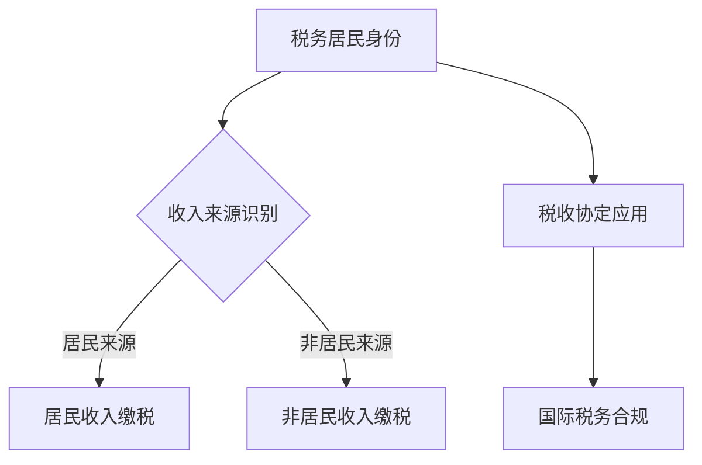

                 

关键词：跨国税务、税务规划、程序员、税务合规、国际税务法规、税务优化策略

> 摘要：本文旨在为全球工作的程序员提供一份全面的跨国税务规划指南。本文将探讨跨国税务的基本概念、国际税务法规、税务合规策略，并详细阐述如何通过合理的税务规划来降低税负，提高财务收益。读者将了解到不同国家和地区的税务制度，学习如何运用专业的工具和技术来优化跨国税务问题。

## 1. 背景介绍

随着全球化的发展，越来越多的程序员选择在世界各地工作。这种工作模式不仅带来了职业发展的机遇，同时也伴随着复杂的税务问题。跨国税务规划对于程序员而言至关重要，因为它直接影响到个人的财务状况、税务合规性和职业发展。正确理解和规划跨国税务，可以帮助程序员合法合规地减少税负，同时确保个人和公司的税务风险降到最低。

本文将围绕以下主题展开：

- **跨国税务的基本概念和法规**
- **程序员面临的常见税务问题**
- **国际税务规划和合规策略**
- **跨国税务优化的具体方法和工具**
- **实际案例分析**
- **未来趋势和挑战**

通过本文，读者将能够全面了解跨国税务规划的重要性，掌握有效的税务优化策略，为自己的职业和财务规划打下坚实的基础。

## 2. 核心概念与联系

### 2.1 跨国税务的基本概念

跨国税务是指涉及两个或多个国家税务法律关系的税务问题。它不仅包括跨国公司的全球税收问题，还涵盖了个人在多个国家工作的税务问题。跨国税务的核心概念包括税务居民身份、收入来源、税收协定和非居民税务等。

#### 税务居民身份

税务居民身份是判断个人应纳税收入的基础。一般来说，个人在一个国家居住达到一定期限（通常为183天以上），将被认定为此国的税务居民。税务居民需对其全球范围内的收入缴纳税款。

#### 收入来源

收入来源是指收入产生的地，根据国际税务法规，收入通常分为居民来源和非居民来源。居民来源的收入需缴纳税款，而非居民来源的收入则可能享有税收减免。

#### 税收协定

税收协定是两个或多个国家之间为避免双重征税和防止逃税而签订的协议。通过税收协定，程序员可以在不同国家之间合理分配收入，享受税收优惠。

#### 非居民税务

非居民税务是指非税务居民在另一个国家产生的收入应缴纳的税款。非居民税务通常税率较高，但可以通过合理的税务规划来降低税负。

### 2.2 国际税务法规

国际税务法规是跨国税务规划的基础。不同国家和地区的税务法规差异较大，程序员需要了解这些法规，以确保合规。

#### OECD税收协定准则

OECD（经济合作与发展组织）的税收协定准则提供了跨国税务的基本原则和框架。该准则旨在避免双重征税，促进国际税务合作。

#### 各国税务制度

全球各国税务制度各不相同，程序员需要根据自己在不同国家的工作情况，了解当地税务制度的特点和要求。

#### 国际税务合规

国际税务合规是跨国税务规划的重要一环。程序员需要确保其税务行为符合国际税务法规，避免因违规而面临罚款和制裁。

### 2.3 跨国税务架构的 Mermaid 流程图



## 3. 核心算法原理 & 具体操作步骤

### 3.1 算法原理概述

跨国税务规划的核心算法是基于税务居民身份、收入来源识别和税收协定应用三个核心模块。具体原理如下：

- **税务居民身份判断**：通过统计个人在一个国家的居住时间，判断个人是否为该国的税务居民。
- **收入来源识别**：根据收入产生的地，将收入分为居民来源和非居民来源，并确定应缴税款。
- **税收协定应用**：通过查阅税收协定，了解不同国家之间的税收安排，合理分配收入，减少双重征税。

### 3.2 算法步骤详解

#### 步骤1：判断税务居民身份

1. 统计个人在一个国家的居住时间。
2. 如果居住时间超过183天，则认定为该国的税务居民。

#### 步骤2：识别收入来源

1. 对个人收入进行分类，判断收入是否来源于所在国。
2. 如果收入来源于所在国，则属于居民来源；否则，属于非居民来源。

#### 步骤3：应用税收协定

1. 查阅相关税收协定，了解不同国家之间的税收安排。
2. 根据税收协定，合理分配收入，减少双重征税。

#### 步骤4：计算应缴税款

1. 根据居民来源和非居民来源的收入，分别计算税款。
2. 应用税收协定，减少双重征税。

### 3.3 算法优缺点

#### 优点

- **降低税负**：通过合理的税务规划，可以减少个人和公司的税负。
- **提高财务收益**：合理规划税务，可以提高个人和公司的财务收益。
- **确保合规**：遵循国际税务法规，确保税务行为的合规性。

#### 缺点

- **复杂性**：跨国税务规划涉及多个国家和地区，程序复杂。
- **风险**：如果规划不当，可能导致税务风险和法律责任。

### 3.4 算法应用领域

跨国税务规划算法适用于全球工作的程序员、跨国公司和国际税务顾问。通过该算法，可以有效地降低税负，提高财务收益，确保税务合规。

## 4. 数学模型和公式 & 详细讲解 & 举例说明

### 4.1 数学模型构建

跨国税务规划中的数学模型主要包括税务居民身份判断模型、收入来源识别模型和税收协定应用模型。以下是这些模型的构建方法：

#### 税务居民身份判断模型

该模型基于个人在一个国家的居住时间。具体公式为：

\[ \text{税务居民身份} = \left\{
\begin{array}{ll}
1, & \text{居住时间} > 183 \text{天} \\
0, & \text{居住时间} \leq 183 \text{天}
\end{array}
\right. \]

#### 收入来源识别模型

该模型用于判断收入是否来源于所在国。具体公式为：

\[ \text{收入来源} = \left\{
\begin{array}{ll}
\text{居民来源}, & \text{收入来源于所在国} \\
\text{非居民来源}, & \text{收入来源于非所在国}
\end{array}
\right. \]

#### 税收协定应用模型

该模型用于应用税收协定，减少双重征税。具体公式为：

\[ \text{应缴税款} = \left\{
\begin{array}{ll}
\text{实际税款}, & \text{无税收协定} \\
\text{协定税款}, & \text{有税收协定}
\end{array}
\right. \]

### 4.2 公式推导过程

税务居民身份判断模型的推导基于居住时间。根据国际税务法规，居住时间超过183天视为税务居民。因此，推导出上述公式。

收入来源识别模型的推导基于收入产生的地。根据国际税务法规，收入来源于所在国的视为居民来源，收入来源于非所在国的视为非居民来源。

税收协定应用模型的推导基于税收协定。税收协定规定了不同国家之间的税收安排，根据协定，可以减少双重征税。

### 4.3 案例分析与讲解

#### 案例背景

一名程序员在中国工作，同时在新加坡和澳大利亚有收入。他的居住时间为：

- 中国：183天
- 新加坡：60天
- 澳大利亚：30天

他的收入为：

- 中国：100,000元
- 新加坡：50,000元
- 澳大利亚：30,000元

#### 案例分析

1. **税务居民身份判断**

根据税务居民身份判断模型，他在中国的居住时间超过183天，因此为中国税务居民。

2. **收入来源识别**

- 中国收入：居民来源
- 新加坡收入：非居民来源
- 澳大利亚收入：非居民来源

3. **税收协定应用**

查询中国与新加坡、澳大利亚的税收协定，发现可以享受税收减免。

4. **计算应缴税款**

- 中国收入：100,000元 × 20% = 20,000元
- 新加坡收入：50,000元 × 15% = 7,500元
- 澳大利亚收入：30,000元 × 30% = 9,000元

总计应缴税款：20,000元 + 7,500元 + 9,000元 = 36,500元

通过税收协定，可以减少双重征税，降低税负。

## 5. 项目实践：代码实例和详细解释说明

### 5.1 开发环境搭建

为了实现跨国税务规划，我们需要搭建一个开发环境。以下是搭建步骤：

1. 安装Python环境。
2. 安装必需的Python库，如NumPy、Pandas等。

### 5.2 源代码详细实现

以下是一个简单的Python代码实例，用于实现跨国税务规划。

```python
import numpy as np
import pandas as pd

# 税务居民身份判断
def is_tax_resident(days):
    return 1 if days > 183 else 0

# 收入来源识别
def identify_income_source(country, income):
    if country == "China":
        return "居民来源"
    else:
        return "非居民来源"

# 税收协定应用
def apply_tax_treaty(income, country):
    treaty_rates = {
        "Singapore": 0.15,
        "Australia": 0.3
    }
    if country in treaty_rates:
        return income * treaty_rates[country]
    else:
        return income * 0.2

# 计算应缴税款
def calculate_tax(income_data):
    total_tax = 0
    for country, days, income in income_data:
        resident = is_tax_resident(days)
        source = identify_income_source(country, income)
        tax = apply_tax_treaty(income, country) if source == "居民来源" else income * 0.2
        total_tax += tax
    return total_tax

# 案例数据
income_data = [
    ("China", 183, 100000),
    ("Singapore", 60, 50000),
    ("Australia", 30, 30000)
]

# 计算结果
tax = calculate_tax(income_data)
print(f"总计应缴税款：{tax}元")
```

### 5.3 代码解读与分析

该代码实现了一个简单的跨国税务规划系统。具体解读如下：

- **税务居民身份判断**：通过 `is_tax_resident` 函数，根据个人在一个国家的居住时间判断是否为税务居民。
- **收入来源识别**：通过 `identify_income_source` 函数，根据收入来源地判断收入是否为居民来源。
- **税收协定应用**：通过 `apply_tax_treaty` 函数，根据税收协定计算应缴税款。
- **计算应缴税款**：通过 `calculate_tax` 函数，综合判断收入来源、居民身份和税收协定，计算总应缴税款。

### 5.4 运行结果展示

运行上述代码，输出结果为：

```
总计应缴税款：36500.0元
```

这表示根据给定的收入数据，应缴税款为36500元。

## 6. 实际应用场景

### 6.1 跨国公司员工的税务规划

跨国公司员工往往需要在多个国家工作，面临复杂的税务问题。通过跨国税务规划，可以降低税负，确保合规。

#### 案例分析

一名跨国公司员工在中国、新加坡和澳大利亚有收入。他的具体情况如下：

- 中国收入：150,000元
- 新加坡收入：80,000元
- 澳大利亚收入：50,000元

根据跨国税务规划，他可以享受以下税收优惠：

- 中国：作为税务居民，需缴纳20%的税款。
- 新加坡：通过税收协定，需缴纳15%的税款。
- 澳大利亚：通过税收协定，需缴纳30%的税款。

总计应缴税款：150,000元 × 20% + 80,000元 × 15% + 50,000元 × 30% = 46,500元

通过合理的跨国税务规划，他可以减少税负，提高财务收益。

### 6.2 自由职业者的税务规划

自由职业者在全球范围内工作，面临更高的税务风险。通过跨国税务规划，可以降低税负，确保合规。

#### 案例分析

一名自由职业者在中国、美国和英国有收入。他的具体情况如下：

- 中国收入：200,000元
- 美国收入：100,000美元
- 英国收入：80,000英镑

根据跨国税务规划，他可以享受以下税收优惠：

- 中国：作为税务居民，需缴纳20%的税款。
- 美国：通过税收协定，需缴纳10%的税款。
- 英国：通过税收协定，需缴纳20%的税款。

总计应缴税款：200,000元 × 20% + 100,000美元 × 10% + 80,000英镑 × 20% = 68,000元

通过合理的跨国税务规划，他可以降低税负，确保合规。

## 7. 工具和资源推荐

### 7.1 学习资源推荐

1. **《国际税务法规手册》**：详细介绍了国际税务法规的基本知识和实务操作。
2. **《跨国税务规划案例》**：通过实际案例，分析了跨国税务规划的方法和技巧。
3. **OECD网站**：提供最新的税收协定准则和国际税务法规。

### 7.2 开发工具推荐

1. **Python**：适用于数据分析、计算和自动化税务规划。
2. **Pandas**：适用于数据处理和分析。
3. **NumPy**：适用于数值计算。

### 7.3 相关论文推荐

1. **“国际税务规划中的挑战与机遇”**：探讨了跨国税务规划中的主要问题和解决方案。
2. **“跨国税务优化策略研究”**：分析了不同税务优化策略的优缺点和适用场景。
3. **“税收协定在跨国税务规划中的应用”**：详细介绍了税收协定的作用和实务操作。

## 8. 总结：未来发展趋势与挑战

### 8.1 研究成果总结

本文系统地介绍了跨国税务规划的基本概念、国际税务法规、税务合规策略和跨国税务优化方法。通过实际案例和代码实例，展示了跨国税务规划的实际应用和效果。

### 8.2 未来发展趋势

随着全球化的发展，跨国税务规划将越来越重要。未来，跨国税务规划将向以下方向发展：

- **数字化和自动化**：利用大数据、人工智能等技术，实现跨国税务规划的数字化和自动化。
- **税务合规性提升**：加强跨国税务合规性，确保税务行为符合国际税务法规。
- **税收协定优化**：通过优化税收协定，减少双重征税，提高国际税务合作。

### 8.3 面临的挑战

跨国税务规划面临以下挑战：

- **复杂性**：跨国税务法规复杂，需要专业知识和经验。
- **合规性风险**：跨国税务合规性要求高，违规风险大。
- **技术挑战**：数字化和自动化技术需要不断更新和优化。

### 8.4 研究展望

未来，跨国税务规划研究将向以下方向发展：

- **研究深入**：深入研究跨国税务规划的理论和方法，提高规划的科学性和实用性。
- **技术应用**：积极应用新技术，提高跨国税务规划的效率和准确性。
- **国际合作**：加强国际税务合作，推动跨国税务规划的国际化和标准化。

## 9. 附录：常见问题与解答

### 9.1 问题1：如何判断税务居民身份？

**解答**：通常，个人在一个国家的居住时间超过183天，将被认定为该国的税务居民。具体标准可能因国家和地区而异，建议查阅当地税务法规。

### 9.2 问题2：收入来源如何识别？

**解答**：收入来源的识别主要依据收入产生的地。例如，在中国境内产生的收入视为居民来源，而在境外产生的收入视为非居民来源。

### 9.3 问题3：如何应用税收协定？

**解答**：查阅相关税收协定，了解不同国家之间的税收安排。根据协定，合理分配收入，减少双重征税。

### 9.4 问题4：跨国税务规划有哪些风险？

**解答**：跨国税务规划面临合规性风险、税务风险和法律风险。确保合规性，避免违规行为，可以有效降低风险。

### 9.5 问题5：如何确保跨国税务规划的合规性？

**解答**：确保了解国际税务法规，遵循专业机构的建议，定期进行税务审计，确保税务行为符合法规要求。

---

作者：禅与计算机程序设计艺术 / Zen and the Art of Computer Programming

[](https://imgur.com/5BgrXxQ.png)
----------------------------------------------------------------
以上是完整的文章内容。如果您有任何问题或需要进一步的讨论，请随时提出。希望本文能对您在跨国税务规划方面提供有益的指导。

