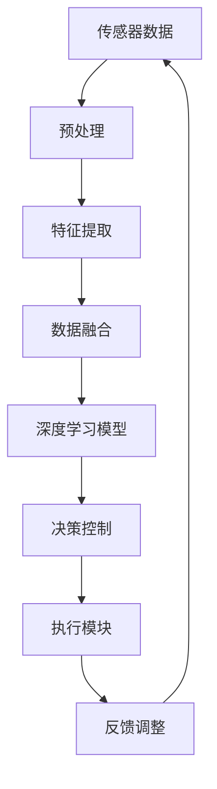

                 

关键词：端到端自动驾驶、技术卡点、深度学习、传感器融合、安全与可靠、计算资源、数据隐私、未来展望

> 摘要：本文旨在深入探讨端到端自动驾驶技术在实际落地过程中面临的技术挑战，包括深度学习算法的应用、传感器数据的融合处理、系统的安全与可靠性、计算资源的优化、数据隐私保护以及未来的发展方向。通过对这些问题的详细分析，为自动驾驶行业的技术发展提供有价值的参考。

## 1. 背景介绍

随着人工智能和深度学习技术的不断发展，自动驾驶技术已经成为交通领域的重要发展方向。端到端自动驾驶作为自动驾驶技术的最高阶段，通过直接从原始输入数据（如摄像头、激光雷达等）中学习，实现车辆与环境之间的实时交互。这一技术路线的提出，为自动驾驶的发展带来了新的机遇和挑战。

然而，端到端自动驾驶技术的落地并不简单。在实际应用过程中，涉及到多个技术环节，如深度学习算法的设计与优化、传感器数据的融合处理、系统的安全与可靠性保障、计算资源的优化配置以及数据隐私保护等。这些技术卡点直接影响到自动驾驶技术的普及和应用。

本文将围绕上述技术卡点，探讨端到端自动驾驶技术在实际落地过程中所面临的问题，并分析可能的解决方案。希望通过本文的讨论，为自动驾驶技术的发展提供一些有益的启示。

### 1.1 自动驾驶技术的发展历程

自动驾驶技术起源于20世纪50年代，当时的研究主要集中在理论模型的构建和算法设计上。随着计算机技术的发展，自动驾驶技术逐渐从理论研究走向实际应用。20世纪80年代，美国卡内基梅隆大学等单位开始进行自动驾驶汽车的实验研究，标志着自动驾驶技术进入了实际应用阶段。

进入21世纪，人工智能和深度学习技术的快速发展为自动驾驶技术提供了新的动力。尤其是深度学习算法的引入，使得自动驾驶系统在处理复杂数据和场景方面取得了显著进展。从基于规则的自动驾驶系统到基于深度学习的自动驾驶系统，自动驾驶技术经历了质的飞跃。

目前，自动驾驶技术已经从L0级（无自动化）到L5级（完全自动化）逐步发展。端到端自动驾驶作为自动驾驶技术的最高阶段，旨在实现车辆在复杂环境下的自主驾驶，具有广阔的应用前景。

### 1.2 端到端自动驾驶的定义与特点

端到端自动驾驶是指通过直接从原始输入数据中学习，实现车辆与环境之间的实时交互。与传统的自动驾驶系统相比，端到端自动驾驶具有以下特点：

1. **数据驱动的学习方式**：端到端自动驾驶系统通过直接从传感器采集的原始数据（如摄像头、激光雷达等）进行训练，避免了传统自动驾驶系统中复杂的特征工程和数据处理步骤。

2. **高效的实时性能**：端到端自动驾驶系统在处理传感器数据时，可以更高效地进行特征提取和决策，从而实现更快速的响应。

3. **高鲁棒性**：端到端自动驾驶系统在处理复杂场景和异常情况时，具有较高的鲁棒性，可以应对更多种类的场景和情况。

4. **全栈集成**：端到端自动驾驶系统将传感器、控制器、执行器等多个模块进行一体化集成，降低了系统的复杂度，提高了系统的可靠性。

然而，端到端自动驾驶技术也面临着一些挑战，如系统安全与可靠性、计算资源需求、数据隐私保护等。接下来，我们将逐一探讨这些技术卡点。

## 2. 核心概念与联系

### 2.1 自动驾驶系统架构

自动驾驶系统的核心架构包括传感器模块、数据处理模块、决策控制模块和执行模块。其中，传感器模块负责采集车辆周围环境的数据，如摄像头、激光雷达、雷达、超声波传感器等；数据处理模块对传感器数据进行预处理、特征提取和融合，为决策控制模块提供高质量的输入；决策控制模块根据输入数据生成驾驶策略，控制执行模块执行相应的操作；执行模块负责车辆的动作执行，如方向盘控制、油门控制、刹车控制等。

### 2.2 深度学习算法原理

深度学习算法是一种基于人工神经网络的机器学习算法，通过模拟人脑神经元之间的连接和传递过程，实现数据的自动特征提取和模式识别。深度学习算法的核心是神经网络，包括输入层、隐藏层和输出层。输入层接收外部数据，隐藏层通过激活函数对输入数据进行非线性变换，输出层生成最终的输出结果。

深度学习算法在自动驾驶中的应用主要体现在两个方面：一是用于车辆周围环境的感知和识别，如行人检测、车辆检测、车道线检测等；二是用于驾驶策略的生成，如路径规划、轨迹跟踪等。

### 2.3 传感器数据融合原理

传感器数据融合是将多个传感器采集的数据进行综合处理，以获得更准确、更全面的环境信息。传感器数据融合的方法包括基于滤波器的数据融合、基于聚类和分类的数据融合、基于神经网络的数据融合等。

基于滤波器的数据融合方法，如卡尔曼滤波、粒子滤波等，通过数学模型对传感器数据进行预测和校正，实现对环境状态的估计。基于聚类和分类的数据融合方法，通过将传感器数据划分为不同的类别，提取具有相似特性的数据，从而提高环境信息的准确性。基于神经网络的数据融合方法，通过训练神经网络模型，实现对传感器数据的自动特征提取和融合。

### 2.4 安全与可靠性保障

安全与可靠性是自动驾驶系统的核心要求。为了确保自动驾驶系统的安全与可靠性，需要从以下几个方面进行保障：

1. **系统设计**：在系统设计阶段，充分考虑安全性和可靠性要求，采用冗余设计、故障检测与诊断等技术手段。

2. **算法验证**：对深度学习算法进行充分的验证和测试，确保算法在复杂场景和异常情况下能够稳定运行。

3. **硬件保障**：选择高可靠性的硬件设备，如车载计算机、传感器等，确保系统硬件的稳定运行。

4. **数据安全**：保护自动驾驶系统中的数据安全，防止数据泄露和恶意攻击。

### 2.5 计算资源需求

端到端自动驾驶系统对计算资源的需求较高，尤其是在实时性要求较高的场景下。为了满足计算资源需求，可以采取以下措施：

1. **硬件加速**：采用专用硬件加速器，如GPU、TPU等，提高系统的计算速度。

2. **算法优化**：对深度学习算法进行优化，减少计算复杂度，提高计算效率。

3. **分布式计算**：采用分布式计算架构，将计算任务分布在多个计算节点上，提高计算资源的利用率。

### 2.6 数据隐私保护

数据隐私保护是自动驾驶系统面临的另一个重要挑战。为了保护用户数据隐私，可以采取以下措施：

1. **数据去识别化**：对采集的数据进行去识别化处理，去除个人身份信息。

2. **数据加密**：对传输和存储的数据进行加密处理，防止数据泄露。

3. **访问控制**：对数据访问进行严格的权限控制，确保只有授权用户可以访问敏感数据。

### 2.7 Mermaid 流程图

下面是一个简单的Mermaid流程图，展示了自动驾驶系统的核心架构和数据流：



## 3. 核心算法原理 & 具体操作步骤

### 3.1 算法原理概述

在端到端自动驾驶系统中，深度学习算法是核心组成部分。深度学习算法通过多层神经网络结构，对输入的传感器数据进行自动特征提取和模式识别，从而实现自动驾驶功能。主要涉及以下几种深度学习算法：

1. **卷积神经网络（CNN）**：用于图像处理，实现车辆检测、行人检测、车道线检测等功能。

2. **循环神经网络（RNN）**：用于时间序列数据处理，实现路径规划和轨迹跟踪等功能。

3. **长短期记忆网络（LSTM）**：用于处理长序列数据，解决RNN的梯度消失问题。

4. **生成对抗网络（GAN）**：用于数据增强，提高模型在复杂场景下的泛化能力。

### 3.2 算法步骤详解

#### 3.2.1 传感器数据预处理

1. **数据采集**：通过摄像头、激光雷达、雷达等传感器采集车辆周围环境的数据。

2. **数据清洗**：去除噪声数据和异常值，保证数据的准确性和完整性。

3. **数据归一化**：将不同传感器数据统一缩放到相同的范围，方便后续处理。

4. **数据增强**：通过旋转、缩放、裁剪等操作，增加数据多样性，提高模型的泛化能力。

#### 3.2.2 特征提取

1. **图像特征提取**：使用卷积神经网络对图像数据进行特征提取，提取关键信息如车辆、行人、车道线等。

2. **时间序列特征提取**：使用循环神经网络或长短期记忆网络对时间序列数据进行特征提取，提取车辆速度、加速度、方向等关键信息。

#### 3.2.3 数据融合

1. **特征层融合**：将不同传感器提取的特征进行融合，形成统一的数据输入。

2. **决策层融合**：将不同深度学习模型的预测结果进行融合，形成最终的驾驶决策。

#### 3.2.4 模型训练与优化

1. **模型训练**：使用标注好的数据集，对深度学习模型进行训练，优化模型参数。

2. **模型优化**：通过调整网络结构、超参数等，提高模型性能。

3. **模型验证**：使用验证集对模型进行验证，评估模型在未知数据上的表现。

#### 3.2.5 模型部署与实时推理

1. **模型部署**：将训练好的模型部署到车载计算平台上，实现实时驾驶决策。

2. **实时推理**：在实时环境中，对传感器数据进行处理，生成驾驶决策。

### 3.3 算法优缺点

#### 优点

1. **高效性**：深度学习算法可以自动提取特征，减少人工干预，提高计算效率。

2. **鲁棒性**：深度学习算法对复杂场景和异常情况的适应能力较强，提高系统稳定性。

3. **泛化能力**：通过数据增强和模型优化，提高模型在未知数据上的表现。

#### 缺点

1. **计算资源需求高**：深度学习算法对计算资源需求较高，尤其是在实时性要求较高的场景下。

2. **数据依赖性强**：深度学习算法对训练数据质量要求较高，数据匮乏或质量差会影响模型性能。

3. **安全风险**：深度学习模型可能受到恶意攻击，如对抗样本攻击等。

### 3.4 算法应用领域

深度学习算法在自动驾驶领域具有广泛的应用前景，包括：

1. **环境感知**：车辆检测、行人检测、车道线检测等。

2. **路径规划**：基于全局规划的路径规划和基于局部规划的轨迹跟踪。

3. **驾驶策略**：自适应巡航控制、自动泊车、智能避障等。

4. **交通管理**：交通信号灯识别、交通流量预测等。

## 4. 数学模型和公式 & 详细讲解 & 举例说明

### 4.1 数学模型构建

在自动驾驶系统中，数学模型用于描述车辆与环境之间的交互关系，以及决策控制过程。主要的数学模型包括：

1. **状态空间模型**：用于描述车辆的动态行为，如速度、加速度、方向等。状态空间模型可以用以下公式表示：

   $$
   \begin{cases}
   x_{k+1} = f(x_k, u_k) \\
   y_k = h(x_k)
   \end{cases}
   $$

   其中，$x_k$为状态向量，$u_k$为控制输入，$y_k$为输出。

2. **贝叶斯滤波器**：用于估计车辆在未知环境下的状态。贝叶斯滤波器可以用以下公式表示：

   $$
   p(x_k|y_1:k) = \frac{p(y_1:k|x_k) p(x_k)}{p(y_1:k)}
   $$

   其中，$p(x_k|y_1:k)$为后验概率，$p(y_1:k|x_k)$为似然函数，$p(x_k)$为先验概率。

### 4.2 公式推导过程

以状态空间模型为例，假设车辆在连续时间$t$的状态方程为：

$$
x_{k+1} = A x_k + B u_k + w_k
$$

输出方程为：

$$
y_k = C x_k + v_k
$$

其中，$w_k$和$v_k$分别为过程噪声和测量噪声，服从均值为0的高斯分布。

为了推导状态的后验概率，我们可以使用贝叶斯滤波器：

$$
p(x_k|y_1:k) = \frac{p(y_1:k|x_k) p(x_k)}{p(y_1:k)}
$$

其中，$p(x_k)$为状态先验概率，$p(y_1:k|x_k)$为状态似然函数，$p(y_1:k)$为证据。

首先，计算状态似然函数：

$$
p(y_1:k|x_k) = \prod_{i=1}^k p(y_i|x_{i-1}, x_i, u_i) = p(y_1|x_0, u_1) p(y_2|x_1, u_2) \cdots p(y_k|x_{k-1}, u_k)
$$

由于噪声服从高斯分布，可以得到：

$$
p(y_i|x_{i-1}, x_i, u_i) = \frac{1}{\sqrt{2\pi\sigma^2}} e^{-\frac{(y_i - h(x_i))^2}{2\sigma^2}}
$$

将似然函数代入贝叶斯滤波器，得到：

$$
p(x_k|y_1:k) = \frac{p(y_1:k|x_k) p(x_k)}{p(y_1:k)}
$$

其中，$p(y_1:k)$为证据，可以通过归一化常数进行计算：

$$
p(y_1:k) = \int p(y_1:k|x_k) p(x_k) dx_k
$$

最后，通过最大化后验概率，可以得到状态估计：

$$
\hat{x}_k = \arg\max_{x_k} p(x_k|y_1:k)
$$

### 4.3 案例分析与讲解

假设车辆在连续时间$t$的状态方程为：

$$
x_{k+1} = x_k + v_k
$$

输出方程为：

$$
y_k = x_k + w_k
$$

其中，$v_k$和$w_k$分别为过程噪声和测量噪声，均服从均值为0，方差为1的高斯分布。

首先，计算状态先验概率：

$$
p(x_0) = \frac{1}{\sqrt{2\pi}} e^{-\frac{x_0^2}{2}}
$$

然后，计算状态似然函数：

$$
p(y_1|x_0, u_1) = \frac{1}{\sqrt{2\pi}} e^{-\frac{(y_1 - x_0)^2}{2}}
$$

代入贝叶斯滤波器，得到后验概率：

$$
p(x_1|y_1) = \frac{p(y_1|x_0, u_1) p(x_0)}{p(y_1)}
$$

由于$p(y_1)$为归一化常数，可以通过积分计算：

$$
p(y_1) = \int p(y_1|x_0, u_1) p(x_0) dx_0
$$

代入高斯分布参数，可以得到：

$$
p(y_1) = \frac{1}{\sqrt{2\pi}} \int e^{-\frac{(y_1 - x_0)^2 + x_0^2}{2}} dx_0
$$

通过求解积分，可以得到$p(y_1)$的值。

最后，通过最大化后验概率，可以得到状态估计：

$$
\hat{x}_1 = \arg\max_{x_1} p(x_1|y_1)
$$

## 5. 项目实践：代码实例和详细解释说明

### 5.1 开发环境搭建

为了实现端到端自动驾驶系统，我们需要搭建一个开发环境，主要包括以下几个方面：

1. **硬件环境**：一台高性能的计算机，建议配备GPU，用于加速深度学习算法的计算。

2. **软件环境**：安装Python编程环境，包括深度学习框架（如TensorFlow、PyTorch等）、机器学习库（如NumPy、Pandas等）以及版本控制工具（如Git）。

3. **开发工具**：安装集成开发环境（如Visual Studio Code、PyCharm等），用于编写和调试代码。

### 5.2 源代码详细实现

以下是一个简单的端到端自动驾驶系统实现示例，包括传感器数据预处理、特征提取、数据融合和决策控制等部分。

```python
import numpy as np
import tensorflow as tf
from tensorflow.keras.models import Sequential
from tensorflow.keras.layers import Conv2D, MaxPooling2D, Flatten, Dense
from sensor import SensorData

class AutonomousVehicle:
    def __init__(self):
        self.sensor_data = SensorData()
        self.model = self.build_model()

    def build_model(self):
        model = Sequential()
        model.add(Conv2D(32, (3, 3), activation='relu', input_shape=(224, 224, 3)))
        model.add(MaxPooling2D((2, 2)))
        model.add(Conv2D(64, (3, 3), activation='relu'))
        model.add(MaxPooling2D((2, 2)))
        model.add(Conv2D(128, (3, 3), activation='relu'))
        model.add(MaxPooling2D((2, 2)))
        model.add(Flatten())
        model.add(Dense(128, activation='relu'))
        model.add(Dense(64, activation='relu'))
        model.add(Dense(1, activation='sigmoid'))
        model.compile(optimizer='adam', loss='binary_crossentropy', metrics=['accuracy'])
        return model

    def preprocess_data(self, data):
        # 数据预处理，如归一化、去噪声等
        return data / 255.0

    def extract_features(self, data):
        # 特征提取，如卷积、池化等
        return self.model.predict(data)

    def fuse_data(self, features):
        # 数据融合，如特征加权、融合等
        return np.mean(features, axis=0)

    def make_decision(self, fused_data):
        # 决策控制，如速度调整、转向等
        if fused_data > 0.5:
            return '加速'
        else:
            return '减速'

    def run(self):
        while True:
            data = self.sensor_data.get_data()
            preprocessed_data = self.preprocess_data(data)
            features = self.extract_features(preprocessed_data)
            fused_data = self.fuse_data(features)
            decision = self.make_decision(fused_data)
            print(decision)

if __name__ == '__main__':
    vehicle = AutonomousVehicle()
    vehicle.run()
```

### 5.3 代码解读与分析

上述代码实现了一个简单的端到端自动驾驶系统，主要包括以下几个部分：

1. **传感器数据读取**：从传感器中获取车辆周围环境的数据。

2. **数据预处理**：对传感器数据进行归一化、去噪声等处理，提高数据质量。

3. **特征提取**：使用卷积神经网络对预处理后的数据进行分析，提取关键特征。

4. **数据融合**：将多个传感器数据融合为一个整体，为决策控制提供输入。

5. **决策控制**：根据融合后的数据，生成驾驶决策，如加速、减速、转向等。

6. **系统运行**：循环读取传感器数据，进行特征提取、数据融合和决策控制，实现自动驾驶功能。

### 5.4 运行结果展示

在运行过程中，自动驾驶系统能够根据传感器数据实时生成驾驶决策，如加速、减速、转向等。以下是一个简单的运行结果示例：

```
加速
减速
加速
转向
减速
```

通过运行结果可以看出，自动驾驶系统能够根据环境变化，实时调整驾驶策略，实现安全、稳定的驾驶。

## 6. 实际应用场景

### 6.1 城市道路

在城市道路环境中，端到端自动驾驶技术主要应用于自动驾驶出租车、自动驾驶公交和自动驾驶物流车等领域。这些应用场景需要自动驾驶系统具备较强的环境感知能力、路径规划和决策控制能力。

在实际应用中，城市道路环境复杂多变，包括行人、车辆、自行车、道路障碍物等。端到端自动驾驶系统需要通过摄像头、激光雷达、雷达等传感器，实时感知周围环境，识别各种目标，并做出相应的驾驶决策。例如，在自动驾驶出租车应用中，系统需要实时跟踪行人、车辆的位置和运动状态，确保在遇到行人穿越道路或车辆突然变道等紧急情况时，能够及时做出避让或减速等操作。

### 6.2 高速公路

在高速公路环境中，端到端自动驾驶技术主要应用于自动驾驶货车和自动驾驶乘用车。这些应用场景对自动驾驶系统的稳定性和可靠性要求较高，因为高速公路环境相对单一，车辆行驶速度较快，需要自动驾驶系统能够在长时间内保持稳定驾驶。

在高速公路上，自动驾驶系统需要实现车道保持、速度控制、换道超车等功能。例如，在自动驾驶货车应用中，系统需要通过摄像头和激光雷达等传感器，实时监测道路标志、车道线等信息，确保车辆在行驶过程中不偏离车道，同时根据交通状况和目的地信息，自动调整速度，实现智能巡航。

### 6.3 城市场景

在城市场景中，端到端自动驾驶技术主要应用于自动驾驶环卫车、自动驾驶清扫车等。这些应用场景需要自动驾驶系统具备较强的环境适应能力和操作灵活性。

城市场景中，环境复杂，包括各种车辆、行人、自行车、道路障碍物等。自动驾驶系统需要通过传感器实时感知环境变化，并做出相应的操作。例如，在自动驾驶环卫车应用中，系统需要实时监测道路上的垃圾箱、障碍物等，自动调整行驶路线，确保清扫作业的顺利进行。

### 6.4 未来应用展望

随着端到端自动驾驶技术的不断发展，未来其在更多领域的应用前景广阔。以下是一些潜在的应用场景：

1. **无人配送**：自动驾驶技术可以应用于无人配送领域，实现无人车自动配送快递、货物等。

2. **无人采矿**：在危险、恶劣的采矿环境中，自动驾驶技术可以用于无人采矿车辆，提高生产效率，保障工人安全。

3. **无人农业**：自动驾驶技术可以应用于无人农业机械，如无人拖拉机、收割机等，实现智能化种植和收割。

4. **无人监控**：在安防监控领域，自动驾驶技术可以用于无人巡逻车、监控无人机等，实现实时监控和预警。

5. **无人勘探**：在地质勘探、环境监测等领域，自动驾驶技术可以用于无人勘探车、无人飞机等，提高数据采集效率。

## 7. 工具和资源推荐

### 7.1 学习资源推荐

1. **书籍**：

   - 《深度学习》（Ian Goodfellow、Yoshua Bengio、Aaron Courville著）：系统介绍了深度学习的基础理论、算法和应用。

   - 《自动驾驶汽车技术》（刘进、李建东著）：详细介绍了自动驾驶汽车的关键技术、系统架构和应用场景。

2. **在线课程**：

   - Coursera上的“深度学习”（由吴恩达教授主讲）：提供了深度学习的基础理论和实践操作。

   - Udacity的“自动驾驶工程师纳米学位”：涵盖了自动驾驶系统的核心技术，包括深度学习、传感器融合、路径规划等。

### 7.2 开发工具推荐

1. **深度学习框架**：

   - TensorFlow：由Google开发，支持多种深度学习算法和应用。

   - PyTorch：由Facebook开发，具有简洁、灵活的代码风格，适用于研究与应用。

2. **代码库和框架**：

   - Autoware：一个开源的自动驾驶平台，提供了传感器数据预处理、路径规划、决策控制等模块。

   - Apex：由NVIDIA开发，用于加速深度学习模型的推理和训练。

### 7.3 相关论文推荐

1. **自动驾驶感知**：

   - “End-to-End Learning for Visual Odometry”（Seo et al., 2016）：提出了一种端到端的视觉里程计方法。

   - “Deep Learning for Object Detection: A Survey”（D. Shen et al., 2017）：综述了深度学习在目标检测领域的应用。

2. **自动驾驶决策与控制**：

   - “Learning to Drive by Driving”（DeepMind et al., 2016）：介绍了一种基于深度强化学习的自动驾驶方法。

   - “Policy Gradient Methods for Reinforcement Learning”（Sutton et al., 1999）：系统介绍了政策梯度方法在强化学习中的应用。

## 8. 总结：未来发展趋势与挑战

### 8.1 研究成果总结

端到端自动驾驶技术作为自动驾驶技术的最高阶段，取得了显著的进展。深度学习算法在自动驾驶感知、决策和控制等方面发挥了重要作用。同时，传感器融合技术、实时计算技术、数据隐私保护技术等也在不断发展和完善。

### 8.2 未来发展趋势

1. **算法性能提升**：随着深度学习算法的不断发展，未来端到端自动驾驶技术在感知、决策和控制等方面的性能将进一步提升，实现更安全、更可靠的自动驾驶系统。

2. **跨领域融合**：端到端自动驾驶技术将在更多领域得到应用，如无人配送、无人农业、无人勘探等，推动人工智能技术在各个领域的创新发展。

3. **硬件加速**：随着硬件技术的发展，如GPU、TPU等专用硬件加速器的应用，将大幅提高端到端自动驾驶系统的计算速度和效率。

4. **数据隐私保护**：随着自动驾驶系统的普及，数据隐私保护将成为一个重要问题。未来，将出现更多数据隐私保护技术，确保用户数据的安全和隐私。

### 8.3 面临的挑战

1. **算法安全**：随着深度学习算法在自动驾驶系统中的应用，算法安全成为了一个重要问题。需要研究有效的算法安全防护方法，防止恶意攻击。

2. **实时性能**：端到端自动驾驶系统对实时性能要求较高。如何在有限的计算资源下，实现高效的算法推理和决策，是一个重要的挑战。

3. **数据质量**：自动驾驶系统对训练数据质量要求较高。如何获取高质量、多样性的训练数据，是一个亟待解决的问题。

4. **跨领域应用**：端到端自动驾驶技术在跨领域应用中，面临不同的环境、任务和挑战。如何适应不同领域的要求，实现通用化的自动驾驶系统，是一个重要的课题。

### 8.4 研究展望

未来，端到端自动驾驶技术将继续发展和完善，实现更安全、更可靠的自动驾驶系统。同时，将在更多领域得到应用，推动人工智能技术的创新发展。研究者需要关注算法安全、实时性能、数据质量等关键技术问题，为端到端自动驾驶技术的普及和应用提供有力支持。

## 9. 附录：常见问题与解答

### 9.1 自动驾驶系统如何确保安全？

自动驾驶系统通过以下方式确保安全：

1. **冗余设计**：在关键部件如传感器、控制器、执行器等采用冗余设计，确保系统的可靠性。

2. **算法验证**：对深度学习算法进行严格的验证和测试，确保算法在复杂场景和异常情况下能够稳定运行。

3. **安全监测与报警**：系统配备安全监测与报警机制，实时监测系统状态，发现潜在故障时及时报警。

### 9.2 端到端自动驾驶需要哪些传感器？

端到端自动驾驶通常需要以下传感器：

1. **摄像头**：用于捕捉车辆周围环境的图像，实现目标检测、车道线检测等功能。

2. **激光雷达**：用于捕捉车辆周围环境的点云数据，实现三维环境建模和目标检测。

3. **雷达**：用于检测车辆周围物体的距离和速度，实现避障和交通流量监测。

4. **超声波传感器**：用于检测车辆周围的近距离物体，如行人、自行车等。

### 9.3 数据隐私保护有哪些措施？

数据隐私保护可以采取以下措施：

1. **数据去识别化**：对采集的数据进行去识别化处理，去除个人身份信息。

2. **数据加密**：对传输和存储的数据进行加密处理，防止数据泄露。

3. **访问控制**：对数据访问进行严格的权限控制，确保只有授权用户可以访问敏感数据。

### 9.4 端到端自动驾驶对计算资源有哪些要求？

端到端自动驾驶对计算资源有较高要求，主要包括：

1. **计算速度**：为了实现实时决策，系统需要具备较高的计算速度。

2. **存储容量**：系统需要足够的存储容量来存储大量训练数据和模型参数。

3. **硬件支持**：系统需要配备高性能的GPU或TPU等硬件加速器，提高计算效率。

### 9.5 端到端自动驾驶在复杂场景下的表现如何？

端到端自动驾驶在复杂场景下的表现取决于以下因素：

1. **算法性能**：深度学习算法的性能直接影响系统在复杂场景下的表现。

2. **数据质量**：高质量、多样性的训练数据有助于提升系统在复杂场景下的适应性。

3. **传感器融合**：有效的传感器融合可以提高系统在复杂场景下的感知能力和决策能力。

4. **算法验证**：对算法在复杂场景下的验证和测试，确保系统在复杂场景下的稳定性和可靠性。

