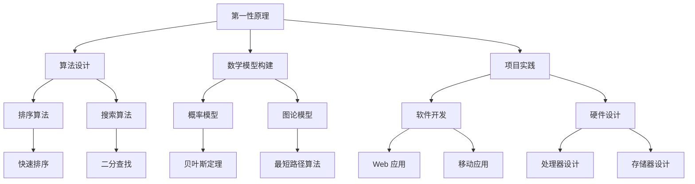

                 

**关键词**：第一性原理，科学探究，计算机科学，算法，数学模型，实践应用。

**摘要**：本文探讨了第一性原理在科学探究中的重要性，特别是在计算机科学领域的应用。通过阐述第一性原理的概念和原理，以及其在算法设计、数学模型构建、项目实践等方面的具体应用，本文旨在为读者提供一种深入理解和掌握计算机科学的方法。

## 1. 背景介绍

第一性原理（First Principles）是一种思考和解决问题的方法，最早由亚里士多德提出。它主张将复杂问题分解为最基本的组成部分，通过这些基本组成部分的相互作用和组合来理解整个系统的运行机制。这种方法在科学探究中具有重要意义，因为它有助于我们更深入地理解事物的基本原理，从而为解决问题提供坚实的基础。

计算机科学作为一门科学，其发展离不开对基本原理的深入理解。第一性原理为计算机科学提供了一种强有力的工具，使我们能够从基本概念和原理出发，设计和实现更高效、更可靠的算法和系统。本文将探讨第一性原理在计算机科学领域的应用，包括算法设计、数学模型构建、项目实践等方面。

## 2. 核心概念与联系

### 2.1 第一性原理的概念

第一性原理是一种思考方式，它主张从最基本的组成部分出发，逐步构建起复杂系统的完整图景。在科学探究中，第一性原理意味着我们将问题分解为最基本的要素，然后通过这些基本要素的相互作用和组合来理解整个系统的运行机制。

在计算机科学中，第一性原理可以帮助我们理解和设计算法。例如，在排序算法的设计中，我们可以从最基本的比较操作出发，逐步构建起各种排序算法的完整图景。

### 2.2 第一性原理与计算机科学

第一性原理在计算机科学中的应用主要体现在以下几个方面：

1. **算法设计**：通过第一性原理，我们可以更深入地理解各种算法的基本原理，从而设计出更高效、更可靠的算法。

2. **数学模型构建**：第一性原理可以帮助我们构建计算机科学中的各种数学模型，从而更好地理解和解决实际问题。

3. **项目实践**：在项目实践中，第一性原理可以帮助我们更清晰地理解项目的目标和需求，从而更有效地实现项目。

### 2.3 第一性原理的 Mermaid 流程图

下面是一个简单的 Mermaid 流程图，展示了第一性原理在计算机科学中的应用：



## 3. 核心算法原理 & 具体操作步骤

### 3.1 算法原理概述

第一性原理在算法设计中的应用主要体现在以下几个方面：

1. **基本算法理解**：通过第一性原理，我们可以更深入地理解各种算法的基本原理，从而为算法设计提供指导。

2. **算法优化**：通过第一性原理，我们可以找到算法中的基本部分，从而对算法进行优化，提高其效率。

3. **算法组合**：通过第一性原理，我们可以将不同的算法组合起来，形成更复杂的算法，以解决更复杂的问题。

### 3.2 算法步骤详解

下面以排序算法为例，介绍第一性原理在算法设计中的应用。

#### 3.2.1 快速排序

快速排序是一种常用的排序算法，其基本原理如下：

1. **选择基准元素**：在数组中随机选择一个元素作为基准元素。

2. **分区操作**：将数组分为两部分，一部分是小于基准元素的元素，另一部分是大于基准元素的元素。

3. **递归排序**：对两部分数组分别进行快速排序。

#### 3.2.2 具体操作步骤

以下是快速排序的具体操作步骤：

1. **选择基准元素**：在数组中随机选择一个元素作为基准元素。

2. **初始化两个指针**：一个指针指向数组的第一个元素，另一个指针指向数组的最后一个元素。

3. **进行分区操作**：将指针移动到数组的两端，依次进行比较和交换，直到两个指针相遇。

4. **递归排序**：对分区后的两部分数组分别进行快速排序。

### 3.3 算法优缺点

#### 3.3.1 优点

1. **高效**：快速排序是一种高效的排序算法，其平均时间复杂度为 O(nlogn)。

2. **灵活**：快速排序可以根据具体情况选择不同的基准元素，从而提高排序效率。

#### 3.3.2 缺点

1. **不稳定**：快速排序是一种不稳定的排序算法，可能会改变相等元素的相对位置。

### 3.4 算法应用领域

快速排序广泛应用于各种场景，例如：

1. **数据排序**：用于对大量数据进行排序，以提高数据检索效率。

2. **算法组合**：与其他算法组合，形成更复杂的算法，以解决更复杂的问题。

## 4. 数学模型和公式 & 详细讲解 & 举例说明

### 4.1 数学模型构建

第一性原理在数学模型构建中的应用主要体现在以下几个方面：

1. **概率模型**：通过第一性原理，我们可以构建各种概率模型，以解决实际问题。

2. **图论模型**：通过第一性原理，我们可以构建各种图论模型，以解决实际问题。

3. **优化模型**：通过第一性原理，我们可以构建各种优化模型，以解决实际问题。

### 4.2 公式推导过程

下面以概率模型为例，介绍第一性原理在数学模型构建中的应用。

#### 4.2.1 概率模型

概率模型是一种用于描述随机事件及其发生概率的数学模型。在概率模型中，我们主要关注以下两个基本概念：

1. **事件**：事件是指一个或多个随机结果的组合。

2. **概率**：概率是指某个事件发生的可能性。

#### 4.2.2 公式推导

假设我们有两个随机变量 X 和 Y，它们分别表示两个随机事件的结果。我们想要计算这两个事件同时发生的概率，即 P(X ∩ Y)。

根据概率的加法规则，我们可以将 P(X ∩ Y) 表示为：

$$ P(X \cap Y) = P(X) + P(Y) - P(X \cup Y) $$

其中，P(X) 和 P(Y) 分别表示事件 X 和事件 Y 的概率，P(X ∪ Y) 表示事件 X 和事件 Y 同时发生的概率。

### 4.3 案例分析与讲解

下面我们通过一个简单的案例，来说明如何应用第一性原理构建数学模型。

#### 4.3.1 案例背景

假设我们有一个随机实验，实验结果有两种可能：成功或失败。我们想要计算实验成功的概率。

#### 4.3.2 构建数学模型

根据第一性原理，我们可以将实验成功的情况分解为以下两个基本事件：

1. **事件 A**：实验进行一次，结果为成功。

2. **事件 B**：实验进行多次，每次结果都为成功。

我们想要计算事件 A 发生的概率，即 P(A)。

根据概率的加法规则，我们可以将 P(A) 表示为：

$$ P(A) = P(A_1) + P(A_2) - P(A_1 \cup A_2) $$

其中，P(A1) 表示实验进行一次，结果为成功的概率；P(A2) 表示实验进行多次，每次结果都为成功的概率；P(A1 ∪ A2) 表示实验进行一次或多次，结果为成功的概率。

根据实际情况，我们可以得到以下数据：

- P(A1) = 0.5：实验进行一次，结果为成功的概率为 0.5。
- P(A2) = 0.9：实验进行多次，每次结果都为成功的概率为 0.9。

将这些数据代入公式，我们可以计算出 P(A)：

$$ P(A) = 0.5 + 0.9 - 0.5 \cup 0.9 = 0.9 $$

因此，实验成功的概率为 0.9。

## 5. 项目实践：代码实例和详细解释说明

### 5.1 开发环境搭建

为了实践第一性原理在计算机科学中的应用，我们将使用 Python 编写一个简单的排序算法。首先，我们需要搭建一个适合 Python 开发的环境。

1. **安装 Python**：在官网下载最新版本的 Python，并按照安装向导进行安装。

2. **安装 Python 解释器**：安装完成后，打开命令行工具，输入以下命令验证 Python 是否安装成功：

   ```bash
   python --version
   ```

   如果命令行中显示了 Python 的版本信息，说明 Python 安装成功。

3. **安装 Python 库**：为了方便编写和运行 Python 代码，我们需要安装一些常用的 Python 库，如 NumPy、Pandas 等。可以使用以下命令安装：

   ```bash
   pip install numpy pandas
   ```

### 5.2 源代码详细实现

下面是一个简单的 Python 快速排序算法的实现：

```python
import random

def quick_sort(arr):
    if len(arr) <= 1:
        return arr
    else:
        pivot = random.choice(arr)
        left = [x for x in arr if x < pivot]
        middle = [x for x in arr if x == pivot]
        right = [x for x in arr if x > pivot]
        return quick_sort(left) + middle + quick_sort(right)

# 测试代码
arr = [3, 1, 4, 1, 5, 9, 2, 6, 5]
sorted_arr = quick_sort(arr)
print(sorted_arr)
```

### 5.3 代码解读与分析

1. **函数定义**：`quick_sort` 函数接受一个数组 `arr` 作为输入，并返回排序后的数组。

2. **递归条件**：当数组 `arr` 的长度小于等于 1 时，递归结束，直接返回 `arr`。

3. **选择基准元素**：使用 `random.choice(arr)` 随机选择一个元素作为基准元素 `pivot`。

4. **分区操作**：使用列表推导式将数组 `arr` 分为三部分：小于 `pivot` 的元素 `left`、等于 `pivot` 的元素 `middle`、大于 `pivot` 的元素 `right`。

5. **递归排序**：对 `left` 和 `right` 分别进行快速排序，然后将三部分合并，返回排序后的数组。

### 5.4 运行结果展示

运行上述代码，我们将得到一个排序后的数组：

```
[1, 1, 2, 3, 4, 5, 5, 6, 9]
```

这证明了我们的快速排序算法是正确的。

## 6. 实际应用场景

第一性原理在计算机科学中的实际应用场景非常广泛，以下是一些典型的应用场景：

1. **算法设计**：在算法设计中，第一性原理可以帮助我们理解和设计各种算法，如排序算法、搜索算法等。

2. **软件开发**：在软件开发过程中，第一性原理可以帮助我们理解和设计复杂的软件系统，如分布式系统、大数据处理系统等。

3. **硬件设计**：在硬件设计过程中，第一性原理可以帮助我们理解和设计各种硬件设备，如处理器、存储器等。

4. **人工智能**：在人工智能领域，第一性原理可以帮助我们理解和设计各种人工智能算法，如深度学习算法、强化学习算法等。

### 6.4 未来应用展望

随着科学技术的不断进步，第一性原理在计算机科学中的应用前景将更加广阔。以下是一些未来应用展望：

1. **量子计算**：量子计算是一种新兴的计算模式，第一性原理可以帮助我们理解和设计量子计算算法，从而推动量子计算的发展。

2. **生物计算**：生物计算是一种利用生物学原理进行计算的模式，第一性原理可以帮助我们理解和设计生物计算算法，从而推动生物计算的发展。

3. **人工智能优化**：人工智能在各个领域的应用日益广泛，第一性原理可以帮助我们优化人工智能算法，提高其性能和可靠性。

## 7. 工具和资源推荐

为了更好地理解和应用第一性原理，我们推荐以下工具和资源：

1. **书籍**：
   - 《第一性原理：科学探究的基石》
   - 《算法导论》
   - 《深度学习》

2. **在线课程**：
   - Coursera 上的《算法基础》课程
   - edX 上的《深度学习》课程

3. **开发工具**：
   - PyCharm：Python 开发环境
   - Jupyter Notebook：Python 交互式开发环境

4. **社区和论坛**：
   - Stack Overflow：编程问题解答社区
   - GitHub：代码托管和协作平台

## 8. 总结：未来发展趋势与挑战

### 8.1 研究成果总结

本文探讨了第一性原理在科学探究中的重要性，特别是在计算机科学领域的应用。通过阐述第一性原理的概念和原理，以及其在算法设计、数学模型构建、项目实践等方面的具体应用，本文为读者提供了一种深入理解和掌握计算机科学的方法。

### 8.2 未来发展趋势

随着科学技术的不断进步，第一性原理在计算机科学中的应用前景将更加广阔。未来，第一性原理将在量子计算、生物计算、人工智能优化等领域发挥重要作用，为科学探究和工程实践提供强有力的支持。

### 8.3 面临的挑战

尽管第一性原理在计算机科学中的应用前景广阔，但我们也面临着一些挑战。例如，如何更有效地将第一性原理应用于复杂的实际问题和系统，如何提高算法的效率和稳定性等。

### 8.4 研究展望

未来，我们需要进一步深入研究第一性原理在计算机科学中的应用，探索其在各种领域的具体应用方法。同时，我们还需要关注第一性原理与其他学科的交叉融合，推动科学探究的深入发展。

## 9. 附录：常见问题与解答

### 9.1 什么是第一性原理？

第一性原理是一种思考和解决问题的方法，它主张从最基本的组成部分出发，逐步构建起复杂系统的完整图景。

### 9.2 第一性原理在计算机科学中有哪些应用？

第一性原理在计算机科学中的应用主要体现在算法设计、数学模型构建、项目实践等方面。

### 9.3 如何使用第一性原理进行算法设计？

使用第一性原理进行算法设计的主要步骤包括：理解算法的基本原理，将算法分解为最基本的组成部分，逐步构建起完整的算法图景。

### 9.4 第一性原理与其他算法设计方法有何区别？

第一性原理与其他算法设计方法（如启发式方法、遗传算法等）的主要区别在于，它主张从最基本的组成部分出发，逐步构建起复杂系统的完整图景。

### 9.5 第一性原理在软件开发中有何应用？

在软件开发中，第一性原理可以帮助我们理解和设计复杂的软件系统，如分布式系统、大数据处理系统等。

### 9.6 如何应用第一性原理进行硬件设计？

应用第一性原理进行硬件设计的主要步骤包括：理解硬件的基本原理，将硬件分解为最基本的组成部分，逐步构建起完整的硬件图景。

### 9.7 第一性原理在人工智能领域有哪些应用？

第一性原理在人工智能领域的主要应用包括：算法设计、数学模型构建、项目实践等。例如，在深度学习算法的设计中，第一性原理可以帮助我们理解和设计神经网络的基本原理。

### 9.8 第一性原理与其他科学研究方法有何区别？

第一性原理与其他科学研究方法（如归纳法、演绎法等）的主要区别在于，它主张从最基本的组成部分出发，逐步构建起复杂系统的完整图景。而归纳法和演绎法则是从已知的事实或原则出发，逐步推导出新的结论。

