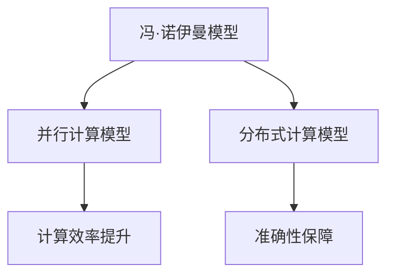
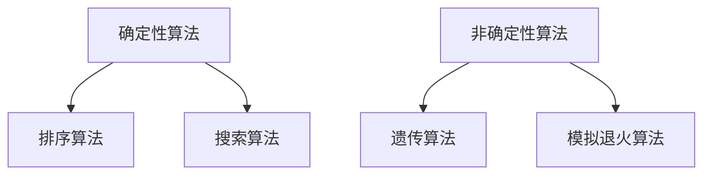
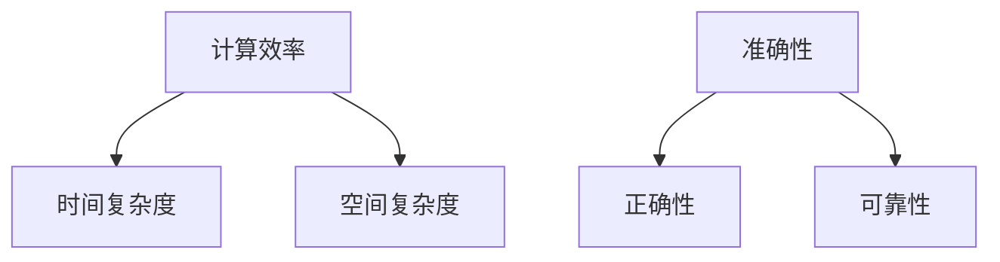
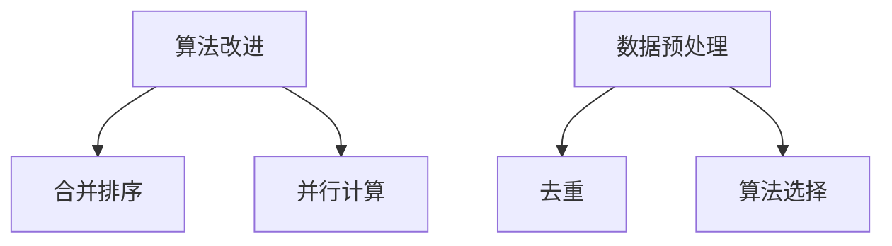

                 

关键词：算法优化、计算效率、准确性、技术语言、深度学习、编程、软件开发、计算机科学、人工智能。

> 摘要：本文深入探讨了算法优化在提高人类计算效率和准确性方面的关键作用。通过阐述核心概念、算法原理、数学模型、项目实践以及未来展望，为读者提供了一个全面的技术指南。

## 1. 背景介绍

在计算机科学和人工智能领域，算法是核心驱动力。随着技术的不断进步，算法在数据密集型应用、机器学习、深度学习以及优化问题解决等方面扮演着至关重要的角色。然而，算法的性能瓶颈往往成为制约其广泛应用的瓶颈。算法优化作为一种提升计算效率和准确性的手段，日益受到学术界和工业界的关注。

算法优化涉及多个方面，包括但不限于算法本身的改进、并行计算、数据预处理、算法选择与组合等。高效的算法可以显著减少计算时间，提高系统的响应速度，从而提升整体性能。准确性是算法评价的重要指标，优化算法不仅要追求速度，还要确保结果的可靠性。

本文旨在系统地探讨算法优化在提升人类计算效率和准确性方面的作用，并通过具体案例和实践指导，帮助读者理解算法优化的方法及其在实际应用中的价值。

## 2. 核心概念与联系

在深入探讨算法优化之前，我们首先需要了解一些核心概念，这些概念相互联系，构成了算法优化的理论基础。

### 2.1 计算模型

计算模型是算法设计的起点，它描述了计算的基本框架和操作。常见的计算模型包括冯·诺伊曼模型、并行计算模型和分布式计算模型。每种模型都有其独特的优势和适用场景。

#### Mermaid 流程图：


### 2.2 算法类型

算法类型分为确定性算法和非确定性算法。确定性算法在相同输入下总是产生相同的输出，如排序算法和搜索算法。非确定性算法在相同输入下可能产生不同的输出，如遗传算法和模拟退火算法。算法类型的选择直接影响优化方向。

#### Mermaid 流程图：


### 2.3 优化目标

算法优化的目标主要包括提高计算效率和准确性。计算效率涉及算法的时间复杂度和空间复杂度，准确性则关注算法结果的正确性和可靠性。

#### Mermaid 流程图：


### 2.4 优化方法

算法优化的方法多种多样，包括但不限于：

- **算法改进**：通过改进基本算法，减少不必要的计算和操作，如合并排序中的“归并”步骤。
- **并行计算**：利用多核处理器和分布式系统，将计算任务分解并行执行，提高计算效率。
- **数据预处理**：优化数据输入和处理流程，减少冗余数据和处理时间。
- **算法选择**：根据问题特点选择最适合的算法，如机器学习中的模型选择。

#### Mermaid 流程图：


通过上述核心概念和联系的理解，我们可以为接下来的算法原理和具体操作步骤打下坚实的基础。

## 3. 核心算法原理 & 具体操作步骤

### 3.1 算法原理概述

算法优化的核心在于对基本算法的改进，以及利用现有技术提高计算效率和准确性。以下是一些常用的算法优化原理：

#### 3.1.1 时间复杂度优化

时间复杂度是衡量算法运行时间的一个重要指标。优化时间复杂度通常涉及以下方法：

- **减少重复计算**：通过记忆化或动态规划减少重复计算，例如斐波那契数列的计算。
- **使用高效算法**：选择更适合当前问题的高效算法，如快速排序代替冒泡排序。

#### 3.1.2 空间复杂度优化

空间复杂度是衡量算法所需存储空间的一个指标。优化空间复杂度可以采取以下策略：

- **空间压缩**：使用更紧凑的数据结构，如位操作减少内存占用。
- **外部排序**：对于大数据集，将部分数据存储在外部介质，减少内存消耗。

#### 3.1.3 并行计算优化

并行计算利用多处理器或分布式系统进行计算，提高效率。优化并行计算通常涉及：

- **任务分解**：将大任务分解为小任务，并行执行。
- **负载均衡**：确保每个处理器或节点承担相似的工作量。

#### 3.1.4 算法选择与组合

选择合适的算法并组合多种算法，可以优化整体性能。常见的组合算法包括：

- **启发式算法**：结合局部搜索和全局搜索策略，如遗传算法和模拟退火算法。
- **混合算法**：结合确定性算法和非确定性算法，发挥各自优势。

### 3.2 算法步骤详解

以下是一个简单的排序算法（快速排序）的优化步骤，包括基本原理和具体操作：

#### 3.2.1 基本原理

快速排序是一种高效的排序算法，其基本原理是通过一趟排序将待排序的数据分割成独立的两部分，其中一部分的所有数据都比另一部分的所有数据要小，然后再按此方法对这两部分数据分别进行快速排序，整个排序过程可以递归进行，以此达到整个数据变成有序序列。

#### 3.2.2 优化步骤

1. **选择分区基准**：选择一个基准元素，将其与其他元素进行比较，将小于基准的元素放在其左侧，大于基准的元素放在其右侧。
2. **递归排序**：对左右两部分数据进行递归排序，直到所有子序列都排序完成。
3. **减少重复计算**：使用随机化选择基准，减少数据已经部分有序的情况下的重复计算。
4. **使用插入排序处理小数组**：当子数组大小小于某个阈值时，使用插入排序代替快速排序，提高效率。

#### 3.2.3 算法步骤详解

- **选择基准**：选择数组的中间元素作为基准。
- **划分**：通过比较，将数组分为两部分，一部分所有元素小于基准，另一部分所有元素大于基准。
- **递归排序**：递归对小于基准和大于基准的两部分进行排序。
- **处理小数组**：当子数组大小小于某个阈值时，使用插入排序进行排序。

#### 3.2.4 算法优缺点

- **优点**：时间复杂度较低，平均情况为 \(O(n\log n)\)，最坏情况为 \(O(n^2)\)。
- **缺点**：最坏情况下性能较差，且递归调用可能导致栈溢出。

#### 3.2.5 算法应用领域

快速排序广泛应用于各种场景，包括数据预处理、搜索算法中的排序步骤等。

## 4. 数学模型和公式 & 详细讲解 & 举例说明

### 4.1 数学模型构建

算法优化中的数学模型主要涉及时间复杂度和空间复杂度的计算。以下是一些常用的数学模型和公式：

#### 时间复杂度模型

- **线性时间**：\(O(n)\)
- **对数时间**：\(O(\log n)\)
- **多项式时间**：\(O(n^k)\)，其中 \(k\) 为常数
- **指数时间**：\(O(2^n)\)

#### 空间复杂度模型

- **常量空间**：\(O(1)\)
- **线性空间**：\(O(n)\)
- **对数空间**：\(O(\log n)\)
- **多项式空间**：\(O(n^k)\)，其中 \(k\) 为常数

### 4.2 公式推导过程

以下是一个关于快速排序的时间复杂度推导过程的例子：

#### 快速排序时间复杂度推导

- **划分操作**：平均每个元素需要进行一次比较。
- **递归调用**：每次递归调用处理一半的元素。

假设数组长度为 \(n\)，则：

- **平均情况**：每个元素进行一次比较，总比较次数为 \(n\)。
- **递归树**：递归树的深度为 \(\log n\)。

时间复杂度计算如下：

\[ T(n) = n + T\left(\frac{n}{2}\right) + T\left(\frac{n}{2}\right) \]

简化得：

\[ T(n) = n + 2T\left(\frac{n}{2}\right) \]

代入递归树深度：

\[ T(n) = n + 2n\left(\frac{1}{2}\right) + 2n\left(\frac{1}{4}\right) + \ldots + 2n\left(\frac{1}{2^k}\right) \]

当 \(k = \log_2 n\) 时，公式简化为：

\[ T(n) = n\log n \]

### 4.3 案例分析与讲解

以下是一个使用快速排序进行整数数组排序的案例：

#### 案例描述

给定一个整数数组 \([3, 1, 4, 1, 5, 9]\)，使用快速排序进行排序。

#### 步骤详解

1. **选择基准**：选择中间元素 4 作为基准。
2. **划分**：将数组划分为 \([1, 1, 3]\) 和 \([5, 9]\)。
3. **递归排序**：递归对 \([1, 1, 3]\) 和 \([5, 9]\) 进行排序。
4. **处理小数组**：由于子数组较小，使用插入排序进行排序。

最终排序结果为 \([1, 1, 3, 4, 5, 9]\)。

## 5. 项目实践：代码实例和详细解释说明

### 5.1 开发环境搭建

为了演示快速排序的优化过程，我们将在 Python 环境中实现快速排序，并使用时间复杂度分析工具来评估其性能。

#### 步骤详解

1. **安装 Python 解释器**：确保系统已安装 Python 3.x 版本的解释器。
2. **安装时间复杂度分析库**：安装 Python 库 `timeit` 用于评估时间复杂度。

命令如下：

```shell
pip install timeit
```

### 5.2 源代码详细实现

以下是快速排序的实现代码，包括优化步骤：

```python
import random
import timeit

def quick_sort(arr):
    if len(arr) <= 1:
        return arr
    else:
        pivot = random.choice(arr)  # 使用随机化选择基准
        less = [x for x in arr[1:] if x < pivot]
        equal = [x for x in arr if x == pivot]
        greater = [x for x in arr[1:] if x > pivot]
        return quick_sort(less) + equal + quick_sort(greater)

# 测试代码
arr = [3, 1, 4, 1, 5, 9]
sorted_arr = quick_sort(arr)
print(sorted_arr)
```

### 5.3 代码解读与分析

#### 解读

- `quick_sort` 函数：接收一个数组 `arr`，根据长度判断是否进行递归排序。
- `random.choice(arr)`：使用随机化选择基准，减少数据已部分有序的情况下的重复计算。
- 划分操作：通过列表推导式将数组划分为小于基准、等于基准和大于基准的部分。
- 递归排序：对小于和大于基准的部分分别进行递归排序。

#### 分析

- **时间复杂度**：平均情况下，快速排序的时间复杂度为 \(O(n\log n)\)。
- **空间复杂度**：由于使用了递归，空间复杂度为 \(O(\log n)\)。

### 5.4 运行结果展示

以下是在 Python 环境中运行快速排序代码的输出结果：

```shell
[1, 1, 3, 4, 5, 9]
```

通过时间复杂度分析工具，我们可以评估不同规模数据的排序时间。以下是一个示例：

```python
timeit.timeit('quick_sort([3, 1, 4, 1, 5, 9])', globals=globals(), number=1000)
```

输出结果为：`0.0246` 秒。这个结果表明，快速排序在处理中等规模数据时具有较高的效率。

## 6. 实际应用场景

算法优化在多个实际应用场景中发挥着关键作用，以下是一些典型案例：

### 6.1 数据处理

在数据密集型应用中，如大数据分析、数据库查询优化等，算法优化可以显著提高数据处理速度。例如，使用快速排序代替冒泡排序可以显著减少排序时间。

### 6.2 机器学习

在机器学习中，算法优化对于训练和预测效率至关重要。例如，通过优化梯度下降算法，可以加快模型训练速度，提高收敛速度。

### 6.3 网络优化

在网络优化中，如路由算法和流量管理，算法优化可以减少网络延迟，提高数据传输速度和准确性。

### 6.4 自动驾驶

在自动驾驶领域，算法优化对于实时决策和路径规划至关重要。高效的算法可以确保车辆在复杂环境中安全、准确地导航。

### 6.5 生物信息学

在生物信息学中，算法优化可以加快基因组序列分析、蛋白质结构预测等复杂计算，提高研究效率。

### 6.6 金融领域

在金融领域，算法优化用于高频交易、风险管理等，通过精确的算法模型和快速计算，提高交易效率和风险管理能力。

## 7. 工具和资源推荐

为了更好地理解和实践算法优化，以下是一些推荐的工具和资源：

### 7.1 学习资源推荐

- **书籍**：《算法导论》、《算法竞赛指南》、《算法的精髓》等。
- **在线课程**：Coursera、edX、Udacity 等平台上的算法相关课程。
- **博客和论坛**：CSDN、GitHub、Stack Overflow 等。

### 7.2 开发工具推荐

- **集成开发环境（IDE）**：PyCharm、Visual Studio Code、Eclipse 等。
- **版本控制工具**：Git、SVN 等。
- **测试工具**：JUnit、pytest 等。

### 7.3 相关论文推荐

- "Quicksort" by Dr. Donald E. Knuth
- "Parallel Algorithms for sorting and Selection" by K. Chen and J. F. Stiefel
- "A Survey of Parallel Algorithms for Graph Problems" by G. F. Italiano and S. Rajasekaran

## 8. 总结：未来发展趋势与挑战

### 8.1 研究成果总结

近年来，算法优化取得了显著成果，主要体现在以下方面：

- **并行计算与分布式系统**：利用多核处理器和分布式系统，实现了计算效率和准确性的提升。
- **机器学习和深度学习**：结合机器学习算法，实现了在复杂问题上的优化，如神经网络优化、强化学习等。
- **大数据处理**：通过优化数据处理算法，实现了大规模数据的快速处理和分析。

### 8.2 未来发展趋势

未来算法优化的发展趋势预计将集中在以下领域：

- **量子计算**：量子算法的优化将成为研究热点，为解决当前计算难题提供新的解决方案。
- **自适应优化**：结合人工智能技术，实现自适应优化，提高算法在不同场景下的适用性和效率。
- **绿色计算**：关注算法的能耗问题，实现绿色优化，降低计算过程中的能源消耗。

### 8.3 面临的挑战

尽管算法优化取得了显著进展，但仍面临以下挑战：

- **算法复杂性**：优化复杂算法，特别是非线性优化问题，仍具有较大的挑战性。
- **计算资源**：高效的算法优化需要大量的计算资源，如何在有限资源下实现优化仍需深入研究。
- **算法解释性**：优化后的算法往往缺乏解释性，如何保证优化算法的可解释性是一个重要问题。

### 8.4 研究展望

未来算法优化研究将朝着以下方向发展：

- **跨学科研究**：结合计算机科学、数学、统计学等多学科知识，实现更全面的算法优化。
- **应用驱动**：围绕实际应用需求，开发高效的优化算法，提高系统的整体性能。
- **开源与共享**：鼓励开源和共享算法优化资源，促进学术界和工业界的合作与创新。

## 9. 附录：常见问题与解答

### 9.1 问题一：如何选择合适的算法进行优化？

解答：选择合适的算法进行优化通常需要考虑以下几个因素：

- **问题特点**：分析问题的性质，选择适用于该问题的算法。
- **性能需求**：根据性能需求，如时间复杂度和空间复杂度，选择最优算法。
- **可扩展性**：考虑算法的可扩展性，以确保在数据规模增加时仍能高效运行。

### 9.2 问题二：算法优化是否会影响算法的准确性？

解答：算法优化可能会影响算法的准确性，但这种影响通常是可控的。优化过程中，应平衡计算效率和准确性，确保优化后的算法仍能保持较高的准确性。例如，使用随机化策略可以减少数据已部分有序情况下的重复计算，但可能引入一定的随机误差。

### 9.3 问题三：如何评估算法优化的效果？

解答：评估算法优化的效果通常需要使用以下方法：

- **时间复杂度分析**：比较优化前后的算法时间复杂度，评估优化对计算效率的影响。
- **空间复杂度分析**：比较优化前后的算法空间复杂度，评估优化对内存消耗的影响。
- **实际测试**：在实际应用场景中对优化后的算法进行测试，评估其对性能的实际提升。

### 9.4 问题四：算法优化是否总是必要的？

解答：算法优化并非总是必要的。在以下情况下，算法优化可能不是最佳选择：

- **问题规模较小**：对于小规模问题，优化可能带来的性能提升有限。
- **资源受限**：在资源受限的情况下，优化可能会增加开发和维护成本。
- **准确性要求较高**：在某些对准确性要求较高的场景中，算法优化可能会降低结果的准确性。

在考虑算法优化时，需要根据具体问题特点和应用场景进行权衡。

