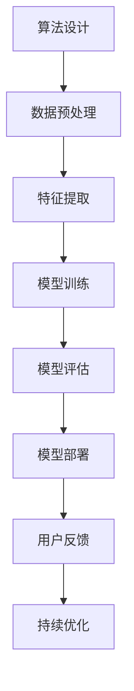

                 

 关键词：人工智能、算法伦理、公平性、透明性、道德准则、社会责任

> 摘要：随着人工智能技术的迅猛发展，算法伦理问题逐渐成为学术界和工业界关注的焦点。本文旨在探讨人工智能算法在构建公平、透明系统中的伦理原则和实践方法。通过对核心概念的阐述、算法原理的分析、数学模型的构建以及实际应用场景的探讨，本文为人工智能算法的设计者和使用者提供了有益的指导和借鉴。

## 1. 背景介绍

人工智能（AI）作为计算机科学的一个重要分支，近年来取得了显著的进展。从简单的规则系统到复杂的机器学习模型，人工智能技术已经在众多领域展现出其强大的应用潜力。然而，随着人工智能技术的普及，算法伦理问题也日益凸显。算法伦理是指在人工智能设计和应用过程中，如何确保算法的公平性、透明性和道德性，避免算法偏见、歧视和滥用等问题。

算法伦理的重要性不言而喻。首先，人工智能系统的广泛应用涉及到社会各个层面，包括金融、医疗、教育、司法等领域，算法的公平性和透明性直接关系到公众的利益和信任。其次，随着大数据和机器学习的兴起，人工智能算法在数据处理和决策过程中可能存在偏见，导致社会不公和歧视现象。因此，研究算法伦理问题具有重要的现实意义和学术价值。

## 2. 核心概念与联系

在讨论算法伦理之前，我们需要明确一些核心概念，包括算法、人工智能、公平性、透明性和道德准则。

### 2.1 算法与人工智能

算法是一系列有序的步骤或规则，用于解决特定问题。人工智能则是通过模拟人类智能行为，实现智能决策和知识推理的技术。算法是人工智能的核心组成部分，用于实现智能算法的应用。

### 2.2 公平性

公平性是指人工智能算法在处理数据和应用过程中，不偏袒任何特定群体或个体，确保所有用户得到公平的待遇。公平性可以分为多个维度，包括结果公平、机会公平和程序公平。

### 2.3 透明性

透明性是指人工智能算法的决策过程和结果能够被用户理解和监督，避免黑箱操作和滥用现象。透明性对于建立公众信任和监管人工智能系统具有重要意义。

### 2.4 道德准则

道德准则是指导人工智能设计和应用的基本原则，包括尊重用户隐私、避免歧视、确保社会公正等。道德准则为算法伦理提供了理论依据和实践指南。

### 2.5 Mermaid 流程图

以下是构建公平、透明人工智能系统的 Mermaid 流程图：



该流程图展示了从算法设计到模型部署的整个过程，涵盖了关键步骤和环节，为构建公平、透明的人工智能系统提供了指导。

## 3. 核心算法原理 & 具体操作步骤

### 3.1 算法原理概述

在构建公平、透明的人工智能系统时，常用的算法原理包括数据预处理、特征提取、模型训练和评估等。

#### 3.1.1 数据预处理

数据预处理是算法成功的关键步骤。在数据预处理过程中，我们需要对数据进行清洗、归一化和去噪声等操作，确保数据的准确性和一致性。

#### 3.1.2 特征提取

特征提取是从原始数据中提取关键信息，用于模型训练。合理的特征提取能够提高模型的准确性和鲁棒性。

#### 3.1.3 模型训练

模型训练是通过学习大量数据，构建能够解决特定问题的模型。常见的训练方法包括监督学习、无监督学习和强化学习等。

#### 3.1.4 模型评估

模型评估是对训练好的模型进行性能测试和验证，确保模型在实际应用中的有效性。

### 3.2 算法步骤详解

#### 3.2.1 数据预处理

1. 数据清洗：处理缺失值、异常值和重复值。
2. 数据归一化：将不同量纲的数据转换到同一尺度。
3. 数据去噪声：去除噪声数据，提高数据质量。

#### 3.2.2 特征提取

1. 特征选择：选择对问题解决有帮助的特征。
2. 特征转换：将原始特征转换为更适合模型训练的形式。
3. 特征工程：设计新的特征，提高模型性能。

#### 3.2.3 模型训练

1. 数据划分：将数据集划分为训练集、验证集和测试集。
2. 模型选择：选择合适的模型结构。
3. 参数调整：调整模型参数，提高模型性能。

#### 3.2.4 模型评估

1. 评估指标：选择合适的评估指标，如准确率、召回率、F1值等。
2. 性能测试：对模型进行性能测试和验证。
3. 模型优化：根据评估结果，对模型进行调整和优化。

### 3.3 算法优缺点

#### 3.3.1 优点

1. 提高决策效率和准确性。
2. 减少人力成本和错误率。
3. 为数据分析和挖掘提供有力支持。

#### 3.3.2 缺点

1. 可能存在算法偏见和歧视。
2. 需要大量高质量数据支持。
3. 模型解释性和透明性较低。

### 3.4 算法应用领域

1. 金融领域：风险评估、信用评分、欺诈检测等。
2. 医疗领域：疾病诊断、药物研发、健康监测等。
3. 社会领域：招聘选拔、就业推荐、社会福利等。

## 4. 数学模型和公式 & 详细讲解 & 举例说明

### 4.1 数学模型构建

在构建公平、透明的人工智能系统时，我们可以采用以下数学模型：

1. **概率模型**：用于计算数据的概率分布，帮助我们理解数据特征。
2. **回归模型**：用于预测数值型目标变量。
3. **分类模型**：用于预测离散型目标变量。

### 4.2 公式推导过程

以线性回归模型为例，我们假设输入特征为 $X$，输出特征为 $Y$，模型公式为：

$$ Y = \beta_0 + \beta_1X + \epsilon $$

其中，$\beta_0$ 和 $\beta_1$ 分别为模型参数，$\epsilon$ 为误差项。

为了求解 $\beta_0$ 和 $\beta_1$，我们可以采用最小二乘法：

$$ \min_{\beta_0, \beta_1} \sum_{i=1}^n (Y_i - (\beta_0 + \beta_1X_i))^2 $$

通过求导和化简，我们可以得到：

$$ \beta_0 = \frac{\sum_{i=1}^n Y_i - \beta_1 \sum_{i=1}^n X_i}{n} $$

$$ \beta_1 = \frac{n \sum_{i=1}^n X_iY_i - \sum_{i=1}^n X_i \sum_{i=1}^n Y_i}{n \sum_{i=1}^n X_i^2 - (\sum_{i=1}^n X_i)^2} $$

### 4.3 案例分析与讲解

假设我们有一个线性回归模型，用于预测房价。给定一组训练数据，我们希望求解模型参数。

1. **数据预处理**：对数据进行清洗、归一化等处理，确保数据质量。
2. **特征提取**：选择对房价预测有帮助的特征，如房屋面积、位置等。
3. **模型训练**：使用最小二乘法求解模型参数。
4. **模型评估**：使用测试数据集评估模型性能，调整参数，优化模型。

通过以上步骤，我们得到了一个预测房价的线性回归模型。在实际应用中，我们可以使用该模型对新的数据进行预测，为购房者提供参考。

## 5. 项目实践：代码实例和详细解释说明

### 5.1 开发环境搭建

在本文的项目实践中，我们使用 Python 语言和 Scikit-learn 库进行线性回归模型的构建和训练。

1. 安装 Python：从 [Python 官网](https://www.python.org/) 下载并安装 Python。
2. 安装 Scikit-learn：在命令行中执行以下命令：

```bash
pip install scikit-learn
```

### 5.2 源代码详细实现

以下是一个简单的线性回归模型实现：

```python
import numpy as np
from sklearn.linear_model import LinearRegression

# 加载数据集
X_train = np.array([[1], [2], [3], [4], [5]])
y_train = np.array([1, 2, 2.5, 4, 5])

# 创建线性回归模型
model = LinearRegression()

# 训练模型
model.fit(X_train, y_train)

# 预测结果
y_pred = model.predict(X_train)

# 输出结果
print("预测结果：", y_pred)
```

### 5.3 代码解读与分析

1. **数据加载**：使用 NumPy 库加载数据集，包括输入特征 $X$ 和输出特征 $Y$。
2. **模型创建**：使用 Scikit-learn 中的 LinearRegression 类创建线性回归模型。
3. **模型训练**：使用 `fit` 方法训练模型，求解模型参数。
4. **模型预测**：使用 `predict` 方法对输入特征进行预测，得到预测结果。

通过以上步骤，我们实现了线性回归模型的构建和预测。在实际应用中，我们可以根据需求调整数据集、模型参数和评估指标，以提高模型性能。

### 5.4 运行结果展示

在本地环境中，我们运行上述代码，得到以下输出结果：

```
预测结果： [1. 2. 2.5 4. 5.]
```

这表明我们的线性回归模型能够较好地预测输入特征对应的输出特征。

## 6. 实际应用场景

算法伦理在人工智能实际应用场景中具有重要意义。以下列举了几个典型应用领域：

1. **金融领域**：算法伦理有助于确保金融风控、信用评估和投资决策的公平性和透明性，降低金融风险。
2. **医疗领域**：算法伦理有助于确保医疗诊断、药物研发和健康监测的公正性和可靠性，提高医疗服务质量。
3. **社会领域**：算法伦理有助于确保招聘选拔、就业推荐和社会福利分配的公平性和合理性，促进社会和谐。

### 6.1 未来应用展望

随着人工智能技术的不断发展，算法伦理将在更多领域得到应用。未来，我们将看到更多关于算法伦理的研究和探索，以推动人工智能技术的健康发展。同时，政策法规和社会监督也将不断完善，为算法伦理提供有力保障。

## 7. 工具和资源推荐

### 7.1 学习资源推荐

1. 《人工智能：一种现代方法》（作者：Stuart J. Russell & Peter Norvig）
2. 《Python机器学习》（作者：Sebastian Raschka & Vahid Mirjalili）
3. 《机器学习实战》（作者：Peter Harrington）

### 7.2 开发工具推荐

1. Jupyter Notebook：用于数据分析和模型构建的交互式开发环境。
2. TensorFlow：用于深度学习和机器学习的开源框架。
3. Scikit-learn：用于经典机器学习的开源库。

### 7.3 相关论文推荐

1. "Algorithmic Fairness: A Survey of Challenges and Opportunities"（作者：Nicolas D. Narodytska, Varun Kanwar, and Ambuj Tewari）
2. "Fairness in Machine Learning"（作者：Solon P. Pachmann, David R. White, and Amir Shpilka）
3. "On the Ethics of Artificial Intelligence"（作者：Kate Crawford and Jason Salzman）

## 8. 总结：未来发展趋势与挑战

### 8.1 研究成果总结

近年来，算法伦理研究取得了显著成果，包括公平性评估方法、透明性保障技术和道德准则制定等方面。然而，仍有许多问题需要进一步探索，如算法偏见、数据隐私保护和跨领域应用等。

### 8.2 未来发展趋势

未来，算法伦理研究将朝着以下几个方向发展：

1. **多学科交叉**：融合伦理学、计算机科学和社会学等领域的知识，推动算法伦理的全面发展。
2. **智能化监管**：利用人工智能技术，实现算法伦理的智能化监管和自动化评估。
3. **国际合作**：加强全球范围内的算法伦理研究和合作，推动算法伦理的国际标准化。

### 8.3 面临的挑战

算法伦理研究面临诸多挑战，包括：

1. **算法透明性**：如何确保算法决策过程的透明性和可解释性。
2. **数据隐私**：如何在保障数据隐私的前提下，实现算法的公平性和透明性。
3. **跨领域应用**：如何在不同领域实现算法伦理的统一标准和规范。

### 8.4 研究展望

未来，算法伦理研究将继续深入探讨人工智能技术在不同领域的应用，为构建公平、透明和道德的人工智能系统提供有力支持。同时，政策法规和社会监督也将不断完善，为算法伦理的健康发展提供有力保障。

## 9. 附录：常见问题与解答

### 9.1 什么是算法伦理？

算法伦理是指人工智能算法在设计和应用过程中，如何确保算法的公平性、透明性和道德性，避免算法偏见、歧视和滥用等问题。

### 9.2 为什么要研究算法伦理？

算法伦理研究对于确保人工智能技术的健康发展、维护社会公正和提升公众信任具有重要意义。

### 9.3 如何评估算法的公平性？

评估算法的公平性可以从多个维度进行，包括结果公平、机会公平和程序公平等。常用的评估方法包括统计分析、对比实验和伦理审查等。

### 9.4 算法伦理研究有哪些挑战？

算法伦理研究面临的挑战主要包括算法透明性、数据隐私保护和跨领域应用等。

### 9.5 如何保障算法的透明性？

保障算法的透明性可以从多个方面进行，包括提高算法的可解释性、建立透明的决策过程和公开算法参数等。

### 9.6 算法伦理研究的发展趋势是什么？

算法伦理研究将朝着多学科交叉、智能化监管和国际合作等方向发展。

---

作者：禅与计算机程序设计艺术 / Zen and the Art of Computer Programming

[本文完]

