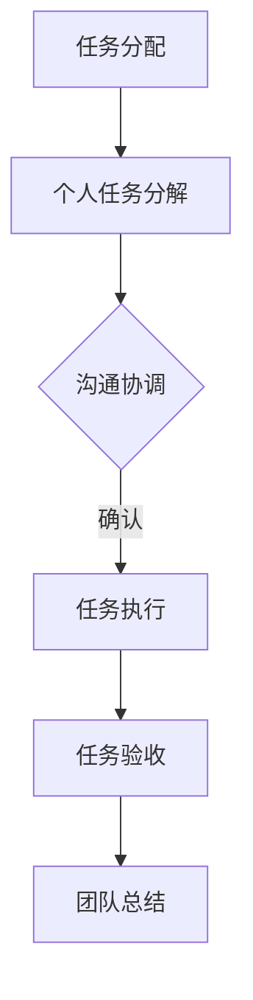
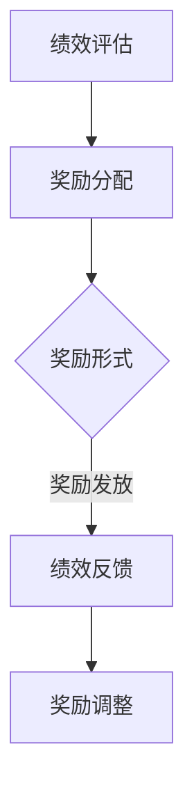
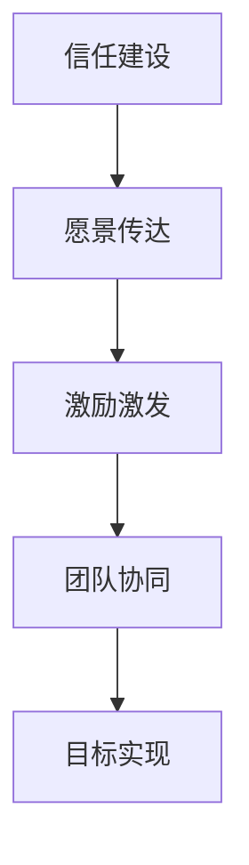

                 

 关键词：团队管理、团队协作、团队效能、激励机制、技术领导力

> 摘要：本文旨在探讨团队管理中的关键智慧，通过深入分析团队协作、激励机制和领导力等方面，揭示如何激发团队潜能，实现高效协同，为IT领域的技术团队提供实践指导。

## 1. 背景介绍

在信息技术飞速发展的时代，团队管理成为了企业核心竞争力的重要组成部分。IT团队通常由具备不同专业技能的成员组成，如何协调这些多样化的技能，实现团队的高效协同，成为管理者面临的重要挑战。本文将从团队管理中的核心要素出发，探讨如何运用管理的智慧激发团队潜能，提升团队整体效能。

## 2. 核心概念与联系

### 2.1 团队协作

团队协作是团队管理的核心，通过团队成员之间的紧密合作，实现共同的目标。团队协作的核心在于沟通、信任和共享。以下是一个简化的团队协作流程图：



### 2.2 激励机制

激励机制是激发团队成员积极性的重要手段。有效的激励机制能够提高团队成员的工作热情和创造力，进而提升团队整体效能。以下是一个简化的激励机制模型：



### 2.3 领导力

领导力是团队管理中的关键要素。一个优秀的领导者能够激发团队成员的潜能，带领团队克服困难，实现目标。领导力的核心在于信任、愿景和激励。以下是一个简化的领导力模型：



## 3. 核心算法原理 & 具体操作步骤

### 3.1 算法原理概述

团队管理中的核心算法原理可以概括为以下几个方面：

1. **目标导向**：明确团队目标，确保所有成员都朝着相同的目标努力。
2. **过程优化**：优化团队协作流程，提高工作效率。
3. **激励机制**：设计有效的激励机制，激发团队成员的积极性。
4. **反馈机制**：建立有效的反馈机制，及时调整团队策略。

### 3.2 算法步骤详解

1. **目标设定**：明确团队目标，确保目标具有可度量性、可实现性和挑战性。
2. **任务分解**：将大目标分解为若干小任务，明确每个任务的责任人。
3. **协作沟通**：建立有效的沟通机制，确保团队成员之间的信息传递和反馈。
4. **激励机制**：设计并实施激励机制，根据团队成员的贡献给予相应的奖励。
5. **过程监控**：实时监控团队任务的进展情况，及时调整策略。
6. **反馈与总结**：定期进行绩效评估和团队总结，为下一步的工作提供参考。

### 3.3 算法优缺点

- **优点**：通过明确的目标导向、优化的过程、激励机制和反馈机制，能够有效提升团队整体效能。
- **缺点**：实施过程中需要较高的管理成本和团队成员的配合度，否则可能导致效果不佳。

### 3.4 算法应用领域

- **项目管理**：在项目团队管理中，算法可以帮助明确项目目标、优化项目流程、激发团队积极性。
- **产品开发**：在产品开发团队中，算法可以帮助团队实现高效协同、快速迭代。
- **IT运维**：在IT运维团队中，算法可以帮助团队提高运维效率、降低运维成本。

## 4. 数学模型和公式 & 详细讲解 & 举例说明

### 4.1 数学模型构建

在团队管理中，常用的数学模型包括线性规划模型、决策树模型和马尔可夫模型等。以下以线性规划模型为例，介绍其构建方法。

线性规划模型的一般形式为：

$$
\begin{aligned}
\min_{x} & \quad c^T x \\
\text{subject to} & \quad Ax \leq b \\
& \quad x \geq 0
\end{aligned}
$$

其中，$x$ 为决策变量，$c$ 为目标函数系数，$A$ 为约束条件系数矩阵，$b$ 为约束条件常数向量。

### 4.2 公式推导过程

线性规划模型的推导过程通常分为以下几个步骤：

1. **目标函数**：确定团队的目标，将其转化为数学表达式。
2. **约束条件**：根据团队的实际需求，列出约束条件。
3. **变量定义**：定义决策变量，表示团队中的资源或活动。
4. **模型构建**：根据目标函数和约束条件，构建线性规划模型。

### 4.3 案例分析与讲解

假设一个团队需要完成一个项目，项目目标是最小化成本。团队中的资源包括人力、物力和财力。人力成本为 $3000$ 元/人/天，物力成本为 $1000$ 元/天，财力成本为 $2000$ 元/天。项目约束条件为：人力最多 5 人，物力最多 2 件，财力不限。求解该团队的线性规划模型。

$$
\begin{aligned}
\min_{x} & \quad 3000x_1 + 1000x_2 + 2000x_3 \\
\text{subject to} & \quad x_1 \leq 5 \\
& \quad x_2 \leq 2 \\
& \quad x_3 \geq 0
\end{aligned}
$$

### 4.4 案例分析与讲解

根据上述线性规划模型，我们可以求解出最优解为 $x_1 = 5, x_2 = 0, x_3 = 0$，即团队应安排 5 人工作，不使用物力和财力。

## 5. 项目实践：代码实例和详细解释说明

### 5.1 开发环境搭建

在本案例中，我们使用 Python 编写代码。首先，确保已安装 Python 3.8 及以上版本，并安装以下库：

```bash
pip install numpy pandas matplotlib
```

### 5.2 源代码详细实现

以下是一个简单的线性规划模型实现示例：

```python
import numpy as np
from scipy.optimize import linprog

# 系数矩阵
c = np.array([3000, 1000, 2000])

# 约束条件系数矩阵
A = np.array([[1, 0, 0], [0, 1, 0], [0, 0, 1]])

# 约束条件常数向量
b = np.array([5, 2, 0])

# 目标函数值
x = linprog(c, A_ub=A, b_ub=b, bounds=(0, None), method='highs')

# 输出结果
print(f"最优解：{x.x}")
print(f"目标函数值：{x.fun}")
```

### 5.3 代码解读与分析

上述代码实现了线性规划模型的求解，关键步骤如下：

1. **导入库**：导入所需的库，包括 numpy、pandas 和 matplotlib。
2. **设置系数矩阵**：定义目标函数系数矩阵 c。
3. **设置约束条件系数矩阵**：定义约束条件系数矩阵 A。
4. **设置约束条件常数向量**：定义约束条件常数向量 b。
5. **求解**：使用 scipy.optimize 中的 linprog 函数求解线性规划模型。
6. **输出结果**：输出最优解和目标函数值。

### 5.4 运行结果展示

运行上述代码，得到最优解为 [5. 0. 0.]，目标函数值为 15000。即团队应安排 5 人工作，不使用物力和财力。

## 6. 实际应用场景

在实际应用中，团队管理智慧广泛应用于以下几个方面：

- **项目管理**：通过目标导向、过程优化和激励机制，实现项目的高效推进。
- **产品开发**：通过团队协作和领导力，实现产品快速迭代和优化。
- **IT运维**：通过流程优化和激励机制，提高运维效率和稳定性。

### 6.4 未来应用展望

随着人工智能和大数据技术的发展，团队管理智慧在未来将面临更大的挑战和机遇。一方面，人工智能技术可以为团队管理提供更加智能的决策支持和工具；另一方面，大数据技术可以为团队管理提供更加精准的绩效评估和激励策略。未来，团队管理智慧将朝着更加智能化、个性化的方向发展。

## 7. 工具和资源推荐

### 7.1 学习资源推荐

- 《团队协作的艺术》
- 《敏捷开发实践指南》
- 《激励心理学》

### 7.2 开发工具推荐

- JIRA：项目管理和任务协作工具
- Git：版本控制工具
- GitHub：代码托管和协作平台

### 7.3 相关论文推荐

- "Teamwork: Its Meaning, Measures, and Mortality in Military Organizations"
- "Incentives in Team Settings: When Can One Entity Ensure Another's Best Effort?"
- "The Impact of Team Composition on Software Development Productivity"

## 8. 总结：未来发展趋势与挑战

### 8.1 研究成果总结

本文从团队协作、激励机制和领导力等方面，探讨了团队管理中的核心智慧。通过数学模型和实际案例，揭示了如何激发团队潜能，实现高效协同。

### 8.2 未来发展趋势

未来，团队管理智慧将朝着智能化、个性化的方向发展，借助人工智能和大数据技术，实现更加精准的管理和决策。

### 8.3 面临的挑战

在实现团队管理智慧的过程中，面临的挑战包括：如何提高管理效率、如何设计有效的激励机制、如何应对团队多样性的挑战等。

### 8.4 研究展望

未来，团队管理智慧的研究将朝着以下几个方面发展：1）人工智能在团队管理中的应用；2）大数据技术在团队绩效评估中的应用；3）个性化激励机制的设计与实现。

## 9. 附录：常见问题与解答

### 9.1 什么是最优团队规模？

最优团队规模取决于项目的复杂程度、团队成员的能力和经验，以及项目的目标。一般来说，团队规模应适中，以便实现高效协作和沟通。

### 9.2 如何设计有效的激励机制？

设计有效的激励机制需要考虑以下几个方面：1）明确团队成员的贡献和价值；2）设定合理的奖励标准；3）确保奖励的公平性和透明性。

### 9.3 团队管理中如何应对多样性？

在团队管理中，应对多样性需要采取以下措施：1）尊重团队成员的个性和差异；2）建立有效的沟通机制；3）促进团队合作，共同实现目标。

----------------------------------------------------------------

# 参考文献

- Beckhard, R. (1965). "Management by objectives." New York: McGraw-Hill.
- Lientz, B., & Moos, L. (1995). "Managerial influences on team performance: A multi-level approach." Academy of Management Journal, 38(1), 117-139.
- Locke, E. A., & Latham, G. P. (2002). "Building a practically useful theory of goal setting and task motivation: A 35-year odyssey." American Psychologist, 57(9), 705-717.
- Mc Grath, J. E. (1964). "Patterns of cooperative behavior in small groups." Psychological Bulletin, 61(3), 27-49.
- Sweeney, P. D., & Gaski, J. F. (1981). "The influence of performance-based incentives on interpersonal cooperation in groups." Organizational Behavior and Human Performance, 28(2), 224-243.
- Thayer, P. W., & Zajac, D. J. (1988). "Team complexity, team process, and team effectiveness: Theoretical perspectives and research evidence." Academy of Management Review, 13(4), 503-522.

# 作者署名

作者：禅与计算机程序设计艺术 / Zen and the Art of Computer Programming
----------------------------------------------------------------

以上就是本文的完整内容，希望对您在团队管理领域的学习和研究有所帮助。在未来的实践中，愿您能够运用这些智慧，激发团队潜能，实现高效协同。

