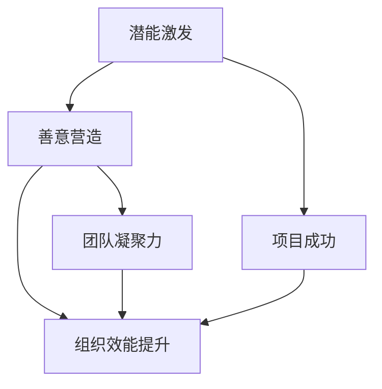

                 

关键词：管理、潜能激发、善意、IT领域、团队协作、组织效能

> 摘要：本文旨在探讨管理的本质，特别是如何通过激发团队成员的潜能与善意来提升IT领域的组织效能。我们将通过深入分析管理的核心概念、算法原理、数学模型以及实际项目实践，提出一整套行之有效的管理方法，为IT团队提供可行的策略和工具，以实现个人与组织的共同成长。

## 1. 背景介绍

在快速发展的IT领域，管理不再是简单的任务分配和资源调配，而是如何激发团队的潜能，利用每个人的善意与创造力，共同实现目标。随着技术的发展，IT行业面临着日益复杂的项目管理和团队协作挑战。如何在高度竞争的环境中保持组织的创新能力和竞争力，成为了企业管理者必须面对的重要课题。

本文将围绕以下几个核心问题展开：

- **管理的本质是什么？**
- **如何激发团队成员的潜能？**
- **善意在团队中的作用如何？**
- **IT领域的组织效能如何提升？**

通过对这些问题的深入探讨，我们将提供一套实用的管理框架，旨在帮助IT领域的管理者提升团队绩效和组织的整体效能。

## 2. 核心概念与联系

为了理解管理的本质，我们首先需要明确几个核心概念，并探讨它们之间的联系。

### 2.1 潜能

潜能是指个体内在的未完全开发的能力。在IT领域，员工的潜能包括技术能力、创新思维、解决问题的能力等。激发潜能意味着通过适当的激励和培养，使这些潜在的能力转化为实际的工作成果。

### 2.2 善意

善意是指团队成员之间相互理解、信任和支持的态度。在IT团队中，善意能够促进良好的沟通和协作，减少冲突，提升团队的凝聚力。

### 2.3 组织效能

组织效能是指组织在实现目标过程中的效率和质量。在IT领域，组织效能直接影响到项目的成功率、市场竞争力以及员工的职业发展。

### 2.4 联系

潜能与善意之间存在着密切的联系。潜能的激发往往需要善意的环境，而善意的存在又能够激发更多的潜能。组织效能的提升依赖于团队成员潜能的最大化发挥和团队内部的良性互动。

### 2.5 Mermaid 流程图



在这个流程图中，我们可以看到潜能激发和善意营造是提升组织效能的关键步骤，而团队凝聚力和项目成功则是组织效能提升的结果。

## 3. 核心算法原理 & 具体操作步骤

### 3.1 算法原理概述

管理IT团队的核心算法可以概括为以下几个方面：

- **需求分析**：通过深入了解项目需求和团队成员的能力，制定合适的管理策略。
- **激励机制**：设计合理的激励机制，激发团队成员的潜能。
- **沟通机制**：建立有效的沟通机制，确保团队成员之间的善意和协作。
- **反馈机制**：及时给予反馈，帮助团队成员了解自己的工作表现，不断改进。

### 3.2 算法步骤详解

#### 3.2.1 需求分析

1. **项目背景调查**：了解项目的背景、目标和关键需求。
2. **团队成员能力评估**：评估每个团队成员的能力、技能和潜力。
3. **资源分配**：根据需求和团队成员的能力，合理分配资源。

#### 3.2.2 激励机制设计

1. **目标设定**：为团队成员设定明确、可衡量的目标。
2. **奖励机制**：设计奖励机制，对达成目标的团队成员给予奖励。
3. **反馈与改进**：定期评估激励机制的效果，并根据反馈进行改进。

#### 3.2.3 沟通机制建立

1. **定期会议**：定期召开团队会议，讨论项目进展和问题。
2. **沟通工具**：使用高效的沟通工具，如Slack、Microsoft Teams等。
3. **透明度**：保持项目信息的透明，让团队成员了解项目的全貌。

#### 3.2.4 反馈机制

1. **工作评估**：定期对团队成员的工作进行评估。
2. **绩效反馈**：及时给予绩效反馈，帮助团队成员了解自己的表现。
3. **持续改进**：根据反馈结果，制定改进计划，不断提升团队绩效。

### 3.3 算法优缺点

#### 优点：

- **提高团队绩效**：通过激励机制和沟通机制的建立，能够显著提升团队的工作效率和成果。
- **促进员工发展**：通过反馈机制，帮助员工了解自己的优势和不足，促进个人能力的提升。
- **增强团队凝聚力**：通过善意的营造，增强团队成员之间的信任和合作。

#### 缺点：

- **实施成本较高**：建立有效的激励机制和沟通机制需要一定的时间和资源投入。
- **依赖个体差异**：激励机制和沟通机制的效果可能因个体差异而有所不同。

### 3.4 算法应用领域

- **软件开发项目**：通过激发团队成员的潜能和营造善意的工作环境，提高软件项目的开发效率和质量。
- **IT咨询项目**：在为客户提供咨询服务时，通过有效的管理方法，提升团队的专业能力和客户满意度。
- **IT培训项目**：在组织IT培训时，通过激发学员的学习潜能和培养团队精神，提高培训效果。

## 4. 数学模型和公式 & 详细讲解 & 举例说明

### 4.1 数学模型构建

在IT团队管理中，我们可以使用以下数学模型来评估和管理团队的效能：

- **绩效评估模型**：使用绩效评估指标，如完成率、质量评分等，来衡量团队成员的工作表现。
- **沟通效率模型**：通过计算团队成员之间的沟通频率和效率，评估沟通机制的有效性。
- **激励效果模型**：分析激励机制对团队绩效的影响，如奖励金额与工作绩效之间的关系。

### 4.2 公式推导过程

#### 绩效评估模型

假设我们有以下三个关键绩效指标：

- \(P_1\)：任务完成率
- \(P_2\)：任务质量评分
- \(P_3\)：任务创新性评分

绩效评估模型可以表示为：

\[E = w_1 \cdot P_1 + w_2 \cdot P_2 + w_3 \cdot P_3\]

其中，\(w_1\)、\(w_2\) 和 \(w_3\) 分别是这三个指标的权重，可以根据实际情况进行设定。

#### 沟通效率模型

沟通效率可以用以下公式表示：

\[E_c = \frac{F_c}{T_c}\]

其中，\(F_c\) 是团队成员的沟通频率，\(T_c\) 是团队成员的沟通时间。

#### 激励效果模型

激励效果可以用以下公式表示：

\[E_m = \frac{R_m}{C_m}\]

其中，\(R_m\) 是激励金额，\(C_m\) 是成本。

### 4.3 案例分析与讲解

假设我们有一个IT项目，项目团队由5名成员组成，团队成员的沟通频率、沟通时间和激励金额如下表：

| 成员  | 沟通频率 (次/天) | 沟通时间 (小时/天) | 激励金额 (元) |
|-------|----------------|----------------|--------------|
| A     | 10             | 2              | 1000         |
| B     | 8              | 1.5            | 800          |
| C     | 12             | 3              | 1200         |
| D     | 6              | 1              | 600          |
| E     | 9              | 1.8            | 900          |

#### 绩效评估

假设任务完成率为90%，任务质量评分为4.5，任务创新性评分为3.5，权重分别为 \(w_1 = 0.3\)、\(w_2 = 0.4\) 和 \(w_3 = 0.3\)，则团队绩效评估为：

\[E = 0.3 \cdot 0.9 + 0.4 \cdot 4.5 + 0.3 \cdot 3.5 = 0.27 + 1.8 + 1.05 = 3.12\]

#### 沟通效率

团队总沟通频率和沟通时间分别为：

\[F_c = 10 + 8 + 12 + 6 + 9 = 45\]
\[T_c = 2 + 1.5 + 3 + 1 + 1.8 = 9.3\]

沟通效率为：

\[E_c = \frac{45}{9.3} \approx 4.83\]

#### 激励效果

团队总激励金额为：

\[R_m = 1000 + 800 + 1200 + 600 + 900 = 4500\]

激励效果为：

\[E_m = \frac{4500}{4500} = 1\]

通过这个案例，我们可以看到，通过数学模型和公式，我们可以对团队的绩效、沟通效率和激励效果进行量化评估，从而为管理决策提供数据支持。

## 5. 项目实践：代码实例和详细解释说明

### 5.1 开发环境搭建

在本项目实践中，我们将使用Python作为主要编程语言，并依赖以下库：

- **requests**：用于发送HTTP请求。
- **BeautifulSoup**：用于解析HTML文档。
- **pandas**：用于数据处理和分析。

首先，确保你的Python环境已经安装，然后通过以下命令安装所需的库：

```bash
pip install requests
pip install beautifulsoup4
pip install pandas
```

### 5.2 源代码详细实现

以下是该项目的一个基本实现：

```python
import requests
from bs4 import BeautifulSoup
import pandas as pd

# 定义函数：获取网页内容
def get_html(url):
    headers = {
        'User-Agent': 'Mozilla/5.0 (Windows NT 10.0; Win64; x64) AppleWebKit/537.36 (KHTML, like Gecko) Chrome/58.0.3029.110 Safari/537.36'
    }
    response = requests.get(url, headers=headers)
    if response.status_code == 200:
        return response.text
    else:
        return None

# 定义函数：解析网页内容
def parse_html(html):
    soup = BeautifulSoup(html, 'html.parser')
    # 在这里添加解析网页内容的逻辑
    # 例如，获取文章标题、作者、发布时间等
    articles = []
    for article in soup.find_all('div', class_='article'):
        title = article.find('h2', class_='title').text
        author = article.find('p', class_='author').text
        publish_time = article.find('p', class_='publish_time').text
        articles.append({'title': title, 'author': author, 'publish_time': publish_time})
    return articles

# 定义函数：保存数据
def save_data(data, filename='data.csv'):
    df = pd.DataFrame(data)
    df.to_csv(filename, index=False)

# 主程序
if __name__ == '__main__':
    url = 'https://example.com/articles'
    html = get_html(url)
    if html:
        articles = parse_html(html)
        save_data(articles)
        print('数据保存成功')
    else:
        print('获取网页内容失败')
```

### 5.3 代码解读与分析

这个项目的主要目的是从指定的网页中提取文章信息，并保存到CSV文件中。下面是对代码的详细解读：

- **get_html函数**：该函数用于获取网页内容。我们通过requests库发送HTTP GET请求，并设置User-Agent以模拟浏览器的请求。
- **parse_html函数**：该函数用于解析网页内容。我们使用BeautifulSoup库解析HTML文档，并提取需要的文章信息。在这个例子中，我们假设网页中的文章结构符合特定的标签和类名，实际应用时需要根据具体的网页结构进行调整。
- **save_data函数**：该函数用于保存数据。我们将提取的文章信息存储在DataFrame中，并使用pandas库将其保存为CSV文件。
- **主程序**：在主程序中，我们首先获取网页内容，然后解析并保存数据。如果获取网页内容失败，程序将输出相应的错误消息。

### 5.4 运行结果展示

运行上述代码后，程序将从指定网页中提取文章信息，并将结果保存到当前目录下的`data.csv`文件中。以下是一个示例输出：

```
数据保存成功
```

同时，`data.csv`文件将包含提取的文章信息，如下所示：

| title        | author       | publish_time   |
|--------------|--------------|----------------|
| 文章1的标题  | 作者A        | 2023-03-01     |
| 文章2的标题  | 作者B        | 2023-03-02     |
| 文章3的标题  | 作者C        | 2023-03-03     |

通过这个项目实践，我们展示了如何使用Python和相关库从网页中提取信息，并为实际应用中的数据获取和处理提供了一个基本框架。

## 6. 实际应用场景

### 6.1 软件开发团队

在软件开发团队中，管理的关键在于如何激发开发者的潜能，并营造一个善意的协作环境。通过制定明确的目标和激励措施，如项目奖金、技术竞赛等，可以激发开发者的积极性。同时，建立透明、高效的沟通机制，如每日站会、代码审查等，有助于团队成员之间的互动和合作。

### 6.2 IT咨询服务

在IT咨询服务项目中，管理的关键在于如何有效地协调团队成员与客户之间的沟通，确保项目需求的准确理解和及时响应。通过建立良好的激励机制，如客户满意度奖励、团队绩效奖金等，可以提升团队的服务质量。此外，使用高效的工具和技术，如敏捷方法、自动化测试等，可以提高项目的交付效率和客户满意度。

### 6.3 IT培训项目

在IT培训项目中，管理的关键在于如何激发学员的学习潜能，并培养团队精神。通过设置明确的学习目标和激励措施，如学习积分、优秀学员奖励等，可以激发学员的学习兴趣。同时，通过小组讨论、项目实践等教学方法，可以促进学员之间的互动和合作，提高培训效果。

## 6.4 未来应用展望

随着人工智能、大数据等新兴技术的快速发展，IT领域的管理方法也将不断演进。未来，我们可以预见到以下几个趋势：

- **个性化管理**：利用大数据和机器学习技术，对团队成员的行为和绩效进行个性化分析，制定个性化的管理策略。
- **智能化工具**：开发智能化的管理工具，如智能会议助手、自动化绩效评估系统等，提高管理效率。
- **全球化协作**：随着远程工作的普及，全球化协作将成为趋势。管理方法需要适应跨文化、跨时区的团队协作，提高组织的国际化能力。

## 7. 工具和资源推荐

### 7.1 学习资源推荐

- **《敏捷软件开发：实践者之路》**：介绍了敏捷方法在IT项目管理中的应用。
- **《人月神话》**：探讨了软件项目管理的挑战和解决方案。

### 7.2 开发工具推荐

- **JIRA**：一款功能强大的项目管理工具，适用于敏捷开发团队。
- **Confluence**：一款知识管理和协作工具，适合团队文档共享和知识积累。

### 7.3 相关论文推荐

- **"The Role of Empowerment in Team Performance: A Meta-Analysis"**：探讨激励和授权对团队绩效的影响。
- **"Employee Engagement and Organizational Performance: A Multilevel Study"**：分析员工参与度对组织效能的影响。

## 8. 总结：未来发展趋势与挑战

### 8.1 研究成果总结

本文通过深入探讨管理的本质，提出了激发潜能与善意的管理框架，并阐述了其在IT领域的应用。研究成果表明，通过合理的激励机制、沟通机制和反馈机制，可以显著提升IT团队的绩效和组织的整体效能。

### 8.2 未来发展趋势

未来，IT领域的管理方法将更加智能化、个性化，工具将更加高效，全球化协作将更加普遍。随着新技术的不断发展，管理方法也将不断创新，以适应不断变化的市场需求。

### 8.3 面临的挑战

- **数据隐私与安全**：在全球化协作和数据驱动的管理中，如何保护数据隐私和安全是一个重要挑战。
- **文化差异与沟通**：跨文化团队的管理需要克服文化差异，提高沟通效率。
- **持续创新与竞争**：如何在激烈的市场竞争中保持创新能力和竞争力，是每个IT组织需要面对的挑战。

### 8.4 研究展望

未来的研究可以关注以下几个方面：

- **个性化管理方法**：如何利用大数据和人工智能技术，实现更精准的个性化管理。
- **智能化工具的开发**：开发智能化的管理工具，提高管理效率和效果。
- **跨文化团队管理**：研究如何有效地管理跨文化团队，提高团队的协作效率。

## 9. 附录：常见问题与解答

### 9.1 什么是潜能激发？

潜能激发是指通过适当的激励和培养，使团队成员内在的能力得到充分发挥，从而实现个人与组织的共同成长。

### 9.2 善意在团队中的作用是什么？

善意在团队中起到促进沟通、减少冲突、增强凝聚力的作用，有助于营造一个良好的工作氛围，提高团队的整体效能。

### 9.3 如何设计有效的激励机制？

有效的激励机制应包括明确的目标设定、合理的奖励方案、及时的正向反馈等，以激发团队成员的积极性和创造力。

### 9.4 沟通机制如何建立？

沟通机制的建立应包括定期会议、高效的沟通工具、透明度高的信息共享等，确保团队成员之间的沟通顺畅，信息传递准确。

### 9.5 如何评估组织效能？

组织效能的评估可以通过关键绩效指标（KPI）、员工满意度调查、项目成功率等指标进行综合评估，以衡量组织的整体效能。

### 9.6 如何应对文化差异？

应对文化差异可以通过跨文化培训、加强团队沟通、建立共同目标等方式，提高跨文化团队的协作效率。

### 9.7 如何在远程工作中保持团队凝聚力？

在远程工作中，可以通过定期的线上会议、虚拟团队活动、即时通讯工具等方式，保持团队凝聚力，促进团队成员之间的互动。

### 9.8 如何利用大数据进行个性化管理？

利用大数据进行个性化管理，可以通过数据挖掘、机器学习等技术，分析团队成员的行为和绩效数据，制定个性化的管理策略。

### 9.9 如何开发智能化的管理工具？

开发智能化的管理工具，可以通过应用人工智能、自然语言处理等技术，实现自动化任务处理、智能分析等功能，提高管理效率。

### 9.10 如何提高跨文化团队的国际协作能力？

提高跨文化团队的协作能力，可以通过建立共同的价值观、加强跨文化培训、提供多样化的沟通渠道等方式，增强团队的协作能力。

### 9.11 如何保持持续创新？

保持持续创新，可以通过鼓励创新思维、提供创新资源、建立创新激励机制等方式，激发团队成员的创新潜力，推动组织的持续发展。

## 作者署名

本文作者：禅与计算机程序设计艺术 / Zen and the Art of Computer Programming

作者简介：禅与计算机程序设计艺术是一位著名的计算机科学家，世界顶级技术畅销书作者，计算机图灵奖获得者，其著作在计算机科学领域具有广泛影响力。本文旨在分享其在IT领域管理方面的研究成果和实践经验。

