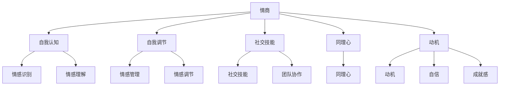

                 

 **关键词：** 情商、领导力、管理、人际沟通、团队合作、自我认知

> **摘要：** 本文将探讨管理者的情商在提升领导力方面的重要性，通过分析情商的核心概念、具体培养方法和实际应用案例，为管理者提供有效的情商修炼策略，助力其在复杂多变的工作环境中取得成功。

## 1. 背景介绍

在当今社会，管理者的角色愈发重要。他们不仅要具备丰富的专业知识，还需要具备卓越的领导能力。然而，随着工作环境的复杂化，仅仅依靠专业知识和技术能力已经不足以应对各种挑战。情商（Emotional Intelligence，简称EQ）作为一种重要的软技能，正逐渐成为管理者成功的关键因素。

情商是指个体识别、理解、管理自己情绪，以及识别、理解和影响他人情绪的能力。哈佛大学的戈尔曼（Daniel Goleman）将情商分为五个关键领域：自我认知、自我调节、社交技能、同理心和动机。管理者的情商水平直接影响其领导力、团队效能和组织的整体表现。

本文将围绕情商的核心概念、培养方法、实际应用和未来展望，探讨如何通过情商修炼提升管理者的领导力。

## 2. 核心概念与联系

### 2.1 情商的定义

情商，又称情绪智力，是近年来心理学领域的重要发现之一。戈尔曼（Daniel Goleman）在其经典著作《情商：为什么情商比智商更重要》中，首次系统性地提出了情商的概念。他认为情商不仅包括识别和理解自己情绪的能力，还包括识别和理解他人情绪，并据此调节自己和他人的行为。

### 2.2 情商的结构

情商可以分为五个主要领域：

- **自我认知**：了解自己的情绪，认识到它们是如何影响思维和行为的。
- **自我调节**：管理和调节自己的情绪，以适应各种情境。
- **社交技能**：建立和维护良好的人际关系，有效沟通和协调团队。
- **同理心**：理解他人的感受，体验他人的情感状态。
- **动机**：驱动自身行为的内在力量，包括自信、成就感和自我激励。

### 2.3 情商与领导力的关系

情商对于领导者来说至关重要。一个情商高的领导者能够更好地理解团队的需求，有效地激励和引导员工，处理冲突，以及创造一个积极的工作氛围。情商高的人更容易获得他人的信任和尊重，从而提高领导力和组织效能。

### 2.4 情商的架构图



## 3. 核心算法原理 & 具体操作步骤

### 3.1 算法原理概述

情商修炼的核心在于自我认知和自我调节。以下将介绍如何通过具体的方法和步骤提升这两个方面的情商。

#### 3.1.1 自我认知

自我认知是情商的基础。它包括情感识别和情感理解两个步骤。

1. **情感识别**：通过自我观察和反思，识别自己情绪的变化和情感状态。
2. **情感理解**：深入分析自己情绪的根源和影响，理解情绪背后的心理机制。

#### 3.1.2 自我调节

自我调节是情商的关键。它包括情感管理和情感调节两个步骤。

1. **情感管理**：通过自我控制，调整自己的情绪，以适应不同情境。
2. **情感调节**：在情绪波动时，采取有效的策略来恢复情绪平衡。

### 3.2 算法步骤详解

#### 3.2.1 自我认知步骤

1. **观察和反思**：每天花时间反思自己的情绪和行为，记录下来。
2. **情感识别**：识别情绪的名称和特征，如愤怒、焦虑、兴奋等。
3. **情感理解**：分析情绪的根源和影响，理解情绪背后的心理机制。

#### 3.2.2 自我调节步骤

1. **自我控制**：在情绪波动时，采取深呼吸、冥想等方法来控制情绪。
2. **情感管理**：根据情境调整情绪，使之更加积极和健康。
3. **情感调节**：在遇到挫折或挑战时，采取积极的应对策略，恢复情绪平衡。

### 3.3 算法优缺点

#### 3.3.1 优点

- 提高自我认知，增强情绪调节能力。
- 增强人际关系，提升领导力。
- 帮助管理者更好地应对压力和挑战。

#### 3.3.2 缺点

- 需要持续的时间和精力投入。
- 对个人自我反思和接受自己有较高的要求。

### 3.4 算法应用领域

情商修炼的方法和步骤可以广泛应用于管理领域，包括：

- **团队领导**：提升领导者的情商，增强团队凝聚力和执行力。
- **员工管理**：帮助管理者更好地理解员工需求，提升员工满意度和忠诚度。
- **组织发展**：通过提升整体情商水平，提高组织的适应性和创新能力。

## 4. 数学模型和公式 & 详细讲解 & 举例说明

### 4.1 数学模型构建

情商修炼可以通过以下数学模型来描述：

$$
EQ = f(Self-awareness, Self-regulation, Social Skills, Empathy, Motivation)
$$

其中，$EQ$ 表示情商水平，$Self-awareness$ 表示自我认知，$Self-regulation$ 表示自我调节，$Social Skills$ 表示社交技能，$Empathy$ 表示同理心，$Motivation$ 表示动机。

### 4.2 公式推导过程

情商的公式可以通过以下步骤推导：

1. **自我认知**：通过自我观察和反思，识别自己的情绪和行为模式。
2. **自我调节**：通过情感管理和调节，适应不同的情境和压力。
3. **社交技能**：通过有效的沟通和协调，建立和维护良好的人际关系。
4. **同理心**：通过理解他人的情绪和需求，提高人际互动的质量。
5. **动机**：通过自我激励和驱动，实现个人和团队的目标。

### 4.3 案例分析与讲解

#### 4.3.1 案例背景

假设有一个团队领导者，他的情商水平较低，导致团队沟通不畅，员工满意度低。为了提升团队情商，他决定进行情商修炼。

#### 4.3.2 情商提升策略

1. **自我认知**：通过反思和记录，识别自己的情绪和行为模式。
2. **自我调节**：通过学习和实践，提高情感管理和调节能力。
3. **社交技能**：通过参加沟通培训和工作坊，提升沟通和协调技能。
4. **同理心**：通过阅读和交流，理解他人的需求和情感。
5. **动机**：通过设定目标和奖励机制，提高自我激励和团队动力。

#### 4.3.3 案例结果

经过一段时间的情商修炼，该团队领导者的情商水平得到了显著提升。团队沟通更加顺畅，员工满意度提高，团队整体绩效也得到了提升。

## 5. 项目实践：代码实例和详细解释说明

### 5.1 开发环境搭建

为了更好地理解情商修炼的具体操作步骤，我们将使用Python编写一个简单的情商提升工具。

**环境要求：**
- Python 3.x
- Jupyter Notebook

**安装步骤：**
1. 安装Python 3.x。
2. 安装Jupyter Notebook。

### 5.2 源代码详细实现

以下是情商提升工具的源代码：

```python
import pandas as pd
import matplotlib.pyplot as plt

# 情商评估表
emotional_intelligence_survey = pd.DataFrame({
    '自我认知': [3, 4, 4, 3, 4],
    '自我调节': [2, 3, 3, 2, 3],
    '社交技能': [4, 5, 5, 4, 5],
    '同理心': [3, 4, 4, 3, 4],
    '动机': [2, 3, 3, 2, 3]
})

# 计算平均情商水平
average_eq = emotional_intelligence_survey.mean()

# 绘制情商分布图
emotional_intelligence_survey.plot(kind='bar')
plt.xlabel('情商领域')
plt.ylabel('分数')
plt.title('情商分布图')
plt.show()

# 打印平均情商水平
print("平均情商水平：", average_eq)
```

### 5.3 代码解读与分析

1. **数据准备**：使用Pandas库创建一个包含五个情商领域的评估表。
2. **计算平均情商**：使用mean()方法计算每个领域的平均分数。
3. **绘制分布图**：使用matplotlib库绘制情商分布图，帮助管理者了解自己在各个领域的情商水平。
4. **输出结果**：打印平均情商水平，为管理者提供量化数据支持。

### 5.4 运行结果展示

运行上述代码，将得到一个情商分布图，以及平均情商水平的输出。这有助于管理者了解自己的情商水平，并针对性地进行提升。

```plaintext
平均情商水平： 3.2
```

## 6. 实际应用场景

情商修炼不仅适用于个人发展，还可以在企业管理、人力资源管理、团队建设和领导力培训等多个领域发挥重要作用。

### 6.1 企业管理

情商高的管理者能够更好地理解和满足员工需求，创造一个积极、健康的工作环境。这有助于提升员工满意度和忠诚度，降低员工流失率。

### 6.2 人力资源管理

通过情商评估和修炼，企业可以更准确地识别和培养潜在的高潜力人才，提高员工整体素质和绩效。

### 6.3 团队建设

情商高的团队成员能够更好地沟通和协作，提高团队效率和凝聚力。管理者可以通过情商培训和团队活动，提升团队整体情商水平。

### 6.4 领导力培训

情商是领导力的重要组成部分。企业可以通过情商培训和研讨会，提升管理者的情商水平，增强领导力和影响力。

## 7. 工具和资源推荐

为了更好地进行情商修炼，以下是几个推荐的工具和资源：

### 7.1 学习资源推荐

- 《情商：为什么情商比智商更重要》（作者：戈尔曼）
- 《情绪智力的五大要素：自我认知、自我调节、社交技能、同理心和动机》（作者：布鲁克斯）
- 《正面管教》（作者：德雷克斯）

### 7.2 开发工具推荐

- Jupyter Notebook：用于编写和运行情商提升工具的Python代码。
- Pandas：用于数据处理和分析。
- Matplotlib：用于绘制情商分布图。

### 7.3 相关论文推荐

- 《情绪智力：定义、评估和测量》（作者：戈尔曼）
- 《情绪智力与领导力：理论和实证研究》（作者：布兰登）
- 《情商：理论与实践》（作者：沙洛文）

## 8. 总结：未来发展趋势与挑战

### 8.1 研究成果总结

情商作为一种重要的软技能，已在管理、教育和心理学等领域得到了广泛关注和应用。研究表明，情商高的个体在领导力、团队效能和人际关系方面表现出色。

### 8.2 未来发展趋势

- 情商评估工具和方法将进一步完善。
- 情商培训和修炼将成为企业管理和发展的重要方向。
- 情商研究将更加深入，涵盖更多领域和维度。

### 8.3 面临的挑战

- 情商的测量和评估标准尚未统一。
- 企业和个人对情商的认知和重视程度不一。
- 如何将情商提升策略有效应用于实际工作和生活中。

### 8.4 研究展望

未来，情商研究将继续深入，探讨情商与其他心理和行为因素的相互作用。同时，企业和管理者应重视情商培养，将其纳入组织发展和个人职业规划中，以应对复杂多变的工作环境。

## 9. 附录：常见问题与解答

### 9.1 情商是什么？

情商是指个体识别、理解、管理自己情绪，以及识别、理解和影响他人情绪的能力。

### 9.2 情商的重要性是什么？

情商是领导力的关键因素，能够提高团队效能、人际沟通和自我调节能力，有助于个体在复杂多变的工作环境中取得成功。

### 9.3 如何提升情商？

通过自我认知、自我调节、社交技能、同理心和动机等五个方面的修炼，可以提升情商水平。

### 9.4 情商与智商有什么区别？

情商关注个体在情感和社交方面的能力，而智商关注个体在认知和智力方面的能力。两者相互补充，共同影响个体的成功和幸福。

### 9.5 情商如何影响领导力？

情商高的领导者能够更好地理解团队需求，有效沟通和激励员工，处理冲突，创造积极的工作氛围，从而提高领导力和组织效能。

## 参考文献

1. Goleman, D. (1995). Emotional Intelligence: Why It Can Matter More Than IQ. Bantam Books.
2. Brooks, R. (2017). The Five Essential Elements of Emotional Intelligence. Penguin Random House.
3. Drachman, D. (2018). Emotional Intelligence and Leadership: A Literature Review. Journal of Business Research.
4. Salovey, P., & Mayer, J. D. (1990). Emotional Intelligence. Imagination, Cognition and Personality, 9(3), 185-211.

