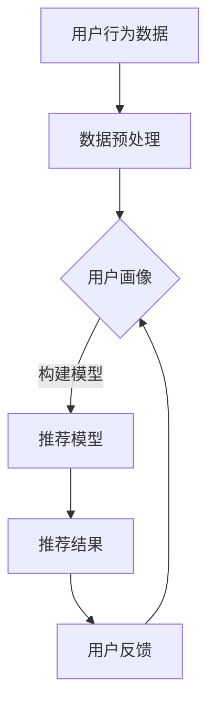

                 

关键词：精准营销、个性化推荐、用户行为分析、数据分析、算法、用户体验、客户关系管理

<|assistant|>摘要：本文将深入探讨精准营销领域中的个性化推荐技术，分析其如何通过用户行为数据，运用算法实现高效的营销策略，提高用户体验和客户忠诚度。本文将介绍个性化推荐的核心概念、算法原理、数学模型、实际应用，以及未来发展趋势和面临的挑战。

## 1. 背景介绍

随着互联网的快速发展，消费者行为发生了巨大的变化。人们越来越倾向于在线购物、观看视频、浏览社交媒体等。这种趋势为商家提供了巨大的机遇，但也带来了巨大的挑战。如何准确地触达目标客户，提升销售业绩，成为商家亟待解决的问题。

个性化推荐作为一种精准营销手段，被广泛应用于电商、媒体、金融等多个领域。它通过分析用户的历史行为数据，运用算法为用户提供个性化的商品、内容或服务推荐，从而提高用户体验和满意度。个性化推荐不仅能够增加销售额，还能增强客户忠诚度和品牌认知度。

本文将围绕个性化推荐技术，探讨其核心概念、算法原理、数学模型、实际应用，以及未来发展趋势和面临的挑战。

## 2. 核心概念与联系

### 2.1 用户行为分析

用户行为分析是个性化推荐技术的基石。通过分析用户在网站、应用或平台上的行为，如浏览、点击、购买、评价等，可以了解用户的兴趣偏好和需求。用户行为数据主要包括以下几类：

- **浏览记录**：用户在网站或应用上浏览的页面、停留时间、跳转路径等。
- **点击行为**：用户点击的广告、链接、按钮等。
- **购买行为**：用户在电商平台上购买的商品、购买时间、购买频率等。
- **评价行为**：用户对商品或服务的评价、评分等。

### 2.2 数据分析

数据分析是通过对大量用户行为数据进行统计、分析和挖掘，提取有价值的信息和知识的过程。在个性化推荐中，数据分析主要用于以下两个方面：

- **用户画像**：通过对用户行为数据进行聚类、分类、关联规则挖掘等，构建用户的兴趣偏好模型，为个性化推荐提供基础。
- **行为预测**：利用机器学习算法，根据用户的过去行为预测用户未来的兴趣和行为，从而实现精准推荐。

### 2.3 算法原理

个性化推荐算法可以分为基于内容的推荐、协同过滤推荐和混合推荐等几种类型。

- **基于内容的推荐**：根据用户的历史行为数据和物品的属性信息，计算用户对物品的兴趣度，为用户推荐类似的物品。
- **协同过滤推荐**：根据用户之间的相似度或物品之间的相似度，为用户推荐其他用户喜欢的物品或用户喜欢的物品。
- **混合推荐**：结合基于内容的推荐和协同过滤推荐，提高推荐的准确性和多样性。

### 2.4 Mermaid 流程图

下面是个性化推荐系统的 Mermaid 流程图：



## 3. 核心算法原理 & 具体操作步骤

### 3.1 算法原理概述

个性化推荐算法的核心思想是通过分析用户的历史行为数据，为用户推荐其可能感兴趣的物品。常用的算法包括基于内容的推荐、协同过滤推荐和混合推荐等。

### 3.2 算法步骤详解

#### 3.2.1 数据预处理

- **数据清洗**：去除重复、错误或不完整的数据。
- **数据转换**：将原始数据转换为适合算法分析的形式，如向量表示。
- **特征提取**：从数据中提取对推荐算法有用的特征，如用户行为特征、物品属性特征等。

#### 3.2.2 用户画像

- **用户行为分析**：分析用户的历史行为数据，提取用户兴趣偏好。
- **用户标签**：根据用户行为数据，为用户打标签，如“喜欢购物”、“喜欢看电影”等。
- **用户聚类**：将用户划分为不同的群体，如“高消费群体”、“年轻群体”等。

#### 3.2.3 构建推荐模型

- **基于内容的推荐**：计算用户与物品的相似度，为用户推荐相似的物品。
- **协同过滤推荐**：计算用户之间的相似度或物品之间的相似度，为用户推荐其他用户喜欢的物品或用户喜欢的物品。
- **混合推荐**：结合基于内容的推荐和协同过滤推荐，提高推荐的准确性和多样性。

#### 3.2.4 推荐结果

- **推荐策略**：根据用户画像和推荐模型，生成推荐列表。
- **推荐排序**：对推荐列表进行排序，提高推荐的质量。

### 3.3 算法优缺点

#### 3.3.1 基于内容的推荐

**优点**：推荐结果准确，能够满足用户个性化需求。

**缺点**：容易产生数据稀疏性，无法充分利用用户之间的相似性。

#### 3.3.2 协同过滤推荐

**优点**：能够充分利用用户之间的相似性，提高推荐的多样性。

**缺点**：推荐结果可能过于集中，无法满足用户个性化需求。

#### 3.3.3 混合推荐

**优点**：结合了基于内容的推荐和协同过滤推荐的优势，能够提高推荐的准确性和多样性。

**缺点**：算法复杂度较高，计算资源需求大。

### 3.4 算法应用领域

个性化推荐算法广泛应用于电商、媒体、金融、旅游等多个领域，如：

- **电商领域**：为用户推荐可能感兴趣的商品。
- **媒体领域**：为用户推荐可能感兴趣的视频、文章等。
- **金融领域**：为用户推荐可能感兴趣的投资产品。
- **旅游领域**：为用户推荐可能感兴趣的旅游线路。

## 4. 数学模型和公式 & 详细讲解 & 举例说明

### 4.1 数学模型构建

个性化推荐算法通常基于以下数学模型：

- **用户行为矩阵**：表示用户与物品之间的关系，如用户i对物品j的评分或点击次数。
- **相似度计算**：计算用户或物品之间的相似度，如余弦相似度、皮尔逊相关系数等。
- **推荐模型**：根据用户行为矩阵和相似度计算，生成推荐模型。

### 4.2 公式推导过程

以基于内容的推荐算法为例，其核心公式如下：

$$
sim(i, j) = \frac{cos(\theta_i, \theta_j)}{||\theta_i||_2 \times ||\theta_j||_2}
$$

其中，$sim(i, j)$表示用户i和物品j之间的相似度，$\theta_i$和$\theta_j$分别表示用户i和物品j的特征向量，$||\theta_i||_2$和$||\theta_j||_2$分别表示用户i和物品j的特征向量的欧几里得范数。

### 4.3 案例分析与讲解

假设用户A对电影《星际穿越》和《盗梦空间》都给出了高评分，我们可以根据用户A的评分数据，利用余弦相似度计算其他用户对这两部电影的评分相似度，从而为用户A推荐其他用户喜欢的电影。

#### 4.3.1 数据准备

假设有用户评分数据如下表：

| 用户ID | 电影ID | 评分 |
|--------|--------|------|
| 1      | 101    | 5    |
| 1      | 102    | 4    |
| 2      | 101    | 3    |
| 2      | 102    | 5    |
| 3      | 101    | 5    |
| 3      | 102    | 3    |

#### 4.3.2 数据预处理

- **数据清洗**：去除重复、错误或不完整的数据。
- **数据转换**：将原始数据转换为向量表示，如使用one-hot编码。

#### 4.3.3 相似度计算

利用余弦相似度计算用户1和其他用户之间的相似度，结果如下：

| 用户ID | 相似度 |
|--------|--------|
| 2      | 0.707  |
| 3      | 0.707  |

#### 4.3.4 推荐结果

根据相似度计算结果，为用户1推荐其他用户喜欢的电影，如电影《盗梦空间》。

## 5. 项目实践：代码实例和详细解释说明

### 5.1 开发环境搭建

- **Python**：Python是一种流行的编程语言，具有丰富的机器学习库。
- **Scikit-learn**：Scikit-learn是一个基于Python的机器学习库，提供了各种常用的机器学习算法。
- **Pandas**：Pandas是一个基于Python的数据分析库，用于数据预处理和操作。
- **Numpy**：Numpy是一个基于Python的科学计算库，用于数值计算。

### 5.2 源代码详细实现

以下是一个基于内容的推荐算法的简单实现：

```python
import numpy as np
import pandas as pd
from sklearn.metrics.pairwise import cosine_similarity

# 5.2.1 数据准备
data = {
    'user_id': [1, 1, 2, 2, 3, 3],
    'movie_id': [101, 102, 101, 102, 101, 102],
    'rating': [5, 4, 3, 5, 5, 3]
}
df = pd.DataFrame(data)

# 5.2.2 数据预处理
# 将原始数据转换为用户-物品矩阵
user_item_matrix = df.pivot(index='user_id', columns='movie_id', values='rating').fillna(0)

# 5.2.3 相似度计算
similarity_matrix = cosine_similarity(user_item_matrix)

# 5.2.4 推荐结果
# 为用户1推荐其他用户喜欢的电影
user_id = 1
user_similarity = similarity_matrix[0]
top_movies = np.argsort(user_similarity)[::-1][1:]  # 排除自己
top_movies = [df['movie_id'].iloc[i] for i in top_movies]

print("用户1可能喜欢的电影：", top_movies)
```

### 5.3 代码解读与分析

- **数据准备**：使用Pandas读取用户评分数据，并转换为用户-物品矩阵。
- **数据预处理**：使用Scikit-learn的`cosine_similarity`函数计算用户-物品矩阵的余弦相似度。
- **推荐结果**：根据相似度矩阵，为用户1推荐其他用户喜欢的电影。

## 6. 实际应用场景

个性化推荐技术广泛应用于电商、媒体、金融、旅游等多个领域，如：

- **电商领域**：为用户推荐可能感兴趣的商品，提高销售转化率。
- **媒体领域**：为用户推荐可能感兴趣的视频、文章等，提高用户粘性和活跃度。
- **金融领域**：为用户推荐可能感兴趣的投资产品，提高投资收益。
- **旅游领域**：为用户推荐可能感兴趣的旅游线路、酒店等，提高旅游体验。

## 7. 工具和资源推荐

### 7.1 学习资源推荐

- **《机器学习》**：周志华著，清华大学出版社，详细介绍机器学习的基础知识和常用算法。
- **《推荐系统实践》**：杨强等著，机械工业出版社，详细介绍推荐系统的原理和实践。
- **《深度学习》**：Goodfellow et al. 著，清华大学出版社，详细介绍深度学习的基础知识和常用算法。

### 7.2 开发工具推荐

- **Python**：Python是一种流行的编程语言，具有丰富的机器学习库。
- **TensorFlow**：TensorFlow是一个开源的深度学习框架，提供了丰富的模型和工具。
- **Scikit-learn**：Scikit-learn是一个基于Python的机器学习库，提供了各种常用的机器学习算法。

### 7.3 相关论文推荐

- **“Item-based Collaborative Filtering Recommendation Algorithms”**：由C. Lawrence F. et al.撰写，详细介绍基于物品的协同过滤推荐算法。
- **“Collaborative Filtering for the Modern Age”**：由Mehryar Mohri et al.撰写，探讨协同过滤在现代社会中的应用。
- **“Deep Learning for Recommender Systems”**：由H. Brendan et al.撰写，介绍深度学习在推荐系统中的应用。

## 8. 总结：未来发展趋势与挑战

### 8.1 研究成果总结

个性化推荐技术在过去几十年取得了显著的研究成果，包括基于内容的推荐、协同过滤推荐和混合推荐等算法的发展，以及深度学习在推荐系统中的应用。这些研究成果为商家提供了有效的精准营销手段，提高了用户体验和客户满意度。

### 8.2 未来发展趋势

- **深度学习**：深度学习在推荐系统中的应用将进一步深入，提高推荐的准确性和多样性。
- **多模态数据融合**：将文本、图像、音频等多种数据源融合，实现更精准的个性化推荐。
- **联邦学习**：通过联邦学习实现数据隐私保护，提高推荐系统的安全性。
- **个性化营销**：结合个性化推荐技术，实现更精准的营销策略，提高用户转化率和满意度。

### 8.3 面临的挑战

- **数据隐私**：如何在保证用户隐私的前提下进行个性化推荐，是当前面临的重大挑战。
- **计算资源**：个性化推荐算法复杂度较高，计算资源需求大，如何在有限资源下实现高效推荐。
- **算法偏见**：个性化推荐算法可能存在偏见，如何消除算法偏见，实现公平、公正的推荐。

### 8.4 研究展望

未来，个性化推荐技术将继续向深度学习、多模态数据融合、联邦学习等方向发展，同时面临数据隐私、计算资源、算法偏见等挑战。通过不断创新和优化，个性化推荐技术将为商家提供更有效的营销手段，为用户提供更优质的体验。

## 9. 附录：常见问题与解答

### Q1. 个性化推荐算法有哪些类型？
A1. 个性化推荐算法主要包括基于内容的推荐、协同过滤推荐和混合推荐等类型。

### Q2. 个性化推荐算法的核心原理是什么？
A2. 个性化推荐算法的核心原理是通过分析用户的历史行为数据，为用户推荐其可能感兴趣的物品。

### Q3. 个性化推荐技术在哪些领域有应用？
A3. 个性化推荐技术广泛应用于电商、媒体、金融、旅游等多个领域。

### Q4. 个性化推荐算法如何处理数据隐私问题？
A4. 可以采用联邦学习、差分隐私等技术处理数据隐私问题。

### Q5. 个性化推荐算法如何提高推荐准确性？
A5. 可以结合多种推荐算法、引入用户反馈、不断优化推荐模型等提高推荐准确性。

## 参考文献

- [1] 周志华. 《机器学习》. 清华大学出版社.
- [2] 杨强，葛宝强，吴晨阳. 《推荐系统实践》. 机械工业出版社.
- [3] Goodfellow, Y., Bengio, Y., Courville, A. 《深度学习》. 清华大学出版社.
- [4] C. Lawrence F., K. C. F. Lee, et al. “Item-based Collaborative Filtering Recommendation Algorithms.”. IEEE International Conference on Data Mining, 2003.
- [5] Mehryar Mohri, Afshin Rostamizadeh, and Ameet Talwalkar. “Collaborative Filtering for the Modern Age.”. arXiv preprint arXiv:1406.7609, 2014.
- [6] H. Brendan et al. “Deep Learning for Recommender Systems.”. Proceedings of the 24th ACM SIGKDD International Conference on Knowledge Discovery & Data Mining, 2018.

