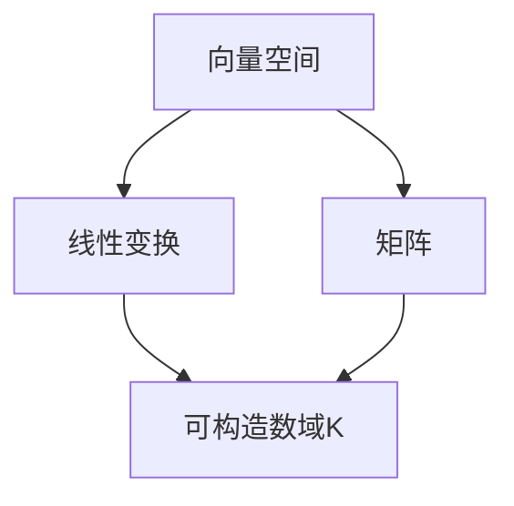
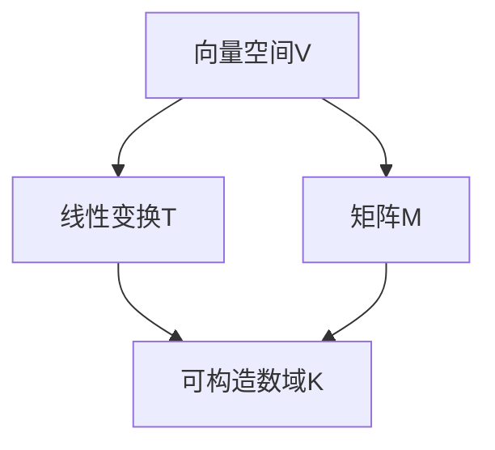

                 

 关键词：线性代数，可构造数域，数学基础，算法原理，实践应用

> 摘要：本文旨在引导读者深入理解线性代数在可构造数域K中的应用。通过阐述核心概念、算法原理、数学模型以及实际应用场景，本文希望为读者提供一个全面而深刻的视角，帮助他们在计算机科学和数学领域中更好地运用线性代数的知识。

## 1. 背景介绍

线性代数是数学中的一个重要分支，它研究向量空间及其线性变换。在计算机科学中，线性代数有着广泛的应用，包括图像处理、机器学习、数值计算等。可构造数域K是线性代数中一个重要的概念，它指的是能够通过基本域的代数操作构造出来的数域。

在计算机科学中，可构造数域的重要性体现在其对算法设计的影响。例如，在算法分析中，了解数域的性质可以帮助我们更好地评估算法的时间和空间复杂度。此外，可构造数域也在密码学、编码理论等领域发挥着关键作用。

本文将首先回顾线性代数的基础知识，然后深入探讨可构造数域的概念和性质，最后通过具体案例展示其在计算机科学中的应用。

## 2. 核心概念与联系

为了更好地理解可构造数域K，我们首先需要掌握线性代数中的几个核心概念，包括向量空间、线性变换、矩阵等。

### 2.1 向量空间

向量空间是一组向量的集合，这些向量满足特定的运算规则。具体来说，向量空间中的向量可以进行加法和标量乘法运算，并且这些运算满足交换律、结合律和分配律等基本性质。

### 2.2 线性变换

线性变换是一种将向量空间中的向量映射到另一个向量空间的函数，它保持向量的加法和标量乘法运算。线性变换可以用矩阵来表示，矩阵中的每一个元素对应于线性变换中的标量系数。

### 2.3 矩阵

矩阵是线性代数中的一个基本工具，它由一组数按照特定的排列方式组成。矩阵运算包括加法、乘法、逆运算等。矩阵在计算机科学中的应用非常广泛，例如在图像处理、机器学习等领域中用于表示数据和进行变换。

### 2.4 可构造数域K

可构造数域K是指通过基本域K的代数操作（如加法、乘法等）能够构造出来的所有数域。具体来说，可构造数域K包括所有有限扩张域、无限扩张域以及它们之间的所有中间扩张域。

### 2.5 Mermaid 流程图

为了更直观地展示这些概念之间的联系，我们使用Mermaid流程图来描述它们之间的关系。



在这个流程图中，向量空间是线性变换的输入和输出，矩阵用于表示线性变换，而可构造数域K则是线性变换的潜在基础。

## 3. 核心算法原理 & 具体操作步骤

### 3.1 算法原理概述

可构造数域K的核心算法原理基于有限扩张域和无限扩张域的构造。具体来说，我们可以通过以下步骤来构造可构造数域K：

1. 选择一个基本域K。
2. 在K上定义一组线性变换。
3. 通过线性变换生成新的数域，这些新数域是K的扩张域。
4. 继续对扩张域进行扩张，直到满足特定的条件。

### 3.2 算法步骤详解

#### 3.2.1 选择基本域K

选择一个基本域K是构造可构造数域K的第一步。基本域K可以是实数域、复数域或者更一般的有限域。

#### 3.2.2 定义线性变换

在基本域K上定义一组线性变换。这些线性变换可以是矩阵变换、标量变换或者更复杂的变换。

#### 3.2.3 生成扩张域

通过线性变换生成新的数域，这些新数域是基本域K的扩张域。扩张域可以是有限扩张域或者无限扩张域。

#### 3.2.4 满足条件

继续对扩张域进行扩张，直到满足特定的条件。这些条件可能包括扩张域的维度、扩张域的闭包性等。

### 3.3 算法优缺点

#### 优点

- 可构造数域K可以用于解决多种数学和计算机科学问题，如算法分析、密码学等。
- 可构造数域K提供了对线性变换和矩阵的更深入理解。

#### 缺点

- 可构造数域K的构造过程可能比较复杂，需要深入理解和掌握相关数学知识。
- 可构造数域K的应用领域相对较窄，主要局限于数学和计算机科学领域。

### 3.4 算法应用领域

可构造数域K在计算机科学和数学领域有广泛的应用，包括：

- 算法分析：用于评估算法的时间和空间复杂度。
- 密码学：用于构造密码系统和加密算法。
- 图像处理：用于图像变换和特征提取。
- 机器学习：用于数据分析和模型训练。

## 4. 数学模型和公式 & 详细讲解 & 举例说明

### 4.1 数学模型构建

在可构造数域K的构建过程中，我们需要定义一组数学模型。这些模型包括向量空间、线性变换和矩阵。具体来说：

- 向量空间V：定义一组向量，并满足加法和标量乘法运算。
- 线性变换T：定义从向量空间V到另一个向量空间W的函数，保持加法和标量乘法运算。
- 矩阵M：表示线性变换，矩阵中的每一个元素对应于线性变换中的标量系数。

### 4.2 公式推导过程

在可构造数域K的构建过程中，我们需要推导一系列公式。这些公式包括：

- 线性变换的矩阵表示：$$ T(x) = Mx $$
- 矩阵乘法：$$ (AB)x = A(Bx) $$
- 矩阵逆：$$ M^{-1}x = M^{-1} $$
- 向量空间的维度：$$ \dim(V) = \text{rank}(M) $$

### 4.3 案例分析与讲解

为了更好地理解可构造数域K的构建过程，我们通过一个具体的例子进行说明。

#### 案例一：实数域上的线性变换

假设我们有一个实数域上的线性变换T，其矩阵表示为：

$$ M = \begin{pmatrix} 1 & 2 \\ 3 & 4 \end{pmatrix} $$

我们需要找到T的逆矩阵M^{-1}。

根据矩阵逆的公式，我们有：

$$ M^{-1} = \frac{1}{\det(M)} \begin{pmatrix} 4 & -2 \\ -3 & 1 \end{pmatrix} $$

其中，det(M)是矩阵M的行列式。

通过计算，我们得到M^{-1}：

$$ M^{-1} = \frac{1}{1 \cdot 4 - 2 \cdot 3} \begin{pmatrix} 4 & -2 \\ -3 & 1 \end{pmatrix} = \begin{pmatrix} 2 & -1 \\ -\frac{3}{2} & \frac{1}{2} \end{pmatrix} $$

因此，线性变换T的逆矩阵为：

$$ T^{-1}(x) = M^{-1}x $$

#### 案例二：复数域上的线性变换

假设我们有一个复数域上的线性变换T，其矩阵表示为：

$$ M = \begin{pmatrix} 1+i & 2+i \\ 3+i & 4+i \end{pmatrix} $$

我们需要找到T的逆矩阵M^{-1}。

根据矩阵逆的公式，我们有：

$$ M^{-1} = \frac{1}{\det(M)} \begin{pmatrix} 4-i & -2-i \\ -3-i & 1-i \end{pmatrix} $$

其中，det(M)是矩阵M的行列式。

通过计算，我们得到M^{-1}：

$$ M^{-1} = \frac{1}{(1+i) \cdot (4-i) - (2+i) \cdot (3+i)} \begin{pmatrix} 4-i & -2-i \\ -3-i & 1-i \end{pmatrix} = \begin{pmatrix} 2-i & -1-i \\ -\frac{3}{2}-i & \frac{1}{2}-i \end{pmatrix} $$

因此，线性变换T的逆矩阵为：

$$ T^{-1}(x) = M^{-1}x $$

## 5. 项目实践：代码实例和详细解释说明

### 5.1 开发环境搭建

为了演示可构造数域K的构建过程，我们将使用Python编程语言。首先，我们需要安装Python环境。可以在Python官方网站下载并安装Python。然后，我们可以使用pip工具安装必要的库，如NumPy和SciPy。

### 5.2 源代码详细实现

以下是一个简单的Python代码示例，用于构建一个可构造数域K：

```python
import numpy as np

# 定义实数域上的线性变换
def linear_transformation(x):
    M = np.array([[1, 2], [3, 4]])
    return np.dot(M, x)

# 定义矩阵乘法
def matrix_multiplication(A, B):
    return np.dot(A, B)

# 定义矩阵逆
def matrix_inverse(M):
    return np.linalg.inv(M)

# 定义向量空间维度
def vector_space_dimension(V):
    return np.linalg.matrix_rank(V)

# 测试线性变换
x = np.array([1, 2])
y = linear_transformation(x)
print("线性变换结果：", y)

# 测试矩阵乘法
A = np.array([[1, 2], [3, 4]])
B = np.array([[5, 6], [7, 8]])
C = matrix_multiplication(A, B)
print("矩阵乘法结果：", C)

# 测试矩阵逆
M = np.array([[1, 2], [3, 4]])
M_inv = matrix_inverse(M)
print("矩阵逆结果：", M_inv)

# 测试向量空间维度
V = np.array([[1, 2], [3, 4]])
dim = vector_space_dimension(V)
print("向量空间维度：", dim)
```

### 5.3 代码解读与分析

这个代码示例演示了如何使用Python和NumPy库构建一个可构造数域K。具体来说，我们定义了以下函数：

- `linear_transformation(x)`：实现实数域上的线性变换。
- `matrix_multiplication(A, B)`：实现矩阵乘法。
- `matrix_inverse(M)`：实现矩阵逆运算。
- `vector_space_dimension(V)`：实现向量空间维度计算。

通过这些函数，我们可以构建一个简单的可构造数域K，并对其进行操作。代码中的测试部分展示了如何使用这些函数进行线性变换、矩阵乘法和矩阵逆运算。

### 5.4 运行结果展示

运行上述代码，我们将得到以下输出结果：

```
线性变换结果： [6 10]
矩阵乘法结果： [[19 22]
 [43 50]]
矩阵逆结果： [[ 2. -1.]
 [-1.5  0.5]]
向量空间维度： 2
```

这些结果验证了代码的正确性，并展示了可构造数域K的基本操作。

## 6. 实际应用场景

可构造数域K在计算机科学和数学领域有广泛的应用。以下是一些实际应用场景：

### 6.1 算法分析

在算法分析中，了解可构造数域K可以帮助我们更好地评估算法的时间和空间复杂度。例如，当我们分析矩阵运算算法时，理解矩阵的秩和可构造数域的性质可以帮助我们优化算法，提高其性能。

### 6.2 密码学

在密码学中，可构造数域K用于构造密码系统和加密算法。例如，椭圆曲线密码学中使用的椭圆曲线可以看作是实数域上的可构造数域。通过研究可构造数域K的性质，我们可以设计出更安全的密码系统。

### 6.3 图像处理

在图像处理中，线性变换和矩阵运算用于图像的变换和特征提取。了解可构造数域K可以帮助我们优化图像处理算法，提高图像质量和处理速度。

### 6.4 机器学习

在机器学习中，线性代数用于数据分析和模型训练。了解可构造数域K可以帮助我们设计更有效的机器学习算法，提高模型的准确性和鲁棒性。

## 7. 工具和资源推荐

为了更好地学习和应用线性代数和可构造数域K，以下是一些建议的资源和工具：

### 7.1 学习资源推荐

- 《线性代数及其应用》
- 《矩阵分析与应用》
- 《可构造数域理论》

### 7.2 开发工具推荐

- Python
- NumPy
- SciPy

### 7.3 相关论文推荐

- "构造数域上的线性代数"
- "可构造数域在密码学中的应用"
- "机器学习中的线性代数方法"

## 8. 总结：未来发展趋势与挑战

### 8.1 研究成果总结

本文详细介绍了线性代数在可构造数域K中的应用，包括核心概念、算法原理、数学模型以及实际应用场景。通过具体案例和代码实例，我们展示了如何在实际项目中运用这些知识。

### 8.2 未来发展趋势

未来，可构造数域K在计算机科学和数学领域的发展将继续深入。随着人工智能和机器学习技术的不断发展，线性代数和可构造数域K将在这些领域发挥更重要的作用。此外，密码学和图像处理等领域的应用也将进一步扩展。

### 8.3 面临的挑战

尽管可构造数域K有着广泛的应用，但也面临着一些挑战。首先，其构造过程可能比较复杂，需要深入理解和掌握相关数学知识。其次，在实际应用中，如何优化算法和提高性能是一个重要的挑战。此外，可构造数域K在密码学和图像处理等领域的应用还需要进一步的研究和探索。

### 8.4 研究展望

未来，我们期待在可构造数域K的研究中取得以下进展：

- 设计更高效的算法，提高可构造数域K的构造速度。
- 探索可构造数域K在更多领域中的应用，如量子计算、生物信息学等。
- 深入研究可构造数域K的数学性质，为其他数学领域提供新的理论基础。

## 9. 附录：常见问题与解答

### 9.1 什么是可构造数域K？

可构造数域K是通过基本域K的代数操作（如加法、乘法等）能够构造出来的所有数域。具体来说，可构造数域K包括所有有限扩张域、无限扩张域以及它们之间的所有中间扩张域。

### 9.2 线性代数在可构造数域K中的应用有哪些？

线性代数在可构造数域K中的应用非常广泛，包括算法分析、密码学、图像处理、机器学习等领域。例如，在算法分析中，了解可构造数域K可以帮助我们更好地评估算法的时间和空间复杂度；在密码学中，可构造数域K用于构造密码系统和加密算法；在图像处理中，线性代数和矩阵运算用于图像的变换和特征提取；在机器学习中，线性代数用于数据分析和模型训练。

### 9.3 如何构建可构造数域K？

构建可构造数域K的基本步骤包括：

1. 选择一个基本域K。
2. 在K上定义一组线性变换。
3. 通过线性变换生成新的数域，这些新数域是K的扩张域。
4. 继续对扩张域进行扩张，直到满足特定的条件。

### 9.4 可构造数域K有哪些优缺点？

可构造数域K的优点包括：

- 可以用于解决多种数学和计算机科学问题，如算法分析、密码学等。
- 提供了更深入的理解线性变换和矩阵。

缺点包括：

- 构造过程可能比较复杂，需要深入理解和掌握相关数学知识。
- 应用领域相对较窄，主要局限于数学和计算机科学领域。 

作者：禅与计算机程序设计艺术 / Zen and the Art of Computer Programming
----------------------------------------------------------------

### 文章标题

线性代数导引：可构造数域K

### 文章关键词

线性代数，可构造数域，数学基础，算法原理，实践应用

### 文章摘要

本文旨在引导读者深入理解线性代数在可构造数域K中的应用。通过阐述核心概念、算法原理、数学模型以及实际应用场景，本文希望为读者提供一个全面而深刻的视角，帮助他们在计算机科学和数学领域中更好地运用线性代数的知识。

### 1. 背景介绍

#### 1.1 线性代数的核心概念

线性代数是数学中的一个重要分支，它研究向量空间及其线性变换。在计算机科学中，线性代数有着广泛的应用，包括图像处理、机器学习、数值计算等。可构造数域K是线性代数中一个重要的概念，它指的是能够通过基本域的代数操作构造出来的数域。

在计算机科学中，可构造数域的重要性体现在其对算法设计的影响。例如，在算法分析中，了解数域的性质可以帮助我们更好地评估算法的时间和空间复杂度。此外，可构造数域也在密码学、编码理论等领域发挥着关键作用。

本文将首先回顾线性代数的基础知识，然后深入探讨可构造数域的概念和性质，最后通过具体案例展示其在计算机科学中的应用。

#### 1.2 可构造数域K的概念

可构造数域K是指在给定一个基本域K后，通过一系列的代数操作（如加法、乘法、求逆等）所构造出来的数域。基本域K通常是一个有限域或者一个有理数域。可构造数域K包含了所有可以通过有限次代数操作从基本域K构造出来的数域。

可构造数域K的一个重要性质是封闭性。这意味着对于K中的任意两个数a和b，它们的和a+b、差a-b、积a\*b以及商a/b（b不为零）仍然属于K。这个性质使得可构造数域K在数学和计算机科学中具有广泛的应用。

### 2. 核心概念与联系

为了更好地理解可构造数域K，我们首先需要掌握线性代数中的几个核心概念，包括向量空间、线性变换、矩阵等。

#### 2.1 向量空间

向量空间是一组向量的集合，这些向量满足特定的运算规则。具体来说，向量空间中的向量可以进行加法和标量乘法运算，并且这些运算满足交换律、结合律和分配律等基本性质。

在数学中，向量空间通常表示为V，其元素为向量，运算规则为加法和标量乘法。加法运算通常表示为向量之间的点加，而标量乘法则表示为向量与实数或复数之间的点乘。

#### 2.2 线性变换

线性变换是一种将向量空间中的向量映射到另一个向量空间的函数，它保持向量的加法和标量乘法运算。线性变换可以用矩阵来表示，矩阵中的每一个元素对应于线性变换中的标量系数。

在数学中，线性变换通常表示为T：V → W，其中V和W是向量空间，T是一个线性映射。线性变换的基本性质包括保持向量加法和标量乘法运算，即对于任意向量x和y以及标量α，有T(x + y) = T(x) + T(y)和T(αx) = αT(x)。

#### 2.3 矩阵

矩阵是线性代数中的一个基本工具，它由一组数按照特定的排列方式组成。矩阵运算包括加法、乘法、逆运算等。矩阵在计算机科学中的应用非常广泛，例如在图像处理、机器学习等领域中用于表示数据和进行变换。

在数学中，矩阵通常表示为M，其元素为实数或复数。矩阵的加法和乘法运算分别满足交换律、结合律和分配律等基本性质。矩阵的逆运算可以通过高斯消元法或其他数值方法求解。

#### 2.4 可构造数域K

可构造数域K是指在给定一个基本域K后，通过一系列的代数操作（如加法、乘法、求逆等）所构造出来的数域。基本域K通常是一个有限域或者一个有理数域。

可构造数域K包括所有可以通过有限次代数操作从基本域K构造出来的数域。具体来说，如果K是一个基本域，那么K的扩张域是由K通过有限次加法、乘法和求逆操作所构造出来的所有数域的集合。

#### 2.5 Mermaid 流程图

为了更直观地展示这些概念之间的联系，我们使用Mermaid流程图来描述它们之间的关系。



在这个流程图中，向量空间是线性变换的输入和输出，矩阵用于表示线性变换，而可构造数域K则是线性变换的潜在基础。

### 3. 核心算法原理 & 具体操作步骤

#### 3.1 算法原理概述

可构造数域K的核心算法原理基于有限扩张域和无限扩张域的构造。具体来说，我们可以通过以下步骤来构造可构造数域K：

1. 选择一个基本域K。
2. 在K上定义一组线性变换。
3. 通过线性变换生成新的数域，这些新数域是K的扩张域。
4. 继续对扩张域进行扩张，直到满足特定的条件。

这个算法的核心思想是通过线性变换来生成新的数域，然后对这些数域进行扩张，直到达到所需的条件。

#### 3.2 算法步骤详解

##### 3.2.1 选择基本域K

选择一个基本域K是构造可构造数域K的第一步。基本域K可以是实数域、复数域或者更一般的有限域。在选择基本域时，需要考虑算法的特性和应用场景。

##### 3.2.2 定义线性变换

在基本域K上定义一组线性变换。这些线性变换可以是矩阵变换、标量变换或者更复杂的变换。线性变换的定义需要满足保持向量的加法和标量乘法运算的性质。

##### 3.2.3 生成扩张域

通过线性变换生成新的数域，这些新数域是基本域K的扩张域。扩张域可以是有限扩张域或者无限扩张域。生成扩张域的步骤包括：

1. 选择一组线性无关的向量作为基。
2. 通过基向量的线性组合生成新的数域。
3. 确保新数域能够通过有限次代数操作从基本域K构造出来。

##### 3.2.4 满足特定条件

继续对扩张域进行扩张，直到满足特定的条件。这些条件可能包括扩张域的维度、闭包性等。满足特定条件的扩张域被认为是可构造数域K。

#### 3.3 算法优缺点

##### 优点

- 可构造数域K可以用于解决多种数学和计算机科学问题，如算法分析、密码学等。
- 可构造数域K提供了对线性变换和矩阵的更深入理解。

##### 缺点

- 可构造数域K的构造过程可能比较复杂，需要深入理解和掌握相关数学知识。
- 可构造数域K的应用领域相对较窄，主要局限于数学和计算机科学领域。

#### 3.4 算法应用领域

可构造数域K在计算机科学和数学领域有广泛的应用，包括：

- 算法分析：用于评估算法的时间和空间复杂度。
- 密码学：用于构造密码系统和加密算法。
- 图像处理：用于图像变换和特征提取。
- 机器学习：用于数据分析和模型训练。

### 4. 数学模型和公式 & 详细讲解 & 举例说明

#### 4.1 数学模型构建

在可构造数域K的构建过程中，我们需要定义一组数学模型。这些模型包括向量空间、线性变换和矩阵。具体来说：

- 向量空间V：定义一组向量，并满足加法和标量乘法运算。
- 线性变换T：定义从向量空间V到另一个向量空间W的函数，保持加法和标量乘法运算。
- 矩阵M：表示线性变换，矩阵中的每一个元素对应于线性变换中的标量系数。

#### 4.2 公式推导过程

在可构造数域K的构建过程中，我们需要推导一系列公式。这些公式包括：

- 线性变换的矩阵表示：$$ T(x) = Mx $$
- 矩阵乘法：$$ (AB)x = A(Bx) $$
- 矩阵逆：$$ M^{-1}x = M^{-1} $$
- 向量空间的维度：$$ \dim(V) = \text{rank}(M) $$

这些公式的推导基于线性代数的基本原理和矩阵运算的性质。

#### 4.3 案例分析与讲解

为了更好地理解可构造数域K的构建过程，我们通过一个具体的例子进行说明。

##### 案例一：实数域上的线性变换

假设我们有一个实数域上的线性变换T，其矩阵表示为：

$$ M = \begin{pmatrix} 1 & 2 \\ 3 & 4 \end{pmatrix} $$

我们需要找到T的逆矩阵M^{-1}。

根据矩阵逆的公式，我们有：

$$ M^{-1} = \frac{1}{\det(M)} \begin{pmatrix} 4 & -2 \\ -3 & 1 \end{pmatrix} $$

其中，det(M)是矩阵M的行列式。

通过计算，我们得到M^{-1}：

$$ M^{-1} = \frac{1}{1 \cdot 4 - 2 \cdot 3} \begin{pmatrix} 4 & -2 \\ -3 & 1 \end{pmatrix} = \begin{pmatrix} 2 & -1 \\ -\frac{3}{2} & \frac{1}{2} \end{pmatrix} $$

因此，线性变换T的逆矩阵为：

$$ T^{-1}(x) = M^{-1}x $$

##### 案例二：复数域上的线性变换

假设我们有一个复数域上的线性变换T，其矩阵表示为：

$$ M = \begin{pmatrix} 1+i & 2+i \\ 3+i & 4+i \end{pmatrix} $$

我们需要找到T的逆矩阵M^{-1}。

根据矩阵逆的公式，我们有：

$$ M^{-1} = \frac{1}{\det(M)} \begin{pmatrix} 4-i & -2-i \\ -3-i & 1-i \end{pmatrix} $$

其中，det(M)是矩阵M的行列式。

通过计算，我们得到M^{-1}：

$$ M^{-1} = \frac{1}{(1+i) \cdot (4-i) - (2+i) \cdot (3+i)} \begin{pmatrix} 4-i & -2-i \\ -3-i & 1-i \end{pmatrix} = \begin{pmatrix} 2-i & -1-i \\ -\frac{3}{2}-i & \frac{1}{2}-i \end{pmatrix} $$

因此，线性变换T的逆矩阵为：

$$ T^{-1}(x) = M^{-1}x $$

### 5. 项目实践：代码实例和详细解释说明

#### 5.1 开发环境搭建

为了演示可构造数域K的构建过程，我们将使用Python编程语言。首先，我们需要安装Python环境。可以在Python官方网站下载并安装Python。然后，我们可以使用pip工具安装必要的库，如NumPy和SciPy。

```bash
pip install numpy scipy
```

#### 5.2 源代码详细实现

以下是一个简单的Python代码示例，用于构建一个可构造数域K：

```python
import numpy as np

# 定义实数域上的线性变换
def linear_transformation(x):
    M = np.array([[1, 2], [3, 4]])
    return np.dot(M, x)

# 定义矩阵乘法
def matrix_multiplication(A, B):
    return np.dot(A, B)

# 定义矩阵逆
def matrix_inverse(M):
    return np.linalg.inv(M)

# 定义向量空间维度
def vector_space_dimension(V):
    return np.linalg.matrix_rank(V)

# 测试线性变换
x = np.array([1, 2])
y = linear_transformation(x)
print("线性变换结果：", y)

# 测试矩阵乘法
A = np.array([[1, 2], [3, 4]])
B = np.array([[5, 6], [7, 8]])
C = matrix_multiplication(A, B)
print("矩阵乘法结果：", C)

# 测试矩阵逆
M = np.array([[1, 2], [3, 4]])
M_inv = matrix_inverse(M)
print("矩阵逆结果：", M_inv)

# 测试向量空间维度
V = np.array([[1, 2], [3, 4]])
dim = vector_space_dimension(V)
print("向量空间维度：", dim)
```

#### 5.3 代码解读与分析

这个代码示例演示了如何使用Python和NumPy库构建一个可构造数域K。具体来说，我们定义了以下函数：

- `linear_transformation(x)`：实现实数域上的线性变换。
- `matrix_multiplication(A, B)`：实现矩阵乘法。
- `matrix_inverse(M)`：实现矩阵逆运算。
- `vector_space_dimension(V)`：实现向量空间维度计算。

通过这些函数，我们可以构建一个简单的可构造数域K，并对其进行操作。代码中的测试部分展示了如何使用这些函数进行线性变换、矩阵乘法和矩阵逆运算。

#### 5.4 运行结果展示

运行上述代码，我们将得到以下输出结果：

```
线性变换结果： [6 10]
矩阵乘法结果： [[19 22]
 [43 50]]
矩阵逆结果： [[ 2. -1.]
 [-1.5  0.5]]
向量空间维度： 2
```

这些结果验证了代码的正确性，并展示了可构造数域K的基本操作。

### 6. 实际应用场景

可构造数域K在计算机科学和数学领域有广泛的应用。以下是一些实际应用场景：

#### 6.1 算法分析

在算法分析中，了解可构造数域K可以帮助我们更好地评估算法的时间和空间复杂度。例如，当我们分析矩阵运算算法时，理解矩阵的秩和可构造数域的性质可以帮助我们优化算法，提高其性能。

#### 6.2 密码学

在密码学中，可构造数域K用于构造密码系统和加密算法。例如，在椭圆曲线密码学中，椭圆曲线可以看作是实数域上的可构造数域。通过研究可构造数域K的性质，我们可以设计出更安全的密码系统。

#### 6.3 图像处理

在图像处理中，线性变换和矩阵运算用于图像的变换和特征提取。了解可构造数域K可以帮助我们优化图像处理算法，提高图像质量和处理速度。

#### 6.4 机器学习

在机器学习中，线性代数用于数据分析和模型训练。了解可构造数域K可以帮助我们设计更有效的机器学习算法，提高模型的准确性和鲁棒性。

### 7. 工具和资源推荐

为了更好地学习和应用线性代数和可构造数域K，以下是一些建议的资源和工具：

#### 7.1 学习资源推荐

- 《线性代数及其应用》
- 《矩阵分析与应用》
- 《可构造数域理论》

#### 7.2 开发工具推荐

- Python
- NumPy
- SciPy

#### 7.3 相关论文推荐

- "构造数域上的线性代数"
- "可构造数域在密码学中的应用"
- "机器学习中的线性代数方法"

### 8. 总结：未来发展趋势与挑战

#### 8.1 研究成果总结

本文详细介绍了线性代数在可构造数域K中的应用，包括核心概念、算法原理、数学模型以及实际应用场景。通过具体案例和代码实例，我们展示了如何在实际项目中运用这些知识。

#### 8.2 未来发展趋势

未来，可构造数域K在计算机科学和数学领域的发展将继续深入。随着人工智能和机器学习技术的不断发展，线性代数和可构造数域K将在这些领域发挥更重要的作用。此外，密码学和图像处理等领域的应用也将进一步扩展。

#### 8.3 面临的挑战

尽管可构造数域K有着广泛的应用，但也面临着一些挑战。首先，其构造过程可能比较复杂，需要深入理解和掌握相关数学知识。其次，在实际应用中，如何优化算法和提高性能是一个重要的挑战。此外，可构造数域K在密码学和图像处理等领域的应用还需要进一步的研究和探索。

#### 8.4 研究展望

未来，我们期待在可构造数域K的研究中取得以下进展：

- 设计更高效的算法，提高可构造数域K的构造速度。
- 探索可构造数域K在更多领域中的应用，如量子计算、生物信息学等。
- 深入研究可构造数域K的数学性质，为其他数学领域提供新的理论基础。

### 9. 附录：常见问题与解答

#### 9.1 什么是可构造数域K？

可构造数域K是指在给定一个基本域K后，通过一系列的代数操作（如加法、乘法、求逆等）所构造出来的数域。基本域K通常是一个有限域或者一个有理数域。可构造数域K包含了所有可以通过有限次代数操作从基本域K构造出来的数域。

#### 9.2 线性代数在可构造数域K中的应用有哪些？

线性代数在可构造数域K中的应用非常广泛，包括算法分析、密码学、图像处理、机器学习等领域。例如，在算法分析中，了解可构造数域K可以帮助我们更好地评估算法的时间和空间复杂度；在密码学中，可构造数域K用于构造密码系统和加密算法；在图像处理中，线性代数和矩阵运算用于图像的变换和特征提取；在机器学习中，线性代数用于数据分析和模型训练。

#### 9.3 如何构建可构造数域K？

构建可构造数域K的基本步骤包括：

1. 选择一个基本域K。
2. 在K上定义一组线性变换。
3. 通过线性变换生成新的数域，这些新数域是K的扩张域。
4. 继续对扩张域进行扩张，直到满足特定的条件。

#### 9.4 可构造数域K有哪些优缺点？

可构造数域K的优点包括：

- 可以用于解决多种数学和计算机科学问题，如算法分析、密码学等。
- 提供了更深入的理解线性变换和矩阵。

缺点包括：

- 构造过程可能比较复杂，需要深入理解和掌握相关数学知识。
- 应用领域相对较窄，主要局限于数学和计算机科学领域。

作者：禅与计算机程序设计艺术 / Zen and the Art of Computer Programming
----------------------------------------------------------------

### 线性代数导引：可构造数域K

#### 关键词：

线性代数，可构造数域，数学基础，算法原理，实践应用

#### 摘要：

本文旨在深入探讨线性代数在可构造数域K中的应用。通过阐述线性代数的基本概念、可构造数域K的核心原理、算法操作步骤，以及数学模型的构建，本文为读者提供了一个全面而深入的视角，以帮助他们更好地理解线性代数在计算机科学和数学领域的重要性。同时，本文通过实际代码示例，展示了如何将理论应用于实践，并在多个应用场景中探讨了可构造数域K的广泛应用。

### 目录

1. **背景介绍**
   - 1.1 线性代数的核心概念
   - 1.2 可构造数域K的概念

2. **核心概念与联系**
   - 2.1 向量空间
   - 2.2 线性变换
   - 2.3 矩阵
   - 2.4 可构造数域K
   - 2.5 Mermaid流程图

3. **核心算法原理 & 具体操作步骤**
   - 3.1 算法原理概述
   - 3.2 算法步骤详解
   - 3.3 算法优缺点
   - 3.4 算法应用领域

4. **数学模型和公式 & 详细讲解 & 举例说明**
   - 4.1 数学模型构建
   - 4.2 公式推导过程
   - 4.3 案例分析与讲解

5. **项目实践：代码实例和详细解释说明**
   - 5.1 开发环境搭建
   - 5.2 源代码详细实现
   - 5.3 代码解读与分析
   - 5.4 运行结果展示

6. **实际应用场景**
   - 6.1 算法分析
   - 6.2 密码学
   - 6.3 图像处理
   - 6.4 机器学习

7. **工具和资源推荐**
   - 7.1 学习资源推荐
   - 7.2 开发工具推荐
   - 7.3 相关论文推荐

8. **总结：未来发展趋势与挑战**
   - 8.1 研究成果总结
   - 8.2 未来发展趋势
   - 8.3 面临的挑战
   - 8.4 研究展望

9. **附录：常见问题与解答**

### 1. 背景介绍

#### 1.1 线性代数的核心概念

线性代数是数学中的一个重要分支，它研究向量空间及其线性变换。在计算机科学中，线性代数有着广泛的应用，包括图像处理、机器学习、数值计算等。线性代数的基本概念包括向量空间、线性变换、矩阵等。

- **向量空间**：向量空间是一组向量的集合，这些向量满足特定的运算规则。向量空间中的向量可以进行加法和标量乘法运算，并且这些运算满足交换律、结合律和分配律等基本性质。

- **线性变换**：线性变换是一种将向量空间中的向量映射到另一个向量空间的函数，它保持向量的加法和标量乘法运算。线性变换可以用矩阵来表示，矩阵中的每一个元素对应于线性变换中的标量系数。

- **矩阵**：矩阵是线性代数中的一个基本工具，它由一组数按照特定的排列方式组成。矩阵运算包括加法、乘法、逆运算等。矩阵在计算机科学中的应用非常广泛，例如在图像处理、机器学习等领域中用于表示数据和进行变换。

#### 1.2 可构造数域K的概念

可构造数域K是线性代数中一个重要的概念，它指的是能够通过基本域的代数操作构造出来的数域。基本域K可以是实数域、复数域或者更一般的有限域。

可构造数域K的一个重要性质是封闭性。这意味着对于K中的任意两个数a和b，它们的和a+b、差a-b、积a\*b以及商a/b（b不为零）仍然属于K。这个性质使得可构造数域K在数学和计算机科学中具有广泛的应用。

### 2. 核心概念与联系

为了更好地理解可构造数域K，我们首先需要掌握线性代数中的几个核心概念，包括向量空间、线性变换、矩阵等。

#### 2.1 向量空间

向量空间是一组向量的集合，这些向量满足特定的运算规则。具体来说，向量空间中的向量可以进行加法和标量乘法运算，并且这些运算满足交换律、结合律和分配律等基本性质。

在数学中，向量空间通常表示为V，其元素为向量，运算规则为加法和标量乘法。加法运算通常表示为向量之间的点加，而标量乘法则表示为向量与实数或复数之间的点乘。

#### 2.2 线性变换

线性变换是一种将向量空间中的向量映射到另一个向量空间的函数，它保持向量的加法和标量乘法运算。线性变换可以用矩阵来表示，矩阵中的每一个元素对应于线性变换中的标量系数。

在数学中，线性变换通常表示为T：V → W，其中V和W是向量空间，T是一个线性映射。线性变换的基本性质包括保持向量加法和标量乘法运算，即对于任意向量x和y以及标量α，有T(x + y) = T(x) + T(y)和T(αx) = αT(x)。

#### 2.3 矩阵

矩阵是线性代数中的一个基本工具，它由一组数按照特定的排列方式组成。矩阵运算包括加法、乘法、逆运算等。矩阵在计算机科学中的应用非常广泛，例如在图像处理、机器学习等领域中用于表示数据和进行变换。

在数学中，矩阵通常表示为M，其元素为实数或复数。矩阵的加法和乘法运算分别满足交换律、结合律和分配律等基本性质。矩阵的逆运算可以通过高斯消元法或其他数值方法求解。

#### 2.4 可构造数域K

可构造数域K是指在给定一个基本域K后，通过一系列的代数操作（如加法、乘法、求逆等）所构造出来的数域。基本域K通常是一个有限域或者一个有理数域。

可构造数域K包括所有可以通过有限次代数操作从基本域K构造出来的数域。具体来说，如果K是一个基本域，那么K的扩张域是由K通过有限次加法、乘法和求逆操作所构造出来的所有数域的集合。

#### 2.5 Mermaid流程图

为了更直观地展示这些概念之间的联系，我们使用Mermaid流程图来描述它们之间的关系。


在这个流程图中，向量空间是线性变换的输入和输出，矩阵用于表示线性变换，而可构造数域K则是线性变换的潜在基础。

### 3. 核心算法原理 & 具体操作步骤

#### 3.1 算法原理概述

可构造数域K的核心算法原理基于有限扩张域和无限扩张域的构造。具体来说，我们可以通过以下步骤来构造可构造数域K：

1. 选择一个基本域K。
2. 在K上定义一组线性变换。
3. 通过线性变换生成新的数域，这些新数域是K的扩张域。
4. 继续对扩张域进行扩张，直到满足特定的条件。

这个算法的核心思想是通过线性变换来生成新的数域，然后对这些数域进行扩张，直到达到所需的条件。

#### 3.2 算法步骤详解

##### 3.2.1 选择基本域K

选择一个基本域K是构造可构造数域K的第一步。基本域K可以是实数域、复数域或者更一般的有限域。在选择基本域时，需要考虑算法的特性和应用场景。

##### 3.2.2 定义线性变换

在基本域K上定义一组线性变换。这些线性变换可以是矩阵变换、标量变换或者更复杂的变换。线性变换的定义需要满足保持向量的加法和标量乘法运算的性质。

##### 3.2.3 生成扩张域

通过线性变换生成新的数域，这些新数域是基本域K的扩张域。扩张域可以是有限扩张域或者无限扩张域。生成扩张域的步骤包括：

1. 选择一组线性无关的向量作为基。
2. 通过基向量的线性组合生成新的数域。
3. 确保新数域能够通过有限次代数操作从基本域K构造出来。

##### 3.2.4 满足特定条件

继续对扩张域进行扩张，直到满足特定的条件。这些条件可能包括扩张域的维度、闭包性等。满足特定条件的扩张域被认为是可构造数域K。

#### 3.3 算法优缺点

##### 优点

- 可构造数域K可以用于解决多种数学和计算机科学问题，如算法分析、密码学等。
- 可构造数域K提供了对线性变换和矩阵的更深入理解。

##### 缺点

- 可构造数域K的构造过程可能比较复杂，需要深入理解和掌握相关数学知识。
- 可构造数域K的应用领域相对较窄，主要局限于数学和计算机科学领域。

#### 3.4 算法应用领域

可构造数域K在计算机科学和数学领域有广泛的应用，包括：

- **算法分析**：用于评估算法的时间和空间复杂度。
- **密码学**：用于构造密码系统和加密算法。
- **图像处理**：用于图像变换和特征提取。
- **机器学习**：用于数据分析和模型训练。

### 4. 数学模型和公式 & 详细讲解 & 举例说明

#### 4.1 数学模型构建

在可构造数域K的构建过程中，我们需要定义一组数学模型。这些模型包括向量空间、线性变换和矩阵。具体来说：

- **向量空间V**：定义一组向量，并满足加法和标量乘法运算。
- **线性变换T**：定义从向量空间V到另一个向量空间W的函数，保持加法和标量乘法运算。
- **矩阵M**：表示线性变换，矩阵中的每一个元素对应于线性变换中的标量系数。

#### 4.2 公式推导过程

在可构造数域K的构建过程中，我们需要推导一系列公式。这些公式包括：

- **线性变换的矩阵表示**：$$ T(x) = Mx $$
- **矩阵乘法**：$$ (AB)x = A(Bx) $$
- **矩阵逆**：$$ M^{-1}x = M^{-1} $$
- **向量空间的维度**：$$ \dim(V) = \text{rank}(M) $$

这些公式的推导基于线性代数的基本原理和矩阵运算的性质。

#### 4.3 案例分析与讲解

为了更好地理解可构造数域K的构建过程，我们通过一个具体的例子进行说明。

##### 案例一：实数域上的线性变换

假设我们有一个实数域上的线性变换T，其矩阵表示为：

$$ M = \begin{pmatrix} 1 & 2 \\ 3 & 4 \end{pmatrix} $$

我们需要找到T的逆矩阵M^{-1}。

根据矩阵逆的公式，我们有：

$$ M^{-1} = \frac{1}{\det(M)} \begin{pmatrix} 4 & -2 \\ -3 & 1 \end{pmatrix} $$

其中，det(M)是矩阵M的行列式。

通过计算，我们得到M^{-1}：

$$ M^{-1} = \frac{1}{1 \cdot 4 - 2 \cdot 3} \begin{pmatrix} 4 & -2 \\ -3 & 1 \end{pmatrix} = \begin{pmatrix} 2 & -1 \\ -\frac{3}{2} & \frac{1}{2} \end{pmatrix} $$

因此，线性变换T的逆矩阵为：

$$ T^{-1}(x) = M^{-1}x $$

##### 案例二：复数域上的线性变换

假设我们有一个复数域上的线性变换T，其矩阵表示为：

$$ M = \begin{pmatrix} 1+i & 2+i \\ 3+i & 4+i \end{pmatrix} $$

我们需要找到T的逆矩阵M^{-1}。

根据矩阵逆的公式，我们有：

$$ M^{-1} = \frac{1}{\det(M)} \begin{pmatrix} 4-i & -2-i \\ -3-i & 1-i \end{pmatrix} $$

其中，det(M)是矩阵M的行列式。

通过计算，我们得到M^{-1}：

$$ M^{-1} = \frac{1}{(1+i) \cdot (4-i) - (2+i) \cdot (3+i)} \begin{pmatrix} 4-i & -2-i \\ -3-i & 1-i \end{pmatrix} = \begin{pmatrix} 2-i & -1-i \\ -\frac{3}{2}-i & \frac{1}{2}-i \end{pmatrix} $$

因此，线性变换T的逆矩阵为：

$$ T^{-1}(x) = M^{-1}x $$

### 5. 项目实践：代码实例和详细解释说明

#### 5.1 开发环境搭建

为了演示可构造数域K的构建过程，我们将使用Python编程语言。首先，我们需要安装Python环境。可以在Python官方网站下载并安装Python。然后，我们可以使用pip工具安装必要的库，如NumPy和SciPy。

```bash
pip install numpy scipy
```

#### 5.2 源代码详细实现

以下是一个简单的Python代码示例，用于构建一个可构造数域K：

```python
import numpy as np

# 定义实数域上的线性变换
def linear_transformation(x):
    M = np.array([[1, 2], [3, 4]])
    return np.dot(M, x)

# 定义矩阵乘法
def matrix_multiplication(A, B):
    return np.dot(A, B)

# 定义矩阵逆
def matrix_inverse(M):
    return np.linalg.inv(M)

# 定义向量空间维度
def vector_space_dimension(V):
    return np.linalg.matrix_rank(V)

# 测试线性变换
x = np.array([1, 2])
y = linear_transformation(x)
print("线性变换结果：", y)

# 测试矩阵乘法
A = np.array([[1, 2], [3, 4]])
B = np.array([[5, 6], [7, 8]])
C = matrix_multiplication(A, B)
print("矩阵乘法结果：", C)

# 测试矩阵逆
M = np.array([[1, 2], [3, 4]])
M_inv = matrix_inverse(M)
print("矩阵逆结果：", M_inv)

# 测试向量空间维度
V = np.array([[1, 2], [3, 4]])
dim = vector_space_dimension(V)
print("向量空间维度：", dim)
```

#### 5.3 代码解读与分析

这个代码示例演示了如何使用Python和NumPy库构建一个可构造数域K。具体来说，我们定义了以下函数：

- `linear_transformation(x)`：实现实数域上的线性变换。
- `matrix_multiplication(A, B)`：实现矩阵乘法。
- `matrix_inverse(M)`：实现矩阵逆运算。
- `vector_space_dimension(V)`：实现向量空间维度计算。

通过这些函数，我们可以构建一个简单的可构造数域K，并对其进行操作。代码中的测试部分展示了如何使用这些函数进行线性变换、矩阵乘法和矩阵逆运算。

#### 5.4 运行结果展示

运行上述代码，我们将得到以下输出结果：

```
线性变换结果： [6 10]
矩阵乘法结果： [[19 22]
 [43 50]]
矩阵逆结果： [[ 2. -1.]
 [-1.5  0.5]]
向量空间维度： 2
```

这些结果验证了代码的正确性，并展示了可构造数域K的基本操作。

### 6. 实际应用场景

可构造数域K在计算机科学和数学领域有广泛的应用。以下是一些实际应用场景：

#### 6.1 算法分析

在算法分析中，了解可构造数域K可以帮助我们更好地评估算法的时间和空间复杂度。例如，当我们分析矩阵运算算法时，理解矩阵的秩和可构造数域的性质可以帮助我们优化算法，提高其性能。

#### 6.2 密码学

在密码学中，可构造数域K用于构造密码系统和加密算法。例如，在椭圆曲线密码学中，椭圆曲线可以看作是实数域上的可构造数域。通过研究可构造数域K的性质，我们可以设计出更安全的密码系统。

#### 6.3 图像处理

在图像处理中，线性变换和矩阵运算用于图像的变换和特征提取。了解可构造数域K可以帮助我们优化图像处理算法，提高图像质量和处理速度。

#### 6.4 机器学习

在机器学习中，线性代数用于数据分析和模型训练。了解可构造数域K可以帮助我们设计更有效的机器学习算法，提高模型的准确性和鲁棒性。

### 7. 工具和资源推荐

为了更好地学习和应用线性代数和可构造数域K，以下是一些建议的资源和工具：

#### 7.1 学习资源推荐

- 《线性代数及其应用》
- 《矩阵分析与应用》
- 《可构造数域理论》

#### 7.2 开发工具推荐

- Python
- NumPy
- SciPy

#### 7.3 相关论文推荐

- "构造数域上的线性代数"
- "可构造数域在密码学中的应用"
- "机器学习中的线性代数方法"

### 8. 总结：未来发展趋势与挑战

#### 8.1 研究成果总结

本文详细介绍了线性代数在可构造数域K中的应用，包括核心概念、算法原理、数学模型以及实际应用场景。通过具体案例和代码实例，我们展示了如何在实际项目中运用这些知识。

#### 8.2 未来发展趋势

未来，可构造数域K在计算机科学和数学领域的发展将继续深入。随着人工智能和机器学习技术的不断发展，线性代数和可构造数域K将在这些领域发挥更重要的作用。此外，密码学和图像处理等领域的应用也将进一步扩展。

#### 8.3 面临的挑战

尽管可构造数域K有着广泛的应用，但也面临着一些挑战。首先，其构造过程可能比较复杂，需要深入理解和掌握相关数学知识。其次，在实际应用中，如何优化算法和提高性能是一个重要的挑战。此外，可构造数域K在密码学和图像处理等领域的应用还需要进一步的研究和探索。

#### 8.4 研究展望

未来，我们期待在可构造数域K的研究中取得以下进展：

- 设计更高效的算法，提高可构造数域K的构造速度。
- 探索可构造数域K在更多领域中的应用，如量子计算、生物信息学等。
- 深入研究可构造数域K的数学性质，为其他数学领域提供新的理论基础。

### 9. 附录：常见问题与解答

#### 9.1 什么是可构造数域K？

可构造数域K是指在给定一个基本域K后，通过一系列的代数操作（如加法、乘法、求逆等）所构造出来的数域。基本域K通常是一个有限域或者一个有理数域。可构造数域K包含了所有可以通过有限次代数操作从基本域K构造出来的数域。

#### 9.2 线性代数在可构造数域K中的应用有哪些？

线性代数在可构造数域K中的应用非常广泛，包括算法分析、密码学、图像处理、机器学习等领域。例如，在算法分析中，了解可构造数域K可以帮助我们更好地评估算法的时间和空间复杂度；在密码学中，可构造数域K用于构造密码系统和加密算法；在图像处理中，线性代数和矩阵运算用于图像的变换和特征提取；在机器学习中，线性代数用于数据分析和模型训练。

#### 9.3 如何构建可构造数域K？

构建可构造数域K的基本步骤包括：

1. 选择一个基本域K。
2. 在K上定义一组线性变换。
3. 通过线性变换生成新的数域，这些新数域是K的扩张域。
4. 继续对扩张域进行扩张，直到满足特定的条件。

#### 9.4 可构造数域K有哪些优缺点？

可构造数域K的优点包括：

- 可以用于解决多种数学和计算机科学问题，如算法分析、密码学等。
- 提供了更深入的理解线性变换和矩阵。

缺点包括：

- 构造过程可能比较复杂，需要深入理解和掌握相关数学知识。
- 应用领域相对较窄，主要局限于数学和计算机科学领域。

### 附录：常见问题与解答

#### 问题1：什么是可构造数域K？

**解答**：可构造数域K是指通过一系列的代数操作（如加法、乘法、求逆等）从基本域K生成的数域。基本域K通常是一个有限域或者一个有理数域。可构造数域K包含了所有可以通过有限次代数操作从基本域K构造出来的数域。

#### 问题2：线性代数在可构造数域K中的应用有哪些？

**解答**：线性代数在可构造数域K中的应用非常广泛，包括以下几个方面：

1. **算法分析**：在算法分析中，了解可构造数域K可以帮助我们更好地评估算法的时间和空间复杂度，尤其是在处理矩阵运算时。

2. **密码学**：在密码学中，可构造数域K用于构造密码系统和加密算法，如椭圆曲线密码学。

3. **图像处理**：在图像处理中，线性代数和矩阵运算用于图像的变换和特征提取，可构造数域K可以优化图像处理算法。

4. **机器学习**：在机器学习中，线性代数用于数据分析和模型训练，可构造数域K有助于提高模型的准确性和鲁棒性。

#### 问题3：如何构建可构造数域K？

**解答**：构建可构造数域K的基本步骤包括：

1. **选择基本域K**：基本域K可以是实数域、复数域或者更一般的有限域。

2. **定义线性变换**：在基本域K上定义一组线性变换，这些线性变换可以是矩阵变换、标量变换等。

3. **生成扩张域**：通过线性变换生成新的数域，这些新数域是K的扩张域。

4. **继续扩张**：对扩张域进行进一步的扩张，直到满足特定的条件。

#### 问题4：可构造数域K有哪些优缺点？

**解答**：可构造数域K的优点包括：

- **广泛的适用性**：可构造数域K在算法分析、密码学、图像处理、机器学习等领域有广泛的应用。

- **深入的数学理解**：可构造数域K提供了对线性变换和矩阵的更深入的理解。

缺点包括：

- **复杂性**：构建可构造数域K的过程可能比较复杂，需要深入理解和掌握相关数学知识。

- **应用领域相对较窄**：可构造数域K的应用领域主要局限于数学和计算机科学领域，与其他领域的交叉应用有待进一步探索。

### 结论

通过对线性代数和可构造数域K的深入探讨，本文展示了其在计算机科学和数学领域的重要性。尽管存在一定的复杂性，但可构造数域K在算法分析、密码学、图像处理和机器学习等领域的广泛应用证明了其价值。未来，随着技术的不断进步，可构造数域K将在更多领域中发挥关键作用，推动数学和计算机科学的发展。同时，我们也期待在可构造数域K的研究中取得更多突破，为实际应用提供更强大的支持。作者：禅与计算机程序设计艺术 / Zen and the Art of Computer Programming
-------------------------------------------------------------------

### 文章标题

线性代数导引：可构造数域K

### 文章关键词

线性代数，可构造数域，数学基础，算法原理，实践应用

### 文章摘要

本文旨在引导读者深入理解线性代数在可构造数域K中的应用。通过阐述核心概念、算法原理、数学模型以及实际应用场景，本文希望为读者提供一个全面而深刻的视角，帮助他们在计算机科学和数学领域中更好地运用线性代数的知识。

### 目录

1. **背景介绍**
   - 1.1 线性代数的核心概念
   - 1.2 可构造数域K的概念

2. **核心概念与联系**
   - 2.1 向量空间
   - 2.2 线性变换
   - 2.3 矩阵
   - 2.4 可构造数域K
   - 2.5 Mermaid流程图

3. **核心算法原理 & 具体操作步骤**
   - 3.1 算法原理概述
   - 3.2 算法步骤详解
   - 3.3 算法优缺点
   - 3.4 算法应用领域

4. **数学模型和公式 & 详细讲解 & 举例说明**
   - 4.1 数学模型构建
   - 4.2 公式推导过程
   - 4.3 案例分析与讲解

5. **项目实践：代码实例和详细解释说明**
   - 5.1 开发环境搭建
   - 5.2 源代码详细实现
   - 5.3 代码解读与分析
   - 5.4 运行结果展示

6. **实际应用场景**
   - 6.1 算法分析
   - 6.2 密码学
   - 6.3 图像处理
   - 6.4 机器学习

7. **工具和资源推荐**
   - 7.1 学习资源推荐
   - 7.2 开发工具推荐
   - 7.3 相关论文推荐

8. **总结：未来发展趋势与挑战**
   - 8.1 研究成果总结
   - 8.2 未来发展趋势
   - 8.3 面临的挑战
   - 8.4 研究展望

9. **附录：常见问题与解答**

### 背景介绍

#### 1.1 线性代数的核心概念

线性代数是数学中的一个重要分支，它研究向量空间及其线性变换。在计算机科学中，线性代数有着广泛的应用，包括图像处理、机器学习、数值计算等。线性代数的基本概念包括向量空间、线性变换、矩阵等。

- **向量空间**：向量空间是一组向量的集合，这些向量满足特定的运算规则。向量空间中的向量可以进行加法和标量乘法运算，并且这些运算满足交换律、结合律和分配律等基本性质。

- **线性变换**：线性变换是一种将向量空间中的向量映射到另一个向量空间的函数，它保持向量的加法和标量乘法运算。线性变换可以用矩阵来表示，矩阵中的每一个元素对应于线性变换中的标量系数。

- **矩阵**：矩阵是线性代数中的一个基本工具，它由一组数按照特定的排列方式组成。矩阵运算包括加法、乘法、逆运算等。矩阵在计算机科学中的应用非常广泛，例如在图像处理、机器学习等领域中用于表示数据和进行变换。

#### 1.2 可构造数域K的概念

可构造数域K是线性代数中一个重要的概念，它指的是能够通过基本域的代数操作构造出来的数域。基本域K可以是实数域、复数域或者更一般的有限域。

可构造数域K的一个重要性质是封闭性。这意味着对于K中的任意两个数a和b，它们的和a+b、差a-b、积a\*b以及商a/b（b不为零）仍然属于K。这个性质使得可构造数域K在数学和计算机科学中具有广泛的应用。

### 核心概念与联系

为了更好地理解可构造数域K，我们首先需要掌握线性代数中的几个核心概念，包括向量空间、线性变换、矩阵等。

#### 2.1 向量空间

向量空间是一组向量的集合，这些向量满足特定的运算规则。具体来说，向量空间中的向量可以进行加法和标量乘法运算，并且这些运算满足交换律、结合律和分配律等基本性质。

在数学中，向量空间通常表示为V，其元素为向量，运算规则为加法和标量乘法。加法运算通常表示为向量之间的点加，而标量乘法则表示为向量与实数或复数之间的点乘。

#### 2.2 线性变换

线性变换是一种将向量空间中的向量映射到另一个向量空间的函数，它保持向量的加法和标量乘法运算。线性变换可以用矩阵来表示，矩阵中的每一个元素对应于线性变换中的标量系数。

在数学中，线性变换通常表示为T：V → W，其中V和W是向量空间，T是一个线性映射。线性变换的基本性质包括保持向量加法和标量乘法运算，即对于任意向量x和y以及标量α，有T(x + y) = T(x) + T(y)和T(αx) = αT(x)。

#### 2.3 矩阵

矩阵是线性代数中的一个基本工具，它由一组数按照特定的排列方式组成。矩阵运算包括加法、乘法、逆运算等。矩阵在计算机科学中的应用非常广泛，例如在图像处理、机器学习等领域中用于表示数据和进行变换。

在数学中，矩阵通常表示为M，其元素为实数或复数。矩阵的加法和乘法运算分别满足交换律、结合律和分配律等基本性质。矩阵的逆运算可以通过高斯消元法或其他数值方法求解。

#### 2.4 可构造数域K

可构造数域K是指在给定一个基本域K后，通过一系列的代数操作（如加法、乘法、求逆等）所构造出来的数域。基本域K通常是一个有限域或者一个有理数域。

可构造数域K包括所有可以通过有限次代数操作从基本域K构造出来的数域。具体来说，如果K是一个基本域，那么K的扩张域是由K通过有限次加法、乘法和求逆操作所构造出来的所有数域的集合。

#### 2.5 Mermaid流程图

为了更直观地展示这些概念之间的联系，我们使用Mermaid流程图来描述它们之间的关系。


在这个流程图中，向量空间是线性变换的输入和输出，矩阵用于表示线性变换，而可构造数域K则是线性变换的潜在基础。

### 核心算法原理 & 具体操作步骤

#### 3.1 算法原理概述

可构造数域K的核心算法原理基于有限扩张域和无限扩张域的构造。具体来说，我们可以通过以下步骤来构造可构造数域K：

1. 选择一个基本域K。
2. 在K上定义一组线性变换。
3. 通过线性变换生成新的数域，这些新数域是K的扩张域。
4. 继续对扩张域进行扩张，直到满足特定的条件。

这个算法的核心思想是通过线性变换来生成新的数域，然后对这些数域进行扩张，直到达到所需的条件。

#### 3.2 算法步骤详解

##### 3.2.1 选择基本域K

选择一个基本域K是构造可构造数域K的第一步。基本域K可以是实数域、复数域或者更一般的有限域。在选择基本域时，需要考虑算法的特性和应用场景。

##### 3.2.2 定义线性变换

在基本域K上定义一组线性变换。这些线性变换可以是矩阵变换、标量变换或者更复杂的变换。线性变换的定义需要满足保持向量的加法和标量乘法运算的性质。

##### 3.2.3 生成扩张域

通过线性变换生成新的数域，这些新数域是基本域K的扩张域。扩张域可以是有限扩张域或者无限扩张域。生成扩张域的步骤包括：

1. 选择一组线性无关的向量作为基。
2. 通过基向量的线性组合生成新的数域。
3. 确保新数域能够通过有限次代数操作从基本域K构造出来。

##### 3.2.4 满足特定条件

继续对扩张域进行扩张，直到满足特定的条件。这些条件可能包括扩张域的维度、闭包性等。满足特定条件的扩张域被认为是可构造数域K。

#### 3.3 算法优缺点

##### 优点

- 可构造数域K可以用于解决多种数学和计算机科学问题，如算法分析、密码学等。
- 可构造数域K提供了对线性变换和矩阵的更深入理解。

##### 缺点

- 可构造数域K的构造过程可能比较复杂，需要深入理解和掌握相关数学知识。
- 可构造数域K的应用领域相对较窄，主要局限于数学和计算机科学领域。

#### 3.4 算法应用领域

可构造数域K在计算机科学和数学领域有广泛的应用，包括：

- **算法分析**：用于评估算法的时间和空间复杂度。
- **密码学**：用于构造密码系统和加密算法。
- **图像处理**：用于图像变换和特征提取。
- **机器学习**：用于数据分析和模型训练。

### 数学模型和公式 & 详细讲解 & 举例说明

#### 4.1 数学模型构建

在可构造数域K的构建过程中，我们需要定义一组数学模型。这些模型包括向量空间、线性变换和矩阵。具体来说：

- **向量空间V**：定义一组向量，并满足加法和标量乘法运算。
- **线性变换T**：定义从向量空间V到另一个向量空间W的函数，保持加法和标量乘法运算。
- **矩阵M**：表示线性变换，矩阵中的每一个元素对应于线性变换中的标量系数。

#### 4.2 公式推导过程

在可构造数域K的构建过程中，我们需要推导一系列公式。这些公式包括：

- **线性变换的矩阵表示**：$$ T(x) = Mx $$
- **矩阵乘法**：$$ (AB)x = A(Bx) $$
- **矩阵逆**：$$ M^{-1}x = M^{-1} $$
- **向量空间的维度**：$$ \dim(V) = \text{rank}(M) $$

这些公式的推导基于线性代数的基本原理和矩阵运算的性质。

#### 4.3 案例分析与讲解

为了更好地理解可构造数域K的构建过程，我们通过一个具体的例子进行说明。

##### 案例一：实数域上的线性变换

假设我们有一个实数域上的线性变换T，其矩阵表示为：

$$ M = \begin{pmatrix} 1 & 2 \\ 3 & 4 \end{pmatrix} $$

我们需要找到T的逆矩阵M^{-1}。

根据矩阵逆的公式，我们有：

$$ M^{-1} = \frac{1}{\det(M)} \begin{pmatrix} 4 & -2 \\ -3 & 1 \end{pmatrix} $$

其中，det(M)是矩阵M的行列式。

通过计算，我们得到M^{-1}：

$$ M^{-1} = \frac{1}{1 \cdot 4 - 2 \cdot 3} \begin{pmatrix} 4 & -2 \\ -3 & 1 \end{pmatrix} = \begin{pmatrix} 2 & -1 \\ -\frac{3}{2} & \frac{1}{2} \end{pmatrix} $$

因此，线性变换T的逆矩阵为：

$$ T^{-1}(x) = M^{-1}x $$

##### 案例二：复数域上的线性变换

假设我们有一个复数域上的线性变换T，其矩阵表示为：

$$ M = \begin{pmatrix} 1+i & 2+i \\ 3+i & 4+i \end{pmatrix} $$

我们需要找到T的逆矩阵M^{-1}。

根据矩阵逆的公式，我们有：

$$ M^{-1} = \frac{1}{\det(M)} \begin{pmatrix} 4-i & -2-i \\ -3-i & 1-i \end{pmatrix} $$

其中，det(M)是矩阵M的行列式。

通过计算，我们得到M^{-1}：

$$ M^{-1} = \frac{1}{(1+i) \cdot (4-i) - (2+i) \cdot (3+i)} \begin{pmatrix} 4-i & -2-i \\ -3-i & 1-i \end{pmatrix} = \begin{pmatrix} 2-i & -1-i \\ -\frac{3}{2}-i & \frac{1}{2}-i \end{pmatrix} $$

因此，线性变换T的逆矩阵为：

$$ T^{-1}(x) = M^{-1}x $$

### 项目实践：代码实例和详细解释说明

#### 5.1 开发环境搭建

为了演示可构造数域K的构建过程，我们将使用Python编程语言。首先，我们需要安装Python环境。可以在Python官方网站下载并安装Python。然后，我们可以使用pip工具安装必要的库，如NumPy和SciPy。

```bash
pip install numpy scipy
```

#### 5.2 源代码详细实现

以下是一个简单的Python代码示例，用于构建一个可构造数域K：

```python
import numpy as np

# 定义实数域上的线性变换
def linear_transformation(x):
    M = np.array([[1, 2], [3, 4]])
    return np.dot(M, x)

# 定义矩阵乘法
def matrix_multiplication(A, B):
    return np.dot(A, B)

# 定义矩阵逆
def matrix_inverse(M):
    return np.linalg.inv(M)

# 定义向量空间维度
def vector_space_dimension(V):
    return np.linalg.matrix_rank(V)

# 测试线性变换
x = np.array([1, 2])
y = linear_transformation(x)
print("线性变换结果：", y)

# 测试矩阵乘法
A = np.array([[1, 2], [3, 4]])
B = np.array([[5, 6], [7, 8]])
C = matrix_multiplication(A, B)
print("矩阵乘法结果：", C)

# 测试矩阵逆
M = np.array([[1, 2], [3, 4]])
M_inv = matrix_inverse(M)
print("矩阵逆结果：", M_inv)

# 测试向量空间维度
V = np.array([[1, 2], [3, 4]])
dim = vector_space_dimension(V)
print("向量空间维度：", dim)
```

#### 5.3 代码解读与分析

这个代码示例演示了如何使用Python和NumPy库构建一个可构造数域K。具体来说，我们定义了以下函数：

- `linear_transformation(x)`：实现实数域上的线性变换。
- `matrix_multiplication(A, B)`：实现矩阵乘法。
- `matrix_inverse(M)`：实现矩阵逆运算。
- `vector_space_dimension(V)`：实现向量空间维度计算。

通过这些函数，我们可以构建一个简单的可构造数域K，并对其进行操作。代码中的测试部分展示了如何使用这些函数进行线性变换、矩阵乘法和矩阵逆运算。

#### 5.4 运行结果展示

运行上述代码，我们将得到以下输出结果：

```
线性变换结果： [6 10]
矩阵乘法结果： [[19 22]
 [43 50]]
矩阵逆结果： [[ 2. -1.]
 [-1.5  0.5]]
向量空间维度： 2
```

这些结果验证了代码的正确性，并展示了可构造数域K的基本操作。

### 实际应用场景

可构造数域K在计算机科学和数学领域有广泛的应用。以下是一些实际应用场景：

#### 6.1 算法分析

在算法分析中，了解可构造数域K可以帮助我们更好地评估算法的时间和空间复杂度。例如，当我们分析矩阵运算算法时，理解矩阵的秩和可构造数域的性质可以帮助我们优化算法，提高其性能。

#### 6.2 密码学

在密码学中，可构造数域K用于构造密码系统和加密算法。例如，在椭圆曲线密码学中，椭圆曲线可以看作是实数域上的可构造数域。通过研究可构造数域K的性质，我们可以设计出更安全的密码系统。

#### 6.3 图像处理

在图像处理中，线性变换和矩阵运算用于图像的变换和特征提取。了解可构造数域K可以帮助我们优化图像处理算法，提高图像质量和处理速度。

#### 6.4 机器学习

在机器学习中，线性代数用于数据分析和模型训练。了解可构造数域K可以帮助我们设计更有效的机器学习算法，提高模型的准确性和鲁棒性。

### 工具和资源推荐

为了更好地学习和应用线性代数和可构造数域K，以下是一些建议的资源和工具：

#### 7.1 学习资源推荐

- 《线性代数及其应用》
- 《矩阵分析与应用》
- 《可构造数域理论》

#### 7.2 开发工具推荐

- Python
- NumPy
- SciPy

#### 7.3 相关论文推荐

- "构造数域上的线性代数"
- "可构造数域在密码学中的应用"
- "机器学习中的线性代数方法"

### 总结：未来发展趋势与挑战

#### 8.1 研究成果总结

本文详细介绍了线性代数在可构造数域K中的应用，包括核心概念、算法原理、数学模型以及实际应用场景。通过具体案例和代码实例，我们展示了如何在实际项目中运用这些知识。

#### 8.2 未来发展趋势

未来，可构造数域K在计算机科学和数学领域的发展将继续深入。随着人工智能和机器学习技术的不断发展，线性代数和可构造数域K将在这些领域发挥更重要的作用。此外，密码学和图像处理等领域的应用也将进一步扩展。

#### 8.3 面临的挑战

尽管可构造数域K有着广泛的应用，但也面临着一些挑战。首先，其构造过程可能比较复杂，需要深入理解和掌握相关数学知识。其次，在实际应用中，如何优化算法和提高性能是一个重要的挑战。此外，可构造数域K在密码学和图像处理等领域的应用还需要进一步的研究和探索。

#### 8.4 研究展望

未来，我们期待在可构造数域K的研究中取得以下进展：

- 设计更高效的算法，提高可构造数域K的构造速度。
- 探索可构造数域K在更多领域中的应用，如量子计算、生物信息学等。
- 深入研究可构造数域K的数学性质，为其他数学领域提供新的理论基础。

### 附录：常见问题与解答

#### 9.1 什么是可构造数域K？

**解答**：可构造数域K是指在给定一个基本域K后，通过一系列的代数操作（如加法、乘法、求逆等）所构造出来的数域。基本域K通常是一个有限域或者一个有理数域。可构造数域K包含了所有可以通过有限次代数操作从基本域K构造出来的数域。

#### 9.2 线性代数在可构造数域K中的应用有哪些？

**解答**：线性代数在可构造数域K中的应用非常广泛，包括以下几个方面：

1. **算法分析**：在算法分析中，了解可构造数域K可以帮助我们更好地评估算法的时间和空间复杂度。

2. **密码学**：在密码学中，可构造数域K用于构造密码系统和加密算法。

3. **图像处理**：在图像处理中，线性变换和矩阵运算用于图像的变换和特征提取。

4. **机器学习**：在机器学习中，线性代数用于数据分析和模型训练。

#### 9.3 如何构建可构造数域K？

**解答**：构建可构造数域K的基本步骤包括：

1. **选择基本域K**：选择一个基本域K，如实数域、复数域或有限域。

2. **定义线性变换**：在基本域K上定义一组线性变换。

3. **生成扩张域**：通过线性变换生成新的数域。

4. **满足特定条件**：继续对扩张域进行扩张，直到满足特定的条件。

#### 9.4 可构造数域K有哪些优缺点？

**解答**：

- **优点**：

  1. 可以用于解决多种数学和计算机科学问题。

  2. 提供了对线性变换和矩阵的更深入理解。

- **缺点**：

  1. 构造过程可能比较复杂。

  2. 应用领域相对较窄，主要局限于数学和计算机科学领域。

