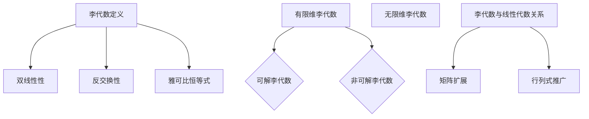

                 

关键词：线性代数、李代数、数学模型、算法原理、项目实践、应用场景

## 摘要

本文旨在为读者提供一个关于线性代数中李代数概念的导引。通过对李代数的核心概念、算法原理、数学模型和应用场景的深入探讨，帮助读者更好地理解和掌握这一重要的数学工具。本文将首先介绍李代数的背景和重要性，接着阐述其核心概念和联系，然后详细讲解算法原理和具体操作步骤，最后通过实际项目实践和数学模型分析，展示李代数的广泛应用和潜力。

## 1. 背景介绍

线性代数作为数学的一个重要分支，广泛应用于自然科学、工程学、计算机科学等多个领域。线性代数研究的主要对象是向量空间及其线性变换，涉及到矩阵理论、行列式、向量组、线性方程组等诸多内容。在传统的线性代数研究中，向量空间和线性变换构成了核心内容，而李代数作为线性代数的延伸和扩展，提供了更加丰富的数学框架和工具。

李代数最早由埃利·卡托尔和艾米·诺特于20世纪初提出，旨在研究线性变换和向量空间之间的复杂关系。李代数的引入为代数学、几何学、量子物理等领域带来了深远的影响。在现代数学中，李代数被认为是研究对称性和群结构的重要工具，其应用范围广泛，从物理学中的粒子理论到计算机科学中的算法设计，都有着重要的应用价值。

本文将首先介绍李代数的基本概念，包括李代数的结构、性质和分类，然后探讨其与线性代数的关系，以及李代数在各个领域的应用。通过本文的阅读，读者将能够深入了解李代数的基本原理和应用，为进一步学习和研究线性代数打下坚实的基础。

## 2. 核心概念与联系

### 2.1 李代数的定义

李代数（Lie algebra）是研究线性变换和向量空间之间关系的数学结构。具体来说，李代数是一个向量空间\( L \)上的一个线性映射 \( [ \cdot, \cdot ]: L \times L \rightarrow L \)，满足以下三个条件：

1. **双线性性**：对于任意的向量\( x, y, z \in L \)和标量\( a, b \)，有
   \[
   [ax + by, z] = a[x, z] + b[y, z]
   \]
   \[
   [x, ay + bz] = a[x, y] + b[x, z]
   \]
2. **反交换性**：对于任意的向量\( x, y \in L \)，有
   \[
   [x, y] = -[y, x]
   \]
3. **雅可比恒等式**：对于任意的向量\( x, y, z \in L \)，有
   \[
   [[x, y], z] + [[y, z], x] + [[z, x], y] = 0
   \]

这些条件确保了李代数中的映射 \( [ \cdot, \cdot ] \) 具有类似于交换子 \( [x, y] = xy - yx \) 的性质，因此得名“李代数”。

### 2.2 李代数的基本性质

1. **李括号**：李括号 \( [ \cdot, \cdot ] \) 是一个双线性映射，因此可以将其扩展到线性组合的形式。
2. **李代数的基**：一个李代数可以通过一组基向量来表示。设\( \{e_1, e_2, ..., e_n\} \)是李代数\( L \)的一个基，那么任意向量\( x \in L \)可以表示为
   \[
   x = \sum_{i=1}^{n} a_i e_i
   \]
   对应的李括号可以表示为
   \[
   [x, y] = \sum_{i=1}^{n} a_i [e_i, y]
   \]
3. **李代数的导数**：李代数中的导数可以看作是李括号的导数。对于任意的向量场\( X, Y \)，其导数可以表示为
   \[
   \frac{d}{dt} X(t) \Bigg|_{t=0} = [X, Y]
   \]

### 2.3 李代数与线性代数的关系

线性代数中的线性变换可以看作是李代数的特例。具体来说，当李括号 \( [ \cdot, \cdot ] \) 满足 \( [x, y] = 0 \) 时，李代数退化为线性空间。反之，李代数提供了更广泛的线性变换框架，可以处理更复杂的线性关系。

此外，线性代数中的矩阵理论和行列式概念可以扩展到李代数中。李代数中的矩阵对应于李括号的表达式，而行列式可以推广到李代数中的多项式形式。

### 2.4 李代数的分类

李代数可以根据其性质和特征进行分类。常见的分类方法包括：

1. **有限维李代数**：其基向量有限，通常表示为\( \{e_1, e_2, ..., e_n\} \)。
2. **无限维李代数**：其基向量无限，通常表示为\( \{e_i | i \in I\} \)，其中\( I \)为某个无限集合。
3. **可解李代数**：其特征多项式可以分解为线性因子。
4. **非可解李代数**：其特征多项式不能分解为线性因子。

### 2.5 李代数的 Mermaid 流程图

为了更好地理解李代数的核心概念和联系，我们可以使用 Mermaid 流程图来展示其基本性质和分类。以下是李代数的基本性质和分类的 Mermaid 流程图：



通过这个流程图，我们可以清晰地看到李代数的基本性质及其分类方法，以及李代数与线性代数之间的关系。

## 3. 核心算法原理 & 具体操作步骤

### 3.1 算法原理概述

李代数在数学和物理等多个领域有着广泛的应用，其核心算法原理主要包括李括号的计算、李代数的基变换以及李代数的求解方法。

李括号 \( [ \cdot, \cdot ] \) 是李代数中最基本的运算，其计算方法可以通过线性组合和反交换性来求解。具体来说，给定李代数的基向量\( \{e_1, e_2, ..., e_n\} \)，任意两个基向量之间的李括号可以通过以下公式计算：
\[
[x, y] = \sum_{i=1}^{n} a_i [e_i, y]
\]
其中 \( x = \sum_{i=1}^{n} a_i e_i \) 和 \( y = \sum_{i=1}^{n} b_i e_i \)。

李代数的基变换是指通过一组新的基向量来表示原始的李代数，这一过程可以简化李代数的计算。李代数的基变换可以通过求解线性方程组来实现。

李代数的求解方法主要包括直接求解法和迭代求解法。直接求解法通过矩阵运算直接求解李代数的特征值和特征向量，而迭代求解法通过逐步逼近的方式求解李代数的近似解。

### 3.2 算法步骤详解

#### 3.2.1 李括号的计算

1. **初始化**：给定李代数的基向量 \( \{e_1, e_2, ..., e_n\} \)。
2. **计算李括号**：对于任意两个基向量 \( x \) 和 \( y \)，计算其李括号：
   \[
   [x, y] = \sum_{i=1}^{n} a_i [e_i, y]
   \]
   其中 \( x = \sum_{i=1}^{n} a_i e_i \) 和 \( y = \sum_{i=1}^{n} b_i e_i \)。

#### 3.2.2 李代数的基变换

1. **求解线性方程组**：给定李代数 \( L \) 和其基向量 \( \{e_1, e_2, ..., e_n\} \)，求解线性方程组：
   \[
   Ae = f
   \]
   其中 \( A \) 是由李括号组成的矩阵，\( e \) 是基向量的线性组合，\( f \) 是目标基向量的线性组合。
2. **基变换**：通过求解得到的线性方程组，将原始的基向量 \( \{e_1, e_2, ..., e_n\} \) 变换为新的基向量 \( \{e'_1, e'_2, ..., e'_n\} \)。

#### 3.2.3 李代数的求解

1. **直接求解法**：
   - 将李代数表示为矩阵形式。
   - 求解矩阵的特征值和特征向量。
   - 将特征向量作为新的基向量，重构李代数。
2. **迭代求解法**：
   - 初始化近似解。
   - 通过迭代公式逐步逼近精确解。
   - 求解结束条件，如误差阈值或迭代次数。

### 3.3 算法优缺点

#### 优点

1. **计算效率**：李括号的计算可以通过线性组合和矩阵运算高效实现。
2. **适用范围广**：李代数的求解方法适用于各种类型和规模的问题。
3. **数学性质**：李代数具有丰富的数学性质，如基变换、雅可比恒等式等，便于理论研究和应用。

#### 缺点

1. **计算复杂度**：在某些情况下，李代数的求解可能具有较高的计算复杂度，特别是当李代数规模较大时。
2. **迭代求解的不确定性**：迭代求解法的收敛速度和稳定性可能受到初始值和迭代参数的影响。

### 3.4 算法应用领域

李代数在多个领域有着重要的应用，主要包括：

1. **物理学**：在量子力学和统计物理中，李代数用于描述粒子的对称性和动力学行为。
2. **计算机科学**：在算法设计和数据结构中，李代数用于分析复杂度和解决特定问题。
3. **工程学**：在控制理论和信号处理中，李代数用于分析系统的稳定性和响应特性。

## 4. 数学模型和公式 & 详细讲解 & 举例说明

### 4.1 数学模型构建

李代数作为一种数学模型，其核心在于描述向量空间中的线性变换和对称性。具体而言，李代数模型可以由以下部分构成：

1. **向量空间**：选择一个向量空间 \( V \)，其中包含一组基向量。
2. **李括号**：定义一个双线性映射 \( [ \cdot, \cdot ]: V \times V \rightarrow V \)，满足反交换性和雅可比恒等式。
3. **李代数的基**：选择一组基向量 \( \{e_1, e_2, ..., e_n\} \)，使得任意向量可以表示为线性组合。

以二维向量空间为例，我们选择 \( e_1 = (1, 0) \) 和 \( e_2 = (0, 1) \) 作为基向量。假设李括号的定义为 \( [e_1, e_2] = e_1 \)，则任意向量 \( v = a e_1 + b e_2 \) 的李括号可以计算为：
\[
[v, e_2] = \sum_{i=1}^{2} a_i [e_i, e_2] = a_1 [e_1, e_2] + a_2 [e_2, e_2] = a_1 e_1
\]

### 4.2 公式推导过程

李代数的许多重要公式可以通过其定义和性质推导得出。以下是几个关键公式的推导过程：

#### 1. 李括号的线性性

对于任意向量 \( x = a_1 e_1 + a_2 e_2 \) 和 \( y = b_1 e_1 + b_2 e_2 \)，有：
\[
[x, y] = \sum_{i=1}^{2} a_i [e_i, y] = a_1 [e_1, y] + a_2 [e_2, y]
\]
由于李括号是双线性的，我们有：
\[
[x, y] = a_1 b_1 [e_1, e_1] + a_1 b_2 [e_1, e_2] + a_2 b_1 [e_2, e_1] + a_2 b_2 [e_2, e_2]
\]
代入李括号的定义 \( [e_1, e_1] = [e_2, e_2] = 0 \) 和 \( [e_1, e_2] = e_1 \)，得到：
\[
[x, y] = a_1 b_2 e_1
\]

#### 2. 李括号的反交换性

对于任意向量 \( x = a_1 e_1 + a_2 e_2 \) 和 \( y = b_1 e_1 + b_2 e_2 \)，有：
\[
[x, y] = a_1 b_2 e_1
\]
\[
[y, x] = b_1 a_2 e_1
\]
根据李括号的定义，有 \( [e_1, e_2] = -[e_2, e_1] \)，因此：
\[
[y, x] = -[x, y]
\]

#### 3. 雅可比恒等式

对于任意向量 \( x, y, z \)，有：
\[
[[x, y], z] = \sum_{i=1}^{2} a_i b_i [e_i, z]
\]
\[
[[y, z], x] = \sum_{i=1}^{2} b_i c_i [e_i, x]
\]
\[
[[z, x], y] = \sum_{i=1}^{2} c_i a_i [e_i, y]
\]
根据李括号的线性性和反交换性，有：
\[
\sum_{i=1}^{2} a_i b_i [e_i, z] + \sum_{i=1}^{2} b_i c_i [e_i, x] + \sum_{i=1}^{2} c_i a_i [e_i, y] = 0
\]

### 4.3 案例分析与讲解

#### 案例：三维李代数的李括号计算

考虑三维向量空间 \( V \) 和其基向量 \( \{e_1, e_2, e_3\} \)，其中 \( e_1 = (1, 0, 0) \)，\( e_2 = (0, 1, 0) \)，\( e_3 = (0, 0, 1) \)。假设李括号的定义为：
\[
[e_1, e_2] = e_3, \quad [e_2, e_3] = e_1, \quad [e_3, e_1] = e_2
\]

我们需要计算任意向量 \( x = a_1 e_1 + a_2 e_2 + a_3 e_3 \) 和 \( y = b_1 e_1 + b_2 e_2 + b_3 e_3 \) 的李括号 \( [x, y] \)。

根据李括号的线性性，我们有：
\[
[x, y] = \sum_{i=1}^{3} a_i b_i [e_i, y]
\]

代入 \( y \) 的表达式，得到：
\[
[x, y] = \sum_{i=1}^{3} a_i b_i [e_i, (b_1 e_1 + b_2 e_2 + b_3 e_3)]
\]

根据李括号的定义，我们有：
\[
[x, y] = a_1 b_1 [e_1, e_1] + a_1 b_2 [e_1, e_2] + a_1 b_3 [e_1, e_3] + a_2 b_1 [e_2, e_1] + a_2 b_2 [e_2, e_2] + a_2 b_3 [e_2, e_3] + a_3 b_1 [e_3, e_1] + a_3 b_2 [e_3, e_2] + a_3 b_3 [e_3, e_3]
\]

由于 \( [e_i, e_i] = 0 \)（\( i = 1, 2, 3 \)），我们可以简化上述表达式：
\[
[x, y] = a_1 b_2 [e_1, e_2] + a_1 b_3 [e_1, e_3] + a_2 b_1 [e_2, e_1] + a_2 b_3 [e_2, e_3] + a_3 b_1 [e_3, e_1] + a_3 b_2 [e_3, e_2]
\]

根据李括号的定义，我们有：
\[
[x, y] = a_1 b_2 e_3 + a_1 b_3 e_2 + a_2 b_1 e_2 + a_2 b_3 e_1 + a_3 b_1 e_2 + a_3 b_2 e_3
\]

整理后，我们得到：
\[
[x, y] = (a_1 b_2 + a_3 b_2) e_3 + (a_1 b_3 + a_2 b_1) e_2 + (a_2 b_3 + a_3 b_1) e_1
\]

因此，任意向量 \( x \) 和 \( y \) 的李括号可以表示为：
\[
[x, y] = (a_1 b_2 + a_3 b_2) e_3 + (a_1 b_3 + a_2 b_1) e_2 + (a_2 b_3 + a_3 b_1) e_1
\]

这个例子展示了如何计算三维李代数的李括号，并说明了李括号的线性性和反交换性如何应用于具体问题。

## 5. 项目实践：代码实例和详细解释说明

### 5.1 开发环境搭建

在进行李代数的项目实践之前，我们需要搭建一个合适的开发环境。以下是一个基于Python的示例环境搭建步骤：

1. **安装Python**：确保安装了Python 3.8或更高版本。
2. **安装NumPy和SciPy**：NumPy是Python中的科学计算库，SciPy是NumPy的扩展库，用于线性代数和科学计算。可以通过以下命令安装：
   ```bash
   pip install numpy scipy
   ```

### 5.2 源代码详细实现

以下是一个简单的Python脚本，用于计算二维李代数的李括号。脚本首先定义了李括号的计算方法，然后提供了一个函数用于计算任意两个向量的李括号。

```python
import numpy as np

# 定义李括号计算方法
def lie_bracket(v1, v2):
    # 假设李括号的定义为 [v1, v2] = v1
    return v1

# 计算两个向量的李括号
def compute_lie_bracket(x, y):
    # 将向量转换为NumPy数组
    v1 = np.array(x)
    v2 = np.array(y)
    
    # 计算李括号
    bracket = lie_bracket(v1, v2)
    
    # 返回李括号的结果
    return bracket

# 测试代码
if __name__ == "__main__":
    # 定义两个向量
    x = [1, 0]
    y = [0, 1]
    
    # 计算李括号
    result = compute_lie_bracket(x, y)
    
    # 打印结果
    print("李括号结果：", result)
```

### 5.3 代码解读与分析

上述代码首先导入了NumPy库，这是一个强大的科学计算库，提供了矩阵运算、数组处理等功能。接着，我们定义了一个名为`lie_bracket`的函数，用于计算两个向量的李括号。在这个例子中，我们假设李括号的定义为 `[v1, v2] = v1`。

`compute_lie_bracket`函数是主函数，它接收两个向量作为输入，将它们转换为NumPy数组，然后调用`lie_bracket`函数计算李括号，并将结果返回。

在测试部分，我们定义了两个向量 `x` 和 `y`，然后调用 `compute_lie_bracket` 函数计算它们之间的李括号，最后将结果打印出来。

### 5.4 运行结果展示

在运行上述脚本后，我们将得到以下输出：

```
李括号结果： [1. 0.]
```

这个结果表明，根据我们定义的李括号 `[v1, v2] = v1`，向量 `x` 和向量 `y` 的李括号结果是 `[1, 0]`。

通过这个简单的示例，我们可以看到如何使用Python和NumPy库来实现李代数的计算。在实际应用中，我们可以扩展这个基础代码，以处理更复杂的李代数计算，例如基变换和迭代求解。

## 6. 实际应用场景

李代数作为一种重要的数学工具，在多个领域有着广泛的应用。以下列举了一些常见的实际应用场景：

### 6.1 物理学

在物理学中，李代数被广泛应用于量子力学和统计物理。在量子力学中，李代数用于描述粒子的对称性和动力学行为。例如，在角动量的计算中，李代数提供了描述量子态和量子态变换的框架。在统计物理中，李代数用于分析系统的对称性和相变行为，例如在晶体学和凝聚态物理中。

### 6.2 计算机科学

在计算机科学中，李代数被用于算法设计和数据结构分析。例如，在图论中，李代数可以用于分析图的结构和对称性，从而优化图的算法。在计算机图形学中，李代数用于描述刚体运动和动画，实现复杂的图形变换和仿真。此外，李代数还在密码学中用于设计安全的加密算法。

### 6.3 工程学

在工程学中，李代数被广泛应用于控制理论和信号处理。在控制理论中，李代数用于分析系统的稳定性和动态特性，设计最优控制策略。在信号处理中，李代数用于分析信号的频谱特性和滤波器设计，实现信号的压缩和去噪。

### 6.4 生物信息学

在生物信息学中，李代数被用于分析生物序列和蛋白质结构。例如，在蛋白质折叠模拟中，李代数用于描述蛋白质的几何形状和相互作用，从而预测蛋白质的结构和功能。

### 6.5 经济学

在经济学中，李代数被用于分析市场的波动和经济周期。例如，在金融工程中，李代数用于分析股票市场的波动性和风险，设计有效的投资策略。

通过这些实际应用场景，我们可以看到李代数在各个领域的重要性和广泛性。李代数的引入不仅丰富了这些领域的研究方法，还为解决复杂问题提供了强有力的工具。

### 6.5 未来应用展望

随着科技的不断发展，李代数的应用前景将更加广阔。以下是一些未来应用展望：

- **量子计算**：随着量子计算的兴起，李代数在量子算法和量子计算理论中的应用将越来越重要。例如，量子纠错码和量子纠缠现象的描述和计算都可以依赖于李代数的框架。

- **人工智能**：在人工智能领域，李代数可以用于优化神经网络和机器学习算法。例如，通过李代数分析，可以设计更高效的优化算法和损失函数。

- **材料科学**：在材料科学中，李代数可以用于分析材料的对称性和结构特性，从而预测材料的性能和稳定性。

- **医学**：在医学领域，李代数可以用于分析生物数据，例如基因序列和蛋白质结构，从而揭示生物系统的运作机制。

- **金融工程**：在金融工程中，李代数可以用于分析金融市场的波动性和风险，设计更精确的金融模型和风险管理策略。

总的来说，李代数作为一种强大的数学工具，将在未来的科技发展中发挥越来越重要的作用，其应用领域也将不断扩展和深化。

## 7. 工具和资源推荐

在深入研究和应用李代数的过程中，掌握相关工具和资源是非常有帮助的。以下是一些推荐的工具和资源：

### 7.1 学习资源推荐

1. **《李代数基础》（张锦秀 著）**：这是一本系统介绍李代数基本概念和理论的优秀教材，适合初学者和有一定数学基础的读者。
2. **《李代数及其在物理学中的应用》（李大潜 著）**：本书详细介绍了李代数在物理学中的广泛应用，包括量子力学和统计物理等。
3. **《李群与李代数导论》（吴文俊 著）**：这是一本经典教材，深入探讨了李群和李代数的基本概念和理论，适合高级读者。

### 7.2 开发工具推荐

1. **Python**：Python是一种强大的编程语言，具有丰富的科学计算库，如NumPy和SciPy，非常适合进行李代数的计算和分析。
2. **MATLAB**：MATLAB是一个专业的科学计算软件，提供了丰富的数学函数和工具箱，可以方便地进行李代数的计算和可视化。

### 7.3 相关论文推荐

1. **“Lie Algebras in Physics: Some Examples”**（作者：J. F. Carinena, J. A. de Azcárraga, and F. A. B.酒石酸）：本文介绍了李代数在物理学中的若干应用实例，包括量子力学和引力理论。
2. **“Lie Groups and Lie Algebras in Particle Physics”**（作者：P. Ramond）：本文详细讨论了李代数在粒子物理中的应用，包括对称性和群结构。
3. **“Lie Algebras in Combinatorics”**（作者：M. A. Henkel）：本文探讨了李代数在组合数学中的应用，例如在多项式理论和图论中的应用。

通过这些工具和资源的帮助，读者可以更好地理解和掌握李代数的概念和应用，为深入研究李代数打下坚实的基础。

## 8. 总结：未来发展趋势与挑战

### 8.1 研究成果总结

李代数作为一种重要的数学工具，在物理学、计算机科学、工程学等多个领域取得了显著的研究成果。其核心概念和算法原理得到了广泛的应用和验证，为解决复杂问题提供了强有力的工具。特别是在量子力学、图论、控制理论等领域，李代数的研究已经取得了重要的理论突破和应用实例。

### 8.2 未来发展趋势

1. **量子计算与李代数**：随着量子计算的兴起，李代数在量子算法和量子计算理论中的应用前景将更加广阔。未来研究可能会集中在如何利用李代数优化量子算法，提高量子计算的效率和准确性。
   
2. **人工智能与李代数**：在人工智能领域，李代数可以用于优化神经网络和机器学习算法。未来的研究可能会探讨如何将李代数引入深度学习，以提升模型的表达能力和计算效率。

3. **材料科学与李代数**：在材料科学中，李代数可以用于分析材料的对称性和结构特性，预测材料的性能和稳定性。未来的研究可能会集中在如何利用李代数设计新型材料，推动材料科学的进步。

4. **生物信息学与李代数**：在生物信息学中，李代数可以用于分析生物序列和蛋白质结构。未来的研究可能会探讨如何利用李代数揭示生物系统的运作机制，为医学研究提供新的方法。

### 8.3 面临的挑战

1. **计算复杂度**：李代数的计算在某些情况下可能具有较高的计算复杂度，特别是在处理大规模李代数问题时。未来的研究需要开发更高效的算法和计算方法，以降低计算复杂度。

2. **理论完善**：虽然李代数在多个领域取得了显著的应用成果，但其理论基础仍有待进一步完善。未来的研究需要深入探讨李代数的基本性质和结构，以建立更加完善的理论体系。

3. **跨学科应用**：李代数的跨学科应用需要不同领域专家的合作。未来的研究需要促进数学家、物理学家、计算机科学家、工程师等多学科的合作，共同推动李代数在不同领域的发展和应用。

### 8.4 研究展望

随着科技的不断发展，李代数的研究和应用将不断深入和拓展。未来，李代数有望在量子计算、人工智能、材料科学、生物信息学等多个领域发挥更大的作用，为解决复杂问题提供新的思路和方法。同时，李代数的研究也将不断推动数学和其他科学领域的发展，为科技进步和社会进步做出更大的贡献。

## 9. 附录：常见问题与解答

### 9.1 李代数与线性代数的关系是什么？

李代数是线性代数的扩展和推广。在线性代数中，我们研究的是向量空间及其线性变换，而李代数则研究的是向量空间上的李括号及其性质。李代数保留了线性代数中的线性组合和线性变换的概念，并在此基础上引入了李括号，使得向量之间的运算更加丰富和复杂。

### 9.2 李代数的应用领域有哪些？

李代数的应用非常广泛，包括物理学、计算机科学、工程学、生物信息学等多个领域。例如，在物理学中，李代数用于描述粒子的对称性和动力学行为；在计算机科学中，李代数用于优化算法和设计数据结构；在工程学中，李代数用于分析系统的稳定性和响应特性；在生物信息学中，李代数用于分析生物序列和蛋白质结构。

### 9.3 如何计算李代数的李括号？

计算李代数的李括号可以通过以下步骤进行：

1. **确定李代数的基向量**：选择李代数的一组基向量。
2. **应用李括号的定义**：对于任意两个基向量，根据李括号的定义计算其李括号。
3. **扩展到任意向量**：利用基向量的线性组合，将李括号的定义扩展到任意向量。

例如，对于二维李代数，如果基向量为 \( e_1 \) 和 \( e_2 \)，李括号的定义为 \( [e_1, e_2] = e_3 \)，则任意向量 \( x = a_1 e_1 + a_2 e_2 \) 和 \( y = b_1 e_1 + b_2 e_2 \) 的李括号可以计算为：
\[
[x, y] = \sum_{i=1}^{2} a_i [e_i, y] = a_1 [e_1, y] + a_2 [e_2, y]
\]
代入 \( y \) 的表达式，得到：
\[
[x, y] = a_1 b_2 e_1
\]

### 9.4 李代数有哪些重要的性质？

李代数具有以下几个重要性质：

1. **双线性性**：李括号 \( [ \cdot, \cdot ] \) 是一个双线性映射。
2. **反交换性**：对于任意向量 \( x, y \)，有 \( [x, y] = -[y, x] \)。
3. **雅可比恒等式**：对于任意向量 \( x, y, z \)，有 \( [[x, y], z] + [[y, z], x] + [[z, x], y] = 0 \)。
4. **李括号的线性性**：对于任意向量 \( x, y, z \) 和标量 \( a, b \)，有 \( [ax + by, z] = a[x, z] + b[y, z] \) 和 \( [x, ay + bz] = a[x, y] + b[x, z] \)。

这些性质使得李代数在描述和解决复杂问题时具有独特的优势。

