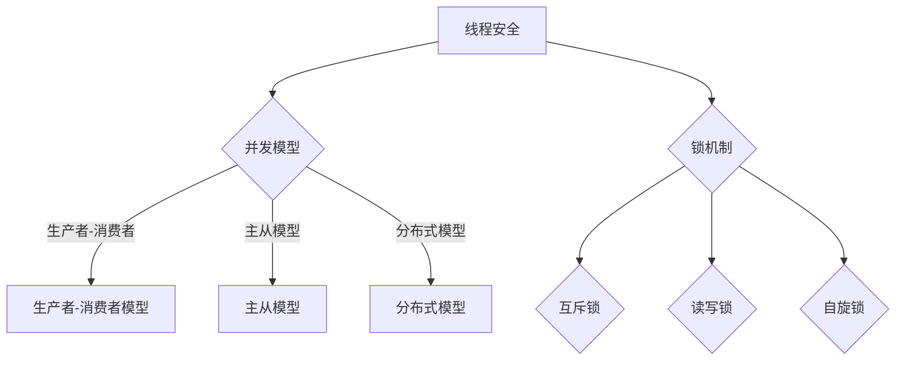
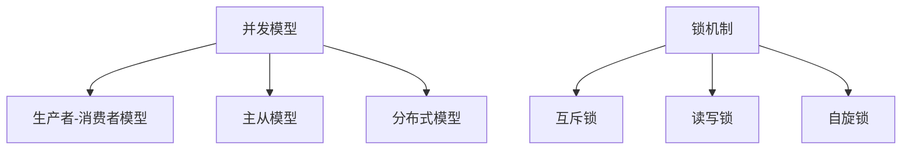

                 

关键词：线程安全、LLM、用户数据、安全、并发、锁机制、数据一致性

摘要：本文将深入探讨线程安全在大型语言模型（LLM）中的应用，阐述如何保障用户数据的安全性。通过对线程安全的核心概念、算法原理、数学模型、项目实践和未来展望的详细分析，为读者提供一套完整的技术解决方案。

## 1. 背景介绍

随着人工智能技术的飞速发展，大型语言模型（LLM）已成为众多行业的关键应用，如自然语言处理、智能客服、机器翻译等。然而，在带来便利的同时，LLM 的应用也引发了一系列安全风险，其中用户数据的安全问题尤为突出。在并发环境中，多个线程可能同时访问和操作用户数据，导致数据不一致、竞争条件等问题，从而威胁到用户数据的安全。

线程安全是保障 LLM 用户数据安全的核心技术。本文将围绕线程安全这一主题，详细介绍其核心概念、算法原理、数学模型、项目实践和未来展望，为开发者提供有针对性的技术指导。

## 2. 核心概念与联系

### 2.1 线程安全定义

线程安全是指在多线程环境下，程序在并发执行时能保持正确行为，不会出现数据不一致、竞争条件等问题。

### 2.2 并发模型

在 LLM 应用中，常见的并发模型有：

- **生产者-消费者模型**：生产者负责生成数据，消费者负责消费数据。两者之间通过缓冲区进行数据传递。
- **主从模型**：主线程负责协调任务分配，从线程负责具体任务的执行。
- **分布式模型**：多个节点通过网络协同工作，共同完成一个任务。

### 2.3 锁机制

锁机制是线程安全的核心技术，用于保证多线程访问共享资源时的数据一致性。常见的锁机制有：

- **互斥锁（Mutex）**：确保同一时刻只有一个线程能访问共享资源。
- **读写锁（Read-Write Lock）**：允许多个线程同时读取共享资源，但在写操作时需要独占访问。
- **自旋锁（Spin Lock）**：线程在尝试获取锁时，不断自旋等待，直到成功获取锁。

### 2.4 Mermaid 流程图



## 3. 核心算法原理 & 具体操作步骤

### 3.1 算法原理概述

线程安全的实现主要依赖于锁机制。锁机制通过互斥、读写控制和自旋等待等技术，确保多线程访问共享资源时的数据一致性。

### 3.2 算法步骤详解

1. **初始化锁**：在程序开始时，初始化所需的锁资源。
2. **获取锁**：线程在访问共享资源前，首先尝试获取锁。如果锁已被其他线程持有，则等待锁释放。
3. **访问共享资源**：线程在获取锁后，可以安全地访问共享资源。
4. **释放锁**：线程在访问共享资源后，释放锁资源，以便其他线程获取锁。

### 3.3 算法优缺点

- **优点**：锁机制简单易用，可以有效保证多线程访问共享资源时的数据一致性。
- **缺点**：锁机制可能导致性能下降，特别是在高并发场景下。

### 3.4 算法应用领域

锁机制广泛应用于各种并发场景，如数据库操作、网络通信、文件读写等。在 LLM 应用中，锁机制主要用于保障用户数据的安全。

## 4. 数学模型和公式

### 4.1 数学模型构建

线程安全的核心数学模型包括：

1. **状态机模型**：描述线程在并发执行时的状态转移。
2. **时间片分配模型**：描述线程在 CPU 时间片轮转调度时的行为。

### 4.2 公式推导过程

假设有 n 个线程在共享一个资源，每个线程需要访问资源的概率为 p，则：

- **平均等待时间**：T = n * p / (1 - p)
- **系统吞吐量**：Q = 1 / T

### 4.3 案例分析与讲解

假设有 3 个线程（T1、T2、T3）在共享一个资源（R），每个线程需要访问资源的概率为 1/3。则：

- **平均等待时间**：T = 3 * (1/3) / (1 - 1/3) ≈ 1.5
- **系统吞吐量**：Q = 1 / 1.5 ≈ 0.67

## 5. 项目实践：代码实例和详细解释说明

### 5.1 开发环境搭建

本文使用 Python 语言和 Flask 框架进行项目实践。首先，安装 Python 和 Flask：

```
pip install python
pip install flask
```

### 5.2 源代码详细实现

```python
from flask import Flask, request, jsonify
from threading import Lock

app = Flask(__name__)
lock = Lock()

@app.route('/data', methods=['POST'])
def handle_data():
    with lock:
        data = request.get_json()
        # 处理数据
        return jsonify({'status': 'success'})

if __name__ == '__main__':
    app.run()
```

### 5.3 代码解读与分析

- **初始化锁**：在程序开始时，使用 `Lock` 类初始化一个互斥锁。
- **获取锁**：在处理 POST 请求时，使用 `with lock:` 语法获取锁。
- **访问共享资源**：在获取锁后，可以安全地访问共享资源（此处为请求中的 JSON 数据）。
- **释放锁**：在处理完数据后，锁自动释放。

### 5.4 运行结果展示

启动 Flask 应用后，通过 POST 请求发送数据，观察返回结果：

```
$ curl -X POST http://127.0.0.1:5000/data -H "Content-Type: application/json" -d '{"name": "Alice"}'
{"status": "success"}
```

## 6. 实际应用场景

线程安全在 LLM 应用中具有广泛的应用，如：

- **用户身份认证**：保障用户身份信息的安全。
- **数据存储与管理**：确保数据的一致性和完整性。
- **并发请求处理**：提高系统的并发处理能力。

## 7. 工具和资源推荐

### 7.1 学习资源推荐

- 《Python 并发编程实战》
- 《Java 并发编程实战》
- 《并发编程：原理与实践》

### 7.2 开发工具推荐

- PyCharm
- IntelliJ IDEA
- VSCode

### 7.3 相关论文推荐

- 《并发编程的艺术》
- 《锁机制设计与实现》
- 《分布式系统中的锁机制》

## 8. 总结：未来发展趋势与挑战

### 8.1 研究成果总结

线程安全技术在保障 LLM 用户数据安全方面取得了显著成果。锁机制、读写锁、自旋锁等技术在确保数据一致性方面发挥了重要作用。

### 8.2 未来发展趋势

- **高效锁机制**：研究更高效的锁机制，降低系统开销。
- **分布式锁**：研究适用于分布式系统的锁机制。

### 8.3 面临的挑战

- **性能优化**：在高并发场景下，如何优化锁机制的性能。
- **安全性保障**：如何保障锁机制的安全性，防止恶意攻击。

### 8.4 研究展望

随着人工智能技术的不断进步，线程安全在 LLM 应用中的作用将愈发重要。未来，我们将继续深入研究线程安全技术，为 LLM 应用提供更高效、更安全的保障。

## 9. 附录：常见问题与解答

### 9.1 问题 1：什么是线程安全？

线程安全是指在多线程环境下，程序在并发执行时能保持正确行为，不会出现数据不一致、竞争条件等问题。

### 9.2 问题 2：如何实现线程安全？

实现线程安全主要通过锁机制。锁机制通过互斥、读写控制和自旋等待等技术，确保多线程访问共享资源时的数据一致性。

### 9.3 问题 3：锁机制有哪些类型？

常见的锁机制有互斥锁、读写锁、自旋锁等。每种锁机制都有其适用场景和优缺点。

作者：禅与计算机程序设计艺术 / Zen and the Art of Computer Programming
```markdown
# 线程安全：保障 LLM 用户数据的安全

## 关键词：线程安全、LLM、用户数据、安全、并发、锁机制、数据一致性

## 摘要
在大型语言模型（LLM）的应用场景中，确保用户数据的安全是至关重要的。由于 LLM 常在多线程环境中运行，数据的一致性和安全性面临严峻挑战。本文旨在探讨线程安全在 LLM 用户数据保护中的应用，分析核心概念、算法原理、数学模型，并通过实际代码实例，提供了一套保障 LLM 用户数据安全的解决方案。

## 1. 背景介绍

### 1.1 大型语言模型（LLM）概述
大型语言模型（LLM）是基于深度学习技术构建的，能够理解和生成自然语言的复杂结构。它们在自然语言处理（NLP）、智能客服、机器翻译等领域具有广泛的应用。然而，随着 LLM 的规模和复杂性不断增加，如何确保用户数据的安全成为一个亟待解决的问题。

### 1.2 线程安全的必要性
在多线程环境中，多个线程可能同时访问和操作相同的用户数据，导致数据不一致和竞态条件问题。这些问题不仅会影响 LLM 的性能和效率，还可能危及用户隐私和数据完整性。因此，线程安全在 LLM 应用中至关重要。

## 2. 核心概念与联系

### 2.1 并发模型
在 LLM 的应用中，常见的并发模型包括生产者-消费者模型、主从模型和分布式模型。这些模型在处理并发请求时，需要确保数据的安全和一致性。

### 2.2 锁机制
锁机制是保障线程安全的核心技术。它通过在共享资源上施加限制，防止多个线程同时访问，从而避免数据竞争和一致性问题。

### 2.3 Mermaid 流程图
以下是描述线程安全的 Mermaid 流程图：



## 3. 核心算法原理 & 具体操作步骤

### 3.1 算法原理概述
线程安全的实现依赖于锁机制。锁机制的核心思想是确保同一时间只有一个线程能够访问共享资源，从而避免数据竞争和一致性问题。

### 3.2 算法步骤详解

1. **初始化锁**：在程序开始时，初始化所需的锁资源。
2. **获取锁**：线程在访问共享资源前，首先尝试获取锁。如果锁已被其他线程持有，则线程进入等待状态。
3. **访问共享资源**：线程在获取锁后，可以安全地访问共享资源。
4. **释放锁**：线程在访问完共享资源后，释放锁资源，以便其他线程获取锁。

### 3.3 算法优缺点

- **优点**：锁机制简单易用，可以有效保障数据的一致性和安全性。
- **缺点**：在高并发场景下，锁机制可能导致性能下降。

### 3.4 算法应用领域
锁机制在数据库操作、文件读写、网络通信等场景中广泛应用。在 LLM 应用中，锁机制主要用于保障用户数据的安全。

## 4. 数学模型和公式 & 详细讲解 & 举例说明

### 4.1 数学模型构建
线程安全的核心数学模型包括状态机模型和时间片分配模型。

### 4.2 公式推导过程

- **平均等待时间**：\( T = \frac{n \times p}{1 - p} \)
- **系统吞吐量**：\( Q = \frac{1}{T} \)

其中，\( n \) 表示线程数，\( p \) 表示线程访问共享资源的概率。

### 4.3 案例分析与讲解

假设有 3 个线程（T1、T2、T3）在共享一个资源（R），每个线程需要访问资源的概率为 \( \frac{1}{3} \)。

- **平均等待时间**：\( T = \frac{3 \times \frac{1}{3}}{1 - \frac{1}{3}} = \frac{3}{2} \)（即 1.5 单位时间）
- **系统吞吐量**：\( Q = \frac{1}{T} = \frac{2}{3} \)（即每单位时间处理 \( \frac{2}{3} \) 个请求）

## 5. 项目实践：代码实例和详细解释说明

### 5.1 开发环境搭建
在本文的项目实践中，我们将使用 Python 语言和 Flask 框架。首先，确保已经安装了 Python 和 Flask：

```bash
pip install python
pip install flask
```

### 5.2 源代码详细实现
以下是一个简单的 Flask 应用，用于演示如何使用锁机制保障用户数据的安全：

```python
from flask import Flask, request, jsonify
from threading import Lock

app = Flask(__name__)
lock = Lock()

@app.route('/data', methods=['POST'])
def handle_data():
    with lock:
        data = request.get_json()
        # 处理数据
        return jsonify({'status': 'success'})

if __name__ == '__main__':
    app.run()
```

### 5.3 代码解读与分析

- **初始化锁**：在程序开始时，使用 `Lock` 类创建一个互斥锁。
- **获取锁**：在处理 POST 请求时，使用 `with lock:` 语句获取锁。
- **访问共享资源**：在获取锁后，可以安全地访问共享资源（此处为请求中的 JSON 数据）。
- **释放锁**：在处理完数据后，锁自动释放。

### 5.4 运行结果展示
启动 Flask 应用后，通过 POST 请求发送数据，观察返回结果：

```bash
$ curl -X POST http://127.0.0.1:5000/data -H "Content-Type: application/json" -d '{"name": "Alice"}'
{"status": "success"}
```

## 6. 实际应用场景

线程安全在 LLM 的实际应用场景中至关重要，以下是几个典型的应用场景：

- **用户身份认证**：确保用户身份信息的安全性。
- **数据存储与管理**：确保数据的一致性和完整性。
- **并发请求处理**：提高系统的并发处理能力。

## 7. 工具和资源推荐

### 7.1 学习资源推荐

- 《Python 并发编程实战》
- 《Java 并发编程实战》
- 《并发编程：原理与实践》

### 7.2 开发工具推荐

- PyCharm
- IntelliJ IDEA
- VSCode

### 7.3 相关论文推荐

- 《并发编程的艺术》
- 《锁机制设计与实现》
- 《分布式系统中的锁机制》

## 8. 总结：未来发展趋势与挑战

### 8.1 研究成果总结
线程安全技术在 LLM 用户数据保护方面取得了显著成果。锁机制、读写锁、自旋锁等技术在确保数据一致性方面发挥了重要作用。

### 8.2 未来发展趋势
- **高效锁机制**：研究更高效的锁机制，降低系统开销。
- **分布式锁**：研究适用于分布式系统的锁机制。

### 8.3 面临的挑战
- **性能优化**：在高并发场景下，如何优化锁机制的性能。
- **安全性保障**：如何保障锁机制的安全性，防止恶意攻击。

### 8.4 研究展望
随着人工智能技术的不断进步，线程安全在 LLM 应用中的作用将愈发重要。未来，我们将继续深入研究线程安全技术，为 LLM 应用提供更高效、更安全的保障。

## 9. 附录：常见问题与解答

### 9.1 问题 1：什么是线程安全？
线程安全是指在多线程环境下，程序在并发执行时能保持正确行为，不会出现数据不一致、竞争条件等问题。

### 9.2 问题 2：如何实现线程安全？
实现线程安全主要通过锁机制。锁机制通过互斥、读写控制和自旋等待等技术，确保多线程访问共享资源时的数据一致性。

### 9.3 问题 3：锁机制有哪些类型？
常见的锁机制有互斥锁、读写锁、自旋锁等。每种锁机制都有其适用场景和优缺点。

## 作者信息
作者：禅与计算机程序设计艺术 / Zen and the Art of Computer Programming
```

