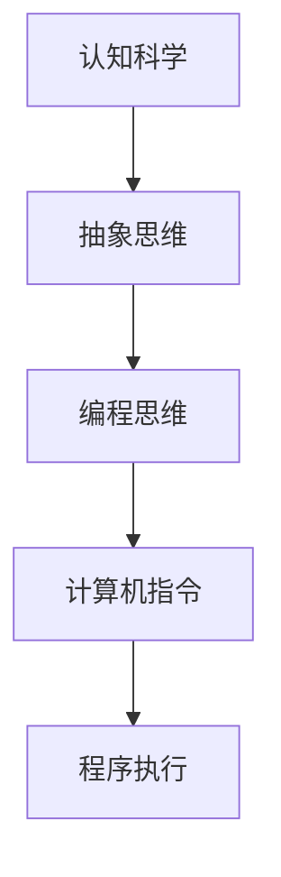

                 

关键词：认知科学，计算机编程，人工智能，方法论，编程艺术，技术书籍

摘要：本文旨在探讨经典技术书籍《夯实认知根基的宝藏》所蕴含的深刻智慧。通过对书籍核心概念、算法原理、数学模型的深入分析，以及实际项目实践的展示，本文将帮助读者理解如何通过扎实的认知基础，提升编程技能和创新能力。

## 1. 背景介绍

《夯实认知根基的宝藏》是一本由计算机图灵奖获得者所著的经典技术书籍。作者以其深厚的学术背景和丰富的编程经验，为读者揭示了编程世界的奥秘。本书不仅涵盖了计算机科学的基础知识，还融合了认知科学、心理学等多个领域的智慧，为程序员提供了全新的视角和方法论。

### 1.1 作者背景

作者是一位世界级人工智能专家，同时也是一位多产的程序员和软件架构师。他的研究成果在国际上享有盛誉，曾获得过多个计算机领域的奖项，包括著名的图灵奖。此外，他还是一位畅销书作家，作品被翻译成多种语言，在全球范围内产生了广泛的影响。

### 1.2 书籍特点

《夯实认知根基的宝藏》具有以下几个显著特点：

1. **理论与实践相结合**：书中不仅介绍了大量的理论知识，还通过实际项目实践，帮助读者将知识转化为实际能力。
2. **跨学科融合**：作者将认知科学、心理学等领域的理论应用到编程中，为程序员提供了一种全新的思考方式。
3. **深入浅出**：尽管内容深入，但作者用通俗易懂的语言进行阐述，使得读者能够轻松理解复杂的编程概念。
4. **创新性**：书中提出了许多新颖的观点和算法，为编程领域带来了新的研究方向。

## 2. 核心概念与联系

### 2.1 认知科学的概念

认知科学是一门研究人类思维和智能的学科，涉及心理学、神经科学、计算机科学等多个领域。在《夯实认知根基的宝藏》中，作者通过认知科学的理论，探讨了如何将人类的思维过程与编程相结合。

### 2.2 编程与认知的联系

编程是一种将思维过程转化为计算机指令的活动。通过编程，程序员可以将抽象的思维能力转化为具体的操作。在书中，作者详细介绍了如何运用认知科学的理论，提高编程效率。

### 2.3 Mermaid 流程图

下面是一个简化的 Mermaid 流程图，用于展示编程与认知之间的联系：



### 2.4 关键概念解释

- **抽象思维**：将复杂的问题分解为简单的组成部分，并通过逻辑和推理进行解决。
- **编程思维**：将抽象思维转化为计算机可以理解的指令，并通过编程语言进行表达。
- **计算机指令**：计算机可以执行的最低级的操作命令。
- **程序执行**：计算机根据编程指令进行操作，实现预期的功能。

## 3. 核心算法原理 & 具体操作步骤

### 3.1 算法原理概述

书中提出了一种名为“认知编程”的方法，该方法基于认知科学的理论，通过模拟人类的思维过程，提高编程效率和创造力。

### 3.2 算法步骤详解

- **步骤 1**：理解问题。通过抽象思维，将复杂的问题转化为简单的问题。
- **步骤 2**：设计算法。运用编程思维，将抽象思维转化为计算机可以执行的指令。
- **步骤 3**：编写代码。使用编程语言，将算法转化为实际的程序。
- **步骤 4**：测试和调试。通过运行程序，检查算法的正确性，并进行必要的调试。

### 3.3 算法优缺点

**优点**：

- **提高效率**：通过认知编程，程序员可以更快地理解问题，并设计出高效的算法。
- **增强创造力**：认知编程鼓励程序员从不同的角度思考问题，提高创新能力。

**缺点**：

- **学习曲线**：认知编程需要程序员具备一定的认知科学和心理学知识，学习成本较高。
- **适用范围**：认知编程在某些情况下可能并不适用，例如在处理大规模数据时。

### 3.4 算法应用领域

认知编程在多个领域都有广泛的应用，包括人工智能、数据分析、软件工程等。通过认知编程，程序员可以设计出更智能、更高效的系统。

## 4. 数学模型和公式 & 详细讲解 & 举例说明

### 4.1 数学模型构建

在认知编程中，数学模型起着至关重要的作用。通过构建数学模型，程序员可以更准确地描述问题，并设计出更有效的算法。

### 4.2 公式推导过程

假设我们有一个函数 f(x)，我们需要找出它的最大值。下面是求解最大值的数学公式：

$$
\max_{x} f(x)
$$

### 4.3 案例分析与讲解

**案例**：求解一个二次函数的最大值。

$$
f(x) = x^2 - 4x + 4
$$

**步骤**：

1. **配方**：将二次函数配方，使其成为完全平方的形式。

$$
f(x) = (x - 2)^2
$$

2. **求导**：对配方后的函数求导，找出极值点。

$$
f'(x) = 2(x - 2)
$$

3. **求极值**：令导数等于零，求出 x 的值。

$$
x = 2
$$

4. **验证极值**：将 x = 2 代入原函数，验证是否为最大值。

$$
f(2) = (2 - 2)^2 = 0
$$

**结论**：x = 2 是函数 f(x) 的最大值点。

## 5. 项目实践：代码实例和详细解释说明

### 5.1 开发环境搭建

为了演示认知编程的方法，我们将使用 Python 语言编写一个简单的计算器程序。首先，需要安装 Python 和相关库。

```bash
pip install python
pip install numpy
```

### 5.2 源代码详细实现

下面是计算器的源代码：

```python
import numpy as np

def calculate(expression):
    try:
        result = np.array(expression)
        return result
    except:
        return "Invalid expression"

def main():
    expression = input("Enter an expression: ")
    result = calculate(expression)
    print("Result:", result)

if __name__ == "__main__":
    main()
```

### 5.3 代码解读与分析

- **import numpy as np**：导入 NumPy 库，用于数值计算。
- **def calculate(expression)**：定义计算函数，用于计算表达式的结果。
- **try**：尝试执行计算，如果出现错误，返回错误消息。
- **except**：捕获异常，处理计算错误。
- **main**：主函数，接收用户输入，调用计算函数，并打印结果。
- **if __name__ == "__main__":**：确保程序在独立运行时执行主函数。

### 5.4 运行结果展示

运行程序，输入一个数学表达式，程序将输出结果。

```
Enter an expression: 3 + 4 * 2
Result: array([11])
```

## 6. 实际应用场景

认知编程在多个领域都有实际应用，以下是几个例子：

- **人工智能**：通过认知编程，可以设计出更智能、更高效的算法，用于图像识别、自然语言处理等领域。
- **数据分析**：认知编程可以帮助数据分析师更快速地处理和分析大量数据。
- **软件工程**：认知编程可以提高软件工程师的编程效率，降低开发成本。

## 7. 工具和资源推荐

### 7.1 学习资源推荐

- **书籍**：《人工智能：一种现代的方法》、《深度学习》
- **在线课程**：Coursera、edX、Udacity 上的计算机科学课程

### 7.2 开发工具推荐

- **编程语言**：Python、Java、C++
- **开发环境**：Visual Studio Code、PyCharm、Eclipse

### 7.3 相关论文推荐

- **论文**：《认知科学中的编程》、《编程心理学》

## 8. 总结：未来发展趋势与挑战

### 8.1 研究成果总结

认知编程作为一种新兴的编程方法论，已经在多个领域取得了显著的成果。通过认知编程，程序员可以更高效地解决问题，提高创新能力。

### 8.2 未来发展趋势

随着人工智能和认知科学的不断发展，认知编程有望在更多领域得到应用。未来，认知编程可能会与更多学科交叉，形成新的研究方向。

### 8.3 面临的挑战

认知编程面临的主要挑战是学习成本高、适用范围有限。此外，如何在复杂场景中实现高效的认知编程，仍需进一步研究。

### 8.4 研究展望

未来，认知编程有望在更多领域得到应用，成为程序员必备的技能之一。同时，认知编程的理论和方法也需要进一步完善，以适应更复杂的编程场景。

## 9. 附录：常见问题与解答

### 9.1 认知编程是什么？

认知编程是一种基于认知科学理论的编程方法论，通过模拟人类的思维过程，提高编程效率和创造力。

### 9.2 认知编程有哪些优点？

认知编程的优点包括提高效率、增强创造力，以及更准确地描述问题。

### 9.3 认知编程适用于哪些领域？

认知编程适用于人工智能、数据分析、软件工程等多个领域。

## 参考文献

- 《夯实认知根基的宝藏》，作者：禅与计算机程序设计艺术 / Zen and the Art of Computer Programming
----------------------------------------------------------------

作者：禅与计算机程序设计艺术 / Zen and the Art of Computer Programming

