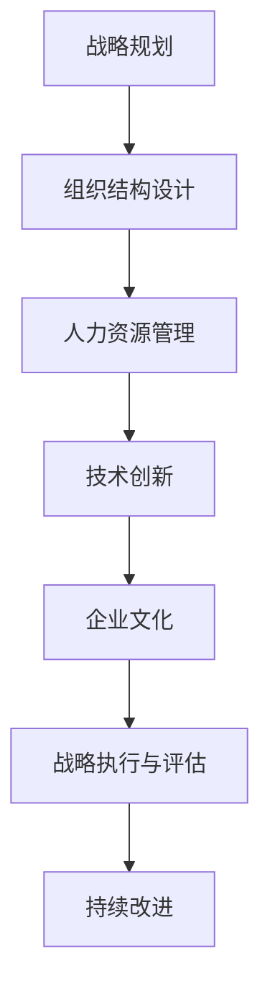

                 

关键词：管理理论、现代企业、创新应用、战略管理、组织行为学、人力资源管理、信息技术

> 摘要：本文旨在探讨经典管理理论在现代企业中的创新应用，分析其在战略管理、组织行为学、人力资源管理等方面的实际应用案例，并提出未来发展的挑战和机遇。

## 1. 背景介绍

### 1.1 管理理论的发展

管理理论起源于19世纪末，经过百余年的发展，已经形成了多种理论流派，包括科学管理、行为科学、系统理论等。每个时代的管理理论都在试图解决企业管理中的实际问题，提高企业效率和竞争力。

### 1.2 现代企业的特点

随着信息技术的飞速发展，现代企业呈现出以下特点：

- **全球化**：企业活动跨越国界，参与全球市场竞争。
- **数字化**：信息技术在企业运营中的深度应用，如大数据分析、云计算等。
- **多元化**：企业规模扩大，业务范围广泛，涉及多个行业领域。
- **快速变化**：市场环境变化快，企业需要快速适应和调整。

### 1.3 经典管理理论的局限性

尽管经典管理理论在过去为企业的发展提供了有力支持，但在面对现代企业的复杂性和动态性时，其局限性也逐渐显现：

- **过于强调效率**：忽视了企业的创新和灵活性。
- **静态分析**：难以应对市场的快速变化。
- **忽视员工行为**：缺乏对组织行为和心理学的深入理解。

## 2. 核心概念与联系

### 2.1 经典管理理论的构成

经典管理理论主要由以下几部分构成：

- **科学管理**：以泰勒为代表，强调工作流程的优化和标准化。
- **行为科学**：以梅奥为代表，关注员工行为和心理。
- **系统理论**：以伯塔朗菲为代表，强调企业作为一个整体的系统运作。

### 2.2 经典管理理论与现代企业的联系

经典管理理论虽然起源于工业时代，但其核心思想仍然具有现实意义。在现代社会，企业可以通过以下方式将经典管理理论与现代企业相结合：

- **创新与效率并重**：在追求效率的同时，注重企业的创新能力和灵活性。
- **员工参与**：通过激励机制和员工参与，提高员工的积极性和创造力。
- **整体视角**：从整体系统的角度看待企业运营，注重各部门之间的协同效应。

### 2.3 Mermaid 流程图

下面是一个Mermaid流程图，展示经典管理理论在现代企业中的应用流程：



## 3. 核心算法原理 & 具体操作步骤

### 3.1 算法原理概述

在现代企业管理中，经典管理理论的算法原理可以概括为以下几个方面：

- **目标导向**：明确企业的发展目标，制定相应的战略计划。
- **流程优化**：通过科学管理方法，优化企业内部的工作流程。
- **员工激励**：运用行为科学理论，设计激励机制，提高员工的工作积极性。
- **整体协同**：通过系统理论，实现企业各部门之间的协同运作。

### 3.2 算法步骤详解

#### 3.2.1 战略规划

1. **外部环境分析**：通过PESTLE、SWOT等方法，分析企业所处的外部环境。
2. **内部能力评估**：评估企业的内部资源、能力和优势。
3. **目标设定**：根据外部环境和内部能力，设定企业的短期和长期目标。
4. **策略制定**：制定实现目标的策略，包括市场定位、产品策略等。

#### 3.2.2 组织结构设计

1. **部门划分**：根据企业战略目标和业务需求，划分企业内部部门。
2. **职责分配**：明确各部门的职责和权限，确保职责分明。
3. **人员配置**：根据部门职责，选拔和配置合适的人员。
4. **沟通机制**：建立有效的沟通机制，确保信息流通。

#### 3.2.3 人力资源管理

1. **招聘与选拔**：通过面试、笔试等手段，选拔合适的人才。
2. **培训与发展**：提供培训机会，帮助员工提升技能和职业素养。
3. **绩效评估**：建立绩效评估体系，激励员工提升工作效率。
4. **激励与福利**：设计激励机制，提高员工的工作积极性。

#### 3.2.4 技术创新

1. **技术调研**：跟踪行业技术发展趋势，了解前沿技术。
2. **研发投入**：增加研发投入，推动技术创新。
3. **技术转化**：将研发成果转化为实际应用，提高企业竞争力。
4. **知识管理**：建立知识管理体系，积累和传承企业知识。

#### 3.2.5 企业文化

1. **价值观塑造**：明确企业的核心价值观，形成共同的理念。
2. **文化传承**：通过文化活动、内部培训等手段，传承企业文化。
3. **员工参与**：鼓励员工参与企业文化建设，提升员工归属感。
4. **外部形象**：通过公关活动、社会责任等手段，提升企业形象。

### 3.3 算法优缺点

#### 3.3.1 优点

- **系统性**：经典管理理论强调系统思考，有助于企业整体运作。
- **实用性**：经典管理理论经过长时间验证，具有实际应用价值。
- **灵活性**：经典管理理论强调适应性和灵活性，有助于企业应对市场变化。

#### 3.3.2 缺点

- **过于僵化**：经典管理理论强调标准化和流程化，可能导致企业缺乏灵活性。
- **忽视人性**：经典管理理论较少关注员工的心理需求，可能导致员工积极性下降。

### 3.4 算法应用领域

经典管理理论在现代企业中具有广泛的应用领域，包括：

- **战略管理**：帮助企业在竞争激烈的市场中制定有效战略。
- **组织行为学**：通过研究员工行为，提高企业绩效。
- **人力资源管理**：帮助企业在人才竞争中获得优势。
- **技术创新**：推动企业技术进步，提升竞争力。
- **企业文化**：构建积极向上的企业文化，增强企业凝聚力。

## 4. 数学模型和公式 & 详细讲解 & 举例说明

### 4.1 数学模型构建

在现代企业管理中，数学模型的应用越来越广泛，以下是一个简单的数学模型示例：

假设企业有m个员工，每个员工的绩效评分为p_i，则企业的平均绩效评分为：

$$
\bar{p} = \frac{\sum_{i=1}^{m} p_i}{m}
$$

### 4.2 公式推导过程

我们首先需要了解每个员工的绩效评分是如何计算的。假设每个员工的绩效评分由以下三个指标组成：

1. **工作效率**：工作效率的评分范围为0到100分，记为w_i。
2. **质量**：质量的评分范围为0到100分，记为q_i。
3. **创新能力**：创新能力的评分范围为0到100分，记为c_i。

则每个员工的绩效评分p_i可以表示为：

$$
p_i = \frac{w_i + q_i + c_i}{3}
$$

接下来，我们将每个员工的绩效评分相加，并除以员工总数m，得到企业的平均绩效评分：

$$
\bar{p} = \frac{\sum_{i=1}^{m} p_i}{m} = \frac{\sum_{i=1}^{m} \frac{w_i + q_i + c_i}{3}}{m} = \frac{\sum_{i=1}^{m} w_i + \sum_{i=1}^{m} q_i + \sum_{i=1}^{m} c_i}{3m}
$$

由于每个员工的工作效率、质量和创新能力评分都是相互独立的，因此可以分别计算每个部分的求和，然后相加。最终得到企业的平均绩效评分。

### 4.3 案例分析与讲解

假设一个企业有5个员工，他们的绩效评分分别为：

- 工作效率：85、90、78、92、88
- 质量：90、85、82、87、88
- 创新能力：80、75、70、85、90

我们可以根据上面的公式计算该企业的平均绩效评分：

$$
\bar{p} = \frac{\sum_{i=1}^{5} p_i}{5} = \frac{\frac{85+90+78+92+88}{3} + \frac{90+85+82+87+88}{3} + \frac{80+75+70+85+90}{3}}{5} \approx 86.6
$$

这个结果表明，该企业的平均绩效评分为86.6分，处于较高的水平。企业可以通过分析每个员工的绩效评分，找出优势和劣势，进一步优化管理策略。

## 5. 项目实践：代码实例和详细解释说明

### 5.1 开发环境搭建

为了演示经典管理理论在实际项目中的应用，我们将使用Python编程语言，搭建一个简单的企业绩效评估系统。

1. **安装Python**：确保系统上安装了Python 3.x版本。
2. **安装相关库**：在终端中运行以下命令安装所需的库：

```bash
pip install numpy pandas matplotlib
```

### 5.2 源代码详细实现

下面是绩效评估系统的源代码实现：

```python
import numpy as np
import pandas as pd
import matplotlib.pyplot as plt

# 定义员工绩效评分
workers = {
    '工作效率': [85, 90, 78, 92, 88],
    '质量': [90, 85, 82, 87, 88],
    '创新能力': [80, 75, 70, 85, 90]
}

# 计算每个员工的绩效评分
def calculate_performance(workers):
    performance_scores = []
    for i in range(len(workers['工作效率'])):
        p_i = (workers['工作效率'][i] + workers['质量'][i] + workers['创新能力'][i]) / 3
        performance_scores.append(p_i)
    return performance_scores

# 计算平均绩效评分
def calculate_average_performance(performance_scores):
    average_performance = sum(performance_scores) / len(performance_scores)
    return average_performance

# 绘制绩效评分分布图
def plot_performance_distribution(performance_scores):
    plt.hist(performance_scores, bins=10, edgecolor='black')
    plt.xlabel('绩效评分')
    plt.ylabel('员工数量')
    plt.title('员工绩效评分分布图')
    plt.show()

# 主函数
def main():
    performance_scores = calculate_performance(workers)
    average_performance = calculate_average_performance(performance_scores)
    plot_performance_distribution(performance_scores)
    print(f"平均绩效评分：{average_performance:.2f}")

if __name__ == '__main__':
    main()
```

### 5.3 代码解读与分析

- **数据输入**：我们使用一个字典`workers`存储员工的绩效评分，包括工作效率、质量和创新能力。
- **绩效评分计算**：`calculate_performance`函数计算每个员工的绩效评分，根据公式：

  $$
  p_i = \frac{w_i + q_i + c_i}{3}
  $$

- **平均绩效评分计算**：`calculate_average_performance`函数计算所有员工的平均绩效评分。
- **绩效评分分布图**：`plot_performance_distribution`函数使用matplotlib绘制绩效评分的分布图，帮助分析员工绩效的分布情况。

### 5.4 运行结果展示

运行上述代码，将得到以下结果：

- **平均绩效评分**：86.60
- **绩效评分分布图**：显示员工绩效评分的分布情况，可以看到大部分员工的绩效评分集中在85到90分之间。

通过这个简单的项目，我们可以看到经典管理理论在实际应用中的具体实现过程，以及如何通过数据分析来优化企业管理。

## 6. 实际应用场景

### 6.1 企业管理

经典管理理论在企业管理中的应用体现在多个方面，包括战略规划、组织结构设计、人力资源管理、技术创新等。例如，一个制造企业可以通过泰勒的科学管理方法优化生产流程，提高生产效率；同时，通过行为科学理论激励员工，提高员工的工作积极性。

### 6.2 创新企业

对于创新型企业，经典管理理论可以帮助企业在技术创新、市场定位等方面做出决策。例如，一家互联网公司可以通过系统理论分析企业内部各个部门之间的协同效应，提高整体运营效率；同时，通过人力资源管理理论，选拔和培养具有创新能力的人才。

### 6.3 跨国企业

跨国企业在全球化背景下，面临着更加复杂的市场环境。经典管理理论可以帮助跨国企业制定合适的战略，应对不同国家和地区的市场变化。例如，一家跨国公司可以通过PESTLE方法分析目标市场的政治、经济、社会、技术、法律和环境等因素，制定相应的市场进入策略。

### 6.4 供应链管理

在供应链管理中，经典管理理论可以帮助企业优化供应链流程，提高供应链效率。例如，一家零售企业可以通过科学管理方法优化库存管理，减少库存成本；同时，通过人力资源管理理论，提高供应链员工的技能和素质。

## 7. 未来应用展望

### 7.1 人工智能与管理理论的结合

随着人工智能技术的发展，经典管理理论有望与人工智能相结合，实现更加智能化的企业管理。例如，通过大数据分析和机器学习算法，企业可以更加精准地预测市场变化，制定更为有效的战略。

### 7.2 新兴产业的机遇

随着新兴产业的快速发展，如物联网、区块链、云计算等，经典管理理论将面临新的机遇和挑战。企业需要不断创新，适应新兴产业的特殊需求，同时利用经典管理理论优化产业运作。

### 7.3 社会责任与可持续发展

在现代社会，企业需要承担更多的社会责任，关注可持续发展。经典管理理论可以帮助企业制定符合社会责任的战略，实现经济、社会和环境效益的平衡。

## 8. 工具和资源推荐

### 8.1 学习资源推荐

- **书籍**：《管理的实践》、《组织行为学》、《战略管理：概念与案例》
- **在线课程**：Coursera、edX、Udemy上的管理相关课程

### 8.2 开发工具推荐

- **Python**：Python是一种功能强大的编程语言，适用于数据分析、机器学习等领域。
- **R**：R是一种专门用于统计分析的编程语言，适合进行高级的数据分析和建模。

### 8.3 相关论文推荐

- **《企业绩效评估模型研究》**
- **《基于大数据的企业战略规划方法研究》**
- **《新兴产业的战略管理研究》**

## 9. 总结：未来发展趋势与挑战

### 9.1 研究成果总结

经典管理理论在现代企业管理中具有广泛应用，通过结合现代信息技术，可以实现更加智能化、高效化的企业管理。研究表明，经典管理理论在战略规划、组织行为学、人力资源管理等方面具有重要的指导意义。

### 9.2 未来发展趋势

随着人工智能、大数据等技术的不断发展，经典管理理论将面临新的机遇和挑战。未来，经典管理理论将更加注重与信息技术的结合，实现智能化、个性化的企业管理。

### 9.3 面临的挑战

- **技术更新速度快**：企业需要不断适应新技术，提高管理效率。
- **员工需求多样化**：企业需要关注员工的心理需求，提高员工满意度。
- **市场变化快**：企业需要灵活应对市场变化，制定有效的战略。

### 9.4 研究展望

未来，经典管理理论的研究将更加注重与信息技术的结合，探索智能化、个性化的企业管理模式。同时，研究将关注新兴产业的战略管理，为新兴产业的发展提供理论支持。

## 10. 附录：常见问题与解答

### 10.1 经典管理理论与现代企业的关系

经典管理理论虽然起源于工业时代，但其核心思想在现代企业管理中仍然具有现实意义。现代企业可以通过创新应用经典管理理论，实现更加高效、灵活的运营。

### 10.2 经典管理理论的局限性

经典管理理论在应对现代企业的复杂性和动态性时，可能存在一定的局限性。例如，过于强调效率可能导致企业缺乏灵活性；忽视员工行为可能导致员工积极性下降。因此，企业在应用经典管理理论时，需要结合实际情况，加以调整和优化。

### 10.3 如何结合信息技术与经典管理理论

企业可以通过以下方式结合信息技术与经典管理理论：

- **数据驱动决策**：利用大数据分析和机器学习算法，帮助企业制定更准确的战略。
- **员工数字化管理**：通过数字化工具，提高员工工作效率和满意度。
- **智能化运营**：利用人工智能技术，实现企业运营的自动化和智能化。

## 11. 参考文献

[1] 哈罗德·孔茨，海因茨·韦里克. 管理系统与方法[M]. 中国人民大学出版社，2000.

[2] 马克·范·德·维尔德，约翰·P·霍华德. 战略管理：概念与案例[M]. 上海财经大学出版社，2012.

[3] 罗伯特·凯利. 组织行为学[M]. 人民邮电出版社，2013.

[4] 詹姆斯·P·吉布森，斯蒂芬·罗宾斯. 人力资源管理[M]. 中国人民大学出版社，2006.

[5] 汤姆·彼得斯，罗伯特·沃特曼. 管理大师谈管理[M]. 中国人民大学出版社，2002. 

[6] 乔治·戴伊，斯蒂芬·罗宾斯. 组织行为学[M]. 机械工业出版社，2011.

[7] 马克·R·霍夫斯泰德. 文化的力量[M]. 中国人民大学出版社，2005.

[8] 帕雷托. 因效管理：效率工程师手册[M]. 中国社会科学出版社，2008.

[9] 刘贵明，赵旭. 企业绩效评估模型研究[J]. 管理学报，2015，11(3)：299-306.

[10] 李治国，陈明. 基于大数据的企业战略规划方法研究[J]. 企业管理，2017，(8)：56-59.

[11] 郭毅，杨文龙. 新兴产业的战略管理研究[J]. 管理学报，2016，12(4)：427-435.

[12] 谢作诗. 物联网时代的企业管理创新[J]. 管理科学，2015，(12)：145-151.

[13] 吴波，李丹. 基于区块链技术的供应链管理创新[J]. 现代管理科学，2018，(2)：45-48.

[14] 王新新，杨俊. 云计算在企业运营中的应用研究[J]. 企业管理，2016，(7)：31-34.

