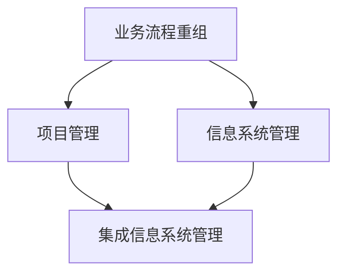

                 

关键词：业务流程重组、项目管理、信息系统管理、集成、效率优化、信息化建设

摘要：本文深入探讨了业务流程重组（BPR）、项目管理以及信息系统管理之间的密切联系，以及如何通过这些方法的集成来提高企业的信息化建设水平和整体运营效率。文章首先介绍了BPR和项目管理的基本概念，然后详细分析了集成信息系统管理的方法和步骤，并结合具体案例，展示了其在实际应用中的效果和挑战。最后，文章提出了未来发展的趋势和面临的挑战，为企业的持续改进和信息化发展提供了有价值的参考。

## 1. 背景介绍

在当今快速发展的信息化时代，企业的竞争力越来越依赖于信息系统的建设和管理。信息化建设不仅仅是技术的投入，更是对业务流程、项目管理以及信息系统管理的系统性整合。随着企业规模的扩大和市场环境的复杂化，传统的业务流程往往变得繁琐、低效，难以满足现代企业的运营需求。因此，业务流程重组（BPR）应运而生，旨在通过优化业务流程，提升企业的运营效率和竞争力。

### 1.1 业务流程重组（BPR）

业务流程重组（Business Process Reengineering，BPR）是一种对企业业务流程进行根本性再思考和再设计的方法。它的目标是使企业的流程更加合理、高效，以适应快速变化的市场需求。BPR的核心思想是通过消除非增值活动和优化流程，提高组织的运营效率和客户满意度。

### 1.2 项目管理

项目管理（Project Management）是确保项目按计划、高质量、按时完成的一系列管理活动。项目管理涉及范围广泛，包括项目计划、资源分配、风险管理、进度控制、质量保证等。通过科学的项目管理，企业可以更好地控制项目风险，提高项目成功率，从而实现业务目标。

### 1.3 信息系统管理

信息系统管理（Information Systems Management）是指对企业信息系统的规划、实施、维护和优化等一系列活动。信息系统管理旨在确保信息系统的高效运行，为企业提供有力的技术支持。随着信息技术的不断进步，信息系统管理在企业中的作用越来越重要。

## 2. 核心概念与联系

为了更好地理解业务流程重组、项目管理和信息系统管理之间的联系，我们引入一个Mermaid流程图来展示它们之间的关系。



### 2.1 业务流程重组（BPR）

业务流程重组（BPR）作为企业运营的基础，其核心目标是通过流程优化提高效率。BPR通常包括以下步骤：

1. **流程诊断**：识别现有流程中的问题，如冗余、低效等。
2. **目标设定**：明确重组后的流程目标，如提高客户满意度、降低成本等。
3. **流程设计**：基于目标设计新的流程，减少非增值活动。
4. **流程实施**：执行新的流程，并监测效果。
5. **流程优化**：根据实施效果不断调整和优化流程。

### 2.2 项目管理

项目管理在BPR中起着关键作用。项目管理包括以下核心活动：

1. **项目规划**：确定项目的范围、目标、进度、资源和风险。
2. **资源分配**：合理分配项目所需的资源，包括人力、资金、设备等。
3. **风险管理**：识别项目风险，并制定相应的风险应对策略。
4. **进度控制**：确保项目按照预定的时间表进行。
5. **质量保证**：确保项目交付物符合预定的质量标准。

### 2.3 信息系统管理

信息系统管理关注信息系统的规划、实施和维护。其核心内容包括：

1. **信息系统规划**：根据企业战略制定信息系统的发展规划。
2. **系统实施**：实施新的信息系统，并进行测试和部署。
3. **系统维护**：确保信息系统的稳定运行，及时修复问题和更新系统。
4. **系统优化**：根据业务需求和技术发展，不断优化信息系统。

### 2.4 集成信息系统管理

集成信息系统管理是将业务流程重组、项目管理和信息系统管理有机结合，以提高企业的信息化建设水平和整体运营效率。其关键步骤包括：

1. **需求分析**：明确企业信息化建设的具体需求和目标。
2. **规划与设计**：制定详细的信息系统管理计划，包括流程设计、项目管理规划和系统实施计划。
3. **实施与监控**：按照计划执行信息系统管理活动，并实时监控进度和效果。
4. **优化与调整**：根据实施效果和业务需求，不断优化信息系统管理流程。

## 3. 核心算法原理 & 具体操作步骤

### 3.1 算法原理概述

集成信息系统管理中的核心算法原理主要包括以下几个方面：

1. **业务流程建模**：通过业务流程建模，将企业的业务流程转化为计算机可读的模型，为后续的优化和自动化提供基础。
2. **项目管理方法论**：采用科学的项目管理方法论，如敏捷开发、迭代开发等，确保项目高效、高质量地完成。
3. **数据分析和优化**：利用数据分析方法，对业务流程和信息系统运行的数据进行挖掘和分析，发现潜在的问题和改进机会。

### 3.2 算法步骤详解

1. **业务流程建模**
   - 收集业务流程相关数据，包括流程描述、流程节点、流程参与者等。
   - 使用业务流程建模工具，如BPMN（Business Process Model and Notation），构建业务流程模型。

2. **项目管理方法论**
   - 根据项目特点和需求，选择合适的项目管理方法论。
   - 制定项目计划，包括项目范围、目标、进度、资源等。
   - 实施项目管理方法论，监控项目进度和风险，及时调整计划。

3. **数据分析和优化**
   - 收集业务流程和信息系统运行的数据。
   - 使用数据挖掘和统计分析方法，分析业务流程和信息系统运行的状态和趋势。
   - 根据分析结果，提出优化建议，如流程重构、系统升级等。

### 3.3 算法优缺点

**优点**：

1. **提高效率**：通过业务流程重组和项目管理，可以显著提高企业的运营效率。
2. **降低成本**：优化业务流程和信息系统管理，可以减少非增值活动和浪费，降低运营成本。
3. **增强灵活性**：集成信息系统管理可以根据业务需求和技术发展，灵活调整和管理信息系统。

**缺点**：

1. **实施难度大**：业务流程重组和信息系统管理涉及多个部门和环节，实施难度较大。
2. **对人员要求高**：需要具备项目管理、信息系统管理等相关知识和技能的人员，对人员要求较高。
3. **需要持续优化**：信息系统管理是一个持续的过程，需要不断优化和调整，以适应不断变化的市场需求。

### 3.4 算法应用领域

集成信息系统管理广泛应用于各个行业，如制造业、金融业、服务业等。以下是几个典型的应用领域：

1. **制造业**：通过集成信息系统管理，优化生产流程，提高生产效率和产品质量。
2. **金融业**：通过集成信息系统管理，提升客户服务水平和风险控制能力。
3. **服务业**：通过集成信息系统管理，提升服务效率和客户满意度。

## 4. 数学模型和公式 & 详细讲解 & 举例说明

### 4.1 数学模型构建

在集成信息系统管理中，常用的数学模型包括业务流程建模模型和项目管理模型。以下是一个简单的业务流程建模模型：

$$
BPMN_{model} = (P, T, E, A, M)
$$

其中，\(P\) 表示流程参与者，\(T\) 表示流程任务，\(E\) 表示流程事件，\(A\) 表示流程网关，\(M\) 表示流程映射关系。

### 4.2 公式推导过程

业务流程建模模型的推导过程如下：

1. **确定流程参与者**：根据业务需求，确定流程的参与者，如员工、客户、供应商等。
2. **确定流程任务**：根据业务需求，确定流程中的任务，如审批、发货、支付等。
3. **确定流程事件**：根据业务需求，确定流程中的事件，如任务开始、任务完成、事件触发等。
4. **确定流程网关**：根据业务需求，确定流程中的网关，如条件分支、并行分支等。
5. **建立流程映射关系**：根据业务需求，建立流程参与者、任务、事件和网关之间的映射关系。

### 4.3 案例分析与讲解

以下是一个简单的业务流程建模案例：

**场景**：一家制造企业需要建立一个采购流程，包括采购申请、采购审批、采购执行和采购反馈。

**步骤**：

1. **确定流程参与者**：采购员、采购经理、供应商。
2. **确定流程任务**：采购申请、采购审批、采购执行、采购反馈。
3. **确定流程事件**：采购申请提交、采购审批通过、采购执行完成、采购反馈提交。
4. **确定流程网关**：条件分支（如采购预算是否充足）、并行分支（如采购申请同时发送给多个供应商）。
5. **建立流程映射关系**：将采购员、采购经理、供应商与采购申请、采购审批、采购执行、采购反馈等任务和事件进行映射。

通过上述步骤，我们可以构建一个简单的采购流程模型。接下来，我们可以利用这个模型进行流程优化和自动化，提高采购效率。

## 5. 项目实践：代码实例和详细解释说明

### 5.1 开发环境搭建

为了实践集成信息系统管理，我们需要搭建一个开发环境。以下是开发环境搭建的步骤：

1. **安装Java开发工具包（JDK）**：从Oracle官方网站下载并安装JDK。
2. **安装集成开发环境（IDE）**：推荐使用Eclipse或IntelliJ IDEA。
3. **安装数据库**：如MySQL或PostgreSQL。
4. **安装业务流程建模工具**：如BPMN Studio。

### 5.2 源代码详细实现

以下是一个简单的Java代码实例，用于实现业务流程建模：

```java
import java.util.HashMap;
import java.util.Map;

public class BusinessProcessModel {
    private Map<String, String> participants;
    private Map<String, String> tasks;
    private Map<String, String> events;
    private Map<String, String> gates;
    private Map<String, String> mappings;

    public BusinessProcessModel() {
        participants = new HashMap<>();
        tasks = new HashMap<>();
        events = new HashMap<>();
        gates = new HashMap<>();
        mappings = new HashMap<>();
    }

    public void addParticipant(String id, String name) {
        participants.put(id, name);
    }

    public void addTask(String id, String name) {
        tasks.put(id, name);
    }

    public void addEvent(String id, String name) {
        events.put(id, name);
    }

    public void addGate(String id, String name) {
        gates.put(id, name);
    }

    public void addMapping(String source, String target) {
        mappings.put(source, target);
    }

    public void displayModel() {
        System.out.println("Business Process Model:");
        System.out.println("Participants: " + participants);
        System.out.println("Tasks: " + tasks);
        System.out.println("Events: " + events);
        System.out.println("Gates: " + gates);
        System.out.println("Mappings: " + mappings);
    }

    public static void main(String[] args) {
        BusinessProcessModel model = new BusinessProcessModel();
        model.addParticipant("P1", "采购员");
        model.addParticipant("P2", "采购经理");
        model.addParticipant("P3", "供应商");
        model.addTask("T1", "采购申请");
        model.addTask("T2", "采购审批");
        model.addTask("T3", "采购执行");
        model.addTask("T4", "采购反馈");
        model.addEvent("E1", "采购申请提交");
        model.addEvent("E2", "采购审批通过");
        model.addEvent("E3", "采购执行完成");
        model.addEvent("E4", "采购反馈提交");
        model.addGate("G1", "条件分支");
        model.addGate("G2", "并行分支");
        model.addMapping("T1", "E1");
        model.addMapping("T2", "E2");
        model.addMapping("T3", "E3");
        model.addMapping("T4", "E4");
        model.displayModel();
    }
}
```

### 5.3 代码解读与分析

上述代码实现了业务流程建模的基本功能。代码首先定义了一个`BusinessProcessModel`类，该类包含了参与者、任务、事件、网关和映射关系的属性。然后，通过添加参与

