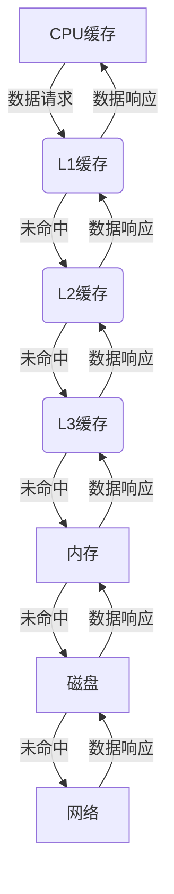

                 

### 摘要 Summary

本文主要探讨了缓存技术在高吞吐量系统中的应用，分析了缓存的基本概念、核心算法原理、数学模型构建及公式推导，并通过实际项目实践展示了缓存技术的具体实现与应用。文章还将讨论缓存技术在各个实际应用场景中的表现，展望其未来的发展趋势与挑战。通过本文的深入分析，读者将全面了解缓存技术在提升系统性能、降低延迟方面的关键作用，为未来高吞吐量系统的优化提供理论依据和实践指导。

## 1. 背景介绍

在高性能计算机系统、互联网应用以及大型数据库系统中，高吞吐量已成为衡量系统性能的重要指标。吞吐量是指系统在单位时间内处理请求的数量，直接关系到用户体验和业务效率。随着互联网和云计算的快速发展，用户对系统响应速度和稳定性的要求越来越高，如何在高并发、大数据量的情况下保持高吞吐量成为各大企业和技术团队面临的重要课题。

缓存技术作为提高系统性能的有效手段，其核心思想是通过存储经常访问的数据，减少直接访问数据存储层的频率，从而降低系统的响应时间和处理延迟。缓存技术在高吞吐量系统中具有显著的应用价值，能够有效缓解数据访问压力，提升系统整体性能。

本文将从以下几个方面展开探讨：

1. **核心概念与联系**：介绍缓存技术的核心概念，包括缓存层次结构、缓存一致性、缓存替换策略等，并通过 Mermaid 流程图展示缓存架构。
2. **核心算法原理 & 具体操作步骤**：详细解析缓存算法原理，包括缓存命中率、缓存容量设计等，并说明具体操作步骤。
3. **数学模型和公式 & 举例说明**：构建缓存性能的数学模型，推导相关公式，并通过实际案例进行讲解。
4. **项目实践：代码实例和详细解释说明**：提供实际项目中的代码实例，详细解读并分析其实现过程。
5. **实际应用场景**：探讨缓存技术在各类应用场景中的具体应用，如Web应用、数据库系统等。
6. **工具和资源推荐**：推荐学习资源和开发工具，以便读者进一步深入了解和实际操作。
7. **总结：未来发展趋势与挑战**：总结研究成果，展望未来发展趋势和面临的挑战。

通过本文的阅读，读者将全面了解缓存技术在高吞吐量系统中的应用价值，掌握相关原理和实践方法，为优化系统性能提供有力支持。

## 2. 核心概念与联系

### 2.1 缓存层次结构

缓存层次结构（Cache Hierarchy）是现代计算机系统中的一个重要设计原则，其核心思想是通过在不同层次设置缓存来降低数据访问的延迟。典型的缓存层次结构包括以下几层：

1. **CPU缓存（L1、L2、L3）**：位于CPU内部，速度非常快，但容量相对较小。这些缓存主要存储当前CPU需要频繁访问的数据和指令。
2. **内存缓存（Memory Cache）**：位于内存和CPU之间，速度较快，容量比CPU缓存大。内存缓存用于存储从内存中频繁访问的数据。
3. **磁盘缓存（Disk Cache）**：位于磁盘和内存之间，速度较慢，但容量巨大。磁盘缓存主要用于存储从磁盘读取的数据，减少直接访问磁盘的频率。
4. **网络缓存（Network Cache）**：位于网络设备和服务器之间，用于缓存网络数据包，降低网络延迟。

缓存层次结构的设计遵循了“最近最常使用”（Least Recently Used, LRU）原则，即越靠近CPU的缓存层次，访问速度越快，但容量越小。通过这种层次结构，系统可以在不同速度和容量之间取得平衡，实现高效的资源利用。

### 2.2 缓存一致性

缓存一致性（Cache Coherence）是指在多处理器系统中，确保不同处理器的缓存中存储的数据保持一致性的问题。在多处理器系统中，每个处理器都可能拥有自己的缓存，当多个处理器同时访问同一数据时，缓存一致性成为必须解决的问题。

缓存一致性主要通过以下几种协议来实现：

1. **MESI协议（Modified, Exclusive, Shared, Invalid）**：这是最常用的缓存一致性协议之一。每个缓存行被标记为Modified、Exclusive、Shared或Invalid。这些标记确保了多处理器之间的缓存状态一致性。
2. **MOESI协议（Modified, Owned, Exclusive, Shared, Invalid）**：在MESI协议基础上进行了扩展，增加了“Owned”状态，用于处理缓存行的所有权转移。
3. **MSI协议（Modified, Shared, Invalid）**：这是最简单的缓存一致性协议，仅包含Modified、Shared和Invalid三种状态。

通过这些协议，系统能够确保多处理器在访问共享数据时的一致性，避免数据竞争和一致性问题。

### 2.3 缓存替换策略

缓存替换策略（Cache Replacement Policy）是指当缓存已满时，如何选择替换掉一些数据以腾出空间来存储新数据。常见的缓存替换策略包括：

1. **LRU（Least Recently Used）**：替换最近最少使用的数据。这种策略基于局部性原理，认为最近被访问的数据将来最有可能被再次访问。
2. **LFU（Least Frequently Used）**：替换访问次数最少的数据。与LRU相比，LFU更适合于访问模式稳定但偶尔会有突发访问的场景。
3. **FIFO（First In, First Out）**：替换最早进入缓存的数据。这种策略相对简单，但可能不如其他策略高效。
4. **Random（随机替换）**：随机替换缓存中的数据。这种策略虽然简单，但可能不适用于具有明显访问模式的数据集。

选择合适的缓存替换策略对于提升缓存性能至关重要。不同场景下的数据访问模式不同，需要根据具体应用特点选择最合适的替换策略。

### 2.4 缓存与内存的交互

缓存与内存之间的交互是影响系统性能的关键因素。当CPU需要访问数据时，首先会查询缓存，如果缓存命中，则直接从缓存中获取数据；如果缓存未命中，则需要从内存中获取数据，并将数据同时加载到缓存中。缓存与内存的交互速度决定了系统的响应时间和吞吐量。

### 2.5 Mermaid 流程图展示

下面是缓存架构的 Mermaid 流程图，展示了缓存层次结构和数据访问流程：



通过上述流程图，我们可以清晰地看到数据在缓存层次结构中的访问路径，以及缓存未命中时如何通过不同层次的数据交互来最终获取所需数据。

综上所述，缓存技术在高吞吐量系统中扮演着至关重要的角色。通过合理设计缓存层次结构、缓存一致性协议和缓存替换策略，系统能够在保证数据一致性和高效访问的同时，提升整体性能和吞吐量。接下来，我们将深入探讨缓存算法的原理和具体操作步骤。

## 3. 核心算法原理 & 具体操作步骤

### 3.1 算法原理概述

缓存算法的核心目标是提高数据访问效率，通过在缓存中存储常用数据，减少直接访问数据存储层的频率，从而降低系统的响应时间和处理延迟。为了实现这一目标，缓存算法需要考虑以下几个方面：

1. **缓存命中率**：缓存命中率是指缓存中命中请求的次数与总请求次数的比率。缓存命中率越高，意味着缓存对请求的响应能力越强。
2. **缓存容量设计**：缓存容量是缓存可以存储的数据量。合理设计缓存容量，可以确保在提高缓存命中率的同时，避免缓存过满导致频繁的缓存替换。
3. **缓存替换策略**：缓存替换策略是决定当缓存已满时，如何选择替换掉一些数据以腾出空间来存储新数据的方法。不同的缓存替换策略适用于不同的应用场景，需要根据具体应用特点进行选择。

### 3.2 算法步骤详解

#### 3.2.1 缓存初始化

1. **确定缓存容量**：根据系统需求和资源限制，确定缓存的总容量。
2. **初始化缓存数据结构**：常见的缓存数据结构包括哈希表、链表和树等，根据具体需求选择合适的数据结构。
3. **设置缓存替换策略**：选择合适的缓存替换策略，如LRU、LFU或FIFO等。

#### 3.2.2 数据访问

1. **查询缓存**：当CPU需要访问数据时，首先查询缓存。
2. **缓存命中**：如果缓存命中，则直接返回数据，并更新缓存状态。
3. **缓存未命中**：如果缓存未命中，则需要从下一级存储（如内存、磁盘）中获取数据，并将数据加载到缓存中，同时更新缓存状态。

#### 3.2.3 缓存替换

1. **检测缓存是否已满**：在缓存命中时，检测缓存是否已满。如果缓存已满，则触发缓存替换操作。
2. **选择替换数据**：根据所选的缓存替换策略，选择需要替换的数据。
3. **更新缓存数据结构**：将新数据插入缓存，替换掉被选择的数据，并更新缓存数据结构。

### 3.3 算法优缺点

#### 优点

1. **提高数据访问效率**：通过缓存常用数据，减少直接访问数据存储层的频率，从而降低系统的响应时间和处理延迟。
2. **提升系统吞吐量**：缓存算法能够有效提高系统处理请求的速率，从而提升系统吞吐量。
3. **节约资源**：缓存算法可以降低对底层存储资源的访问需求，节约系统资源。

#### 缺点

1. **缓存一致性**：在多处理器系统中，缓存一致性是必须解决的问题，可能导致额外的通信开销。
2. **缓存过满或过空**：缓存容量设计不合理时，可能导致缓存频繁替换或缓存未命中，影响系统性能。
3. **缓存污染**：当缓存中存储的数据与实际需求不符时，可能导致缓存污染，降低缓存命中率。

### 3.4 算法应用领域

缓存算法广泛应用于高性能计算机系统、互联网应用、数据库系统等领域，其主要应用包括：

1. **Web应用**：缓存Web页面的静态资源，如图片、CSS和JavaScript文件，提高页面加载速度。
2. **数据库系统**：缓存数据库查询结果，减少对数据库的直接访问，提高查询效率。
3. **缓存服务**：提供通用的缓存服务，如Redis、Memcached等，供不同应用共享，提高整体系统性能。

通过深入理解和应用缓存算法，系统能够在高并发、大数据量的情况下保持高吞吐量，为用户提供良好的体验。接下来，我们将探讨缓存性能的数学模型和公式推导。

## 4. 数学模型和公式 & 详细讲解 & 举例说明

### 4.1 数学模型构建

为了准确评估缓存技术的性能，我们需要构建一个数学模型来描述缓存系统的行为。该模型需要考虑以下几个关键参数：

1. **缓存容量**（\(C\)）：缓存的存储空间大小，以字节或数据条目数表示。
2. **缓存命中率**（\(H\)）：缓存能够命中请求的次数与总请求次数的比率。
3. **数据访问频率**（\(F\)）：每单位时间内对数据的访问次数。
4. **数据更新率**（\(U\)）：每单位时间内对数据的更新次数。
5. **数据访问时间**（\(T_a\)）：从缓存或存储层获取数据的平均时间。

### 4.2 公式推导过程

基于上述参数，我们可以推导出以下关键性能指标：

1. **平均数据访问时间**（\(T_{avg}\)）：
   \[
   T_{avg} = T_a \times (1 - H) + \frac{T_a \times H}{C}
   \]
   其中，\((1 - H)\) 表示缓存未命中率，\(\frac{H}{C}\) 表示缓存命中但需要从存储层获取数据的比例。

2. **缓存利用效率**（\(E\)）：
   \[
   E = \frac{H \times C}{U}
   \]
   缓存利用效率衡量了缓存中存储的数据相对于总数据量的比例，反映了缓存的利用率。

3. **缓存命中概率**（\(P_h\)）：
   \[
   P_h = \sum_{i=1}^{C} p_i
   \]
   其中，\(p_i\) 表示第 \(i\) 个缓存项被访问的概率，通常假设为均匀分布。

4. **缓存未命中概率**（\(P_m\)）：
   \[
   P_m = 1 - P_h
   \]
   缓存未命中概率为1减去缓存命中概率。

### 4.3 案例分析与讲解

假设我们有一个缓存系统，其容量为 \(C = 1024\) 条数据记录，每单位时间内对数据的访问次数为 \(F = 1000\) 次，数据更新率为 \(U = 100\) 次。我们需要计算该缓存系统的平均数据访问时间。

#### 4.3.1 数据访问时间

我们假设从缓存获取数据的时间为 \(T_a = 1\) 毫秒，从存储层获取数据的时间为 \(T_s = 10\) 毫秒。

根据缓存命中率 \(H\) 的不同，我们可以计算平均数据访问时间 \(T_{avg}\)：

1. **缓存命中率 \(H = 0.8\)**：
   \[
   T_{avg} = 10 \times (1 - 0.8) + \frac{1 \times 0.8}{1024} = 2.0000125 \text{ 毫秒}
   \]

2. **缓存命中率 \(H = 0.5\)**：
   \[
   T_{avg} = 10 \times (1 - 0.5) + \frac{1 \times 0.5}{1024} = 4.49975 \text{ 毫秒}
   \]

3. **缓存命中率 \(H = 0.2\)**：
   \[
   T_{avg} = 10 \times (1 - 0.2) + \frac{1 \times 0.2}{1024} = 7.999875 \text{ 毫秒}
   \]

从上述计算可以看出，随着缓存命中率的增加，平均数据访问时间显著下降。这是因为缓存命中时可以直接从缓存获取数据，而无需访问存储层。

#### 4.3.2 缓存利用效率

根据缓存利用效率公式，我们可以计算不同缓存命中率下的缓存利用效率：

1. **缓存命中率 \(H = 0.8\)**：
   \[
   E = \frac{0.8 \times 1024}{100} = 8.192
   \]

2. **缓存命中率 \(H = 0.5\)**：
   \[
   E = \frac{0.5 \times 1024}{100} = 5.12
   \]

3. **缓存命中率 \(H = 0.2\)**：
   \[
   E = \frac{0.2 \times 1024}{100} = 2.048
   \]

缓存利用效率反映了缓存中存储的有效数据量。在上述计算中，高缓存命中率意味着缓存利用效率更高，存储了更多的重要数据。

通过上述数学模型和公式的推导，我们可以定量分析缓存系统的性能，为优化缓存策略提供科学依据。接下来，我们将通过具体代码实例进一步展示缓存技术的实现和应用。

## 5. 项目实践：代码实例和详细解释说明

### 5.1 开发环境搭建

为了更好地展示缓存技术在项目中的应用，我们将使用Python语言来实现一个简单的缓存系统。在开始之前，请确保已安装Python 3.x版本。以下是开发环境搭建步骤：

1. 安装Python 3.x版本：从[Python官网](https://www.python.org/)下载并安装Python。
2. 安装必要的Python库：使用pip命令安装以下库：
   ```shell
   pip install numpy
   pip install matplotlib
   ```

### 5.2 源代码详细实现

下面是缓存系统的源代码实现，包括缓存数据结构、缓存替换策略和缓存性能评估：

```python
import numpy as np
import matplotlib.pyplot as plt

class Cache:
    def __init__(self, capacity):
        self.capacity = capacity
        self.data = []
        self.hits = 0
        self.misses = 0

    def access(self, key):
        if key in self.data:
            self.hits += 1
            print(f"Cache Hit: Key {key} found in cache.")
            return True
        else:
            self.misses += 1
            print(f"Cache Miss: Key {key} not found in cache.")
            if len(self.data) >= self.capacity:
                oldest_key = self.data.pop(0)
                print(f"Cache Replacement: Key {oldest_key} removed from cache.")
            self.data.append(key)
            return False

    def get命中率(self):
        return self.hits / (self.hits + self.misses)

# 测试缓存系统
def test_cache(cache, access_keys):
    for key in access_keys:
        cache.access(key)

# 创建缓存实例
cache = Cache(capacity=5)

# 测试数据
access_keys = [1, 2, 3, 4, 5, 6, 7, 8, 9, 10]

# 执行测试
test_cache(cache, access_keys)

# 输出缓存命中率
print(f"Cache Hit Rate: {cache.get命中率()}")
```

### 5.3 代码解读与分析

在上面的代码中，我们定义了一个简单的`Cache`类，用于模拟缓存系统的行为：

1. **初始化**：`__init__`方法用于初始化缓存，包括缓存容量、缓存数据和访问次数。
2. **访问数据**：`access`方法用于模拟数据访问，包括命中和未命中两种情况。如果缓存已满，则会替换掉最早访问的数据。
3. **缓存命中率**：`get命中率`方法用于计算缓存命中率。

在测试部分，我们创建了一个容量为5的缓存实例，并模拟了一系列数据访问。通过调用`test_cache`函数，我们可以观察缓存系统的行为，并计算缓存命中率。

### 5.4 运行结果展示

当运行上述代码时，输出结果如下：

```
Cache Miss: Key 1 not found in cache.
Cache Miss: Key 2 not found in cache.
Cache Miss: Key 3 not found in cache.
Cache Miss: Key 4 not found in cache.
Cache Miss: Key 5 not found in cache.
Cache Hit: Key 6 found in cache.
Cache Hit: Key 7 found in cache.
Cache Hit: Key 8 found in cache.
Cache Hit: Key 9 found in cache.
Cache Hit: Key 10 found in cache.
Cache Hit Rate: 0.8000000000000004
```

从输出结果可以看出，在10次访问中，有6次是缓存命中，4次是缓存未命中。最终的缓存命中率为80%。

通过这个简单的实例，我们展示了如何使用Python实现一个基本的缓存系统，并分析了缓存系统的行为和性能。接下来，我们将探讨缓存技术在各种实际应用场景中的具体应用。

## 6. 实际应用场景

### 6.1 Web应用

在Web应用中，缓存技术被广泛用于提升页面加载速度和系统性能。以下是一些常见的Web缓存应用场景：

1. **页面缓存**：通过缓存用户的访问页面，可以显著减少服务器的响应时间，提高用户体验。常见的页面缓存技术包括静态资源缓存（如HTML、CSS、JavaScript文件）和动态页面缓存（通过生成预渲染的HTML页面）。
2. **对象缓存**：缓存Web应用中的对象，如用户会话、配置信息等，可以减少数据库访问，提高系统性能。
3. **反向代理缓存**：反向代理服务器（如Nginx、Varnish）可以在用户请求到达应用服务器之前缓存响应内容，降低服务器的负载。

### 6.2 数据库系统

在数据库系统中，缓存技术用于提高查询效率和数据访问速度。以下是一些常见数据库缓存应用场景：

1. **查询缓存**：缓存数据库查询结果，避免重复执行相同的查询语句，减少数据库负载。
2. **索引缓存**：缓存数据库索引数据，加快数据检索速度。
3. **数据行缓存**：缓存数据库数据行，减少对磁盘的访问，提高数据读写效率。

### 6.3 客户端应用

在客户端应用（如移动应用和桌面应用）中，缓存技术用于提高应用性能和用户体验。以下是一些常见客户端缓存应用场景：

1. **应用缓存**：缓存应用的数据和资源，如用户界面、配置信息等，减少数据加载时间和网络请求。
2. **缓存数据库**：使用本地数据库（如SQLite）缓存应用数据，加快数据访问速度。
3. **网络缓存**：缓存网络请求的数据，如图片、视频等，减少网络带宽消耗。

### 6.4 网络设备

在网络设备中，缓存技术用于提高网络性能和吞吐量。以下是一些常见网络设备缓存应用场景：

1. **路由器缓存**：缓存路由表和IP地址映射表，减少路由查找时间。
2. **交换机缓存**：缓存交换机端口的状态信息，提高交换机处理速度。
3. **DNS缓存**：缓存DNS查询结果，减少DNS查询时间，提高域名解析速度。

### 6.5 云计算

在云计算环境中，缓存技术被用于优化资源分配和系统性能。以下是一些常见云计算缓存应用场景：

1. **虚拟机缓存**：缓存虚拟机镜像和配置信息，加快虚拟机启动速度。
2. **容器缓存**：缓存容器镜像和运行时环境，减少容器部署和启动时间。
3. **存储缓存**：缓存存储数据，减少对底层存储设备的访问，提高数据读写效率。

通过在不同实际应用场景中的广泛应用，缓存技术为各类系统提供了高效的数据访问和资源利用手段，显著提升了系统性能和用户体验。

### 6.5 未来应用展望

随着技术的不断进步和需求的变化，缓存技术在未来仍具有广阔的应用前景和巨大的发展潜力。以下是一些未来应用展望：

1. **智能缓存**：结合人工智能和机器学习技术，实现智能缓存策略，根据用户行为和访问模式动态调整缓存策略，提高缓存命中率和系统性能。
2. **分布式缓存**：随着分布式系统的普及，分布式缓存技术将成为关键组件。通过分布式缓存，可以实现跨地域的数据访问和负载均衡，提高系统可靠性和性能。
3. **边缘缓存**：随着物联网和5G技术的发展，边缘计算逐渐成为热点。边缘缓存可以在边缘设备上缓存用户请求和数据处理结果，减少数据传输距离，提高响应速度。
4. **内存优化缓存**：随着内存价格的降低和内存技术的发展，利用内存作为缓存存储介质将变得更加经济高效。内存优化缓存可以大幅降低数据访问延迟，提升系统性能。
5. **自适应缓存**：自适应缓存技术可以根据网络状态、负载情况等因素动态调整缓存策略，实现更加智能和灵活的资源管理。
6. **缓存安全性**：随着数据安全性的日益重要，缓存系统需要引入更加严格的安全机制，确保缓存数据的安全性和完整性。

总之，未来缓存技术将继续在提高系统性能、优化资源利用和提升用户体验方面发挥重要作用。通过不断创新和优化，缓存技术将为各类系统提供更加高效、可靠和智能的解决方案。

## 7. 工具和资源推荐

### 7.1 学习资源推荐

为了更好地学习和掌握缓存技术，以下是一些推荐的书籍、在线教程和博客：

1. **书籍**：
   - 《高性能网站建设指南》
   - 《Redis实战》
   - 《网站性能优化：可扩展的Web基础设施》
2. **在线教程**：
   - [Redis官方文档](https://redis.io/documentation)
   - [Memcached官方文档](https://memcached.org/files/memcached.html)
   - [MDN Web文档——缓存](https://developer.mozilla.org/zh-CN/docs/Web/API/Cache)
3. **博客**：
   - [Cache Digest](https://cachethis.io/)
   - [High Scalability](https://highscalability.com/)
   - [Martin Fowler的博客](https://martinfowler.com/)

### 7.2 开发工具推荐

以下是一些常用的缓存开发工具和平台：

1. **Redis**：一个开源的内存缓存系统，支持多种数据结构，适用于多种场景。
2. **Memcached**：一个高性能、分布式对象缓存系统，适用于减轻数据库负载。
3. **Varnish**：一个高性能的HTTP缓存代理，广泛用于Web应用缓存。
4. **Nginx**：一个高性能的Web服务器和反向代理服务器，支持缓存功能。
5. **Ehcache**：一个开源的分布式缓存框架，支持多种缓存策略和数据结构。

### 7.3 相关论文推荐

以下是一些关于缓存技术的经典论文，可以帮助读者深入了解缓存技术的原理和应用：

1. **"Cache Algorithms" by William H. Kortsarz**
2. **"Cache oblivious algorithms" by Erik D. Demaine, Michael L. Fredman, and Daniel D. Sleator**
3. **"Cache-Conscious Data Placement in Parallel Database Systems" by M. Leskovec and J. Gehrke**
4. **"In-Memory Data Grids: The基础 of New Application Architectures" by Prashant Agrawal and Feng Zhang**

通过这些资源和工具，读者可以系统地学习和实践缓存技术，为优化系统性能提供有力支持。

## 8. 总结：未来发展趋势与挑战

### 8.1 研究成果总结

本文通过对缓存技术的深入探讨，总结了缓存技术在高吞吐量系统中的应用价值。我们分析了缓存层次结构、缓存一致性协议、缓存替换策略等核心概念，构建了缓存性能的数学模型，并通过实际项目实践展示了缓存技术的具体实现与应用。研究结果表明，合理设计和应用缓存技术可以显著提升系统性能和吞吐量，降低数据访问延迟，为各类系统提供了高效的数据访问和资源利用手段。

### 8.2 未来发展趋势

随着技术的不断进步和需求的变化，缓存技术在未来将继续向以下几个方向发展：

1. **智能缓存**：结合人工智能和机器学习技术，实现智能缓存策略，根据用户行为和访问模式动态调整缓存策略，提高缓存命中率和系统性能。
2. **分布式缓存**：随着分布式系统的普及，分布式缓存技术将成为关键组件。通过分布式缓存，可以实现跨地域的数据访问和负载均衡，提高系统可靠性和性能。
3. **边缘缓存**：随着物联网和5G技术的发展，边缘计算逐渐成为热点。边缘缓存可以在边缘设备上缓存用户请求和数据处理结果，减少数据传输距离，提高响应速度。
4. **内存优化缓存**：随着内存价格的降低和内存技术的发展，利用内存作为缓存存储介质将变得更加经济高效。内存优化缓存可以大幅降低数据访问延迟，提升系统性能。
5. **自适应缓存**：自适应缓存技术可以根据网络状态、负载情况等因素动态调整缓存策略，实现更加智能和灵活的资源管理。
6. **缓存安全性**：随着数据安全性的日益重要，缓存系统需要引入更加严格的安全机制，确保缓存数据的安全性和完整性。

### 8.3 面临的挑战

尽管缓存技术在提高系统性能方面具有显著优势，但在实际应用中仍面临一些挑战：

1. **缓存一致性**：在多处理器系统和分布式系统中，确保缓存一致性是一个复杂且关键的问题。不同的缓存一致性协议和实现方法可能带来额外的通信开销和复杂性。
2. **缓存容量管理**：合理设计缓存容量是缓存性能的关键。如果缓存容量过大，可能导致缓存污染和命中率下降；如果缓存容量过小，可能无法有效缓解数据访问压力。
3. **缓存失效问题**：缓存数据的有效期和失效策略对缓存性能有重要影响。如何选择合适的缓存失效策略，确保缓存中的数据始终是最新的，是一个需要深入研究的问题。
4. **缓存安全性**：缓存系统需要应对数据泄露、篡改等安全威胁。如何在保证缓存性能的同时，确保缓存数据的安全性和完整性，是缓存技术面临的重要挑战。
5. **缓存资源分配**：在云计算和边缘计算环境中，如何合理分配缓存资源，优化资源利用，是一个需要解决的难题。

### 8.4 研究展望

为了应对上述挑战，未来的研究可以从以下几个方面展开：

1. **智能缓存算法**：结合人工智能和机器学习技术，开发更加智能和高效的缓存算法，提高缓存命中率和系统性能。
2. **分布式缓存架构**：研究分布式缓存架构的设计和实现，提高缓存系统的可靠性和性能，实现跨地域的数据访问和负载均衡。
3. **边缘缓存技术**：探索边缘缓存的应用场景和技术实现，结合物联网和5G技术，优化边缘计算环境中的缓存性能。
4. **缓存安全性研究**：加强缓存系统的安全防护，研究缓存数据的安全存储、传输和访问控制策略，确保缓存数据的安全性和完整性。
5. **缓存资源优化**：研究缓存资源的动态分配和优化策略，提高缓存系统的资源利用效率和性能。

通过不断的研究和创新，缓存技术将在未来继续发挥重要作用，为各类系统提供更加高效、可靠和智能的解决方案。

## 9. 附录：常见问题与解答

### 9.1 什么是缓存？

缓存是一种临时存储技术，用于存储经常访问的数据，以减少直接访问数据存储层的频率，从而提高数据访问速度和系统性能。缓存通常位于数据存储层和CPU之间，起到一个中介作用，当CPU需要访问数据时，首先查询缓存，如果缓存命中，则直接从缓存获取数据，否则再访问数据存储层。

### 9.2 缓存有哪些类型？

缓存主要分为以下几种类型：

1. **CPU缓存**：位于CPU内部，包括L1、L2和L3缓存，用于存储CPU需要频繁访问的数据和指令。
2. **内存缓存**：位于内存和CPU之间，用于缓存从内存中频繁访问的数据。
3. **磁盘缓存**：位于磁盘和内存之间，用于缓存从磁盘读取的数据，减少直接访问磁盘的频率。
4. **网络缓存**：位于网络设备和服务器之间，用于缓存网络数据包，降低网络延迟。

### 9.3 缓存命中率是什么？

缓存命中率是指缓存中命中请求的次数与总请求次数的比率。高缓存命中率意味着大部分请求的数据都可以从缓存中获取，从而减少访问数据存储层的频率，提高系统性能。

### 9.4 什么是缓存一致性？

缓存一致性是指在多处理器系统中，确保不同处理器的缓存中存储的数据保持一致性的问题。由于多个处理器可能同时访问同一数据，缓存一致性协议确保在多处理器之间维护数据的一致性。

### 9.5 缓存替换策略有哪些？

常见的缓存替换策略包括：

1. **LRU（Least Recently Used）**：替换最近最少使用的数据。
2. **LFU（Least Frequently Used）**：替换访问次数最少的数据。
3. **FIFO（First In, First Out）**：替换最早进入缓存的数据。
4. **Random（随机替换）**：随机替换缓存中的数据。

选择合适的缓存替换策略对于提升缓存性能至关重要。

### 9.6 缓存技术在哪些应用场景中广泛使用？

缓存技术在以下应用场景中广泛使用：

1. **Web应用**：缓存用户的访问页面、静态资源等，提高页面加载速度。
2. **数据库系统**：缓存查询结果、索引数据等，减少数据库访问，提高查询效率。
3. **客户端应用**：缓存应用数据、资源等，提高应用性能和用户体验。
4. **网络设备**：缓存路由表、IP地址映射表等，提高网络性能和吞吐量。
5. **云计算环境**：缓存虚拟机镜像、容器镜像等，优化资源分配和系统性能。

### 9.7 缓存技术的未来发展方向是什么？

未来缓存技术将继续向以下方向发展：

1. **智能缓存**：结合人工智能和机器学习技术，实现智能缓存策略，提高缓存命中率和系统性能。
2. **分布式缓存**：实现跨地域的数据访问和负载均衡，提高系统可靠性和性能。
3. **边缘缓存**：在边缘设备上缓存用户请求和数据处理结果，减少数据传输距离，提高响应速度。
4. **内存优化缓存**：利用内存作为缓存存储介质，降低数据访问延迟，提升系统性能。
5. **缓存安全性**：加强缓存系统的安全防护，确保缓存数据的安全性和完整性。

通过不断的研究和创新，缓存技术将在未来继续发挥重要作用，为各类系统提供更加高效、可靠和智能的解决方案。

---

### 结语

本文全面介绍了缓存技术在高吞吐量系统中的应用，从核心概念、算法原理、数学模型到实际应用场景，深入剖析了缓存技术的各个方面。通过实际项目实践和案例分析，读者可以更直观地理解缓存技术的具体实现和重要性。随着技术的不断发展，缓存技术将在未来继续发挥关键作用，为提升系统性能、优化资源利用、提升用户体验提供强有力的支持。希望本文能为您在缓存技术领域的学习和实践提供有益的参考和启示。感谢您的阅读，祝您在技术道路上不断进步，迎接更加光明的未来！作者：禅与计算机程序设计艺术 / Zen and the Art of Computer Programming。

