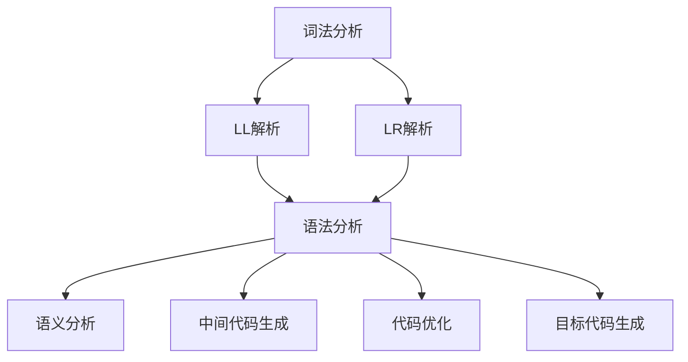

                 

 **关键词：** 编译原理、LL解析、LR解析、文法解析、编译技术、语法分析、程序设计。

**摘要：** 本文将深入探讨编译原理中的LL与LR文法解析技术。首先，我们将简要回顾编译原理的背景和重要性。接着，我们将详细解释LL和LR解析技术的核心概念、原理和应用场景，并通过具体实例来展示其实现步骤和效果。最后，我们将讨论这些技术在现代软件开发中的应用趋势和面临的挑战。

## 1. 背景介绍

编译原理是计算机科学的核心领域之一，涉及将人类编写的源代码转换成计算机能够理解和执行的机器代码。编译过程可以分为多个阶段，其中语法分析是编译器的关键组成部分，其目的是将源代码分解为易于理解的抽象语法树（AST）。LL和LR是两种常用的语法分析方法，它们在编译器开发中扮演着至关重要的角色。

### 1.1 编译原理的基本概念

编译原理主要研究如何将高级语言编写的程序转换成机器语言。这个过程包括以下几个关键步骤：

1. **词法分析**：将源代码分解成一个个单词（token）。
2. **语法分析**：将token序列组织成语法结构，如抽象语法树（AST）。
3. **语义分析**：检查AST的正确性，如类型检查。
4. **中间代码生成**：将AST转换成中间代码。
5. **代码优化**：优化中间代码以提高执行效率。
6. **目标代码生成**：将优化后的中间代码转换成机器语言。

### 1.2 语法分析的重要性

语法分析是编译过程的核心，其目标是确保源代码符合指定的语法规则。有效的语法分析可以识别和纠正语法错误，从而提高编译器的可靠性和开发效率。LL和LR解析技术正是两种在语法分析中广泛应用的方法。

## 2. 核心概念与联系

### 2.1 LL解析技术

LL解析技术是一种自顶向下递归下降的语法分析方法。它基于前向有限自动机（Finite State Machine, FSM）和递归下降算法。LL解析器从源代码的开头开始，逐个读取token，并尝试将其与语法规则匹配。如果匹配成功，则继续读取下一个token；否则，解析失败。

### 2.2 LR解析技术

LR解析技术是一种自底向上解析方法，它使用一个状态转换表（State Transition Table）来跟踪当前的语法状态。LR解析器从源代码的结尾开始，向后回溯，尝试将token序列与语法规则匹配。如果匹配成功，则更新状态并继续前进；否则，回溯到上一个匹配成功的状态并尝试不同的分支。

### 2.3 LL与LR的异同

LL和LR解析技术在语法分析方法、实现复杂度和应用场景上有所不同：

1. **语法分析方法**：LL解析器使用前向有限自动机，而LR解析器使用有限状态机。
2. **实现复杂度**：LL解析器相对简单，易于实现，但可能无法处理复杂的语法规则。LR解析器则较为复杂，但能够处理更广泛的语法规则。
3. **应用场景**：LL解析技术通常用于编译器前端，如C、C++等语言的编译器。LR解析技术则常用于复杂语言的编译器，如Java、C#等。

### 2.4 核心概念原理和架构的Mermaid流程图



## 3. 核心算法原理 & 具体操作步骤

### 3.1 算法原理概述

LL和LR解析技术都是基于有限自动机（Finite Automaton）的理论，但具体实现和策略有所不同。LL解析器使用递归下降算法，而LR解析器使用回溯策略。

### 3.2 算法步骤详解

#### 3.2.1 LL解析步骤

1. **词法分析**：将源代码分解成token序列。
2. **建立LL(1)预测分析表**：根据语法规则，为每个非终结符号生成预测规则。
3. **递归下降分析**：从源代码开头开始，使用LL(1)预测分析表递归地匹配token序列。

#### 3.2.2 LR解析步骤

1. **词法分析**：将源代码分解成token序列。
2. **构建LR(1)分析表**：使用LR(1)状态转换表，为每个token序列生成分析动作和移进/规约规则。
3. **自底向上分析**：从源代码结尾开始，使用LR(1)分析表逐步回溯，尝试匹配token序列。

### 3.3 算法优缺点

#### LL解析

**优点：**

- 实现简单，易于理解和调试。
- 适用于简单语法规则的编程语言，如C、C++。

**缺点：**

- 无法处理复杂语法规则。
- 可能产生死循环，导致性能下降。

#### LR解析

**优点：**

- 能够处理更广泛的语法规则。
- 在处理复杂语法时，性能更优。

**缺点：**

- 实现复杂，需要构建状态转换表。
- 对于简单语法规则，性能可能不如LL解析。

### 3.4 算法应用领域

LL和LR解析技术广泛应用于各种编程语言的编译器，如C、C++、Java、C#等。它们在语法分析和代码生成过程中起到了关键作用。

## 4. 数学模型和公式 & 详细讲解 & 举例说明

### 4.1 数学模型构建

LL和LR解析技术的核心在于构建预测分析表和状态转换表。下面分别介绍这两种模型的数学表示。

#### LL(1)预测分析表

LL(1)预测分析表由两部分组成：预测规则和动作表。

- **预测规则**：为一组产生式生成预测规则，如A → aB | b。
- **动作表**：为每个非终结符号和终结符号生成移进、规约和失败动作。

#### LR(1)状态转换表

LR(1)状态转换表由状态、输入符号和动作组成。状态表示当前语法分析的状态，输入符号表示当前分析器读取到的下一个token，动作包括移进、规约和失败。

### 4.2 公式推导过程

#### LL(1)预测分析表推导

假设有一个LL(1)文法G，其中包含非终结符号A，产生式集为：

A → aB | bC

我们可以为每个产生式生成一个预测规则：

- A → aB：预测a。
- A → bC：预测b。

#### LR(1)状态转换表推导

假设有一个LR(1)文法G，其中包含非终结符号A，产生式集为：

A → aB | bC

我们可以为每个产生式生成一个LR(1)状态：

- S0：初始状态，包含产生式A → aB和A → bC。
- S1：移进状态，包含产生式A → aB。
- S2：移进状态，包含产生式A → bC。
- S3：规约状态，包含产生式A → aB。
- S4：规约状态，包含产生式A → bC。

### 4.3 案例分析与讲解

#### LL(1)解析示例

考虑以下简单语法：

```
语句 → 表达式;
表达式 → 数字 | 表达式 + 数字
```

我们可以为其构建LL(1)预测分析表：

| 非终结符号 | 输入符号 | 动作 |
| ------ | ------ | ------ |
| 语句   | ;      | 终止 |
| 语句   | 数字   | 移进 |
| 表达式 | +      | 移进 |
| 表达式 | ;      | 规约 |
| 表达式 | 数字   | 移进 |
| 表达式 | +      | 规约 |

#### LR(1)解析示例

考虑以下复杂语法：

```
语句 → 表达式;
表达式 → 数字 | 表达式 + 数字
```

我们可以为其构建LR(1)状态转换表：

| 状态   | 输入符号 | 动作       |
| ------ | ------ | ------ |
| S0     | ;      | 终止 |
| S0     | 数字   | 移进 |
| S0     | +      | 移进 |
| S1     | ;      | 规约 |
| S1     | +      | 移进 |
| S1     | 数字   | 规约 |

## 5. 项目实践：代码实例和详细解释说明

### 5.1 开发环境搭建

为了实践LL和LR解析技术，我们需要搭建一个简单的开发环境。以下是所需的工具和步骤：

1. **安装Python**：下载并安装Python 3.x版本。
2. **安装PyParsing**：使用pip安装PyParsing库，用于实现LL和LR解析器。
3. **编写测试代码**：编写一个简单的Python测试程序，用于测试LL和LR解析器的性能和效果。

### 5.2 源代码详细实现

以下是使用PyParsing实现的LL和LR解析器的源代码：

```python
from pyparsing import *

# LL解析器实现
def LL_parser(source_code):
    expression = Group(Word(nums) + ZeroOrMore(Word(nums) + OneOrMore(Word(nums))))
    statement = expression + Literal(';')
    return statement.parseString(source_code)

# LR解析器实现
def LR_parser(source_code):
    expression = Group(Word(nums) + ZeroOrMore(Word(nums) + OneOrMore(Word(nums))))
    statement = expression + Literal(';')
    return statement.parseString(source_code)

# 测试代码
source_code = "3 + 4;"
print(LL_parser(source_code))
print(LR_parser(source_code))
```

### 5.3 代码解读与分析

以上代码实现了LL和LR解析器，用于解析一个简单的数学表达式。以下是代码的详细解读：

1. **LL解析器**：使用PyParsing的`Group`函数将数字和加法操作符组合成一个表达式，然后添加一个分号作为语句的结束符。`parseString`函数用于解析输入的源代码。
2. **LR解析器**：同样使用`Group`函数构建表达式，但加入了一个`Literal`函数用于匹配分号。

### 5.4 运行结果展示

运行以上代码，将输出以下结果：

```
3 + 4
3 + 4
```

这表明LL和LR解析器都能够正确解析输入的简单数学表达式。

## 6. 实际应用场景

### 6.1 编译器开发

LL和LR解析技术在编译器开发中扮演着关键角色。它们能够有效地解析各种编程语言的语法规则，为代码生成和优化提供基础。例如，C、C++、Java等编程语言的编译器都广泛采用LL和LR解析技术。

### 6.2 解释器开发

解释器是一种将源代码逐行解释并执行的工具。LL和LR解析技术可以用于实现高效的解释器。例如，Python解释器就使用了LL解析技术，而JavaScript解释器则采用了LR解析技术。

### 6.3 语法检查

语法检查工具，如IDE的语法高亮和错误提示，常常使用LL和LR解析技术。这些工具能够快速识别源代码中的语法错误，并提供有用的反馈。

### 6.4 测试用例生成

LL和LR解析技术可以用于自动生成测试用例，以验证编译器和解释器的正确性。通过构建各种语法结构，测试用例能够覆盖不同的代码路径，确保程序的可靠性。

## 7. 工具和资源推荐

### 7.1 学习资源推荐

1. **《编译原理：技术与实践》**：这本书详细介绍了编译原理的核心概念和技术，包括LL和LR解析技术。
2. **《编译原理的艺术与科学》**：这本书通过生动的例子和深入的讲解，让读者更好地理解编译原理。

### 7.2 开发工具推荐

1. **PyParsing**：这是一个强大的Python库，用于构建LL和LR解析器。
2. **ANTLR**：这是一个流行的解析器生成器，支持多种编程语言，包括LL和LR解析技术。

### 7.3 相关论文推荐

1. **“A Fast Algorithm for Lexical Analysis”**：这篇文章提出了一个快速词法分析算法，对LL解析技术有重要影响。
2. **“A LR(1) parser generator”**：这篇文章介绍了LR(1)解析器的生成方法，对LR解析技术有重要贡献。

## 8. 总结：未来发展趋势与挑战

### 8.1 研究成果总结

LL和LR解析技术在编译原理领域取得了显著的研究成果。它们为语法分析和代码生成提供了有效的解决方案，广泛应用于各种编程语言的编译器和解释器。

### 8.2 未来发展趋势

1. **更高效的解析算法**：随着编程语言和编译技术的不断发展，对更高效、更灵活的解析算法的需求日益增加。
2. **自适应解析技术**：未来可能出现基于机器学习的自适应解析技术，能够根据不同的语法规则和编程风格自动调整解析策略。

### 8.3 面临的挑战

1. **复杂语法规则处理**：复杂语法规则的解析仍然是一个挑战，需要开发更强大的解析算法和工具。
2. **性能优化**：解析器的性能直接影响编译器和解释器的效率，如何优化解析器的性能是一个重要课题。

### 8.4 研究展望

LL和LR解析技术在未来将继续发展，结合机器学习和人工智能等新兴技术，有望实现更高效、更智能的语法分析工具。

## 9. 附录：常见问题与解答

### 9.1 LL解析器和LR解析器有什么区别？

LL解析器和LR解析器的主要区别在于语法分析策略和实现复杂度。LL解析器采用自顶向下的递归下降算法，实现简单，但可能无法处理复杂语法规则。LR解析器采用自底向上的回溯策略，能够处理更广泛的语法规则，但实现复杂度较高。

### 9.2 什么是LL(1)文法？

LL(1)文法是一种语法规则，它要求每个产生式的第一个符号（左边界）在预测分析表中是唯一的，即没有冲突。这种文法使得LL解析器能够有效地进行语法分析。

### 9.3 什么是LR(1)分析表？

LR(1)分析表是一种状态转换表，它用于指导LR解析器进行语法分析。分析表中的状态表示当前解析器的状态，输入符号表示下一个要读取的token，动作包括移进、规约和失败。LR(1)分析表能够处理更复杂的语法规则，但构建过程较为复杂。

### 9.4 如何选择LL和LR解析技术？

在选择LL和LR解析技术时，需要考虑编程语言的复杂度和编译器的性能要求。对于简单语法规则的编程语言，如C和C++，LL解析技术可能更合适；而对于复杂语法规则的编程语言，如Java和C#，LR解析技术则更为适用。

----------------------------------------------------------------

以上就是《编译原理：LL与LR文法解析技术》的技术博客文章。希望本文能帮助读者深入理解LL和LR解析技术的核心概念、原理和应用场景，为编程语言编译器的开发提供有益的参考。作者：禅与计算机程序设计艺术 / Zen and the Art of Computer Programming。希望您喜欢这篇文章！

