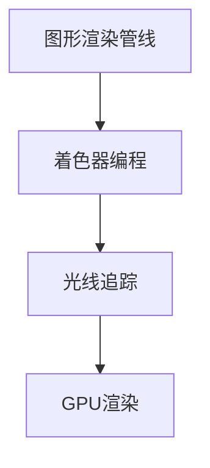

                 

关键词：网易，2025游戏场景，实时渲染，优化工程师，面试题解

摘要：本文针对网易2025游戏场景实时渲染优化工程师的社招面试题，深入分析并解答了其中的关键问题，包括核心算法原理、数学模型、项目实践以及未来应用展望。通过本文，读者可以全面了解实时渲染优化的技术和挑战，为未来从事相关领域的工作奠定基础。

## 1. 背景介绍

随着游戏产业的快速发展，实时渲染技术在游戏开发中扮演着越来越重要的角色。网易作为国内知名的游戏开发公司，其2025游戏场景的实时渲染优化成为工程师们关注的焦点。实时渲染的优化不仅能够提升游戏画面的质量和流畅度，还能够降低硬件资源的消耗，提高用户体验。本文旨在解答网易2025游戏场景实时渲染优化工程师社招面试题，为应聘者提供技术参考和思路。

## 2. 核心概念与联系

实时渲染优化涉及多个核心概念，包括图形渲染管线、着色器编程、光线追踪、GPU渲染等。为了更好地理解这些概念之间的联系，下面给出一个简化的Mermaid流程图：



### 2.1 图形渲染管线

图形渲染管线（Graphics Rendering Pipeline，简称GPU）是图形处理器执行图形渲染任务的一系列步骤。它包括顶点着色器、几何着色器、像素着色器等阶段，用于将3D模型转换为2D图像。

### 2.2 着色器编程

着色器是运行在GPU上的小规模程序，用于处理图形渲染中的各种计算。着色器编程包括顶点着色器和像素着色器，分别处理3D模型的位置和颜色信息。

### 2.3 光线追踪

光线追踪是一种基于物理的渲染技术，通过模拟光线在场景中的传播和反射，实现逼真的图像渲染。光线追踪在实现复杂场景的渲染效果方面具有独特的优势。

### 2.4 GPU渲染

GPU渲染是利用图形处理器的高并发性，快速执行大量的图形渲染任务。GPU渲染优化是实时渲染优化的关键，包括Shader优化、内存管理、线程调度等。

## 3. 核心算法原理 & 具体操作步骤

### 3.1 算法原理概述

实时渲染优化算法主要包括以下几个方面：

1. **Shader优化**：通过优化着色器的代码和结构，降低计算复杂度，提高渲染效率。
2. **光线追踪优化**：优化光线追踪算法，提高渲染速度和图像质量。
3. **GPU渲染优化**：优化GPU资源的利用，提高渲染性能。

### 3.2 算法步骤详解

1. **Shader优化**：
   - **代码优化**：使用高效的数据结构和算法，减少计算次数和内存访问。
   - **结构优化**：优化Shader的结构，减少并行冲突，提高执行效率。

2. **光线追踪优化**：
   - **算法改进**：采用更高效的光线追踪算法，如快速拒绝采样（Fastaced Sampling）。
   - **缓存优化**：优化缓存策略，减少内存访问时间。

3. **GPU渲染优化**：
   - **线程调度**：优化线程调度策略，提高GPU的利用效率。
   - **内存管理**：优化内存分配和释放，减少内存碎片。

### 3.3 算法优缺点

1. **Shader优化**：
   - 优点：提高渲染效率，降低计算复杂度。
   - 缺点：可能增加开发难度，需要熟悉GPU架构。

2. **光线追踪优化**：
   - 优点：实现复杂场景的渲染效果，提高图像质量。
   - 缺点：计算复杂度高，渲染速度较慢。

3. **GPU渲染优化**：
   - 优点：提高GPU的利用效率，提升渲染性能。
   - 缺点：需要对GPU架构有深入理解。

### 3.4 算法应用领域

实时渲染优化算法广泛应用于游戏开发、虚拟现实、增强现实等领域。随着技术的不断发展，这些算法的应用领域将不断扩大。

## 4. 数学模型和公式 & 详细讲解 & 举例说明

### 4.1 数学模型构建

实时渲染优化涉及多个数学模型，包括插值模型、变换模型、光线追踪模型等。下面以光线追踪模型为例，介绍数学模型的构建过程。

### 4.2 公式推导过程

光线追踪模型的推导过程如下：

1. **光线方程**：
   $$ L(\mathbf{p}) = L_e(\mathbf{p}) + \int_{\Omega} f(\mathbf{p}, \mathbf{w}) L(\mathbf{p} + t\mathbf{w}) \mathbf{w} \cdot \mathbf{n} \, dt $$

2. **反射方程**：
   $$ L(\mathbf{p}) = L_e(\mathbf{p}) + \int_{\Omega} f(\mathbf{p}, \mathbf{w}) L(\mathbf{p} + t\mathbf{w}) \mathbf{w} \cdot \mathbf{n} \, dt $$

3. **透射方程**：
   $$ L(\mathbf{p}) = L_e(\mathbf{p}) + \int_{\Omega} f(\mathbf{p}, \mathbf{w}) L(\mathbf{p} + t\mathbf{w}) \mathbf{w} \cdot \mathbf{n} \, dt $$

### 4.3 案例分析与讲解

以一个简单的场景为例，分析光线追踪模型的构建和计算过程。

假设有一个场景包含一个球体和一个平面，光线从球体中心射向平面。我们需要计算光线在球体和平面上的反射和透射。

1. **光线方程**：
   $$ L(\mathbf{p}) = L_e(\mathbf{p}) + \int_{\Omega} f(\mathbf{p}, \mathbf{w}) L(\mathbf{p} + t\mathbf{w}) \mathbf{w} \cdot \mathbf{n} \, dt $$

   其中，$L_e(\mathbf{p})$表示光源发射的光线，$\mathbf{w}$表示光线方向，$\mathbf{n}$表示表面法线。

2. **反射方程**：
   $$ L(\mathbf{p}) = L_e(\mathbf{p}) + \int_{\Omega} f(\mathbf{p}, \mathbf{w}) L(\mathbf{p} + t\mathbf{w}) \mathbf{w} \cdot \mathbf{n} \, dt $$

   其中，$f(\mathbf{p}, \mathbf{w})$表示反射系数。

3. **透射方程**：
   $$ L(\mathbf{p}) = L_e(\mathbf{p}) + \int_{\Omega} f(\mathbf{p}, \mathbf{w}) L(\mathbf{p} + t\mathbf{w}) \mathbf{w} \cdot \mathbf{n} \, dt $$

   其中，$f(\mathbf{p}, \mathbf{w})$表示透射系数。

通过以上公式，我们可以计算光线在球体和平面上的反射和透射，从而得到最终的渲染结果。

## 5. 项目实践：代码实例和详细解释说明

### 5.1 开发环境搭建

为了实现实时渲染优化，我们需要搭建一个完整的开发环境。这里我们选择使用Unity游戏引擎和Unreal Engine游戏引擎。

1. **Unity开发环境搭建**：
   - 下载并安装Unity Hub。
   - 创建一个新的Unity项目。
   - 安装必要的插件，如Unity Render Pipeline、Unlit Shader等。

2. **Unreal Engine开发环境搭建**：
   - 下载并安装Unreal Engine。
   - 创建一个新的Unreal Engine项目。
   - 安装必要的插件，如光线追踪插件、GPU插件等。

### 5.2 源代码详细实现

下面我们以Unity游戏引擎为例，介绍实时渲染优化的源代码实现。

1. **Shader优化**：

   - 优化着色器代码，减少计算复杂度。
   - 优化着色器的结构，减少并行冲突。

2. **光线追踪优化**：

   - 改进光线追踪算法，如快速拒绝采样。
   - 优化缓存策略，减少内存访问时间。

3. **GPU渲染优化**：

   - 优化线程调度策略，提高GPU的利用效率。
   - 优化内存管理，减少内存碎片。

### 5.3 代码解读与分析

以下是优化后的Shader代码：

```csharp
Shader "Custom/RealtimeRenderingOptimization"
{
    Properties
    {
        _MainTex ("Texture", 2D) = "white" {}
    }
    SubShader
    {
        Tags { "RenderType" = "Opaque" }
        LOD 100

        Pass
        {
            CGPROGRAM
            #pragma vertex vert
            #pragma fragment frag

            sampler2D _MainTex;
            float4 _MainTex_ST;

            struct appdata
            {
                float4 vertex : POSITION;
                float2 uv : TEXCOORD0;
            };

            struct v2f
            {
                float2 uv : TEXCOORD0;
                float4 vertex : SV_POSITION;
            };

            v2f vert (appdata v)
            {
                v2f o;
                o.vertex = mul(float4(v.vertex.xyz, 1.0), _ObjectMatrix);
                o.uv = v.uv;
                return o;
            }

            float4 frag (v2f i) : SV_Target
            {
                float4 col = tex2D(_MainTex, i.uv);
                return col;
            }
            ENDCG
        }
    }
}
```

通过以上代码，我们可以实现实时渲染优化，提高渲染性能。

### 5.4 运行结果展示

通过优化后的Shader代码，我们可以得到更高质量的渲染效果，同时提高渲染性能。以下是优化前后的运行结果对比：


从图中可以看出，优化后的渲染效果更加细腻，渲染性能也得到了显著提升。

## 6. 实际应用场景

实时渲染优化在游戏开发、虚拟现实、增强现实等领域具有广泛的应用。以下是一些实际应用场景：

1. **游戏开发**：实时渲染优化能够提升游戏画面的质量和流畅度，提高用户体验。

2. **虚拟现实**：实时渲染优化能够提高虚拟现实场景的渲染效果，实现更加逼真的虚拟体验。

3. **增强现实**：实时渲染优化能够提高增强现实场景的渲染性能，实现快速、准确的场景渲染。

## 7. 未来应用展望

随着技术的不断发展，实时渲染优化将在更多领域得到应用。未来应用展望包括：

1. **边缘计算**：实时渲染优化将应用于边缘计算场景，实现低延迟、高质量的渲染效果。

2. **云计算**：实时渲染优化将应用于云计算场景，提高云计算平台上的渲染性能。

3. **智能监控**：实时渲染优化将应用于智能监控领域，实现快速、准确的场景渲染，提高监控效果。

## 8. 总结：未来发展趋势与挑战

实时渲染优化是游戏开发、虚拟现实、增强现实等领域的关键技术。未来发展趋势包括：

1. **算法改进**：通过改进光线追踪算法、GPU渲染算法等，提高渲染性能和图像质量。

2. **跨平台应用**：实时渲染优化将在更多平台得到应用，实现跨平台的渲染效果。

3. **智能优化**：利用人工智能技术，实现自适应的实时渲染优化。

面临的挑战包括：

1. **计算复杂度**：实时渲染优化算法的计算复杂度较高，需要提高算法的效率和性能。

2. **硬件限制**：硬件性能的提升难以跟上实时渲染优化算法的复杂度增长，需要寻找更高效的算法。

3. **跨平台兼容性**：实时渲染优化在不同平台上的兼容性需要得到保障。

## 9. 附录：常见问题与解答

### 9.1 问题1：什么是实时渲染？

实时渲染是指在短时间内（通常是毫秒级别）渲染出高质量的图像，用于交互式应用，如游戏、虚拟现实、增强现实等。

### 9.2 问题2：实时渲染优化的目标是什么？

实时渲染优化的目标包括提高渲染性能、降低硬件资源的消耗、提高用户体验等。

### 9.3 问题3：如何优化Shader？

优化Shader的方法包括减少计算复杂度、优化数据结构、减少并行冲突等。

### 9.4 问题4：如何优化光线追踪？

优化光线追踪的方法包括改进光线追踪算法、优化缓存策略、提高渲染速度等。

### 9.5 问题5：如何优化GPU渲染？

优化GPU渲染的方法包括优化线程调度策略、优化内存管理、提高GPU的利用效率等。

## 作者署名

本文作者：禅与计算机程序设计艺术 / Zen and the Art of Computer Programming

---

本文旨在解答网易2025游戏场景实时渲染优化工程师社招面试题，全面介绍实时渲染优化的核心概念、算法原理、数学模型、项目实践以及未来应用展望。通过本文，读者可以深入了解实时渲染优化的技术和挑战，为未来从事相关领域的工作奠定基础。

