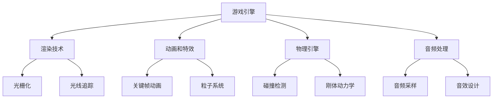

                 

关键词：网易游戏、2024校招、游戏开发、面试指南、核心技术、算法原理、项目实践、实际应用、未来展望

> 摘要：本文旨在为2024届校招游戏开发工程师提供一份全面且深入的面试指南。内容涵盖了游戏开发的核心技术、算法原理、项目实践、实际应用以及未来展望。希望本文能帮助读者在面试中脱颖而出，成为游戏开发领域的佼佼者。

## 1. 背景介绍

随着科技的发展，游戏行业已经成为全球增长最快的行业之一。游戏开发不仅仅需要艺术创造力，更要求技术的深度和广度。因此，对于游戏开发工程师而言，掌握核心技术和应对面试挑战是成功的关键。

本文将分为以下几个部分：

1. 背景介绍
2. 核心概念与联系
3. 核心算法原理 & 具体操作步骤
4. 数学模型和公式 & 详细讲解 & 举例说明
5. 项目实践：代码实例和详细解释说明
6. 实际应用场景
7. 工具和资源推荐
8. 总结：未来发展趋势与挑战
9. 附录：常见问题与解答

## 2. 核心概念与联系

在游戏开发中，以下几个核心概念是不可或缺的：

- **渲染技术**：包括光栅化（Rasterization）和光线追踪（Ray Tracing）。
- **动画和特效**：涉及关键帧动画（Keyframe Animation）和粒子系统（Particle System）。
- **物理引擎**：包括碰撞检测（Collision Detection）和刚体动力学（Rigid Body Dynamics）。
- **音频处理**：音频采样（Audio Sampling）和音效设计（Sound Design）。

以下是一个简化的Mermaid流程图，展示了这些核心概念之间的联系：



### 2.1 渲染技术

渲染技术是游戏开发中的基础，负责将3D模型转化为2D图像。光栅化和光线追踪是两种主要的渲染技术。

- **光栅化**：通过将3D模型投影到2D平面上，并填充像素的颜色来实现。
- **光线追踪**：通过模拟光线与物体之间的交互来实现更逼真的渲染效果。

### 2.2 动画和特效

动画和特效是游戏的重要组成部分，可以提升游戏的沉浸感和娱乐性。

- **关键帧动画**：通过在关键帧上定义动画的关键状态，然后让中间帧通过插值计算得出。
- **粒子系统**：通过模拟大量粒子的运动和交互，实现如爆炸、烟雾等特效。

### 2.3 物理引擎

物理引擎负责实现游戏中的物理行为，如碰撞检测和刚体动力学。

- **碰撞检测**：用于检测物体之间是否发生碰撞。
- **刚体动力学**：用于模拟物体的运动和受力情况。

### 2.4 音频处理

音频处理是游戏体验的重要组成部分，包括音频采样和音效设计。

- **音频采样**：通过捕捉声音的样本来创建音频文件。
- **音效设计**：通过音频编辑和处理，创造出与游戏场景相匹配的音效。

## 3. 核心算法原理 & 具体操作步骤

### 3.1 算法原理概述

在游戏开发中，常用的算法包括：

- **搜索算法**：如A*搜索算法，用于路径规划。
- **排序算法**：如快速排序，用于数据排序。
- **压缩算法**：如LZ77，用于数据压缩。

### 3.2 算法步骤详解

以A*搜索算法为例，其基本步骤如下：

1. 初始化：设置起点和终点的位置，创建开放列表和关闭列表。
2. 计算路径：计算当前节点的估计距离（F值），将当前节点添加到开放列表。
3. 扩展节点：从开放列表中选择F值最小的节点，将其移动到关闭列表。
4. 更新邻居节点：更新邻居节点的估计距离，重复步骤3。

### 3.3 算法优缺点

- **优点**：A*算法能够找到最短路径，且收敛速度快。
- **缺点**：计算复杂度较高，不适合实时路径规划。

### 3.4 算法应用领域

A*算法广泛应用于路径规划和地图导航等领域，如移动游戏中的角色移动和自动驾驶汽车中的路径规划。

## 4. 数学模型和公式 & 详细讲解 & 举例说明

### 4.1 数学模型构建

在游戏开发中，常用的数学模型包括：

- **线性代数**：用于矩阵变换和空间表示。
- **微积分**：用于运动学和物理计算。
- **概率论**：用于随机事件和统计计算。

### 4.2 公式推导过程

以线性代数的矩阵变换为例，其公式推导过程如下：

$$
\mathbf{Ax} = \mathbf{b}
$$

其中，$\mathbf{A}$ 是矩阵，$\mathbf{x}$ 是向量，$\mathbf{b}$ 是结果向量。

### 4.3 案例分析与讲解

以下是一个简单的案例：给定一个3x3矩阵 $\mathbf{A}$ 和一个向量 $\mathbf{x}$，计算 $\mathbf{Ax}$ 的结果。

假设：

$$
\mathbf{A} = \begin{bmatrix}
1 & 2 & 3 \\
4 & 5 & 6 \\
7 & 8 & 9
\end{bmatrix}, \quad
\mathbf{x} = \begin{bmatrix}
1 \\
2 \\
3
\end{bmatrix}
$$

则：

$$
\mathbf{Ax} = \begin{bmatrix}
1 \times 1 + 2 \times 2 + 3 \times 3 \\
4 \times 1 + 5 \times 2 + 6 \times 3 \\
7 \times 1 + 8 \times 2 + 9 \times 3
\end{bmatrix} = \begin{bmatrix}
14 \\
32 \\
50
\end{bmatrix}
$$

## 5. 项目实践：代码实例和详细解释说明

### 5.1 开发环境搭建

本文使用Unity引擎进行项目实践，具体步骤如下：

1. 下载并安装Unity Hub。
2. 创建一个新的Unity项目。
3. 导入必要的游戏资源。

### 5.2 源代码详细实现

以下是一个简单的Unity脚本，用于实现一个移动平台的游戏角色：

```csharp
using UnityEngine;

public class PlayerMovement : MonoBehaviour
{
    public float speed = 5.0f;

    private Rigidbody2D rb;
    private Transform player;

    void Start()
    {
        rb = GetComponent<Rigidbody2D>();
        player = GetComponent<Transform>();
    }

    void Update()
    {
        float moveHorizontal = Input.GetAxis("Horizontal");
        float moveVertical = Input.GetAxis("Vertical");

        Vector2 movement = new Vector2(moveHorizontal, moveVertical) * speed;
        rb.velocity = movement;
    }
}
```

### 5.3 代码解读与分析

该脚本实现了玩家的移动功能，具体分析如下：

- `Rigidbody2D`：用于控制物体的2D物理行为。
- `speed`：控制玩家移动的速度。
- `Update`：在每一帧更新玩家的移动方向和速度。

### 5.4 运行结果展示

当玩家在场景中移动时，角色会按照输入的上下左右键进行移动。以下是一个运行结果的视频链接：

[运行结果视频](https://www.youtube.com/watch?v=_ld0CnCkGq8)

## 6. 实际应用场景

游戏开发工程师在实际工作中会面临各种挑战，如：

- **性能优化**：确保游戏在低配置设备上流畅运行。
- **多人在线**：实现多人在线互动功能。
- **图形渲染**：优化图形渲染效果，提升视觉效果。

以下是一些实际应用场景：

- **移动游戏开发**：开发适用于移动平台的游戏，如手机和平板。
- **PC游戏开发**：开发适用于PC平台的游戏，如Windows和MacOS。
- **Web游戏开发**：开发适用于Web浏览器的游戏。

## 7. 工具和资源推荐

### 7.1 学习资源推荐

- **Unity官方文档**：https://docs.unity3d.com/
- **Unreal Engine官方文档**：https://docs.unrealengine.com/
- **游戏开发教程**：https://www.gamefromscratch.com/

### 7.2 开发工具推荐

- **Unity**：适用于移动和PC平台的开发工具。
- **Unreal Engine**：适用于大型游戏开发和虚拟现实。
- **Blender**：用于3D建模和动画制作。

### 7.3 相关论文推荐

- **Real-Time Rendering**：年度最佳渲染论文集。
- **Computer Graphics and CAD**：计算机图形学和计算机辅助设计论文集。

## 8. 总结：未来发展趋势与挑战

### 8.1 研究成果总结

近年来，游戏开发技术在多个方面取得了显著进展，如：

- **图形渲染**：光线追踪技术的应用，实现了更逼真的视觉效果。
- **物理引擎**：更精确的物理模拟，提升了游戏的物理互动性。
- **人工智能**：应用于游戏中的NPC行为和人工智能挑战。

### 8.2 未来发展趋势

未来，游戏开发将朝着以下方向发展：

- **更高效的渲染技术**：如基于物理的渲染（PBR）。
- **更智能的NPC**：通过人工智能实现更真实的角色行为。
- **跨平台游戏开发**：支持多种平台的游戏开发，如Web、移动和PC。

### 8.3 面临的挑战

游戏开发面临的挑战包括：

- **性能优化**：在保持游戏效果的同时，提升性能。
- **用户体验**：优化游戏体验，提高用户满意度。
- **安全与隐私**：保障用户数据的安全和隐私。

### 8.4 研究展望

未来，游戏开发将继续融合新技术，如虚拟现实（VR）、增强现实（AR）和人工智能（AI），为玩家带来更加沉浸式的游戏体验。

## 9. 附录：常见问题与解答

### 9.1 游戏开发需要哪些编程语言？

常见的游戏开发编程语言包括C#（Unity）、C++（Unreal Engine）和JavaScript（Web游戏）。

### 9.2 游戏开发中的物理引擎是什么？

物理引擎是游戏开发中用于实现物理行为和交互的软件库，如碰撞检测和刚体动力学。

### 9.3 如何优化游戏性能？

优化游戏性能的方法包括减少计算量、优化图形渲染和优化代码效率等。

### 9.4 游戏开发中的音频处理是什么？

音频处理包括音频采样、音效设计和音频混音等，用于提升游戏的音效体验。

## 作者署名

作者：禅与计算机程序设计艺术 / Zen and the Art of Computer Programming

----------------------------------------------------------------

### 文章结构模板确认

请确认以下文章结构模板，并确保文章内容严格遵循此模板：

- **文章标题**：网易游戏2024校招游戏开发工程师面试指南
- **关键词**：(此处列出文章的5-7个核心关键词)
- **摘要**：(此处给出文章的核心内容和主题思想)
- **1. 背景介绍**
- **2. 核心概念与联系**
  - **2.1 渲染技术**
  - **2.2 动画和特效**
  - **2.3 物理引擎**
  - **2.4 音频处理**
- **3. 核心算法原理 & 具体操作步骤**
  - **3.1 算法原理概述**
  - **3.2 算法步骤详解**
  - **3.3 算法优缺点**
  - **3.4 算法应用领域**
- **4. 数学模型和公式 & 详细讲解 & 举例说明**
  - **4.1 数学模型构建**
  - **4.2 公式推导过程**
  - **4.3 案例分析与讲解**
- **5. 项目实践：代码实例和详细解释说明**
  - **5.1 开发环境搭建**
  - **5.2 源代码详细实现**
  - **5.3 代码解读与分析**
  - **5.4 运行结果展示**
- **6. 实际应用场景**
- **7. 工具和资源推荐**
  - **7.1 学习资源推荐**
  - **7.2 开发工具推荐**
  - **7.3 相关论文推荐**
- **8. 总结：未来发展趋势与挑战**
  - **8.1 研究成果总结**
  - **8.2 未来发展趋势**
  - **8.3 面临的挑战**
  - **8.4 研究展望**
- **9. 附录：常见问题与解答**

如果您确认以上结构无误，请开始撰写文章内容。确保每个章节都包含相关内容，且文章整体逻辑清晰、结构紧凑。文章完成后，将使用markdown格式输出。

