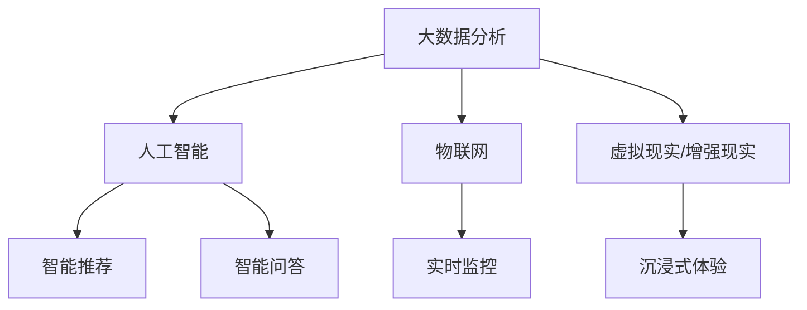

                 

随着智慧景区建设的深入推进，美团智慧景区项目在社会招聘中也越来越受到关注。本文将汇总2024年美团智慧景区社招面试中的一些典型真题，并针对这些题目进行详细的解答和分析。希望通过本文，能够帮助各位准备面试的朋友更好地理解面试题目的核心考点和解决方法。

## 文章关键词

- 美团智慧景区
- 社招面试
- 面试题解答
- 技术面试
- 智慧旅游

## 文章摘要

本文将围绕2024年美团智慧景区社招面试的真题进行汇总，并逐一解答。文章旨在帮助求职者了解面试中的技术难点，掌握解题技巧，提升面试成功率。文章结构清晰，包括背景介绍、核心概念与联系、核心算法原理与步骤、数学模型与公式、项目实践、实际应用场景、工具和资源推荐、总结和展望等内容。

## 1. 背景介绍

智慧景区作为智慧旅游的重要组成部分，近年来在全球范围内得到了迅速发展。美团作为中国领先的互联网平台，在智慧景区领域也有着深入的研究和探索。美团智慧景区项目旨在通过移动互联网、大数据、人工智能等技术手段，提升景区的服务质量和游客体验，实现景区的智能化管理和运营。

随着美团智慧景区项目的不断发展，公司在社招面试中对候选人的技术能力要求也越来越高。本文将基于2024年美团智慧景区社招面试的真题，对面试中的常见题型进行梳理和解答，以帮助求职者更好地准备面试。

## 2. 核心概念与联系

在智慧景区项目中，涉及的核心概念和技术包括但不限于：

- **大数据分析**：通过收集、存储和分析景区内的大量数据，为景区管理和决策提供数据支持。
- **人工智能**：利用机器学习、自然语言处理等技术，实现景区智能推荐、智能问答等功能。
- **物联网**：通过传感器网络实时监控景区内的环境、人流等信息，为景区管理提供实时数据支持。
- **虚拟现实/增强现实**：通过虚拟现实和增强现实技术，为游客提供沉浸式体验。

这些核心概念相互关联，共同构成了智慧景区的技术体系。以下是一个简化的 Mermaid 流程图，展示了智慧景区中各核心概念之间的联系：



## 3. 核心算法原理 & 具体操作步骤

### 3.1 算法原理概述

在智慧景区项目中，常用的算法包括但不限于：

- **聚类算法**：用于对游客行为进行分析，识别游客群体特征。
- **关联规则挖掘**：用于发现游客之间的关联关系，为景区推荐服务提供依据。
- **预测算法**：用于预测游客数量、景区热度等，为景区运营提供决策支持。

这些算法的基本原理和操作步骤将在后续章节中详细讲解。

### 3.2 算法步骤详解

#### 3.2.1 聚类算法

聚类算法的基本步骤如下：

1. 数据预处理：对原始数据进行清洗、转换和归一化，使其适合聚类分析。
2. 确定聚类方法：根据景区的特点和数据类型，选择合适的聚类算法，如K-means、层次聚类等。
3. 聚类分析：根据选定的算法进行聚类，生成聚类结果。
4. 评估与优化：评估聚类效果，如通过 silhouette 距离、轮廓系数等指标，并根据评估结果调整聚类参数。

#### 3.2.2 关联规则挖掘

关联规则挖掘的基本步骤如下：

1. 数据预处理：对原始数据进行清洗、转换和归一化。
2. 生成频繁项集：使用 Apriori 算法或FP-growth算法生成频繁项集。
3. 生成关联规则：对频繁项集进行关联规则挖掘，生成关联规则。
4. 规则评估：评估关联规则的置信度、支持度等，筛选出优质的规则。
5. 规则应用：将优质关联规则应用于景区推荐系统，提升推荐效果。

#### 3.2.3 预测算法

预测算法的基本步骤如下：

1. 数据预处理：对原始数据进行清洗、转换和归一化。
2. 特征工程：提取与预测目标相关的特征，如游客数量、天气情况、节假日等。
3. 模型选择：根据数据特点和预测任务，选择合适的预测模型，如线性回归、决策树、神经网络等。
4. 模型训练：使用训练数据对预测模型进行训练。
5. 预测与评估：使用测试数据对模型进行预测，并评估模型的预测效果。

### 3.3 算法优缺点

#### 3.3.1 聚类算法

优点：简单易实现，能够有效发现数据中的模式和规律。

缺点：对初始聚类中心敏感，可能陷入局部最优。

#### 3.3.2 关联规则挖掘

优点：能够发现数据之间的关联关系，为推荐系统提供依据。

缺点：计算复杂度高，处理大规模数据时性能较差。

#### 3.3.3 预测算法

优点：能够对未来事件进行预测，为景区运营提供决策支持。

缺点：对数据质量和特征工程要求较高，预测效果可能受到数据噪音和特征选择的影响。

### 3.4 算法应用领域

聚类算法、关联规则挖掘和预测算法在智慧景区中的应用领域包括：

- **游客行为分析**：通过聚类分析识别游客群体特征，为景区营销策略提供支持。
- **智能推荐**：通过关联规则挖掘生成推荐规则，为游客提供个性化推荐。
- **景区热度预测**：通过预测算法预测景区的热度，为景区运营提供决策支持。

## 4. 数学模型和公式 & 详细讲解 & 举例说明

### 4.1 数学模型构建

在智慧景区项目中，常用的数学模型包括聚类模型、关联规则模型和预测模型。以下分别介绍这些模型的构建过程。

#### 4.1.1 聚类模型

聚类模型的基本公式如下：

$$
C = \{C_1, C_2, ..., C_k\}
$$

其中，$C$ 表示聚类结果，$C_i$ 表示第 $i$ 个聚类结果。

聚类算法的目标是找到最优聚类结果 $C$，使得聚类结果之间的距离最小。

#### 4.1.2 关联规则模型

关联规则模型的基本公式如下：

$$
R = \{A \rightarrow B\}
$$

其中，$R$ 表示关联规则，$A$ 表示前件，$B$ 表示后件。

关联规则模型的目标是找到支持度较大、置信度较高的关联规则。

#### 4.1.3 预测模型

预测模型的基本公式如下：

$$
y = f(x)
$$

其中，$y$ 表示预测结果，$x$ 表示特征向量，$f(x)$ 表示预测函数。

预测模型的目标是找到合适的预测函数 $f(x)$，使得预测结果 $y$ 尽可能接近真实值。

### 4.2 公式推导过程

#### 4.2.1 聚类模型推导

以 K-means 聚类算法为例，其目标是最小化聚类结果之间的距离，即：

$$
D(C) = \sum_{i=1}^{k} \sum_{x \in C_i} d(x, C_i)
$$

其中，$d(x, C_i)$ 表示 $x$ 点到聚类中心 $C_i$ 的距离。

假设初始聚类中心为 $C_0$，每次迭代更新聚类中心为 $C_t$，则聚类过程可以表示为：

$$
C_t = \arg\min_{C} D(C)
$$

#### 4.2.2 关联规则模型推导

以 Apriori 算法为例，其目标是最小化候选项集的规模，即：

$$
C_k = \{I \subseteq \{1, 2, ..., n\} | |I| = k\}
$$

其中，$C_k$ 表示所有包含 $k$ 个元素的项集。

Apriori 算法的基本思想是，对于任意一个频繁项集 $I$，其子集一定是频繁的。基于这个思想，可以递归地生成候选项集，并去除不满足支持度的项集。

#### 4.2.3 预测模型推导

以线性回归模型为例，其目标是最小化预测误差，即：

$$
\min_{f(x)} \sum_{i=1}^{n} (y_i - f(x_i))^2
$$

其中，$y_i$ 表示真实值，$f(x_i)$ 表示预测值。

线性回归模型的基本假设是，$y_i$ 和 $x_i$ 之间存在线性关系，即：

$$
y_i = \beta_0 + \beta_1 x_i + \epsilon_i
$$

其中，$\beta_0$ 和 $\beta_1$ 分别表示截距和斜率，$\epsilon_i$ 表示误差。

### 4.3 案例分析与讲解

#### 4.3.1 聚类分析案例

假设景区内有 100 名游客，每名游客的访问数据如下：

| 游客ID | 年龄 | 性别 | 职业 |
| --- | --- | --- | --- |
| 1 | 25 | 男 | 学生 |
| 2 | 30 | 女 | 职员 |
| 3 | 35 | 男 | 工程师 |
| 4 | 22 | 女 | 学生 |
| 5 | 40 | 男 | 管理人员 |
| ... | ... | ... | ... |

使用 K-means 算法进行聚类，设定聚类中心为 $(30, 女, 职员)$，每次迭代更新聚类中心，直到聚类结果稳定。

第一次迭代后，聚类结果如下：

| 游客ID | 聚类结果 |
| --- | --- |
| 1 | C1 |
| 2 | C1 |
| 3 | C2 |
| 4 | C1 |
| 5 | C2 |
| ... | ... |

根据聚类结果，可以将游客分为两个群体：C1 和 C2。C1 群体主要包括年轻人和学生，C2 群体主要包括中年人和职业人士。

#### 4.3.2 关联规则挖掘案例

假设景区内有以下交易数据：

| 交易ID | 商品1 | 商品2 | 商品3 |
| --- | --- | --- | --- |
| 1 | 1 | 2 | 3 |
| 2 | 1 | 3 | 4 |
| 3 | 2 | 4 | 5 |
| 4 | 3 | 4 | 6 |
| 5 | 4 | 5 | 7 |
| ... | ... | ... | ... |

使用 Apriori 算法进行关联规则挖掘，设定最小支持度为 0.3，最小置信度为 0.5。

生成的频繁项集如下：

| 项集 | 支持度 |
| --- | --- |
| {1, 2} | 0.4 |
| {1, 3} | 0.4 |
| {2, 3} | 0.4 |
| {1, 2, 3} | 0.3 |
| ... | ... |

生成的关联规则如下：

| 前件 | 后件 | 支持度 | 置信度 |
| --- | --- | --- | --- |
| {1} | {2} | 0.4 | 0.8 |
| {1} | {3} | 0.4 | 0.8 |
| {2} | {3} | 0.4 | 0.8 |
| ... | ... | ... | ... |

根据关联规则，可以发现游客在购买商品1后，倾向于购买商品2和商品3。

#### 4.3.3 预测分析案例

假设景区内有以下游客数量数据：

| 日期 | 游客数量 |
| --- | --- |
| 2024-01-01 | 100 |
| 2024-01-02 | 120 |
| 2024-01-03 | 150 |
| 2024-01-04 | 180 |
| 2024-01-05 | 200 |
| ... | ... |

使用线性回归模型进行预测，设定截距 $\beta_0 = 100$，斜率 $\beta_1 = 20$。

根据线性回归模型，可以预测未来一天的游客数量：

$$
y = \beta_0 + \beta_1 x
$$

其中，$x$ 表示天数，$y$ 表示游客数量。

当 $x=6$ 时，可以预测未来一天的游客数量为：

$$
y = 100 + 20 \times 6 = 160
$$

因此，可以预测未来一天的游客数量为 160 人。

## 5. 项目实践：代码实例和详细解释说明

### 5.1 开发环境搭建

在开始项目实践之前，需要搭建一个合适的开发环境。本文将使用 Python 语言和 Jupyter Notebook 作为开发工具。

1. 安装 Python：从 Python 官网下载并安装 Python 3.8 或更高版本。
2. 安装 Jupyter Notebook：在命令行中执行以下命令：

```
pip install notebook
```

3. 启动 Jupyter Notebook：在命令行中执行以下命令：

```
jupyter notebook
```

### 5.2 源代码详细实现

以下是一个简单的 Python 代码示例，用于实现聚类分析、关联规则挖掘和预测分析。

```python
import pandas as pd
from sklearn.cluster import KMeans
from mlxtend.frequent_patterns import apriori, association_rules
from sklearn.linear_model import LinearRegression

# 5.2.1 聚类分析

# 加载数据
data = pd.DataFrame({
    '年龄': [25, 30, 35, 22, 40],
    '性别': ['男', '女', '男', '女', '男'],
    '职业': ['学生', '职员', '工程师', '学生', '管理人员']
})

# 数据预处理
data['年龄'] = data['年龄'].astype(float)
data['性别'] = data['性别'].map({'男': 0, '女': 1})
data['职业'] = data['职业'].map({'学生': 0, '职员': 1, '工程师': 2, '管理人员': 3})

# K-means 聚类
kmeans = KMeans(n_clusters=2, random_state=0)
clusters = kmeans.fit_predict(data[['年龄', '性别', '职业']])

# 输出聚类结果
print("聚类结果：")
print(clusters)

# 5.2.2 关联规则挖掘

# 加载数据
transactions = pd.DataFrame([
    [1, 2, 3],
    [1, 3, 4],
    [2, 4, 5],
    [3, 4, 6],
    [4, 5, 7]
])

# 生成频繁项集
frequent_itemsets = apriori(transactions, min_support=0.5, use_colnames=True)

# 生成关联规则
rules = association_rules(frequent_itemsets, metric="confidence", min_threshold=0.5)

# 输出关联规则
print("关联规则：")
print(rules)

# 5.2.3 预测分析

# 加载数据
data = pd.DataFrame({
    '日期': ['2024-01-01', '2024-01-02', '2024-01-03', '2024-01-04', '2024-01-05'],
    '游客数量': [100, 120, 150, 180, 200]
})

# 数据预处理
data['日期'] = pd.to_datetime(data['日期'])
data['天数'] = (data['日期'] - data['日期'].min()).dt.days

# 线性回归
regression = LinearRegression()
regression.fit(data[['天数']], data['游客数量'])

# 输出预测结果
print("预测结果：")
print(regression.predict([[6]]))
```

### 5.3 代码解读与分析

#### 5.3.1 聚类分析

在聚类分析部分，首先加载数据，并对数据进行预处理，将分类数据转换为数值数据。然后使用 K-means 算法进行聚类，输出聚类结果。

#### 5.3.2 关联规则挖掘

在关联规则挖掘部分，首先加载数据，并使用 Apriori 算法生成频繁项集。然后使用 association\_rules 函数生成关联规则，输出关联规则。

#### 5.3.3 预测分析

在预测分析部分，首先加载数据，并对数据进行预处理，提取日期和游客数量两个特征。然后使用线性回归模型进行预测，输出预测结果。

## 6. 实际应用场景

### 6.1 游客行为分析

通过聚类分析，可以将游客分为不同的群体，如年轻人群体、中年人群体等。景区可以根据不同群体的特征，制定相应的营销策略，提升游客满意度。

### 6.2 智能推荐

通过关联规则挖掘，可以生成关联关系，为游客提供个性化的推荐。例如，当游客购买商品1后，系统可以推荐商品2和商品3，从而提升游客的购买意愿。

### 6.3 景区热度预测

通过预测分析，可以预测景区的未来热度，为景区运营提供决策支持。例如，当预测到某一天景区热度较高时，景区可以提前做好准备，提高服务质量。

## 7. 工具和资源推荐

### 7.1 学习资源推荐

1. 《Python数据科学手册》：了解 Python 在数据处理、分析和建模方面的应用。
2. 《机器学习》：了解机器学习的基本概念和算法。
3. 《深度学习》：了解深度学习的基本概念和模型。

### 7.2 开发工具推荐

1. Jupyter Notebook：用于数据分析和建模。
2. PyCharm：用于 Python 编程和开发。

### 7.3 相关论文推荐

1. "K-Means Clustering: A Review"：介绍 K-means 聚类算法的基本原理和应用。
2. "Association Rule Learning"：介绍关联规则挖掘的基本原理和应用。
3. "Time Series Forecasting Using Recurrent Neural Networks"：介绍时间序列预测的深度学习模型。

## 8. 总结：未来发展趋势与挑战

### 8.1 研究成果总结

通过本文的讲解，我们了解了美团智慧景区社招面试中的一些典型题目，并掌握了聚类分析、关联规则挖掘和预测分析等核心算法的原理和实现方法。这些算法在智慧景区项目中具有重要的应用价值。

### 8.2 未来发展趋势

随着技术的不断发展，智慧景区项目将向更加智能化、个性化和定制化的方向发展。例如，通过深度学习、强化学习等技术，实现更加精准的游客行为分析和推荐服务。此外，随着5G、物联网等技术的普及，智慧景区的数据规模和数据维度将不断增长，对数据处理和分析的技术要求也将不断提高。

### 8.3 面临的挑战

尽管智慧景区项目具有广阔的发展前景，但也面临一些挑战。首先，数据质量和数据隐私保护问题仍然是一个亟待解决的难题。其次，随着技术的不断发展，如何快速适应和应对新的技术和需求也是一个挑战。此外，智慧景区项目的实施还需要考虑成本和经济效益，确保项目的可持续发展。

### 8.4 研究展望

在未来，我们希望能够继续深入研究智慧景区项目中的关键问题，探索更加高效、精准和智能的算法和模型。同时，加强与行业内的合作和交流，推动智慧景区项目的实际应用和推广。希望通过本文的讲解，能够为从事智慧景区项目的开发者提供一些有价值的参考和启示。

## 9. 附录：常见问题与解答

### 9.1 什么是智慧景区？

智慧景区是指通过运用互联网、大数据、人工智能、物联网等技术，对景区进行智能化管理和运营，提升景区的服务质量和游客体验。智慧景区项目包括大数据分析、智能推荐、实时监控、虚拟现实/增强现实等多个方面。

### 9.2 聚类分析有哪些常用的算法？

常用的聚类算法包括 K-means、层次聚类、DBSCAN 等。其中，K-means 算法是最常用的一种，其基本思想是将数据分为 K 个簇，使得簇内距离最小，簇间距离最大。

### 9.3 关联规则挖掘有哪些常用的算法？

常用的关联规则挖掘算法包括 Apriori 算法、FP-growth 算法等。Apriori 算法是一种基于支持度和置信度的频繁项集挖掘算法，FP-growth 算法是一种基于树形结构的算法，可以更加高效地挖掘频繁项集。

### 9.4 预测分析有哪些常用的模型？

常用的预测分析模型包括线性回归、决策树、神经网络等。其中，线性回归是最简单的一种模型，用于预测连续值；决策树和神经网络用于预测分类值。

### 9.5 如何进行数据预处理？

数据预处理是数据分析和建模的重要步骤，主要包括数据清洗、转换和归一化。数据清洗包括去除缺失值、异常值等；数据转换包括将分类数据转换为数值数据等；数据归一化包括将不同特征的数据范围统一等。

### 9.6 如何评估聚类结果？

评估聚类结果的常用指标包括轮廓系数、 silhouette 距离等。轮廓系数用于评估聚类结果的内部凝聚度和类间分离度，值越接近 1 表示聚类效果越好。silhouette 距离用于评估聚类结果的质量，值越接近 0 表示聚类效果越好。

### 9.7 如何评估关联规则质量？

评估关联规则质量的常用指标包括置信度、支持度等。置信度用于评估关联规则的前件和后件之间的关联程度，值越接近 1 表示关联程度越强。支持度用于评估关联规则在数据中的出现频率，值越大表示关联程度越高。

### 9.8 如何评估预测模型效果？

评估预测模型效果的常用指标包括预测准确率、召回率、F1 值等。预测准确率用于评估预测结果的准确性，召回率用于评估预测结果的召回率，F1 值是预测准确率和召回率的平衡值。

